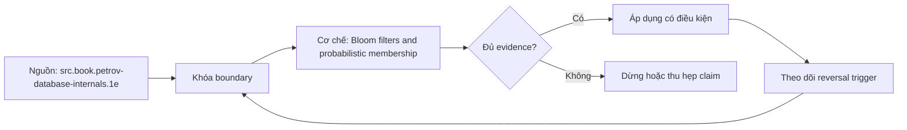

# Bloom filters and probabilistic membership

**Tóm tắt bản chất:** k hashes set bits; query missing bit proves absent, all set means maybe; false-positive rate depends m,n,k Sai boundary ở `Bloom filter probabilistic negative test` làm kết quả có vẻ đúng trong happy path nhưng không chịu được failure hoặc changed constraint.

> [!abstract] Câu hỏi trung tâm
> Làm thế nào mô hình, kiểm chứng và áp dụng Bloom filter probabilistic negative test?

## Nỗi Đau & Động Lực

k hashes set bits; query missing bit proves absent, all set means maybe; false-positive rate depends m,n,k Với `wiki.de-foundation.bloom-filters-probabilistic-membership`, điểm phải khóa là state transition và invariant; nếu trường nào chưa biết thì ghi unknown và nêu impact-if-wrong thay vì tự điền mặc định.

Không có mô hình này, lỗi thường lộ ở consumer sau cùng: output sai, latency vọt, resource không được giải phóng hoặc lịch sử không còn tái hiện được. Chi phí thật của `Bloom filters and probabilistic membership` vì thế nằm ở thời gian chẩn đoán và phạm vi phục hồi, không nằm ở số dòng syntax.

## Cơ Chế Tác Động

no false negatives only if build/query hash/domain consistent and filter complete; delete unsupported without variant Với `wiki.de-foundation.bloom-filters-probabilistic-membership`, điểm phải khóa là identity, ownership và boundary; nếu trường nào chưa biết thì ghi unknown và nêu impact-if-wrong thay vì tự điền mặc định.

Hãy tách declared state, executed state và published state của `Bloom filter probabilistic negative test`. Một command thành công chỉ là executed signal; muốn kết luận cần đối soát consumer-visible invariant và trạng thái còn lại sau restart hoặc replay.

## Bản Đồ Quyết Định

underestimated n saturates bits; schema/canonicalization mismatch creates false negatives in integration Với `wiki.de-foundation.bloom-filters-probabilistic-membership`, điểm phải khóa là failure path và recovery; nếu trường nào chưa biết thì ghi unknown và nêu impact-if-wrong thay vì tự điền mặc định.

Quy tắc mặc định cho `Bloom filters and probabilistic membership` là chọn phương án đơn giản nhất qua được hard constraints, rồi ghi rõ điều kiện đảo. Bảng quyết định tối thiểu gồm workload, identity, state owner, time/memory budget, failure domain và khả năng rollback.

## Case Study Thực Chiến: Bloom filters and probabilistic membership

use to avoid expensive negative lookup when false positives acceptable; never as authority for presence Với `wiki.de-foundation.bloom-filters-probabilistic-membership`, điểm phải khóa là decision trade-off và reversal trigger; nếu trường nào chưa biết thì ghi unknown và nêu impact-if-wrong thay vì tự điền mặc định.

Case dùng fixture nhỏ nhưng phải giữ cơ chế chi phối. Trước khi chạy, learner viết expected transition; sau khi chạy, họ đối chiếu raw artifact với oracle và giải thích mọi khác biệt thay vì sửa expected cho khớp output.

## Góc Khuất & Ngộ Nhận

m,n,k, bit density, observed FP, hash/version và authoritative lookup reconciliation Với `wiki.de-foundation.bloom-filters-probabilistic-membership`, điểm phải khóa là evidence package và oracle; nếu trường nào chưa biết thì ghi unknown và nêu impact-if-wrong thay vì tự điền mặc định.

**Hiểu lầm:** Happy path chạy nhanh nghĩa là thiết kế đúng. **Thực tế:** underestimated n saturates bits; schema/canonicalization mismatch creates false negatives in integration **Vì sao nghe hợp lý:** case nhỏ thường không chạm capacity, concurrency, failure hoặc version boundary.

**Hiểu lầm:** Tool hoặc API tự bảo đảm semantics. **Thực tế:** guarantee chỉ tồn tại trong scope và state đã công bố. **Vì sao nghe hợp lý:** syntax che mất protocol phía dưới.

## Nếu Bạn Dạy Lại Điều Này...

double n and change canonicalization to test model and contract Với `wiki.de-foundation.bloom-filters-probabilistic-membership`, điểm phải khóa là changed-constraint transfer; nếu trường nào chưa biết thì ghi unknown và nêu impact-if-wrong thay vì tự điền mặc định.

Hook dạy lại bắt đầu bằng một dự đoán dễ sai về `Bloom filter probabilistic negative test`. Bài tập seed đổi đúng một constraint, yêu cầu learner giữ hoặc đảo quyết định và chỉ ra evidence nào đủ mạnh để thuyết phục một reviewer không tham dự buổi học.

## Ma trận kiểm chứng từng mệnh đề

Protocol riêng của `Bloom filters and probabilistic membership` là: m,n,k, bit density, observed FP, hash/version và authoritative lookup reconciliation Mỗi probe nối input boundary với failure signal và oracle có thể bác bỏ kết luận.

### Probe 1: state transition và invariant

**Mệnh đề cần kiểm.** k hashes set bits; query missing bit proves absent, all set means maybe; false-positive rate depends m,n,k

**Thiết kế phép thử cho `wiki.de-foundation.bloom-filters-probabilistic-membership`.** Với `wiki.de-foundation.bloom-filters-probabilistic-membership`, tạo positive và negative control chỉ khác một điều kiện; khóa input snapshot, phiên bản, seed, identity và state ban đầu. Viết expected result trước execution để tránh đổi tiêu chí sau khi nhìn output.

**Bằng chứng cần giữ.** Lưu command hoặc harness, raw observation, transition trước–sau, coverage và limitation. Kết luận chỉ đạt khi oracle độc lập khớp ở đúng grain; nếu chưa chạy, phần này vẫn là protocol chứ không phải observation.

### Probe 2: identity, ownership và boundary

**Mệnh đề cần kiểm.** no false negatives only if build/query hash/domain consistent and filter complete; delete unsupported without variant

**Thiết kế phép thử cho `wiki.de-foundation.bloom-filters-probabilistic-membership`.** Với `wiki.de-foundation.bloom-filters-probabilistic-membership`, tạo boundary case ngay trước và sau ngưỡng; khóa input snapshot, phiên bản, seed, identity và state ban đầu. Viết expected result trước execution để tránh đổi tiêu chí sau khi nhìn output.

**Bằng chứng cần giữ.** Lưu command hoặc harness, raw observation, transition trước–sau, coverage và limitation. Kết luận chỉ đạt khi oracle độc lập khớp ở đúng grain; nếu chưa chạy, phần này vẫn là protocol chứ không phải observation.

### Probe 3: failure path và recovery

**Mệnh đề cần kiểm.** underestimated n saturates bits; schema/canonicalization mismatch creates false negatives in integration

**Thiết kế phép thử cho `wiki.de-foundation.bloom-filters-probabilistic-membership`.** Với `wiki.de-foundation.bloom-filters-probabilistic-membership`, tạo replay cùng identity với state khác; khóa input snapshot, phiên bản, seed, identity và state ban đầu. Viết expected result trước execution để tránh đổi tiêu chí sau khi nhìn output.

**Bằng chứng cần giữ.** Lưu command hoặc harness, raw observation, transition trước–sau, coverage và limitation. Kết luận chỉ đạt khi oracle độc lập khớp ở đúng grain; nếu chưa chạy, phần này vẫn là protocol chứ không phải observation.

### Probe 4: decision trade-off và reversal trigger

**Mệnh đề cần kiểm.** use to avoid expensive negative lookup when false positives acceptable; never as authority for presence

**Thiết kế phép thử cho `wiki.de-foundation.bloom-filters-probabilistic-membership`.** Với `wiki.de-foundation.bloom-filters-probabilistic-membership`, tạo failure inject trước và sau durable transition; khóa input snapshot, phiên bản, seed, identity và state ban đầu. Viết expected result trước execution để tránh đổi tiêu chí sau khi nhìn output.

**Bằng chứng cần giữ.** Lưu command hoặc harness, raw observation, transition trước–sau, coverage và limitation. Kết luận chỉ đạt khi oracle độc lập khớp ở đúng grain; nếu chưa chạy, phần này vẫn là protocol chứ không phải observation.

### Probe 5: evidence package và oracle

**Mệnh đề cần kiểm.** m,n,k, bit density, observed FP, hash/version và authoritative lookup reconciliation

**Thiết kế phép thử cho `wiki.de-foundation.bloom-filters-probabilistic-membership`.** Với `wiki.de-foundation.bloom-filters-probabilistic-membership`, tạo changed scale làm cost model đổi; khóa input snapshot, phiên bản, seed, identity và state ban đầu. Viết expected result trước execution để tránh đổi tiêu chí sau khi nhìn output.

**Bằng chứng cần giữ.** Lưu command hoặc harness, raw observation, transition trước–sau, coverage và limitation. Kết luận chỉ đạt khi oracle độc lập khớp ở đúng grain; nếu chưa chạy, phần này vẫn là protocol chứ không phải observation.

### Probe 6: changed-constraint transfer

**Mệnh đề cần kiểm.** double n and change canonicalization to test model and contract

**Thiết kế phép thử cho `wiki.de-foundation.bloom-filters-probabilistic-membership`.** Với `wiki.de-foundation.bloom-filters-probabilistic-membership`, tạo adversarial order hoặc skew; khóa input snapshot, phiên bản, seed, identity và state ban đầu. Viết expected result trước execution để tránh đổi tiêu chí sau khi nhìn output.

**Bằng chứng cần giữ.** Lưu command hoặc harness, raw observation, transition trước–sau, coverage và limitation. Kết luận chỉ đạt khi oracle độc lập khớp ở đúng grain; nếu chưa chạy, phần này vẫn là protocol chứ không phải observation.

### Probe 7: state transition và invariant

**Mệnh đề cần kiểm.** k hashes set bits; query missing bit proves absent, all set means maybe; false-positive rate depends m,n,k

**Thiết kế phép thử cho `wiki.de-foundation.bloom-filters-probabilistic-membership`.** Với `wiki.de-foundation.bloom-filters-probabilistic-membership`, tạo fresh environment không cache; khóa input snapshot, phiên bản, seed, identity và state ban đầu. Viết expected result trước execution để tránh đổi tiêu chí sau khi nhìn output.

**Bằng chứng cần giữ.** Lưu command hoặc harness, raw observation, transition trước–sau, coverage và limitation. Kết luận chỉ đạt khi oracle độc lập khớp ở đúng grain; nếu chưa chạy, phần này vẫn là protocol chứ không phải observation.

### Probe 8: identity, ownership và boundary

**Mệnh đề cần kiểm.** no false negatives only if build/query hash/domain consistent and filter complete; delete unsupported without variant

**Thiết kế phép thử cho `wiki.de-foundation.bloom-filters-probabilistic-membership`.** Với `wiki.de-foundation.bloom-filters-probabilistic-membership`, tạo independent oracle không dùng chung implementation; khóa input snapshot, phiên bản, seed, identity và state ban đầu. Viết expected result trước execution để tránh đổi tiêu chí sau khi nhìn output.

**Bằng chứng cần giữ.** Lưu command hoặc harness, raw observation, transition trước–sau, coverage và limitation. Kết luận chỉ đạt khi oracle độc lập khớp ở đúng grain; nếu chưa chạy, phần này vẫn là protocol chứ không phải observation.

### Probe 9: failure path và recovery

**Mệnh đề cần kiểm.** underestimated n saturates bits; schema/canonicalization mismatch creates false negatives in integration

**Thiết kế phép thử cho `wiki.de-foundation.bloom-filters-probabilistic-membership`.** Với `wiki.de-foundation.bloom-filters-probabilistic-membership`, tạo partial progress rồi restart; khóa input snapshot, phiên bản, seed, identity và state ban đầu. Viết expected result trước execution để tránh đổi tiêu chí sau khi nhìn output.

**Bằng chứng cần giữ.** Lưu command hoặc harness, raw observation, transition trước–sau, coverage và limitation. Kết luận chỉ đạt khi oracle độc lập khớp ở đúng grain; nếu chưa chạy, phần này vẫn là protocol chứ không phải observation.

### Probe 10: decision trade-off và reversal trigger

**Mệnh đề cần kiểm.** use to avoid expensive negative lookup when false positives acceptable; never as authority for presence

**Thiết kế phép thử cho `wiki.de-foundation.bloom-filters-probabilistic-membership`.** Với `wiki.de-foundation.bloom-filters-probabilistic-membership`, tạo missing evidence phải abstain; khóa input snapshot, phiên bản, seed, identity và state ban đầu. Viết expected result trước execution để tránh đổi tiêu chí sau khi nhìn output.

**Bằng chứng cần giữ.** Lưu command hoặc harness, raw observation, transition trước–sau, coverage và limitation. Kết luận chỉ đạt khi oracle độc lập khớp ở đúng grain; nếu chưa chạy, phần này vẫn là protocol chứ không phải observation.

### Probe 11: evidence package và oracle

**Mệnh đề cần kiểm.** m,n,k, bit density, observed FP, hash/version và authoritative lookup reconciliation

**Thiết kế phép thử cho `wiki.de-foundation.bloom-filters-probabilistic-membership`.** Với `wiki.de-foundation.bloom-filters-probabilistic-membership`, tạo reviewer tái hiện từ package; khóa input snapshot, phiên bản, seed, identity và state ban đầu. Viết expected result trước execution để tránh đổi tiêu chí sau khi nhìn output.

**Bằng chứng cần giữ.** Lưu command hoặc harness, raw observation, transition trước–sau, coverage và limitation. Kết luận chỉ đạt khi oracle độc lập khớp ở đúng grain; nếu chưa chạy, phần này vẫn là protocol chứ không phải observation.

### Probe 12: changed-constraint transfer

**Mệnh đề cần kiểm.** double n and change canonicalization to test model and contract

**Thiết kế phép thử cho `wiki.de-foundation.bloom-filters-probabilistic-membership`.** Với `wiki.de-foundation.bloom-filters-probabilistic-membership`, tạo constraint đổi đủ để quyết định đảo; khóa input snapshot, phiên bản, seed, identity và state ban đầu. Viết expected result trước execution để tránh đổi tiêu chí sau khi nhìn output.

**Bằng chứng cần giữ.** Lưu command hoặc harness, raw observation, transition trước–sau, coverage và limitation. Kết luận chỉ đạt khi oracle độc lập khớp ở đúng grain; nếu chưa chạy, phần này vẫn là protocol chứ không phải observation.

## Tự Kiểm Tra Nhanh

1. Boundary đầu tiên của `Bloom filter probabilistic negative test` nằm ở đâu?

<details><summary>Đáp án</summary>no false negatives only if build/query hash/domain consistent and filter complete; delete unsupported without variant</details>

2. Failure nào dễ tạo kết quả xanh giả nhất?

<details><summary>Đáp án</summary>underestimated n saturates bits; schema/canonicalization mismatch creates false negatives in integration</details>

3. Constraint nào khiến quyết định phải đảo?

<details><summary>Đáp án</summary>double n and change canonicalization to test model and contract</details>

## Giới hạn và điều chưa cho phép kết luận

- Lab của `Bloom filters and probabilistic membership` chưa được tuyên bố đã chạy trên production; note mô tả curriculum và expected evidence.
- Mọi kết luận phụ thuộc version, workload, operating system, interpreter/compiler hoặc hardware phải được kiểm lại trên target.
- Concept key `ck.de.bloom-filters-probabilistic-membership` đã được owner phê duyệt `canonical`; note thuộc canonical registry coverage. Trạng thái này không tự chứng minh learner mastery.
- Note giữ trạng thái `review` cho tới khi owner duyệt semantics và learner artifact.

## Reference
1. [[SRC-PETROV-DATABASE-INTERNALS-1E]]

## Source coverage

| Source slice | Locator | Kiến thức phải giữ | Vị trí | Trạng thái | Ngoài phạm vi |
|---|---|---|---|---|---|
| [[SRC-PETROV-DATABASE-INTERNALS-1E]] — `src.book.petrov-database-internals.1e` | Chapter 7 PDF 167–210 | cơ chế và boundary liên quan trực tiếp tới `Bloom filter probabilistic negative test` | các mục cơ chế, quyết định và probe | Đã phủ | phần ngoài objective DE-L041 |

## Key takeaways
- use to avoid expensive negative lookup when false positives acceptable; never as authority for presence
- m,n,k, bit density, observed FP, hash/version và authoritative lookup reconciliation
- `Bloom filter probabilistic negative test` chỉ có nghĩa trong scope, identity, state và version đã ghi.
- Trước khi lab chạy, đây là note có provenance và protocol, chưa phải production evidence hay bằng chứng mastery.

<!-- ATOMIC-EXECUTION-CAPSULE:START -->

## Execution capsule — kiểm chứng `wiki.de-foundation.bloom-filters-probabilistic-membership`

> [!important] Phân loại mệnh đề
> Với `wiki.de-foundation.bloom-filters-probabilistic-membership`, sơ đồ, ví dụ và artifact về **Bloom filters and probabilistic membership** là **synthesis để kiểm chứng**; chúng không phải trích dẫn hay case nguyên văn của nguồn.

### Sơ đồ cơ chế và điểm kiểm soát



Đọc sơ đồ `wiki.de-foundation.bloom-filters-probabilistic-membership` từ trái sang phải: source chỉ cung cấp claim ban đầu cho **Bloom filters and probabilistic membership**; quyết định chỉ được đi tiếp sau khi boundary, evidence và điều kiện đảo quyết định đã hiện hữu.

### Artifact thực thi tối thiểu

```yaml
concept_id: "wiki.de-foundation.bloom-filters-probabilistic-membership"
concept: "Bloom filters and probabilistic membership"
primary_question: "Làm thế nào mô hình, kiểm chứng và áp dụng Bloom filter probabilistic negative test?"
decision_contract:
  input_boundary: "Ghi population, thời điểm, owner và điều chưa biết"
  hard_constraints:
    - "Không vượt quyền hoặc privacy boundary"
    - "Không dùng cùng một assumption làm cả implementation và oracle"
  accept_when: "Có observation phân biệt được các lựa chọn"
  reversal_trigger: "Một hard constraint sai hoặc evidence mới đổi recommendation"
evidence_to_keep:
  - "input snapshot"
  - "chosen and rejected options"
  - "independent review result"
```

Artifact của `wiki.de-foundation.bloom-filters-probabilistic-membership` buộc người dùng ghi boundary, oracle và reversal trigger cho **Bloom filters and probabilistic membership**. Các giá trị minh họa phải được thay bằng evidence thật trước khi dùng cho quyết định.

<!-- ATOMIC-EXECUTION-CAPSULE:END -->
