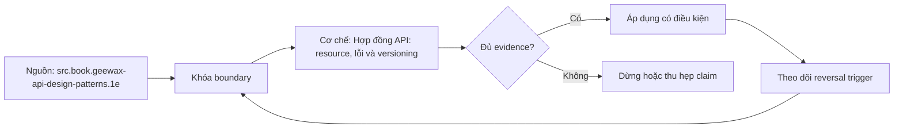

# Hợp đồng API: resource, lỗi và versioning

> [!abstract] Câu hỏi trung tâm
> Consumer phụ thuộc vào resource shape, method semantics, error codes, ordering và pagination behavior. API ổn định không chỉ là endpoint trả JSON; nó là contract có invariant, compatibility rule, examples và phép kiểm từ phía consumer.

## 1. Bắt đầu từ resource và use case

Resource biểu diễn một khái niệm nghiệp vụ có identity và lifecycle. Với hệ quản lý công việc:

```json
{
  "id": "task_01J...",
  "title": "Load daily sales",
  "status": "pending",
  "created_at": "2026-09-28T09:00:00Z",
  "version": 3
}
```

Không thiết kế đường dẫn theo tên bảng hoặc động từ implementation như `/runCreateTaskProcedure`. Dùng danh từ nghiệp vụ và operation rõ:

- `POST /tasks` tạo task;
- `GET /tasks/{task_id}` đọc representation;
- `GET /tasks` liệt kê;
- `POST /tasks/{task_id}:cancel` hoặc action phù hợp khi cancel có domain semantics không tương đương delete.

CRUD không diễn tả mọi transition. Nếu `cancel` cần rule trạng thái, audit và idempotency, action contract rõ hơn giả vờ đó là xóa resource.

## 2. Method semantics và retry

HTTP method cung cấp semantics chung, nhưng application contract quyết định side effect cụ thể.

| Method | Intent thường gặp | Retry consideration |
|---|---|---|
| GET | đọc representation | safe theo contract, nhưng vẫn có cost |
| PUT | thay thế/upsert tại URI đã biết | idempotent nếu implementation giữ semantics |
| PATCH | cập nhật một phần | phụ thuộc patch operation và concurrency |
| POST | tạo/action | cần idempotency key nếu retry có thể lặp side effect |
| DELETE | xóa/đánh dấu xóa | idempotent về target state, response có thể khác |

Tên method không bảo vệ khỏi bug. `GET` làm thay đổi trạng thái là contract sai; `POST` có idempotency key vẫn cần atomic reservation và lưu outcome.

> [!source-fact]
> Kurose và Ross trình bày request line, HTTP methods, response structure và status code ở §2.2.3, trang in 131-135. Chi tiết semantics hiện hành cần đối chiếu RFC/documentation mới khi triển khai production.

## 3. Contract bốn phần cho mỗi operation

### Input

Path/query/header/body, type, required/optional, range, format và unknown-field policy.

### Output

Status, headers, body schema, ordering và visibility semantics.

### Error

Stable error code, status mapping, field violations, retryability và outcome certainty.

### Side effect

State transition, transaction boundary, emitted event và idempotency behavior.

OpenAPI/schema mô tả phần lớn shape nhưng không đủ cho ordering, consistency, idempotency và business invariant; các mục này cần prose + examples + tests.

## 4. Validation theo ba lớp

1. **Syntactic:** JSON parse, field type, format.
2. **Structural/constraint:** required, length, enum, range.
3. **Business:** state transition, uniqueness, permission, cross-field invariant.

Handler thực hiện hai lớp đầu hoặc gọi validator ở boundary. Application/domain xử lý business rule. Error response vẫn dùng một envelope nhưng code và retryability khác nhau.

## 5. Error envelope thống nhất

```json
{
  "error": {
    "code": "TASK_INVALID_TRANSITION",
    "message": "Không thể hủy task đã hoàn tất.",
    "trace_id": "01J...",
    "violations": [
      {"field": "status", "reason": "must_not_be_completed"}
    ],
    "retryable": false
  }
}
```

- `code` ổn định cho chương trình;
- `message` phục vụ người đọc, có thể localization;
- `trace_id` nối log/trace, không lộ internal stack;
- `violations` dành cho field-level error;
- `retryable` chỉ ghi khi service có policy đáng tin; client vẫn cần bounded retry.

Không để consumer parse message text. Không trả stack trace, SQL hoặc secret. Một status chung `400` cho mọi lỗi làm mất distinction giữa malformed input, conflict, auth và server defect.

## 6. Status và application error

Status phản ánh lớp HTTP; error code phản ánh domain/application. Mapping cần nhất quán:

| Trường hợp | Status thường phù hợp | Stable code ví dụ |
|---|---:|---|
| JSON/type sai | 400 | `REQUEST_MALFORMED` |
| chưa xác thực | 401 | `AUTH_REQUIRED` |
| không được phép | 403 | `TASK_FORBIDDEN` |
| không tồn tại | 404 | `TASK_NOT_FOUND` |
| version/state conflict | 409 | `TASK_VERSION_CONFLICT` |
| field violation | 422 hoặc policy đã chọn | `TASK_VALIDATION_FAILED` |
| unexpected defect | 500 | `INTERNAL_ERROR` |

Không có mapping phổ quát cho mọi API. Policy cần được ghi thành contract, kiểm bằng test và giữ ổn định giữa các version.

## 7. List contract phải định nghĩa ordering

Pagination không đúng nếu ordering không deterministic. Chọn sort key ổn định và total order, thường là `(created_at DESC, id DESC)` để `id` phá hòa.

List contract nêu:

- default/max page size;
- default và allowed sort;
- filter semantics;
- snapshot/consistency expectation;
- cursor opaque;
- behavior khi cursor invalid/expired;
- next-page indicator;
- duplicate/omission guarantee trong phạm vi nào.

## 8. Offset, page number và cursor

### Offset/page number

Đơn giản, cho phép nhảy trang, nhưng insert/delete trước offset làm item dịch chuyển; query offset lớn có thể tốn chi phí.

### Cursor/keyset

Cursor mã hóa vị trí cuối theo sort key. Query tiếp theo dùng điều kiện sau vị trí này theo order. Nó ổn định hơn dưới insert mới trước cursor và thường hiệu quả với index phù hợp.

### Snapshot token

Giữ view nhất quán theo snapshot/version, mạnh hơn nhưng cần storage/lifecycle và có thể tốn tài nguyên. Phù hợp export hoặc workflow cần snapshot semantics.

> [!source-fact]
> Geewax trình bày pagination token như opaque continuation state và yêu cầu request/response nhất quán trong API list methods. *API Design Patterns*, phần pagination, PDF 556-566.

## 9. Thiết kế cursor

Payload logic có thể gồm:

```json
{
  "sort": "created_at_desc,id_desc",
  "last_created_at": "2026-09-28T09:00:00Z",
  "last_id": "task_01J...",
  "filter_hash": "...",
  "schema_version": 1
}
```

Cursor được encode và có thể ký để chống sửa. Không để consumer phụ thuộc cấu trúc bên trong; server được quyền đổi representation theo version. Cursor phải ràng với filter/sort để không dùng token của query này cho query khác.

## 10. Chứng minh không trùng không sót

Với order `(created_at DESC, id DESC)`, trang sau dùng predicate:

$$
(created\_at < t_{last}) \lor (created\_at = t_{last} \land id < id_{last})
$$

Giả định `created_at` và `id` của item không đổi trong lúc duyệt. Nếu sort key mutable, item có thể di chuyển qua cursor và bị trùng/sót. Khi cần guarantee mạnh, dùng immutable key hoặc snapshot semantics.

Thí nghiệm:

1. tạo dataset có nhiều record cùng timestamp;
2. đọc trang 1, giữ cursor;
3. chèn record mới nằm trước cursor;
4. đọc các trang tiếp;
5. xác nhận union của item baseline sau cursor không trùng/sót;
6. ghi rõ record mới có được kỳ vọng xuất hiện trong traversal hiện tại không.

Không trùng không sót luôn cần scope. Cursor không tự tạo snapshot của dữ liệu đang đổi.

## 11. Filtering và sorting là phần của contract

Filter cần grammar, allowed fields, operator, case/timezone/null semantics và error khi không hỗ trợ. Không chuyển query string trực tiếp thành SQL.

Sort cần allowlist và tie-breaker. Nếu thêm sort option mới, cursor format/index có thể đổi; token version giúp server decode đúng hoặc trả lỗi cursor hết hạn rõ ràng.

## 12. Compatibility không chỉ là schema

Thay đổi có thể phá consumer dù JSON Schema vẫn hợp lệ:

- đổi enum semantics;
- đổi default ordering;
- đổi error code/status;
- đổi null thành absent;
- tăng payload vượt giới hạn;
- thêm field nhưng consumer strict reject unknown;
- đổi precision/timezone;
- đổi pagination consistency.

Contract test phải dựa trên consumer observation và example thật, không chỉ diff schema.

## 13. Ba thay đổi của DE-L102

### Thêm field tùy chọn

Provider thêm `completed_at` nullable/optional. Consumer tolerant phải bỏ qua field chưa dùng. Provider verification và consumer test đều pass. Nếu consumer strict, thay đổi có thể phá và policy phải phản ánh thực tế đó.

### Xóa field bắt buộc

Provider bỏ `status`; consumer dùng field này phải fail contract trước deploy. Migration cần thêm replacement field, chuyển consumer, xác nhận adoption rồi mới xóa.

### Đổi kiểu

Đổi `version` từ integer sang string là breaking change dù giá trị nhìn giống. Tạo field/version mới hoặc compatibility adapter; contract test phải chặn thay đổi trực tiếp.

## 14. Versioning strategies

| Cách | Ưu điểm | Chi phí/rủi ro |
|---|---|---|
| path `/v1` | rõ trong URL, route/cache dễ thấy | resource URI đổi; dễ nhân đôi implementation |
| header/media type | URI ổn định, negotiation rõ | client/tooling khó quan sát hơn |
| query parameter | dễ thử | dễ bị bỏ qua trong cache/routing policy |

Versioning không thay deprecation process. Cần inventory consumer, adoption telemetry, compatibility window và sunset communication.

> [!source-fact]
> Newman thảo luận semantic versioning, backward compatibility, coexistence version và expand/contract trong *Building Microservices*, 2e, PDF 191-197.

## 15. Additive evolution và deprecation

Quy trình phá vỡ an toàn:

1. thêm representation/field/endpoint mới;
2. giữ contract cũ;
3. cập nhật contract artifact và examples;
4. chuyển consumer;
5. đo usage của contract cũ;
6. thông báo deadline;
7. chặn consumer mới dùng contract cũ nếu policy cho phép;
8. xóa sau khi adoption evidence đạt.

Không dùng ngày sunset làm bằng chứng duy nhất; cần telemetry và owner của consumer quan trọng.

## 16. Optimistic concurrency

Resource có `version` hoặc ETag giúp tránh lost update:

1. client đọc version 3;
2. client gửi update kèm precondition version 3;
3. server chỉ update nếu current vẫn 3;
4. nếu current 4, trả conflict có code ổn định;
5. client đọc lại và quyết định merge/retry.

Blind retry trên conflict có thể ghi đè ý định user. Retry policy thuộc use case, không chỉ transport.

## 17. Idempotency cho create/action

Client gửi `Idempotency-Key`; server atomically liên kết key với request fingerprint và outcome. Cùng key + cùng request trả lại outcome cũ; cùng key + payload khác trả conflict. Record cần TTL phù hợp business retry window.

Nếu server chỉ cache response sau side effect mà crash ở giữa, duplicate vẫn xảy ra. Reservation và side effect phải nằm trong transaction hoặc có reconciliation/outbox phù hợp.

## 18. API specification và contract tests

Spec gồm schema, examples, status/error table, pagination và compatibility policy. Consumer contract kiểm interaction consumer thực dùng; provider chạy verification trong CI.

Test tối thiểu:

- create success và validation error;
- get found/not found;
- cancel valid/invalid transition;
- list page size boundary;
- cursor invalid/tampered;
- concurrent insert traversal;
- optional field addition;
- required field removal;
- type change;
- stable error envelope.

## 19. Failure modes

- endpoint đặt theo table/procedure;
- status 200 kèm mọi loại lỗi trong body;
- consumer parse message text;
- offset pagination nhưng tuyên bố không trùng/sót dưới concurrent writes;
- cursor không gắn filter/sort;
- sort thiếu tie-breaker;
- thêm field rồi giả định mọi consumer tolerant;
- giữ version nhưng đổi type/semantics;
- version mới copy toàn code và sửa hai nơi;
- idempotency key không gắn request fingerprint.

## 20. Bằng chứng cho DE-L102

- resource contract cho create/get/list/cancel;
- error envelope và status/error matrix;
- cursor format/version cùng ordering invariant;
- thí nghiệm concurrent insert có tập kết quả đối chiếu;
- consumer/provider contract artifacts;
- kết quả ba thay đổi: additive pass, removal/type change bị chặn;
- deprecation/compatibility policy.

## 21. Câu hỏi tự kiểm tra

1. Vì sao resource action đôi khi rõ hơn ép mọi thứ vào CRUD?
2. Cursor pagination cần total order và immutable key ra sao?
3. Thêm field tùy chọn có thể phá consumer nào?
4. HTTP status và stable application error code khác vai trò gì?
5. Versioning vì sao không thay deprecation/adoption telemetry?

## 22. Giới hạn

- Status mapping và version strategy phụ thuộc API ecosystem; note không áp một lựa chọn cho mọi hệ.
- Cursor guarantee phụ thuộc ordering, mutability và isolation; không mặc định snapshot.
- OpenAPI/schema không biểu diễn đầy đủ semantic compatibility.
- Security như OAuth scope, rate limit và abuse prevention cần note riêng.
- Lab DE-L102 chưa được chạy; các payload/test là teaching specification.

## 23. Liên kết chương trình

- Tiền đề: [[The Request Lifecycle End to End|Vòng đời request từ đầu đến cuối]], [[Consumer-Provider Contract Testing|Kiểm thử hợp đồng giữa producer và consumer]] và lesson pagination trước đó.
- Bài áp dụng: `DE-L102`.

## Reference
1. [[SRC-GEEWAX-API-DESIGN-PATTERNS-1E]]: resource-oriented design, errors, pagination và versioning, các phần liên quan; PDF 556-566, 642-676.
2. [[SRC-NEWMAN-BUILDING-MICROSERVICES-2E]]: backward compatibility, semantic versioning, coexistence và expand/contract, PDF 191-197.
3. [[SRC-KUROSE-ROSS-NETWORKING-8E]]: HTTP message, method và status foundation, §2.2.3, trang in 131-135.

> [!synthesis]
> Contract bốn phần, error envelope và bộ ba thay đổi DE-L102 là cấu trúc tổng hợp từ resource/pagination/versioning guidance cùng HTTP semantics. Các default cụ thể vẫn phải được quyết định theo consumer và domain.

## Source coverage

| Source slice | Nội dung phải giữ | Vị trí trong note | Trạng thái |
|---|---|---|---|
| [[SRC-GEEWAX-API-DESIGN-PATTERNS-1E]], pp. 556-566 | list, ordering, pagination và cursor | §§7-11 | Đã trình bày invariant, cursor design và phép kiểm trùng/sót |
| [[SRC-GEEWAX-API-DESIGN-PATTERNS-1E]], pp. 642-676 | compatibility, versioning, deprecation và resource evolution | §§12-18 | Đã trình bày ba loại thay đổi, strategy và contract tests |
| [[SRC-NEWMAN-BUILDING-MICROSERVICES-2E]], pp. 191-197 | backward compatibility, coexistence và expand/contract | §§12, 15 | Đã trình bày compatibility window và additive evolution |
| [[SRC-KUROSE-ROSS-NETWORKING-8E]], §2.2.3 pp. 131-135 | HTTP message, method và status foundation | §§2, 4-6 | Đã dùng làm nền; application error policy được tách khỏi transport status |
| Tổng hợp API contract | resource design, validation layers, error envelope, optimistic concurrency và idempotency | §§1-6, 16-18 | Đã trình bày như tổng hợp có điều kiện, không gán thành một pattern nguyên văn |

Không có mapping status/error hoặc versioning strategy phổ quát. Các lựa chọn còn phụ thuộc use case, consumer inventory và policy của hệ thống.

## Key takeaways
- API contract bao gồm semantics, ordering, lỗi và side effect, không chỉ JSON shape.
- Cursor cần total order, tie-breaker và scope guarantee rõ.
- Error code ổn định cho máy; message không phải contract để parse.
- Additive change vẫn cần consumer policy; removal và type change phải bị contract gate chặn.

<!-- ATOMIC-EXECUTION-CAPSULE:START -->

## Execution capsule: kiểm chứng `wiki.backend.api-contract-resources-errors-versioning`

> [!important] Phân loại mệnh đề
> Với `wiki.backend.api-contract-resources-errors-versioning`, sơ đồ, ví dụ và artifact về **Hợp đồng API: resource, lỗi và versioning** là **synthesis để kiểm chứng**; chúng không phải trích dẫn hay case nguyên văn của nguồn.

### Sơ đồ cơ chế và điểm kiểm soát



Đọc sơ đồ `wiki.backend.api-contract-resources-errors-versioning` từ trái sang phải: source chỉ cung cấp claim ban đầu cho **Hợp đồng API: resource, lỗi và versioning**; quyết định chỉ được đi tiếp sau khi boundary, evidence và điều kiện đảo quyết định đã hiện hữu.

### Tự kiểm tra trước khi tái sử dụng

1. Bạn có thể trả lời `Thiết kế API resource, error và pagination thế nào để consumer dùng ổn định và thay đổi contract có kiểm soát?` bằng một câu mà không kéo thêm concept thứ hai không?
2. Source locator nào đỡ cho claim, và phần nào chỉ là synthesis trong note?
3. Observation nào khiến bạn dừng, thu hẹp hoặc đảo quyết định?
4. Artifact nào cho phép một reviewer độc lập tái hiện kết quả?

<!-- ATOMIC-EXECUTION-CAPSULE:END -->
