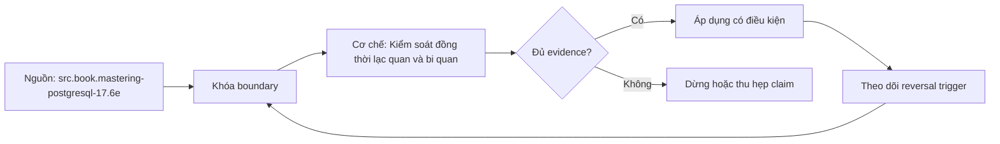

# Kiểm soát đồng thời lạc quan và bi quan

> [!abstract] Câu hỏi trung tâm
> Hai request có thể cùng đọc một phiên bản rồi cùng ghi. Transaction riêng lẻ của mỗi request vẫn atomic nhưng kết quả nghiệp vụ có thể sai. Cần nhận diện anomaly, chọn nơi phát hiện xung đột, quy định cách caller xử lý và đo tác động lên thông lượng thay vì chỉ thêm lock theo thói quen.

## 1. Atomicity của từng request chưa đủ

Giả sử bộ đếm tồn kho đang bằng 10. Hai request A và B cùng đọc 10, mỗi request trừ 1 trong memory rồi ghi 9. Mỗi transaction đều commit thành công, nhưng kết quả đúng phải là 8. Một thay đổi đã biến mất mà database không báo lỗi.

```text
t0  A đọc quantity = 10
t1  B đọc quantity = 10
t2  A ghi quantity = 9, commit
t3  B ghi quantity = 9, commit
```

Đây là lost update theo mô hình read-modify-write. Lỗi không nằm ở việc thiếu `BEGIN`/`COMMIT`; lỗi nằm ở chỗ điều kiện giá trị chưa đổi kể từ lúc tôi đọc không được kiểm, hoặc việc đọc và thay đổi không được serialize.

> [!synthesis]
> L103 bảo vệ một use case khỏi trạng thái dở dang. L104 bổ sung điều kiện khi nhiều use case hợp lệ chạy đồng thời. Hai bài giải hai lớp lỗi khác nhau.

## 2. Phải mô tả invariant trước khi chọn cơ chế

Không có race condition là mục tiêu quá mơ hồ. Cần viết invariant có thể kiểm:

- tồn kho không âm;
- số phiên bản tăng đúng một lần cho mỗi thay đổi được chấp nhận;
- tổng tiền bằng tổng line item của phiên bản đã xác nhận;
- một seat chỉ có một owner tại một thời điểm;
- trạng thái chỉ đi theo cạnh hợp lệ của state machine;
- nếu hai editor sửa hai field độc lập, policy phải nói rõ merge hay conflict.

Từ invariant mới suy ra atomic unit và conflict domain. Nếu chỉ một cột cần tăng, một câu `UPDATE ... SET quantity = quantity + 1` có thể tốt hơn cả optimistic lẫn pessimistic read-modify-write. Nếu một quyết định phụ thuộc nhiều row, predicate hoặc external state, bài toán rộng hơn một row lock.

## 3. Ba họ giải pháp không nên trộn

| Họ giải pháp | Cách làm | Conflict được phát hiện khi nào | Chi phí chính |
|---|---|---|---|
| Atomic statement | đưa điều kiện và phép đổi vào một statement | tại database khi statement chạy | biểu thức và invariant phải biểu diễn được trong database |
| Optimistic concurrency | đọc version, ghi có điều kiện theo version cũ | lúc update/commit | conflict tạo retry hoặc yêu cầu người dùng hòa giải |
| Pessimistic locking | khóa resource trước khi quyết định và ghi | trước vùng tới hạn | chờ lock, deadlock, giữ connection và giảm concurrency |

Không có cơ chế luôn tốt hơn. Chọn bằng conflict probability, cost của retry, thời gian vùng tới hạn, số resource phải phối hợp và yêu cầu trải nghiệm người dùng.

## 4. Atomic statement là baseline cần thử trước

Nếu phép đổi có thể viết thành một statement có điều kiện, database thực hiện read và write trong một operation:

```sql
UPDATE inventory
SET quantity = quantity - 1
WHERE sku = :sku
  AND quantity >= 1;
```

Ứng dụng kiểm `row_count`. Một row nghĩa là reservation được nhận; 0 row nghĩa là không còn hàng hoặc resource không tồn tại, cần phân biệt bằng contract nếu cần. Cách này không đưa giá trị cũ về application rồi ghi đè bằng giá trị tính từ snapshot cũ.

Atomic statement không giải quyết mọi invariant. Nếu quyết định cần nhiều row, aggregate phức tạp hoặc interaction người dùng kéo dài, cần cơ chế khác. Không kéo transaction qua thời gian người dùng chỉnh form.

## 5. Optimistic concurrency control

Mỗi resource có concurrency token, thường là số `version`, timestamp đáng tin cậy hoặc opaque ETag. Client đọc resource cùng token. Khi ghi, server chỉ chấp nhận nếu token trong storage vẫn bằng token đã đọc:

```sql
UPDATE orders
SET status = :new_status,
    version = version + 1,
    updated_at = now()
WHERE id = :id
  AND version = :expected_version;
```

Kết quả có ba nhánh:

1. `row_count = 1`: update được chấp nhận và version tăng;
2. `row_count = 0`, row còn tồn tại: conflict;
3. `row_count = 0`, row không tồn tại: not found hoặc đã bị xóa.

Không được gộp nhánh 2 và 3 thành một lỗi mơ hồ nếu API contract cần phân biệt. Cũng không đọc lại rồi ghi đè tự động vì hành động đó có thể xóa thay đổi hợp lệ của actor khác.

## 6. Version token phải gắn với phạm vi xung đột

Token toàn resource làm mọi thay đổi xung đột, kể cả hai field có thể độc lập. Token theo field giảm false conflict nhưng tăng độ phức tạp của merge và audit. Aggregate-level token phù hợp khi invariant yêu cầu nhìn aggregate như một đơn vị.

Timestamp chỉ an toàn nếu semantics và độ phân giải đủ để mọi thay đổi được nhận diện. Clock của client không phải concurrency token đáng tin. Số version do database tăng thường dễ chứng minh hơn.

ETag trong HTTP có thể mang token opaque và `If-Match` biến precondition thành phần của protocol. Server vẫn phải nối precondition với database update một cách atomic; đọc token ở middleware rồi update vô điều kiện sau đó tạo lại cửa sổ race.

## 7. Conflict là kết quả nghiệp vụ, không chỉ là exception

Khi optimistic write thất bại, policy phải nói rõ:

- thao tác có thể retry tự động hay không;
- retry có phải đọc lại và tính lại command không;
- người dùng cần thấy diff và chọn merge không;
- tối đa bao nhiêu attempt và nằm trong deadline nào;
- lỗi trả về có resource version hiện tại hay link để đọc lại không;
- metric nào đếm conflict thật.

Retry cùng câu `UPDATE` với `expected_version` cũ sẽ tiếp tục thất bại. Retry đúng nghĩa là tải trạng thái mới và tái đánh giá command. Với operation mang ý định như tăng 1, server có thể áp lại an toàn hơn operation đặt bằng 9. Với chỉnh sửa văn bản hoặc phê duyệt nghiệp vụ, tự động áp lại có thể sai.

## 8. Khi optimistic phù hợp

Optimistic control hợp khi:

- xung đột tương đối hiếm;
- vùng suy nghĩ có thể kéo dài ngoài transaction, như người dùng mở form;
- conflict có cách thông báo hoặc merge rõ;
- cost của retry thấp hơn cost giữ lock;
- hệ cần scale read mà không khóa trước.

Nó kém phù hợp khi một hot row bị tranh chấp liên tục, operation rất đắt phải tính lại, hoặc conflict phải hiếm đến mức không thể chấp nhận. Khi tỷ lệ conflict tăng, work bị bỏ và retry làm arrival rate tăng thêm.

## 9. Pessimistic row locking

Pessimistic control lấy lock trước khi đọc state dùng để quyết định:

```sql
BEGIN;

SELECT quantity
FROM inventory
WHERE sku = :sku
FOR UPDATE;

-- kiểm invariant và cập nhật trong cùng transaction
UPDATE inventory
SET quantity = quantity - 1
WHERE sku = :sku;

COMMIT;
```

Transaction khác muốn khóa hoặc sửa row xung đột phải chờ, trả lỗi ngay với `NOWAIT`, hoặc bỏ qua row đã khóa với `SKIP LOCKED` tùy contract. `SKIP LOCKED` hữu ích cho worker tranh nhau lấy job nhưng làm kết quả truy vấn không phải snapshot đầy đủ; không dùng nó để âm thầm bỏ dữ liệu trong API thông thường.

> [!source-fact]
> PostgreSQL mô tả row-level lock chặn writer/locker khác trên cùng row cho tới khi transaction kết thúc; `NOWAIT` tránh chờ và `SKIP LOCKED` cung cấp góc nhìn không nhất quán phù hợp cho queue-like access. PostgreSQL Documentation, Explicit Locking và `SELECT`, truy cập 2026-09-28.

## 10. Lock lifetime chính là transaction lifetime

Lock không thuộc object trong code; nó thuộc database transaction. Nếu ứng dụng gọi API ngoài, chờ người dùng, sleep hoặc xử lý CPU dài trước commit, lock vẫn giữ và connection vẫn bị chiếm.

Vùng tới hạn phải ngắn:

1. hoàn tất validation không phụ thuộc locked state trước transaction;
2. mở transaction;
3. lock tập resource theo thứ tự ổn định;
4. đọc lại state cần quyết định;
5. kiểm invariant và ghi;
6. commit;
7. thực hiện việc ngoài transaction qua intent/outbox khi cần.

Không đọc trước ngoài transaction rồi tin giá trị ấy sau khi đã lấy lock. Sau thời gian chờ, phải đọc lại state trong transaction.

## 11. Deadlock là failure mode bình thường

Nếu A khóa row 1 rồi chờ row 2, còn B khóa row 2 rồi chờ row 1, hai transaction tạo chu trình wait-for. Database phát hiện deadlock và hủy một transaction. Deadlock không chứng minh database hỏng; nó là kết quả có thể xảy ra khi lock order không nhất quán.

Giảm deadlock bằng:

- khóa resource theo thứ tự canonical;
- rút ngắn transaction;
- tránh lock tập row rộng hơn cần thiết;
- có index để câu query không chạm quá nhiều row;
- xử lý deadlock/serialization failure như abort và retry có giới hạn nếu operation an toàn;
- lưu deadlock evidence thay vì retry vô hạn rồi che lỗi.

> [!source-fact]
> *Mastering PostgreSQL 17* trình bày `SELECT FOR UPDATE`, `NOWAIT`, `SKIP LOCKED` và deadlock tại Chapter 2, PDF 49-62; PostgreSQL tự giải quyết deadlock bằng cách abort một participant.

## 12. Isolation level không thay cho access pattern rõ

Tên isolation level không đủ để kết luận một invariant được bảo vệ. Cần kiểm documentation của engine và chạy anomaly test. PostgreSQL `Read Committed`, `Repeatable Read` và `Serializable` có semantics cụ thể; `Serializable` có thể abort transaction với serialization failure, buộc application retry toàn transaction.

Một row lock cũng không tự bảo vệ predicate không có booking trùng khoảng thời gian nếu tập row tương lai chưa tồn tại. Có thể cần unique/exclusion constraint, serializable transaction hoặc model dữ liệu khác. Constraint ở database thường là lớp bảo vệ cuối cho invariant biểu diễn được.

## 13. So sánh bằng contention, không bằng benchmark rỗng

Benchmark cần ít nhất hai mức conflict:

- **cold keys**: request phân bố trên nhiều resource;
- **hot key**: nhiều request cùng sửa một resource.

Đo:

- accepted operations/s;
- p50, p95, p99 latency;
- optimistic conflict rate và retry count;
- lock wait duration và timeout count;
- deadlock/serialization abort;
- connection hold time;
- invariant violations;
- CPU/database load.

Throughput phải tính operation nghiệp vụ hoàn tất, không tính attempt. Một bản optimistic có 2.000 attempt/s nhưng chỉ 400 operation/s và nhiều retry không tốt hơn bản pessimistic 600 operation/s.

## 14. Phép thử đồng thời phải tạo overlap thật

Thread count không chứng minh race xảy ra. Test cần barrier để các worker cùng đọc version cũ trước khi cho ghi:

```text
50 workers
  -> read same resource
  -> wait at barrier
  -> perform update
  -> collect outcome
```

Chạy bản lỗi trước để chứng minh test có khả năng bắt lost update. Sau đó chạy atomic, optimistic và pessimistic variant. Mỗi run đối soát expected final state, số success, số conflict, số retry và audit record.

Nếu dùng ORM, phải bảo đảm mỗi worker có session/transaction riêng. Dùng chung một session giữa thread có thể tạo lỗi framework khác và làm test không đo đúng database concurrency.

## 15. Failure matrix

| Failure mode | Dấu hiệu | Bằng chứng cần có | Biện pháp |
|---|---|---|---|
| Lost update | số cuối nhỏ hơn số success | barrier test và reconciliation | atomic update, version check hoặc lock |
| Blind retry | conflict rate kéo theo load tăng | attempt/s lớn hơn completion/s | retry budget, backoff, merge policy |
| Lock convoy | p99 và lock wait tăng ở hot key | lock-wait histogram | rút critical section, shard key, optimistic |
| Deadlock | transaction bị abort | database deadlock log và lock order | canonical order, retry bounded |
| Lock qua external call | pool cạn dù DB CPU thấp | connection hold trace | tách external effect khỏi transaction |
| False conflict | thay đổi độc lập vẫn bị reject | field diff và version scope | đổi conflict domain có chủ đích |
| Missing row bị coi là conflict | client retry vô ích | row-count + existence check | phân biệt not-found với version mismatch |

## 16. Bằng chứng cho DE-L104

Evidence pack gồm:

1. test harness 50 worker có barrier và seed cố định;
2. bản không kiểm soát tạo lost update tái hiện được;
3. bản optimistic có version predicate, conflict outcome và bounded retry policy;
4. bản pessimistic có `FOR UPDATE`, lock order và timeout;
5. 1.000 vòng ở mỗi biến thể không vi phạm invariant;
6. bảng throughput/latency ở cold-key và hot-key workload;
7. lock wait, conflict, retry, deadlock và pool metrics;
8. giải thích vì sao cơ chế được chọn cho workload mục tiêu.

## 17. Câu hỏi tự kiểm tra

1. Vì sao hai transaction atomic vẫn có thể tạo lost update?
2. Khi nào atomic SQL statement tốt hơn optimistic version?
3. `row_count = 0` trong versioned update có hai cách hiểu nào?
4. Vì sao retry cùng expected version không giải quyết conflict?
5. Lock được giải phóng ở ranh giới nào?
6. `SKIP LOCKED` phù hợp và không phù hợp ở đâu?
7. Vì sao deadlock phải được coi là failure mode dự kiến?
8. Benchmark nào làm optimistic trông tốt giả tạo?
9. Vì sao thread count chưa chứng minh phép thử tạo overlap?
10. Predicate invariant khác row invariant thế nào?

## 18. Giới hạn

- Note dùng PostgreSQL để giải thích cơ chế; lock mode và isolation semantics của engine khác phải đối chiếu tài liệu tương ứng.
- Optimistic và pessimistic không tạo atomicity qua nhiều service.
- Con số thread, số vòng và ngưỡng latency là cấu hình lab, không phải chuẩn production.
- Serializable không loại bỏ trách nhiệm xử lý transaction abort.
- Một số conflict cần quyết định nghiệp vụ của con người; không thể sửa bằng retry tự động.

## Reference
1. [[SRC-MASTERING-POSTGRESQL-17-6E]]: transaction, row locking, `FOR UPDATE`, `NOWAIT`, `SKIP LOCKED` và deadlock; PDF 49-62.
2. [[SRC-POSTGRESQL-CONCURRENCY-CONTROL]]: isolation, explicit locking, row-level locks và deadlock trong PostgreSQL hiện hành; truy cập 2026-09-28.

## Source coverage

| Source slice | Nội dung phải giữ | Vị trí trong note | Trạng thái |
|---|---|---|---|
| [[SRC-MASTERING-POSTGRESQL-17-6E]], PDF 49-62 | lock mode, row lock, `FOR UPDATE`, `NOWAIT`, `SKIP LOCKED`, deadlock | §§9-11 | Đã trình bày cùng giới hạn PostgreSQL |
| [[SRC-POSTGRESQL-CONCURRENCY-CONTROL]], isolation + explicit locking | read/write anomaly, row lock lifetime, deadlock, serialization failure | §§1, 9-12 | Đã đối chiếu tài liệu chính thức hiện hành |
| Tổng hợp DE-L104 | atomic statement, version token, conflict contract, benchmark và evidence pack | §§2-8, 13-16 | Đã gắn synthesis; threshold để lab đo |

Phạm vi đọc bao phủ lost update, optimistic version check, pessimistic row locking, lock lifetime, deadlock, retry contract và phép đo contention. Distributed lock và consensus bị loại trừ vì không cần cho objective L104.

## Key takeaways
- Transaction của từng request đúng chưa đủ; concurrency invariant phải được bảo vệ tại điểm ghi.
- Thử atomic conditional update trước khi thêm read-modify-write phức tạp.
- Optimistic control phát hiện conflict và cần merge/retry contract rõ; không tự động biến conflict thành thành công.
- Pessimistic lock giữ tới cuối transaction, vì vậy critical section phải ngắn và có lock order ổn định.
- So sánh cơ chế bằng completed operations, latency, conflict, lock wait và invariant violations ở nhiều mức contention.
- Phép thử phải chủ động tạo overlap và chứng minh bản lỗi thực sự mất cập nhật.

<!-- ATOMIC-EXECUTION-CAPSULE:START -->

## Execution capsule: kiểm chứng `wiki.backend.concurrency-control-optimistic-pessimistic`

> [!important] Phân loại mệnh đề
> Với `wiki.backend.concurrency-control-optimistic-pessimistic`, sơ đồ, ví dụ và artifact về **Kiểm soát đồng thời lạc quan và bi quan** là **synthesis để kiểm chứng**; chúng không phải trích dẫn hay case nguyên văn của nguồn.

### Sơ đồ cơ chế và điểm kiểm soát



Đọc sơ đồ `wiki.backend.concurrency-control-optimistic-pessimistic` từ trái sang phải: source chỉ cung cấp claim ban đầu cho **Kiểm soát đồng thời lạc quan và bi quan**; quyết định chỉ được đi tiếp sau khi boundary, evidence và điều kiện đảo quyết định đã hiện hữu.

### Ví dụ làm việc có thể bác bỏ

**Input.** Một đội cần trả lời: Khi nhiều request cùng sửa một trạng thái, chọn kiểm soát lạc quan, khóa bi quan hay nguyên tử hóa phép ghi thế nào để không mất cập nhật mà vẫn kiểm soát được contention? cho một phạm vi nhỏ, có owner và deadline rõ.

**Decision.** Đội áp dụng **Kiểm soát đồng thời lạc quan và bi quan** trên control và variant chỉ khác một assumption; expected result và hard constraints được khóa trước khi chạy.

**Outcome.** Với `wiki.backend.concurrency-control-optimistic-pessimistic`, nếu observation vi phạm hard constraint hoặc oracle độc lập không xác nhận **Kiểm soát đồng thời lạc quan và bi quan**, đội thu hẹp claim hay đảo quyết định. Nếu đạt, kết luận vẫn kèm scope, version và review date; một lần thành công không được nâng thành quy luật phổ quát.

### Tự kiểm tra trước khi tái sử dụng

1. Bạn có thể trả lời `Khi nhiều request cùng sửa một trạng thái, chọn kiểm soát lạc quan, khóa bi quan hay nguyên tử hóa phép ghi thế nào để không mất cập nhật mà vẫn kiểm soát được contention?` bằng một câu mà không kéo thêm concept thứ hai không?
2. Source locator nào đỡ cho claim, và phần nào chỉ là synthesis trong note?
3. Observation nào khiến bạn dừng, thu hẹp hoặc đảo quyết định?
4. Artifact nào cho phép một reviewer độc lập tái hiện kết quả?

<!-- ATOMIC-EXECUTION-CAPSULE:END -->
