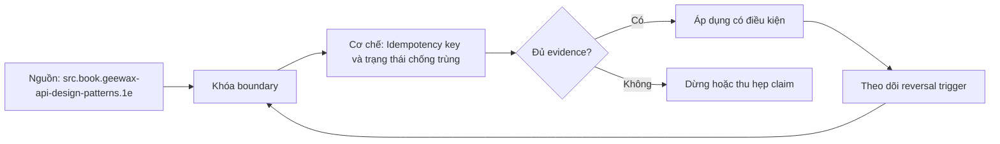

# Idempotency key và trạng thái chống trùng

> [!abstract] Câu hỏi trung tâm
> Client timeout không biết request chưa tới, đang chạy hay đã commit nhưng response bị mất. Idempotency không loại bỏ failure; nó biến nhiều delivery attempt có cùng ý định thành một logical operation với outcome có thể truy lại.

## 1. Outcome uncertainty là lý do tồn tại của idempotency key

Ba timeline có cùng triệu chứng phía client:

1. request chưa tới server;
2. server nhận nhưng chưa commit rồi chết;
3. server commit, gửi response nhưng response mất.

Client chỉ thấy timeout. Retry mù có thể cần thiết ở trường hợp 1, vô hại ở trường hợp 2 nếu rollback hoàn tất, nhưng tạo side effect kép ở trường hợp 3. Server cần identity ổn định cho logical operation để phân biệt retry với yêu cầu mới.

> [!source-fact]
> Geewax bắt đầu request-deduplication pattern từ chính sự bất khả phân biệt giữa request mất và response mất, rồi dùng request identifier do client chọn để trả lại outcome ban đầu. *API Design Patterns*, Chapter 26, PDF 712-733.

## 2. Idempotent method khác idempotency key

Theo HTTP semantics, một method idempotent khi nhiều request giống nhau có intended effect giống một request. `PUT`, `DELETE` và safe methods được định nghĩa idempotent; `POST` không mặc nhiên idempotent. Đây là semantics của method, không phải bảo đảm network chỉ gửi một lần.

Idempotency key là protocol bổ sung cho một logical operation, thường dùng với operation tạo side effect mà client cần retry. Key không biến mọi nội dung `POST` thành an toàn. Server phải lưu deduplication state và ràng buộc key với đúng request semantics.

> [!source-fact]
> RFC 9110 §9.2.2 định nghĩa idempotent theo intended effect và cảnh báo client không tự retry non-idempotent request nếu không biết semantics thực sự idempotent hoặc có cách nhận biết request gốc chưa được áp dụng.

## 3. Contract tối thiểu của idempotency key

Contract phải công bố:

- operation/endpoint nào hỗ trợ hoặc bắt buộc key;
- key do ai tạo, scope theo tenant/actor/endpoint nào;
- định dạng, entropy và độ dài;
- cùng key + cùng request trả outcome nào;
- cùng key + khác request bị từ chối thế nào;
- request đang xử lý thì duplicate chờ, trả conflict hay trả trạng thái pending;
- terminal error nào được replay;
- retention window và hành vi sau expiry;
- retryable transport/status conditions;
- dữ liệu nhạy cảm nào không được đưa vào key hoặc log.

Không có contract này, client và server có thể cùng hỗ trợ idempotency nhưng hiểu khác nhau.

## 4. Identity phải có scope

Key đơn độc hiếm khi là primary key đúng. Hai tenant có thể tình cờ dùng cùng UUID; hai endpoint có thể nhận cùng key cho hai operation khác nhau. Khóa lưu trữ thường có dạng:

```text
(tenant_id, operation_name, idempotency_key)
```

Actor hoặc credential scope có thể cần đưa vào nếu quyền thay đổi theo actor. Không dùng key làm authorization; request replay vẫn phải qua xác thực và kiểm quyền phù hợp.

Key nên là giá trị ngẫu nhiên đủ entropy, do client tạo một lần cho logical operation và giữ nguyên qua retry. Hash toàn request không thay được key: hai lần mua giống hệt nhau có thể là hai ý định hợp lệ khác nhau.

## 5. Fingerprint chặn tái sử dụng key sai mục đích

Khi key đã tồn tại, server phải so request fingerprint hoặc canonical fields. Nếu payload, operation hoặc semantic parameters khác, trả conflict/validation error thay vì phát lại response không liên quan.

Canonicalization phải được định nghĩa:

- field mặc định có được materialize trước hash không;
- JSON field order có ảnh hưởng không;
- header nào thuộc semantics;
- timestamp, trace ID hay nonce nào bị loại;
- upload stream và body lớn được fingerprint ra sao;
- version API có nằm trong scope không.

> [!source-fact]
> Geewax yêu cầu lưu request-body fingerprint cùng response và gợi ý từ chối bằng conflict khi cùng request ID nhưng body khác; Chapter 26, PDF 724-727. Stripe cũng so tham số của request lặp để ngăn dùng lại key cho operation khác.

## 6. State machine của một logical operation

Chỉ cache response sau khi làm side effect tạo cửa sổ nguy hiểm: process có thể commit effect rồi chết trước khi ghi cache. Cần model trạng thái:

```text
ABSENT
  -> IN_PROGRESS
       -> SUCCEEDED(response snapshot)
       -> FAILED_FINAL(error snapshot)
       -> RECOVERY_REQUIRED
  -> EXPIRED
```

Record tối thiểu:

| Field | Mục đích |
|---|---|
| scope + key | identity duy nhất |
| request fingerprint | phát hiện key reuse |
| status | điều phối concurrent duplicate |
| owner/lease metadata | phát hiện worker chết nếu dùng lease |
| outcome reference hoặc response snapshot | replay kết quả |
| resource/effect ID | reconciliation |
| created/updated/expires_at | lifecycle và retention |
| schema/version | giải mã response cũ sau deploy |

## 7. Reservation phải atomic

Hai request cùng key có thể tới hai replica cùng lúc. Pattern `SELECT` rồi `INSERT` không an toàn vì cả hai đều có thể thấy chưa tồn tại. Cần unique constraint và atomic insert/upsert:

```sql
INSERT INTO idempotency_records (
    tenant_id, operation_name, idem_key, request_hash, status
)
VALUES (:tenant, :operation, :key, :hash, 'IN_PROGRESS')
ON CONFLICT DO NOTHING;
```

Chỉ request tạo record thành công là owner đầu tiên. Request còn lại đọc record đã có, kiểm fingerprint và đi theo policy duplicate. Unique constraint là lớp quyết định cuối; distributed process lock cục bộ không đủ.

## 8. Atomicity giữa dedupe record và business effect

Trường hợp tốt nhất là dedupe record và business mutation nằm trong cùng database transaction:

1. reserve key;
2. ghi business state;
3. cập nhật record thành `SUCCEEDED` kèm outcome;
4. commit một lần.

Nếu transaction rollback, cả key lẫn effect biến mất. Retry có thể bắt đầu lại. Nếu commit, cả effect và replay state cùng tồn tại.

Khi effect ở hệ ngoài, local transaction không thể atomic với nó. Cần operation ID được downstream chấp nhận, outbox/worker, hoặc reconciliation state. Không viết exactly once nếu chỉ có local cache trước một API call không idempotent.

## 9. Hai concurrent duplicate phải có policy rõ

Khi request thứ hai thấy `IN_PROGRESS`, các lựa chọn gồm:

- chờ có giới hạn rồi replay outcome;
- trả `409 Conflict`/mã domain operation in progress;
- trả `202 Accepted` với operation-status URI;
- trả retry hint.

Không được chạy effect lần hai. Chờ vô hạn giữ connection và có thể deadlock nếu owner cần resource bị duplicate giữ. Polling phải có deadline và jitter.

Stripe nêu một hành vi cụ thể: request xung đột đồng thời trước khi execution bắt đầu có thể không lưu idempotent result, nên client có thể retry. Đây là contract của Stripe, không phải quy tắc chung cho mọi API.

## 10. Replay outcome nào?

Mục tiêu là trả outcome của attempt được nhận làm owner, không phải query resource hiện tại rồi dựng response mới. Resource có thể đã thay đổi sau đó; dựng response mới phá tính ổn định mà client cần khi retry.

Ba chiến lược:

- lưu toàn status + headers cần thiết + body;
- lưu resource/effect ID và immutable result snapshot;
- lưu operation record mà client truy vấn riêng.

Không cache header theo kết nối hoặc dữ liệu bí mật không cần thiết. Response schema phải tương thích qua deploy; record cũ có thể cần serializer version.

Stripe lưu status code và body của lần thực thi đầu tiên, kể cả `500`, rồi trả lại cho request cùng key. Đó là lựa chọn sản phẩm có hệ quả rõ: retry cùng key không chạy lại operation. API khác có thể chỉ persist terminal outcome sau một commit point đã định, nhưng phải công bố.

## 11. Failure trước, trong và sau commit

| Fault point | Trạng thái an toàn mong muốn | Hành vi retry |
|---|---|---|
| trước reserve | không record, không effect | có thể reserve lại |
| sau reserve, trước effect | `IN_PROGRESS` stale hoặc rollback | takeover/recovery theo policy |
| trong business transaction | rollback cả effect và record | bắt đầu lại |
| sau effect, trước outcome record | không được xảy ra nếu cùng local transaction; nếu external effect thì cần reconcile | không chạy mù lần hai |
| sau commit, trước response | `SUCCEEDED` đã bền vững | replay outcome |
| sau response | terminal record | replay nếu client gửi lại |

Process death giữa chừng yêu cầu phân biệt transaction rollback với leased work bên ngoài. TTL không nên tự biến stale `IN_PROGRESS` thành chưa từng chạy nếu effect ngoài có thể đã thành công.

## 12. Retention là semantic window

Sau expiry, cùng key có thể được coi là operation mới. Vì vậy retention không chỉ là cache tuning; nó xác định thời gian server cam kết chống trùng.

Chọn retention từ:

- retry horizon của client và message broker;
- thời gian offline tối đa;
- reconciliation window;
- cost của duplicate effect;
- dung lượng và privacy/retention policy;
- khả năng giữ namespace key không tái sử dụng.

Stripe cho phép loại key sau ít nhất 24 giờ. Geewax đề xuất khoảng năm phút như điểm bắt đầu cho pattern trong sách. Hai con số phục vụ hai contract khác nhau; không được lấy một con số làm chuẩn chung. Chương trình yêu cầu người học tự biện minh retention bằng failure horizon.

## 13. Idempotency không phải exactly once

Network có thể delivery nhiều lần. Server có thể thực thi code nhiều attempt. Điều cần bảo đảm là một logical effect được chấp nhận trong scope và window đã công bố. Nếu dedupe state bị mất, key hết hạn hoặc side effect không cùng atomic boundary, duplicate vẫn có thể xảy ra.

Với event consumer, key thường là event/command ID và dedupe record cần commit cùng state change hoặc offset strategy. Với payment/external API, cần downstream idempotency key và reconciliation. Một bảng cache đứng trước mọi endpoint không đủ.

## 14. Security và abuse

Idempotency store có thể bị lạm dụng:

- gửi vô hạn key để làm tăng cardinality;
- dò key của tenant khác;
- ép replay response chứa dữ liệu nhạy cảm;
- reuse key sau khi quyền đã bị thu hồi;
- đưa PII vào key rồi key xuất hiện trong log.

Cần quota/rate limit, scope theo tenant, key không đoán được, authorization khi replay, redaction và retention policy. Không trả cached response của actor khác chỉ vì key trùng.

## 15. Observability

Metrics:

- `idempotency_reservation_total{result}`;
- duplicate hit, fingerprint conflict và in-progress collision;
- operation age và stale in-progress count;
- replay latency;
- storage cardinality/bytes;
- recovered/reconciled operation;
- duplicate-effect incident.

Log chỉ hash hoặc short suffix của key nếu key nhạy cảm. Trace cần phân biệt `logical_operation_id` với từng `attempt_id`; nhiều attempt có thể link về một operation.

## 16. Ba thí nghiệm bắt buộc

### A. Response mất sau success

Cho server commit rồi cắt response. Client retry cùng key. Chứng minh chỉ có một business row/job và response replay trỏ đúng effect.

### B. Process chết giữa chừng

Giết process tại từng fault point: sau reserve, sau business write, trước outcome, sau commit. Đọc lại bằng process mới và chứng minh policy recovery không tạo effect kép.

### C. Hai request cùng key

Dùng barrier gửi hai request cùng lúc tới hai worker/replica. Một request sở hữu reservation; request kia chờ hoặc nhận trạng thái theo contract. Lặp đủ số vòng và đối soát effect count bằng unique business identity.

## 17. Ma trận đánh giá DE-L105

| Tiêu chí | Đạt | Không đạt |
|---|---|---|
| Identity | key do client tạo, scope rõ | key global hoặc derive mù từ body |
| Collision | fingerprint khác bị từ chối | trả response cũ cho payload mới |
| Atomicity | reservation, effect, outcome cùng boundary khi có thể | effect commit trước cache không có recovery |
| Concurrency | unique constraint quyết owner | check-then-insert |
| Lifecycle | in-progress, terminal, expiry có policy | chỉ có cache hit/miss |
| Retry contract | conditions và window công bố | cứ retry |
| Evidence | ba fault scenario, command/output và reconciliation | chỉ unit test tuần tự |

## 18. Câu hỏi tự kiểm tra

1. Vì sao timeout không cho biết request đã commit hay chưa?
2. HTTP idempotence khác idempotency key thế nào?
3. Vì sao hash request không thay được client-generated key?
4. Same key + different payload phải xử lý ra sao?
5. `SELECT` rồi `INSERT` hỏng ở lịch chạy nào?
6. Vì sao lưu response sau business commit tạo cửa sổ duplicate?
7. Request thứ hai thấy `IN_PROGRESS` có các lựa chọn nào?
8. Retention thay đổi semantics ra sao?
9. Tại sao replay resource state hiện tại có thể sai?
10. Khi effect ở hệ ngoài, cần thêm cơ chế gì?

## 19. Giới hạn

- HTTP status cụ thể cho in-progress/conflict là quyết định API contract; note không áp một mã cho mọi hệ.
- Chính sách Stripe là case study production, không phải tiêu chuẩn mở.
- Idempotency window hữu hạn không bảo đảm chống trùng vĩnh viễn.
- Một công việc phải được định nghĩa bằng invariant nghiệp vụ, không chỉ bằng số row dedupe.
- Exactly-once delivery không được tuyên bố từ idempotency key đơn lẻ.

## Reference
1. [[SRC-GEEWAX-API-DESIGN-PATTERNS-1E]]: request identifier, cached outcome, fingerprint, collision và expiration; Chapter 26, PDF 712-733.
2. [[SRC-RFC9110-HTTP-SEMANTICS]]: định nghĩa idempotent method và điều kiện retry; §9.2.2.
3. [[SRC-STRIPE-IDEMPOTENT-REQUESTS]]: một contract production về status/body replay, parameter comparison, concurrent conflict và retention; truy cập 2026-09-28.
4. [[SRC-POSTGRESQL-TRANSACTIONS]]: atomic transaction boundary cho dedupe record và business state; truy cập 2026-09-28.

## Source coverage

| Source slice | Nội dung phải giữ | Vị trí trong note | Trạng thái |
|---|---|---|---|
| [[SRC-GEEWAX-API-DESIGN-PATTERNS-1E]], Chapter 26, PDF 712-733 | outcome uncertainty, request ID, response replay, fingerprint, collision, expiry | §§1, 4-5, 10, 12 | Đã giữ cơ chế; con số năm phút được ghi đúng là đề xuất của sách |
| [[SRC-RFC9110-HTTP-SEMANTICS]], §9.2.2 | method idempotence và retry constraints | §2 | Đã tách chuẩn HTTP khỏi protocol key |
| [[SRC-STRIPE-IDEMPOTENT-REQUESTS]] | case study production về replay và retention | §§5, 9-12 | Đã ghi rõ hành vi riêng của Stripe |
| [[SRC-POSTGRESQL-TRANSACTIONS]] | local atomic boundary | §§7-8, 11 | Đã áp dụng có điều kiện |
| Tổng hợp DE-L105 | state machine, crash matrix, security, observability và ba thí nghiệm | §§3, 6-18 | Đã đánh dấu synthesis; không hứa exactly-once |

Phạm vi đọc bao phủ request identity, atomic reservation, concurrent duplicate, fingerprint, outcome replay, crash recovery và expiry. Message-broker exactly-once và distributed transaction bị loại trừ có chủ đích.

## Key takeaways
- Idempotency key gắn nhiều delivery attempt vào một logical operation; nó không ngăn network retry.
- Key phải có scope và request fingerprint; cùng key với payload khác là conflict.
- Unique constraint quyết định owner khi hai request đồng thời; check-then-insert không đủ.
- Dedupe record, business effect và terminal outcome phải cùng atomic boundary khi có thể.
- `IN_PROGRESS`, process death và external effect cần recovery policy, không được coi là cache miss.
- Retention là cam kết semantic; 24 giờ của Stripe hay năm phút trong một sách không phải chuẩn chung.

<!-- ATOMIC-EXECUTION-CAPSULE:START -->

## Execution capsule: kiểm chứng `wiki.backend.idempotency-keys-deduplication-state`

> [!important] Phân loại mệnh đề
> Với `wiki.backend.idempotency-keys-deduplication-state`, sơ đồ, ví dụ và artifact về **Idempotency key và trạng thái chống trùng** là **synthesis để kiểm chứng**; chúng không phải trích dẫn hay case nguyên văn của nguồn.

### Sơ đồ cơ chế và điểm kiểm soát



Đọc sơ đồ `wiki.backend.idempotency-keys-deduplication-state` từ trái sang phải: source chỉ cung cấp claim ban đầu cho **Idempotency key và trạng thái chống trùng**; quyết định chỉ được đi tiếp sau khi boundary, evidence và điều kiện đảo quyết định đã hiện hữu.

### Tự kiểm tra trước khi tái sử dụng

1. Bạn có thể trả lời `Làm sao để một client có thể retry request có side effect khi outcome chưa rõ mà server chỉ tạo một logical operation, kể cả hai request cùng key đến đồng thời hoặc process chết giữa chừng?` bằng một câu mà không kéo thêm concept thứ hai không?
2. Source locator nào đỡ cho claim, và phần nào chỉ là synthesis trong note?
3. Observation nào khiến bạn dừng, thu hẹp hoặc đảo quyết định?
4. Artifact nào cho phép một reviewer độc lập tái hiện kết quả?

<!-- ATOMIC-EXECUTION-CAPSULE:END -->
