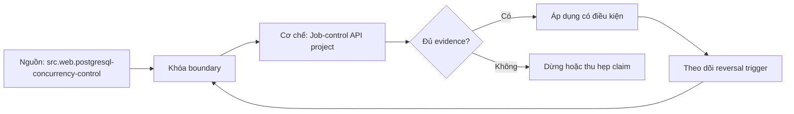

# Job-control API project

> [!abstract] Câu hỏi trung tâm
> Một API nhận job bất đồng bộ phải làm gì để cùng một ý định không tạo nhiều job, worker chết không làm mất work, worker cũ không ghi đè worker mới và người vận hành có đủ bằng chứng chẩn đoán?

## 1. Contract bên ngoài

API tối thiểu có submit, get status và cancel. Submit nhận idempotency key trong scope tenant/principal, payload và loại job. Lần đầu tạo job; retry cùng key và cùng canonical request trả cùng job/result; cùng key khác payload trả conflict. Status trả stable job ID, state, timestamps, attempt và terminal reason. Cancel là yêu cầu chuyển trạng thái, không hứa dừng tức thời một external side effect đã bắt đầu.

Response code và retry semantics phải theo HTTP contract. Timeout phía client không chứng minh server chưa commit. Vì vậy client retry bằng cùng key, không tự sinh key mới.

## 2. PostgreSQL là source of truth

Core tables gồm `jobs`, `job_attempts`, idempotency record và tùy kiến trúc có outbox. Cache chỉ là derivative optimization sau khi đo. Nếu cache và DB bất đồng, DB thắng. Job payload, state transition, owner, lease expiry, generation/fencing token, attempt budget và cancellation marker phải durable.

Unique constraint trên `(tenant_id, idempotency_key)` là tuyến phòng thủ concurrency. Application check rồi insert không đủ vì hai request có thể cùng thấy “chưa có”. Transaction xử lý unique conflict và đọc lại canonical record.

## 3. State machine hữu hạn

Một state machine khả dụng: `queued -> running -> succeeded|failed|dead_lettered`; `queued/running -> cancel_requested`; rồi `cancelled` khi worker xác nhận điểm an toàn. Retryable failure đưa lại `queued` với `next_attempt_at`; attempt budget hết đưa DLQ.

Mỗi transition có precondition trong `WHERE`, ví dụ chỉ claim row đang queued và đến giờ. Affected-row count bằng 0 nghĩa là mất race hoặc stale state, không phải success. Terminal state bất biến trừ workflow quản trị rõ ràng.

## 4. Claim, lease và fencing

Worker claim batch bằng transaction ngắn. PostgreSQL có thể dùng `FOR UPDATE SKIP LOCKED` để nhiều worker tránh chờ cùng row. Claim ghi owner, expiry và tăng `generation`. Worker heartbeat gia hạn chỉ khi owner+generation vẫn khớp.

Lease expiry cho phép recovery nhưng không tự ngăn worker cũ tiếp tục. GC pause/network partition có thể làm lease hết trong lúc worker cũ vẫn sống; worker mới claim generation 8, worker cũ generation 7 hoàn tất sau. Mọi durable completion phải conditional trên generation hiện tại. Với external system, truyền fencing/idempotency key nếu hỗ trợ; nếu không, dùng reconciliation và nói rõ residual duplicate risk.

## 5. Worker chết sau side effect

Đây là điểm khó nhất. External effect có thể hoàn tất, worker chết trước khi đánh dấu job succeeded. Retry có thể lặp effect. Có ba chiến lược:

1. downstream nhận stable idempotency key;
2. effect và job state cùng local transaction nếu cùng database;
3. ghi intent/outbox rồi worker/reconciler đối chiếu external operation ID.

Không có các điều kiện đó thì không được hứa exactly-once. Project phải chọn và chứng minh semantics cụ thể.

## 6. Retry và DLQ

Phân loại lỗi: transient có thể retry; permanent validation/domain failure không retry; unknown cần conservative policy. Backoff có jitter, max attempts và deadline. Retry không được giữ transaction/lock trong lúc sleep. Attempt record lưu started/ended, error class, generation và next decision.

DLQ không phải thùng rác. Mỗi entry giữ reason, payload reference an toàn, attempts, first/last failure, owner và action. Replay cần authorization, audit và vẫn giữ idempotency. Poison job không được loop vô hạn.

## 7. Cancellation

Cancel queued job có thể transition trực tiếp. Cancel running job đặt marker; worker kiểm tại cooperative cancellation points. Nếu external call không cancellable, status phải phân biệt requested với effective. Race giữa completion và cancel được quyết định bằng conditional transition; không trả `cancelled` khi effect đã commit.

## 8. Outbox cho state event

Nếu downstream cần `JobCompleted`, insert event intent cùng transaction cập nhật terminal state. Relay phát at-least-once; event ID ổn định; consumer idempotent. Không update job rồi publish trực tiếp. Job state machine và outbox cleanup có metric riêng.

## 9. Năm fault injection bắt buộc

1. **Duplicate submit:** 50 concurrent requests cùng key, chỉ một job ID và một business intent.
2. **Worker dies after effect:** kill đúng điểm; retry không lặp effect hoặc reconciler nhận ra completion.
3. **DB timeout:** response ambiguous; retry cùng key trả canonical job, connection pool không cạn.
4. **Lease expires while worker alive:** worker cũ bị fencing, không ghi terminal state của generation mới.
5. **Deployment during running job:** termination grace/claim stop; job được hoàn tất hoặc lease recovery, không mất.

Mỗi test cần timeline, DB query trước/sau, logs/trace/metrics và invariant assertion. Chỉ screenshot là không đủ.

## 10. Observability

Metrics: submit rate/error, queue depth/oldest age, claim latency, running, attempt rate, retry/DLQ, lease expiry, stale completion reject, cancellation latency và outbox lag. Log có job ID, tenant-safe identity, attempt, owner, generation, transition, reason và trace ID; không log payload nhạy cảm. Trace nối submit, DB, worker và dependency nhưng logical job có thể trải nhiều trace, nên job ID/idempotency key hash là correlation bổ sung.

## 11. Threat model và authorization

Tenant A không được đọc/cancel job B; ownership check trong query hoặc policy layer, không chỉ ẩn ID. Idempotency key phải scope theo principal/tenant để tránh collision/poisoning. Payload size/type, replay DLQ, admin cancel và status metadata đều là attack surface. Rate limit không thay authorization.

## 12. Runbook và capacity note

Runbook trả lời: queue age tăng thì xem gì; worker crash loop; DB pool saturation; lease churn; DLQ spike; outbox stuck; cách pause claim và replay an toàn. Capacity note dùng workload submit/status/cancel và worker effect, ghi safe arrival rate, service time, concurrency, bottleneck và headroom.

## 13. Definition of done

Project đạt khi năm fault test chạy lặp lại, invariants được assert từ artifact, retry/cancel/DLQ semantics được ghi rõ, capacity note có raw data, threat model có negative authorization tests và runbook có lệnh quan sát/phục hồi. “Demo happy path chạy” không đủ.

## 14. Schema và invariant audit

`jobs` cần unique idempotency scope, state, payload fingerprint, attempt budget, next-attempt, lease owner/expiry, generation và timestamps. `job_attempts` là append-oriented history, không phải nguồn quyết định state hiện tại. Mọi transition quan trọng dùng conditional update và kiểm affected rows. Constraint ngăn negative attempts, terminal state thiếu completion timestamp hoặc hai record cùng idempotency scope khi phù hợp.

Audit từng invariant theo ba tuyến: application path, direct SQL/import path và concurrent path. Application validation tạo lỗi dễ hiểu; database bảo vệ final state. Migration phải tương thích với worker cũ/mới trong deployment overlap. Nếu thêm NOT NULL/constraint trên table lớn, cần expand/backfill/validate/contract thay vì khóa bất ngờ.

## 15. Recovery decision table

Khi queue age tăng nhưng workers healthy, xem dependency latency và claim query. Khi lease expiry tăng, phân biệt worker slow, heartbeat failure và clock/config mismatch. Khi DLQ tăng, nhóm stable error class trước replay. Khi database timeout, không đoán transaction outcome; dùng idempotency key để đọc canonical state. Khi deployment gián đoạn, stop new claims, cho running attempt grace, rồi để lease recovery xử lý phần còn lại.

Mỗi thao tác quản trị—pause, cancel, replay, force-release lease—cần actor, reason, timestamp và before/after state. Không sửa row thủ công ngoài audited runbook vì sẽ phá evidence chain.

## 16. Câu hỏi tự kiểm tra

Trước khi review, dựng một timeline gồm client, API, database, worker và downstream. Đánh dấu commit/ack/lease boundary; mọi khoảng giữa hai boundary là nơi process có thể chết. Với mỗi khoảng, trả lời durable state nào còn lại, ai phát hiện công việc dang dở, retry dùng identity nào và stale actor bị chặn bằng điều kiện gì. Nếu không trả lời được, design chưa có recovery semantics dù happy path đã chạy.

Đặc biệt kiểm sự khác nhau giữa job identity, attempt identity và external operation identity. Job giữ nguyên qua retry; attempt thay đổi để audit; external operation ID phải cho phép reconciliation. Dùng một UUID mới cho mọi thứ mỗi lần retry làm mất liên kết. Dùng cùng ID nhưng không scope tenant có thể tạo collision hoặc leak. Correlation field không được thay authorization predicate.

Review schema bằng các phản ví dụ: hai submit đồng thời; heartbeat đến sau khi lease đã chuyển owner; cancel đến cùng lúc completion; retry sau ambiguous DB timeout; replay DLQ khi original effect đã thành công. Mỗi phản ví dụ phải đi tới một unique/conditional constraint, state transition hoặc reconciliation step. Nếu chỉ có câu “worker sẽ kiểm tra”, cần chỉ transaction và affected-row assertion cụ thể.

1. Unique constraint tham gia idempotency dưới 50 request đồng thời thế nào?
2. Lease expiry vì sao không đủ ngăn worker cũ hoàn tất?
3. External effect không hỗ trợ idempotency để lại residual risk nào?
4. `cancel_requested` khác `cancelled` ở invariant nào?
5. Deployment fault test phải chứng minh những state transition nào?

## 17. Giới hạn và điều chưa cho phép kết luận

- Blueprint không chọn framework, ORM hoặc broker cụ thể.
- Không hứa exactly-once với external effect thiếu idempotency/reconciliation.
- `SKIP LOCKED` là kỹ thuật PostgreSQL, không phải portable queue contract.
- Năm fault case là acceptance floor, không bao phủ mọi partition, corruption hoặc operator error.

## Source coverage

| Source slice | Nội dung phải giữ | Vị trí trong note | Trạng thái |
|---|---|---|---|
| [[SRC-POSTGRESQL-CONCURRENCY-CONTROL]] | transaction, lock và row claim | §§2–4, 14 | Đã giữ DB-specific scope |
| [[SRC-RFC9110-HTTP-SEMANTICS]] | timeout/retry ambiguity | §§1, 5 | Đã áp vào submit contract |
| [[SRC-STRIPE-IDEMPOTENT-REQUESTS]] | idempotency behavior | §§1–2 | Đã dùng làm practitioner pattern, không coi retention là chuẩn chung |
| [[SRC-RICHARDSON-MICROSERVICES-PATTERNS-1E]] | transaction/outbox | §8 | Đã giữ at-least-once |
| [[SRC-MICROSERVICES-IO-TRANSACTIONAL-OUTBOX]] | outbox forces | §8 | Đã nối với state event |
| [[SRC-TITMUS-CLOUD-NATIVE-GO-1E]] | resilience/observability | §§9–12 | Đã trình bày evidence vận hành |

## Key takeaways
- Database là source of truth; cache chỉ là bản dẫn xuất.
- Unique constraint bảo vệ idempotency dưới concurrency.
- Lease phải đi với fencing; lease đơn lẻ không chặn stale worker.
- Worker chết sau effect buộc downstream idempotency hoặc reconciliation.
- Năm fault test, capacity note, threat model và runbook là deliverable, không phải phụ lục.

## Reference
1. [[SRC-POSTGRESQL-CONCURRENCY-CONTROL]] — locking và claim.
2. [[SRC-RFC9110-HTTP-SEMANTICS]] — HTTP semantics.
3. [[SRC-STRIPE-IDEMPOTENT-REQUESTS]] — idempotent request pattern.
4. [[SRC-RICHARDSON-MICROSERVICES-PATTERNS-1E]] — transaction/outbox.
5. [[SRC-MICROSERVICES-IO-TRANSACTIONAL-OUTBOX]] — outbox pattern.
6. [[SRC-TITMUS-CLOUD-NATIVE-GO-1E]] — resilience/observability.

<!-- ATOMIC-EXECUTION-CAPSULE:START -->

## Execution capsule — kiểm chứng `wiki.backend.job-control-api-project`

> [!important] Phân loại mệnh đề
> Với `wiki.backend.job-control-api-project`, sơ đồ, ví dụ và artifact về **Job-control API project** là **synthesis để kiểm chứng**; chúng không phải trích dẫn hay case nguyên văn của nguồn.

### Sơ đồ cơ chế và điểm kiểm soát



Đọc sơ đồ `wiki.backend.job-control-api-project` từ trái sang phải: source chỉ cung cấp claim ban đầu cho **Job-control API project**; quyết định chỉ được đi tiếp sau khi boundary, evidence và điều kiện đảo quyết định đã hiện hữu.

### Artifact thực thi tối thiểu

```python
from dataclasses import dataclass

@dataclass(frozen=True)
class WikiBackendJobControlApiProjectEvidence:
    boundary_declared: bool
    independent_oracle: bool
    reversal_trigger: str

    def accepted(self) -> bool:
        return (
            self.boundary_declared
            and self.independent_oracle
            and bool(self.reversal_trigger.strip())
        )

# Concept: Job-control API project
# Primary question: Thiết kế job-control API thế nào để giữ đúng trạng thái khi duplicate request, worker crash, lease expiry, database timeout và deployment?
evidence = WikiBackendJobControlApiProjectEvidence(
    boundary_declared=True,
    independent_oracle=True,
    reversal_trigger="Đảo quyết định khi hard constraint bị vi phạm",
)
assert evidence.accepted()
```

Artifact của `wiki.backend.job-control-api-project` buộc người dùng ghi boundary, oracle và reversal trigger cho **Job-control API project**. Các giá trị minh họa phải được thay bằng evidence thật trước khi dùng cho quyết định.

### Tự kiểm tra trước khi tái sử dụng

1. Bạn có thể trả lời `Thiết kế job-control API thế nào để giữ đúng trạng thái khi duplicate request, worker crash, lease expiry, database timeout và deployment?` bằng một câu mà không kéo thêm concept thứ hai không?
2. Source locator nào đỡ cho claim, và phần nào chỉ là synthesis trong note?
3. Observation nào khiến bạn dừng, thu hẹp hoặc đảo quyết định?
4. Artifact nào cho phép một reviewer độc lập tái hiện kết quả?

<!-- ATOMIC-EXECUTION-CAPSULE:END -->
