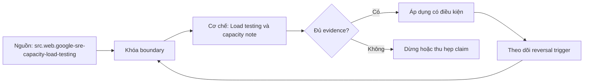

# Load testing và capacity note

> [!abstract] Câu hỏi trung tâm
> Service chịu được bao nhiêu tải, với workload nào, trong giới hạn latency/error nào, và resource nào trở thành bottleneck đầu tiên?

## 1. Capacity không phải một con số cố định

Service đạt 5.000 RPS thiếu method mix, payload, concurrency, dataset, cache state, dependency latency, hardware, version và SLO. Capacity chỉ có nghĩa trong một test envelope. Hai workload cùng RPS nhưng một workload chủ yếu cache hit, workload kia ghi transaction lớn sẽ tạo kết quả khác.

Định nghĩa hữu ích: capacity là mức offered load cao nhất mà service còn giữ toàn bộ acceptance criteria trong một cửa sổ đủ dài. Criteria thường gồm p95/p99, error ratio, queue delay và saturation boundary. Điểm gãy (*knee*) là vùng throughput tăng ít nhưng latency/queue/error tăng mạnh; đó là bằng chứng, không phải công thức duy nhất.

## 2. Tách offered load, throughput và concurrency

- Offered load: công việc generator cố gửi.
- Throughput: công việc hệ thống hoàn tất theo contract.
- Concurrency: số operation đang in flight.
- Goodput: work hữu ích hoàn tất, loại retry/failed/invalid.

Khi overload, throughput có thể phẳng dù offered load tăng. Chỉ báo cáo throughput sẽ che queue, timeout và retry amplification. Với closed model, virtual user chờ response rồi mới gửi tiếp nên latency tăng tự làm giảm offered load. Open model phát theo arrival rate độc lập hơn nhưng generator phải đủ capacity.

Little's Law $L=\lambda W$ hữu ích khi hệ ở trạng thái tương đối ổn định và các đại lượng cùng boundary. Không áp dụng máy móc qua warm-up, spike hoặc queue đang tăng vô hạn.

## 3. Workload model trước tool

Lập profile từ production evidence nếu có: tỷ lệ endpoint, request/response size, key distribution, think time, burst, authentication, cache hit, write/read ratio và dependency behavior. Nếu chưa có production, ghi rõ synthetic assumptions.

Dataset phải đủ lớn để không luôn nằm trong memory. Hot-key distribution có thể tạo lock contention khác uniform. User journey nhiều bước cần giữ correlation nhưng phải tránh benchmark chính code của load generator. Không tạo tải lên third party khi chưa được phép; dùng stub có latency/error distribution đã định nghĩa.

## 4. Môi trường và generator

Ghi CPU/memory, container limits, replica count, DB size/index, pool sizes, network path, autoscaling policy, build SHA và feature flags. Generator phải được đo CPU, network và dropped iterations để chứng minh nó không là bottleneck. Đồng bộ thời gian và dành warm-up cho JIT, connection pool, cache, page cache.

Không chạy load test phá hoại trên production nếu thiếu phê duyệt và guardrail. Staging quá nhỏ vẫn hữu ích để tìm bottleneck tương đối, nhưng không được ngoại suy tuyến tính khi architecture có nonlinear queues hoặc shared dependencies.

## 5. Ma trận sáu mức tải

Một run có thể gồm 10%, 25%, 50%, 75%, 100% và 125% mức dự kiến; mỗi step đủ dài để signal ổn định. Mỗi step ghi offered load, goodput, p50/p95/p99, error ratio, timeout, in-flight, queue, CPU, memory, GC, DB connection/pool wait, disk/network và dependency latency.

Thứ tự step cần kiểm soát carry-over. Có thể reset giữa step hoặc chạy ramp và ghi rõ. Lặp ít nhất vài lần để thấy variance. Một lần chạy đẹp không chứng minh repeatability.

## 6. Latency phải là phân bố

Mean che tail. p99 cho biết ngưỡng 99% observation không vượt trong sample/window; nó không nói request nào và có thể bất ổn khi sample nhỏ. Histogram bucket cần phù hợp SLO. Không trung bình các percentile của instance; aggregate bucket counts rồi tính quantile theo semantics tool.

Client-observed latency và server handler latency khác nhau. Chênh lệch có thể là DNS, connect, TLS, proxy, queue hoặc network. Capacity note nên giữ cả hai khi boundary quan trọng.

## 7. Saturation và bottleneck

CPU 100% có thể là bottleneck, nhưng CPU 40% không chứng minh dư capacity: DB pool, thread pool, event loop, lock, disk, connection limit hoặc downstream quota có thể bão hoà. Dấu hiệu cần quan hệ thời gian: pool wait tăng trước tail latency; queue depth tăng trong khi completion rate phẳng; lock wait tăng cùng transaction duration.

Thay đổi một biến để xác nhận. Tăng DB pool mà throughput không đổi nhưng DB CPU tăng có thể chỉ đẩy queue xuống database. Bottleneck được xác nhận khi intervention dự đoán đúng thay đổi signal, không chỉ vì một dashboard màu đỏ.

## 8. Error taxonomy

Tách validation/client error, server failure, timeout, cancellation, rejected overload và dependency failure. Retry attempt không được đếm như independent user success. Một logical request thành công sau ba attempt tiêu thụ capacity ba lần; cần cả attempt rate và logical goodput.

Thiết lập threshold tự động nhưng vẫn lưu raw artifact. Test fail nếu vượt SLO hoặc generator mất iteration. Không crash không phải pass nếu p99 vượt budget hoặc error bị client library nuốt.

## 9. Stress, spike và soak trả lời câu khác nhau

Stress tìm giới hạn và failure mode khi vượt capacity. Spike kiểm burst absorption và recovery. Soak giữ tải dài để tìm leak, fragmentation, connection leak, compaction hoặc backlog tích luỹ. Ba mươi phút chỉ cho phép nói không quan sát tăng đơn điệu trong cửa sổ 30 phút; không chứng minh không có leak dài hạn.

Sau overload phải đo recovery: queue có rút không, error có về nền không, autoscaler có oscillate không, circuit có đóng đúng không. Hệ thống chỉ sống sót nhưng không phục hồi vẫn chưa đạt.

## 10. Capacity note một trang

1. Build, ngày, environment và owner.
2. Workload model và dataset.
3. SLO/acceptance criteria.
4. Bảng sáu step cùng chart throughput-latency-error-saturation.
5. Capacity đã đo và confidence/variance.
6. Bottleneck cùng evidence chain.
7. Headroom: forecast peak so với safe capacity.
8. Known limits và điều không ngoại suy.
9. Reproduction commands, raw results và dashboard links.
10. Action: scale, optimize, shed load hoặc test thêm.

Không ghi production capacity nếu test environment không tương đương. Ghi measured capacity under envelope E.

## 11. Phép thử tái hiện

Chạy smoke để kiểm script, average-load để lấy baseline, sáu step để tìm knee, stress vượt SLO, rồi soak 30 phút ở mức an toàn gần peak. Mỗi run có seed/config cố định và timestamp. Kết luận bottleneck phải trỏ metric/query và thời điểm tương ứng.

## 12. Đọc đường cong mà không tự lừa mình

Đặt throughput, p95/p99, error và saturation trên cùng trục thời gian. Nếu offered load tăng nhưng completed throughput phẳng, trước hết kiểm generator và rejection. Nếu latency tăng trước CPU, xem queue/pool/lock. Nếu client latency tăng nhưng server handler ổn định, xem connection/TLS/proxy/network. Nếu p99 nhảy ở sample rất nhỏ, báo count và confidence thay vì kể một câu chuyện chắc chắn.

Autoscaling làm test khó diễn giải vì capacity thay đổi trong run. Có thể tắt autoscaling để đo một replica, sau đó bật để đo scaling behavior; không trộn hai câu hỏi. Cache warm làm step sau có lợi thế; hoặc reset có kiểm soát, hoặc ghi rõ warm-state. GC/compaction tạo periodic tail; run phải đủ dài để quan sát chu kỳ liên quan.

## 13. Từ số đo tới quyết định mở rộng

Safe capacity thấp hơn breaking point vì cần headroom cho burst, failover, deployment và forecast error. Ghi công thức headroom và assumptions. Nếu một vùng mất một phần replica, remaining capacity phải giữ SLO hoặc load shedding phải có policy. CPU còn 30% không phải headroom khi DB connection đã bão hoà.

Optimization chỉ hợp lệ khi A/B giữ cùng workload envelope. Thay dataset, cache hit hoặc error policy giữa hai run làm mất comparability. Lưu config và raw result bằng artifact ID. Capacity note hết hạn khi build, instance type, schema/index, dependency hoặc workload mix thay đổi đáng kể.

## 14. Câu hỏi tự kiểm tra

Trước khi trả lời, người học phải dùng một capacity note cụ thể và chỉ ra metric hoặc cấu hình làm bằng chứng. Câu trả lời chỉ nêu định nghĩa không đủ nếu không liên kết với test envelope. Khi hai signal mâu thuẫn, cần nêu ít nhất hai giả thuyết và phép đo phân biệt chúng. Ví dụ throughput phẳng cùng CPU thấp có thể do connection pool, generator ceiling, rate limiter hoặc downstream quota; chỉ tăng CPU không phải phép kiểm phù hợp.

Một review tốt còn kiểm units, time window và aggregation. Millisecond/second nhầm đơn vị làm chart sai ba bậc độ lớn. Rate trên cửa sổ quá ngắn dao động mạnh; quá dài che transition giữa step. Percentile từ tập request khác nhau không so trực tiếp. Error ratio phải có cùng denominator với traffic đang phân tích. Những kiểm tra này thuộc phương pháp đo, không phải trang trí báo cáo.

1. Offered load tăng nhưng throughput phẳng có thể do những nguyên nhân nào?
2. Vì sao closed workload model có thể tự giảm áp lực khi latency tăng?
3. Một bottleneck claim cần intervention nào để tăng sức thuyết phục?
4. Vì sao không được trung bình p99 của từng replica?
5. Soak 30 phút cho phép phát biểu chính xác điều gì?

## 15. Giới hạn và điều chưa cho phép kết luận

- Kết quả chỉ đúng trong workload/environment/build đã ghi.
- Sáu mức tải không bảo đảm tìm mọi nonlinear transition; có thể cần step nhỏ hơn quanh knee.
- Soak 30 phút không loại trừ leak có chu kỳ dài.
- Staging không tương đương production thì không được gắn nhãn production capacity.

## Source coverage

| Source slice | Nội dung phải giữ | Vị trí trong note | Trạng thái |
|---|---|---|---|
| [[SRC-GOOGLE-SRE-CAPACITY-LOAD-TESTING]] | capacity planning, overload và load test | §§1, 7, 13 | Đã giữ capacity gắn service/SLO |
| [[SRC-GRAFANA-K6-PERFORMANCE-TESTING]] | taxonomy, realistic workload, repeatability | §§3-5, 9, 11 | Đã trình bày và giữ giới hạn authorization |
| [[SRC-PROMETHEUS-HISTOGRAMS]] | histogram, percentile và aggregation | §6 | Đã giữ cảnh báo không trung bình percentile |
| [[SRC-TITMUS-CLOUD-NATIVE-GO-1E]] | observability/resilience context | §§6-8 | Đã dùng làm nền, không gán benchmark cho sách |
| Tổng hợp DE-L110 | sáu step, capacity-note schema | §§5, 10-13 | Đã ghi thành quy trình kiểm được |

## Key takeaways
- Capacity luôn gắn với workload, environment và SLO.
- Offered load, throughput, goodput và concurrency không đồng nghĩa.
- Tail latency, error và saturation phải đọc cùng nhau.
- Bottleneck cần causal evidence qua intervention.
- Soak 30 phút chỉ giới hạn kết luận trong 30 phút.

## Reference
1. [[SRC-GOOGLE-SRE-CAPACITY-LOAD-TESTING]]: capacity và overload.
2. [[SRC-GRAFANA-K6-PERFORMANCE-TESTING]]: performance-test taxonomy.
3. [[SRC-PROMETHEUS-HISTOGRAMS]]: histogram và quantile.
4. [[SRC-TITMUS-CLOUD-NATIVE-GO-1E]]: observability context.

<!-- ATOMIC-EXECUTION-CAPSULE:START -->

## Execution capsule: kiểm chứng `wiki.backend.load-testing-capacity`

> [!important] Phân loại mệnh đề
> Với `wiki.backend.load-testing-capacity`, sơ đồ, ví dụ và artifact về **Load testing và capacity note** là **synthesis để kiểm chứng**; chúng không phải trích dẫn hay case nguyên văn của nguồn.

### Sơ đồ cơ chế và điểm kiểm soát



Đọc sơ đồ `wiki.backend.load-testing-capacity` từ trái sang phải: source chỉ cung cấp claim ban đầu cho **Load testing và capacity note**; quyết định chỉ được đi tiếp sau khi boundary, evidence và điều kiện đảo quyết định đã hiện hữu.

### Artifact thực thi tối thiểu

```python
from dataclasses import dataclass

@dataclass(frozen=True)
class WikiBackendLoadTestingCapacityEvidence:
    boundary_declared: bool
    independent_oracle: bool
    reversal_trigger: str

    def accepted(self) -> bool:
        return (
            self.boundary_declared
            and self.independent_oracle
            and bool(self.reversal_trigger.strip())
        )

# Concept: Load testing và capacity note
# Primary question: Đo capacity của service thế nào để kết luận dựa trên workload, SLO và saturation thay vì một con số requests per second rời ngữ cảnh?
evidence = WikiBackendLoadTestingCapacityEvidence(
    boundary_declared=True,
    independent_oracle=True,
    reversal_trigger="Đảo quyết định khi hard constraint bị vi phạm",
)
assert evidence.accepted()
```

Artifact của `wiki.backend.load-testing-capacity` buộc người dùng ghi boundary, oracle và reversal trigger cho **Load testing và capacity note**. Các giá trị minh họa phải được thay bằng evidence thật trước khi dùng cho quyết định.

### Tự kiểm tra trước khi tái sử dụng

1. Bạn có thể trả lời `Đo capacity của service thế nào để kết luận dựa trên workload, SLO và saturation thay vì một con số requests per second rời ngữ cảnh?` bằng một câu mà không kéo thêm concept thứ hai không?
2. Source locator nào đỡ cho claim, và phần nào chỉ là synthesis trong note?
3. Observation nào khiến bạn dừng, thu hẹp hoặc đảo quyết định?
4. Artifact nào cho phép một reviewer độc lập tái hiện kết quả?

<!-- ATOMIC-EXECUTION-CAPSULE:END -->
