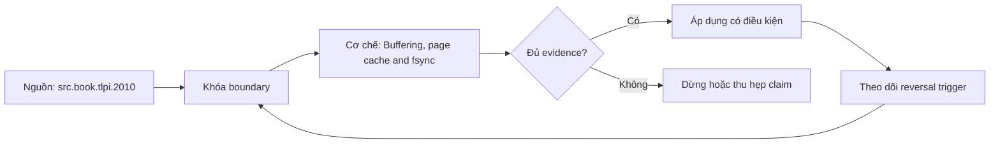

# Buffering, page cache and fsync

**Tóm tắt bản chất:** Đo được cái giá của `fsync` và phát biểu chính xác mức cam kết bền vững của ba cấu hình ghi. Cơ chế chỉ có giá trị khi workload, version, state owner và failure boundary đã được khóa; một con số đẹp ngoài bốn điều kiện đó không đủ để ra quyết định.

> [!abstract] Câu hỏi trung tâm
> Làm thế nào mô hình, đo và ra quyết định đúng về Buffering, page cache and fsync?

## Problem Definition and Operational Relevance

Tin rằng ghi xong là dữ liệu đã bền · gọi `fsync` sau mỗi bản ghi rồi thắc mắc vì sao chậm · đo lần hai mà quên bộ đệm trang đã ấm. Đây không phải danh sách lỗi cú pháp. Mỗi lỗi làm người vận hành chọn nhầm owner hoặc chữa symptom ở layer sau, khiến thời gian phục hồi tăng dù command vừa chạy trả về thành công.

Năng lực cần giữ sau bài là: Đo được cái giá của `fsync` và phát biểu chính xác mức cam kết bền vững của ba cấu hình ghi. Nếu learner chỉ nhắc lại định nghĩa nhưng không phân biệt được hai state gần nhau trên số đo, bài chưa đạt.

## Mechanism

Giữa lệnh ghi của chương trình và byte nằm trên đĩa có ít nhất ba tầng đệm, và không biết tầng nào đã qua thì không biết dữ liệu có sống sót khi mất điện hay không. Đệm của thư viện, bộ đệm trang của nhân, và bộ đệm của chính thiết bị. Lệnh ghi thường chỉ chép vào bộ đệm trang rồi trả về ngay, nên **ghi xong không có nghĩa là dữ liệu đã bền**. `fsync` buộc nhân đẩy xuống thiết bị và chờ xác nhận, và đó là lý do nó chậm hơn ghi thường nhiều bậc. Ba mức cam kết bền vững và giá của từng mức, đo được thành số. Đây chính là cơ chế đứng sau nhật ký ghi trước ở M10 và sau tham số xác nhận của hệ truyền thông điệp: mọi hệ hứa không mất dữ liệu đều phải trả giá `fsync` ở đâu đó. Bộ đệm trang cũng giải thích vì sao lần đo thứ hai luôn nhanh hơn lần đầu, một cái bẫy đã nêu ở lesson 33.

Tách ba lớp khi đọc cơ chế `wiki.de-foundation.buffering-page-cache-and-fsync`: declared state là điều cấu hình hoặc API yêu cầu; executed state là việc runtime thực sự làm; consumer-visible state là điều client hay operator quan sát. Ba lớp có thể lệch nhau vì cache, buffering, retry, scheduling, queue hoặc failure giữa hai transition. Evidence phải chỉ ra lớp nào đang được đo.

## Decision Framework

| Bước | Câu hỏi phải khóa | Điều kiện đạt |
|---|---|---|
| Model | Giải thích chi phí bằng hierarchy, parallel fraction hoặc data movement | Model dự đoán đúng khi đổi scale |
| Measure | Dùng counter và benchmark khóa workload | Observation khớp oracle và có raw sample |
| Explain | Nối delta với mechanism | Reviewer tái hiện được reasoning |
| Reverse | Đổi workload, layout hoặc resource | Quyết định đổi khi bottleneck đổi |

Quy tắc mặc định là chọn phép giải thích đơn giản nhất qua được hard constraints, rồi viết trước reversal trigger. Với `Buffering, page cache and fsync`, absence of error không phải pass; pass cần observation đúng grain, một oracle độc lập và changed-constraint case đủ làm model có cơ hội thất bại.

## Worked Case: Buffering, page cache and fsync

Ghi 100.000 bản ghi ở ba cấu hình: ghi đệm, ghi đệm rồi đẩy một lần cuối, và gọi `fsync` sau mỗi bản ghi. Đo thông lượng từng cấu hình. Mô phỏng mất điện bằng cách giết tiến trình cứng và đếm số bản ghi còn lại ở mỗi cấu hình. Lập bảng ba cột.

Trong case `wiki.de-foundation.buffering-page-cache-and-fsync`, learner ghi expected transition, input snapshot, version và giới hạn an toàn trước khi chạy. Sau execution, họ giữ raw counter, timestamp, exit status, state trước-sau và giải thích delta bằng mechanism ở trên. Đánh giá không cho phép sửa expected result sau khi nhìn output mà không ghi change record.

Biến thể khó hơn đổi một constraint có khả năng đảo kết luận: workload shape, memory pressure, connection reuse, retry budget, permission hoặc dependency direction. Tầng *phân tích*. Objective đòi nối một tham số cấu hình với một cam kết ngữ nghĩa và một con số. Kiểm bằng bảng ba cấu hình cộng thí nghiệm mất điện mô phỏng; đạt khi ba mức cam kết được phát biểu đúng và số đo đúng chiều.

## Limits and Common Errors

**Hiểu lầm:** Tin rằng ghi xong là dữ liệu đã bền. **Thực tế:** tín hiệu chỉ chứng minh điều nó đo trong đúng scope; state ở layer khác vẫn có thể trái ngược. **Vì sao nghe hợp lý:** happy path nhỏ thường không chạm queue, cache, partial progress hoặc restart.

**Hiểu lầm:** gọi `fsync` sau mỗi bản ghi rồi thắc mắc vì sao chậm. **Thực tế:** tool và API cung cấp primitive, không tự cấp ownership, deadline, idempotency hay recovery policy. **Vì sao nghe hợp lý:** syntax gọn che mất protocol và lifecycle phía dưới.

Với `wiki.de-foundation.buffering-page-cache-and-fsync`, một edge case đáng giữ là observation đúng nhưng diagnosis sai: counter tăng thật, song nguyên nhân điều khiển nằm ở layer trước. Muốn tránh, timeline phải nối trigger tới consumer harm và ghi rõ negative control nào đã loại giả thuyết cạnh tranh.

## Nếu Bạn Dạy Lại Điều Này...

Mở bài bằng một dự đoán dễ sai về `Buffering, page cache and fsync`, không mở bằng định nghĩa. Cho hai trace gần giống nhau nhưng khác đúng một state boundary; learner phải chọn probe tiếp theo trước khi được xem đáp án.

Bài tập seed dùng chính lab của DE-L053, sau đó đổi constraint đủ mạnh để buộc giữ hoặc đảo quyết định. Người dạy chấm reasoning chain và evidence, không chấm việc learner đoán đúng tên công cụ.

## Ma trận kiểm chứng từng mệnh đề

Protocol riêng của `Buffering, page cache and fsync` dùng điều kiện hoàn thành sau: Bảng ba cấu hình có cả thông lượng lẫn số bản ghi sống sót, và ba mức cam kết bền vững được phát biểu đúng. Mỗi probe phải có prediction, failure signal và independent oracle.

### Probe 1: state transition và invariant

**Mệnh đề P1 cần kiểm.** Giữa lệnh ghi của chương trình và byte nằm trên đĩa có ít nhất ba tầng đệm, và không biết tầng nào đã qua thì không biết dữ liệu có sống sót khi mất điện hay không.

**Thiết kế phép thử cho `wiki.de-foundation.buffering-page-cache-and-fsync`.** Với `wiki.de-foundation.buffering-page-cache-and-fsync`, tạo positive và negative control chỉ khác một điều kiện; khóa workload, version, identity, permission, clock và state ban đầu. Expected result được viết trước execution để tiêu chí không trôi theo output.

**Bằng chứng P1 cần giữ.** Với `wiki.de-foundation.buffering-page-cache-and-fsync`, lưu command hoặc harness, raw observation, transition trước-sau, coverage và limitation. Kết luận chỉ đạt khi oracle độc lập khớp đúng grain; nếu chưa chạy thì đây vẫn là protocol, không phải observation.

### Probe 2: identity, ownership và boundary

**Mệnh đề P2 cần kiểm.** Đo được cái giá của `fsync` và phát biểu chính xác mức cam kết bền vững của ba cấu hình ghi.

**Thiết kế phép thử cho `wiki.de-foundation.buffering-page-cache-and-fsync`.** Với `wiki.de-foundation.buffering-page-cache-and-fsync`, tạo boundary case ngay trước và sau ngưỡng; khóa workload, version, identity, permission, clock và state ban đầu. Expected result được viết trước execution để tiêu chí không trôi theo output.

**Bằng chứng P2 cần giữ.** Với `wiki.de-foundation.buffering-page-cache-and-fsync`, lưu command hoặc harness, raw observation, transition trước-sau, coverage và limitation. Kết luận chỉ đạt khi oracle độc lập khớp đúng grain; nếu chưa chạy thì đây vẫn là protocol, không phải observation.

### Probe 3: failure path và recovery

**Mệnh đề P3 cần kiểm.** Tầng *phân tích*.

**Thiết kế phép thử cho `wiki.de-foundation.buffering-page-cache-and-fsync`.** Với `wiki.de-foundation.buffering-page-cache-and-fsync`, tạo replay cùng identity nhưng đổi state; khóa workload, version, identity, permission, clock và state ban đầu. Expected result được viết trước execution để tiêu chí không trôi theo output.

**Bằng chứng P3 cần giữ.** Với `wiki.de-foundation.buffering-page-cache-and-fsync`, lưu command hoặc harness, raw observation, transition trước-sau, coverage và limitation. Kết luận chỉ đạt khi oracle độc lập khớp đúng grain; nếu chưa chạy thì đây vẫn là protocol, không phải observation.

### Probe 4: decision trade-off và reversal trigger

**Mệnh đề P4 cần kiểm.** Ghi 100.000 bản ghi ở ba cấu hình: ghi đệm, ghi đệm rồi đẩy một lần cuối, và gọi `fsync` sau mỗi bản ghi.

**Thiết kế phép thử cho `wiki.de-foundation.buffering-page-cache-and-fsync`.** Với `wiki.de-foundation.buffering-page-cache-and-fsync`, tạo failure inject trước và sau transition bền vững; khóa workload, version, identity, permission, clock và state ban đầu. Expected result được viết trước execution để tiêu chí không trôi theo output.

**Bằng chứng P4 cần giữ.** Với `wiki.de-foundation.buffering-page-cache-and-fsync`, lưu command hoặc harness, raw observation, transition trước-sau, coverage và limitation. Kết luận chỉ đạt khi oracle độc lập khớp đúng grain; nếu chưa chạy thì đây vẫn là protocol, không phải observation.

### Probe 5: evidence package và oracle

**Mệnh đề P5 cần kiểm.** Tin rằng ghi xong là dữ liệu đã bền · gọi `fsync` sau mỗi bản ghi rồi thắc mắc vì sao chậm · đo lần hai mà quên bộ đệm trang đã ấm.

**Thiết kế phép thử cho `wiki.de-foundation.buffering-page-cache-and-fsync`.** Với `wiki.de-foundation.buffering-page-cache-and-fsync`, tạo changed scale làm cost model đổi; khóa workload, version, identity, permission, clock và state ban đầu. Expected result được viết trước execution để tiêu chí không trôi theo output.

**Bằng chứng P5 cần giữ.** Với `wiki.de-foundation.buffering-page-cache-and-fsync`, lưu command hoặc harness, raw observation, transition trước-sau, coverage và limitation. Kết luận chỉ đạt khi oracle độc lập khớp đúng grain; nếu chưa chạy thì đây vẫn là protocol, không phải observation.

### Probe 6: changed-constraint transfer

**Mệnh đề P6 cần kiểm.** Bảng ba cấu hình có cả thông lượng lẫn số bản ghi sống sót, và ba mức cam kết bền vững được phát biểu đúng.

**Thiết kế phép thử cho `wiki.de-foundation.buffering-page-cache-and-fsync`.** Với `wiki.de-foundation.buffering-page-cache-and-fsync`, tạo adversarial order, skew hoặc packet timing; khóa workload, version, identity, permission, clock và state ban đầu. Expected result được viết trước execution để tiêu chí không trôi theo output.

**Bằng chứng P6 cần giữ.** Với `wiki.de-foundation.buffering-page-cache-and-fsync`, lưu command hoặc harness, raw observation, transition trước-sau, coverage và limitation. Kết luận chỉ đạt khi oracle độc lập khớp đúng grain; nếu chưa chạy thì đây vẫn là protocol, không phải observation.

### Probe 7: state transition và invariant

**Mệnh đề P7 cần kiểm.** Giữa lệnh ghi của chương trình và byte nằm trên đĩa có ít nhất ba tầng đệm, và không biết tầng nào đã qua thì không biết dữ liệu có sống sót khi mất điện hay không.

**Thiết kế phép thử cho `wiki.de-foundation.buffering-page-cache-and-fsync`.** Với `wiki.de-foundation.buffering-page-cache-and-fsync`, tạo fresh environment không cache; khóa workload, version, identity, permission, clock và state ban đầu. Expected result được viết trước execution để tiêu chí không trôi theo output.

**Bằng chứng P7 cần giữ.** Với `wiki.de-foundation.buffering-page-cache-and-fsync`, lưu command hoặc harness, raw observation, transition trước-sau, coverage và limitation. Kết luận chỉ đạt khi oracle độc lập khớp đúng grain; nếu chưa chạy thì đây vẫn là protocol, không phải observation.

### Probe 8: identity, ownership và boundary

**Mệnh đề P8 cần kiểm.** Đo được cái giá của `fsync` và phát biểu chính xác mức cam kết bền vững của ba cấu hình ghi.

**Thiết kế phép thử cho `wiki.de-foundation.buffering-page-cache-and-fsync`.** Với `wiki.de-foundation.buffering-page-cache-and-fsync`, tạo independent oracle không dùng chung implementation; khóa workload, version, identity, permission, clock và state ban đầu. Expected result được viết trước execution để tiêu chí không trôi theo output.

**Bằng chứng P8 cần giữ.** Với `wiki.de-foundation.buffering-page-cache-and-fsync`, lưu command hoặc harness, raw observation, transition trước-sau, coverage và limitation. Kết luận chỉ đạt khi oracle độc lập khớp đúng grain; nếu chưa chạy thì đây vẫn là protocol, không phải observation.

### Probe 9: failure path và recovery

**Mệnh đề P9 cần kiểm.** Tầng *phân tích*.

**Thiết kế phép thử cho `wiki.de-foundation.buffering-page-cache-and-fsync`.** Với `wiki.de-foundation.buffering-page-cache-and-fsync`, tạo partial progress rồi restart; khóa workload, version, identity, permission, clock và state ban đầu. Expected result được viết trước execution để tiêu chí không trôi theo output.

**Bằng chứng P9 cần giữ.** Với `wiki.de-foundation.buffering-page-cache-and-fsync`, lưu command hoặc harness, raw observation, transition trước-sau, coverage và limitation. Kết luận chỉ đạt khi oracle độc lập khớp đúng grain; nếu chưa chạy thì đây vẫn là protocol, không phải observation.

### Probe 10: decision trade-off và reversal trigger

**Mệnh đề P10 cần kiểm.** Ghi 100.000 bản ghi ở ba cấu hình: ghi đệm, ghi đệm rồi đẩy một lần cuối, và gọi `fsync` sau mỗi bản ghi.

**Thiết kế phép thử cho `wiki.de-foundation.buffering-page-cache-and-fsync`.** Với `wiki.de-foundation.buffering-page-cache-and-fsync`, tạo missing evidence phải abstain; khóa workload, version, identity, permission, clock và state ban đầu. Expected result được viết trước execution để tiêu chí không trôi theo output.

**Bằng chứng P10 cần giữ.** Với `wiki.de-foundation.buffering-page-cache-and-fsync`, lưu command hoặc harness, raw observation, transition trước-sau, coverage và limitation. Kết luận chỉ đạt khi oracle độc lập khớp đúng grain; nếu chưa chạy thì đây vẫn là protocol, không phải observation.

### Probe 11: evidence package và oracle

**Mệnh đề P11 cần kiểm.** Tin rằng ghi xong là dữ liệu đã bền · gọi `fsync` sau mỗi bản ghi rồi thắc mắc vì sao chậm · đo lần hai mà quên bộ đệm trang đã ấm.

**Thiết kế phép thử cho `wiki.de-foundation.buffering-page-cache-and-fsync`.** Với `wiki.de-foundation.buffering-page-cache-and-fsync`, tạo reviewer tái hiện từ evidence package; khóa workload, version, identity, permission, clock và state ban đầu. Expected result được viết trước execution để tiêu chí không trôi theo output.

**Bằng chứng P11 cần giữ.** Với `wiki.de-foundation.buffering-page-cache-and-fsync`, lưu command hoặc harness, raw observation, transition trước-sau, coverage và limitation. Kết luận chỉ đạt khi oracle độc lập khớp đúng grain; nếu chưa chạy thì đây vẫn là protocol, không phải observation.

### Probe 12: changed-constraint transfer

**Mệnh đề P12 cần kiểm.** Bảng ba cấu hình có cả thông lượng lẫn số bản ghi sống sót, và ba mức cam kết bền vững được phát biểu đúng.

**Thiết kế phép thử cho `wiki.de-foundation.buffering-page-cache-and-fsync`.** Với `wiki.de-foundation.buffering-page-cache-and-fsync`, tạo constraint đổi đủ để quyết định đảo; khóa workload, version, identity, permission, clock và state ban đầu. Expected result được viết trước execution để tiêu chí không trôi theo output.

**Bằng chứng P12 cần giữ.** Với `wiki.de-foundation.buffering-page-cache-and-fsync`, lưu command hoặc harness, raw observation, transition trước-sau, coverage và limitation. Kết luận chỉ đạt khi oracle độc lập khớp đúng grain; nếu chưa chạy thì đây vẫn là protocol, không phải observation.

## Tự Kiểm Tra Nhanh

1. Boundary đầu tiên khiến mô hình `Buffering, page cache and fsync` không còn đúng là gì?

<details><summary>Đáp án</summary>Tin rằng ghi xong là dữ liệu đã bền · gọi `fsync` sau mỗi bản ghi rồi thắc mắc vì sao chậm · đo lần hai mà quên bộ đệm trang đã ấm.</details>

2. Evidence nào phân biệt được hai state dễ nhầm?

<details><summary>Đáp án</summary>Tầng *phân tích*. Objective đòi nối một tham số cấu hình với một cam kết ngữ nghĩa và một con số. Kiểm bằng bảng ba cấu hình cộng thí nghiệm mất điện mô phỏng; đạt khi ba mức cam kết được phát biểu đúng và số đo đúng chiều.</details>

3. Khi constraint đổi, điều gì quyết định giữ hay đảo lựa chọn?

<details><summary>Đáp án</summary>Bảng ba cấu hình có cả thông lượng lẫn số bản ghi sống sót, và ba mức cam kết bền vững được phát biểu đúng.</details>

## Giới hạn và điều chưa cho phép kết luận

- Lab của `Buffering, page cache and fsync` chưa được tuyên bố đã chạy trên production; note mô tả curriculum và expected evidence.
- Hành vi phụ thuộc kernel, distribution, library, network path hoặc hardware phải được kiểm lại trên target đã ghi version.
- Concept key `ck.de.buffering-page-cache-and-fsync` đã được owner phê duyệt `canonical`; note thuộc canonical registry coverage. Trạng thái này không tự chứng minh learner mastery.
- Một trace đơn lẻ không chứng minh capacity, reliability hoặc security cho population khác.
- Note giữ trạng thái `review` cho tới khi owner duyệt semantics và learner artifact.

## Reference
1. [[SRC-TLPI-2010]]

## Source coverage

| Source slice | Locator | Kiến thức phải giữ | Vị trí | Trạng thái | Ngoài phạm vi |
|---|---|---|---|---|---|
| [[SRC-TLPI-2010]]: `src.book.tlpi.2010` | Chapters 4-39, 49-50, 61 và 63 theo scope record; PDF 113-1418 | mechanism và boundary liên quan trực tiếp tới `Buffering, page cache and fsync` | cơ chế, quyết định, case và probe | Đã phủ | phần ngoài objective DE-L053 |

## Key takeaways
- Đo được cái giá của `fsync` và phát biểu chính xác mức cam kết bền vững của ba cấu hình ghi.
- Bảng ba cấu hình có cả thông lượng lẫn số bản ghi sống sót, và ba mức cam kết bền vững được phát biểu đúng.
- `Buffering, page cache and fsync` chỉ có nghĩa trong scope, state, identity và version đã ghi.
- Trước khi lab chạy, đây là note có provenance và protocol, chưa phải production evidence hay bằng chứng mastery.

<!-- ATOMIC-EXECUTION-CAPSULE:START -->

## Execution capsule: kiểm chứng `wiki.de-foundation.buffering-page-cache-and-fsync`

> [!important] Phân loại mệnh đề
> Với `wiki.de-foundation.buffering-page-cache-and-fsync`, sơ đồ, ví dụ và artifact về **Buffering, page cache and fsync** là **synthesis để kiểm chứng**; chúng không phải trích dẫn hay case nguyên văn của nguồn.

### Sơ đồ cơ chế và điểm kiểm soát



Đọc sơ đồ `wiki.de-foundation.buffering-page-cache-and-fsync` từ trái sang phải: source chỉ cung cấp claim ban đầu cho **Buffering, page cache and fsync**; quyết định chỉ được đi tiếp sau khi boundary, evidence và điều kiện đảo quyết định đã hiện hữu.

### Artifact thực thi tối thiểu

```yaml
concept_id: "wiki.de-foundation.buffering-page-cache-and-fsync"
concept: "Buffering, page cache and fsync"
primary_question: "Làm thế nào mô hình, đo và ra quyết định đúng về Buffering, page cache and fsync?"
decision_contract:
  input_boundary: "Ghi population, thời điểm, owner và điều chưa biết"
  hard_constraints:
    - "Không vượt quyền hoặc privacy boundary"
    - "Không dùng cùng một assumption làm cả implementation và oracle"
  accept_when: "Có observation phân biệt được các lựa chọn"
  reversal_trigger: "Một hard constraint sai hoặc evidence mới đổi recommendation"
evidence_to_keep:
  - "input snapshot"
  - "chosen and rejected options"
  - "independent review result"
```

Artifact của `wiki.de-foundation.buffering-page-cache-and-fsync` buộc người dùng ghi boundary, oracle và reversal trigger cho **Buffering, page cache and fsync**. Các giá trị minh họa phải được thay bằng evidence thật trước khi dùng cho quyết định.

<!-- ATOMIC-EXECUTION-CAPSULE:END -->
