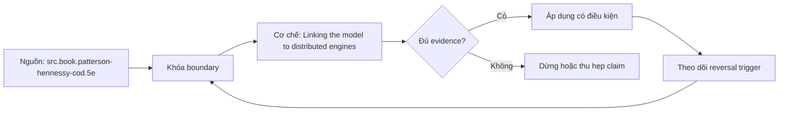

# Linking the model to distributed engines

**Tóm tắt bản chất:** Ước lượng thứ tự chi phí của bốn thao tác trong một công việc phân tán và chỉ ra thao tác đắt nhất. Cơ chế chỉ có giá trị khi workload, version, state owner và failure boundary đã được khóa; một con số đẹp ngoài bốn điều kiện đó không đủ để ra quyết định.

> [!abstract] Câu hỏi trung tâm
> Làm thế nào mô hình, đo và ra quyết định đúng về Linking the model to distributed engines?

## Nỗi Đau & Động Lực

Nghĩ phép tính là phần đắt nhất · bỏ qua chi phí tuần tự hoá · coi tràn ra đĩa là lỗi cấu hình · xếp hạng theo cảm tính mà không đo. Đây không phải danh sách lỗi cú pháp. Mỗi lỗi làm người vận hành chọn nhầm owner hoặc chữa symptom ở layer sau, khiến thời gian phục hồi tăng dù command vừa chạy trả về thành công.

Năng lực cần giữ sau bài là: Ước lượng thứ tự chi phí của bốn thao tác trong một công việc phân tán và chỉ ra thao tác đắt nhất. Nếu learner chỉ nhắc lại định nghĩa nhưng không phân biệt được hai state gần nhau trên số đo, bài chưa đạt.

## Cơ Chế Tác Động

Bài nối thứ hai, chuẩn bị cho M23 và M14. Bốn liên hệ. Tuần tự hoá: dữ liệu đi qua mạng hoặc qua ranh giới tiến trình phải chuyển thành byte rồi chuyển lại, và chi phí đó thường lớn hơn phép tính; đây là lý do hàm do người dùng định nghĩa chậm hơn hàm dựng sẵn ở engine phân tán. Xáo trộn: gom dữ liệu cùng khoá về một chỗ nghĩa là ghi đĩa cục bộ, truyền mạng, đọc lại, tức là đi qua ba bậc chậm nhất của thứ bậc bộ nhớ cùng lúc, nên nó là thao tác đắt nhất. Tràn ra đĩa khi dữ liệu không vừa bộ nhớ, và vì sao đó là cơ chế tự bảo vệ chứ lỗi. Áp lực bộ nhớ và bộ dọn rác: giữ quá nhiều dữ liệu sống làm bộ dọn chạy liên tục và ăn CPU mà không làm việc hữu ích. Thực thi theo véc tơ ở engine cột khai thác đúng tính cục bộ ở lesson 47, nên hiểu lesson 47 là hiểu vì sao engine cột nhanh. Ba tầng song song lồng nhau đặt ra ở lesson 48 và lesson 56 gặp lại đầy đủ ở đây: tiến trình trên nhiều nút, toán tử xử lý theo lô trong mỗi tiến trình, và làn véctơ trong mỗi toán tử; M14 và M23 sẽ đo từng tầng riêng.

Tách ba lớp khi đọc cơ chế `wiki.de-foundation.linking-the-model-to-distributed-engines`: declared state là điều cấu hình hoặc API yêu cầu; executed state là việc runtime thực sự làm; consumer-visible state là điều client hay operator quan sát. Ba lớp có thể lệch nhau vì cache, buffering, retry, scheduling, queue hoặc failure giữa hai transition. Evidence phải chỉ ra lớp nào đang được đo.

## Bản Đồ Quyết Định

| Bước | Câu hỏi phải khóa | Điều kiện đạt |
|---|---|---|
| Model | Giải thích chi phí bằng hierarchy, parallel fraction hoặc data movement | Model dự đoán đúng khi đổi scale |
| Measure | Dùng counter và benchmark khóa workload | Observation khớp oracle và có raw sample |
| Explain | Nối delta với mechanism | Reviewer tái hiện được reasoning |
| Reverse | Đổi workload, layout hoặc resource | Quyết định đổi khi bottleneck đổi |

Quy tắc mặc định là chọn phép giải thích đơn giản nhất qua được hard constraints, rồi viết trước reversal trigger. Với `Linking the model to distributed engines`, absence of error không phải pass; pass cần observation đúng grain, một oracle độc lập và changed-constraint case đủ làm model có cơ hội thất bại.

## Case Study Thực Chiến: Linking the model to distributed engines

Cho mô tả một công việc phân tán gồm đọc tệp, lọc, gộp nhóm theo khoá, và ghi kết quả. Xếp hạng chi phí bốn bước và giải thích từng bước bằng thứ bậc bộ nhớ ở lesson 45. Đo chi phí tuần tự hoá bằng cách so truyền một triệu bản ghi qua ranh giới tiến trình ở hai định dạng khác nhau.

Trong case `wiki.de-foundation.linking-the-model-to-distributed-engines`, learner ghi expected transition, input snapshot, version và giới hạn an toàn trước khi chạy. Sau execution, họ giữ raw counter, timestamp, exit status, state trước–sau và giải thích delta bằng mechanism ở trên. Đánh giá không cho phép sửa expected result sau khi nhìn output mà không ghi change record.

Biến thể khó hơn đổi một constraint có khả năng đảo kết luận: workload shape, memory pressure, connection reuse, retry budget, permission hoặc dependency direction. Tầng *hiểu*. Bài nối chuẩn bị cho M23; kiểm bằng lập luận chứ bằng vận hành engine. Kiểm bằng bài xếp hạng có lý do; đạt khi xếp đúng thứ tự và giải thích xáo trộn bằng ba bậc thứ bậc bộ nhớ.

## Góc Khuất & Ngộ Nhận

**Hiểu lầm:** Nghĩ phép tính là phần đắt nhất. **Thực tế:** tín hiệu chỉ chứng minh điều nó đo trong đúng scope; state ở layer khác vẫn có thể trái ngược. **Vì sao nghe hợp lý:** happy path nhỏ thường không chạm queue, cache, partial progress hoặc restart.

**Hiểu lầm:** bỏ qua chi phí tuần tự hoá. **Thực tế:** tool và API cung cấp primitive, không tự cấp ownership, deadline, idempotency hay recovery policy. **Vì sao nghe hợp lý:** syntax gọn che mất protocol và lifecycle phía dưới.

Với `wiki.de-foundation.linking-the-model-to-distributed-engines`, một edge case đáng giữ là observation đúng nhưng diagnosis sai: counter tăng thật, song nguyên nhân điều khiển nằm ở layer trước. Muốn tránh, timeline phải nối trigger tới consumer harm và ghi rõ negative control nào đã loại giả thuyết cạnh tranh.

## Nếu Bạn Dạy Lại Điều Này...

Mở bài bằng một dự đoán dễ sai về `Linking the model to distributed engines`, không mở bằng định nghĩa. Cho hai trace gần giống nhau nhưng khác đúng một state boundary; learner phải chọn probe tiếp theo trước khi được xem đáp án.

Bài tập seed dùng chính lab của DE-L058, sau đó đổi constraint đủ mạnh để buộc giữ hoặc đảo quyết định. Người dạy chấm reasoning chain và evidence, không chấm việc learner đoán đúng tên công cụ.

## Ma trận kiểm chứng từng mệnh đề

Protocol riêng của `Linking the model to distributed engines` dùng điều kiện hoàn thành sau: Xếp đúng thứ tự chi phí bốn bước, giải thích xáo trộn bằng ba bậc thứ bậc bộ nhớ, và có số đo chi phí tuần tự hoá. Mỗi probe phải có prediction, failure signal và independent oracle.

### Probe 1: state transition và invariant

**Mệnh đề P1 cần kiểm.** Bài nối thứ hai, chuẩn bị cho M23 và M14.

**Thiết kế phép thử cho `wiki.de-foundation.linking-the-model-to-distributed-engines`.** Với `wiki.de-foundation.linking-the-model-to-distributed-engines`, tạo positive và negative control chỉ khác một điều kiện; khóa workload, version, identity, permission, clock và state ban đầu. Expected result được viết trước execution để tiêu chí không trôi theo output.

**Bằng chứng P1 cần giữ.** Với `wiki.de-foundation.linking-the-model-to-distributed-engines`, lưu command hoặc harness, raw observation, transition trước–sau, coverage và limitation. Kết luận chỉ đạt khi oracle độc lập khớp đúng grain; nếu chưa chạy thì đây vẫn là protocol, không phải observation.

### Probe 2: identity, ownership và boundary

**Mệnh đề P2 cần kiểm.** Ước lượng thứ tự chi phí của bốn thao tác trong một công việc phân tán và chỉ ra thao tác đắt nhất.

**Thiết kế phép thử cho `wiki.de-foundation.linking-the-model-to-distributed-engines`.** Với `wiki.de-foundation.linking-the-model-to-distributed-engines`, tạo boundary case ngay trước và sau ngưỡng; khóa workload, version, identity, permission, clock và state ban đầu. Expected result được viết trước execution để tiêu chí không trôi theo output.

**Bằng chứng P2 cần giữ.** Với `wiki.de-foundation.linking-the-model-to-distributed-engines`, lưu command hoặc harness, raw observation, transition trước–sau, coverage và limitation. Kết luận chỉ đạt khi oracle độc lập khớp đúng grain; nếu chưa chạy thì đây vẫn là protocol, không phải observation.

### Probe 3: failure path và recovery

**Mệnh đề P3 cần kiểm.** Tầng *hiểu*.

**Thiết kế phép thử cho `wiki.de-foundation.linking-the-model-to-distributed-engines`.** Với `wiki.de-foundation.linking-the-model-to-distributed-engines`, tạo replay cùng identity nhưng đổi state; khóa workload, version, identity, permission, clock và state ban đầu. Expected result được viết trước execution để tiêu chí không trôi theo output.

**Bằng chứng P3 cần giữ.** Với `wiki.de-foundation.linking-the-model-to-distributed-engines`, lưu command hoặc harness, raw observation, transition trước–sau, coverage và limitation. Kết luận chỉ đạt khi oracle độc lập khớp đúng grain; nếu chưa chạy thì đây vẫn là protocol, không phải observation.

### Probe 4: decision trade-off và reversal trigger

**Mệnh đề P4 cần kiểm.** Cho mô tả một công việc phân tán gồm đọc tệp, lọc, gộp nhóm theo khoá, và ghi kết quả.

**Thiết kế phép thử cho `wiki.de-foundation.linking-the-model-to-distributed-engines`.** Với `wiki.de-foundation.linking-the-model-to-distributed-engines`, tạo failure inject trước và sau transition bền vững; khóa workload, version, identity, permission, clock và state ban đầu. Expected result được viết trước execution để tiêu chí không trôi theo output.

**Bằng chứng P4 cần giữ.** Với `wiki.de-foundation.linking-the-model-to-distributed-engines`, lưu command hoặc harness, raw observation, transition trước–sau, coverage và limitation. Kết luận chỉ đạt khi oracle độc lập khớp đúng grain; nếu chưa chạy thì đây vẫn là protocol, không phải observation.

### Probe 5: evidence package và oracle

**Mệnh đề P5 cần kiểm.** Nghĩ phép tính là phần đắt nhất · bỏ qua chi phí tuần tự hoá · coi tràn ra đĩa là lỗi cấu hình · xếp hạng theo cảm tính mà không đo.

**Thiết kế phép thử cho `wiki.de-foundation.linking-the-model-to-distributed-engines`.** Với `wiki.de-foundation.linking-the-model-to-distributed-engines`, tạo changed scale làm cost model đổi; khóa workload, version, identity, permission, clock và state ban đầu. Expected result được viết trước execution để tiêu chí không trôi theo output.

**Bằng chứng P5 cần giữ.** Với `wiki.de-foundation.linking-the-model-to-distributed-engines`, lưu command hoặc harness, raw observation, transition trước–sau, coverage và limitation. Kết luận chỉ đạt khi oracle độc lập khớp đúng grain; nếu chưa chạy thì đây vẫn là protocol, không phải observation.

### Probe 6: changed-constraint transfer

**Mệnh đề P6 cần kiểm.** Xếp đúng thứ tự chi phí bốn bước, giải thích xáo trộn bằng ba bậc thứ bậc bộ nhớ, và có số đo chi phí tuần tự hoá.

**Thiết kế phép thử cho `wiki.de-foundation.linking-the-model-to-distributed-engines`.** Với `wiki.de-foundation.linking-the-model-to-distributed-engines`, tạo adversarial order, skew hoặc packet timing; khóa workload, version, identity, permission, clock và state ban đầu. Expected result được viết trước execution để tiêu chí không trôi theo output.

**Bằng chứng P6 cần giữ.** Với `wiki.de-foundation.linking-the-model-to-distributed-engines`, lưu command hoặc harness, raw observation, transition trước–sau, coverage và limitation. Kết luận chỉ đạt khi oracle độc lập khớp đúng grain; nếu chưa chạy thì đây vẫn là protocol, không phải observation.

### Probe 7: state transition và invariant

**Mệnh đề P7 cần kiểm.** Bài nối thứ hai, chuẩn bị cho M23 và M14.

**Thiết kế phép thử cho `wiki.de-foundation.linking-the-model-to-distributed-engines`.** Với `wiki.de-foundation.linking-the-model-to-distributed-engines`, tạo fresh environment không cache; khóa workload, version, identity, permission, clock và state ban đầu. Expected result được viết trước execution để tiêu chí không trôi theo output.

**Bằng chứng P7 cần giữ.** Với `wiki.de-foundation.linking-the-model-to-distributed-engines`, lưu command hoặc harness, raw observation, transition trước–sau, coverage và limitation. Kết luận chỉ đạt khi oracle độc lập khớp đúng grain; nếu chưa chạy thì đây vẫn là protocol, không phải observation.

### Probe 8: identity, ownership và boundary

**Mệnh đề P8 cần kiểm.** Ước lượng thứ tự chi phí của bốn thao tác trong một công việc phân tán và chỉ ra thao tác đắt nhất.

**Thiết kế phép thử cho `wiki.de-foundation.linking-the-model-to-distributed-engines`.** Với `wiki.de-foundation.linking-the-model-to-distributed-engines`, tạo independent oracle không dùng chung implementation; khóa workload, version, identity, permission, clock và state ban đầu. Expected result được viết trước execution để tiêu chí không trôi theo output.

**Bằng chứng P8 cần giữ.** Với `wiki.de-foundation.linking-the-model-to-distributed-engines`, lưu command hoặc harness, raw observation, transition trước–sau, coverage và limitation. Kết luận chỉ đạt khi oracle độc lập khớp đúng grain; nếu chưa chạy thì đây vẫn là protocol, không phải observation.

### Probe 9: failure path và recovery

**Mệnh đề P9 cần kiểm.** Tầng *hiểu*.

**Thiết kế phép thử cho `wiki.de-foundation.linking-the-model-to-distributed-engines`.** Với `wiki.de-foundation.linking-the-model-to-distributed-engines`, tạo partial progress rồi restart; khóa workload, version, identity, permission, clock và state ban đầu. Expected result được viết trước execution để tiêu chí không trôi theo output.

**Bằng chứng P9 cần giữ.** Với `wiki.de-foundation.linking-the-model-to-distributed-engines`, lưu command hoặc harness, raw observation, transition trước–sau, coverage và limitation. Kết luận chỉ đạt khi oracle độc lập khớp đúng grain; nếu chưa chạy thì đây vẫn là protocol, không phải observation.

### Probe 10: decision trade-off và reversal trigger

**Mệnh đề P10 cần kiểm.** Cho mô tả một công việc phân tán gồm đọc tệp, lọc, gộp nhóm theo khoá, và ghi kết quả.

**Thiết kế phép thử cho `wiki.de-foundation.linking-the-model-to-distributed-engines`.** Với `wiki.de-foundation.linking-the-model-to-distributed-engines`, tạo missing evidence phải abstain; khóa workload, version, identity, permission, clock và state ban đầu. Expected result được viết trước execution để tiêu chí không trôi theo output.

**Bằng chứng P10 cần giữ.** Với `wiki.de-foundation.linking-the-model-to-distributed-engines`, lưu command hoặc harness, raw observation, transition trước–sau, coverage và limitation. Kết luận chỉ đạt khi oracle độc lập khớp đúng grain; nếu chưa chạy thì đây vẫn là protocol, không phải observation.

### Probe 11: evidence package và oracle

**Mệnh đề P11 cần kiểm.** Nghĩ phép tính là phần đắt nhất · bỏ qua chi phí tuần tự hoá · coi tràn ra đĩa là lỗi cấu hình · xếp hạng theo cảm tính mà không đo.

**Thiết kế phép thử cho `wiki.de-foundation.linking-the-model-to-distributed-engines`.** Với `wiki.de-foundation.linking-the-model-to-distributed-engines`, tạo reviewer tái hiện từ evidence package; khóa workload, version, identity, permission, clock và state ban đầu. Expected result được viết trước execution để tiêu chí không trôi theo output.

**Bằng chứng P11 cần giữ.** Với `wiki.de-foundation.linking-the-model-to-distributed-engines`, lưu command hoặc harness, raw observation, transition trước–sau, coverage và limitation. Kết luận chỉ đạt khi oracle độc lập khớp đúng grain; nếu chưa chạy thì đây vẫn là protocol, không phải observation.

### Probe 12: changed-constraint transfer

**Mệnh đề P12 cần kiểm.** Xếp đúng thứ tự chi phí bốn bước, giải thích xáo trộn bằng ba bậc thứ bậc bộ nhớ, và có số đo chi phí tuần tự hoá.

**Thiết kế phép thử cho `wiki.de-foundation.linking-the-model-to-distributed-engines`.** Với `wiki.de-foundation.linking-the-model-to-distributed-engines`, tạo constraint đổi đủ để quyết định đảo; khóa workload, version, identity, permission, clock và state ban đầu. Expected result được viết trước execution để tiêu chí không trôi theo output.

**Bằng chứng P12 cần giữ.** Với `wiki.de-foundation.linking-the-model-to-distributed-engines`, lưu command hoặc harness, raw observation, transition trước–sau, coverage và limitation. Kết luận chỉ đạt khi oracle độc lập khớp đúng grain; nếu chưa chạy thì đây vẫn là protocol, không phải observation.

## Tự Kiểm Tra Nhanh

1. Boundary đầu tiên khiến mô hình `Linking the model to distributed engines` không còn đúng là gì?

<details><summary>Đáp án</summary>Nghĩ phép tính là phần đắt nhất · bỏ qua chi phí tuần tự hoá · coi tràn ra đĩa là lỗi cấu hình · xếp hạng theo cảm tính mà không đo.</details>

2. Evidence nào phân biệt được hai state dễ nhầm?

<details><summary>Đáp án</summary>Tầng *hiểu*. Bài nối chuẩn bị cho M23; kiểm bằng lập luận chứ bằng vận hành engine. Kiểm bằng bài xếp hạng có lý do; đạt khi xếp đúng thứ tự và giải thích xáo trộn bằng ba bậc thứ bậc bộ nhớ.</details>

3. Khi constraint đổi, điều gì quyết định giữ hay đảo lựa chọn?

<details><summary>Đáp án</summary>Xếp đúng thứ tự chi phí bốn bước, giải thích xáo trộn bằng ba bậc thứ bậc bộ nhớ, và có số đo chi phí tuần tự hoá.</details>

## Giới hạn và điều chưa cho phép kết luận

- Lab của `Linking the model to distributed engines` chưa được tuyên bố đã chạy trên production; note mô tả curriculum và expected evidence.
- Hành vi phụ thuộc kernel, distribution, library, network path hoặc hardware phải được kiểm lại trên target đã ghi version.
- Concept key `ck.de.linking-the-model-to-distributed-engines` đã được owner phê duyệt `canonical`; note thuộc canonical registry coverage. Trạng thái này không tự chứng minh learner mastery.
- Một trace đơn lẻ không chứng minh capacity, reliability hoặc security cho population khác.
- Note giữ trạng thái `review` cho tới khi owner duyệt semantics và learner artifact.

## Reference
1. [[SRC-PATTERSON-HENNESSY-COD-5E]]
2. [[SRC-AMDAHL-1967]]
3. [[SRC-GUSTAFSON-1988]]
4. [[SRC-TRINO-DISTRIBUTED-PLANS]]

## Source coverage

| Source slice | Locator | Kiến thức phải giữ | Vị trí | Trạng thái | Ngoài phạm vi |
|---|---|---|---|---|---|
| [[SRC-PATTERSON-HENNESSY-COD-5E]] — `src.book.patterson-hennessy-cod.5e` | Chapter 5 và §6.3; PDF 397–538 | mechanism và boundary liên quan trực tiếp tới `Linking the model to distributed engines` | cơ chế, quyết định, case và probe | Đã phủ | phần ngoài objective DE-L058 |
| [[SRC-AMDAHL-1967]] — `src.paper.amdahl-1967` | Amdahl 1967, fixed-work serial fraction và strong-scaling boundary | mechanism và boundary liên quan trực tiếp tới `Linking the model to distributed engines` | cơ chế, quyết định, case và probe | Đã phủ | phần ngoài objective DE-L058 |
| [[SRC-GUSTAFSON-1988]] — `src.paper.gustafson-1988` | Gustafson 1988, scaled workload và weak-scaling boundary | mechanism và boundary liên quan trực tiếp tới `Linking the model to distributed engines` | cơ chế, quyết định, case và probe | Đã phủ | phần ngoài objective DE-L058 |
| [[SRC-TRINO-DISTRIBUTED-PLANS]] — `src.web.trino-distributed-plans` | Distributed EXPLAIN plans; accessed 2026-10-01 | mechanism và boundary liên quan trực tiếp tới `Linking the model to distributed engines` | cơ chế, quyết định, case và probe | Đã phủ | phần ngoài objective DE-L058 |

## Key takeaways
- Ước lượng thứ tự chi phí của bốn thao tác trong một công việc phân tán và chỉ ra thao tác đắt nhất.
- Xếp đúng thứ tự chi phí bốn bước, giải thích xáo trộn bằng ba bậc thứ bậc bộ nhớ, và có số đo chi phí tuần tự hoá.
- `Linking the model to distributed engines` chỉ có nghĩa trong scope, state, identity và version đã ghi.
- Trước khi lab chạy, đây là note có provenance và protocol, chưa phải production evidence hay bằng chứng mastery.

<!-- ATOMIC-EXECUTION-CAPSULE:START -->

## Execution capsule — kiểm chứng `wiki.de-foundation.linking-the-model-to-distributed-engines`

> [!important] Phân loại mệnh đề
> Với `wiki.de-foundation.linking-the-model-to-distributed-engines`, sơ đồ, ví dụ và artifact về **Linking the model to distributed engines** là **synthesis để kiểm chứng**; chúng không phải trích dẫn hay case nguyên văn của nguồn.

### Sơ đồ cơ chế và điểm kiểm soát



Đọc sơ đồ `wiki.de-foundation.linking-the-model-to-distributed-engines` từ trái sang phải: source chỉ cung cấp claim ban đầu cho **Linking the model to distributed engines**; quyết định chỉ được đi tiếp sau khi boundary, evidence và điều kiện đảo quyết định đã hiện hữu.

### Artifact thực thi tối thiểu

```yaml
concept_id: "wiki.de-foundation.linking-the-model-to-distributed-engines"
concept: "Linking the model to distributed engines"
primary_question: "Làm thế nào mô hình, đo và ra quyết định đúng về Linking the model to distributed engines?"
decision_contract:
  input_boundary: "Ghi population, thời điểm, owner và điều chưa biết"
  hard_constraints:
    - "Không vượt quyền hoặc privacy boundary"
    - "Không dùng cùng một assumption làm cả implementation và oracle"
  accept_when: "Có observation phân biệt được các lựa chọn"
  reversal_trigger: "Một hard constraint sai hoặc evidence mới đổi recommendation"
evidence_to_keep:
  - "input snapshot"
  - "chosen and rejected options"
  - "independent review result"
```

Artifact của `wiki.de-foundation.linking-the-model-to-distributed-engines` buộc người dùng ghi boundary, oracle và reversal trigger cho **Linking the model to distributed engines**. Các giá trị minh họa phải được thay bằng evidence thật trước khi dùng cho quyết định.

<!-- ATOMIC-EXECUTION-CAPSULE:END -->
