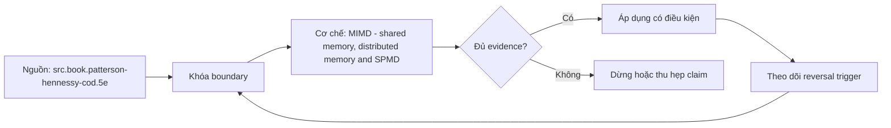

# MIMD - shared memory, distributed memory and SPMD

**Tóm tắt bản chất:** Đo tăng tốc và hiệu suất song song khi tăng số đơn vị thực thi, và quy trần hiệu năng về đúng nguyên nhân. Cơ chế chỉ có giá trị khi workload, version, state owner và failure boundary đã được khóa; một con số đẹp ngoài bốn điều kiện đó không đủ để ra quyết định.

> [!abstract] Câu hỏi trung tâm
> Làm thế nào mô hình, đo và ra quyết định đúng về MIMD - shared memory, distributed memory and SPMD?

## Problem Definition and Operational Relevance

Báo cáo tăng tốc mà không báo hiệu suất song song · thêm đơn vị thực thi khi trần là băng thông bộ nhớ · bỏ qua chia sẻ giả vì không thấy tranh chấp trong mã · so bản phân tán mà không tách thời gian truyền thông. Đây không phải danh sách lỗi cú pháp. Mỗi lỗi làm người vận hành chọn nhầm owner hoặc chữa symptom ở layer sau, khiến thời gian phục hồi tăng dù command vừa chạy trả về thành công.

Năng lực cần giữ sau bài là: Đo tăng tốc và hiệu suất song song khi tăng số đơn vị thực thi, và quy trần hiệu năng về đúng nguyên nhân. Nếu learner chỉ nhắc lại định nghĩa nhưng không phân biệt được hai state gần nhau trên số đo, bài chưa đạt.

## Mechanism

Bài đi vào tầng song song thứ hai, nơi mỗi đơn vị thực thi có dòng lệnh riêng. Hai dạng và hai mô hình chi phí khác hẳn nhau. Bộ nhớ dùng chung: nhiều lõi cùng nhìn một không gian địa chỉ, nên cần giao thức nhất quán bộ nhớ đệm và cần đồng bộ; chia sẻ giả xảy ra khi hai lõi ghi hai biến khác nhau nằm cùng một dòng đệm, và nó làm chậm mà không có tranh chấp logic nào; truy cập bộ nhớ không đồng nhất biến vị trí bộ nhớ thành một quyết định đặt chỗ. Bộ nhớ phân tán: trao đổi bằng thông điệp qua mạng, nên độ trễ, chi phí tuần tự hoá, cách phân vùng và hỏng một phần trở thành mô hình chi phí và mô hình hỏng. Một chương trình nhiều dữ liệu là khuôn mẫu phổ biến trên cả hai. **Tăng tốc bị chặn bởi phần tuần tự, mất cân bằng, đồng bộ, truyền thông và băng thông bộ nhớ**, nên phải báo cáo cả tăng tốc lẫn hiệu suất song song chứ chỉ con số tăng tốc.

Tách ba lớp khi đọc cơ chế `wiki.de-foundation.mimd-shared-memory-distributed-memory-and-spmd`: declared state là điều cấu hình hoặc API yêu cầu; executed state là việc runtime thực sự làm; consumer-visible state là điều client hay operator quan sát. Ba lớp có thể lệch nhau vì cache, buffering, retry, scheduling, queue hoặc failure giữa hai transition. Evidence phải chỉ ra lớp nào đang được đo.

## Decision Framework

| Bước | Câu hỏi phải khóa | Điều kiện đạt |
|---|---|---|
| Model | Giải thích chi phí bằng hierarchy, parallel fraction hoặc data movement | Model dự đoán đúng khi đổi scale |
| Measure | Dùng counter và benchmark khóa workload | Observation khớp oracle và có raw sample |
| Explain | Nối delta với mechanism | Reviewer tái hiện được reasoning |
| Reverse | Đổi workload, layout hoặc resource | Quyết định đổi khi bottleneck đổi |

Quy tắc mặc định là chọn phép giải thích đơn giản nhất qua được hard constraints, rồi viết trước reversal trigger. Với `MIMD - shared memory, distributed memory and SPMD`, absence of error không phải pass; pass cần observation đúng grain, một oracle độc lập và changed-constraint case đủ làm model có cơ hội thất bại.

## Worked Case: MIMD - shared memory, distributed memory and SPMD

Chạy cùng khối lượng công việc với 1, 2, 4 và 8 đơn vị thực thi; tính tăng tốc và hiệu suất song song ở mỗi mức. Ước lượng phần tuần tự từ đường cong và đối chiếu với dự đoán của định luật tăng tốc. Tái hiện chia sẻ giả và đo chi phí của nó. Chạy một bản đặt bộ nhớ ở nút xa và đo chênh lệch. Với bản phân tán, đo thời gian truyền thông tách khỏi thời gian tính.

Trong case `wiki.de-foundation.mimd-shared-memory-distributed-memory-and-spmd`, learner ghi expected transition, input snapshot, version và giới hạn an toàn trước khi chạy. Sau execution, họ giữ raw counter, timestamp, exit status, state trước-sau và giải thích delta bằng mechanism ở trên. Đánh giá không cho phép sửa expected result sau khi nhìn output mà không ghi change record.

Biến thể khó hơn đổi một constraint có khả năng đảo kết luận: workload shape, memory pressure, connection reuse, retry budget, permission hoặc dependency direction. Tầng *phân tích*. Objective đòi giải thích vì sao đường tăng tốc bão hoà chứ chỉ vẽ nó. Kiểm bằng thí nghiệm thay đổi quy mô; đạt khi đường hiệu suất song song được vẽ tới ít nhất tám đơn vị và trần được quy về nguyên nhân bằng số đo.

## Limits and Common Errors

**Hiểu lầm:** Báo cáo tăng tốc mà không báo hiệu suất song song. **Thực tế:** tín hiệu chỉ chứng minh điều nó đo trong đúng scope; state ở layer khác vẫn có thể trái ngược. **Vì sao nghe hợp lý:** happy path nhỏ thường không chạm queue, cache, partial progress hoặc restart.

**Hiểu lầm:** thêm đơn vị thực thi khi trần là băng thông bộ nhớ. **Thực tế:** tool và API cung cấp primitive, không tự cấp ownership, deadline, idempotency hay recovery policy. **Vì sao nghe hợp lý:** syntax gọn che mất protocol và lifecycle phía dưới.

Với `wiki.de-foundation.mimd-shared-memory-distributed-memory-and-spmd`, một edge case đáng giữ là observation đúng nhưng diagnosis sai: counter tăng thật, song nguyên nhân điều khiển nằm ở layer trước. Muốn tránh, timeline phải nối trigger tới consumer harm và ghi rõ negative control nào đã loại giả thuyết cạnh tranh.

## Nếu Bạn Dạy Lại Điều Này...

Mở bài bằng một dự đoán dễ sai về `MIMD - shared memory, distributed memory and SPMD`, không mở bằng định nghĩa. Cho hai trace gần giống nhau nhưng khác đúng một state boundary; learner phải chọn probe tiếp theo trước khi được xem đáp án.

Bài tập seed dùng chính lab của DE-L056, sau đó đổi constraint đủ mạnh để buộc giữ hoặc đảo quyết định. Người dạy chấm reasoning chain và evidence, không chấm việc learner đoán đúng tên công cụ.

## Ma trận kiểm chứng từng mệnh đề

Protocol riêng của `MIMD - shared memory, distributed memory and SPMD` dùng điều kiện hoàn thành sau: Đường hiệu suất song song có số đo tới ≥ 8 đơn vị, phần tuần tự được ước lượng từ dữ liệu, và trần hiệu năng được quy về nguyên nhân cụ thể. Mỗi probe phải có prediction, failure signal và independent oracle.

### Probe 1: state transition và invariant

**Mệnh đề P1 cần kiểm.** Bài đi vào tầng song song thứ hai, nơi mỗi đơn vị thực thi có dòng lệnh riêng.

**Thiết kế phép thử cho `wiki.de-foundation.mimd-shared-memory-distributed-memory-and-spmd`.** Với `wiki.de-foundation.mimd-shared-memory-distributed-memory-and-spmd`, tạo positive và negative control chỉ khác một điều kiện; khóa workload, version, identity, permission, clock và state ban đầu. Expected result được viết trước execution để tiêu chí không trôi theo output.

**Bằng chứng P1 cần giữ.** Với `wiki.de-foundation.mimd-shared-memory-distributed-memory-and-spmd`, lưu command hoặc harness, raw observation, transition trước-sau, coverage và limitation. Kết luận chỉ đạt khi oracle độc lập khớp đúng grain; nếu chưa chạy thì đây vẫn là protocol, không phải observation.

### Probe 2: identity, ownership và boundary

**Mệnh đề P2 cần kiểm.** Đo tăng tốc và hiệu suất song song khi tăng số đơn vị thực thi, và quy trần hiệu năng về đúng nguyên nhân.

**Thiết kế phép thử cho `wiki.de-foundation.mimd-shared-memory-distributed-memory-and-spmd`.** Với `wiki.de-foundation.mimd-shared-memory-distributed-memory-and-spmd`, tạo boundary case ngay trước và sau ngưỡng; khóa workload, version, identity, permission, clock và state ban đầu. Expected result được viết trước execution để tiêu chí không trôi theo output.

**Bằng chứng P2 cần giữ.** Với `wiki.de-foundation.mimd-shared-memory-distributed-memory-and-spmd`, lưu command hoặc harness, raw observation, transition trước-sau, coverage và limitation. Kết luận chỉ đạt khi oracle độc lập khớp đúng grain; nếu chưa chạy thì đây vẫn là protocol, không phải observation.

### Probe 3: failure path và recovery

**Mệnh đề P3 cần kiểm.** Tầng *phân tích*.

**Thiết kế phép thử cho `wiki.de-foundation.mimd-shared-memory-distributed-memory-and-spmd`.** Với `wiki.de-foundation.mimd-shared-memory-distributed-memory-and-spmd`, tạo replay cùng identity nhưng đổi state; khóa workload, version, identity, permission, clock và state ban đầu. Expected result được viết trước execution để tiêu chí không trôi theo output.

**Bằng chứng P3 cần giữ.** Với `wiki.de-foundation.mimd-shared-memory-distributed-memory-and-spmd`, lưu command hoặc harness, raw observation, transition trước-sau, coverage và limitation. Kết luận chỉ đạt khi oracle độc lập khớp đúng grain; nếu chưa chạy thì đây vẫn là protocol, không phải observation.

### Probe 4: decision trade-off và reversal trigger

**Mệnh đề P4 cần kiểm.** Chạy cùng khối lượng công việc với 1, 2, 4 và 8 đơn vị thực thi; tính tăng tốc và hiệu suất song song ở mỗi mức.

**Thiết kế phép thử cho `wiki.de-foundation.mimd-shared-memory-distributed-memory-and-spmd`.** Với `wiki.de-foundation.mimd-shared-memory-distributed-memory-and-spmd`, tạo failure inject trước và sau transition bền vững; khóa workload, version, identity, permission, clock và state ban đầu. Expected result được viết trước execution để tiêu chí không trôi theo output.

**Bằng chứng P4 cần giữ.** Với `wiki.de-foundation.mimd-shared-memory-distributed-memory-and-spmd`, lưu command hoặc harness, raw observation, transition trước-sau, coverage và limitation. Kết luận chỉ đạt khi oracle độc lập khớp đúng grain; nếu chưa chạy thì đây vẫn là protocol, không phải observation.

### Probe 5: evidence package và oracle

**Mệnh đề P5 cần kiểm.** Báo cáo tăng tốc mà không báo hiệu suất song song · thêm đơn vị thực thi khi trần là băng thông bộ nhớ · bỏ qua chia sẻ giả vì không thấy tranh chấp trong mã · so bản phân tán mà không tách thời gian truyền...

**Thiết kế phép thử cho `wiki.de-foundation.mimd-shared-memory-distributed-memory-and-spmd`.** Với `wiki.de-foundation.mimd-shared-memory-distributed-memory-and-spmd`, tạo changed scale làm cost model đổi; khóa workload, version, identity, permission, clock và state ban đầu. Expected result được viết trước execution để tiêu chí không trôi theo output.

**Bằng chứng P5 cần giữ.** Với `wiki.de-foundation.mimd-shared-memory-distributed-memory-and-spmd`, lưu command hoặc harness, raw observation, transition trước-sau, coverage và limitation. Kết luận chỉ đạt khi oracle độc lập khớp đúng grain; nếu chưa chạy thì đây vẫn là protocol, không phải observation.

### Probe 6: changed-constraint transfer

**Mệnh đề P6 cần kiểm.** Đường hiệu suất song song có số đo tới ≥ 8 đơn vị, phần tuần tự được ước lượng từ dữ liệu, và trần hiệu năng được quy về nguyên nhân cụ thể.

**Thiết kế phép thử cho `wiki.de-foundation.mimd-shared-memory-distributed-memory-and-spmd`.** Với `wiki.de-foundation.mimd-shared-memory-distributed-memory-and-spmd`, tạo adversarial order, skew hoặc packet timing; khóa workload, version, identity, permission, clock và state ban đầu. Expected result được viết trước execution để tiêu chí không trôi theo output.

**Bằng chứng P6 cần giữ.** Với `wiki.de-foundation.mimd-shared-memory-distributed-memory-and-spmd`, lưu command hoặc harness, raw observation, transition trước-sau, coverage và limitation. Kết luận chỉ đạt khi oracle độc lập khớp đúng grain; nếu chưa chạy thì đây vẫn là protocol, không phải observation.

### Probe 7: state transition và invariant

**Mệnh đề P7 cần kiểm.** Bài đi vào tầng song song thứ hai, nơi mỗi đơn vị thực thi có dòng lệnh riêng.

**Thiết kế phép thử cho `wiki.de-foundation.mimd-shared-memory-distributed-memory-and-spmd`.** Với `wiki.de-foundation.mimd-shared-memory-distributed-memory-and-spmd`, tạo fresh environment không cache; khóa workload, version, identity, permission, clock và state ban đầu. Expected result được viết trước execution để tiêu chí không trôi theo output.

**Bằng chứng P7 cần giữ.** Với `wiki.de-foundation.mimd-shared-memory-distributed-memory-and-spmd`, lưu command hoặc harness, raw observation, transition trước-sau, coverage và limitation. Kết luận chỉ đạt khi oracle độc lập khớp đúng grain; nếu chưa chạy thì đây vẫn là protocol, không phải observation.

### Probe 8: identity, ownership và boundary

**Mệnh đề P8 cần kiểm.** Đo tăng tốc và hiệu suất song song khi tăng số đơn vị thực thi, và quy trần hiệu năng về đúng nguyên nhân.

**Thiết kế phép thử cho `wiki.de-foundation.mimd-shared-memory-distributed-memory-and-spmd`.** Với `wiki.de-foundation.mimd-shared-memory-distributed-memory-and-spmd`, tạo independent oracle không dùng chung implementation; khóa workload, version, identity, permission, clock và state ban đầu. Expected result được viết trước execution để tiêu chí không trôi theo output.

**Bằng chứng P8 cần giữ.** Với `wiki.de-foundation.mimd-shared-memory-distributed-memory-and-spmd`, lưu command hoặc harness, raw observation, transition trước-sau, coverage và limitation. Kết luận chỉ đạt khi oracle độc lập khớp đúng grain; nếu chưa chạy thì đây vẫn là protocol, không phải observation.

### Probe 9: failure path và recovery

**Mệnh đề P9 cần kiểm.** Tầng *phân tích*.

**Thiết kế phép thử cho `wiki.de-foundation.mimd-shared-memory-distributed-memory-and-spmd`.** Với `wiki.de-foundation.mimd-shared-memory-distributed-memory-and-spmd`, tạo partial progress rồi restart; khóa workload, version, identity, permission, clock và state ban đầu. Expected result được viết trước execution để tiêu chí không trôi theo output.

**Bằng chứng P9 cần giữ.** Với `wiki.de-foundation.mimd-shared-memory-distributed-memory-and-spmd`, lưu command hoặc harness, raw observation, transition trước-sau, coverage và limitation. Kết luận chỉ đạt khi oracle độc lập khớp đúng grain; nếu chưa chạy thì đây vẫn là protocol, không phải observation.

### Probe 10: decision trade-off và reversal trigger

**Mệnh đề P10 cần kiểm.** Chạy cùng khối lượng công việc với 1, 2, 4 và 8 đơn vị thực thi; tính tăng tốc và hiệu suất song song ở mỗi mức.

**Thiết kế phép thử cho `wiki.de-foundation.mimd-shared-memory-distributed-memory-and-spmd`.** Với `wiki.de-foundation.mimd-shared-memory-distributed-memory-and-spmd`, tạo missing evidence phải abstain; khóa workload, version, identity, permission, clock và state ban đầu. Expected result được viết trước execution để tiêu chí không trôi theo output.

**Bằng chứng P10 cần giữ.** Với `wiki.de-foundation.mimd-shared-memory-distributed-memory-and-spmd`, lưu command hoặc harness, raw observation, transition trước-sau, coverage và limitation. Kết luận chỉ đạt khi oracle độc lập khớp đúng grain; nếu chưa chạy thì đây vẫn là protocol, không phải observation.

### Probe 11: evidence package và oracle

**Mệnh đề P11 cần kiểm.** Báo cáo tăng tốc mà không báo hiệu suất song song · thêm đơn vị thực thi khi trần là băng thông bộ nhớ · bỏ qua chia sẻ giả vì không thấy tranh chấp trong mã · so bản phân tán mà không tách thời gian truyền...

**Thiết kế phép thử cho `wiki.de-foundation.mimd-shared-memory-distributed-memory-and-spmd`.** Với `wiki.de-foundation.mimd-shared-memory-distributed-memory-and-spmd`, tạo reviewer tái hiện từ evidence package; khóa workload, version, identity, permission, clock và state ban đầu. Expected result được viết trước execution để tiêu chí không trôi theo output.

**Bằng chứng P11 cần giữ.** Với `wiki.de-foundation.mimd-shared-memory-distributed-memory-and-spmd`, lưu command hoặc harness, raw observation, transition trước-sau, coverage và limitation. Kết luận chỉ đạt khi oracle độc lập khớp đúng grain; nếu chưa chạy thì đây vẫn là protocol, không phải observation.

### Probe 12: changed-constraint transfer

**Mệnh đề P12 cần kiểm.** Đường hiệu suất song song có số đo tới ≥ 8 đơn vị, phần tuần tự được ước lượng từ dữ liệu, và trần hiệu năng được quy về nguyên nhân cụ thể.

**Thiết kế phép thử cho `wiki.de-foundation.mimd-shared-memory-distributed-memory-and-spmd`.** Với `wiki.de-foundation.mimd-shared-memory-distributed-memory-and-spmd`, tạo constraint đổi đủ để quyết định đảo; khóa workload, version, identity, permission, clock và state ban đầu. Expected result được viết trước execution để tiêu chí không trôi theo output.

**Bằng chứng P12 cần giữ.** Với `wiki.de-foundation.mimd-shared-memory-distributed-memory-and-spmd`, lưu command hoặc harness, raw observation, transition trước-sau, coverage và limitation. Kết luận chỉ đạt khi oracle độc lập khớp đúng grain; nếu chưa chạy thì đây vẫn là protocol, không phải observation.

## Tự Kiểm Tra Nhanh

1. Boundary đầu tiên khiến mô hình `MIMD - shared memory, distributed memory and SPMD` không còn đúng là gì?

<details><summary>Đáp án</summary>Báo cáo tăng tốc mà không báo hiệu suất song song · thêm đơn vị thực thi khi trần là băng thông bộ nhớ · bỏ qua chia sẻ giả vì không thấy tranh chấp trong mã · so bản phân tán mà không tách thời gian truyền thông.</details>

2. Evidence nào phân biệt được hai state dễ nhầm?

<details><summary>Đáp án</summary>Tầng *phân tích*. Objective đòi giải thích vì sao đường tăng tốc bão hoà chứ chỉ vẽ nó. Kiểm bằng thí nghiệm thay đổi quy mô; đạt khi đường hiệu suất song song được vẽ tới ít nhất tám đơn vị và trần được quy về nguyên nhân bằng số đo.</details>

3. Khi constraint đổi, điều gì quyết định giữ hay đảo lựa chọn?

<details><summary>Đáp án</summary>Đường hiệu suất song song có số đo tới ≥ 8 đơn vị, phần tuần tự được ước lượng từ dữ liệu, và trần hiệu năng được quy về nguyên nhân cụ thể.</details>

## Giới hạn và điều chưa cho phép kết luận

- Lab của `MIMD - shared memory, distributed memory and SPMD` chưa được tuyên bố đã chạy trên production; note mô tả curriculum và expected evidence.
- Hành vi phụ thuộc kernel, distribution, library, network path hoặc hardware phải được kiểm lại trên target đã ghi version.
- Concept key `ck.de.mimd-shared-memory-distributed-memory-and-spmd` đã được owner phê duyệt `canonical`; note thuộc canonical registry coverage. Trạng thái này không tự chứng minh learner mastery.
- Một trace đơn lẻ không chứng minh capacity, reliability hoặc security cho population khác.
- Note giữ trạng thái `review` cho tới khi owner duyệt semantics và learner artifact.

## Reference
1. [[SRC-PATTERSON-HENNESSY-COD-5E]]
2. [[SRC-AMDAHL-1967]]
3. [[SRC-GUSTAFSON-1988]]

## Source coverage

| Source slice | Locator | Kiến thức phải giữ | Vị trí | Trạng thái | Ngoài phạm vi |
|---|---|---|---|---|---|
| [[SRC-PATTERSON-HENNESSY-COD-5E]]: `src.book.patterson-hennessy-cod.5e` | Chapter 5 và §6.3; PDF 397-538 | mechanism và boundary liên quan trực tiếp tới `MIMD - shared memory, distributed memory and SPMD` | cơ chế, quyết định, case và probe | Đã phủ | phần ngoài objective DE-L056 |
| [[SRC-AMDAHL-1967]]: `src.paper.amdahl-1967` | Amdahl 1967, fixed-work serial fraction và strong-scaling boundary | mechanism và boundary liên quan trực tiếp tới `MIMD - shared memory, distributed memory and SPMD` | cơ chế, quyết định, case và probe | Đã phủ | phần ngoài objective DE-L056 |
| [[SRC-GUSTAFSON-1988]]: `src.paper.gustafson-1988` | Gustafson 1988, scaled workload và weak-scaling boundary | mechanism và boundary liên quan trực tiếp tới `MIMD - shared memory, distributed memory and SPMD` | cơ chế, quyết định, case và probe | Đã phủ | phần ngoài objective DE-L056 |

## Key takeaways
- Đo tăng tốc và hiệu suất song song khi tăng số đơn vị thực thi, và quy trần hiệu năng về đúng nguyên nhân.
- Đường hiệu suất song song có số đo tới ≥ 8 đơn vị, phần tuần tự được ước lượng từ dữ liệu, và trần hiệu năng được quy về nguyên nhân cụ thể.
- `MIMD - shared memory, distributed memory and SPMD` chỉ có nghĩa trong scope, state, identity và version đã ghi.
- Trước khi lab chạy, đây là note có provenance và protocol, chưa phải production evidence hay bằng chứng mastery.

<!-- ATOMIC-EXECUTION-CAPSULE:START -->

## Execution capsule: kiểm chứng `wiki.de-foundation.mimd-shared-memory-distributed-memory-and-spmd`

> [!important] Phân loại mệnh đề
> Với `wiki.de-foundation.mimd-shared-memory-distributed-memory-and-spmd`, sơ đồ, ví dụ và artifact về **MIMD - shared memory, distributed memory and SPMD** là **synthesis để kiểm chứng**; chúng không phải trích dẫn hay case nguyên văn của nguồn.

### Sơ đồ cơ chế và điểm kiểm soát



Đọc sơ đồ `wiki.de-foundation.mimd-shared-memory-distributed-memory-and-spmd` từ trái sang phải: source chỉ cung cấp claim ban đầu cho **MIMD - shared memory, distributed memory and SPMD**; quyết định chỉ được đi tiếp sau khi boundary, evidence và điều kiện đảo quyết định đã hiện hữu.

### Artifact thực thi tối thiểu

```yaml
concept_id: "wiki.de-foundation.mimd-shared-memory-distributed-memory-and-spmd"
concept: "MIMD - shared memory, distributed memory and SPMD"
primary_question: "Làm thế nào mô hình, đo và ra quyết định đúng về MIMD - shared memory, distributed memory and SPMD?"
decision_contract:
  input_boundary: "Ghi population, thời điểm, owner và điều chưa biết"
  hard_constraints:
    - "Không vượt quyền hoặc privacy boundary"
    - "Không dùng cùng một assumption làm cả implementation và oracle"
  accept_when: "Có observation phân biệt được các lựa chọn"
  reversal_trigger: "Một hard constraint sai hoặc evidence mới đổi recommendation"
evidence_to_keep:
  - "input snapshot"
  - "chosen and rejected options"
  - "independent review result"
```

Artifact của `wiki.de-foundation.mimd-shared-memory-distributed-memory-and-spmd` buộc người dùng ghi boundary, oracle và reversal trigger cho **MIMD - shared memory, distributed memory and SPMD**. Các giá trị minh họa phải được thay bằng evidence thật trước khi dùng cho quyết định.

<!-- ATOMIC-EXECUTION-CAPSULE:END -->
