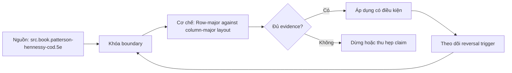

# Row-major against column-major layout

**Tóm tắt bản chất:** linear address maps multidimensional indices; contiguous dimension determines locality; column layout also separates fields for projection Sai boundary ở `row-major và column-major layout theo traversal/operator` làm kết quả có vẻ đúng trong happy path nhưng không chịu được failure hoặc changed constraint.

> [!abstract] Câu hỏi trung tâm
> Làm thế nào mô hình, kiểm chứng và áp dụng row-major và column-major layout theo traversal/operator?

## Problem Definition and Operational Relevance

linear address maps multidimensional indices; contiguous dimension determines locality; column layout also separates fields for projection Với `wiki.de-foundation.row-major-vs-column-major-layout`, điểm phải khóa là state transition và invariant; nếu trường nào chưa biết thì ghi unknown và nêu impact-if-wrong thay vì tự điền mặc định.

Không có mô hình này, lỗi thường lộ ở consumer sau cùng: output sai, latency vọt, resource không được giải phóng hoặc lịch sử không còn tái hiện được. Chi phí thật của `Row-major against column-major layout` vì thế nằm ở thời gian chẩn đoán và phạm vi phục hồi, không nằm ở số dòng syntax.

## Mechanism

language array order, nested objects and database columnar encoding are related but not identical Với `wiki.de-foundation.row-major-vs-column-major-layout`, điểm phải khóa là identity, ownership và boundary; nếu trường nào chưa biết thì ghi unknown và nêu impact-if-wrong thay vì tự điền mặc định.

Hãy tách declared state, executed state và published state của `row-major và column-major layout theo traversal/operator`. Một command thành công chỉ là executed signal; muốn kết luận cần đối soát consumer-visible invariant và trạng thái còn lại sau restart hoặc replay.

## Decision Framework

loop order mismatch creates stride; row layout scans unused fields; column layout hurts point reconstruction Với `wiki.de-foundation.row-major-vs-column-major-layout`, điểm phải khóa là failure path và recovery; nếu trường nào chưa biết thì ghi unknown và nêu impact-if-wrong thay vì tự điền mặc định.

Quy tắc mặc định cho `Row-major against column-major layout` là chọn phương án đơn giản nhất qua được hard constraints, rồi ghi rõ điều kiện đảo. Bảng quyết định tối thiểu gồm workload, identity, state owner, time/memory budget, failure domain và khả năng rollback.

## Worked Case: Row-major against column-major layout

match layout/traversal to dominant access and vectorization/compression; transpose only if reuse pays cost Với `wiki.de-foundation.row-major-vs-column-major-layout`, điểm phải khóa là decision trade-off và reversal trigger; nếu trường nào chưa biết thì ghi unknown và nêu impact-if-wrong thay vì tự điền mặc định.

Case dùng fixture nhỏ nhưng phải giữ cơ chế chi phối. Trước khi chạy, learner viết expected transition; sau khi chạy, họ đối chiếu raw artifact với oracle và giải thích mọi khác biệt thay vì sửa expected cho khớp output.

## Limits and Common Errors

bytes touched, stride, cache misses, scan/project latency and transpose cost Với `wiki.de-foundation.row-major-vs-column-major-layout`, điểm phải khóa là evidence package và oracle; nếu trường nào chưa biết thì ghi unknown và nêu impact-if-wrong thay vì tự điền mặc định.

**Hiểu lầm:** Happy path chạy nhanh nghĩa là thiết kế đúng. **Thực tế:** loop order mismatch creates stride; row layout scans unused fields; column layout hurts point reconstruction **Vì sao nghe hợp lý:** case nhỏ thường không chạm capacity, concurrency, failure hoặc version boundary.

**Hiểu lầm:** Tool hoặc API tự bảo đảm semantics. **Thực tế:** guarantee chỉ tồn tại trong scope và state đã công bố. **Vì sao nghe hợp lý:** syntax che mất protocol phía dưới.

## Nếu Bạn Dạy Lại Điều Này...

swap loop order and selected-column ratio across crossover Với `wiki.de-foundation.row-major-vs-column-major-layout`, điểm phải khóa là changed-constraint transfer; nếu trường nào chưa biết thì ghi unknown và nêu impact-if-wrong thay vì tự điền mặc định.

Hook dạy lại bắt đầu bằng một dự đoán dễ sai về `row-major và column-major layout theo traversal/operator`. Bài tập seed đổi đúng một constraint, yêu cầu learner giữ hoặc đảo quyết định và chỉ ra evidence nào đủ mạnh để thuyết phục một reviewer không tham dự buổi học.

## Ma trận kiểm chứng từng mệnh đề

Protocol riêng của `Row-major against column-major layout` là: bytes touched, stride, cache misses, scan/project latency and transpose cost Mỗi probe nối input boundary với failure signal và oracle có thể bác bỏ kết luận.

### Probe 1: state transition và invariant

**Mệnh đề cần kiểm.** linear address maps multidimensional indices; contiguous dimension determines locality; column layout also separates fields for projection

**Thiết kế phép thử cho `wiki.de-foundation.row-major-vs-column-major-layout`.** Với `wiki.de-foundation.row-major-vs-column-major-layout`, tạo positive và negative control chỉ khác một điều kiện; khóa input snapshot, phiên bản, seed, identity và state ban đầu. Viết expected result trước execution để tránh đổi tiêu chí sau khi nhìn output.

**Bằng chứng cần giữ.** Lưu command hoặc harness, raw observation, transition trước-sau, coverage và limitation. Kết luận chỉ đạt khi oracle độc lập khớp ở đúng grain; nếu chưa chạy, phần này vẫn là protocol chứ không phải observation.

### Probe 2: identity, ownership và boundary

**Mệnh đề cần kiểm.** language array order, nested objects and database columnar encoding are related but not identical

**Thiết kế phép thử cho `wiki.de-foundation.row-major-vs-column-major-layout`.** Với `wiki.de-foundation.row-major-vs-column-major-layout`, tạo boundary case ngay trước và sau ngưỡng; khóa input snapshot, phiên bản, seed, identity và state ban đầu. Viết expected result trước execution để tránh đổi tiêu chí sau khi nhìn output.

**Bằng chứng cần giữ.** Lưu command hoặc harness, raw observation, transition trước-sau, coverage và limitation. Kết luận chỉ đạt khi oracle độc lập khớp ở đúng grain; nếu chưa chạy, phần này vẫn là protocol chứ không phải observation.

### Probe 3: failure path và recovery

**Mệnh đề cần kiểm.** loop order mismatch creates stride; row layout scans unused fields; column layout hurts point reconstruction

**Thiết kế phép thử cho `wiki.de-foundation.row-major-vs-column-major-layout`.** Với `wiki.de-foundation.row-major-vs-column-major-layout`, tạo replay cùng identity với state khác; khóa input snapshot, phiên bản, seed, identity và state ban đầu. Viết expected result trước execution để tránh đổi tiêu chí sau khi nhìn output.

**Bằng chứng cần giữ.** Lưu command hoặc harness, raw observation, transition trước-sau, coverage và limitation. Kết luận chỉ đạt khi oracle độc lập khớp ở đúng grain; nếu chưa chạy, phần này vẫn là protocol chứ không phải observation.

### Probe 4: decision trade-off và reversal trigger

**Mệnh đề cần kiểm.** match layout/traversal to dominant access and vectorization/compression; transpose only if reuse pays cost

**Thiết kế phép thử cho `wiki.de-foundation.row-major-vs-column-major-layout`.** Với `wiki.de-foundation.row-major-vs-column-major-layout`, tạo failure inject trước và sau durable transition; khóa input snapshot, phiên bản, seed, identity và state ban đầu. Viết expected result trước execution để tránh đổi tiêu chí sau khi nhìn output.

**Bằng chứng cần giữ.** Lưu command hoặc harness, raw observation, transition trước-sau, coverage và limitation. Kết luận chỉ đạt khi oracle độc lập khớp ở đúng grain; nếu chưa chạy, phần này vẫn là protocol chứ không phải observation.

### Probe 5: evidence package và oracle

**Mệnh đề cần kiểm.** bytes touched, stride, cache misses, scan/project latency and transpose cost

**Thiết kế phép thử cho `wiki.de-foundation.row-major-vs-column-major-layout`.** Với `wiki.de-foundation.row-major-vs-column-major-layout`, tạo changed scale làm cost model đổi; khóa input snapshot, phiên bản, seed, identity và state ban đầu. Viết expected result trước execution để tránh đổi tiêu chí sau khi nhìn output.

**Bằng chứng cần giữ.** Lưu command hoặc harness, raw observation, transition trước-sau, coverage và limitation. Kết luận chỉ đạt khi oracle độc lập khớp ở đúng grain; nếu chưa chạy, phần này vẫn là protocol chứ không phải observation.

### Probe 6: changed-constraint transfer

**Mệnh đề cần kiểm.** swap loop order and selected-column ratio across crossover

**Thiết kế phép thử cho `wiki.de-foundation.row-major-vs-column-major-layout`.** Với `wiki.de-foundation.row-major-vs-column-major-layout`, tạo adversarial order hoặc skew; khóa input snapshot, phiên bản, seed, identity và state ban đầu. Viết expected result trước execution để tránh đổi tiêu chí sau khi nhìn output.

**Bằng chứng cần giữ.** Lưu command hoặc harness, raw observation, transition trước-sau, coverage và limitation. Kết luận chỉ đạt khi oracle độc lập khớp ở đúng grain; nếu chưa chạy, phần này vẫn là protocol chứ không phải observation.

### Probe 7: state transition và invariant

**Mệnh đề cần kiểm.** linear address maps multidimensional indices; contiguous dimension determines locality; column layout also separates fields for projection

**Thiết kế phép thử cho `wiki.de-foundation.row-major-vs-column-major-layout`.** Với `wiki.de-foundation.row-major-vs-column-major-layout`, tạo fresh environment không cache; khóa input snapshot, phiên bản, seed, identity và state ban đầu. Viết expected result trước execution để tránh đổi tiêu chí sau khi nhìn output.

**Bằng chứng cần giữ.** Lưu command hoặc harness, raw observation, transition trước-sau, coverage và limitation. Kết luận chỉ đạt khi oracle độc lập khớp ở đúng grain; nếu chưa chạy, phần này vẫn là protocol chứ không phải observation.

### Probe 8: identity, ownership và boundary

**Mệnh đề cần kiểm.** language array order, nested objects and database columnar encoding are related but not identical

**Thiết kế phép thử cho `wiki.de-foundation.row-major-vs-column-major-layout`.** Với `wiki.de-foundation.row-major-vs-column-major-layout`, tạo independent oracle không dùng chung implementation; khóa input snapshot, phiên bản, seed, identity và state ban đầu. Viết expected result trước execution để tránh đổi tiêu chí sau khi nhìn output.

**Bằng chứng cần giữ.** Lưu command hoặc harness, raw observation, transition trước-sau, coverage và limitation. Kết luận chỉ đạt khi oracle độc lập khớp ở đúng grain; nếu chưa chạy, phần này vẫn là protocol chứ không phải observation.

### Probe 9: failure path và recovery

**Mệnh đề cần kiểm.** loop order mismatch creates stride; row layout scans unused fields; column layout hurts point reconstruction

**Thiết kế phép thử cho `wiki.de-foundation.row-major-vs-column-major-layout`.** Với `wiki.de-foundation.row-major-vs-column-major-layout`, tạo partial progress rồi restart; khóa input snapshot, phiên bản, seed, identity và state ban đầu. Viết expected result trước execution để tránh đổi tiêu chí sau khi nhìn output.

**Bằng chứng cần giữ.** Lưu command hoặc harness, raw observation, transition trước-sau, coverage và limitation. Kết luận chỉ đạt khi oracle độc lập khớp ở đúng grain; nếu chưa chạy, phần này vẫn là protocol chứ không phải observation.

### Probe 10: decision trade-off và reversal trigger

**Mệnh đề cần kiểm.** match layout/traversal to dominant access and vectorization/compression; transpose only if reuse pays cost

**Thiết kế phép thử cho `wiki.de-foundation.row-major-vs-column-major-layout`.** Với `wiki.de-foundation.row-major-vs-column-major-layout`, tạo missing evidence phải abstain; khóa input snapshot, phiên bản, seed, identity và state ban đầu. Viết expected result trước execution để tránh đổi tiêu chí sau khi nhìn output.

**Bằng chứng cần giữ.** Lưu command hoặc harness, raw observation, transition trước-sau, coverage và limitation. Kết luận chỉ đạt khi oracle độc lập khớp ở đúng grain; nếu chưa chạy, phần này vẫn là protocol chứ không phải observation.

### Probe 11: evidence package và oracle

**Mệnh đề cần kiểm.** bytes touched, stride, cache misses, scan/project latency and transpose cost

**Thiết kế phép thử cho `wiki.de-foundation.row-major-vs-column-major-layout`.** Với `wiki.de-foundation.row-major-vs-column-major-layout`, tạo reviewer tái hiện từ package; khóa input snapshot, phiên bản, seed, identity và state ban đầu. Viết expected result trước execution để tránh đổi tiêu chí sau khi nhìn output.

**Bằng chứng cần giữ.** Lưu command hoặc harness, raw observation, transition trước-sau, coverage và limitation. Kết luận chỉ đạt khi oracle độc lập khớp ở đúng grain; nếu chưa chạy, phần này vẫn là protocol chứ không phải observation.

### Probe 12: changed-constraint transfer

**Mệnh đề cần kiểm.** swap loop order and selected-column ratio across crossover

**Thiết kế phép thử cho `wiki.de-foundation.row-major-vs-column-major-layout`.** Với `wiki.de-foundation.row-major-vs-column-major-layout`, tạo constraint đổi đủ để quyết định đảo; khóa input snapshot, phiên bản, seed, identity và state ban đầu. Viết expected result trước execution để tránh đổi tiêu chí sau khi nhìn output.

**Bằng chứng cần giữ.** Lưu command hoặc harness, raw observation, transition trước-sau, coverage và limitation. Kết luận chỉ đạt khi oracle độc lập khớp ở đúng grain; nếu chưa chạy, phần này vẫn là protocol chứ không phải observation.

## Tự Kiểm Tra Nhanh

1. Boundary đầu tiên của `row-major và column-major layout theo traversal/operator` nằm ở đâu?

<details><summary>Đáp án</summary>language array order, nested objects and database columnar encoding are related but not identical</details>

2. Failure nào dễ tạo kết quả xanh giả nhất?

<details><summary>Đáp án</summary>loop order mismatch creates stride; row layout scans unused fields; column layout hurts point reconstruction</details>

3. Constraint nào khiến quyết định phải đảo?

<details><summary>Đáp án</summary>swap loop order and selected-column ratio across crossover</details>

## Giới hạn và điều chưa cho phép kết luận

- Lab của `Row-major against column-major layout` chưa được tuyên bố đã chạy trên production; note mô tả curriculum và expected evidence.
- Mọi kết luận phụ thuộc version, workload, operating system, interpreter/compiler hoặc hardware phải được kiểm lại trên target.
- Concept key `ck.de.row-major-vs-column-major-layout` đã được owner phê duyệt `canonical`; note thuộc canonical registry coverage. Trạng thái này không tự chứng minh learner mastery.
- Note giữ trạng thái `review` cho tới khi owner duyệt semantics và learner artifact.

## Reference
1. [[SRC-PATTERSON-HENNESSY-COD-5E]]
2. [[SRC-SILBERSCHATZ-DATABASE-SYSTEM-CONCEPTS-7E]]

## Source coverage

| Source slice | Locator | Kiến thức phải giữ | Vị trí | Trạng thái | Ngoài phạm vi |
|---|---|---|---|---|---|
| [[SRC-PATTERSON-HENNESSY-COD-5E]]: `src.book.patterson-hennessy-cod.5e` | Chapter 5 PDF 397-459; Section 6.3 PDF 523-538 | cơ chế và boundary liên quan trực tiếp tới `row-major và column-major layout theo traversal/operator` | các mục cơ chế, quyết định và probe | Đã phủ | phần ngoài objective DE-L047 |
| [[SRC-SILBERSCHATZ-DATABASE-SYSTEM-CONCEPTS-7E]]: `src.book.silberschatz-database-system-concepts.7e` | Chapter 15 PDF 1902-1955 | cơ chế và boundary liên quan trực tiếp tới `row-major và column-major layout theo traversal/operator` | các mục cơ chế, quyết định và probe | Đã phủ | phần ngoài objective DE-L047 |

## Key takeaways
- match layout/traversal to dominant access and vectorization/compression; transpose only if reuse pays cost
- bytes touched, stride, cache misses, scan/project latency and transpose cost
- `row-major và column-major layout theo traversal/operator` chỉ có nghĩa trong scope, identity, state và version đã ghi.
- Trước khi lab chạy, đây là note có provenance và protocol, chưa phải production evidence hay bằng chứng mastery.

<!-- ATOMIC-EXECUTION-CAPSULE:START -->

## Execution capsule: kiểm chứng `wiki.de-foundation.row-major-vs-column-major-layout`

> [!important] Phân loại mệnh đề
> Với `wiki.de-foundation.row-major-vs-column-major-layout`, sơ đồ, ví dụ và artifact về **Row-major against column-major layout** là **synthesis để kiểm chứng**; chúng không phải trích dẫn hay case nguyên văn của nguồn.

### Sơ đồ cơ chế và điểm kiểm soát



Đọc sơ đồ `wiki.de-foundation.row-major-vs-column-major-layout` từ trái sang phải: source chỉ cung cấp claim ban đầu cho **Row-major against column-major layout**; quyết định chỉ được đi tiếp sau khi boundary, evidence và điều kiện đảo quyết định đã hiện hữu.

### Artifact thực thi tối thiểu

```yaml
concept_id: "wiki.de-foundation.row-major-vs-column-major-layout"
concept: "Row-major against column-major layout"
primary_question: "Làm thế nào mô hình, kiểm chứng và áp dụng row-major và column-major layout theo traversal/operator?"
decision_contract:
  input_boundary: "Ghi population, thời điểm, owner và điều chưa biết"
  hard_constraints:
    - "Không vượt quyền hoặc privacy boundary"
    - "Không dùng cùng một assumption làm cả implementation và oracle"
  accept_when: "Có observation phân biệt được các lựa chọn"
  reversal_trigger: "Một hard constraint sai hoặc evidence mới đổi recommendation"
evidence_to_keep:
  - "input snapshot"
  - "chosen and rejected options"
  - "independent review result"
```

Artifact của `wiki.de-foundation.row-major-vs-column-major-layout` buộc người dùng ghi boundary, oracle và reversal trigger cho **Row-major against column-major layout**. Các giá trị minh họa phải được thay bằng evidence thật trước khi dùng cho quyết định.

<!-- ATOMIC-EXECUTION-CAPSULE:END -->
