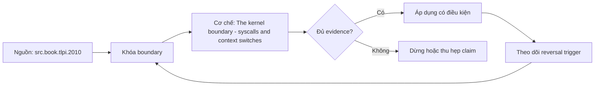

# The kernel boundary - syscalls and context switches

**Tóm tắt bản chất:** Đo số lời gọi hệ thống của một chương trình và giảm nó bằng cách gộp lô, chứng minh bằng số đo thời gian. Cơ chế chỉ có giá trị khi workload, version, state owner và failure boundary đã được khóa; một con số đẹp ngoài bốn điều kiện đó không đủ để ra quyết định.

> [!abstract] Câu hỏi trung tâm
> Làm thế nào mô hình, đo và ra quyết định đúng về The kernel boundary - syscalls and context switches?

## Nỗi Đau & Động Lực

Tối ưu thuật toán khi nút thắt là số lời gọi hệ thống · tăng số luồng cho tới khi máy chậm lại · đo thời gian mà không đếm lời gọi nên không biết nguyên nhân. Đây không phải danh sách lỗi cú pháp. Mỗi lỗi làm người vận hành chọn nhầm owner hoặc chữa symptom ở layer sau, khiến thời gian phục hồi tăng dù command vừa chạy trả về thành công.

Năng lực cần giữ sau bài là: Đo số lời gọi hệ thống của một chương trình và giảm nó bằng cách gộp lô, chứng minh bằng số đo thời gian. Nếu learner chỉ nhắc lại định nghĩa nhưng không phân biệt được hai state gần nhau trên số đo, bài chưa đạt.

## Cơ Chế Tác Động

Mỗi lần chương trình cần nhân làm gì đó thì phải vượt ranh giới người dùng và nhân, và mỗi lần vượt tốn chi phí cố định. Hệ quả thực tế lớn hơn người ta tưởng: đọc một tệp bằng một triệu lời gọi mỗi lần một byte chậm hơn nhiều bậc độ lớn so với đọc theo khối lớn, dù cùng tổng số byte. Kích thước khối tốt nhất và mức chênh đều phụ thuộc hệ điều hành cùng thiết bị, nên lab đo bốn kích thước khối rồi tự tìm điểm bão hoà. Đây là lý do mọi thư viện vào ra đều có đệm, và là lý do xử lý theo lô luôn thắng xử lý từng phần tử khi có ranh giới nhân ở giữa. Chuyển ngữ cảnh khi nhân đổi tiến trình đang chạy: tốn vì phải lưu và khôi phục trạng thái, và tốn thêm vì bộ nhớ đệm bị làm nguội. Từ đó suy ra vì sao chạy quá nhiều luồng so với số lõi làm thông lượng giảm chứ tăng. Cách đo số lời gọi hệ thống và số lần chuyển ngữ cảnh của một chương trình thật, và dùng hai số đó làm bằng chứng thay vì suy đoán.

Tách ba lớp khi đọc cơ chế `wiki.de-foundation.the-kernel-boundary-syscalls-and-context-switches`: declared state là điều cấu hình hoặc API yêu cầu; executed state là việc runtime thực sự làm; consumer-visible state là điều client hay operator quan sát. Ba lớp có thể lệch nhau vì cache, buffering, retry, scheduling, queue hoặc failure giữa hai transition. Evidence phải chỉ ra lớp nào đang được đo.

## Bản Đồ Quyết Định

| Bước | Câu hỏi phải khóa | Điều kiện đạt |
|---|---|---|
| Model | Giải thích chi phí bằng hierarchy, parallel fraction hoặc data movement | Model dự đoán đúng khi đổi scale |
| Measure | Dùng counter và benchmark khóa workload | Observation khớp oracle và có raw sample |
| Explain | Nối delta với mechanism | Reviewer tái hiện được reasoning |
| Reverse | Đổi workload, layout hoặc resource | Quyết định đổi khi bottleneck đổi |

Quy tắc mặc định là chọn phép giải thích đơn giản nhất qua được hard constraints, rồi viết trước reversal trigger. Với `The kernel boundary - syscalls and context switches`, absence of error không phải pass; pass cần observation đúng grain, một oracle độc lập và changed-constraint case đủ làm model có cơ hội thất bại.

## Case Study Thực Chiến: The kernel boundary - syscalls and context switches

Viết chương trình đọc tệp 500 MB theo từng byte, đếm số lời gọi hệ thống và đo thời gian. Viết lại theo khối 64 KB và đo lại cả hai. Chạy một tác vụ tính với số luồng bằng 1, bằng số lõi và gấp 8 lần số lõi; đo thông lượng và số lần chuyển ngữ cảnh.

Trong case `wiki.de-foundation.the-kernel-boundary-syscalls-and-context-switches`, learner ghi expected transition, input snapshot, version và giới hạn an toàn trước khi chạy. Sau execution, họ giữ raw counter, timestamp, exit status, state trước–sau và giải thích delta bằng mechanism ở trên. Đánh giá không cho phép sửa expected result sau khi nhìn output mà không ghi change record.

Biến thể khó hơn đổi một constraint có khả năng đảo kết luận: workload shape, memory pressure, connection reuse, retry budget, permission hoặc dependency direction. Tầng *áp dụng*. Objective là một tối ưu có cơ chế rõ và kết quả đo được hai chiều. Kiểm bằng cặp số đo lời gọi và thời gian; đạt khi số lời gọi giảm ít nhất một bậc và thời gian giảm tương ứng.

## Góc Khuất & Ngộ Nhận

**Hiểu lầm:** Tối ưu thuật toán khi nút thắt là số lời gọi hệ thống. **Thực tế:** tín hiệu chỉ chứng minh điều nó đo trong đúng scope; state ở layer khác vẫn có thể trái ngược. **Vì sao nghe hợp lý:** happy path nhỏ thường không chạm queue, cache, partial progress hoặc restart.

**Hiểu lầm:** tăng số luồng cho tới khi máy chậm lại. **Thực tế:** tool và API cung cấp primitive, không tự cấp ownership, deadline, idempotency hay recovery policy. **Vì sao nghe hợp lý:** syntax gọn che mất protocol và lifecycle phía dưới.

Với `wiki.de-foundation.the-kernel-boundary-syscalls-and-context-switches`, một edge case đáng giữ là observation đúng nhưng diagnosis sai: counter tăng thật, song nguyên nhân điều khiển nằm ở layer trước. Muốn tránh, timeline phải nối trigger tới consumer harm và ghi rõ negative control nào đã loại giả thuyết cạnh tranh.

## Nếu Bạn Dạy Lại Điều Này...

Mở bài bằng một dự đoán dễ sai về `The kernel boundary - syscalls and context switches`, không mở bằng định nghĩa. Cho hai trace gần giống nhau nhưng khác đúng một state boundary; learner phải chọn probe tiếp theo trước khi được xem đáp án.

Bài tập seed dùng chính lab của DE-L054, sau đó đổi constraint đủ mạnh để buộc giữ hoặc đảo quyết định. Người dạy chấm reasoning chain và evidence, không chấm việc learner đoán đúng tên công cụ.

## Ma trận kiểm chứng từng mệnh đề

Protocol riêng của `The kernel boundary - syscalls and context switches` dùng điều kiện hoàn thành sau: Số lời gọi hệ thống giảm ≥ 1 bậc sau khi gộp lô với thời gian giảm tương ứng, và bảng ba mức luồng cho thấy điểm quá tải. Mỗi probe phải có prediction, failure signal và independent oracle.

### Probe 1: state transition và invariant

**Mệnh đề P1 cần kiểm.** Mỗi lần chương trình cần nhân làm gì đó thì phải vượt ranh giới người dùng và nhân, và mỗi lần vượt tốn chi phí cố định.

**Thiết kế phép thử cho `wiki.de-foundation.the-kernel-boundary-syscalls-and-context-switches`.** Với `wiki.de-foundation.the-kernel-boundary-syscalls-and-context-switches`, tạo positive và negative control chỉ khác một điều kiện; khóa workload, version, identity, permission, clock và state ban đầu. Expected result được viết trước execution để tiêu chí không trôi theo output.

**Bằng chứng P1 cần giữ.** Với `wiki.de-foundation.the-kernel-boundary-syscalls-and-context-switches`, lưu command hoặc harness, raw observation, transition trước–sau, coverage và limitation. Kết luận chỉ đạt khi oracle độc lập khớp đúng grain; nếu chưa chạy thì đây vẫn là protocol, không phải observation.

### Probe 2: identity, ownership và boundary

**Mệnh đề P2 cần kiểm.** Đo số lời gọi hệ thống của một chương trình và giảm nó bằng cách gộp lô, chứng minh bằng số đo thời gian.

**Thiết kế phép thử cho `wiki.de-foundation.the-kernel-boundary-syscalls-and-context-switches`.** Với `wiki.de-foundation.the-kernel-boundary-syscalls-and-context-switches`, tạo boundary case ngay trước và sau ngưỡng; khóa workload, version, identity, permission, clock và state ban đầu. Expected result được viết trước execution để tiêu chí không trôi theo output.

**Bằng chứng P2 cần giữ.** Với `wiki.de-foundation.the-kernel-boundary-syscalls-and-context-switches`, lưu command hoặc harness, raw observation, transition trước–sau, coverage và limitation. Kết luận chỉ đạt khi oracle độc lập khớp đúng grain; nếu chưa chạy thì đây vẫn là protocol, không phải observation.

### Probe 3: failure path và recovery

**Mệnh đề P3 cần kiểm.** Tầng *áp dụng*.

**Thiết kế phép thử cho `wiki.de-foundation.the-kernel-boundary-syscalls-and-context-switches`.** Với `wiki.de-foundation.the-kernel-boundary-syscalls-and-context-switches`, tạo replay cùng identity nhưng đổi state; khóa workload, version, identity, permission, clock và state ban đầu. Expected result được viết trước execution để tiêu chí không trôi theo output.

**Bằng chứng P3 cần giữ.** Với `wiki.de-foundation.the-kernel-boundary-syscalls-and-context-switches`, lưu command hoặc harness, raw observation, transition trước–sau, coverage và limitation. Kết luận chỉ đạt khi oracle độc lập khớp đúng grain; nếu chưa chạy thì đây vẫn là protocol, không phải observation.

### Probe 4: decision trade-off và reversal trigger

**Mệnh đề P4 cần kiểm.** Viết chương trình đọc tệp 500 MB theo từng byte, đếm số lời gọi hệ thống và đo thời gian.

**Thiết kế phép thử cho `wiki.de-foundation.the-kernel-boundary-syscalls-and-context-switches`.** Với `wiki.de-foundation.the-kernel-boundary-syscalls-and-context-switches`, tạo failure inject trước và sau transition bền vững; khóa workload, version, identity, permission, clock và state ban đầu. Expected result được viết trước execution để tiêu chí không trôi theo output.

**Bằng chứng P4 cần giữ.** Với `wiki.de-foundation.the-kernel-boundary-syscalls-and-context-switches`, lưu command hoặc harness, raw observation, transition trước–sau, coverage và limitation. Kết luận chỉ đạt khi oracle độc lập khớp đúng grain; nếu chưa chạy thì đây vẫn là protocol, không phải observation.

### Probe 5: evidence package và oracle

**Mệnh đề P5 cần kiểm.** Tối ưu thuật toán khi nút thắt là số lời gọi hệ thống · tăng số luồng cho tới khi máy chậm lại · đo thời gian mà không đếm lời gọi nên không biết nguyên nhân.

**Thiết kế phép thử cho `wiki.de-foundation.the-kernel-boundary-syscalls-and-context-switches`.** Với `wiki.de-foundation.the-kernel-boundary-syscalls-and-context-switches`, tạo changed scale làm cost model đổi; khóa workload, version, identity, permission, clock và state ban đầu. Expected result được viết trước execution để tiêu chí không trôi theo output.

**Bằng chứng P5 cần giữ.** Với `wiki.de-foundation.the-kernel-boundary-syscalls-and-context-switches`, lưu command hoặc harness, raw observation, transition trước–sau, coverage và limitation. Kết luận chỉ đạt khi oracle độc lập khớp đúng grain; nếu chưa chạy thì đây vẫn là protocol, không phải observation.

### Probe 6: changed-constraint transfer

**Mệnh đề P6 cần kiểm.** Số lời gọi hệ thống giảm ≥ 1 bậc sau khi gộp lô với thời gian giảm tương ứng, và bảng ba mức luồng cho thấy điểm quá tải.

**Thiết kế phép thử cho `wiki.de-foundation.the-kernel-boundary-syscalls-and-context-switches`.** Với `wiki.de-foundation.the-kernel-boundary-syscalls-and-context-switches`, tạo adversarial order, skew hoặc packet timing; khóa workload, version, identity, permission, clock và state ban đầu. Expected result được viết trước execution để tiêu chí không trôi theo output.

**Bằng chứng P6 cần giữ.** Với `wiki.de-foundation.the-kernel-boundary-syscalls-and-context-switches`, lưu command hoặc harness, raw observation, transition trước–sau, coverage và limitation. Kết luận chỉ đạt khi oracle độc lập khớp đúng grain; nếu chưa chạy thì đây vẫn là protocol, không phải observation.

### Probe 7: state transition và invariant

**Mệnh đề P7 cần kiểm.** Mỗi lần chương trình cần nhân làm gì đó thì phải vượt ranh giới người dùng và nhân, và mỗi lần vượt tốn chi phí cố định.

**Thiết kế phép thử cho `wiki.de-foundation.the-kernel-boundary-syscalls-and-context-switches`.** Với `wiki.de-foundation.the-kernel-boundary-syscalls-and-context-switches`, tạo fresh environment không cache; khóa workload, version, identity, permission, clock và state ban đầu. Expected result được viết trước execution để tiêu chí không trôi theo output.

**Bằng chứng P7 cần giữ.** Với `wiki.de-foundation.the-kernel-boundary-syscalls-and-context-switches`, lưu command hoặc harness, raw observation, transition trước–sau, coverage và limitation. Kết luận chỉ đạt khi oracle độc lập khớp đúng grain; nếu chưa chạy thì đây vẫn là protocol, không phải observation.

### Probe 8: identity, ownership và boundary

**Mệnh đề P8 cần kiểm.** Đo số lời gọi hệ thống của một chương trình và giảm nó bằng cách gộp lô, chứng minh bằng số đo thời gian.

**Thiết kế phép thử cho `wiki.de-foundation.the-kernel-boundary-syscalls-and-context-switches`.** Với `wiki.de-foundation.the-kernel-boundary-syscalls-and-context-switches`, tạo independent oracle không dùng chung implementation; khóa workload, version, identity, permission, clock và state ban đầu. Expected result được viết trước execution để tiêu chí không trôi theo output.

**Bằng chứng P8 cần giữ.** Với `wiki.de-foundation.the-kernel-boundary-syscalls-and-context-switches`, lưu command hoặc harness, raw observation, transition trước–sau, coverage và limitation. Kết luận chỉ đạt khi oracle độc lập khớp đúng grain; nếu chưa chạy thì đây vẫn là protocol, không phải observation.

### Probe 9: failure path và recovery

**Mệnh đề P9 cần kiểm.** Tầng *áp dụng*.

**Thiết kế phép thử cho `wiki.de-foundation.the-kernel-boundary-syscalls-and-context-switches`.** Với `wiki.de-foundation.the-kernel-boundary-syscalls-and-context-switches`, tạo partial progress rồi restart; khóa workload, version, identity, permission, clock và state ban đầu. Expected result được viết trước execution để tiêu chí không trôi theo output.

**Bằng chứng P9 cần giữ.** Với `wiki.de-foundation.the-kernel-boundary-syscalls-and-context-switches`, lưu command hoặc harness, raw observation, transition trước–sau, coverage và limitation. Kết luận chỉ đạt khi oracle độc lập khớp đúng grain; nếu chưa chạy thì đây vẫn là protocol, không phải observation.

### Probe 10: decision trade-off và reversal trigger

**Mệnh đề P10 cần kiểm.** Viết chương trình đọc tệp 500 MB theo từng byte, đếm số lời gọi hệ thống và đo thời gian.

**Thiết kế phép thử cho `wiki.de-foundation.the-kernel-boundary-syscalls-and-context-switches`.** Với `wiki.de-foundation.the-kernel-boundary-syscalls-and-context-switches`, tạo missing evidence phải abstain; khóa workload, version, identity, permission, clock và state ban đầu. Expected result được viết trước execution để tiêu chí không trôi theo output.

**Bằng chứng P10 cần giữ.** Với `wiki.de-foundation.the-kernel-boundary-syscalls-and-context-switches`, lưu command hoặc harness, raw observation, transition trước–sau, coverage và limitation. Kết luận chỉ đạt khi oracle độc lập khớp đúng grain; nếu chưa chạy thì đây vẫn là protocol, không phải observation.

### Probe 11: evidence package và oracle

**Mệnh đề P11 cần kiểm.** Tối ưu thuật toán khi nút thắt là số lời gọi hệ thống · tăng số luồng cho tới khi máy chậm lại · đo thời gian mà không đếm lời gọi nên không biết nguyên nhân.

**Thiết kế phép thử cho `wiki.de-foundation.the-kernel-boundary-syscalls-and-context-switches`.** Với `wiki.de-foundation.the-kernel-boundary-syscalls-and-context-switches`, tạo reviewer tái hiện từ evidence package; khóa workload, version, identity, permission, clock và state ban đầu. Expected result được viết trước execution để tiêu chí không trôi theo output.

**Bằng chứng P11 cần giữ.** Với `wiki.de-foundation.the-kernel-boundary-syscalls-and-context-switches`, lưu command hoặc harness, raw observation, transition trước–sau, coverage và limitation. Kết luận chỉ đạt khi oracle độc lập khớp đúng grain; nếu chưa chạy thì đây vẫn là protocol, không phải observation.

### Probe 12: changed-constraint transfer

**Mệnh đề P12 cần kiểm.** Số lời gọi hệ thống giảm ≥ 1 bậc sau khi gộp lô với thời gian giảm tương ứng, và bảng ba mức luồng cho thấy điểm quá tải.

**Thiết kế phép thử cho `wiki.de-foundation.the-kernel-boundary-syscalls-and-context-switches`.** Với `wiki.de-foundation.the-kernel-boundary-syscalls-and-context-switches`, tạo constraint đổi đủ để quyết định đảo; khóa workload, version, identity, permission, clock và state ban đầu. Expected result được viết trước execution để tiêu chí không trôi theo output.

**Bằng chứng P12 cần giữ.** Với `wiki.de-foundation.the-kernel-boundary-syscalls-and-context-switches`, lưu command hoặc harness, raw observation, transition trước–sau, coverage và limitation. Kết luận chỉ đạt khi oracle độc lập khớp đúng grain; nếu chưa chạy thì đây vẫn là protocol, không phải observation.

## Tự Kiểm Tra Nhanh

1. Boundary đầu tiên khiến mô hình `The kernel boundary - syscalls and context switches` không còn đúng là gì?

<details><summary>Đáp án</summary>Tối ưu thuật toán khi nút thắt là số lời gọi hệ thống · tăng số luồng cho tới khi máy chậm lại · đo thời gian mà không đếm lời gọi nên không biết nguyên nhân.</details>

2. Evidence nào phân biệt được hai state dễ nhầm?

<details><summary>Đáp án</summary>Tầng *áp dụng*. Objective là một tối ưu có cơ chế rõ và kết quả đo được hai chiều. Kiểm bằng cặp số đo lời gọi và thời gian; đạt khi số lời gọi giảm ít nhất một bậc và thời gian giảm tương ứng.</details>

3. Khi constraint đổi, điều gì quyết định giữ hay đảo lựa chọn?

<details><summary>Đáp án</summary>Số lời gọi hệ thống giảm ≥ 1 bậc sau khi gộp lô với thời gian giảm tương ứng, và bảng ba mức luồng cho thấy điểm quá tải.</details>

## Giới hạn và điều chưa cho phép kết luận

- Lab của `The kernel boundary - syscalls and context switches` chưa được tuyên bố đã chạy trên production; note mô tả curriculum và expected evidence.
- Hành vi phụ thuộc kernel, distribution, library, network path hoặc hardware phải được kiểm lại trên target đã ghi version.
- Concept key `ck.de.the-kernel-boundary-syscalls-and-context-switches` đã được owner phê duyệt `canonical`; note thuộc canonical registry coverage. Trạng thái này không tự chứng minh learner mastery.
- Một trace đơn lẻ không chứng minh capacity, reliability hoặc security cho population khác.
- Note giữ trạng thái `review` cho tới khi owner duyệt semantics và learner artifact.

## Reference
1. [[SRC-TLPI-2010]]

## Source coverage

| Source slice | Locator | Kiến thức phải giữ | Vị trí | Trạng thái | Ngoài phạm vi |
|---|---|---|---|---|---|
| [[SRC-TLPI-2010]] — `src.book.tlpi.2010` | Chapters 4–39, 49–50, 61 và 63 theo scope record; PDF 113–1418 | mechanism và boundary liên quan trực tiếp tới `The kernel boundary - syscalls and context switches` | cơ chế, quyết định, case và probe | Đã phủ | phần ngoài objective DE-L054 |

## Key takeaways
- Đo số lời gọi hệ thống của một chương trình và giảm nó bằng cách gộp lô, chứng minh bằng số đo thời gian.
- Số lời gọi hệ thống giảm ≥ 1 bậc sau khi gộp lô với thời gian giảm tương ứng, và bảng ba mức luồng cho thấy điểm quá tải.
- `The kernel boundary - syscalls and context switches` chỉ có nghĩa trong scope, state, identity và version đã ghi.
- Trước khi lab chạy, đây là note có provenance và protocol, chưa phải production evidence hay bằng chứng mastery.

<!-- ATOMIC-EXECUTION-CAPSULE:START -->

## Execution capsule — kiểm chứng `wiki.de-foundation.the-kernel-boundary-syscalls-and-context-switches`

> [!important] Phân loại mệnh đề
> Với `wiki.de-foundation.the-kernel-boundary-syscalls-and-context-switches`, sơ đồ, ví dụ và artifact về **The kernel boundary - syscalls and context switches** là **synthesis để kiểm chứng**; chúng không phải trích dẫn hay case nguyên văn của nguồn.

### Sơ đồ cơ chế và điểm kiểm soát



Đọc sơ đồ `wiki.de-foundation.the-kernel-boundary-syscalls-and-context-switches` từ trái sang phải: source chỉ cung cấp claim ban đầu cho **The kernel boundary - syscalls and context switches**; quyết định chỉ được đi tiếp sau khi boundary, evidence và điều kiện đảo quyết định đã hiện hữu.

### Artifact thực thi tối thiểu

```yaml
concept_id: "wiki.de-foundation.the-kernel-boundary-syscalls-and-context-switches"
concept: "The kernel boundary - syscalls and context switches"
primary_question: "Làm thế nào mô hình, đo và ra quyết định đúng về The kernel boundary - syscalls and context switches?"
decision_contract:
  input_boundary: "Ghi population, thời điểm, owner và điều chưa biết"
  hard_constraints:
    - "Không vượt quyền hoặc privacy boundary"
    - "Không dùng cùng một assumption làm cả implementation và oracle"
  accept_when: "Có observation phân biệt được các lựa chọn"
  reversal_trigger: "Một hard constraint sai hoặc evidence mới đổi recommendation"
evidence_to_keep:
  - "input snapshot"
  - "chosen and rejected options"
  - "independent review result"
```

Artifact của `wiki.de-foundation.the-kernel-boundary-syscalls-and-context-switches` buộc người dùng ghi boundary, oracle và reversal trigger cho **The kernel boundary - syscalls and context switches**. Các giá trị minh họa phải được thay bằng evidence thật trước khi dùng cho quyết định.

<!-- ATOMIC-EXECUTION-CAPSULE:END -->
