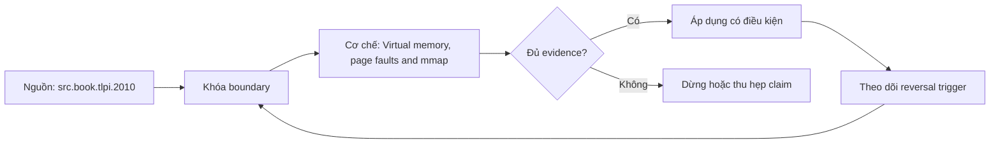

# Virtual memory, page faults and mmap

**Tóm tắt bản chất:** Phân biệt lỗi trang nhẹ với lỗi trang nặng bằng số đo, và nhận ra dấu hiệu một tiến trình đang hoán đổi. Cơ chế chỉ có giá trị khi workload, version, state owner và failure boundary đã được khóa; một con số đẹp ngoài bốn điều kiện đó không đủ để ra quyết định.

> [!abstract] Câu hỏi trung tâm
> Làm thế nào mô hình, đo và ra quyết định đúng về Virtual memory, page faults and mmap?

## Nỗi Đau & Động Lực

Nhầm lỗi trang nhẹ với nặng nên hoảng nhầm · tăng bộ nhớ khi nguyên nhân là ánh xạ tệp · bỏ qua tỉ lệ lỗi trang nặng khi chẩn đoán chậm. Đây không phải danh sách lỗi cú pháp. Mỗi lỗi làm người vận hành chọn nhầm owner hoặc chữa symptom ở layer sau, khiến thời gian phục hồi tăng dù command vừa chạy trả về thành công.

Năng lực cần giữ sau bài là: Phân biệt lỗi trang nhẹ với lỗi trang nặng bằng số đo, và nhận ra dấu hiệu một tiến trình đang hoán đổi. Nếu learner chỉ nhắc lại định nghĩa nhưng không phân biệt được hai state gần nhau trên số đo, bài chưa đạt.

## Cơ Chế Tác Động

Chương trình nhìn thấy không gian địa chỉ liên tục của riêng nó, còn bộ nhớ vật lý thì không; ánh xạ giữa hai thứ là bộ nhớ ảo, và nó giải thích nhiều hiện tượng vận hành. Trang là đơn vị ánh xạ, bảng trang giữ ánh xạ, và bộ đệm ánh xạ giữ những mục gần đây để tra nhanh. Lỗi trang nhẹ là trang đã trong RAM nhưng chưa ánh xạ, rẻ; lỗi trang nặng là phải đọc từ đĩa, đắt gấp nhiều bậc, và **tỉ lệ lỗi trang nặng là chỉ số chẩn đoán quan trọng mà nhiều người bỏ qua**. Vùng hoán đổi và vì sao một máy bắt đầu hoán đổi thì mọi thứ chậm thảm hại chứ chậm dần. Sao chép khi ghi làm việc tạo tiến trình con rẻ, và đây là cơ chế đứng sau chi phí khởi động tiến trình đã đo ở lesson 23. Ánh xạ tệp vào bộ nhớ cho phép đọc tệp như đọc mảng, tiện nhưng giấu mất chi phí vào ra nên khó đo.

Tách ba lớp khi đọc cơ chế `wiki.de-foundation.virtual-memory-page-faults-and-mmap`: declared state là điều cấu hình hoặc API yêu cầu; executed state là việc runtime thực sự làm; consumer-visible state là điều client hay operator quan sát. Ba lớp có thể lệch nhau vì cache, buffering, retry, scheduling, queue hoặc failure giữa hai transition. Evidence phải chỉ ra lớp nào đang được đo.

## Bản Đồ Quyết Định

| Bước | Câu hỏi phải khóa | Điều kiện đạt |
|---|---|---|
| Model | Giải thích chi phí bằng hierarchy, parallel fraction hoặc data movement | Model dự đoán đúng khi đổi scale |
| Measure | Dùng counter và benchmark khóa workload | Observation khớp oracle và có raw sample |
| Explain | Nối delta với mechanism | Reviewer tái hiện được reasoning |
| Reverse | Đổi workload, layout hoặc resource | Quyết định đổi khi bottleneck đổi |

Quy tắc mặc định là chọn phép giải thích đơn giản nhất qua được hard constraints, rồi viết trước reversal trigger. Với `Virtual memory, page faults and mmap`, absence of error không phải pass; pass cần observation đúng grain, một oracle độc lập và changed-constraint case đủ làm model có cơ hội thất bại.

## Case Study Thực Chiến: Virtual memory, page faults and mmap

Viết chương trình cấp phát dần bộ nhớ vượt RAM khả dụng. Đo số lỗi trang nhẹ và nặng theo thời gian. Ghi lại thời điểm máy bắt đầu hoán đổi và mức chậm đi. Chạy một chương trình tạo tiến trình con và đo chi phí, giải thích bằng sao chép khi ghi.

Trong case `wiki.de-foundation.virtual-memory-page-faults-and-mmap`, learner ghi expected transition, input snapshot, version và giới hạn an toàn trước khi chạy. Sau execution, họ giữ raw counter, timestamp, exit status, state trước–sau và giải thích delta bằng mechanism ở trên. Đánh giá không cho phép sửa expected result sau khi nhìn output mà không ghi change record.

Biến thể khó hơn đổi một constraint có khả năng đảo kết luận: workload shape, memory pressure, connection reuse, retry budget, permission hoặc dependency direction. Tầng *hiểu*. Bài lý thuyết chuẩn bị cho phần chẩn đoán ở M5; chưa đòi xử lý sự cố. Kiểm bằng bài đo cộng nhận dạng; đạt khi phân biệt đúng hai loại lỗi trang và nhận ra đúng trạng thái hoán đổi qua số đo.

## Góc Khuất & Ngộ Nhận

**Hiểu lầm:** Nhầm lỗi trang nhẹ với nặng nên hoảng nhầm. **Thực tế:** tín hiệu chỉ chứng minh điều nó đo trong đúng scope; state ở layer khác vẫn có thể trái ngược. **Vì sao nghe hợp lý:** happy path nhỏ thường không chạm queue, cache, partial progress hoặc restart.

**Hiểu lầm:** tăng bộ nhớ khi nguyên nhân là ánh xạ tệp. **Thực tế:** tool và API cung cấp primitive, không tự cấp ownership, deadline, idempotency hay recovery policy. **Vì sao nghe hợp lý:** syntax gọn che mất protocol và lifecycle phía dưới.

Với `wiki.de-foundation.virtual-memory-page-faults-and-mmap`, một edge case đáng giữ là observation đúng nhưng diagnosis sai: counter tăng thật, song nguyên nhân điều khiển nằm ở layer trước. Muốn tránh, timeline phải nối trigger tới consumer harm và ghi rõ negative control nào đã loại giả thuyết cạnh tranh.

## Nếu Bạn Dạy Lại Điều Này...

Mở bài bằng một dự đoán dễ sai về `Virtual memory, page faults and mmap`, không mở bằng định nghĩa. Cho hai trace gần giống nhau nhưng khác đúng một state boundary; learner phải chọn probe tiếp theo trước khi được xem đáp án.

Bài tập seed dùng chính lab của DE-L051, sau đó đổi constraint đủ mạnh để buộc giữ hoặc đảo quyết định. Người dạy chấm reasoning chain và evidence, không chấm việc learner đoán đúng tên công cụ.

## Ma trận kiểm chứng từng mệnh đề

Protocol riêng của `Virtual memory, page faults and mmap` dùng điều kiện hoàn thành sau: Phân biệt đúng hai loại lỗi trang bằng số đo, và chỉ ra đúng thời điểm bắt đầu hoán đổi kèm mức chậm đi. Mỗi probe phải có prediction, failure signal và independent oracle.

### Probe 1: state transition và invariant

**Mệnh đề P1 cần kiểm.** Chương trình nhìn thấy không gian địa chỉ liên tục của riêng nó, còn bộ nhớ vật lý thì không; ánh xạ giữa hai thứ là bộ nhớ ảo, và nó giải thích nhiều hiện tượng vận hành.

**Thiết kế phép thử cho `wiki.de-foundation.virtual-memory-page-faults-and-mmap`.** Với `wiki.de-foundation.virtual-memory-page-faults-and-mmap`, tạo positive và negative control chỉ khác một điều kiện; khóa workload, version, identity, permission, clock và state ban đầu. Expected result được viết trước execution để tiêu chí không trôi theo output.

**Bằng chứng P1 cần giữ.** Với `wiki.de-foundation.virtual-memory-page-faults-and-mmap`, lưu command hoặc harness, raw observation, transition trước–sau, coverage và limitation. Kết luận chỉ đạt khi oracle độc lập khớp đúng grain; nếu chưa chạy thì đây vẫn là protocol, không phải observation.

### Probe 2: identity, ownership và boundary

**Mệnh đề P2 cần kiểm.** Phân biệt lỗi trang nhẹ với lỗi trang nặng bằng số đo, và nhận ra dấu hiệu một tiến trình đang hoán đổi.

**Thiết kế phép thử cho `wiki.de-foundation.virtual-memory-page-faults-and-mmap`.** Với `wiki.de-foundation.virtual-memory-page-faults-and-mmap`, tạo boundary case ngay trước và sau ngưỡng; khóa workload, version, identity, permission, clock và state ban đầu. Expected result được viết trước execution để tiêu chí không trôi theo output.

**Bằng chứng P2 cần giữ.** Với `wiki.de-foundation.virtual-memory-page-faults-and-mmap`, lưu command hoặc harness, raw observation, transition trước–sau, coverage và limitation. Kết luận chỉ đạt khi oracle độc lập khớp đúng grain; nếu chưa chạy thì đây vẫn là protocol, không phải observation.

### Probe 3: failure path và recovery

**Mệnh đề P3 cần kiểm.** Tầng *hiểu*.

**Thiết kế phép thử cho `wiki.de-foundation.virtual-memory-page-faults-and-mmap`.** Với `wiki.de-foundation.virtual-memory-page-faults-and-mmap`, tạo replay cùng identity nhưng đổi state; khóa workload, version, identity, permission, clock và state ban đầu. Expected result được viết trước execution để tiêu chí không trôi theo output.

**Bằng chứng P3 cần giữ.** Với `wiki.de-foundation.virtual-memory-page-faults-and-mmap`, lưu command hoặc harness, raw observation, transition trước–sau, coverage và limitation. Kết luận chỉ đạt khi oracle độc lập khớp đúng grain; nếu chưa chạy thì đây vẫn là protocol, không phải observation.

### Probe 4: decision trade-off và reversal trigger

**Mệnh đề P4 cần kiểm.** Viết chương trình cấp phát dần bộ nhớ vượt RAM khả dụng.

**Thiết kế phép thử cho `wiki.de-foundation.virtual-memory-page-faults-and-mmap`.** Với `wiki.de-foundation.virtual-memory-page-faults-and-mmap`, tạo failure inject trước và sau transition bền vững; khóa workload, version, identity, permission, clock và state ban đầu. Expected result được viết trước execution để tiêu chí không trôi theo output.

**Bằng chứng P4 cần giữ.** Với `wiki.de-foundation.virtual-memory-page-faults-and-mmap`, lưu command hoặc harness, raw observation, transition trước–sau, coverage và limitation. Kết luận chỉ đạt khi oracle độc lập khớp đúng grain; nếu chưa chạy thì đây vẫn là protocol, không phải observation.

### Probe 5: evidence package và oracle

**Mệnh đề P5 cần kiểm.** Nhầm lỗi trang nhẹ với nặng nên hoảng nhầm · tăng bộ nhớ khi nguyên nhân là ánh xạ tệp · bỏ qua tỉ lệ lỗi trang nặng khi chẩn đoán chậm.

**Thiết kế phép thử cho `wiki.de-foundation.virtual-memory-page-faults-and-mmap`.** Với `wiki.de-foundation.virtual-memory-page-faults-and-mmap`, tạo changed scale làm cost model đổi; khóa workload, version, identity, permission, clock và state ban đầu. Expected result được viết trước execution để tiêu chí không trôi theo output.

**Bằng chứng P5 cần giữ.** Với `wiki.de-foundation.virtual-memory-page-faults-and-mmap`, lưu command hoặc harness, raw observation, transition trước–sau, coverage và limitation. Kết luận chỉ đạt khi oracle độc lập khớp đúng grain; nếu chưa chạy thì đây vẫn là protocol, không phải observation.

### Probe 6: changed-constraint transfer

**Mệnh đề P6 cần kiểm.** Phân biệt đúng hai loại lỗi trang bằng số đo, và chỉ ra đúng thời điểm bắt đầu hoán đổi kèm mức chậm đi.

**Thiết kế phép thử cho `wiki.de-foundation.virtual-memory-page-faults-and-mmap`.** Với `wiki.de-foundation.virtual-memory-page-faults-and-mmap`, tạo adversarial order, skew hoặc packet timing; khóa workload, version, identity, permission, clock và state ban đầu. Expected result được viết trước execution để tiêu chí không trôi theo output.

**Bằng chứng P6 cần giữ.** Với `wiki.de-foundation.virtual-memory-page-faults-and-mmap`, lưu command hoặc harness, raw observation, transition trước–sau, coverage và limitation. Kết luận chỉ đạt khi oracle độc lập khớp đúng grain; nếu chưa chạy thì đây vẫn là protocol, không phải observation.

### Probe 7: state transition và invariant

**Mệnh đề P7 cần kiểm.** Chương trình nhìn thấy không gian địa chỉ liên tục của riêng nó, còn bộ nhớ vật lý thì không; ánh xạ giữa hai thứ là bộ nhớ ảo, và nó giải thích nhiều hiện tượng vận hành.

**Thiết kế phép thử cho `wiki.de-foundation.virtual-memory-page-faults-and-mmap`.** Với `wiki.de-foundation.virtual-memory-page-faults-and-mmap`, tạo fresh environment không cache; khóa workload, version, identity, permission, clock và state ban đầu. Expected result được viết trước execution để tiêu chí không trôi theo output.

**Bằng chứng P7 cần giữ.** Với `wiki.de-foundation.virtual-memory-page-faults-and-mmap`, lưu command hoặc harness, raw observation, transition trước–sau, coverage và limitation. Kết luận chỉ đạt khi oracle độc lập khớp đúng grain; nếu chưa chạy thì đây vẫn là protocol, không phải observation.

### Probe 8: identity, ownership và boundary

**Mệnh đề P8 cần kiểm.** Phân biệt lỗi trang nhẹ với lỗi trang nặng bằng số đo, và nhận ra dấu hiệu một tiến trình đang hoán đổi.

**Thiết kế phép thử cho `wiki.de-foundation.virtual-memory-page-faults-and-mmap`.** Với `wiki.de-foundation.virtual-memory-page-faults-and-mmap`, tạo independent oracle không dùng chung implementation; khóa workload, version, identity, permission, clock và state ban đầu. Expected result được viết trước execution để tiêu chí không trôi theo output.

**Bằng chứng P8 cần giữ.** Với `wiki.de-foundation.virtual-memory-page-faults-and-mmap`, lưu command hoặc harness, raw observation, transition trước–sau, coverage và limitation. Kết luận chỉ đạt khi oracle độc lập khớp đúng grain; nếu chưa chạy thì đây vẫn là protocol, không phải observation.

### Probe 9: failure path và recovery

**Mệnh đề P9 cần kiểm.** Tầng *hiểu*.

**Thiết kế phép thử cho `wiki.de-foundation.virtual-memory-page-faults-and-mmap`.** Với `wiki.de-foundation.virtual-memory-page-faults-and-mmap`, tạo partial progress rồi restart; khóa workload, version, identity, permission, clock và state ban đầu. Expected result được viết trước execution để tiêu chí không trôi theo output.

**Bằng chứng P9 cần giữ.** Với `wiki.de-foundation.virtual-memory-page-faults-and-mmap`, lưu command hoặc harness, raw observation, transition trước–sau, coverage và limitation. Kết luận chỉ đạt khi oracle độc lập khớp đúng grain; nếu chưa chạy thì đây vẫn là protocol, không phải observation.

### Probe 10: decision trade-off và reversal trigger

**Mệnh đề P10 cần kiểm.** Viết chương trình cấp phát dần bộ nhớ vượt RAM khả dụng.

**Thiết kế phép thử cho `wiki.de-foundation.virtual-memory-page-faults-and-mmap`.** Với `wiki.de-foundation.virtual-memory-page-faults-and-mmap`, tạo missing evidence phải abstain; khóa workload, version, identity, permission, clock và state ban đầu. Expected result được viết trước execution để tiêu chí không trôi theo output.

**Bằng chứng P10 cần giữ.** Với `wiki.de-foundation.virtual-memory-page-faults-and-mmap`, lưu command hoặc harness, raw observation, transition trước–sau, coverage và limitation. Kết luận chỉ đạt khi oracle độc lập khớp đúng grain; nếu chưa chạy thì đây vẫn là protocol, không phải observation.

### Probe 11: evidence package và oracle

**Mệnh đề P11 cần kiểm.** Nhầm lỗi trang nhẹ với nặng nên hoảng nhầm · tăng bộ nhớ khi nguyên nhân là ánh xạ tệp · bỏ qua tỉ lệ lỗi trang nặng khi chẩn đoán chậm.

**Thiết kế phép thử cho `wiki.de-foundation.virtual-memory-page-faults-and-mmap`.** Với `wiki.de-foundation.virtual-memory-page-faults-and-mmap`, tạo reviewer tái hiện từ evidence package; khóa workload, version, identity, permission, clock và state ban đầu. Expected result được viết trước execution để tiêu chí không trôi theo output.

**Bằng chứng P11 cần giữ.** Với `wiki.de-foundation.virtual-memory-page-faults-and-mmap`, lưu command hoặc harness, raw observation, transition trước–sau, coverage và limitation. Kết luận chỉ đạt khi oracle độc lập khớp đúng grain; nếu chưa chạy thì đây vẫn là protocol, không phải observation.

### Probe 12: changed-constraint transfer

**Mệnh đề P12 cần kiểm.** Phân biệt đúng hai loại lỗi trang bằng số đo, và chỉ ra đúng thời điểm bắt đầu hoán đổi kèm mức chậm đi.

**Thiết kế phép thử cho `wiki.de-foundation.virtual-memory-page-faults-and-mmap`.** Với `wiki.de-foundation.virtual-memory-page-faults-and-mmap`, tạo constraint đổi đủ để quyết định đảo; khóa workload, version, identity, permission, clock và state ban đầu. Expected result được viết trước execution để tiêu chí không trôi theo output.

**Bằng chứng P12 cần giữ.** Với `wiki.de-foundation.virtual-memory-page-faults-and-mmap`, lưu command hoặc harness, raw observation, transition trước–sau, coverage và limitation. Kết luận chỉ đạt khi oracle độc lập khớp đúng grain; nếu chưa chạy thì đây vẫn là protocol, không phải observation.

## Tự Kiểm Tra Nhanh

1. Boundary đầu tiên khiến mô hình `Virtual memory, page faults and mmap` không còn đúng là gì?

<details><summary>Đáp án</summary>Nhầm lỗi trang nhẹ với nặng nên hoảng nhầm · tăng bộ nhớ khi nguyên nhân là ánh xạ tệp · bỏ qua tỉ lệ lỗi trang nặng khi chẩn đoán chậm.</details>

2. Evidence nào phân biệt được hai state dễ nhầm?

<details><summary>Đáp án</summary>Tầng *hiểu*. Bài lý thuyết chuẩn bị cho phần chẩn đoán ở M5; chưa đòi xử lý sự cố. Kiểm bằng bài đo cộng nhận dạng; đạt khi phân biệt đúng hai loại lỗi trang và nhận ra đúng trạng thái hoán đổi qua số đo.</details>

3. Khi constraint đổi, điều gì quyết định giữ hay đảo lựa chọn?

<details><summary>Đáp án</summary>Phân biệt đúng hai loại lỗi trang bằng số đo, và chỉ ra đúng thời điểm bắt đầu hoán đổi kèm mức chậm đi.</details>

## Giới hạn và điều chưa cho phép kết luận

- Lab của `Virtual memory, page faults and mmap` chưa được tuyên bố đã chạy trên production; note mô tả curriculum và expected evidence.
- Hành vi phụ thuộc kernel, distribution, library, network path hoặc hardware phải được kiểm lại trên target đã ghi version.
- Concept key `ck.de.virtual-memory-page-faults-and-mmap` đã được owner phê duyệt `canonical`; note thuộc canonical registry coverage. Trạng thái này không tự chứng minh learner mastery.
- Một trace đơn lẻ không chứng minh capacity, reliability hoặc security cho population khác.
- Note giữ trạng thái `review` cho tới khi owner duyệt semantics và learner artifact.

## Reference
1. [[SRC-TLPI-2010]]
2. [[SRC-PATTERSON-HENNESSY-COD-5E]]

## Source coverage

| Source slice | Locator | Kiến thức phải giữ | Vị trí | Trạng thái | Ngoài phạm vi |
|---|---|---|---|---|---|
| [[SRC-TLPI-2010]] — `src.book.tlpi.2010` | Chapters 4–39, 49–50, 61 và 63 theo scope record; PDF 113–1418 | mechanism và boundary liên quan trực tiếp tới `Virtual memory, page faults and mmap` | cơ chế, quyết định, case và probe | Đã phủ | phần ngoài objective DE-L051 |
| [[SRC-PATTERSON-HENNESSY-COD-5E]] — `src.book.patterson-hennessy-cod.5e` | Chapter 5 và §6.3; PDF 397–538 | mechanism và boundary liên quan trực tiếp tới `Virtual memory, page faults and mmap` | cơ chế, quyết định, case và probe | Đã phủ | phần ngoài objective DE-L051 |

## Key takeaways
- Phân biệt lỗi trang nhẹ với lỗi trang nặng bằng số đo, và nhận ra dấu hiệu một tiến trình đang hoán đổi.
- Phân biệt đúng hai loại lỗi trang bằng số đo, và chỉ ra đúng thời điểm bắt đầu hoán đổi kèm mức chậm đi.
- `Virtual memory, page faults and mmap` chỉ có nghĩa trong scope, state, identity và version đã ghi.
- Trước khi lab chạy, đây là note có provenance và protocol, chưa phải production evidence hay bằng chứng mastery.

<!-- ATOMIC-EXECUTION-CAPSULE:START -->

## Execution capsule — kiểm chứng `wiki.de-foundation.virtual-memory-page-faults-and-mmap`

> [!important] Phân loại mệnh đề
> Với `wiki.de-foundation.virtual-memory-page-faults-and-mmap`, sơ đồ, ví dụ và artifact về **Virtual memory, page faults and mmap** là **synthesis để kiểm chứng**; chúng không phải trích dẫn hay case nguyên văn của nguồn.

### Sơ đồ cơ chế và điểm kiểm soát



Đọc sơ đồ `wiki.de-foundation.virtual-memory-page-faults-and-mmap` từ trái sang phải: source chỉ cung cấp claim ban đầu cho **Virtual memory, page faults and mmap**; quyết định chỉ được đi tiếp sau khi boundary, evidence và điều kiện đảo quyết định đã hiện hữu.

### Artifact thực thi tối thiểu

```yaml
concept_id: "wiki.de-foundation.virtual-memory-page-faults-and-mmap"
concept: "Virtual memory, page faults and mmap"
primary_question: "Làm thế nào mô hình, đo và ra quyết định đúng về Virtual memory, page faults and mmap?"
decision_contract:
  input_boundary: "Ghi population, thời điểm, owner và điều chưa biết"
  hard_constraints:
    - "Không vượt quyền hoặc privacy boundary"
    - "Không dùng cùng một assumption làm cả implementation và oracle"
  accept_when: "Có observation phân biệt được các lựa chọn"
  reversal_trigger: "Một hard constraint sai hoặc evidence mới đổi recommendation"
evidence_to_keep:
  - "input snapshot"
  - "chosen and rejected options"
  - "independent review result"
```

Artifact của `wiki.de-foundation.virtual-memory-page-faults-and-mmap` buộc người dùng ghi boundary, oracle và reversal trigger cho **Virtual memory, page faults and mmap**. Các giá trị minh họa phải được thay bằng evidence thật trước khi dùng cho quyết định.

<!-- ATOMIC-EXECUTION-CAPSULE:END -->
