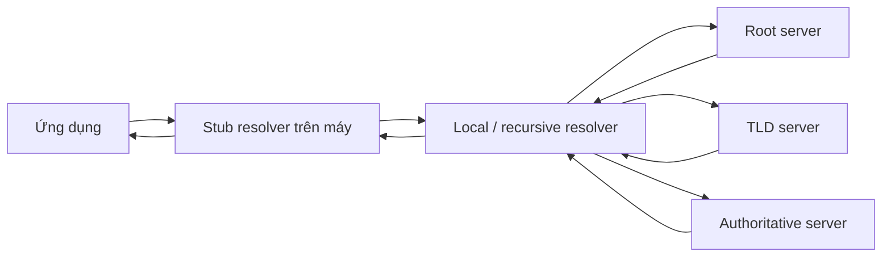

# DNS resolution, delegation, cache và TTL

> [!abstract] Câu hỏi trung tâm
> Khi hai máy cùng hỏi một tên miền nhưng nhận kết quả khác nhau, điều cần tìm không chỉ là DNS có hoạt động không. Phải biết máy đã hỏi resolver nào, resolver trả dữ liệu từ cache hay tiếp tục đi theo chuỗi delegation, record thuộc loại gì, còn bao nhiêu TTL và câu trả lời có thẩm quyền hay không.

## Mô hình cần ghi nhớ

DNS vừa là cơ sở dữ liệu phân tán theo cấp bậc, vừa là giao thức tầng ứng dụng để truy vấn cơ sở dữ liệu đó. Ứng dụng thường bắt đầu với một hostname dễ nhớ; trước khi kết nối tới dịch vụ, nó cần địa chỉ IP hoặc record phù hợp. Việc phân giải tên vì thế nằm trên đường tới HTTP, SMTP và nhiều giao thức khác, đồng thời có thể thêm độ trễ hoặc tạo ra một failure domain riêng.

Một đường phân giải điển hình gồm:



Trong thực tế, cache có thể rút ngắn chuỗi ở nhiều điểm. Resolver cũng có thể nhận referral tới một DNS server trung gian trước khi tới authoritative server cuối cùng.

> [!source-fact]
> Kurose và Ross định nghĩa DNS là cơ sở dữ liệu phân tán theo hệ thống DNS server phân cấp và là giao thức tầng ứng dụng để host truy vấn cơ sở dữ liệu ấy. Locator: §2.4.1, trang in 153-155.

## 1. DNS cung cấp những dịch vụ nào

### Phân giải tên sang địa chỉ

Hostname thuận tiện cho con người, còn IP address phù hợp với việc định tuyến. DNS nối hai không gian định danh này. Trình duyệt lấy hostname từ URL, gửi yêu cầu phân giải, nhận địa chỉ rồi mới có thể mở kết nối tới server.

### Alias và canonical name

Một tên dễ nhớ có thể là alias của canonical hostname dài hơn. Record `CNAME` biểu diễn quan hệ này. Ứng dụng có thể cần đi theo chuỗi alias trước khi nhận record địa chỉ.

### Định tuyến thư điện tử

Record `MX` cho biết mail exchanger của một domain. Việc hỏi `MX` khác với hỏi địa chỉ web: cùng một tên miền có thể dùng record khác nhau cho web và email.

### Phân phối tải ở mức tên

Một hostname có thể gắn với nhiều địa chỉ. Sách mô tả cách DNS server thay đổi thứ tự danh sách địa chỉ trong response để phân phối request giữa các server sao chép. Đây là phân phối ở khâu trả lời tên; nó không thay thế health check, session policy hay load balancer chuyên dụng.

> [!source-fact]
> Host aliasing, mail-server aliasing và load distribution được trình bày tại §2.4.1, trang in 154-155.

## 2. Vì sao DNS không dùng một cơ sở dữ liệu tập trung

Một server duy nhất sẽ tạo bốn vấn đề: single point of failure, lưu lượng truy vấn tập trung, khoảng cách lớn với nhiều client và khối lượng cập nhật không thể quản lý ở quy mô Internet. DNS phân tán trách nhiệm cho nhiều server và chia namespace thành các vùng quản lý.

Cấp bậc nền tảng gồm:

| Thành phần | Vai trò trong chuỗi |
|---|---|
| Root server | Chỉ đường tới server của top-level domain phù hợp |
| TLD server | Chỉ đường tới authoritative server của domain hoặc delegation tiếp theo |
| Authoritative server | Giữ dữ liệu có thẩm quyền cho zone mà nó phục vụ |
| Local/recursive resolver | Nhận yêu cầu từ client, dùng cache hoặc thay client thực hiện chuỗi truy vấn |

Local resolver rất quan trọng nhưng không thuộc chặt vào cây root-TLD-authoritative. Máy khách thường nhận địa chỉ resolver qua cấu hình mạng, chẳng hạn DHCP. Khoảng cách mạng và chính sách của resolver ảnh hưởng trực tiếp tới kết quả mà client quan sát.

> [!source-fact]
> Lý do phân tán, ba lớp root/TLD/authoritative và vai trò local DNS server nằm tại §2.4.2, trang in 156-159. Các con số về số root instance trong sách mang mốc 2020 và không được dùng như số hiện hành.

## 3. Delegation: trao quyền quản lý từng phần namespace

Root không giữ địa chỉ cho mọi host. Nó giữ thông tin để đi tới TLD. TLD lại giữ referral tới DNS server chịu trách nhiệm cho domain bên dưới. Một tổ chức có thể tiếp tục ủy quyền cho đơn vị con; chẳng hạn DNS của trường chỉ đường tới DNS của khoa.

Delegation làm rõ một điểm thường bị bỏ qua: server trả lời không nhất thiết có record đích. Nó có thể trả record `NS` cùng địa chỉ hỗ trợ để resolver biết bước kế tiếp.

### Glue record

Nếu nameserver của một domain lại có tên nằm trong chính domain ấy, resolver cần địa chỉ để tránh vòng lặp muốn tìm địa chỉ nameserver nhưng lại phải hỏi nameserver đó. Sách minh họa TLD giữ record `NS` và record `A` cho DNS server được nhắc trong `NS`. Record địa chỉ đi kèm referral thường được gọi là glue trong vận hành DNS.

> [!synthesis]
> §2.4.3 mô tả cặp `NS` và `A` dùng để tiếp tục query chain; cách gọi và kiểm tra glue cần được đối chiếu RFC/tài liệu DNS hiện hành khi viết lab quản trị zone.

## 4. Recursive query và iterative query

Hai kiểu truy vấn khác nhau ở trách nhiệm tìm câu trả lời:

- Với **recursive query**, bên nhận được yêu cầu phải trả câu trả lời cuối cùng hoặc lỗi phù hợp; nó thực hiện các bước tiếp theo thay client.
- Với **iterative query**, bên nhận trả thông tin tốt nhất đang có, thường là referral; bên hỏi tiếp tục gửi truy vấn tới server kế tiếp.

Mẫu thường gặp trong sách là client gửi recursive query tới local resolver; resolver sau đó dùng các iterative query với root, TLD và authoritative server. Không nên đọc sơ đồ này như quy tắc rằng mọi resolver và mọi deployment đều vận hành giống nhau.

> [!source-fact]
> Chuỗi tám message, trường hợp có DNS trung gian thành mười message và sự khác biệt giữa recursive với iterative query nằm tại §2.4.2, trang in 159-161.

## 5. Cache và TTL

Resolver có thể lưu resource record nhận được từ response, kể cả khi nó không có thẩm quyền cho tên đó. Truy vấn sau có thể được trả ngay từ cache, giảm latency và số message phải đi qua hệ thống phân cấp. Resolver cũng có thể cache thông tin về TLD server để phần lớn truy vấn không cần chạm root.

Mỗi resource record có TTL. TTL cho biết record còn được giữ trong cache bao lâu trước khi phải loại bỏ hoặc làm mới theo hành vi của resolver. Vì cache được tạo ở nhiều thời điểm, hai resolver có thể cùng giữ một record nhưng có TTL còn lại khác nhau.

### Thay đổi record không xuất hiện đồng thời ở mọi nơi

Giả sử authoritative record đổi từ IP cũ sang IP mới. Resolver đã cache record cũ có thể tiếp tục trả nó tới khi TTL hết; resolver chưa có cache có thể nhận IP mới ngay. Hiện tượng hai nhóm client nhìn hai địa chỉ trong giai đoạn chuyển đổi vì thế chưa đủ để kết luận authoritative server không nhất quán.

Để điều tra cần ghi:

1. resolver cụ thể được hỏi;
2. record type và exact name;
3. answer cùng TTL còn lại;
4. authoritative answer cho cùng truy vấn;
5. thời điểm record được thay đổi;
6. cache khác trên client, runtime hoặc proxy nếu có.

> [!source-fact]
> Cơ chế cache, khả năng resolver không authoritative trả dữ liệu cache và việc loại bỏ dữ liệu sau một khoảng thời gian được trình bày tại §2.4.2, trang in 160-161.

> [!uncertainty]
> Sách dùng ví dụ thường đặt hai ngày khi nói thời gian cache; đây không phải TTL mặc định chung. TTL thực tế nằm trong từng record và policy của hệ thống. Negative caching, prefetch, serve-stale và cache của ứng dụng không được §2.4 mô tả đủ để suy ra hành vi hiện hành.

## 6. Resource record

Sách biểu diễn resource record bằng bộ bốn:

```text
(Name, Value, Type, TTL)
```

Ý nghĩa của `Name` và `Value` phụ thuộc `Type`:

| Type | `Name` | `Value` | Dùng để làm gì |
|---|---|---|---|
| `A` | hostname | IPv4 address | Ánh xạ tên host sang IPv4 |
| `NS` | domain | hostname của authoritative server | Tiếp tục delegation/query chain |
| `CNAME` | alias | canonical hostname | Chuyển alias sang tên chính |
| `MX` | domain | canonical hostname của mail server | Tìm mail exchanger |

Một response có thể chứa nhiều record. Resolver phải đọc đúng type và đúng section; thấy một địa chỉ trong message chưa có nghĩa địa chỉ ấy là answer cho câu hỏi ban đầu.

> [!source-fact]
> Cấu trúc resource record và ý nghĩa của `A`, `NS`, `CNAME`, `MX` nằm tại §2.4.3, trang in 161-163.

## 7. Cấu trúc message DNS

Query và reply dùng cùng định dạng tổng quát. Header 12 byte chứa transaction identifier, flags và số lượng record ở bốn section. Identifier giúp client ghép reply với query. Các flag cho biết đây là query hay reply, response có authoritative hay không, client có yêu cầu recursion và server có hỗ trợ recursion hay không.

| Section | Nội dung |
|---|---|
| Question | Tên và type được hỏi |
| Answer | Record trả lời trực tiếp câu hỏi |
| Authority | Record về server có thẩm quyền hoặc delegation |
| Additional | Record hỗ trợ, chẳng hạn địa chỉ của hostname được nêu trong `MX` hoặc `NS` |

Khi chẩn đoán, cần giữ cả header flags lẫn bốn section. Chỉ copy dòng Address từ output đã rút gọn có thể làm mất referral, authoritative bit hoặc record hỗ trợ quyết định bước tiếp theo.

> [!source-fact]
> Header, Question, Answer, Authority và Additional section được mô tả tại §2.4.3, trang in 163-164.

## 8. Từ tên miền mới tới dữ liệu DNS

Sách mô tả việc đăng ký domain thông qua registrar và cung cấp tên cùng địa chỉ của primary và secondary authoritative DNS server. Registry/TLD cần có delegation phù hợp; authoritative server của tổ chức giữ record cho host và dịch vụ bên trong zone.

Mô hình này tách ba việc thường bị gọi chung là cấu hình DNS:

1. quyền đăng ký domain;
2. delegation từ parent zone;
3. nội dung zone trên authoritative server.

Một record đúng trên authoritative server vẫn chưa sử dụng được nếu parent delegation sai. Ngược lại, delegation đúng không bảo đảm zone chứa record mà ứng dụng cần.

> [!inference]
> Khi kiểm sự cố onboarding domain, nên xác minh riêng registrar state, parent delegation và authoritative zone. Đây là quy trình chẩn đoán rút ra từ cấu trúc trong sách, không phải checklist nguyên văn của tác giả.

## 9. Quy trình điều tra sự cố DNS

### Bước 1: giữ nguyên câu hỏi

Ghi đầy đủ tên, type, resolver, thời điểm và client. `A`, `AAAA`, `MX`, `CNAME` hay `NS` là những câu hỏi khác nhau; kết quả của type này không thay thế type khác.

### Bước 2: xem câu trả lời client thực nhận

Thu answer, TTL, status/error, authoritative flag và thời gian phản hồi. Nếu ứng dụng thất bại nhưng công cụ dòng lệnh thành công, kiểm xem chúng có dùng cùng resolver, search domain và cache hay không.

### Bước 3: lần theo delegation

Đi từ root/TLD hoặc dùng trace phù hợp để xác định parent đang chỉ tới nameserver nào. Sau đó hỏi trực tiếp từng authoritative server, tránh để local cache che kết quả.

### Bước 4: so sánh các authoritative server

Primary và secondary cần trả bộ dữ liệu nhất quán theo kỳ vọng vận hành. Ghi rõ server nào trả lời, không gộp mọi kết quả dưới nhãn DNS.

### Bước 5: giải thích cache bằng thời gian

Đối chiếu TTL còn lại với thời điểm đổi record. Flush cache chỉ là thử nghiệm cục bộ; nó không xóa cache của resolver khác trên Internet.

### Ma trận quan sát

| Hiện tượng | Giả thuyết cần phân biệt | Bằng chứng |
|---|---|---|
| Hai nhóm client nhận IP khác nhau | cache khác tuổi hoặc resolver khác | resolver, answer, TTL, thời điểm query |
| Resolver trả `SERVFAIL` | lỗi upstream, validation hoặc policy | flags, trace delegation, log resolver |
| Authoritative trả đúng nhưng client vẫn thấy cũ | cache trung gian/client | TTL còn lại tại từng lớp |
| Chỉ `MX` lỗi, web vẫn chạy | record/type riêng hoặc mail delegation | truy vấn `MX`, `A/AAAA` của mail host |
| Một nameserver trả khác các server còn lại | zone chưa đồng bộ hoặc cấu hình lệch | hỏi trực tiếp từng authoritative server |
| Có referral nhưng không tới được nameserver | glue/address/routing/firewall | Authority và Additional section, reachability |

## 10. Những cách hiểu sai thường gặp

| Cách hiểu sai | Cách đọc đúng |
|---|---|
| DNS chỉ đổi hostname thành IP | DNS còn giữ alias, mail routing, delegation và nhiều record type |
| Root server biết IP của mọi host | Root chủ yếu chỉ đường tới TLD |
| TLD luôn trả authoritative server cuối | Có thể còn delegation trung gian |
| Một lệnh `nslookup` chứng minh DNS đúng với mọi client | Kết quả chỉ đại diện resolver, type và thời điểm đã hỏi |
| TTL là thời gian record chắc chắn tồn tại | TTL điều khiển tuổi cache; authoritative data có vòng đời quản trị riêng |
| Flush cache trên laptop làm Internet cập nhật | Chỉ cache cục bộ vừa bị tác động |
| Dòng Additional là answer | Additional chứa dữ liệu hỗ trợ, phải đọc trong ngữ cảnh message |
| DNS round-robin là load balancer đầy đủ | Nó không tự cung cấp mọi health và traffic policy |

## 11. Giới hạn của nguồn và của chương

Chỉ dựa vào §2.4 chưa thể:

- mô tả đầy đủ DNSSEC validation và chain of trust;
- kết luận hành vi negative caching, serve-stale hoặc prefetch của resolver cụ thể;
- giải thích DoH, DoT, ECS, split-horizon và service discovery hiện đại;
- khẳng định mọi DNS message đều dùng UDP trong mọi tình huống;
- đặt TTL tối ưu cho migration khi chưa biết rollback, cache layers và traffic pattern;
- chẩn đoán production chỉ từ một resolver hoặc một lần query.

Các nội dung trên cần RFC và tài liệu của resolver/authoritative implementation đang sử dụng.

## 12. Câu hỏi ôn tập

1. Local resolver khác authoritative server ở trách nhiệm nào?
2. Recursive query và iterative query chuyển trách nhiệm tìm câu trả lời ra sao?
3. Vì sao root không cần giữ record `A` của mọi host?
4. Hai resolver cùng hỏi một tên có thể trả IP khác nhau dù authoritative data đã thống nhất vì sao?
5. `NS` và record địa chỉ đi kèm referral giải quyết vấn đề gì?
6. Vì sao phải đọc cả Answer, Authority và Additional section?
7. Khi đổi IP, cần thu những mốc thời gian và TTL nào để giải thích kết quả cũ?
8. Tại sao web hoạt động không chứng minh `MX` đúng?

## 13. Liên kết chương trình

- Nguồn: [[SRC-KUROSE-ROSS-NETWORKING-8E]].
- Bài liên quan trực tiếp: `DE-L078`.
- Bài dùng làm nền: `DE-L077`, `DE-L080`, `DE-L081`, `DE-L082`, `DE-L084`.
- Liên quan: [[Packet-Switched Network Delay Loss and Throughput|Độ trễ mất gói và thông lượng trong mạng chuyển mạch gói]].
- Chủ đề cần nguồn bổ sung: negative caching, DNSSEC, split-horizon, DoH/DoT và resolver stale policy.

## Source coverage

| Source slice | Nội dung phải giữ | Vị trí trong note | Trạng thái |
|---|---|---|---|
| [[SRC-KUROSE-ROSS-NETWORKING-8E]], §2.4.1 | dịch vụ DNS và lý do không dùng thiết kế tập trung | §§1-2 | Đã trình bày đầy đủ các vai trò chính |
| [[SRC-KUROSE-ROSS-NETWORKING-8E]], §2.4.2 | hierarchy, root/TLD/authoritative server, local resolver, recursive và iterative resolution | §§3-4 | Đã trình bày theo chuỗi truy vấn và trách nhiệm từng bên |
| [[SRC-KUROSE-ROSS-NETWORKING-8E]], §2.4.2 | caching và TTL | §5 | Đã trình bày; stale serving và negative caching được ghi là nguồn bổ sung |
| [[SRC-KUROSE-ROSS-NETWORKING-8E]], §§2.4.3-2.4.4 | resource record, message format và đưa record mới vào hệ thống | §§6-8 | Đã trình bày từ record tới quy trình công bố domain |

DNSSEC, split-horizon, DoH/DoT và resolver stale policy không thuộc lát nguồn này; note ghi chúng là khoảng cần nguồn khác thay vì tự lấp bằng suy đoán.

## Key takeaways
- DNS phân tán namespace bằng delegation; resolver lần theo chuỗi thẩm quyền và có thể trả kết quả từ cache thay vì hỏi authoritative server ở mọi lần truy vấn.
- TTL đặt thời hạn tái sử dụng một resource record trong cache, nhưng không bảo đảm mọi resolver hết hạn cùng thời điểm và không mô tả toàn bộ chính sách phục vụ dữ liệu cũ.
- Recursive query giao trách nhiệm hoàn tất phân giải cho máy chủ nhận yêu cầu; iterative query trả câu trả lời tốt nhất hiện có, thường là referral tới tầng thẩm quyền tiếp theo.
- Answer, Authority và Additional section phải được đọc cùng nhau để phân biệt câu trả lời cuối, referral và địa chỉ hỗ trợ; một lần `nslookup` không đại diện cho mọi client hoặc resolver.
- Khi điều tra thay đổi DNS, cần ghi resolver, thời điểm truy vấn, loại record, TTL còn lại, authoritative answer và đường delegation thay vì chỉ ghi địa chỉ IP nhận được.

## Reference
1. James F. Kurose, Keith W. Ross, *Computer Networking: A Top-Down Approach*, Eighth Global Edition, Pearson, 2022, §2.4, printed pp. 152-164, PDF pp. 154-166.
2. Hồ sơ nguồn: [[SRC-KUROSE-ROSS-NETWORKING-8E]].
3. Source note: `Material/DE/Reference/Library/Source-Notes/PACK-OS_NETWORK-BOOK-03.md`.

## Lịch sử biên tập

| Ngày | Trạng thái | Nội dung |
|---|---|---|
| 2026-09-27 | `review` | Đọc trực tiếp §2.4; lập note chi tiết; tách cơ chế nền khỏi giới hạn hiện đại; biên tập Humanizer tiếng Việt |

<!-- ATOMIC-EXECUTION-CAPSULE:START -->

## Execution capsule: kiểm chứng `wiki.network.dns-resolution-delegation-cache`

> [!important] Phân loại mệnh đề
> Với `wiki.network.dns-resolution-delegation-cache`, sơ đồ, ví dụ và artifact về **DNS resolution, delegation, cache và TTL** là **synthesis để kiểm chứng**; chúng không phải trích dẫn hay case nguyên văn của nguồn.

### Artifact thực thi tối thiểu

```yaml
concept_id: "wiki.network.dns-resolution-delegation-cache"
concept: "DNS resolution, delegation, cache và TTL"
primary_question: "Một tên miền được phân giải qua những thành phần nào, cache thay đổi kết quả quan sát ra sao, và cần thu bằng chứng gì khi DNS gặp sự cố?"
decision_contract:
  input_boundary: "Ghi population, thời điểm, owner và điều chưa biết"
  hard_constraints:
    - "Không vượt quyền hoặc privacy boundary"
    - "Không dùng cùng một assumption làm cả implementation và oracle"
  accept_when: "Có observation phân biệt được các lựa chọn"
  reversal_trigger: "Một hard constraint sai hoặc evidence mới đổi recommendation"
evidence_to_keep:
  - "input snapshot"
  - "chosen and rejected options"
  - "independent review result"
```

Artifact của `wiki.network.dns-resolution-delegation-cache` buộc người dùng ghi boundary, oracle và reversal trigger cho **DNS resolution, delegation, cache và TTL**. Các giá trị minh họa phải được thay bằng evidence thật trước khi dùng cho quyết định.

### Tự kiểm tra trước khi tái sử dụng

1. Bạn có thể trả lời `Một tên miền được phân giải qua những thành phần nào, cache thay đổi kết quả quan sát ra sao, và cần thu bằng chứng gì khi DNS gặp sự cố?` bằng một câu mà không kéo thêm concept thứ hai không?
2. Source locator nào đỡ cho claim, và phần nào chỉ là synthesis trong note?
3. Observation nào khiến bạn dừng, thu hẹp hoặc đảo quyết định?
4. Artifact nào cho phép một reviewer độc lập tái hiện kết quả?

<!-- ATOMIC-EXECUTION-CAPSULE:END -->
