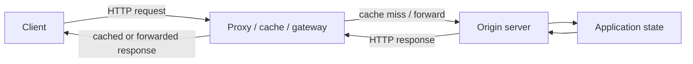

# HTTP request, connection, state và cache

> [!abstract] Câu hỏi trung tâm
> Một request thất bại có thể chưa tới server, đã tới nhưng response bị mất, được proxy trả thay origin, hoặc hoàn tất side effect trước khi client timeout. Muốn phân biệt các trường hợp ấy phải tách message HTTP, connection vận chuyển, trạng thái ứng dụng và các lớp cache trung gian.

## Mô hình tổng quát

HTTP là giao thức tầng ứng dụng theo mô hình request–response. Client gửi request có method, target, headers và có thể có body. Server trả response gồm status, headers và có thể có body. Một trang web có thể cần nhiều object; mỗi object có URL riêng và tạo thêm request.



Sơ đồ này cố ý đặt proxy vào đường đi. Log của origin vắng mặt không chứng minh client chưa gửi request; request có thể dừng ở DNS, connection, TLS hoặc proxy. Tương tự, response nhận từ proxy không nhất thiết phản ánh trạng thái tức thời của origin.

> [!source-fact]
> Kurose và Ross mô tả HTTP là giao thức tầng ứng dụng của Web, do client và server trao đổi HTTP message; mỗi object có URL và server trả object qua response. Locator: §2.2.1, trang in 126–128.

## 1. Ba hợp đồng cần tách riêng

### Hợp đồng vận chuyển

Trong phạm vi HTTP/1.0, HTTP/1.1 và HTTP/2 được sách trình bày, TCP cung cấp byte stream đáng tin cậy giữa hai endpoint. TCP xử lý mất gói và sắp xếp lại byte; HTTP không tự thực hiện các chức năng đó.

Điều này không có nghĩa application request chắc chắn đã được xử lý. Nếu connection đứt, client có thể không biết server đã nhận bao nhiêu byte, parser đã chấp nhận message chưa, hay side effect đã commit trước khi response quay về.

### Hợp đồng HTTP

HTTP quy định cấu trúc message, method, status và headers. Status `500`, chẳng hạn, vẫn là một HTTP response hợp lệ ở tầng giao thức. Ngược lại, timeout trước khi đọc được response không tạo ra status code để suy luận.

### Hợp đồng ứng dụng

Ứng dụng quyết định request có side effect gì, transaction commit ở đâu và khóa idempotency được xử lý ra sao. Hai endpoint cùng dùng `POST` có thể có semantics nghiệp vụ hoàn toàn khác nhau.

> [!inference]
> Khi điều tra cần ghi riêng `transport outcome`, `HTTP outcome` và `business outcome`. Cách chia này là tổng hợp vận hành từ mô hình phân tầng, không phải taxonomy được sách đặt tên.

## 2. Stateless không có nghĩa hệ thống không giữ trạng thái

Sách gọi HTTP là stateless vì server không cần nhớ request trước để hiểu request hiện tại theo mô hình cơ bản. Nếu client yêu cầu cùng object hai lần, server có thể trả lại object thay vì dựa vào ký ức rằng nó vừa phục vụ request đó.

Website thực tế vẫn duy trì trạng thái trong database, session store hoặc client. Cookie tạo một lớp liên kết giữa các request: server cấp identifier, browser lưu nó và gửi lại ở những request sau. Bởi vậy, “HTTP stateless” không đồng nghĩa “ứng dụng không có session” hay “server không có database”.

> [!source-fact]
> Tính stateless của HTTP và cách cookie tạo lớp session phía trên HTTP được trình bày tại §2.2.1 và §2.2.4, trang in 127–128 và 135–138.

## 3. Connection không bền và connection bền

### Non-persistent connection

Trong mô hình HTTP/1.0 của sách, mỗi connection chở một request và một response. Trang gồm HTML gốc cùng mười ảnh có thể cần mười một TCP connection. Với một object, ước lượng đơn giản là một RTT để thiết lập TCP, thêm một RTT cho request bắt đầu nhận response, rồi cộng thời gian truyền object:

$$
T \approx 2RTT + T_{transmit}
$$

Mô hình bỏ qua nhiều chi phí khác nhưng cho thấy việc mở connection lặp lại làm tăng latency và tiêu tốn socket, buffer cùng trạng thái TCP ở hai đầu.

### Persistent connection

HTTP/1.1 cho phép giữ connection sau response để gửi thêm request. Nhiều object hoặc nhiều trang trên cùng server có thể dùng lại connection; server thường đóng connection sau một khoảng idle được cấu hình. Connection bền giảm số lần handshake và số tài nguyên phải cấp lại.

Tuy nhiên, connection sống lâu tạo thêm câu hỏi vận hành: ai đặt idle timeout, proxy có timeout ngắn hơn origin không, connection pool có tái sử dụng socket đã bị peer đóng không, và request đang ở trạng thái nào khi connection bị cắt.

> [!source-fact]
> Non-persistent, persistent connection và phép ước lượng hai RTT nằm tại §2.2.2, trang in 128–131. Sách mô tả pipelining trong bối cảnh HTTP/1.1; không dùng mô tả này làm khuyến nghị client hiện hành.

## 4. Anatomy của request

Với HTTP/1.1 dạng văn bản, request gồm request line, header lines, dòng trống và body tùy chọn.

```text
METHOD request-target HTTP-version
Header-Name: value
Header-Name: value

optional body
```

Request line cho biết method, target và version. `Host` xác định authority/virtual host; content negotiation headers mô tả representation client mong muốn; body mang dữ liệu khi method và ứng dụng cần nó.

Sách giới thiệu `GET`, `POST`, `HEAD`, `PUT` và `DELETE`, nhưng tên method chưa đủ để kết luận endpoint an toàn khi retry. Cần đọc semantics chuẩn hiện hành và hợp đồng API cụ thể, đặc biệt với side effect, idempotency key và xử lý request trùng.

> [!source-fact]
> Request line, headers, body và các method minh họa nằm tại §2.2.3, trang in 131–133.

## 5. Anatomy của response

Response dạng HTTP/1.1 gồm status line, headers, dòng trống và body tùy trường hợp:

```text
HTTP-version status-code reason-phrase
Header-Name: value

optional body
```

Status line báo kết quả xử lý ở tầng HTTP. `Content-Type` mới là chỉ dấu chính thức về media type; đuôi file không thay thế header. `Content-Length` mô tả độ dài body theo quy tắc message framing phù hợp. `Date`, `Last-Modified` và các metadata khác phục vụ thời gian, cache hoặc quan sát.

Các ví dụ `200`, `301`, `400`, `404`, `505` trong sách minh họa nhiều lớp kết quả. Status 4xx/5xx không phải lỗi transport. Client đã nhận được response và cần giải thích status theo endpoint, thay vì gộp tất cả dưới nhãn “network error”.

> [!source-fact]
> Status line, response headers, body và một số status code được trình bày tại §2.2.3, trang in 133–135.

## 6. Cookie và ranh giới trạng thái

Mô hình cookie trong sách gồm bốn phần: `Set-Cookie` trong response, `Cookie` trong request, storage do browser quản lý và database phía server. Identifier trong cookie cho phép server nối nhiều request với cùng session hoặc hồ sơ.

Điều cần giữ trong mental model là cookie chỉ là dữ liệu được chuyển qua header; ý nghĩa và quyền hạn do ứng dụng gán. Cookie có thể hỗ trợ đăng nhập, giỏ hàng và cá nhân hóa, đồng thời tạo rủi ro riêng tư nếu dùng để theo dõi hành vi.

Khi chẩn đoán session:

- kiểm domain/path/scope và thời điểm cookie được đặt;
- xác nhận client có gửi cookie trong request lỗi;
- đối chiếu session identifier với backend store;
- phân biệt cookie vắng, hết hạn, bị thay thế và session phía server đã bị thu hồi;
- không đưa giá trị cookie nhạy cảm vào log hoặc note.

> [!source-fact]
> Bốn thành phần cookie, việc duy trì session và cảnh báo riêng tư nằm tại §2.2.4, trang in 135–138.

> [!uncertainty]
> Phạm vi sách không đủ cho chính sách cookie hiện hành. `Secure`, `HttpOnly`, `SameSite`, partitioned storage, third-party-cookie policy và CSRF cần tài liệu trình duyệt cùng chuẩn mới trước khi đưa ra hướng dẫn bảo mật.

## 7. Proxy cache là server ở một phía, client ở phía kia

Browser có thể gửi request tới web cache thay vì origin. Nếu cache hit, cache trả object đang lưu. Nếu cache miss, nó mở connection tới origin, lấy response, lưu object theo policy rồi chuyển response về browser. Vì vậy proxy cùng lúc đóng hai vai trò:

- server đối với browser;
- client đối với origin.

Hai connection là hai ranh giới quan sát khác nhau. Client timeout không cho biết connection proxy–origin ra sao. Origin log thành công cũng chưa chứng minh proxy đã chuyển toàn bộ response cho client.

Cache có thể giảm latency và giảm traffic qua access link, nhưng hiệu quả phụ thuộc hit rate, kích thước object, traffic pattern và policy. Ví dụ định lượng trong sách dùng giả định 15 Mbit/s, 15 request/s, object 1 Mbit và hit rate 0,4 để minh họa cách cache làm traffic intensity giảm; đó không phải benchmark chung.

> [!source-fact]
> Luồng cache hit/miss, vai trò kép của proxy và ví dụ traffic intensity nằm tại §2.2.5, trang in 138–142.

## 8. Freshness và conditional request

Một object trong cache có thể cũ hơn object tại origin. Sách minh họa cơ chế revalidation bằng `Last-Modified` và `If-Modified-Since`. Nếu representation không đổi, origin trả `304 Not Modified` không kèm toàn bộ body; cache tiếp tục dùng bản đang giữ.

Quy trình khái quát:

1. cache lưu representation cùng validator;
2. khi cần revalidate, cache gửi conditional request;
3. origin xác nhận chưa đổi bằng `304`, hoặc gửi representation mới;
4. cache cập nhật metadata và phục vụ client theo policy.

`304` không có nghĩa “không có dữ liệu”; nó cho phép client/cache dùng body đã có. Debug chỉ nhìn response body rỗng mà bỏ request headers và cache state rất dễ kết luận sai.

> [!source-fact]
> Conditional GET với `If-Modified-Since`, `Last-Modified` và `304 Not Modified` nằm tại §2.2.5, trang in 142–143.

> [!synthesis]
> HTTP caching hiện đại còn có validator và directive khác. Note này chỉ dùng ví dụ trong sách để xây mental model revalidation; policy production phải đối chiếu chuẩn caching hiện hành và hành vi CDN.

## 9. HTTP/2 thay cách đóng gói, không thay ý nghĩa cốt lõi của HTTP

Sách mô tả HTTP/2 chia message thành frame, multiplex nhiều stream trên một TCP connection và nén header. Method, status, URL và ý nghĩa header vẫn thuộc tầng semantics HTTP; framing thay đổi cách message được vận chuyển giữa hai endpoint HTTP/2.

Multiplexing giảm việc object nhỏ phải xếp sau object lớn ở tầng HTTP/1.1, nhưng HTTP/2 vẫn chạy trên một TCP connection theo phạm vi sách. Sách cũng giới thiệu prioritization và server push theo trạng thái chuẩn/tính năng tại thời điểm xuất bản.

Phần cuối gọi HTTP/3 là draft năm 2020. Đây là dữ kiện lịch sử của nguồn, không phải mô tả trạng thái chuẩn năm 2026. Note này không dùng đoạn đó để khẳng định triển khai hiện hành.

> [!source-fact]
> HTTP/2 framing, stream interleaving, prioritization, server push và mô tả HTTP/3 tại thời điểm 2020 nằm tại §2.2.6, trang in 143–146.

## 10. Retry sau timeout: vùng mơ hồ phải được giữ nguyên

Khi client timeout, có ít nhất bốn khả năng:

1. request chưa rời client;
2. request tới proxy nhưng chưa tới origin;
3. origin xử lý chưa xong;
4. side effect đã commit nhưng response không quay về kịp.

Retry mù có thể tạo bản ghi hoặc thanh toán trùng. Quyết định retry cần kết hợp method semantics, request body replayability, idempotency của operation, idempotency key, transaction boundary, timeout ownership và bằng chứng từ server. §2.2 không cung cấp đủ các quy tắc này.

### Bảng quyết định tối thiểu

| Câu hỏi | Nếu chưa biết |
|---|---|
| Operation có side effect không? | Không tự động retry |
| Server có deduplicate theo key không? | Giả định duplicate vẫn có thể xảy ra |
| Body có gửi lại y hệt được không? | Không replay |
| Có bằng chứng request chưa tới server không? | Giữ trạng thái `unknown`, không gán `failed` |
| Timeout thuộc client, proxy hay origin? | Thu log ở từng boundary |

## 11. Quy trình chẩn đoán HTTP request

1. Ghi method, URL/authority, request ID, thời điểm và client version.
2. Tách DNS, connection, TLS, time-to-first-byte và body transfer.
3. Xác định từng hop: client, proxy/CDN/gateway, origin và downstream.
4. Ở mỗi hop, ghép log bằng correlation ID và timestamp; không ghép chỉ bằng IP.
5. Ghi transport outcome, HTTP status và business outcome thành ba trường riêng.
6. Với cache, lưu `Age`, validator, cache status và response source nếu hệ thống cung cấp.
7. Với timeout, kiểm server-side commit trước khi quyết định retry.
8. Tái hiện bằng cùng method, body, headers và route; thay một biến mỗi lần.

### Ma trận hiện tượng

| Hiện tượng | Phân biệt | Bằng chứng cần thu |
|---|---|---|
| Client timeout, origin không có log | DNS/TLS/proxy/route | timing từng pha, proxy access log, connection trace |
| Origin `200`, client không nhận body đủ | downstream reset hoặc framing | byte counts, proxy log, connection close |
| `304` với body rỗng | revalidation hợp lệ hay cache state lỗi | conditional headers, cached object, validator |
| `404` chỉ qua CDN | cache key/routing/origin khác | authority, path, cache status, origin request |
| Session mất ngẫu nhiên | cookie scope hoặc backend session | request cookie metadata, session-store lookup |
| POST timeout rồi sinh trùng | side effect commit trước retry | idempotency key, transaction log, request ID |

## 12. Những cách hiểu sai thường gặp

| Cách hiểu sai | Cách đọc đúng |
|---|---|
| HTTP stateless nên ứng dụng không có state | Session và database có thể nằm trên HTTP stateless |
| Nhận `500` nghĩa là mạng hỏng | Đã nhận được HTTP response từ một server/hop |
| Timeout nghĩa là server chưa xử lý | Side effect có thể đã commit trước khi response mất |
| Persistent connection luôn còn dùng được | Peer hoặc proxy có thể đóng theo timeout riêng |
| Proxy chỉ chuyển tiếp nguyên trạng | Proxy có thể cache, sửa header, retry hoặc trả response riêng |
| `304` là response lỗi vì body rỗng | Cache được phép dùng representation đã lưu |
| `Content-Type` suy ra từ đuôi file | Header xác định media type trong message |
| Method name tự bảo đảm retry an toàn | Còn phụ thuộc contract và side effect của endpoint |
| HTTP/2 thay đổi method và status | HTTP/2 chủ yếu thay framing và multiplexing |

## 13. Giới hạn của nguồn và của chương

Chỉ dựa vào §2.2 chưa thể:

- xây retry, timeout và idempotency policy an toàn cho ingestion API;
- mô tả đầy đủ RFC semantics/caching hiện hành;
- khuyến nghị cấu hình HTTP/2 hoặc HTTP/3 năm 2026;
- xác định cookie security policy cho trình duyệt hiện đại;
- chọn cache key, eviction, stale policy hoặc CDN invalidation;
- suy ra business outcome từ transport outcome;
- chứng minh hop gây lỗi khi thiếu log/correlation ở các boundary.

## 14. Câu hỏi ôn tập

1. Transport success, HTTP success và business success khác nhau thế nào?
2. Vì sao persistent connection giảm chi phí nhưng vẫn có failure mode riêng?
3. `304 Not Modified` cần kết hợp với trạng thái nào ở client/cache?
4. Proxy là client và server cùng lúc tạo ra hai ranh giới quan sát ra sao?
5. Vì sao timeout của `POST` không cho biết side effect đã xảy ra hay chưa?
6. Cookie tạo state phía trên HTTP stateless như thế nào?
7. HTTP/2 thay đổi phần nào và giữ nguyên phần nào của HTTP?
8. Bằng chứng tối thiểu trước khi retry một request có side effect là gì?

## 15. Liên kết chương trình

- Nguồn: [[SRC-KUROSE-ROSS-NETWORKING-8E]].
- Bài liên quan trực tiếp: `DE-L081`, `DE-L082`, `DE-L083`, `DE-L084`.
- Bài dùng làm nền: `DE-L079`, `DE-L080`, `DE-L087`.
- Liên quan: [[DNS Resolution Delegation Caching and TTL|DNS resolution delegation cache và TTL]], [[Packet-Switched Network Delay Loss and Throughput|Độ trễ mất gói và thông lượng trong mạng chuyển mạch gói]].
- Chủ đề cần nguồn bổ sung: RFC semantics/caching hiện hành, retry amplification, timeout budget, idempotency key, connection pool và CDN behavior.

## Source coverage

| Source slice | Nội dung phải giữ | Vị trí trong note | Trạng thái |
|---|---|---|---|
| [[SRC-KUROSE-ROSS-NETWORKING-8E]], §§2.2.1–2.2.2 | HTTP overview, non-persistent và persistent connection | §§1–3 | Đã trình bày cùng RTT model và giới hạn của mô hình |
| [[SRC-KUROSE-ROSS-NETWORKING-8E]], §2.2.3 | request/response message và method/status semantics | §§4–5 | Đã trình bày các trường quyết định behavior |
| [[SRC-KUROSE-ROSS-NETWORKING-8E]], §2.2.4 | cookie và user/session state | §6 | Đã tách transport, protocol và application state |
| [[SRC-KUROSE-ROSS-NETWORKING-8E]], §§2.2.5–2.2.6 | web cache, conditional request và HTTP/2 | §§7–9 | Đã trình bày cache boundary, freshness/validation và phần HTTP/2 thay đổi |

Idempotency key, CDN policy và retry amplification chỉ được mô tả như giới hạn hoặc phần nối tiếp vì §2.2 không cung cấp đủ contract production cho các chủ đề đó.

## Key takeaways
- HTTP định nghĩa semantics của request và response; TCP connection, cookie/session và cache là các lớp trạng thái khác nhau, không được suy ra lẫn nhau.
- Persistent connection giảm chi phí thiết lập và có thể tái sử dụng transport, nhưng không làm nhiều request trở thành một transaction hay loại bỏ nhu cầu framing.
- Cache quyết định tái sử dụng representation dựa trên freshness và validation metadata; `304 Not Modified` yêu cầu client hoặc intermediary dùng body đã lưu trước đó.
- Proxy đứng ở hai vai trò: server đối với phía trước và client đối với phía sau; vì vậy timeout, retry, connection reuse và telemetry phải được xác định ở từng boundary.
- Timeout chỉ xác nhận caller không nhận kết quả trong ngân sách chờ. Với operation có side effect, retry an toàn cần idempotency contract hoặc bằng chứng về outcome trước đó.

## Reference
1. James F. Kurose, Keith W. Ross, *Computer Networking: A Top-Down Approach*, Eighth Global Edition, Pearson, 2022, §2.2, printed pp. 125–146, PDF pp. 127–148.
2. Hồ sơ nguồn: [[SRC-KUROSE-ROSS-NETWORKING-8E]].
3. Source note: `Material/DE/Reference/Library/Source-Notes/PACK-OS_NETWORK-BOOK-03.md`.

## Lịch sử biên tập

| Ngày | Trạng thái | Nội dung |
|---|---|---|
| 2026-09-27 | `review` | Đọc trực tiếp §2.2; tách transport, HTTP và business outcome; ghi rõ khoảng trống retry; biên tập Humanizer tiếng Việt |

<!-- ATOMIC-EXECUTION-CAPSULE:START -->

## Execution capsule — kiểm chứng `wiki.network.http-request-connection-state-cache`

> [!important] Phân loại mệnh đề
> Với `wiki.network.http-request-connection-state-cache`, sơ đồ, ví dụ và artifact về **HTTP request, connection, state và cache** là **synthesis để kiểm chứng**; chúng không phải trích dẫn hay case nguyên văn của nguồn.

### Artifact thực thi tối thiểu

```yaml
concept_id: "wiki.network.http-request-connection-state-cache"
concept: "HTTP request, connection, state và cache"
primary_question: "Một HTTP request đi qua những ranh giới nào, trạng thái nằm ở đâu, và cần đọc message, connection, cookie cùng cache thế nào để không chẩn đoán sai?"
decision_contract:
  input_boundary: "Ghi population, thời điểm, owner và điều chưa biết"
  hard_constraints:
    - "Không vượt quyền hoặc privacy boundary"
    - "Không dùng cùng một assumption làm cả implementation và oracle"
  accept_when: "Có observation phân biệt được các lựa chọn"
  reversal_trigger: "Một hard constraint sai hoặc evidence mới đổi recommendation"
evidence_to_keep:
  - "input snapshot"
  - "chosen and rejected options"
  - "independent review result"
```

Artifact của `wiki.network.http-request-connection-state-cache` buộc người dùng ghi boundary, oracle và reversal trigger cho **HTTP request, connection, state và cache**. Các giá trị minh họa phải được thay bằng evidence thật trước khi dùng cho quyết định.

### Tự kiểm tra trước khi tái sử dụng

1. Bạn có thể trả lời `Một HTTP request đi qua những ranh giới nào, trạng thái nằm ở đâu, và cần đọc message, connection, cookie cùng cache thế nào để không chẩn đoán sai?` bằng một câu mà không kéo thêm concept thứ hai không?
2. Source locator nào đỡ cho claim, và phần nào chỉ là synthesis trong note?
3. Observation nào khiến bạn dừng, thu hẹp hoặc đảo quyết định?
4. Artifact nào cho phép một reviewer độc lập tái hiện kết quả?

<!-- ATOMIC-EXECUTION-CAPSULE:END -->
