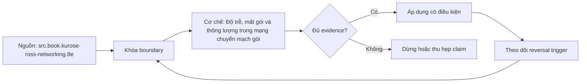

# Độ trễ, mất gói và thông lượng trong mạng chuyển mạch gói

> [!abstract] Câu hỏi trung tâm
> Một request chậm không tự động có nghĩa mạng chậm. Cần biết thời gian đã tiêu ở khâu xử lý, chờ hàng đợi, đưa bit lên đường truyền hay lan truyền trên môi trường vật lý; đồng thời phải tách độ trễ khỏi mất gói và giới hạn thông lượng.

## Mô hình tổng quát

Một gói đi từ máy nguồn tới máy đích qua nhiều nút. Ở mỗi nút, nó có thể chịu bốn thành phần trễ:

$$
d_{nodal}=d_{proc}+d_{queue}+d_{trans}+d_{prop}
$$

Trong đó:

| Thành phần | Bản chất | Yếu tố chi phối |
|---|---|---|
| `d_proc` | Thời gian xử lý tại nút | đọc header, kiểm tra lỗi, tra quyết định chuyển tiếp |
| `d_queue` | Thời gian chờ trước khi được truyền | tải đến, độ burst, lịch phục vụ và độ dài hàng đợi |
| `d_trans` | Thời gian đẩy toàn bộ bit của gói lên link | kích thước gói `L` và tốc độ link `R` |
| `d_prop` | Thời gian tín hiệu đi hết chiều dài link | khoảng cách `d` và tốc độ lan truyền `s` |

Hai công thức cơ bản là:

$$
d_{trans}=\frac{L}{R}, \qquad d_{prop}=\frac{d}{s}
$$

> [!source-fact]
> Bốn thành phần và công thức tổng được trình bày tại §1.4.1, trang in 65-69. Sách nhấn mạnh rằng tỷ trọng từng thành phần thay đổi theo loại mạng và đường đi.

## 1. Xử lý tại nút: `d_proc`

Router phải đọc phần header đủ để chọn link đầu ra; tùy thiết kế, nó còn kiểm tra lỗi bit hoặc thực hiện các bước xử lý khác. `d_proc` thường ngắn trên router tốc độ cao, nhưng khả năng xử lý vẫn đặt trần cho số gói router có thể chuyển tiếp trong một giây.

Chi tiết này quan trọng khi gói nhỏ xuất hiện với tốc độ cao. Hai luồng có cùng số bit mỗi giây nhưng luồng gồm nhiều gói nhỏ buộc thiết bị thực hiện nhiều quyết định trên mỗi giây hơn. Chỉ nhìn băng thông bit có thể bỏ sót giới hạn theo packet rate.

> [!inference]
> Khi link chưa đầy nhưng CPU hoặc packet-per-second của thiết bị đã chạm trần, nút vẫn có thể trở thành bottleneck. Đây là hệ quả kỹ thuật từ vai trò của `d_proc`; ngưỡng cụ thể phải lấy từ thiết bị và phép đo thực tế.

## 2. Chờ trong hàng đợi: `d_queue`

Gói chỉ được truyền khi link rảnh và những gói đứng trước đã được phục vụ. Vì trạng thái hàng đợi thay đổi theo thời gian, `d_queue` không phải một hằng số. Với cùng một đường đi, hai probe liên tiếp có thể thấy RTT khác nhau chỉ vì đến vào hai thời điểm tải khác nhau.

Sách dùng ba biến để xây trực giác:

- `a`: tốc độ gói đến trung bình, đơn vị packet/s;
- `L`: kích thước mỗi gói, đơn vị bit, trong mô hình đơn giản hóa;
- `R`: tốc độ truyền của link, đơn vị bit/s.

Tỷ số `La/R` được gọi là *traffic intensity*. Nếu `La/R > 1`, tốc độ bit đến trung bình cao hơn khả năng phục vụ; với hàng đợi giả định vô hạn, backlog tăng không giới hạn. Khi tỷ số tiến gần 1, độ trễ hàng đợi trung bình có thể tăng rất nhanh.

> [!source-fact]
> Mô hình traffic intensity, ảnh hưởng của burst và đường cong tăng nhanh khi `La/R` tiến gần 1 nằm tại §1.4.2, trang in 69-70.

### Điều `La/R` không nói được

Hai traffic pattern có cùng giá trị trung bình vẫn tạo độ trễ khác nhau. Nếu mỗi gói tới đều đặn đúng lúc link vừa rảnh, hàng đợi có thể bằng 0. Nếu nhiều gói tới thành một burst, các gói sau phải chờ dù giá trị `La/R` tính trên thời gian dài không đổi. Với arrival ngẫu nhiên, một tỷ số trung bình không đủ mô tả phân phối độ trễ; cần xem thêm variance, percentile và xác suất vượt ngưỡng.

> [!uncertainty]
> Công thức trong phần này là mô hình trực giác, không phải mô hình sizing hoàn chỉnh. Sách giả định kích thước gói bằng nhau và dùng thảo luận định tính cho arrival ngẫu nhiên. Không được suy ra một percentile latency cụ thể chỉ từ `La/R`.

## 3. Transmission delay và propagation delay

Hai loại trễ này thường bị gọi chung là thời gian truyền, nhưng chúng phụ thuộc các biến khác nhau.

**Transmission delay** là thời gian cần để đưa toàn bộ `L` bit của gói vào link. Tăng tốc độ link `R` làm thời gian này giảm. Khoảng cách không có mặt trong `L/R`.

**Propagation delay** bắt đầu khi một bit đã đi vào môi trường truyền. Nó phụ thuộc chiều dài đường đi `d` và tốc độ lan truyền `s`; kích thước gói không có mặt trong `d/s`.

### Ví dụ tính nhanh

Gói 1.500 byte có `L = 12.000` bit. Trên link 100 Mbit/s:

$$
d_{trans}=12000/100000000=0{,}00012\ s=0{,}12\ ms
$$

Nếu link dài 1.000 km và tín hiệu lan truyền ở `2 × 10^8 m/s`:

$$
d_{prop}=1000000/(2\times10^8)=0{,}005\ s=5\ ms
$$

Trong ví dụ này propagation lớn hơn transmission hơn 40 lần. Đổi link lên 1 Gbit/s chỉ giảm `d_trans` xuống 0,012 ms; `d_prop` vẫn xấp xỉ 5 ms vì khoảng cách không đổi.

> [!source-fact]
> Định nghĩa, công thức và phép so sánh hai loại trễ nằm tại §1.4.1, trang in 67-69. Các con số trong ví dụ trên do người biên soạn tính lại từ công thức, không chép ví dụ đoàn xe trong sách.

## 4. Mất gói là hậu quả của hàng đợi hữu hạn

Hàng đợi thực tế không thể chứa vô hạn dữ liệu. Khi gói mới đến lúc buffer đã đầy, router phải drop gói. Từ máy gửi, hiện tượng quan sát được chỉ là gói đã đi vào mạng nhưng không xuất hiện ở đích.

Tải cao vì thế có thể tạo ra hai tín hiệu cùng lúc: RTT tăng do chờ lâu hơn và packet loss tăng do buffer hết chỗ. Nếu tầng trên retransmit, lưu lượng bổ sung có thể làm hàng đợi chịu tải nặng hơn. Retransmission cần thiết cho reliability trong nhiều giao thức, nhưng nó không tạo thêm capacity.

> [!source-fact]
> Quan hệ giữa queue hữu hạn, drop và xác suất mất gói được trình bày tại §1.4.2, trang in 71.

## 5. Độ trễ end-to-end

Độ trễ từ nguồn tới đích là tổng đóng góp của các nút và link trên đường đi. Với mô hình đơn giản có `N` link giống nhau, queue không đáng kể, mỗi nút có cùng `d_proc`, cùng `d_trans` và mỗi link có cùng `d_prop`, sách viết:

$$
d_{end-to-end}=N(d_{proc}+d_{trans}+d_{prop})
$$

Trong hệ thống thật, các link và nút không đồng nhất. Cách viết phù hợp hơn là cộng từng thành phần theo chặng, cộng thêm queue tại từng nút và delay ở endpoint. DNS, TCP/TLS handshake, scheduler, packetization, proxy và thời gian xử lý ứng dụng không tự biến mất chỉ vì đang đo network time.

> [!synthesis]
> Một waterfall request nên được đọc như tổng nhiều pha có ranh giới đo riêng. §1.4.3 nêu end-to-end delay cùng delay ở end system; việc đưa DNS, handshake và ứng dụng vào sơ đồ chẩn đoán là tổng hợp với các chương giao thức khác, không phải công thức nguyên văn của §1.4.

## 6. Đọc kết quả Traceroute

Traceroute gửi probe với giới hạn hop tăng dần. Router nơi TTL hết hạn gửi phản hồi về nguồn; chương trình ghi địa chỉ và thời gian khứ hồi của probe. Kết quả giúp quan sát một tuyến khả dĩ và RTT tới các hop phản hồi.

Ba giới hạn cần nhớ:

1. RTT tới hop `n` không phải latency một chiều của riêng link từ hop `n-1` tới `n`.
2. RTT của hop sau có thể thấp hơn hop trước vì queue và đường phản hồi biến động.
3. Dấu `*` chỉ cho biết không nhận được phản hồi probe trong điều kiện đo; nó chưa chứng minh traffic ứng dụng bị mất tại hop đó.

Ngoài ra, cân bằng tải và tuyến bất đối xứng có thể khiến nhiều probe không đi hoặc về cùng một đường. Do đó, Traceroute là bằng chứng quan sát tuyến và RTT probe, không phải bản đồ vật lý tuyệt đối.

> [!source-fact]
> Cơ chế và ví dụ Traceroute nằm tại §1.4.3, trang in 71-73. Nhận xét về queue khiến RTT hop sau có thể nhỏ hơn hop trước được sách nêu trực tiếp. Cân bằng tải và tuyến bất đối xứng là giới hạn vận hành cần kiểm bằng nguồn công cụ hiện hành trước khi dùng trong bài giảng chuyên sâu.

## 7. Thông lượng end-to-end

Thông lượng tức thời là tốc độ bit tới máy nhận tại một thời điểm. Nếu tệp có `F` bit và mất `T` giây để nhận hết, thông lượng trung bình là `F/T` bit/s.

Trong đường đi chỉ có một flow và không có giới hạn khác, thông lượng xấp xỉ tốc độ nhỏ nhất trong các link:

$$
throughput \approx \min(R_1,R_2,\ldots,R_N)
$$

Link đạt giá trị nhỏ nhất là bottleneck. Tuy nhiên, capacity của link được chia cho nhiều flow. Một link tốc độ cao vẫn có thể là bottleneck của từng flow nếu có nhiều traffic cùng đi qua nó. Vì vậy, không thể dự đoán download throughput chỉ từ tốc độ access link được quảng cáo.

### Ví dụ chia sẻ bottleneck

Mười luồng cùng chia đều một link 5 Mbit/s chỉ nhận khoảng 0,5 Mbit/s mỗi luồng, kể cả khi phía server có access link 2 Mbit/s và phía client có 1 Mbit/s. Bottleneck hiệu dụng của mỗi luồng khi đó là phần capacity được chia trên link chung.

> [!source-fact]
> Định nghĩa thông lượng tức thời, thông lượng trung bình, bottleneck path và ví dụ mười download nằm tại §1.4.4, trang in 73-76.

## 8. Quy trình chẩn đoán một request chậm

1. **Chốt phạm vi:** client nào, đích nào, thời điểm nào, giao thức nào và đường mạng nào.
2. **Tách pha:** phân giải tên, thiết lập kết nối, TLS, gửi request, chờ byte đầu, nhận body.
3. **So sánh tải:** RTT, loss và queue/drop metric có tăng cùng traffic hay không.
4. **Kiểm bottleneck:** access link, interface chung, proxy, server hoặc packet-processing limit.
5. **Đọc phân phối:** dùng percentile và time series thay cho một giá trị trung bình đơn lẻ.
6. **Đối chiếu hai đầu:** packet capture hoặc log ở một phía không đủ xác định nơi gói biến mất.
7. **Thử lại có kiểm soát:** giữ nguyên payload và đích, thay một biến mỗi lần.

### Ma trận quan sát ban đầu

| Hiện tượng | Giả thuyết nên kiểm trước | Bằng chứng cần thêm |
|---|---|---|
| RTT và loss cùng tăng theo tải | queue tiến gần capacity | queue depth, drops, interface utilization |
| RTT cao nhưng ổn định, loss thấp | propagation hoặc tuyến dài | topology, khoảng cách, baseline nhiều thời điểm |
| Throughput thấp, RTT bình thường | bottleneck hoặc chia sẻ capacity | per-link rate, concurrent flows, receiver rate |
| Chỉ một client chậm | access path, resolver, proxy hoặc host | so sánh trace cùng thời điểm từ nhiều client |
| Traceroute có `*`, ứng dụng vẫn ổn | probe bị lọc/deprioritize | traffic ứng dụng và đo end-to-end thực tế |

## 9. Những cách hiểu sai thường gặp

| Cách hiểu sai | Cách đọc đúng |
|---|---|
| Băng thông cao thì latency thấp | Capacity và delay là hai đại lượng khác nhau |
| Khoảng cách làm tăng `L/R` | Khoảng cách tác động lên `d/s` |
| `La/R < 1` bảo đảm queue ngắn | Burst và phân phối arrival vẫn có thể tạo queue dài |
| Mất gói luôn do link vật lý lỗi | Queue đầy cũng chủ động drop gói |
| RTT hop sau trừ RTT hop trước là delay của link | Hai RTT là phép đo khứ hồi ở thời điểm khác nhau |
| Bottleneck luôn là link có tốc độ danh nghĩa thấp nhất | Traffic cạnh tranh làm thay đổi capacity dành cho flow |
| Thông lượng trung bình mô tả trải nghiệm tức thời | Stall và biến động bị che trong giá trị trung bình |

## 10. Chương này chưa cho phép kết luận điều gì

Chỉ dựa vào §1.4 chưa thể:

- đặt SLO latency hoặc loss chung cho mọi dịch vụ;
- suy ra percentile queueing delay chỉ từ traffic intensity;
- xác định chính xác hop làm mất traffic ứng dụng từ một lần Traceroute;
- chọn queue discipline, congestion-control algorithm hay buffer size;
- quy mọi request chậm cho mạng khi chưa tách DNS, handshake và thời gian ứng dụng;
- dùng ví dụ tốc độ trong sách làm baseline hiện hành.

## 11. Câu hỏi ôn tập

1. Vì sao nâng tốc độ link không làm propagation delay giảm?
2. Hai workload cùng `La/R` có thể tạo queueing delay khác nhau như thế nào?
3. Vì sao RTT của hop 12 có thể thấp hơn RTT của hop 11?
4. Khi RTT và loss cùng tăng theo tải, cần thu thêm bằng chứng gì?
5. Bottleneck của một flow thay đổi ra sao khi nhiều flow dùng chung link?
6. Những giả định nào nằm sau công thức `min(R1,...,RN)`?
7. Một giá trị throughput trung bình có thể che giấu hiện tượng gì?

## 12. Liên kết chương trình

- Nguồn: [[SRC-KUROSE-ROSS-NETWORKING-8E]]
- Bài liên quan trực tiếp: `DE-L086`.
- Bài dùng làm nền: `DE-L077`, `DE-L079`, `DE-L082`, `DE-L083`.
- Chủ đề nối tiếp: DNS resolution; TCP RTT/RTO; timeout budget; retry amplification; backpressure.

## Source coverage

| Source slice | Nội dung phải giữ | Vị trí trong note | Trạng thái |
|---|---|---|---|
| [[SRC-KUROSE-ROSS-NETWORKING-8E]], §1.4.1 | processing delay, queueing delay và traffic intensity | §§1-2 | Đã trình bày cùng điều kiện của mô hình `La/R` |
| [[SRC-KUROSE-ROSS-NETWORKING-8E]], §1.4.2 | transmission, propagation, nodal delay và packet loss | §§3-5 | Đã trình bày với biến, đơn vị và ví dụ số |
| [[SRC-KUROSE-ROSS-NETWORKING-8E]], §1.4.3 | end-to-end delay và Traceroute | §§5-6 | Đã trình bày; dấu sao được giới hạn đúng mức bằng chứng |
| [[SRC-KUROSE-ROSS-NETWORKING-8E]], §1.4.4 | throughput, bottleneck và chia sẻ link | §7 | Đã trình bày cùng giả định và giới hạn của công thức `min(R_i)` |

Phạm vi nguồn kết thúc trước congestion control và application timeout. Các chủ đề đó chỉ được nối sang note khác, không được gán ngược cho §1.4.

## Key takeaways
- Độ trễ tại một nút gồm processing, queueing, transmission và propagation; mỗi thành phần có biến điều khiển và bằng chứng quan sát khác nhau.
- Transmission delay phụ thuộc kích thước gói và tốc độ đường truyền, còn propagation delay phụ thuộc khoảng cách và tốc độ lan truyền trong môi trường vật lý.
- Queueing delay thay đổi theo tải và burst; tỷ lệ tải trung bình dưới một không loại trừ hàng đợi dài trong các khoảng ngắn.
- Packet loss xuất hiện khi gói đến một hàng đợi hữu hạn không còn chỗ. Dấu sao trong Traceroute không đủ để kết luận hop làm mất application traffic.
- Throughput end-to-end bị giới hạn bởi bottleneck đang được chia sẻ; giá trị trung bình cần được đọc cùng phân phối theo thời gian, loss, RTT và số flow cạnh tranh.

## Reference
1. James F. Kurose, Keith W. Ross, *Computer Networking: A Top-Down Approach*, Eighth Global Edition, Pearson, 2022, §1.4, printed pp. 65-76, PDF pp. 67-78.
2. Hồ sơ nguồn: [[SRC-KUROSE-ROSS-NETWORKING-8E]].
3. Source note: `Material/DE/Reference/Library/Source-Notes/PACK-OS_NETWORK-BOOK-03.md`.

## Lịch sử biên tập

| Ngày | Trạng thái | Nội dung |
|---|---|---|
| 2026-09-27 | `review` | Đọc trực tiếp §1.4; lập note chi tiết; kiểm công thức và locator; biên tập Humanizer tiếng Việt |

<!-- ATOMIC-EXECUTION-CAPSULE:START -->

## Execution capsule: kiểm chứng `wiki.network.delay-loss-throughput`

> [!important] Phân loại mệnh đề
> Với `wiki.network.delay-loss-throughput`, sơ đồ, ví dụ và artifact về **Độ trễ, mất gói và thông lượng trong mạng chuyển mạch gói** là **synthesis để kiểm chứng**; chúng không phải trích dẫn hay case nguyên văn của nguồn.

### Sơ đồ cơ chế và điểm kiểm soát



Đọc sơ đồ `wiki.network.delay-loss-throughput` từ trái sang phải: source chỉ cung cấp claim ban đầu cho **Độ trễ, mất gói và thông lượng trong mạng chuyển mạch gói**; quyết định chỉ được đi tiếp sau khi boundary, evidence và điều kiện đảo quyết định đã hiện hữu.

### Artifact thực thi tối thiểu

```yaml
concept_id: "wiki.network.delay-loss-throughput"
concept: "Độ trễ, mất gói và thông lượng trong mạng chuyển mạch gói"
primary_question: "Độ trễ, mất gói và thông lượng hình thành ở đâu, và đo chúng thế nào mà không suy diễn quá mức?"
decision_contract:
  input_boundary: "Ghi population, thời điểm, owner và điều chưa biết"
  hard_constraints:
    - "Không vượt quyền hoặc privacy boundary"
    - "Không dùng cùng một assumption làm cả implementation và oracle"
  accept_when: "Có observation phân biệt được các lựa chọn"
  reversal_trigger: "Một hard constraint sai hoặc evidence mới đổi recommendation"
evidence_to_keep:
  - "input snapshot"
  - "chosen and rejected options"
  - "independent review result"
```

Artifact của `wiki.network.delay-loss-throughput` buộc người dùng ghi boundary, oracle và reversal trigger cho **Độ trễ, mất gói và thông lượng trong mạng chuyển mạch gói**. Các giá trị minh họa phải được thay bằng evidence thật trước khi dùng cho quyết định.

### Tự kiểm tra trước khi tái sử dụng

1. Bạn có thể trả lời `Độ trễ, mất gói và thông lượng hình thành ở đâu, và đo chúng thế nào mà không suy diễn quá mức?` bằng một câu mà không kéo thêm concept thứ hai không?
2. Source locator nào đỡ cho claim, và phần nào chỉ là synthesis trong note?
3. Observation nào khiến bạn dừng, thu hẹp hoặc đảo quyết định?
4. Artifact nào cho phép một reviewer độc lập tái hiện kết quả?

<!-- ATOMIC-EXECUTION-CAPSULE:END -->
