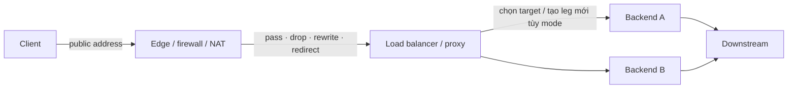
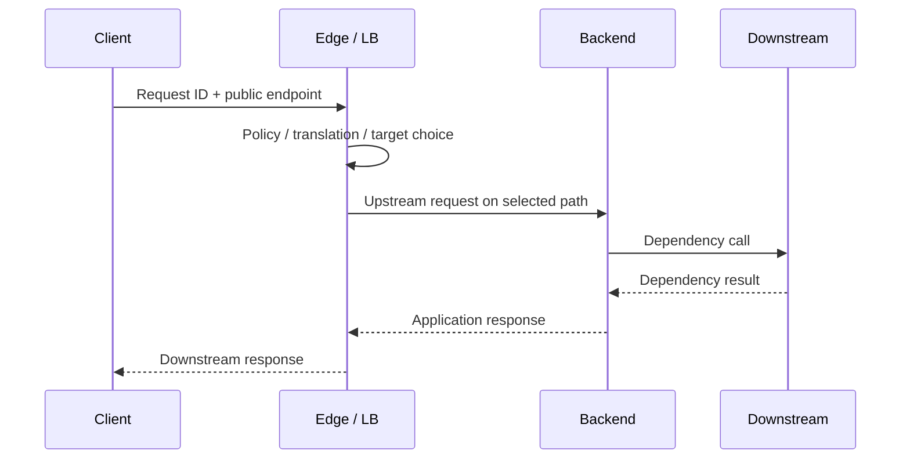

# Proxy, middlebox và load balancer: ranh giới kết nối

> [!abstract] Câu hỏi trung tâm
> Một request client gửi tới public IP có thể bị rewrite, lọc, inspect, trả từ cache, terminate TLS, chia thành TCP leg mới hoặc phân phối tới một backend nội bộ. Mỗi thiết bị nhìn một phần khác nhau của flow và tạo log theo state riêng. Tên gọi “load balancer” hay “proxy” chưa đủ để biết connection có bị kết thúc hay identity nào còn được bảo toàn; phải đọc đúng data path và mode triển khai.

## Mô hình tổng quát



Sơ đồ cố ý dùng cụm “tùy mode”. NAT, packet-filtering firewall và reverse proxy đều là middlebox, song không có cùng connection semantics. Trước khi đọc trace phải xác định thiết bị đang forward, translate hay terminate protocol nào.

## 1. Middlebox là một họ thiết bị, không phải một hành vi duy nhất

Sách dùng định nghĩa từ RFC 3234: middlebox nằm trên data path giữa source và destination, thực hiện chức năng ngoài forwarding IP thông thường. Những ví dụ đã xuất hiện trong các chương trước gồm web cache, TCP connection splitter, NAT, firewall và intrusion detection system.

Ba nhóm chức năng rộng:

1. **NAT translation**: rewrite IP address và port để nối private addressing với mạng ngoài.
2. **Security service**: lọc, redirect, deep packet inspection hoặc phát hiện pattern.
3. **Performance enhancement**: compression, caching và load balancing.

Một box có thể làm nhiều nhóm cùng lúc. Load balancer có thể kèm NAT; firewall có thể redirect sang DPI; proxy có thể cache và terminate TLS. Tên sản phẩm không thay thế sơ đồ xử lý packet.

> [!source-fact]
> Định nghĩa middlebox, các ví dụ và ba nhóm service nằm tại §4.5, trang in 390–391.

## 2. Sáu động từ cần dùng khi mô tả data path

| Động từ | Điều xảy ra | Câu hỏi phải trả lời |
|---|---|---|
| Forward | Chuyển packet theo route | Header nào được giữ nguyên? |
| Translate | Đổi address/port hoặc field | Mapping state nằm ở đâu, chiều về đi qua đâu? |
| Filter | Cho qua hoặc loại | Rule, counter và lý do drop có quan sát được không? |
| Inspect | Đọc sâu hơn để quyết định | Thiết bị nhìn được layer nào, dữ liệu có mã hóa không? |
| Terminate | Kết thúc connection/protocol tại box | Peer thực của mỗi leg là ai? |
| Re-originate | Mở connection mới tới upstream | Timeout, retry, TLS và source identity của leg mới là gì? |

Các động từ là taxonomy biên tập để ép mô tả đi vào hành vi quan sát được. Một thiết bị có thể vừa terminate connection client vừa re-originate connection backend; một NAT truyền thống có mapping state nhưng không nhất thiết terminate TCP.

> [!synthesis]
> Taxonomy sáu động từ tổng hợp các hành vi mà §§4.5 và 6.6.1 mô tả hoặc dẫn chiếu. Nguồn không đặt tên đây là một framework.

## 3. NAT thay tuple quan sát được

NAT rewrite IP address và port trong packet. Điều này tạo ít nhất hai cách nhìn về cùng một flow:

- phía client/public nhìn public tuple;
- phía internal nhìn tuple sau translation.

Thiết bị cần mapping để xử lý chiều đi và chiều về. Backend có thể không thấy source tuple nguyên gốc từ client, tùy topology và mode. Vì thế ghép log chỉ bằng `source_ip:source_port` qua NAT/LB có thể sai; cần thêm request ID, timestamp và mapping/flow log nếu hệ thống cung cấp.

> [!source-fact]
> NAT như middlebox rewrite network-layer address và transport-layer port được nêu tại §4.5, trang in 390–391.

> [!uncertainty]
> Nguồn không đặc tả timeout của NAT mapping, source-NAT mode, direct-server-return hay cách giữ client IP của từng sản phẩm. Các quyết định ấy phải lấy từ cấu hình và tài liệu triển khai thực tế.

## 4. Firewall và IDS không đồng nghĩa connection proxy

Firewall có thể lọc bằng header, redirect traffic để xử lý thêm hoặc dùng field ở network, transport và application layer. IDS có thể tìm pattern định trước rồi lọc packet. Những hành vi này vi phạm giả định router chỉ nhìn IP header, nhưng chưa đủ để kết luận firewall đã terminate TCP.

Khi SYN không tới server, các khả năng gồm rule drop, route, NAT mapping, backlog, capture point sai hoặc packet bị loại ở hop khác. “Không có backend log” chỉ nói application/backend không ghi nhận; nó không xác định box nào đã drop.

> [!source-fact]
> Firewall block/redirect, DPI và IDS pattern filtering được liệt kê trong nhóm security service tại §4.5, trang in 390–391.

## 5. Cache, proxy và TCP splitter tạo ranh giới mạnh hơn

Web cache có thể trả response mà không gửi request tới origin. TCP splitter kết thúc một TCP connection rồi dùng connection khác ở phía sau. Hai ví dụ cùng là middlebox nhưng tác động khác NAT:

- cache thay đổi nơi response được tạo;
- splitter thay đổi TCP endpoint và congestion state;
- reverse proxy có thể làm cả hai, tùy cấu hình.

Khi connection bị split, mỗi leg có sequence number, RTT, retransmission, timeout, congestion window và lifecycle riêng. Packet success ở client leg không chứng minh upstream leg thành công.

> [!source-fact]
> §4.5 dẫn lại web cache ở §2.2.5 và TCP connection splitter ở §3.7 như hai ví dụ middlebox, trang in 390.

## 6. Middlebox làm mờ ranh giới phân tầng

Kiến trúc Internet cổ điển đặt router trong core làm forwarding, còn transport/application logic ở edge host. NAT sửa cả IP và port; application-aware firewall đọc nhiều layer; e-mail gateway lọc theo address lẫn message content. Chức năng không còn nằm gọn trong một layer.

Hệ quả vận hành là một lỗi bề ngoài giống application failure có thể được tạo bởi policy trong mạng; một thay đổi transport header có thể do NAT; một HTTP response có thể đến từ cache thay vì origin. Runbook theo mô hình năm layer vẫn hữu ích, nhưng phải ghi box nào phá vỡ ranh giới nào.

> [!source-fact]
> Sự đối lập giữa kiến trúc phân tầng cũ và middlebox xử lý nhiều layer được thảo luận tại §4.5, trang in 391.

## 7. End-to-end argument đặt chuẩn cho vị trí chức năng

Sidebar của sách tóm lược end-to-end argument: có những chức năng chỉ có thể thực hiện đầy đủ và đúng khi endpoint/application tham gia vì chỉ chúng có đủ context. Lower layer vẫn có thể cung cấp phiên bản chưa đầy đủ để tăng performance, nhưng không thay bằng chứng end-to-end.

Reliable delivery là ví dụ: link layer có thể sửa lỗi cục bộ, song endpoint vẫn cần error control vì packet còn có thể mất ở phần khác của path. Tương tự, firewall/DPI không thay application validation; load balancer health check không tự chứng minh business transaction hoàn tất.

> [!source-fact]
> IP narrow waist và end-to-end argument được trình bày trong sidebar đi kèm §4.5, trang in 391–393.

> [!synthesis]
> Liên hệ health check với business outcome là phép áp dụng nguyên lý; sách không trình bày health check của load balancer trong phạm vi đã đọc.

## 8. NFV đổi cách đóng gói chức năng, không xóa semantics

Middlebox phần cứng chuyên dụng tạo chi phí mua sắm, vận hành và nâng cấp riêng. Sách giới thiệu Network Function Virtualization (NFV): dùng commodity compute/network/storage cùng software chuyên dụng trên stack chung; một hướng khác là đưa chức năng middlebox lên cloud.

Virtualization thay cách triển khai và quản lý, không làm biến mất state, ordering, capacity hoặc failure mode. Một firewall ảo vẫn có rule/counter; một virtual load balancer vẫn cần mapping và resources; scale-out còn tạo câu hỏi phân phối state giữa instance.

> [!source-fact]
> Chi phí của box chuyên dụng, NFV và cloud middlebox được nêu tại §4.5, trang in 390–391.

> [!inference]
> Nhu cầu phân phối state khi scale-out là hệ quả kiến trúc cần kiểm bằng implementation; nguồn chỉ giới thiệu hướng NFV/cloud, không đặc tả state replication.

## 9. Data center có traffic ngoài–trong và traffic nội bộ

Data center network nối các rack với nhau và với border router. Sách tách hai nhóm traffic:

- flow giữa external client và internal host;
- flow giữa các internal host.

Load balancer nằm trên đường external request đi vào application hosts. Sau khi nhận request, một host còn có thể gọi các host khác, tạo fan-out nội bộ. Vì thế latency client quan sát gồm cả edge path, load-balancing decision, backend processing và dependency traffic; access log ở LB không bao phủ toàn chuỗi.

> [!source-fact]
> Hai loại traffic, border router và internal interconnect nằm tại §6.6.1, trang in 535–536.

## 10. Load balancer công bố một địa chỉ, chọn một host nội bộ

Trong mô hình data center của sách, mỗi application có public IP để client gửi request và nhận response. Request đi tới load balancer; box chọn một host đang phục vụ application dựa trên load hiện tại. Sách gọi loại thiết bị này là “layer-4 switch” vì decision dùng destination IP cùng destination port.

Load balancer còn làm NAT-like translation:

```text
Client → application public IP:port
       → load balancer chọn backend
       → internal backend IP:port
       → reverse translation cho response về client
```

Mapping chiều về là phần của correctness: response phải mang view phù hợp để client tiếp tục coi mình đang nói với application public endpoint.

> [!source-fact]
> Public application address, lựa chọn host, layer-4 decision và NAT-like translation nằm tại phần Load Balancing của §6.6.1, trang in 536–537.

## 11. “Layer-4 load balancer” chưa nói nó có terminate TCP hay không

Nguồn mô tả decision từ IP/port và translation, nhưng không đưa wire-level connection state machine. Do đó không được tự suy ra box là transparent NAT, full proxy, TCP splice hay một mode khác.

Muốn xác định boundary cần kiểm:

1. client nhìn TCP peer nào và certificate nào;
2. backend nhìn source address nào;
3. sequence spaces có liên tục qua box hay có hai trace độc lập;
4. box có mở upstream socket không;
5. retry/timeout thuộc leg nào;
6. response path có bắt buộc quay lại cùng box không.

> [!uncertainty]
> Connection-termination mode không được §6.6.1 đặc tả. Note giữ các khả năng mở và yêu cầu bằng chứng từ packet trace, configuration cùng vendor documentation.

## 12. TLS termination tạo hai trust boundary

Nếu load balancer/reverse proxy terminate TLS, client xác thực edge certificate và thiết lập session với edge. Edge sau đó có thể dùng plaintext nội bộ hoặc mở TLS session khác tới backend. Hai leg có:

- peer identity riêng;
- certificate và trust store riêng;
- protocol/cipher/session riêng;
- timeout, close và telemetry riêng.

TLS client–edge thành công không chứng minh edge–backend được mã hóa, xác thực đúng hoặc còn sống. Ngược lại, origin TLS khỏe không chứng minh client hoàn tất handshake với edge.

> [!synthesis]
> TLS termination không được mô tả trong §6.6.1; phần này nối load-balancer boundary với kiến thức đã chưng cất tại [[TLS Certificates and Endpoint Authentication|TLS certificate và xác thực endpoint]]. Cấu hình thật cần nguồn của sản phẩm.

## 13. Che topology là lợi ích, không phải security proof đầy đủ

Sách nêu NAT-like load balancer ngăn client liên hệ trực tiếp host và ẩn cấu trúc mạng nội bộ. Đây là một lớp giảm exposure. Nó không tự chứng minh backend đã có authentication, authorization, patching, segmentation hay protection trước actor nội bộ.

Public endpoint vẫn là attack surface. Load balancer có thể chuyển traffic độc hại tới backend nếu policy/application validation không chặn; topology hiding không thay secure design.

> [!source-fact]
> Việc không cho client tiếp xúc trực tiếp host và che internal network structure được nêu tại §6.6.1, trang in 537.

## 14. Hierarchy tạo scale và cũng tạo bottleneck

Kiến trúc mẫu có border/access router, các tier switch, Top-of-Rack switch và server rack. Hierarchy cho phép mở rộng số host, nhưng traffic giữa rack có thể chia sẻ uplink ở tier cao hơn.

Ví dụ sách: 40 flow cùng đi qua link 100 Gbps. Nếu chia đều, mỗi flow nhận:

$$
\frac{100\ Gbps}{40}=2.5\ Gbps
$$

dù NIC host có thể là 10 Gbps. Tốc độ NIC không phải throughput end-to-end khi topology bị oversubscribed. Placement cùng path diversity ảnh hưởng performance.

> [!source-fact]
> Hierarchical topology, 40-flow example và phép chia 2.5 Gbps nằm tại §6.6.1, trang in 537–538.

## 15. Redundancy thay failure domain, không xóa failure

Sách nêu duplicate equipment/link và nhiều path giữa tier để tăng availability, capacity và path diversity. Redundancy chỉ phát huy nếu failure không đánh trúng dependency chung và failover hoạt động đúng.

Các câu hỏi cần bằng chứng:

- control plane có hội tụ đúng không;
- stateful middlebox có chuyển state/mapping không;
- connection đang mở bị reset hay giữ được;
- health signal có phát hiện đúng host/path lỗi không;
- capacity còn lại sau failure có chịu được tải không.

> [!source-fact]
> Redundant equipment/link, multiple disjoint paths và lợi ích capacity/reliability nằm tại §6.6.1, trang in 537–538.

> [!inference]
> Danh sách failover questions là kiểm tra vận hành suy ra từ stateful middlebox và redundancy; nguồn không cung cấp protocol failover hay test plan.

## 16. Connection table phải được lập trước khi điều tra

| Boundary | Downstream peer | Upstream peer | Có thể có connection mới? | Bằng chứng cần thu |
|---|---|---|---|---|
| Client → NAT | NAT/public path | Destination | Không nhất thiết | tuple trước/sau, mapping, trace hai phía |
| Client → packet firewall | Destination qua firewall | Destination | Không nhất thiết | rule hit, drop/allow counter, trace |
| Client → web cache | Cache/proxy | Origin khi miss | Có | cache status, hai access log, validator |
| Client → TCP splitter | Front-end | Back-end | Có | hai handshake, RTT/seq state từng leg |
| Client → L4 LB | Virtual/public endpoint | Backend tùy mode | Chưa kết luận | mode, mapping, socket/flow table |
| Client → TLS proxy | Edge TLS endpoint | Origin TLS/plain endpoint | Có | certificate/session/log mỗi leg |

Bảng dùng “có thể” ở L4 LB vì tên layer không xác định implementation. Nếu không lập connection table, đội vận hành dễ ghép ACK của leg này với timeout của leg khác.

## 17. Source identity thay đổi qua từng hop

Backend có thể thấy địa chỉ client, địa chỉ NAT, hoặc địa chỉ proxy tùy mode. Header như `X-Forwarded-For` chỉ có ý nghĩa khi một proxy tin cậy xóa/ghi lại theo policy; header do client tự gửi không phải bằng chứng identity.

Ba trường cần tách:

- transport peer quan sát từ socket;
- claimed client identity trong forwarded metadata;
- authenticated principal do TLS/application xác lập.

Chúng có thể khác nhau hợp lệ. Log cần ghi nguồn của từng trường thay vì gom thành một cột “client”.

> [!synthesis]
> Nguồn giải thích translation và topology hiding nhưng không nói về forwarded headers. Quy tắc trust header là mở rộng vận hành, cần tài liệu proxy đang dùng.

## 18. Timeout và retry có chủ sở hữu theo từng boundary

Một request client có thể đi qua nhiều connection:

```text
client ── leg A ── edge/proxy ── leg B ── backend ── leg C ── downstream
```

Mỗi leg có connect timeout, idle timeout, read timeout và lifecycle riêng. Proxy còn có thể retry upstream mà client không biết. Khi client timeout, backend có thể đã commit; khi backend log thành công, proxy vẫn có thể thất bại khi chuyển response về client.

Nguồn không đặc tả retry/timeout của load balancer. Đây là stop condition: trước khi kết luận hay thay policy phải đọc configuration và vendor documentation, rồi ghép log của mọi leg.

> [!synthesis]
> Mô hình timeout ownership nối middlebox/load-balancer path với [[HTTP Requests Connection State and Caching|HTTP request connection state và cache]]. Retry behavior không được suy ra từ §§4.5 và 6.6.1.

## 19. Health check không đồng nghĩa request thật thành công

Một health check có thể chỉ kiểm port mở hoặc endpoint nhẹ. Request thật có thể phụ thuộc database, credential, tenant data, downstream service và payload size mà probe không chạm tới. Load balancer chọn một host “healthy” theo probe vẫn có thể trả lỗi application.

Khi báo “LB gửi vào host khỏe”, phải nêu health check đo điều gì, tần suất, success threshold và thời điểm gần request. Phần này cần tài liệu triển khai; source chỉ nói chọn host theo load hiện tại.

> [!uncertainty]
> Health-check semantics, scheduling algorithm, session affinity, outlier ejection và connection draining nằm ngoài phạm vi nguồn. Không viết mặc định cho chúng.

## 20. Sơ đồ bằng chứng cho một request



Ở mỗi mũi tên cần tối thiểu timestamp, connection/request identifier, outcome và byte/status nếu layer có khái niệm đó. Request ID chỉ hữu ích khi được truyền và log đúng; timestamp cần clock đủ tin cậy để ghép.

### Thứ tự điều tra

1. Vẽ public endpoint, middlebox và backend thật của request.
2. Ghi mode của từng box bằng sáu động từ ở mục 2.
3. Lập connection table, gồm TCP/TLS peer từng leg.
4. Thu DNS answer, mapping/target choice, rule hit và access log.
5. Ghép trace/log bằng request ID cộng timestamp; không dùng IP đơn lẻ.
6. Tách transport outcome, TLS outcome, HTTP outcome và business outcome.
7. Xác định component sở hữu timeout/retry đã quan sát.
8. Kiểm response path; stateful translation thường cần chiều về phù hợp.
9. Với failure theo tải, đối chiếu queue, connection table, CPU, target load và oversubscription link.

## 21. Ma trận failure

| Hiện tượng | Các cách giải thích cần phân biệt | Bằng chứng quyết định |
|---|---|---|
| Client timeout, backend không log | DNS/TCP/TLS/edge drop, target chưa tới app | timing từng pha, edge/LB log, rule/mapping, trace |
| LB log `200`, client không đủ body | downstream reset, timeout, truncation, client close | byte counts, leg A trace, proxy close reason |
| Backend `200`, edge trả `502/504` | response/read timeout, parse/protocol, upstream close | backend completion time, edge upstream log, leg B trace |
| Chỉ một backend lỗi | target-specific config/state/dependency | selected target, per-host logs/metrics, health state |
| Source IP ở backend “sai” | NAT/SNAT/proxy mode | tuple/mapping, trusted forwarded metadata |
| TLS đúng ngoài edge, sai tới origin | hai TLS leg khác policy/certificate | session/certificate/log của từng leg |
| Throughput liên rack thấp | shared uplink/oversubscription, congestion | topology, path, flow count, interface counters |
| Failover gây reset | state không chuyển, path thay, drain chưa xong | connection table, failover event, reset source |

## 22. Áp dụng khi điều kiện thay đổi

### Cache hit

Origin không có log là hành vi bình thường nếu edge trả cache hit. Cần cache status, object age, validator và key; không dùng origin-log absence làm bằng chứng request mất.

### NAT-only path

Không vẽ thêm upstream TCP connection nếu box chỉ translate tuple. Sequence space có thể đi xuyên; chẩn đoán cần mapping và trace hai phía NAT.

### Full proxy path

Hai connection độc lập. Client retransmission/RTT không phản ánh backend leg; proxy có thể buffer cả request/response, thay timing và backpressure.

### TLS passthrough

Edge chọn target mà không terminate TLS theo mode cụ thể; backend có thể là TLS peer của client. Không suy ra passthrough chỉ vì sản phẩm được gọi L4—phải kiểm configuration và certificate quan sát.

### Multi-region hoặc multi-edge

DNS/anycast/routing có thể đưa hai client vào edge khác nhau. Một lần tái hiện thành công không phủ edge, target pool hay policy khác; cần ghi endpoint thực và route của lần lỗi.

### East–west fan-out

External request chỉ là đầu chuỗi. Backend có thể gọi nhiều service nội bộ; bottleneck ở link giữa rack hoặc downstream queue vẫn làm user latency tăng dù ingress LB khỏe.

## 23. Những cách hiểu sai thường gặp

| Cách hiểu sai | Cách đọc đúng |
|---|---|
| Mọi middlebox đều là proxy | Middlebox còn gồm NAT, firewall, IDS và cache với semantics khác nhau |
| L4 load balancer chắc chắn terminate TCP | Layer cho biết field decision; mode connection cần bằng chứng riêng |
| NAT không có state | Translation chiều đi/về cần mapping theo implementation |
| Backend thấy source IP là identity client | Address có thể đã bị NAT/proxy; authentication là lớp khác |
| Ẩn topology là đủ an toàn | Giảm exposure nhưng không thay authn/authz/segmentation/validation |
| LB health check pass nghĩa request thật pass | Probe có thể không chạm dependency hoặc payload thật |
| Backend `200` nghĩa client nhận thành công | Response còn phải vượt upstream/downstream leg |
| Không có origin log nghĩa request chưa gửi | Cache/edge có thể trả hoặc chặn trước origin |
| Redundancy loại bỏ outage | Failover, shared dependency và capacity sau lỗi vẫn phải kiểm |
| NIC 10 Gbps nghĩa flow luôn đạt 10 Gbps | Shared hierarchy có thể oversubscribe uplink |
| Forwarded header luôn đáng tin | Chỉ tin metadata được proxy tin cậy kiểm soát theo policy |

## 24. Giới hạn của nguồn và của chương

Chỉ dựa vào §§4.5 và 6.6.1 chưa thể:

- xác định mode forwarding/proxying của một load balancer cụ thể;
- mô tả algorithm chọn target, health check, affinity, retry, timeout hay draining;
- thiết kế trusted forwarded-header/client-IP policy;
- cấu hình TLS passthrough/termination/re-encryption;
- chọn NFV platform hoặc state-replication architecture;
- chứng minh packet bị drop ở box nào khi thiếu counter/trace đa điểm;
- sizing connection table, queue, worker hoặc backend pool;
- khẳng định kiến trúc data center hiện hành từ số liệu/topology lịch sử trong sách;
- suy ra business success từ LB/access log;
- thay vendor documentation và thực nghiệm failure/failover.

## 25. Câu hỏi ôn tập

1. Sáu động từ forward, translate, filter, inspect, terminate và re-originate khác nhau thế nào?
2. Vì sao NAT mapping không mặc nhiên tạo hai TCP connection?
3. Firewall đọc application field có nhất thiết terminate TCP không?
4. Cache hit làm thay đổi ý nghĩa của việc origin không có log ra sao?
5. TCP splitter tạo những state độc lập nào ở hai leg?
6. Load balancer trong §6.6.1 chọn backend và rewrite address theo flow nào?
7. Vì sao nhãn “layer-4” chưa đủ kết luận connection termination?
8. TLS termination tạo hai trust boundary như thế nào?
9. Backend source IP, forwarded client IP và authenticated principal khác nhau ở đâu?
10. Vì sao health check success chưa chứng minh business request thành công?
11. 40 flow qua link 100 Gbps minh họa oversubscription ra sao?
12. Bằng chứng nào cần ghép khi backend `200` nhưng client timeout?
13. End-to-end argument giới hạn kỳ vọng đặt vào middlebox thế nào?
14. Redundancy cần test thêm state và capacity sau failover vì sao?

## 26. Liên kết chương trình

- Nguồn: [[SRC-KUROSE-ROSS-NETWORKING-8E]].
- Bài liên quan trực tiếp: `DE-L082`, `DE-L083`.
- Bài dùng làm nền: `DE-L079`, `DE-L080`, `DE-L081`, `DE-L084`, `DE-L086`, `DE-L088`.
- Liên quan: [[HTTP Requests Connection State and Caching|HTTP request connection state và cache]], [[TCP Reliability RTT RTO and Flow Control|TCP reliability RTT RTO và flow control]], [[TCP Congestion Control AIMD ECN and Fairness|TCP congestion control AIMD ECN và fairness]], [[TLS Certificates and Endpoint Authentication|TLS certificate và xác thực endpoint]], [[DNS Resolution Delegation Caching and TTL|DNS resolution delegation cache và TTL]], [[Packet-Switched Network Delay Loss and Throughput|Độ trễ mất gói và thông lượng trong mạng chuyển mạch gói]].
- Nguồn bắt buộc bổ sung trước production guidance: configuration và documentation của proxy/LB, timeout/retry semantics, health check, client-IP trust, TLS mode, telemetry và failover test.

## Source coverage

| Source slice | Nội dung phải giữ | Vị trí trong note | Trạng thái |
|---|---|---|---|
| [[SRC-KUROSE-ROSS-NETWORKING-8E]], §4.5 | middlebox taxonomy, NAT/firewall/cache/proxy và tác động tới layering | §§1–8 | Đã trình bày theo hành vi thay vì tên thiết bị |
| [[SRC-KUROSE-ROSS-NETWORKING-8E]], §6.6.1 | data-center topology, load balancing, hierarchy và redundancy | §§9–15 | Đã trình bày cả scale benefit và failure domain |
| Tổng hợp từ hai lát nguồn | connection boundary, source identity, timeout/retry ownership và evidence graph | §§16–22 | Đã gắn `synthesis`; không quy chúng thành phát biểu nguyên văn của sách |

Configuration semantics của proxy hoặc load balancer cụ thể không có trong hai lát nguồn. Note giữ chúng ở phần yêu cầu tài liệu bổ sung, không tạo default giả định.

## Key takeaways
- Middlebox phải được mô tả bằng hành vi cụ thể như route, translate, filter, terminate, proxy hoặc cache; tên thiết bị và nhãn layer không đủ xác định semantics.
- Một proxy hoặc load balancer terminate kết nối tạo ít nhất hai connection boundary với timeout, retry, source identity và trạng thái transport riêng.
- TLS termination dịch chuyển trust boundary. Xác thực thành công ở kết nối ngoài không tự động chứng minh kết nối trong được mã hóa hoặc xác thực tương đương.
- Health check chỉ chứng minh probe cụ thể thành công tại thời điểm đo; nó không thay thế request thật, capacity test hoặc kiểm tra dependency sâu hơn.
- Chẩn đoán phải lập connection table, ánh xạ tuple và correlation ID qua từng hop, rồi ghép client, intermediary và backend evidence theo cùng cửa sổ thời gian.

## Reference
1. James F. Kurose, Keith W. Ross, *Computer Networking: A Top-Down Approach*, Eighth Global Edition, Pearson, 2022, §4.5, printed pp. 390–393, PDF pp. 392–395; §6.6.1, printed pp. 535–538, PDF pp. 537–540.
2. Hồ sơ nguồn: [[SRC-KUROSE-ROSS-NETWORKING-8E]].
3. Source note: `Material/DE/Reference/Library/Source-Notes/PACK-OS_NETWORK-BOOK-03.md`.

## Lịch sử biên tập

| Ngày | Trạng thái | Nội dung |
|---|---|---|
| 2026-09-27 | `review` | Đọc trực tiếp middlebox và data-center load balancing; tách mode connection/trust/log; bổ sung runbook đa boundary; biên tập Humanizer tiếng Việt |

<!-- ATOMIC-EXECUTION-CAPSULE:START -->

## Execution capsule — kiểm chứng `wiki.network.proxy-middlebox-load-balancer-boundaries`

> [!important] Phân loại mệnh đề
> Với `wiki.network.proxy-middlebox-load-balancer-boundaries`, sơ đồ, ví dụ và artifact về **Proxy, middlebox và load balancer: ranh giới kết nối** là **synthesis để kiểm chứng**; chúng không phải trích dẫn hay case nguyên văn của nguồn.

### Artifact thực thi tối thiểu

```yaml
concept_id: "wiki.network.proxy-middlebox-load-balancer-boundaries"
concept: "Proxy, middlebox và load balancer: ranh giới kết nối"
primary_question: "Khi request đi qua NAT, firewall, proxy hoặc load balancer, connection và identity bị biến đổi ở đâu, log của từng hop chứng minh được gì, và phải ghé"
decision_contract:
  input_boundary: "Ghi population, thời điểm, owner và điều chưa biết"
  hard_constraints:
    - "Không vượt quyền hoặc privacy boundary"
    - "Không dùng cùng một assumption làm cả implementation và oracle"
  accept_when: "Có observation phân biệt được các lựa chọn"
  reversal_trigger: "Một hard constraint sai hoặc evidence mới đổi recommendation"
evidence_to_keep:
  - "input snapshot"
  - "chosen and rejected options"
  - "independent review result"
```

Artifact của `wiki.network.proxy-middlebox-load-balancer-boundaries` buộc người dùng ghi boundary, oracle và reversal trigger cho **Proxy, middlebox và load balancer: ranh giới kết nối**. Các giá trị minh họa phải được thay bằng evidence thật trước khi dùng cho quyết định.

### Tự kiểm tra trước khi tái sử dụng

1. Bạn có thể trả lời `Khi request đi qua NAT, firewall, proxy hoặc load balancer, connection và identity bị biến đổi ở đâu, log của từng hop chứng minh được gì, và phải ghép bằng chứng thế nào để không quy sai nguyên nhân?` bằng một câu mà không kéo thêm concept thứ hai không?
2. Source locator nào đỡ cho claim, và phần nào chỉ là synthesis trong note?
3. Observation nào khiến bạn dừng, thu hẹp hoặc đảo quyết định?
4. Artifact nào cho phép một reviewer độc lập tái hiện kết quả?

<!-- ATOMIC-EXECUTION-CAPSULE:END -->
