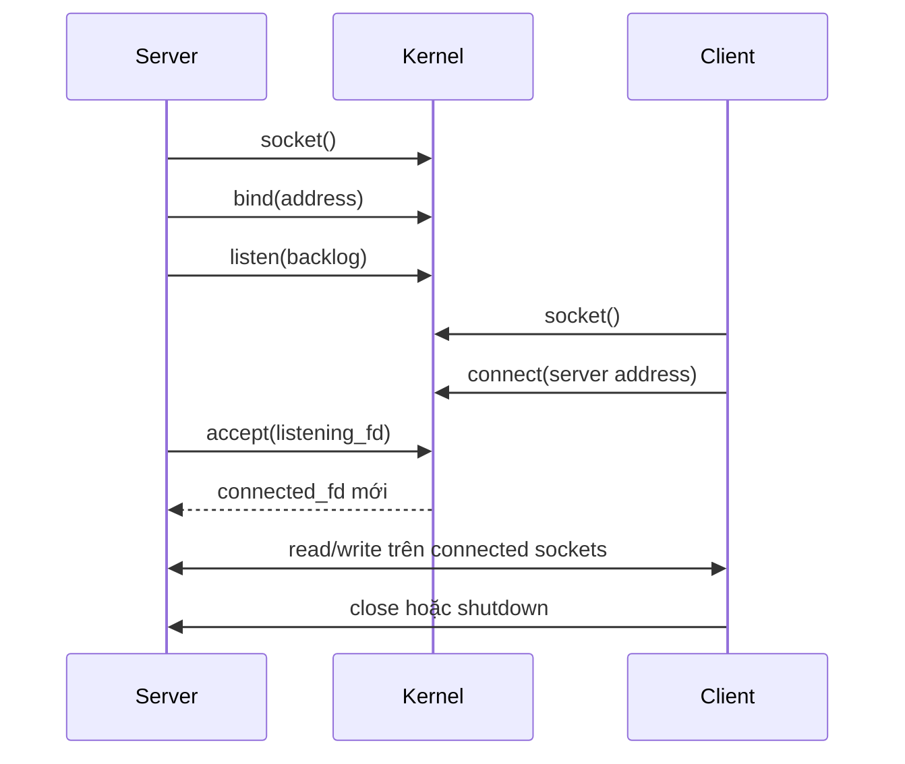
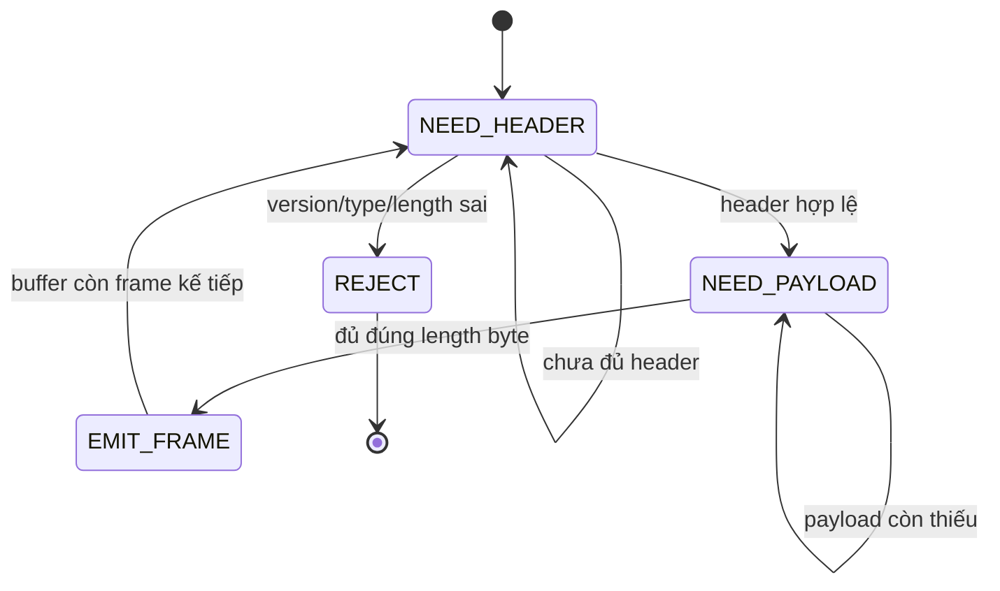

# Socket, dòng byte TCP và đóng khung thông điệp

> [!abstract] Câu hỏi trung tâm
> TCP chuyển một dòng byte có thứ tự giữa hai tiến trình. Nó không giữ ranh giới giữa các lần `send()` và cũng không biết “một thông điệp” của ứng dụng dài bao nhiêu. Vì thế application protocol phải tự định nghĩa framing; chương trình phải chịu được partial read, partial write, EOF giữa frame, client gửi chậm và length field độc hại. Đúng ở tầng TCP chưa đồng nghĩa frame, request hay giao dịch nghiệp vụ đã hoàn tất.

## 1. Socket là cửa giao tiếp, không phải thông điệp

Kurose và Ross dùng hình ảnh socket như cánh cửa giữa process và transport layer. Ứng dụng kiểm soát phần nằm trong process; hệ điều hành kiểm soát TCP bên dưới socket. Khi process ghi dữ liệu, TCP đưa byte vào send buffer, chia chúng thành segment phù hợp và chuyển qua mạng. Phía nhận đặt payload vào receive buffer để ứng dụng đọc.

Hai hệ quả thường bị bỏ qua:

- buffer của socket không phải hàng đợi message;
- ranh giới segment TCP không phải ranh giới record của application protocol.

TCP đánh số byte trong một dòng liên tục. Một frame 20 KiB có thể đi qua nhiều segment; nhiều frame nhỏ có thể cùng nằm trong một lần `read()`. Packet capture hữu ích để xem transport, nhưng parser không được dựa vào cách packet tình cờ bị chia trong một lần chạy.

> [!source-fact]
> Socket như giao diện process–transport, send/receive buffer và TCP nhìn dữ liệu như dòng byte không cấu trúc nhưng có thứ tự được trình bày tại Kurose–Ross §§2.7 và 3.5.1–3.5.2, trang in 182–194 và 257–264.

## 2. Vòng đời socket phía server và client



Server đi qua bốn bước khác chức năng:

1. `socket()` tạo endpoint và trả file descriptor.
2. `bind()` gắn endpoint với địa chỉ mà client có thể biết.
3. `listen()` biến socket thành listening socket, sẵn sàng nhận yêu cầu kết nối.
4. `accept()` lấy một kết nối đang chờ và trả **một file descriptor mới** cho kết nối đó.

Client tạo socket rồi gọi `connect()` tới địa chỉ server. Sau khi kết nối được thiết lập, hai phía đều có thể đọc và ghi; stream socket là kênh hai chiều.

> [!source-fact]
> Chuỗi `socket`–`bind`–`listen`–`accept`, phía client `socket`–`connect`, và I/O hai chiều bằng `read`/`write` hoặc `send`/`recv` nằm tại TLPI §56.5, trang in 1155–1159.

## 3. Listening socket và connected socket là hai vai trò khác nhau

`accept()` không biến listening socket thành connection của client. Nó giữ listening socket để tiếp tục nhận client mới và tạo một socket khác cho cuộc trao đổi vừa được chấp nhận.

```text
listening_fd
  ├── accept() → client_A_fd
  ├── accept() → client_B_fd
  └── accept() → client_C_fd
```

Sai lầm phổ biến là đóng nhầm listening descriptor, đọc request trên nó, hoặc dùng chung state parser cho nhiều connected socket. Mỗi connection cần receive buffer và decoder state riêng. Nếu multiplex nhiều connection trong một event loop, khóa tra cứu phải là connection identity, không phải “server socket”.

> [!source-fact]
> TLPI §56.5.2 nhấn mạnh `accept()` tạo socket mới nối với peer, còn listening socket vẫn mở để nhận kết nối tiếp theo, trang in 1157–1158.

## 4. Một lần ghi không ánh xạ thành một lần đọc

Giả sử sender thực hiện:

```text
write("ABC")
write("DEFG")
```

Receiver có thể quan sát nhiều cách hợp lệ:

```text
read() → "A"
read() → "BCDEFG"
```

hoặc:

```text
read() → "ABCDE"
read() → "FG"
```

hoặc một lần đọc đủ `"ABCDEFG"`. TCP chỉ giữ thứ tự byte. Nó không chuyển metadata “đây là lần write thứ nhất” sang receiver. Kích thước buffer, timing, congestion, scheduling và lượng byte đã có sẵn đều có thể làm kết quả từng lần đọc thay đổi.

> [!synthesis]
> Các phép chia ở ví dụ là những kết quả phù hợp với byte-stream semantics và partial transfer; hai sách không hứa một pattern chia cụ thể cho các chuỗi trên.

## 5. Partial read là hành vi bình thường

Khi gọi `read(fd, buffer, n)`, giá trị `n` là giới hạn trên, không phải lời hứa rằng kernel sẽ chờ đủ `n` byte. Nếu socket hiện có ít byte hơn, `read()` có thể trả ngay số byte đang có.

Ba nhóm kết quả cần xử lý:

| Kết quả | Ý nghĩa trên stream socket blocking | Việc phải làm |
|---|---|---|
| `> 0` | Đã nhận từng ấy byte, có thể ít hơn yêu cầu | Tăng offset; tiếp tục nếu protocol còn thiếu |
| `0` | EOF sau khi dữ liệu đã buffer được đọc hết | Phân biệt kết thúc hợp lệ với frame bị cắt |
| `-1` | Lỗi; xem `errno` | Retry `EINTR`; phân loại lỗi khác |

Nếu frame khai báo 1.024 byte mà đã đọc 600 byte rồi gặp EOF, đây không phải “message 600 byte”. Đó là frame bị truncate, trừ khi protocol có quy tắc khác được viết rõ.

> [!source-fact]
> Partial read xảy ra khi số byte sẵn có ít hơn số được yêu cầu; `readn()` lặp cho tới đủ, lỗi hoặc EOF được mô tả tại TLPI §61.1, trang in 1254–1255.

## 6. Partial write cũng phải được coi là bình thường

`write(fd, buffer, n)` thành công không nhất thiết trả `n`. Một signal có thể ngắt sau khi đã chuyển một phần; nonblocking socket có thể chỉ còn chỗ cho một phần; lỗi bất đồng bộ có thể xuất hiện sau khi một số byte đã vào output buffer. Khi đã chuyển ít nhất một byte, lời gọi có thể trả số byte đã chuyển thay vì báo lỗi.

Vòng lặp ghi phải giữ offset:

```text
written = 0
while written < total:
    n = write(fd, data[written:])
    if n > 0:
        written += n
    else if n < 0 and errno == EINTR:
        continue
    else:
        fail connection
```

Với nonblocking I/O, `EAGAIN`/`EWOULDBLOCK` không có nghĩa connection hỏng. Nó có nghĩa hiện giờ thao tác sẽ block; event loop phải chờ readiness rồi tiếp tục từ offset cũ. Không được quay vòng nóng.

> [!source-fact]
> Các nguyên nhân partial write và vòng lặp `writen()` nằm tại TLPI §61.1, trang in 1254–1255.

> [!synthesis]
> Nhánh readiness cho nonblocking I/O là cách đưa semantics nguồn vào event-loop design. Đoạn `writen()` của sách là mẫu blocking và không tự xử lý `EAGAIN`.

## 7. `write()` thành công chỉ chứng minh byte đã vào phạm vi kernel

Một `write()` trả đủ số byte chứng minh kernel đã chấp nhận byte vào output path của socket. Nó không tự chứng minh:

- peer application đã gọi `read()`;
- peer đã ghép đủ frame;
- parser đã chấp nhận payload;
- handler đã commit database;
- response đã về tới caller.

TLPI lưu ý rằng sau khi local side đóng connection, peer vẫn có thể crash hoặc không xử lý dữ liệu; sender không tự biết. Nếu cần chắc rằng peer đã đọc và xử lý, application phải có acknowledgement protocol.

> [!source-fact]
> Giới hạn của việc đóng sau khi gửi và nhu cầu acknowledgement ở tầng ứng dụng nằm tại TLPI §56.5.5, trang in 1159.

## 8. Năm mốc hoàn tất không được gộp lại

| Mốc | Bằng chứng tối thiểu | Chưa chứng minh |
|---|---|---|
| Kernel chấp nhận byte | `write`/`send` tăng offset | Peer nhận hoặc xử lý |
| Transport phía peer có byte | ACK/trace transport | Peer application đã đọc |
| Frame hoàn tất | Decoder có đủ header và payload | Payload hợp lệ |
| Request được xử lý | Parser/handler log outcome | Side effect bền vững nếu chưa commit |
| Nghiệp vụ xác nhận | Response/ack có correlation ID | Caller đã nhận nếu chưa có ack ngược |

TCP reliability giải quyết dòng byte giữa transport endpoints, không giải quyết transaction semantics. Thiết kế protocol phải chọn mốc nào là “success” và ghi nó vào response, retry policy cùng log.

> [!synthesis]
> Bảng năm mốc là mô hình chẩn đoán tổng hợp từ socket/TCP semantics và yêu cầu acknowledgement của TLPI; đây không phải taxonomy được hai sách đặt tên.

## 9. Framing là hợp đồng biến dòng byte thành record

Một decoder cần trả lời ba câu hỏi:

1. Frame bắt đầu ở đâu?
2. Frame kết thúc ở đâu?
3. Nếu input không hợp lệ hoặc chưa đủ, giữ state và giới hạn tài nguyên thế nào?

Bốn họ framing thông dụng:

| Cách | Điều kiện đúng | Điểm dễ hỏng |
|---|---|---|
| Kích thước cố định | Mọi record cùng độ dài đã biết | Lãng phí, khó mở rộng schema |
| Delimiter | Delimiter không xuất hiện thô trong payload hoặc có escaping | Scan vô hạn, escape sai, thiếu giới hạn |
| Length prefix | Header cho biết payload length theo byte order đã định | Length giả gây cấp phát lớn, overflow, truncate |
| EOF-delimited | Connection close thực sự là dấu kết thúc message | Không multiplex; không phân biệt close sớm nếu thiếu invariant |

Protocol có thể kết hợp, chẳng hạn header theo delimiter rồi body theo length. Điều cốt lõi là parser không dựa vào số byte của một lần `read()` hay kích thước segment.

> [!synthesis]
> Bảng framing là kiến thức thiết kế protocol được suy ra từ byte-stream semantics và bài thực hành DE-L085. Hai đoạn nguồn đã đọc không đưa taxonomy bốn họ này như một bảng hoàn chỉnh.

## 10. Fixed-size framing

Nếu mỗi record luôn đúng `N` byte, decoder dùng `read_exact(N)`. Đây là lựa chọn đơn giản khi schema thật sự cố định, ví dụ header nhị phân nhỏ.

Các invariant cần ghi rõ:

- `N` tính theo byte, không phải character;
- byte order và layout nhất quán;
- versioning không âm thầm đổi kích thước;
- EOF trước `N` byte là truncated record.

Fixed-size không có nghĩa một `read(N)` sẽ trả đủ. Nó chỉ cho decoder biết phải tích lũy đến mốc nào.

## 11. Delimiter framing

Protocol dòng có thể dùng newline hoặc delimiter khác. Decoder scan buffer tới delimiter rồi tách một record. Cách này chỉ an toàn khi có quy tắc cho delimiter trong payload: cấm, escape hoặc encode.

Phải đặt `max_line_bytes`. Nếu peer gửi vô hạn mà không có delimiter, server không được giữ buffer phình vô hạn. Khi vượt giới hạn, trả protocol error nếu còn có thể rồi đóng connection theo chính sách.

Một lỗi tinh vi là decode UTF-8 trước khi frame đủ. Multibyte character có thể bị chia giữa hai lần read. Nên xác định boundary ở byte layer trước, rồi decode payload theo charset của protocol.

> [!inference]
> Giới hạn dòng và thứ tự frame-before-decode là yêu cầu an toàn suy ra từ partial read; cần điều chỉnh theo protocol cụ thể.

## 12. Length-prefix framing

Một frame nhị phân tối thiểu có thể là:

```text
+----------+---------+----------+-------------------+
| version  | type    | length   | payload           |
| 1 byte   | 1 byte  | 4 bytes  | length bytes      |
+----------+---------+----------+-------------------+
```

Decoder phải qua hai trạng thái chính:



Trình tự an toàn:

1. Tích lũy đúng số byte header.
2. Parse bằng unsigned type đủ rộng và byte order quy định.
3. Kiểm `length <= MAX_FRAME_SIZE` trước khi reserve/allocate.
4. Kiểm phép cộng `header_size + length` không overflow.
5. Tích lũy payload qua nhiều lần đọc.
6. Chỉ emit khi đủ chính xác; giữ byte dư cho frame tiếp theo.

Không được tin length do peer cung cấp rồi cấp phát ngay. `length = 4 GiB` có thể biến một packet nhỏ thành memory-exhaustion attack.

## 13. EOF-delimited framing và half-close

EOF có thể làm delimiter nếu protocol quy định một message chiếm toàn bộ phần còn lại của connection. Nhưng đổi lại không thể gửi message tiếp theo trên cùng chiều stream mà không mở connection mới hoặc thêm framing khác.

`shutdown(fd, SHUT_WR)` đóng nửa ghi: sau khi peer đọc hết byte còn tồn, peer thấy EOF; local process vẫn có thể đọc response. Đây là cách báo “tôi đã gửi hết request” trong protocol phù hợp mà không đóng cả socket descriptor ngay.

> [!source-fact]
> `shutdown()`, đặc biệt `SHUT_WR`, cho phép báo EOF cho peer trong khi vẫn đọc chiều ngược lại; nó khác `close()` khi descriptor được duplicate. TLPI §61.2, trang in 1256–1257.

> [!uncertainty]
> Không dùng EOF framing mặc định cho protocol cần connection pooling hoặc nhiều request trên một connection. Lựa chọn phụ thuộc application protocol và timeout contract.

## 14. Thuật toán `read_exact` cần phân biệt EOF sạch và EOF giữa frame

```text
read_exact(fd, target, deadline):
    offset = 0
    while offset < target.length:
        n = read(fd, target[offset:])
        if n > 0:
            offset += n
            continue
        if n == 0:
            if offset == 0:
                return CLEAN_EOF
            return TRUNCATED(offset, target.length)
        if errno == EINTR:
            continue
        if errno in {EAGAIN, EWOULDBLOCK}:
            wait_readable_until(deadline)
            continue
        return IO_ERROR(errno, offset)
    return COMPLETE
```

`CLEAN_EOF` chỉ “sạch” tại ranh giới mà protocol cho phép đóng. Nếu decoder đang đợi payload hoặc header đã bắt đầu, EOF là truncation. Caller phải biết parser state; một helper chỉ trả byte count mà không mang context có thể khiến hai trường hợp bị gộp.

> [!synthesis]
> Pseudocode mở rộng vòng lặp `readn()` của TLPI bằng deadline, nonblocking readiness và trạng thái protocol. Đây là thiết kế tham khảo, không phải code chép từ sách.

## 15. `write_all` phải giữ tiến độ và deadline

```text
write_all(fd, bytes, deadline):
    offset = 0
    while offset < bytes.length:
        n = write(fd, bytes[offset:])
        if n > 0:
            offset += n
            continue
        if n < 0 and errno == EINTR:
            continue
        if n < 0 and errno in {EAGAIN, EWOULDBLOCK}:
            wait_writable_until(deadline)
            continue
        return IO_ERROR(errno, offset)
    return ACCEPTED_BY_LOCAL_KERNEL
```

Kết quả được đặt tên `ACCEPTED_BY_LOCAL_KERNEL`, không phải `DELIVERED` hay `PROCESSED`. Tên return value giúp ngăn caller hiểu quá mức bằng chứng mà helper có.

Nếu peer đã đóng chiều đọc, local write có thể phát `SIGPIPE` và thất bại với `EPIPE`. Process phải có chiến lược xử lý signal phù hợp rồi phân loại error; bỏ qua return value là bỏ qua connection failure.

> [!source-fact]
> EOF sau khi buffer cạn, `SIGPIPE`/`EPIPE` khi ghi vào stream socket đã bị peer đóng, và giới hạn của `close()` được TLPI mô tả tại §§56.5.4–56.5.5, trang in 1159.

## 16. Blocking, nonblocking và readiness

Blocking API có thể làm một worker đứng chờ khi peer gửi quá chậm. Nonblocking API tránh chặn thread, nhưng chuyển nghĩa vụ sang state machine: giữ offset, đăng ký interest, xử lý readiness và deadline.

Readiness không đồng nghĩa “đủ một frame”. Nó chỉ nói lời gọi hiện tại có thể tiến thêm mà không block. Sau khi đọc một phần, decoder có thể lại quay về `NEED_HEADER` hoặc `NEED_PAYLOAD`.

Trong edge-triggered event loop, thông thường phải drain tới `EAGAIN`; trong level-triggered loop, readiness còn được báo khi dữ liệu vẫn còn. Chi tiết API (`epoll`, `kqueue`, `select`, async runtime) không nằm trong phạm vi hai phần nguồn này và cần tài liệu riêng.

> [!uncertainty]
> Note không quy định một event-loop API hay concurrency model. Semantics trigger, cancellation và descriptor ownership phải lấy từ runtime/hệ điều hành thực tế.

## 17. Backpressure bắt đầu từ việc đặt giới hạn

Nếu producer nhanh hơn consumer, byte tích ở application queue, socket buffer hoặc cả hai. “Đọc hết rồi để đó” chỉ chuyển áp lực vào RAM. Một connection phải có ít nhất:

- `MAX_FRAME_SIZE`;
- giới hạn buffered bytes;
- giới hạn số frame đang chờ xử lý;
- read/write deadline hoặc idle timeout;
- policy pause-read, reject hoặc close khi vượt ngưỡng;
- metric cho queue depth, buffered bytes và timeout reason.

TCP flow control bảo vệ receive buffer của transport endpoint. Nó không tự đặt giới hạn cho queue sau parser hay số task nghiệp vụ đang chờ. Application backpressure vẫn phải được thiết kế.

> [!synthesis]
> Các giới hạn application là mở rộng từ socket buffering, flow control và bài toán failure injection; con số cụ thể cần load test và capacity model.

## 18. Tình huống hỏng 1: ngắt giữa frame

Kịch bản kiểm:

1. Client gửi header khai báo payload 4.096 byte.
2. Client chỉ gửi 1.500 byte payload.
3. Client đóng hoặc reset connection.

Server đạt yêu cầu khi:

- không emit payload 1.500 byte như frame hợp lệ;
- phân loại `truncated_frame` với expected và received byte count;
- giải phóng buffer cùng connection state;
- không retry parser vô hạn sau EOF;
- không làm hỏng frame của connection khác.

TCP có thể đã giao đúng mọi byte mà client thật sự gửi; protocol vẫn thất bại vì lời hứa trong length field chưa được đáp ứng.

## 19. Tình huống hỏng 2: client gửi rất chậm

Kịch bản kiểm: client gửi header hoặc payload từng byte, cách nhau lâu hơn nhịp thông thường nhưng vẫn ngắn hơn hoặc dài hơn policy timeout theo từng case.

Server đạt yêu cầu khi:

- connection trong deadline được phép tiến tiếp;
- connection vượt deadline bị đóng với lý do xác định;
- worker/thread không bị chiếm vô hạn;
- buffered bytes và connection count không tăng không giới hạn;
- timeout được đo theo policy đã định: absolute deadline, idle timeout hoặc cả hai.

Idle timeout bị reset mỗi lần nhận một byte có thể cho phép slow sender giữ connection vô hạn. Absolute deadline chặn cách đó nhưng có thể làm hỏng upload lớn hợp lệ. Cần ghi rõ policy thay vì dùng một biến `timeout` mơ hồ.

> [!inference]
> Phân biệt idle timeout với absolute deadline là thiết kế chống slow sender; hai sách trong phạm vi này không đặt ngưỡng production.

## 20. Tình huống hỏng 3: thông điệp vượt giới hạn

Kịch bản kiểm: client gửi header hợp lệ về cấu trúc nhưng `length > MAX_FRAME_SIZE`, gồm cả giá trị sát biên kiểu số và giá trị có thể gây overflow khi cộng header.

Server đạt yêu cầu khi:

- reject ngay sau khi parse header, trước allocation theo length;
- response error có kích thước hữu hạn nếu protocol cho phép;
- đóng hoặc resynchronize theo quy tắc đã viết;
- peak memory không tăng theo advertised length;
- metric ghi declared length, limit và action nhưng không log payload nhạy cảm.

Không nên cố drain một payload hàng gigabyte chỉ để “giữ connection sạch” nếu điều đó cho attacker chiếm bandwidth và worker. Policy close sau protocol violation thường dễ chứng minh hơn.

## 21. Ma trận trạng thái decoder

| State | Input/event | Action | State kế tiếp |
|---|---|---|---|
| `NEED_HEADER` | Có ít byte hơn header | Append có giới hạn | `NEED_HEADER` |
| `NEED_HEADER` | Đủ header hợp lệ | Parse, validate length | `NEED_PAYLOAD` |
| `NEED_HEADER` | Version/type/length sai | Record protocol error | `CLOSED` |
| `NEED_PAYLOAD` | Có một phần payload | Append, tăng offset | `NEED_PAYLOAD` |
| `NEED_PAYLOAD` | Đủ payload | Emit đúng một frame | `NEED_HEADER` |
| Bất kỳ | EOF ở ranh giới cho phép | Close sạch | `CLOSED` |
| `NEED_HEADER` đã có byte | EOF | Truncated header | `CLOSED` |
| `NEED_PAYLOAD` | EOF | Truncated payload | `CLOSED` |
| Bất kỳ | Deadline hết | Release state, log reason | `CLOSED` |
| Bất kỳ | Buffered bytes vượt trần | Reject/close | `CLOSED` |

Sau khi emit một frame, buffer có thể đã chứa đầu hoặc toàn bộ frame tiếp theo. Decoder phải lặp trên byte dư trước khi chờ network event khác.

## 22. Byte order, version và schema evolution

Length prefix nhiều byte cần một byte order thống nhất. Internet protocols thường dùng network byte order; implementation phải encode/decode rõ ràng, không cast struct theo native layout rồi gửi thẳng. Padding, alignment và endianness có thể khác giữa máy.

Version và message type nên nằm trong phần header có kích thước ổn định. Unknown version/type phải có policy: reject, negotiate hoặc skip khi length đã đáng tin. “Cố parse theo version gần nhất” làm lỗi schema biến thành dữ liệu hợp lệ giả.

> [!synthesis]
> Đây là checklist interoperability cho length-prefix protocol. Phạm vi nguồn xác lập byte-stream và socket API; wire schema cụ thể phải có specification riêng.

## 23. Correlation và observability

Log mỗi connection/frame cần đủ để tái dựng state mà không ghi payload nhạy cảm:

- connection ID, local/peer address đã quan sát;
- protocol version và message type;
- expected length, received/sent offset;
- decoder state lúc lỗi;
- deadline loại nào và thời lượng đã trôi;
- close class: clean EOF, truncated, reset, timeout, protocol violation, local error;
- request/correlation ID sau khi parse được;
- handler outcome và business acknowledgement riêng.

Counter nên tách `partial_reads` khỏi `truncated_frames`: partial read là bình thường; truncation mới là protocol outcome lỗi. Nếu alert trên mọi partial read, hệ thống sẽ báo động vì chính semantics hợp lệ của stream socket.

## 24. Kế hoạch tái hiện lỗi đọc thiếu

Một test đáng tin không giả định loopback luôn tạo partial read. Nó phải chủ động điều khiển sender:

1. Chia header và payload thành chunk nhỏ theo pattern định trước.
2. Chèn delay có seed hoặc lịch cụ thể.
3. Gộp hai frame vào một lần write để kiểm coalescing.
4. Đóng sau từng offset đại diện.
5. Chạy lặp dưới tải và đổi socket buffer nếu cần.
6. Assert output frame, error class, memory bound và thời gian thoát.

Test tối thiểu:

| Case | Chuỗi gửi | Kỳ vọng |
|---|---|---|
| Header bị chia | `2 + 1 + 3` byte | Parse đúng một header |
| Payload bị chia | `7 + 13 + phần còn lại` | Emit đúng payload |
| Hai frame dính nhau | frame A + frame B | Emit A rồi B, không trộn |
| EOF giữa header | một phần header rồi close | `truncated_header` |
| EOF giữa payload | đủ header, thiếu payload | `truncated_payload` |
| Length quá lớn | header duy nhất | Reject trước allocation |
| Slow sender | từng byte | Hết deadline theo policy |
| Partial write | sink đọc chậm/buffer nhỏ | Giữ offset, không mất/lặp byte |

> [!synthesis]
> Bảng test chuyển các failure mode thành bằng chứng cho DE-L085; không phải test suite đi kèm sách.

## 25. Những cách hiểu sai thường gặp

| Cách hiểu sai | Cách đọc đúng |
|---|---|
| Một `send()` tương ứng một `recv()` | TCP giữ byte order, không giữ call boundary |
| Buffer 4 KiB nghĩa message tối đa 4 KiB | Buffer là một lượt chứa; framing mới định message size |
| `read(n)` luôn chờ đủ `n` | Nó có thể trả số byte đang sẵn có |
| `write(n)` thành công luôn trả `n` | Partial write phải giữ offset và lặp |
| TCP segment là application frame | Segment là đơn vị transport; frame do application định nghĩa |
| EOF luôn là kết thúc message hợp lệ | EOF giữa header/payload là truncation |
| `write()` đủ nghĩa peer đã xử lý | Chỉ chứng minh local kernel chấp nhận byte |
| Nonblocking xóa partial I/O | Nó làm state/offset/deadline trở nên bắt buộc hơn |
| Length prefix tự an toàn | Phải validate limit và overflow trước allocation |
| Flow control TCP đủ chống overload | Nó không giới hạn application queue hay task backlog |
| Listening socket là socket của client vừa vào | `accept()` trả connected socket mới |
| Partial read là lỗi mạng | Đây là hành vi hợp lệ của stream I/O |

## 26. Giới hạn của chương

Chương này chưa đủ để:

- chọn protocol serialization cụ thể như Protobuf, Avro hay MessagePack;
- cấu hình `epoll`, `io_uring`, async runtime hoặc structured concurrency;
- xác định timeout và frame-size limit cho workload thật;
- chứng minh implementation không có race, use-after-close hoặc descriptor leak;
- thiết kế authentication, authorization, encryption hoặc replay protection;
- quyết định retry an toàn khi request có side effect;
- mô tả đầy đủ TCP handshake, retransmission, congestion control hay teardown;
- thay API documentation của ngôn ngữ/runtime đang dùng;
- khẳng định performance nếu chưa benchmark với payload distribution và concurrency thật.

## 27. Câu hỏi ôn tập

1. Vì sao hai lần `write()` có thể được nhận bởi một lần `read()`?
2. Listening socket khác connected socket do `accept()` trả về thế nào?
3. Ba kết quả `read() > 0`, `read() == 0`, `read() == -1` cần xử lý ra sao?
4. Partial write làm sai dữ liệu thế nào nếu caller không giữ offset?
5. Vì sao TCP ACK chưa chứng minh peer application đã xử lý request?
6. Fixed-size, delimiter, length-prefix và EOF framing đổi trade-off nào?
7. Tại sao phải kiểm length trước khi allocation?
8. EOF giữa payload phải được phân loại gì?
9. Readiness khác frame completion thế nào?
10. Idle timeout có thể bị slow sender lợi dụng ra sao?
11. `SHUT_WR` hữu ích cho EOF-delimited request như thế nào?
12. Vì sao partial-read counter và truncated-frame counter phải tách nhau?
13. Làm sao test được hai frame dính trong cùng một lần đọc?
14. Ba failure injection bắt buộc của DE-L085 là gì?

## 28. Liên kết chương trình

- Nguồn: [[SRC-KUROSE-ROSS-NETWORKING-8E]], [[SRC-TLPI-2010]].
- Bài áp dụng trực tiếp: `DE-L085` — Building a TCP protocol with framing.
- Bài nền: `DE-L079`, `DE-L080`, `DE-L081`, `DE-L084`.
- Bài dùng lại: `DE-L086`, `DE-L101`, các bài ingestion/API và distributed-system diagnostics.
- Liên quan: [[File Descriptors and the Universal I-O Model in Linux|File descriptor và mô hình I-O phổ quát trong Linux]], [[TCP Reliability RTT RTO and Flow Control|TCP reliability RTT RTO và flow control]], [[TCP Congestion Control AIMD ECN and Fairness|TCP congestion control AIMD ECN và fairness]], [[HTTP Requests Connection State and Caching|HTTP request connection state và cache]], [[Proxies Middleboxes and Load Balancer Connection Boundaries|Proxy middlebox và load balancer - ranh giới kết nối]].
- Nguồn cần bổ sung trước khi triển khai production: API documentation của runtime, protocol specification, timeout/retry policy, security threat model, load test và fault-injection report.

## Source coverage

| Source slice | Nội dung phải giữ | Vị trí trong note | Trạng thái |
|---|---|---|---|
| [[SRC-KUROSE-ROSS-NETWORKING-8E]], §2.7 | socket programming, client/server lifecycle và application message design | §§1–3, 9–13 | Đã trình bày với framing alternatives |
| [[SRC-KUROSE-ROSS-NETWORKING-8E]], §§3.5.1–3.5.2 | TCP byte-stream semantics và segment boundary | §§3–8 | Đã trình bày; không ánh xạ `write` thành `read` |
| [[SRC-TLPI-2010]], §§56.5–56.5.5 | stream socket lifecycle, half-close và EOF | §§2–3, 13 | Đã trình bày hai vai trò socket và shutdown semantics |
| [[SRC-TLPI-2010]], §§61.1–61.2 | partial I/O, blocking và readiness | §§4–8, 14–17 | Đã trình bày bằng `read_exact`, `write_all`, deadline và backpressure |
| Tổng hợp giao thức | decoder state, failure injection, giới hạn frame và observability | §§18–24 | Đã gắn `synthesis`; đây là thiết kế giảng dạy từ các primitive nguồn |

API async theo runtime, wire-security và production retry policy nằm ngoài các lát nguồn. Chúng được ghi thành đầu vào bắt buộc trước implementation thật.

## Key takeaways
- TCP socket cung cấp dòng byte có thứ tự; ranh giới giữa các lần `write()` không được bảo toàn thành ranh giới giữa các lần `read()`.
- Partial read và partial write là kết quả hợp lệ. Vòng lặp I/O phải giữ tiến độ, xử lý interruption, EOF, deadline và số byte còn lại.
- Protocol phải tự định nghĩa framing bằng kích thước cố định, delimiter, length prefix hoặc EOF; mỗi lựa chọn cần giới hạn kích thước và quy tắc xử lý frame dở.
- `write()` thành công chỉ đưa byte vào phạm vi quản lý của kernel cục bộ; nó chưa chứng minh peer đã đọc, ứng dụng đã xử lý hay business transaction đã commit.
- Backpressure cần bounded buffer, deadline và phản ứng khi consumer chậm. Readiness cho biết thao tác có thể tiến triển, không phải toàn bộ operation đã hoàn tất.

## Reference
1. James F. Kurose, Keith W. Ross, *Computer Networking: A Top-Down Approach*, Eighth Global Edition, Pearson, 2022, §2.7, printed pp. 182–194, PDF pp. 184–196; §§3.5.1–3.5.2, printed pp. 257–264, PDF pp. 259–266.
2. Michael Kerrisk, *The Linux Programming Interface*, No Starch Press, 2010, §§56.5–56.5.5, printed pp. 1155–1159, PDF pp. 1199–1203; §§61.1–61.2, printed pp. 1254–1257, PDF pp. 1298–1301.
3. Hồ sơ nguồn: [[SRC-KUROSE-ROSS-NETWORKING-8E]], [[SRC-TLPI-2010]].
4. Source notes: `Material/DE/Reference/Library/Source-Notes/PACK-OS_NETWORK-BOOK-03.md` và `Material/DE/Reference/Library/Source-Notes/PACK-OS_NETWORK-BOOK-02.md`.

## Lịch sử biên tập

| Ngày | Trạng thái | Nội dung |
|---|---|---|
| 2026-09-27 | `review` | Đọc trực tiếp hai nguồn; nối socket lifecycle với byte-stream semantics, partial I/O và framing; bổ sung state machine, ba failure injection cùng giới hạn bằng chứng; biên tập Humanizer tiếng Việt |

<!-- ATOMIC-EXECUTION-CAPSULE:START -->

## Execution capsule — kiểm chứng `wiki.network.socket-byte-stream-framing-partial-io`

> [!important] Phân loại mệnh đề
> Với `wiki.network.socket-byte-stream-framing-partial-io`, sơ đồ, ví dụ và artifact về **Socket, dòng byte TCP và đóng khung thông điệp** là **synthesis để kiểm chứng**; chúng không phải trích dẫn hay case nguyên văn của nguồn.

### Artifact thực thi tối thiểu

```yaml
concept_id: "wiki.network.socket-byte-stream-framing-partial-io"
concept: "Socket, dòng byte TCP và đóng khung thông điệp"
primary_question: "TCP chỉ cung cấp dòng byte có thứ tự; vậy chương trình phải tổ chức socket, vòng lặp đọc ghi và application framing thế nào để không hỏng dữ liệu khi "
decision_contract:
  input_boundary: "Ghi population, thời điểm, owner và điều chưa biết"
  hard_constraints:
    - "Không vượt quyền hoặc privacy boundary"
    - "Không dùng cùng một assumption làm cả implementation và oracle"
  accept_when: "Có observation phân biệt được các lựa chọn"
  reversal_trigger: "Một hard constraint sai hoặc evidence mới đổi recommendation"
evidence_to_keep:
  - "input snapshot"
  - "chosen and rejected options"
  - "independent review result"
```

Artifact của `wiki.network.socket-byte-stream-framing-partial-io` buộc người dùng ghi boundary, oracle và reversal trigger cho **Socket, dòng byte TCP và đóng khung thông điệp**. Các giá trị minh họa phải được thay bằng evidence thật trước khi dùng cho quyết định.

### Tự kiểm tra trước khi tái sử dụng

1. Bạn có thể trả lời `TCP chỉ cung cấp dòng byte có thứ tự; vậy chương trình phải tổ chức socket, vòng lặp đọc ghi và application framing thế nào để không hỏng dữ liệu khi read hoặc write chỉ hoàn tất một phần?` bằng một câu mà không kéo thêm concept thứ hai không?
2. Source locator nào đỡ cho claim, và phần nào chỉ là synthesis trong note?
3. Observation nào khiến bạn dừng, thu hẹp hoặc đảo quyết định?
4. Artifact nào cho phép một reviewer độc lập tái hiện kết quả?

<!-- ATOMIC-EXECUTION-CAPSULE:END -->
