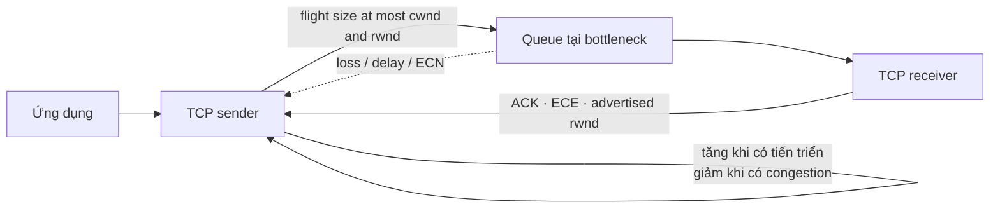
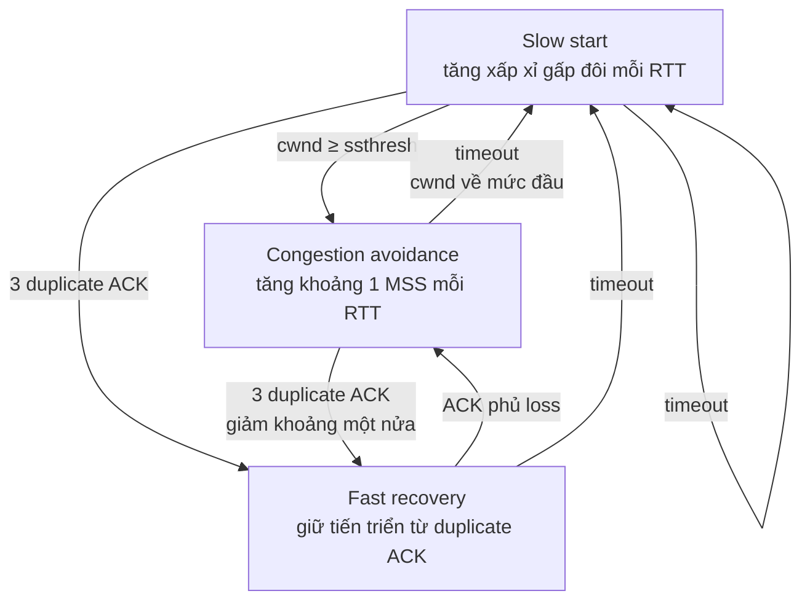

# TCP congestion control: AIMD, ECN và fairness

> [!abstract] Câu hỏi trung tâm
> Sender không biết trước dung lượng khả dụng trên toàn đường đi. Gửi quá chậm làm lãng phí link; gửi quá nhanh làm queue tăng, packet bị loại và công sức chuyển tiếp bị đốt vào retransmission. Congestion control là vòng phản hồi giúp sender thăm dò giới hạn ấy bằng ACK, loss, delay hoặc tín hiệu từ mạng, rồi điều chỉnh lượng dữ liệu chưa được xác nhận đang nằm trên đường.

## Mô hình tổng quát



`rwnd` và `cwnd` cùng giới hạn sender nhưng bảo vệ hai tài nguyên khác nhau. `rwnd` phản ánh chỗ trống trong receive buffer; `cwnd` phản ánh mức tải sender đang cho phép mình đặt lên đường mạng. Lượng dữ liệu chưa ACK bị chặn bởi giới hạn nhỏ hơn:

$$
LastByteSent - LastByteAcked \le \min(cwnd, rwnd)
$$

> [!source-fact]
> Quan hệ giữa `cwnd`, `rwnd`, lượng dữ liệu chưa ACK và tốc độ xấp xỉ `cwnd/RTT` nằm tại §3.7.1, trang in 293-295.

## 1. Congestion khác loss recovery ở mục tiêu

Retransmission sửa hậu quả cục bộ: một segment nghi bị mất được gửi lại. Congestion control tác động vào nguyên nhân hệ thống: quá nhiều nguồn cùng đưa traffic vào mạng với tốc độ vượt khả năng phục vụ. Nếu mọi sender chỉ retransmit mà không giảm offered load, retransmission lại chiếm link và queue, khiến tình trạng nặng hơn.

Cần tách ba đại lượng:

- `λ_in`: tốc độ dữ liệu gốc application đưa vào transport;
- `λ'_in`: offered load vào mạng, gồm dữ liệu gốc và dữ liệu retransmitted;
- `λ_out`: tốc độ dữ liệu hữu ích tới receiver, gần với goodput trong cách dùng vận hành.

Khi không có retransmission, `λ_in = λ'_in`. Dưới loss hoặc timeout giả, `λ'_in` có thể lớn hơn nhiều `λ_in` trong khi `λ_out` không tăng tương ứng.

> [!source-fact]
> Phân biệt dữ liệu gốc, offered load và throughput nhận được được xây dựng trong ba scenario tại §3.6.1, trang in 285-292.

## 2. Scenario 1: buffer vô hạn vẫn không cứu được latency

Hai connection chia sẻ một outgoing link dung lượng `R`; mỗi connection đưa traffic với tốc độ `λ_in`. Router được giả định có buffer vô hạn, không có loss recovery, flow control hay congestion control.

Khi mỗi sender gửi dưới `R/2`, throughput mỗi connection gần bằng tốc độ gửi. Khi tốc độ vượt `R/2`, throughput mỗi connection không thể vượt `R/2`. Link đã kín; tăng offered load chỉ làm queue dài hơn. Khi tổng arrival tiến sát service capacity, average queueing delay tăng mạnh. Trong mô hình lý tưởng với buffer vô hạn và tải duy trì vượt capacity, queue cùng average delay không bị chặn trên.

Kết luận đầu tiên: đạt utilization cao chưa đủ để gọi hệ thống khỏe. Throughput có thể chạm trần trong khi latency tăng tới mức không chấp nhận được.

> [!source-fact]
> Scenario hai sender, một router có infinite buffer, trần `R/2` và chi phí queueing delay nằm tại §3.6.1, trang in 286-287.

## 3. Scenario 2: buffer hữu hạn biến queue thành loss và retransmission

Thay buffer vô hạn bằng buffer hữu hạn, packet tới khi queue đầy sẽ bị drop. Transport đáng tin cậy gửi lại packet nghi mất, nên link bắt đầu chở cả dữ liệu gốc lẫn bản sao.

Ba mức giả định cho thấy ba loại chi phí:

1. Sender biết chính xác lúc router còn chỗ và chỉ gửi khi an toàn: không loss, không retransmission; đây là chuẩn so sánh phi thực tế.
2. Sender chỉ retransmit packet chắc chắn đã mất: một phần capacity được dùng để bù packet bị drop.
3. Sender timeout sớm khi packet gốc chỉ đang chờ lâu trong queue: cả bản gốc và bản gửi lại có thể tới receiver; một bản bị bỏ và capacity chuyển tiếp bản sao đã bị lãng phí.

Trong ví dụ của sách, khi offered load mỗi connection bằng `R/2`, trường hợp retransmit đúng loss cho throughput dữ liệu gốc khoảng `R/3`; phần còn lại là retransmission. Nếu mỗi packet trung bình bị forward hai lần, throughput tiến về `R/4` khi offered load tiến về `R/2`. Đây là kết quả của mô hình minh họa, không phải hằng số cho mọi mạng.

> [!source-fact]
> Finite-buffer loss, offered load và ba đường throughput của scenario 2 nằm tại §3.6.1, trang in 287-289.

## 4. Scenario 3: drop ở cuối path làm lãng phí mọi hop trước đó

Trong mạng multihop, một packet có thể đã tiêu tốn capacity ở nhiều upstream link rồi mới bị drop tại router sau. Khi tải cạnh tranh tăng rất cao, traffic của một connection có thể gần như không vượt qua bottleneck dù các router trước vẫn bận forward packet của nó. Throughput hữu ích khi ấy có thể giảm về gần zero trong mô hình, dù offered load tiếp tục tăng.

Đây là cơ chế congestion collapse trong ví dụ: thêm traffic không chỉ thất bại trong việc tăng goodput, nó còn làm goodput giảm vì queue, drop và retransmission chiếm tài nguyên. Chi phí của một packet bị drop ở hop sau bao gồm cả transmission capacity đã dùng ở mọi hop trước.

> [!source-fact]
> Scenario bốn sender, finite buffer, overlapping multihop path và wasted upstream work nằm tại §3.6.1, trang in 289-292.

## 5. Hai họ cơ chế phản hồi congestion

### End-to-end control

Network layer không gửi tín hiệu congestion bắt buộc cho transport. Endpoint suy ra tình trạng đường đi từ hiện tượng quan sát được như loss hoặc RTT tăng. Classic TCP coi timeout hoặc ba duplicate ACK là loss event và giảm window.

Ưu điểm là không đòi mọi router tham gia giao thức phản hồi. Đổi lại, tín hiệu mang tính gián tiếp: loss có thể do nguyên nhân khác congestion; chờ loss mới phản ứng có thể đã tạo queue và tốn retransmission.

### Network-assisted control

Router chủ động cung cấp thông tin. Tín hiệu có thể đi thẳng về sender, hoặc router đánh dấu packet đi tới receiver rồi receiver chuyển thông tin về sender. Đường đánh dấu qua receiver cần một vòng đi về để phản hồi tới nguồn.

> [!source-fact]
> Phân loại end-to-end/network-assisted và hai đường đưa feedback về sender nằm tại §3.6.2, trang in 292-293.

## 6. `cwnd` điều khiển flight size và send rate

Nếu bỏ qua giới hạn receiver để tập trung vào congestion, sender cho phép tối đa `cwnd` byte chưa ACK trên đường. Trong mô hình đơn giản, đầu mỗi RTT sender đưa khoảng `cwnd` byte ra, cuối RTT nhận ACK; tốc độ xấp xỉ:

$$
rate \approx \frac{cwnd}{RTT}
$$

Đây không phải phép đo throughput chính xác trong mọi trace. Delayed ACK, pacing, application-limited sender, loss, variable RTT, offload và scheduler đều có thể làm quan hệ tức thời khác đi. Công thức cho mental model về cách window và RTT cùng giới hạn tốc độ.

ACK của dữ liệu mới vừa giải phóng flight size, vừa cho sender bằng chứng rằng đường đi còn chuyển được traffic. Window tăng theo ACK nên TCP thường được gọi là self-clocking. ACK về chậm thì nhịp tăng cũng chậm.

> [!source-fact]
> `cwnd`, rate xấp xỉ, loss event và ACK clocking được trình bày tại §3.7.1, trang in 293-295.

## 7. Ba nguyên tắc của classic TCP

1. Loss event là dấu hiệu cần giảm tốc độ. Timeout và ba duplicate ACK đều thuộc nhóm này, nhưng mức phản ứng có thể khác.
2. ACK mới cho thấy byte đã được chuyển tới receiver, cho phép tăng window.
3. Sender liên tục probe bandwidth: tăng cho tới khi gặp congestion, giảm rồi thăm dò lại.

Mỗi sender quyết định từ state và feedback cục bộ, không cần điều phối trực tiếp với mọi flow khác. Kết quả tập thể phụ thuộc thuật toán tăng/giảm và điều kiện chia sẻ bottleneck.

> [!source-fact]
> Ba nguyên tắc loss, ACK và bandwidth probing được nêu tại §3.7.1, trang in 295-296.

## 8. Slow start tăng theo cấp số nhân

Theo classic TCP được sách mô tả, `cwnd` khởi đầu ở một giá trị nhỏ; ví dụ lịch sử dùng `1 MSS`. Mỗi ACK mới làm `cwnd` tăng thêm `1 MSS`. Một window gửi một segment tạo một ACK, rồi window thành hai; hai segment tạo hai ACK, window thành bốn. Nếu không có giới hạn khác, `cwnd` xấp xỉ nhân đôi mỗi RTT.

Tên slow start nói về việc bắt đầu thận trọng so với gửi ngay một window lớn, chứ không mô tả tốc độ tăng. Tăng theo cấp số nhân là pha nhanh nhất trong ba pha classic.

Slow start kết thúc theo ba đường chính:

- timeout: đặt `ssthresh` về khoảng một nửa `cwnd` tại lúc loss, thu `cwnd` về giá trị khởi đầu trong mô hình rồi chạy slow start lại;
- `cwnd` chạm `ssthresh`: chuyển sang congestion avoidance;
- ba duplicate ACK: fast retransmit và đi vào fast recovery nếu implementation dùng cơ chế này.

> [!source-fact]
> Cách tăng slow start, ba điều kiện rời pha và `ssthresh` nằm tại §3.7.1, trang in 296-298.

> [!uncertainty]
> `cwnd=1 MSS` là mô hình/khuyến nghị lịch sử mà sách dùng để dạy thuật toán. Initial window của stack hiện hành có thể khác; phải kiểm RFC và implementation đúng phiên bản trước khi dùng làm baseline.

## 9. Congestion avoidance dùng additive increase

Khi `cwnd` đã gần vùng từng gây congestion, sender tăng thận trọng hơn: tổng cộng khoảng `1 MSS` mỗi RTT. Một cách triển khai được sách nêu là, với mỗi ACK mới:

$$
cwnd \leftarrow cwnd + MSS \times \frac{MSS}{cwnd}
$$

Nếu window đang chứa mười MSS và mỗi segment tạo một ACK, mỗi ACK tăng khoảng `1/10 MSS`; hết một RTT tổng tăng gần `1 MSS`. Delayed ACK hoặc implementation khác có thể thay chi tiết. Mô hình cần giữ đặc tính tăng cộng theo từng vòng.

Khi timeout, phản ứng mạnh: `ssthresh` lấy một nửa window tại loss, `cwnd` quay về mức khởi đầu và sender vào slow start. Khi ba duplicate ACK xuất hiện, đường Reno giảm ít cực đoan hơn và chuyển fast recovery.

> [!source-fact]
> Congestion-avoidance increment, timeout response và triple-duplicate-ACK response nằm tại §3.7.1, trang in 297-299.

## 10. Fast recovery giữ lại bằng chứng rằng path vẫn tiến triển

Ba duplicate ACK cho thấy một khoảng trống, đồng thời cho thấy một số segment sau khoảng trống vẫn đến receiver. Reno vì thế không hành xử giống timeout hoàn toàn. Trong FSM của sách, sender đặt `ssthresh` bằng một nửa window tại loss, đặt `cwnd = ssthresh + 3 MSS`, retransmit segment thiếu và tăng thêm `1 MSS` cho mỗi duplicate ACK tiếp theo. Khi ACK phủ segment thiếu tới, `cwnd` được deflate về threshold và sender trở lại congestion avoidance.

Nếu timeout xảy ra trong fast recovery, sender quay lại slow start với phản ứng mạnh. TCP Tahoe cũ đưa `cwnd` về `1 MSS` sau cả timeout lẫn triple duplicate ACK; TCP Reno thêm fast recovery để tránh reset mạnh như vậy khi ACK vẫn chứng tỏ đường đi đang chuyển dữ liệu.

> [!source-fact]
> FSM, fast recovery và so sánh Tahoe/Reno nằm tại §3.7.1, trang in 298-301.

## 11. AIMD tạo đường răng cưa

Bỏ qua slow start ban đầu và xét loss được phát hiện bằng ba duplicate ACK, Reno có hai chuyển động:

- additive increase: tăng khoảng `1 MSS` mỗi RTT;
- multiplicative decrease: giảm `cwnd` còn khoảng một nửa khi có loss event.

Window tăng tuyến tính, rơi xuống theo tỷ lệ rồi tăng lại, tạo đồ thị răng cưa. Sender không biết sẵn ngưỡng congestion; mỗi chu kỳ vừa khai thác vừa thăm dò xem giới hạn có thay đổi không.



> [!source-fact]
> AIMD và saw-tooth behavior được tổng kết tại §3.7.1, trang in 300-301.

## 12. CUBIC thay cách probe trong congestion avoidance

Reno cắt window rồi tăng tuyến tính, có thể quay lại vùng trước loss khá chậm. CUBIC ghi `Wmax`, kích thước window lúc loss gần nhất, và chọn thời điểm tương lai `K` mà window dự kiến chạm lại `Wmax` nếu không có loss. Mức tăng phụ thuộc dạng bậc ba theo khoảng cách thời gian tới `K`:

- còn xa `K`: tăng nhanh để quay gần operating point cũ;
- gần `K`: tăng chậm, thăm dò thận trọng quanh ngưỡng từng gây loss;
- vượt `K`: mức tăng lại lớn dần để tìm operating point mới nếu capacity đã thay đổi.

Trong phạm vi sách, slow start và fast recovery vẫn giữ; khác biệt tập trung ở congestion avoidance. Nguồn mô tả trực giác và tham số, không cung cấp đủ cơ sở để tự cấu hình CUBIC production.

> [!source-fact]
> `Wmax`, `K` và cách CUBIC thay congestion avoidance được mô tả tại §3.7.1, trang in 301-303.

> [!uncertainty]
> Các câu về tỷ lệ web server dùng CUBIC dựa trên đo lường năm 2014, còn mô tả BBR dẫn triển khai năm 2016. Đây là lịch sử trong nguồn 2022; note không dùng chúng để khẳng định thị phần hay mặc định hệ điều hành năm 2026.

## 13. Mô hình throughput Reno và giới hạn của nó

Gọi `W` là window tại lúc loss, giả định RTT cùng `W` gần như ổn định, bỏ qua slow start sau timeout. Trong chu kỳ AIMD, rate dao động từ:

$$
\frac{W}{2RTT}
$$

tới:

$$
\frac{W}{RTT}
$$

Do tăng tuyến tính giữa hai mức, average throughput được mô hình hóa:

$$
average\ throughput \approx \frac{0.75W}{RTT}
$$

Đây là mô hình vĩ mô lý tưởng cho long-lived Reno flow. Không dùng trực tiếp cho short flow, changing RTT, frequent timeout, application-limited traffic, CUBIC/BBR hay network có shaping/policing phức tạp.

> [!source-fact]
> Phép xấp xỉ throughput Reno, cùng các giả định đi kèm, nằm tại §3.7.1, trang in 303.

## 14. ECN báo congestion trước khi router buộc phải drop

Explicit Congestion Notification phối hợp IP và TCP:

1. endpoint công bố khả năng ECN qua các bit liên quan trong IP;
2. router thấy congestion đánh dấu IP datagram thay vì nhất thiết drop nó;
3. receiver thấy dấu congestion, đặt `ECE` trong TCP ACK;
4. sender phản ứng bằng cách giảm congestion window và đặt `CWR` ở segment tiếp theo để báo đã giảm.

Trong mô tả của sách, sender giảm window như phản ứng với loss được xử lý bằng fast retransmit. RFC 3168 không ấn định một ngưỡng phổ quát để router gọi là congested; vendor và network operator quyết định policy đánh dấu. Vì thế thấy ECN mark chỉ có ý nghĩa khi biết cấu hình queue/AQM tại hop.

> [!source-fact]
> ECN bits, đường `router → receiver → ECE → sender → CWR` và phạm vi quyết định của operator nằm tại §3.7.2, trang in 304-305.

## 15. Delay-based control tìm congestion trước loss

TCP Vegas theo dõi RTT của các packet được ACK và giữ `RTTmin`, đại diện cho lúc path ít queue. Với window hiện tại, throughput kỳ vọng khi gần như không queue là:

$$
expected\ rate = \frac{cwnd}{RTTmin}
$$

Nếu throughput đo được gần mức này, sender có thể tăng. Nếu throughput thực giảm đáng kể so với mức kỳ vọng, queue có khả năng đang tích tụ và sender giảm rate trước khi buffer tràn.

Mental model là giữ bottleneck bận nhưng không đổ thêm dữ liệu chỉ để xây queue. Tuy vậy, `RTTmin` không phải hằng số vĩnh viễn: route, access network, radio scheduling và clock/capture effects có thể thay đổi baseline. Cạnh tranh giữa delay-based và loss-based flow cũng cần thuật toán cụ thể giải quyết; sách nhắc BBR, TIMELY, Compound TCP và FAST nhưng không cung cấp triển khai đầy đủ.

> [!source-fact]
> Vegas, `RTTmin`, expected throughput và trực giác tránh queue trước loss nằm tại §3.7.2, trang in 305-306.

## 16. Fairness chỉ đúng dưới một tập giả định

Với `K` TCP connection đi qua cùng bottleneck link dung lượng `R`, định nghĩa fairness lý tưởng của sách cho mỗi connection average rate xấp xỉ:

$$
\frac{R}{K}
$$

Lập luận AIMD cho hai flow giả định cùng MSS, cùng RTT, luôn có data, không có flow/UDP khác và đều ở congestion avoidance. Additive increase làm hai rate cùng tiến một lượng; multiplicative decrease kéo cả hai theo tỷ lệ về phía gốc. Lặp lại có xu hướng đưa operating point về giao giữa full utilization và equal-share line.

Đây là fairness theo connection, chưa phải fairness theo user, process, tenant hay business priority. Khi RTT khác nhau, flow có RTT nhỏ nhận ACK nhanh hơn và mở window nhanh hơn; sách nêu nó có thể lấy phần bandwidth lớn hơn.

> [!source-fact]
> Định nghĩa `R/K`, đồ thị hội tụ AIMD và RTT unfairness nằm tại §3.7.3, trang in 306-308.

## 17. UDP và parallel connections làm vỡ equal-share story

UDP không có congestion control tích hợp như TCP. Một application dùng UDP có thể tiếp tục đẩy ở tốc độ riêng khi TCP flow giảm theo loss, qua đó lấn traffic TCP. Điều này không có nghĩa mọi application UDP đều gây hại: application hoặc transport xây trên UDP vẫn có thể tự triển khai congestion control. Phạm vi source chỉ nhấn mạnh UDP tự thân không áp đặt vòng điều khiển ấy.

TCP application cũng có thể mở nhiều connection song song. Nếu bottleneck chia gần công bằng theo connection, application có nhiều connection nhận tổng phần lớn hơn. Ví dụ sách cho chín application mỗi bên một connection; application thứ mười nếu mở mười một connection có thể nhận hơn nửa link. Con số thuộc scenario minh họa với giả định equal connection share.

> [!source-fact]
> UDP crowd-out và parallel TCP connection làm lệch fairness theo application nằm tại cuối §3.7.3, trang in 308-309.

## 18. Đọc packet trace và metric congestion control

Một trace hữu ích cần ghép packet với socket/kernel metrics. Chỉ nhìn cờ retransmission trong Wireshark không cho biết `cwnd`, pacing state hoặc queue ở router.

### Trình tự đọc

1. Xác định endpoint, capture point, TCP variant và thời gian bắt.
2. Ghi MSS, RTT samples, ACK progression, duplicate ACK, retransmission và ECN flags.
3. Tách receiver limit (`rwnd`) khỏi sender/network limit (`cwnd`, delivery rate, bytes in flight).
4. Xác định loss được phát hiện bằng timeout hay duplicate ACK; hai đường có phản ứng khác nhau.
5. Quan sát window/rate theo nhiều RTT, tránh suy luận pha thuật toán từ một packet.
6. Đối chiếu interface queue/drop, AQM/ECN counter, host CPU và application send rate.
7. Phân biệt throughput trên wire với goodput của dữ liệu gốc.
8. Lặp ở phía trước và sau proxy/load balancer vì mỗi TCP leg có vòng congestion riêng.

### Bảng bằng chứng

| Câu hỏi | Packet trace | Host/socket metric | Network metric |
|---|---|---|---|
| Receiver có chặn sender? | Advertised window/zero window | receive buffer, app read rate | Không quyết định |
| Path có loss? | gap, dup ACK, retransmission | retrans/RTO counter | drop counter theo queue/interface |
| Queue đang tích tụ? | RTT tăng theo thời gian | smoothed RTT, delivery rate | queue depth/delay, ECN mark |
| Sender đang application-limited? | khoảng trống dù ACK/window cho phép | app write rate, bytes in flight | link còn capacity |
| ECN có hoạt động? | ECN negotiation, CE/ECE/CWR | ECN counters/state | AQM marking policy/counter |

> [!inference]
> Quy trình trên là tổng hợp chẩn đoán từ cơ chế trong §§3.6-3.7. Sách giải thích nguyên lý nhưng không đưa một runbook production hoàn chỉnh.

## 19. Những failure pattern dễ chẩn đoán nhầm

| Hiện tượng | Các khả năng cần phân biệt | Bằng chứng quyết định |
|---|---|---|
| RTT tăng nhưng chưa loss | queue buildup, endpoint scheduling, route change | RTT theo hop/endpoint, queue delay, CPU, route |
| Retransmission tăng dưới tải | bottleneck drop, wireless loss, capture loss | trace hai điểm, drop counters, link telemetry |
| Throughput thấp với `rwnd` lớn | `cwnd`, RTT, loss, app-limited, shaping | bytes in flight, delivery rate, app writes, policer |
| `rwnd=0` | receiver/app không đọc kịp | advertised window, receive buffer, process state |
| ECN mark nhưng không giảm rate | negotiation/feedback/algorithm/config lỗi | CE, ECE, CWR và host CC state |
| Nhiều connection nhanh hơn một | per-connection sharing, slow start, path scheduling | số connection, aggregate rate, RTT/MSS từng flow |
| Offered load tăng, goodput giảm | duplicate work và congestion collapse | original bytes, retrans bytes, drop, link utilization |

## 20. Áp dụng khi điều kiện thay đổi

### Short flow

Flow kết thúc trong vài RTT có thể dành phần lớn đời sống ở handshake và slow start. Mô hình average Reno `0.75W/RTT` của long-lived flow không phù hợp. Cần xem initial window, response size, handshake, loss sớm và connection reuse.

### High-bandwidth, high-RTT path

Bandwidth-delay product lớn đòi nhiều bytes in flight để lấp đầy path. Additive increase của Reno có thể phục hồi chậm sau khi giảm window. Việc chọn CUBIC/BBR hay tuning đòi tài liệu implementation và thử nghiệm trên workload/path thật, không thể suy ra chỉ từ overview của sách.

### Receiver chậm

Nếu `rwnd < cwnd`, flow control chi phối. Tuning congestion algorithm sẽ không giải quyết application đọc socket chậm. Cần kiểm receive buffer, consumer scheduling và backpressure ở application.

### Sender không có đủ dữ liệu

Nếu application không đưa đủ byte, bytes in flight thấp hơn `cwnd` không chứng minh congestion control hạn chế rate. Cần gắn application write cadence với ACK và window.

### Qua proxy hoặc TCP splitting

Proxy chấm dứt connection tạo hai TCP connection độc lập, mỗi leg có RTT, loss và congestion state riêng. Tối ưu leg client-proxy không tự chứng minh leg proxy-origin khỏe.

## 21. Những cách hiểu sai thường gặp

| Cách hiểu sai | Cách đọc đúng |
|---|---|
| Congestion control và flow control là một | `cwnd` bảo vệ path; `rwnd` bảo vệ receive buffer |
| Buffer càng lớn thì congestion càng hết | Buffer lớn có thể tránh drop tạm thời nhưng làm queueing delay tăng |
| Loss recovery giải quyết congestion | Retransmission sửa gap; không giảm nguyên nhân nếu offered load giữ nguyên |
| Slow start tăng chậm | Window tăng xấp xỉ theo cấp số nhân mỗi RTT trong mô hình |
| Mọi loss đều chứng minh congestion | Classic TCP dùng loss làm tín hiệu; root cause vật lý vẫn cần bằng chứng |
| Ba duplicate ACK và timeout giống nhau | Chúng dẫn tới mức phản ứng khác trong Reno |
| ACK tới nghĩa là tăng rate luôn an toàn | ACK là feedback cục bộ; sender vẫn có thể sắp chạm bottleneck |
| ECN tự xác định cùng một ngưỡng ở mọi router | Marking policy phụ thuộc cấu hình/vendor/operator |
| AIMD bảo đảm công bằng cho mọi user | Lập luận lý tưởng là theo connection với cùng RTT/MSS và nhiều giả định |
| UDP luôn không có congestion control | UDP không tích hợp sẵn; application/protocol phía trên có thể bổ sung |
| Nhiều parallel connection tạo thêm capacity | Chúng thay cách chia phần tại bottleneck, không tăng capacity vật lý |

## 22. Giới hạn của nguồn và của chương

Chỉ dựa vào §§3.6-3.7 chưa thể:

- xác định congestion-control algorithm mặc định của một kernel năm 2026;
- chọn CUBIC, BBR, DCTCP hoặc thuật toán khác cho production workload;
- đưa ra ngưỡng queue/AQM/ECN cho router, cloud load balancer hay data center fabric;
- giải thích đầy đủ pacing, SACK interaction, RACK/TLP, offload và modern loss detection;
- phân biệt network loss, wireless corruption và capture loss khi thiếu telemetry đa điểm;
- suy ra fairness giữa tenant/application từ fairness theo TCP connection;
- áp dụng công thức Reno lý tưởng cho short flow hoặc RTT/W biến thiên mạnh;
- xác nhận market share/triển khai hiện hành từ số liệu 2014-2016 được sách dẫn;
- thay packet lab thật bằng sơ đồ hoặc công thức.

## 23. Câu hỏi ôn tập

1. `λ_in`, `λ'_in` và `λ_out` tách dữ liệu gốc, offered load và goodput ra sao?
2. Vì sao buffer vô hạn vẫn tạo kết quả xấu dù không drop packet?
3. Drop ở hop cuối làm lãng phí những tài nguyên upstream nào?
4. `min(cwnd, rwnd)` cho biết bottleneck ở receiver hay network bằng cách nào?
5. Slow start, congestion avoidance và fast recovery tăng/giảm window khác nhau ra sao?
6. Timeout và ba duplicate ACK cung cấp bằng chứng khác nhau thế nào?
7. CUBIC dùng `Wmax` và `K` để probe quanh operating point cũ ra sao?
8. Công thức `0.75W/RTT` dựa trên những giả định nào?
9. ECN truyền tín hiệu qua CE/ECE/CWR theo chuỗi nào?
10. Vì sao `RTTmin` hữu ích cho delay-based control nhưng có thể trở thành baseline cũ?
11. Những giả định nào cần đúng để AIMD hội tụ gần `R/K`?
12. Vì sao fairness theo connection có thể bất công theo application?

## 24. Liên kết chương trình

- Nguồn: [[SRC-KUROSE-ROSS-NETWORKING-8E]].
- Bài liên quan trực tiếp: `DE-L079`, `DE-L086`.
- Bài dùng làm nền: `DE-L082`, `DE-L083`, `DE-L087`, `DE-L088`.
- Liên quan: [[TCP Reliability RTT RTO and Flow Control|TCP reliability RTT RTO và flow control]], [[Packet-Switched Network Delay Loss and Throughput|Độ trễ mất gói và thông lượng trong mạng chuyển mạch gói]], [[HTTP Requests Connection State and Caching|HTTP request connection state và cache]].
- Chủ đề cần nguồn bổ sung: Linux TCP metrics/algorithms hiện hành, packet lab thật, AQM/ECN, BBR, pacing, timeout budget và retry amplification ở application.

## Source coverage

| Source slice | Nội dung phải giữ | Vị trí trong note | Trạng thái |
|---|---|---|---|
| [[SRC-KUROSE-ROSS-NETWORKING-8E]], §§3.6.1-3.6.2 | nguyên nhân, chi phí congestion và hai họ control | §§1-5 | Đã trình bày ba scenario và tín hiệu phản hồi |
| [[SRC-KUROSE-ROSS-NETWORKING-8E]], §§3.7.1-3.7.2 | classic TCP, `cwnd`, slow start, congestion avoidance và fast recovery | §§6-12 | Đã trình bày theo vòng điều khiển và AIMD |
| [[SRC-KUROSE-ROSS-NETWORKING-8E]], §3.7.3 | throughput và fairness | §§13, 16-17 | Đã trình bày cùng giả định làm equal-share story bị phá vỡ |
| [[SRC-KUROSE-ROSS-NETWORKING-8E]], §§3.7.4-3.7.5 | ECN và delay-based control | §§14-15 | Đã trình bày tín hiệu, phản ứng và giới hạn baseline RTT |

BBR, pacing và Linux implementation hiện hành không thuộc lát nguồn; note ghi rõ cần nguồn bổ sung trước khi chuyển thành hướng dẫn cấu hình production.

## Key takeaways
- Congestion control giới hạn lượng dữ liệu sender đưa vào mạng theo tín hiệu về capacity dùng chung; nó khác flow control, vốn bảo vệ buffer của receiver.
- `cwnd` cùng RTT giới hạn flight size và tốc độ gửi. Slow start dò capacity nhanh, congestion avoidance tăng thận trọng hơn, còn loss hoặc ECN buộc thuật toán giảm tải.
- AIMD tạo hội tụ gần công bằng trong một mô hình giả định hẹp; nhiều connection, RTT khác nhau, UDP traffic và thuật toán khác nhau làm thay đổi kết quả.
- Buffer lớn có thể giảm drop nhưng tăng queueing delay. Loss, ECN và delay là các tín hiệu khác nhau về congestion và không nên được đọc tách khỏi tải.
- Packet trace cần được ghép với `cwnd`, retransmission, RTT, queue và application latency; một đồ thị throughput riêng lẻ không xác định được nguyên nhân.

## Reference
1. James F. Kurose, Keith W. Ross, *Computer Networking: A Top-Down Approach*, Eighth Global Edition, Pearson, 2022, §§3.6-3.7, printed pp. 285-309 up to the §3.8 heading, PDF pp. 287-311.
2. Hồ sơ nguồn: [[SRC-KUROSE-ROSS-NETWORKING-8E]].
3. Source note: `Material/DE/Reference/Library/Source-Notes/PACK-OS_NETWORK-BOOK-03.md`.

## Lịch sử biên tập

| Ngày | Trạng thái | Nội dung |
|---|---|---|
| 2026-09-27 | `review` | Đọc trực tiếp §§3.6-3.7; giữ giả định và công thức; tách dữ kiện lịch sử; bổ sung runbook đọc trace; biên tập Humanizer tiếng Việt |

<!-- ATOMIC-EXECUTION-CAPSULE:START -->

## Execution capsule: kiểm chứng `wiki.network.tcp-congestion-control-aimd-ecn-fairness`

> [!important] Phân loại mệnh đề
> Với `wiki.network.tcp-congestion-control-aimd-ecn-fairness`, sơ đồ, ví dụ và artifact về **TCP congestion control: AIMD, ECN và fairness** là **synthesis để kiểm chứng**; chúng không phải trích dẫn hay case nguyên văn của nguồn.

### Artifact thực thi tối thiểu

```yaml
concept_id: "wiki.network.tcp-congestion-control-aimd-ecn-fairness"
concept: "TCP congestion control: AIMD, ECN và fairness"
primary_question: "TCP nhận biết giới hạn của đường mạng và điều chỉnh lượng dữ liệu đang bay như thế nào để tránh congestion collapse nhưng vẫn khai thác được băng thôn"
decision_contract:
  input_boundary: "Ghi population, thời điểm, owner và điều chưa biết"
  hard_constraints:
    - "Không vượt quyền hoặc privacy boundary"
    - "Không dùng cùng một assumption làm cả implementation và oracle"
  accept_when: "Có observation phân biệt được các lựa chọn"
  reversal_trigger: "Một hard constraint sai hoặc evidence mới đổi recommendation"
evidence_to_keep:
  - "input snapshot"
  - "chosen and rejected options"
  - "independent review result"
```

Artifact của `wiki.network.tcp-congestion-control-aimd-ecn-fairness` buộc người dùng ghi boundary, oracle và reversal trigger cho **TCP congestion control: AIMD, ECN và fairness**. Các giá trị minh họa phải được thay bằng evidence thật trước khi dùng cho quyết định.

### Tự kiểm tra trước khi tái sử dụng

1. Bạn có thể trả lời `TCP nhận biết giới hạn của đường mạng và điều chỉnh lượng dữ liệu đang bay như thế nào để tránh congestion collapse nhưng vẫn khai thác được băng thông?` bằng một câu mà không kéo thêm concept thứ hai không?
2. Source locator nào đỡ cho claim, và phần nào chỉ là synthesis trong note?
3. Observation nào khiến bạn dừng, thu hẹp hoặc đảo quyết định?
4. Artifact nào cho phép một reviewer độc lập tái hiện kết quả?

<!-- ATOMIC-EXECUTION-CAPSULE:END -->
