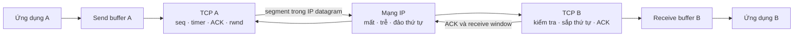
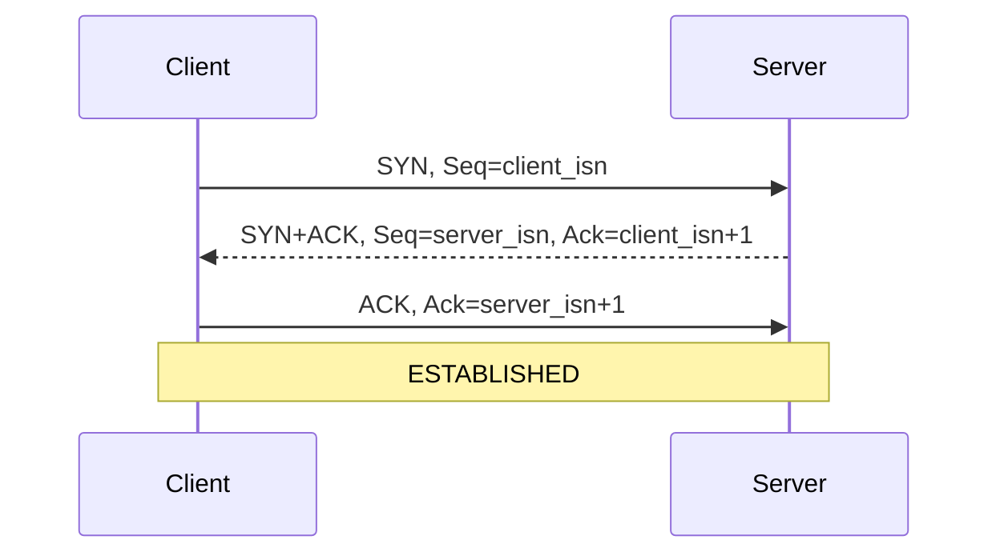

# TCP reliability, RTT/RTO và flow control

> [!abstract] Câu hỏi trung tâm
> IP có thể làm mất, đảo thứ tự hoặc làm hỏng datagram. TCP che phần bất định ấy khỏi ứng dụng bằng một máy trạng thái ở hai đầu: mỗi byte được đánh số, dữ liệu nhận đúng thứ tự được xác nhận, dữ liệu nghi mất được truyền lại, còn tốc độ gửi bị giới hạn theo khả năng nhận. Muốn đọc đúng một packet trace phải theo dõi cả hai chiều và tiến trình của các biến trạng thái, thay vì nhìn từng gói độc lập.

## Mô hình tổng quát

TCP cung cấp một byte stream hai chiều giữa hai socket. Mỗi phía vừa có send buffer vừa có receive buffer; TCP chia byte stream thành segment, giao segment cho IP và lắp lại dữ liệu ở đầu kia.



Connection TCP là trạng thái logic tại hai endpoint. Router trung gian chuyển IP datagram và không giữ trạng thái connection TCP theo mô hình cơ bản của sách. Vì vậy, một connection đã `ESTABLISHED` ở client vẫn có thể gặp middlebox, route hoặc peer failure mà trạng thái cục bộ chưa phản ánh ngay.

> [!source-fact]
> Connection TCP, socket endpoint, send/receive buffer, full-duplex và point-to-point được trình bày tại §3.5-§3.5.1, trang in 257-260.

## 1. Hợp đồng TCP nhìn từ ứng dụng

### Byte stream, không phải chuỗi message

Ứng dụng ghi một dãy byte vào socket. TCP không bảo toàn ranh giới giữa các lần `write` hay giữa các segment trên mạng. Một lần đọc có thể nhận ít hơn, đúng bằng hoặc gom dữ liệu từ nhiều lần ghi, tùy byte nào đã tới và buffer có bao nhiêu chỗ.

Vì vậy giao thức ứng dụng cần tự đóng khung: độ dài ở header, delimiter có escaping, hoặc một định dạng tự mô tả với quy tắc parser rõ ràng. Kích thước packet không phải message boundary.

### Full-duplex và point-to-point

Mỗi phía có thể gửi và nhận đồng thời trên cùng connection. Sequence space và ACK được hiểu theo từng hướng. TCP connection nối đúng hai endpoint; nó không phải primitive multicast.

### Reliable delivery có phạm vi hữu hạn

Trong điều kiện connection tiếp tục hoạt động, TCP hướng tới việc đưa ra cho ứng dụng byte stream không hỏng, không hở, không lặp và đúng thứ tự. Lời bảo đảm này không cho biết application đã commit transaction hay chưa, không biến một operation thành idempotent, và không bảo đảm connection sẽ sống mãi.

> [!synthesis]
> TCP đã ACK là bằng chứng receiver TCP đã nhận byte tương ứng, chưa phải bằng chứng tiến trình ứng dụng đã đọc, parse hoặc commit chúng. Đây là ranh giới quan trọng khi điều tra request timeout.

## 2. Segment TCP mang những trạng thái nào

Một TCP segment gồm header và dữ liệu ứng dụng. Các trường cần đọc khi chẩn đoán:

| Trường | Ý nghĩa thực dụng |
|---|---|
| Source/Destination port | Ghép segment với endpoint và socket |
| Sequence number | Số thứ tự byte đầu tiên trong payload của segment |
| Acknowledgment number | Số thứ tự byte kế tiếp phía gửi ACK đang chờ |
| Header length | Xác định nơi payload bắt đầu |
| Receive window | Dung lượng receive buffer phía nhận đang quảng bá |
| Checksum | Phát hiện lỗi bit trên header và dữ liệu |
| Options | Có thể mang MSS và các khả năng thương lượng khác |
| SYN | Khởi tạo connection và sequence space |
| FIN | Phía gửi kết thúc hướng gửi của mình |
| RST | Reset/refuse connection hoặc báo segment không thuộc socket hợp lệ |
| ACK | Trường acknowledgment có hiệu lực |
| PSH/URG | Tín hiệu xử lý dữ liệu theo semantics tương ứng |
| ECE/CWR | Liên quan Explicit Congestion Notification |

MSS là lượng dữ liệu ứng dụng tối đa đặt trong một segment theo cách sách giới thiệu; nó không phải kích thước toàn bộ segment. TCP header và IP header còn chiếm chỗ trong MTU. Đồng nhất MSS với MTU dẫn tới tính sai payload và có thể che mất vấn đề fragmentation hay path MTU.

> [!source-fact]
> Cấu trúc segment, MSS/MTU, các flag và receive-window field nằm tại §3.5.1-§3.5.2, trang in 258-265.

## 3. Sequence number và cumulative ACK

### Sequence number đếm byte

Giả sử một segment có `Seq=92` và chở 8 byte. Các byte thuộc khoảng 92-99. Nếu receiver đã nhận đủ liên tục tới byte 99, nó gửi `ACK=100`: byte kế tiếp đang chờ là 100.

```text
Sender                                           Receiver
Seq=92, Len=8  ------------------------------->  nhận byte 92..99
                 <------------------------------ ACK=100
```

ACK không mang nghĩa tôi đã nhận riêng segment số 100. Nó xác nhận tích lũy toàn bộ byte liên tục trước số 100. Nếu ACK cho segment đầu bị mất nhưng `ACK=120` tới sau, sender biết receiver đã nhận liên tục tới byte 119 và không cần retransmit phần đã được bao phủ.

### Một khoảng trống giữ ACK đứng yên

Giả sử các segment bắt đầu ở 92, 100, 120; segment `Seq=100` mất nhưng `Seq=120` tới receiver. Byte 100 vẫn là byte kế tiếp bị thiếu, nên receiver lặp lại `ACK=100`. Các duplicate ACK báo rằng dữ liệu phía sau có tới nhưng một khoảng trống vẫn tồn tại.

Out-of-order arrival cũng có thể tạo duplicate ACK. Bởi vậy một duplicate ACK đơn lẻ chưa đủ để kết luận mất gói. Cơ chế fast retransmit trong mô hình sách chờ ba duplicate ACK cho cùng dữ liệu rồi mới truyền lại segment bắt đầu tại số ACK ấy.

> [!source-fact]
> Cách đánh số byte, ý nghĩa next expected byte, cumulative ACK và ví dụ Telnet nằm tại §3.5.2, trang in 263-265; các tình huống ACK mất nằm tại §3.5.4, trang in 270-273.

## 4. Ước lượng RTT: làm mượt cả mức và độ dao động

`SampleRTT` là thời gian từ lúc một segment được giao xuống IP tới khi ACK tương ứng trở về. TCP không nhất thiết đo mọi segment; sách mô tả cách thường dùng là theo dõi một sample tại một thời điểm. Segment đã retransmit không được dùng để tính sample, vì ACK quay về không cho biết nó xác nhận bản gửi đầu hay bản gửi lại.

Mức RTT điển hình được cập nhật bằng exponential weighted moving average:

$$
EstimatedRTT = (1-\alpha)EstimatedRTT + \alpha SampleRTT
$$

Với giá trị được sách dẫn từ RFC 6298:

$$
\alpha = 0.125
$$

Độ dao động được theo dõi bằng một EWMA khác:

$$
DevRTT = (1-\beta)DevRTT + \beta |SampleRTT-EstimatedRTT|
$$

với:

$$
\beta = 0.25
$$

Sample gần đây có trọng số lớn hơn sample cũ. `EstimatedRTT` tránh phản ứng quá mạnh với một lần đo bất thường; `DevRTT` giữ thông tin về độ nhiễu mà trung bình đơn thuần sẽ làm mất.

> [!source-fact]
> Định nghĩa `SampleRTT`, quy tắc bỏ sample của retransmission, EWMA và các hệ số nằm tại §3.5.3, trang in 265-267.

## 5. RTO phải vừa tránh báo mất giả, vừa phát hiện mất đủ sớm

Retransmission timeout được đặt cao hơn RTT ước lượng và cộng biên theo độ dao động:

$$
TimeoutInterval = EstimatedRTT + 4 \times DevRTT
$$

Nếu đặt quá thấp, ACK hợp lệ nhưng về chậm sẽ gây retransmission thừa. Nếu đặt quá cao, mất gói thật chỉ được sửa sau một khoảng chờ dài. Công thức dùng `DevRTT` để tăng biên khi đường truyền biến động.

Sách dẫn khuyến nghị giá trị khởi đầu một giây. Khi timeout xảy ra, khoảng timeout kế tiếp được nhân đôi. Backoff làm sender giảm nhịp retransmit khi mạng có thể đang congestion; sau một ACK/sample mới, timer lại được tính theo ước lượng cập nhật theo thủ tục được mô tả.

### Ví dụ tính

Nếu `EstimatedRTT = 100 ms` và `DevRTT = 20 ms`:

$$
RTO = 100 + 4 \times 20 = 180\ ms
$$

Nếu timer hết hạn, lần chờ kế tiếp theo ví dụ backoff sẽ là 360 ms. Con số chỉ minh họa công thức; giá trị thật còn phụ thuộc state và implementation.

### Vì sao retransmission tạo mơ hồ đo lường

Giả sử segment A được gửi, timeout rồi A được gửi lại. Một ACK xuất hiện sau đó có thể do bản đầu đến muộn hoặc bản sau đến nhanh. Gắn RTT cho một trong hai mà không có thêm thông tin sẽ làm lệch sample. Đó là lý do sách nêu quy tắc không lấy `SampleRTT` từ segment retransmitted.

> [!uncertainty]
> Note giữ thuật toán và tham số theo nguồn 2022/RFC mà nguồn trích dẫn. Giá trị timer, granularity, option và hành vi kernel cụ thể phải kiểm tài liệu hoặc source của đúng hệ điều hành đang vận hành.

## 6. Reliable transfer là phối hợp của checksum, ACK, timer và sequence space

IP chỉ cung cấp best-effort: datagram có thể mất, đảo thứ tự hoặc hỏng. TCP xây reliability ở hai endpoint bằng bốn nhóm cơ chế:

1. checksum phát hiện lỗi bit;
2. sequence number nhận biết vị trí, khoảng trống và dữ liệu lặp;
3. ACK phản hồi phần byte stream đã nhận liên tục;
4. timer và duplicate ACK kích hoạt retransmission.

Sách đơn giản hóa sender thành ba loại sự kiện:

```text
application đưa dữ liệu xuống
  → tạo segment tại NextSeqNum
  → khởi động timer nếu chưa chạy
  → gửi và tăng NextSeqNum theo số byte

timer hết hạn
  → gửi lại segment chưa ACK có sequence nhỏ nhất
  → khởi động lại timer

nhận ACK=y và y > SendBase
  → đặt SendBase=y
  → còn dữ liệu chưa ACK thì khởi động lại timer
```

`SendBase` là số thứ tự byte cũ nhất chưa được ACK. `NextSeqNum` là byte kế tiếp có thể đánh số cho dữ liệu mới. Dù có nhiều segment đang chờ ACK, thủ tục trong sách dùng một retransmission timer, có thể hình dung gắn với segment chưa ACK cũ nhất.

> [!source-fact]
> Mục tiêu byte stream không hỏng/không hở/không lặp/đúng thứ tự và sender một timer được trình bày tại §3.5.4, trang in 268-270.

## 7. Timeout retransmit và fast retransmit giải quyết hai tín hiệu khác nhau

### Timeout

Timeout là tín hiệu không nhận được tiến triển ACK trước deadline. Sender retransmit segment chưa ACK cũ nhất. Nguyên nhân có thể là data segment mất, ACK mất, delay quá lớn hoặc state/path bị gián đoạn; sender không thể phân biệt chắc chắn chỉ từ timer.

Nếu ACK bị mất nhưng một cumulative ACK lớn hơn về kịp, dữ liệu đã được bao phủ và retransmission có thể được tránh. Nếu receiver nhận lại byte đã có, sequence number giúp nó nhận ra duplicate và không đưa byte lặp lên ứng dụng.

### Fast retransmit

Khi một segment mất giữa dòng nhưng segment phía sau vẫn tới, receiver phát duplicate ACK cho byte đầu khoảng trống. Ba duplicate ACK trong thuật toán sách đóng vai trò tín hiệu mất sớm; sender truyền lại segment tại sequence number được ACK lặp mà không chờ RTO.

```text
Seq=92   ───────────────> nhận             <── ACK=100
Seq=100  ───────X        mất
Seq=120  ───────────────> thấy gap          <── ACK=100
Seq=135  ───────────────> vẫn có gap        <── ACK=100
Seq=141  ───────────────> vẫn có gap        <── ACK=100
                         ba duplicate ACK ⇒ retransmit Seq=100
```

Đếm packet TCP Retransmission trong công cụ phân tích chưa đủ để kết luận nguyên nhân. Cần kiểm ACK hai chiều, timing, out-of-order, capture point và khả năng packet capture tự mất gói.

> [!source-fact]
> Delayed ACK, duplicate ACK, ba duplicate ACK và fast retransmit nằm tại §3.5.4, trang in 273-275.

## 8. TCP gần GBN hay Selective Repeat?

Cumulative ACK làm TCP giống Go-Back-N ở một số mặt: sender theo dõi biên byte đã ACK và receiver không cần ACK riêng từng segment out-of-order trong mô hình cơ bản. Tuy vậy, nhiều implementation buffer segment out-of-order; cumulative ACK mới có thể loại nhu cầu gửi lại nhiều segment; selective acknowledgment cho phép báo rõ các dải đã nhận.

Sách vì thế mô tả error recovery của TCP phù hợp hơn như một dạng lai giữa GBN và Selective Repeat. Không nên ép packet trace hiện đại vào một nhãn GBN thuần rồi suy ra sender chắc chắn retransmit toàn bộ phần đuôi.

> [!source-fact]
> So sánh GBN/SR và selective acknowledgment nằm tại cuối §3.5.4, trang in 276.

## 9. Flow control bảo vệ receiver

Receiver TCP đặt dữ liệu đúng thứ tự vào receive buffer. Ứng dụng có thể đọc chậm hơn tốc độ byte tới. Nếu sender tiếp tục bơm dữ liệu, buffer có thể đầy. Flow control ghép tốc độ gửi với tốc độ ứng dụng phía nhận tiêu thụ buffer.

Gọi:

- `RcvBuffer`: kích thước receive buffer;
- `LastByteRead`: byte cuối ứng dụng đã đọc;
- `LastByteRcvd`: byte cuối đã tới và được đặt vào buffer.

Phần buffer đang dùng là:

$$
LastByteRcvd - LastByteRead
$$

Dung lượng còn trống được quảng bá bằng receive window:

$$
rwnd = RcvBuffer - (LastByteRcvd - LastByteRead)
$$

Sender giữ lượng dữ liệu chưa ACK trong giới hạn phía nhận quảng bá:

$$
LastByteSent - LastByteAcked \le rwnd
$$

`rwnd` thay đổi theo dữ liệu đến và nhịp application đọc buffer. Vì TCP full-duplex, mỗi hướng có receive window riêng.

### Zero window không được trở thành bế tắc vĩnh viễn

Khi receiver quảng bá `rwnd=0`, sender dừng dữ liệu thường. Nếu ứng dụng receiver sau đó đọc bớt buffer nhưng receiver không có data hay ACK mới để gửi, sender có thể không biết window đã mở. Sách mô tả việc sender tiếp tục gửi segment một byte khi window bằng 0 để nhận ACK mang giá trị window cập nhật.

Một zero-window episode gợi ý receiver/application không tiêu thụ kịp; nó không tự chứng minh network congestion.

> [!source-fact]
> Receive buffer, công thức `rwnd`, giới hạn dữ liệu chưa ACK và tình huống zero window nằm tại §3.5.5, trang in 276-278.

## 10. Flow control và congestion control phải tách nhau

| Cơ chế | Tài nguyên được bảo vệ | Tín hiệu chính | Biến đại diện |
|---|---|---|---|
| Flow control | Receive buffer và ứng dụng phía nhận | Dung lượng buffer quảng bá | `rwnd` |
| Congestion control | Đường mạng và queue trung gian | Loss/delay/ECN theo thuật toán | thường biểu diễn bằng `cwnd` |

Cả hai có thể làm sender chậm lại nên bề ngoài dễ lẫn. Nếu `rwnd` co về 0, ưu tiên kiểm receiver buffer, tốc độ application đọc và scheduler phía nhận. Nếu retransmission, RTT và queue/drop cùng tăng dưới tải, cần điều tra congestion. Trong thực tế, lượng dữ liệu được phép bay còn chịu cả hai giới hạn cùng các ràng buộc implementation.

> [!source-fact]
> Sách nhấn mạnh flow control và congestion control có hành động giống nhau nhưng nguyên nhân khác nhau tại §3.5.5, trang in 276-277. Congestion control được dành cho §§3.6-3.7.

## 11. Three-way handshake thiết lập trạng thái hai phía

### Bước 1: SYN

Client chọn initial sequence number `client_isn`, gửi segment có `SYN=1`, không cần mang application data trong mô tả cơ bản, rồi đi vào `SYN_SENT`.

### Bước 2: SYNACK

Server nhận SYN, chọn `server_isn`, gửi `SYN=1`, `Seq=server_isn`, `ACK=client_isn+1`. Server ở `SYN_RCVD` trong tiến trình thông thường.

### Bước 3: ACK

Client gửi `ACK=server_isn+1`, `SYN=0`; segment thứ ba có thể mang client data. Sau khi handshake hoàn tất, hai phía có đủ sequence state để trao đổi dữ liệu.



Thấy SYN rời client chưa chứng minh connection được thiết lập. Thấy SYNACK ở server-side capture chưa chứng minh nó tới client. Bản bắt gói cần vị trí quan sát, hai chiều và timestamp.

> [!source-fact]
> Ba bước, initial sequence number và khả năng segment thứ ba mang dữ liệu nằm tại §3.5.6, trang in 279-280.

## 12. FIN, TIME_WAIT và RST biểu thị các tình huống khác nhau

### Đóng có trật tự bằng FIN

Một phía gửi `FIN` để kết thúc hướng gửi của mình; peer ACK rồi có thể gửi FIN cho hướng còn lại; FIN cuối được ACK. Hai hướng đóng riêng khiến teardown thường được nhìn như bốn segment, dù packet thực tế có thể gộp flag trong một số tiến trình.

Client chủ động đóng theo tiến trình sách đi qua:

```text
ESTABLISHED → FIN_WAIT_1 → FIN_WAIT_2 → TIME_WAIT → CLOSED
```

Server bị đóng theo tiến trình minh họa đi qua:

```text
ESTABLISHED → CLOSE_WAIT → LAST_ACK → CLOSED
```

`TIME_WAIT` cho phép phía chủ động đóng gửi lại ACK cuối nếu ACK đó mất. Thời gian là chi tiết implementation; các ví dụ trong sách gồm 30 giây, một phút hoặc hai phút. Nhiều socket `TIME_WAIT` vì thế là dấu vết lifecycle cần giải thích theo workload, chưa đủ để gọi là memory leak.

`CLOSE_WAIT` kéo dài thường đáng kiểm ở phía ứng dụng: kernel đã nhận FIN từ peer và chờ local process đóng socket. Đây là suy luận vận hành cần xác minh bằng socket owner và code path.

### Reset bằng RST

Nếu host nhận segment không khớp socket đang tồn tại, ví dụ SYN tới port TCP không được listen, nó có thể trả RST. RST là bằng chứng reset/refusal ở tầng TCP, khác với HTTP error response và khác với timeout không có phản hồi.

> [!source-fact]
> FIN exchange, state transitions, mục đích TIME_WAIT và RST cho port không mở nằm tại §3.5.6, trang in 281-283.

## 13. SYN flood và giới hạn của mô tả phòng vệ

Handshake truyền thống có thể buộc server giữ trạng thái half-open sau SYN trong khi chờ ACK cuối. Kẻ tấn công gửi nhiều SYN mà không hoàn tất handshake có thể tiêu tốn tài nguyên này. Sách giải thích SYN cookies như cách tạo initial sequence number từ thông tin connection và secret, trì hoãn cấp trạng thái cho đến khi ACK hợp lệ quay lại.

Đây là mô hình nguyên lý hữu ích, không phải hướng dẫn cấu hình bảo mật năm 2026. Việc bật, ngưỡng kích hoạt, giới hạn option và telemetry của SYN cookies cần tài liệu kernel/load balancer đang dùng.

> [!source-fact]
> SYN flood và mô hình SYN cookies nằm trong sidebar cuối §3.5.6, trang in 284.

## 14. Cách đọc một TCP packet trace

### Chuẩn bị bảng trạng thái theo từng hướng

| Thời điểm | Hướng | Flags | Seq | Len | Ack | Window | Diễn giải có bằng chứng |
|---|---|---:|---:|---:|---:|---:|---|
| t0 | C→S | SYN | x | 0 |: | w1 | Client đề nghị mở connection |
| t1 | S→C | SYN,ACK | y | 0 | x+1 | w2 | Server trả lời và công bố ISN |
| t2 | C→S | ACK | x+1 | 0 | y+1 | w1 | Handshake hoàn tất tại điểm capture |

Sau handshake, cập nhật theo byte range chứ không theo packet số mấy. Với mỗi data segment, tính `next_seq = seq + payload_length`; nhớ rằng SYN và FIN chiếm một vị trí trong sequence space ở cách phân tích thông thường.

### Trình tự điều tra

1. Ghi capture point, clock và filter; packet vắng ở một điểm chưa chứng minh nó không tồn tại ở điểm khác.
2. Tách connection bằng địa chỉ, port và thời gian; NAT/proxy có thể tạo connection mới.
3. Xác nhận handshake hoặc RST/timeout trước khi đọc application payload.
4. Theo dõi sequence range, ACK kế tiếp và window theo từng hướng.
5. Với retransmission, tìm segment gốc, duplicate ACK và khoảng thời gian tới RTO.
6. Với zero window, đối chiếu receive buffer cùng tốc độ process đọc socket.
7. Với teardown, xác định bên gửi FIN/RST trước và state tồn đọng ở endpoint nào.
8. Ghép trace với application log bằng timestamp/request ID; TCP ACK không thay thế business log.

### Ba trace không được gộp thành một loại lỗi

| Hiện tượng | Dấu hiệu chính | Kết luận hợp lệ |
|---|---|---|
| Service từ chối connection | SYN nhận RST thay cho SYNACK | Port/socket không chấp nhận tại endpoint quan sát được |
| Mất hoặc trễ packet | ACK đứng yên, duplicate ACK/retransmit hoặc timeout | Có gap/recovery ở TCP; nguyên nhân vật lý cần thêm bằng chứng |
| Lỗi ứng dụng | Handshake và transfer hoạt động, có HTTP status/error payload | Transport đã chở response; giải thích lỗi ở protocol/application |

## 15. Failure patterns và bằng chứng cần thu

| Hiện tượng | Các cách giải thích cần phân biệt | Bằng chứng tối thiểu |
|---|---|---|
| Nhiều retransmission | network loss, reordering, receiver stall, capture loss | trace hai chiều ở nhiều điểm, ACK/SACK, interface drop, RTT |
| RTT tăng đột biến | queue, endpoint scheduling, route/path thay đổi | RTT distribution, queue/drop, CPU scheduling, path observations |
| `rwnd=0` kéo dài | app đọc chậm, receive buffer nhỏ, process treo | window updates, socket buffer, thread/process state |
| Nhiều `TIME_WAIT` | workload connection ngắn, pool không dùng, retry/close pattern | connection rate, active closer, port range, pool metrics |
| Nhiều `CLOSE_WAIT` | app chưa close sau peer FIN | socket owner, stack trace, close/error path |
| SYN retry không SYNACK | server không tới được, drop, backlog/policy, capture sai điểm | trace hai đầu, firewall/LB log, listener/backlog state |
| RST giữa phiên | peer/app abort, invalid state, middlebox | bên phát RST, preceding packets, endpoint log |

## 16. Những cách hiểu sai thường gặp

| Cách hiểu sai | Cách đọc đúng |
|---|---|
| Một `send` tương ứng một `recv` | TCP là byte stream; application phải tự framing |
| ACK=N nghĩa là đã nhận byte N | ACK=N đang chờ byte N, đã nhận liên tục các byte trước N |
| TCP ACK chứng minh business transaction hoàn tất | ACK chỉ phản ánh trạng thái nhận ở TCP endpoint |
| Retransmission luôn do packet data mất | ACK mất, delay, reordering hoặc capture artifact cũng phải xét |
| Một duplicate ACK chứng minh loss | Có thể do reordering; fast retransmit theo mô hình chờ ba duplicate ACK |
| `rwnd` là congestion window | `rwnd` bảo vệ receiver; congestion control bảo vệ đường mạng |
| MSS bằng MTU | MSS nói về TCP payload; header còn chiếm phần MTU |
| `TIME_WAIT` luôn là leak | Đây là state phục vụ teardown; phải xét rate và ownership |
| RST là HTTP 5xx | RST thuộc TCP; HTTP response cần connection truyền message |
| SYNACK thấy ở server là client chắc chắn nhận được | Capture point chỉ chứng minh packet xuất hiện tại điểm đó |

## 17. Giới hạn của nguồn và của chương

Chỉ dựa vào §3.5 chưa thể:

- giải thích đầy đủ congestion-control algorithm, `cwnd`, slow start, AIMD hoặc fairness;
- khẳng định tham số timer và TCP option của một kernel cụ thể;
- suy ra application commit từ TCP acknowledgment;
- phân biệt chắc chắn network loss với capture loss khi chỉ có một trace một chiều;
- xây sizing rule cho connection pool, ephemeral port hoặc socket buffer;
- mô tả đầy đủ SACK, window scaling, timestamps, ECN và các extension hiện hành;
- đưa ra hardening policy cho SYN flood trên host, load balancer hoặc cloud service;
- chứng minh root cause mà không có trace/log/metric tại các boundary liên quan.

## 18. Câu hỏi ôn tập

1. `Seq=500, Len=100` được nhận đủ thì cumulative ACK kế tiếp là bao nhiêu?
2. Vì sao không lấy `SampleRTT` từ một segment đã retransmit?
3. `DevRTT` ảnh hưởng RTO như thế nào khi đường truyền dao động mạnh?
4. ACK đầu mất nhưng ACK tích lũy lớn hơn về kịp giúp tránh retransmission ra sao?
5. Ba duplicate ACK cho biết điều gì, và điều gì vẫn chưa được chứng minh?
6. `rwnd=0` nói về tài nguyên nào? Nó khác network congestion thế nào?
7. Vì sao TCP byte stream bắt buộc giao thức ứng dụng tự đóng khung?
8. `TIME_WAIT`, `CLOSE_WAIT` và RST khác nhau ở đâu?
9. Packet capture tại một phía có giới hạn suy luận gì?
10. Vì sao TCP delivery success chưa đủ để kết luận business success?

## 19. Liên kết chương trình

- Nguồn: [[SRC-KUROSE-ROSS-NETWORKING-8E]].
- Bài liên quan trực tiếp: `DE-L079`.
- Bài dùng làm nền: `DE-L085`, `DE-L086`, `DE-L088`.
- Liên quan: [[HTTP Requests Connection State and Caching|HTTP request connection state và cache]], [[Packet-Switched Network Delay Loss and Throughput|Độ trễ mất gói và thông lượng trong mạng chuyển mạch gói]].
- Chủ đề kế tiếp cần đọc: TCP congestion control tại §§3.6-3.7 và thực hành Wireshark/tcpdump bằng packet trace thật.

## Source coverage

| Source slice | Nội dung phải giữ | Vị trí trong note | Trạng thái |
|---|---|---|---|
| [[SRC-KUROSE-ROSS-NETWORKING-8E]], §§3.5.1-3.5.2 | TCP connection, segment, sequence number và cumulative ACK | §§1-3 | Đã trình bày theo byte stream và packet trace |
| [[SRC-KUROSE-ROSS-NETWORKING-8E]], §3.5.3 | RTT estimation, variation và RTO | §§4-5 | Đã trình bày công thức, biến và ambiguity khi retransmit |
| [[SRC-KUROSE-ROSS-NETWORKING-8E]], §3.5.4 | reliable transfer, timeout, duplicate ACK và fast retransmit | §§6-8 | Đã trình bày quan hệ giữa checksum, ACK, timer và retransmission |
| [[SRC-KUROSE-ROSS-NETWORKING-8E]], §§3.5.5-3.5.6 | flow control, handshake và connection teardown | §§9-13 | Đã tách receive window khỏi congestion và giải thích FIN/RST/TIME_WAIT |

Implementation detail của kernel và congestion-control algorithm nằm ngoài §3.5; note không dùng chúng để giải thích thay cho reliability hoặc flow control.

## Key takeaways
- TCP cung cấp dòng byte tin cậy bằng sequence number, cumulative ACK, checksum, timer và retransmission; ACK cho biết byte kế tiếp receiver đang chờ.
- RTO phải theo cả mức RTT ước lượng và độ biến thiên. Sample từ segment đã retransmit gây mơ hồ về ACK nên không được dùng trực tiếp theo cách đo đơn giản.
- Fast retransmit phản ứng với duplicate ACK, còn timeout xử lý trường hợp thiếu tín hiệu đủ mạnh; hai cơ chế không có cùng độ tin cậy và chi phí.
- Receive window bảo vệ receiver, `cwnd` bảo vệ mạng. Cửa sổ nhận bằng zero không phải bằng chứng congestion trên path.
- Hoàn tất TCP delivery không chứng minh application đã parse, persist hay commit. Packet capture cũng chỉ phản ánh điểm quan sát và phải được ghép với log hai đầu.

## Reference
1. James F. Kurose, Keith W. Ross, *Computer Networking: A Top-Down Approach*, Eighth Global Edition, Pearson, 2022, §3.5, printed pp. 257-284, PDF pp. 259-286.
2. Hồ sơ nguồn: [[SRC-KUROSE-ROSS-NETWORKING-8E]].
3. Source note: `Material/DE/Reference/Library/Source-Notes/PACK-OS_NETWORK-BOOK-03.md`.

## Lịch sử biên tập

| Ngày | Trạng thái | Nội dung |
|---|---|---|
| 2026-09-27 | `review` | Đọc trực tiếp §3.5; giữ công thức RTT/RTO và state; bổ sung quy trình đọc trace; biên tập Humanizer tiếng Việt |

<!-- ATOMIC-EXECUTION-CAPSULE:START -->

## Execution capsule: kiểm chứng `wiki.network.tcp-reliability-rtt-flow-control`

> [!important] Phân loại mệnh đề
> Với `wiki.network.tcp-reliability-rtt-flow-control`, sơ đồ, ví dụ và artifact về **TCP reliability, RTT/RTO và flow control** là **synthesis để kiểm chứng**; chúng không phải trích dẫn hay case nguyên văn của nguồn.

### Artifact thực thi tối thiểu

```yaml
concept_id: "wiki.network.tcp-reliability-rtt-flow-control"
concept: "TCP reliability, RTT/RTO và flow control"
primary_question: "TCP biến dịch vụ IP best-effort thành byte stream tin cậy bằng trạng thái, sequence number, ACK, timer và cửa sổ nhận như thế nào?"
decision_contract:
  input_boundary: "Ghi population, thời điểm, owner và điều chưa biết"
  hard_constraints:
    - "Không vượt quyền hoặc privacy boundary"
    - "Không dùng cùng một assumption làm cả implementation và oracle"
  accept_when: "Có observation phân biệt được các lựa chọn"
  reversal_trigger: "Một hard constraint sai hoặc evidence mới đổi recommendation"
evidence_to_keep:
  - "input snapshot"
  - "chosen and rejected options"
  - "independent review result"
```

Artifact của `wiki.network.tcp-reliability-rtt-flow-control` buộc người dùng ghi boundary, oracle và reversal trigger cho **TCP reliability, RTT/RTO và flow control**. Các giá trị minh họa phải được thay bằng evidence thật trước khi dùng cho quyết định.

### Tự kiểm tra trước khi tái sử dụng

1. Bạn có thể trả lời `TCP biến dịch vụ IP best-effort thành byte stream tin cậy bằng trạng thái, sequence number, ACK, timer và cửa sổ nhận như thế nào?` bằng một câu mà không kéo thêm concept thứ hai không?
2. Source locator nào đỡ cho claim, và phần nào chỉ là synthesis trong note?
3. Observation nào khiến bạn dừng, thu hẹp hoặc đảo quyết định?
4. Artifact nào cho phép một reviewer độc lập tái hiện kết quả?

<!-- ATOMIC-EXECUTION-CAPSULE:END -->
