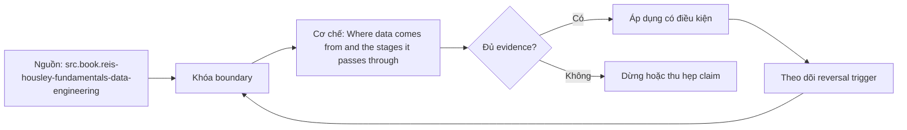

# Where data comes from and the stages it passes through

**Tóm tắt bản chất:** Một con số phân tích là kết quả của chuỗi ghi nhận, thu thập, lưu trữ, biến đổi và diễn giải; mỗi chặng vừa thêm giá trị vừa có thể làm mất hoặc bóp méo tín hiệu ban đầu. Giá trị của mô hình này nằm ở chỗ nó làm lộ nơi một kết luận có thể sai trước khi kết luận đi vào quyết định.

## Problem Definition and Operational Relevance

Một yêu cầu phân tích thường đến dưới dạng câu ngắn và một bảng đã có sẵn. Với **Where data comes from and the stages it passes through**, rủi ro trực tiếp là mở công cụ rồi thao tác ngay. Cách đó tạo output nhanh nhưng để lại câu hỏi khó hơn: con số đang đại diện cho population nào, ở grain nào, qua những biến đổi nào và có đủ bằng chứng để người khác tái hiện hay không?

Chi phí của việc bỏ qua `vòng đời dữ liệu bảy chặng từ sự kiện nghiệp vụ tới quyết định` không nằm ở một câu lệnh lỗi. Kết quả vẫn có thể chạy, biểu đồ vẫn đẹp và người nhận vẫn ra quyết định. Lỗi chỉ lộ khi một báo cáo thứ hai cho số khác, khi dữ liệu tháng mới xuất hiện, hoặc khi reviewer hỏi một trường hợp biên mà logic hiện tại không giải thích được. Khi ấy, phần tốn kém nhất là truy lại assumption đã không được ghi.

## Mechanism

Một con số phân tích là kết quả của chuỗi ghi nhận, thu thập, lưu trữ, biến đổi và diễn giải; mỗi chặng vừa thêm giá trị vừa có thể làm mất hoặc bóp méo tín hiệu ban đầu.

Với `vòng đời dữ liệu bảy chặng từ sự kiện nghiệp vụ tới quyết định`, cơ chế được bóc thành năm lớp. Lớp thứ nhất khóa **đối tượng và population**: ai hoặc sự kiện nào được tính, ai bị loại. Lớp thứ hai khóa **identity và grain**: một dòng hay một quan sát đại diện cho điều gì. Lớp thứ ba khóa **thời gian**: event time, processing time, timezone và cutoff. Lớp thứ tư khóa **phép biến đổi**: lọc, join, aggregate, ánh xạ và xử lý thiếu. Lớp cuối cùng khóa **quyết định**: người nhận sẽ làm gì nếu kết quả cao, thấp hoặc chưa đủ chắc chắn.

Phải tách sự kiện thực, bản ghi trong hệ thống nguồn và bảng phục vụ phân tích; ba thứ có thể khác nhau mà không có lỗi cú pháp nào xuất hiện. Vì vậy, trước mỗi phép tính cần viết một câu ngắn có thể bị bác bỏ. Ví dụ: mỗi dòng đại diện cho một đơn đã thanh toán theo giờ Việt Nam, tính tại thời điểm chốt 07:00. Câu này hữu ích hơn tên bảng vì nó cho reviewer biết phải kiểm uniqueness, status và cutoff ở đâu.

## Decision Framework

| Tình trạng bằng chứng | Hành động | Vì sao |
|---|---|---|
| Grain, population và metric đều rõ | Tiến hành phân tích, giữ lại phép đối soát | Có oracle để phát hiện sai lệch |
| Một assumption ảnh hưởng semantics chưa rõ | Dừng và hỏi owner | Tự chọn mặc định sẽ đổi nghĩa kết quả |
| Dữ liệu thiếu nhưng ảnh hưởng định lượng được | Phân tích có điều kiện, công bố coverage | Người nhận biết giới hạn của kết luận |
| Hai nguồn cho số khác nhau | Truy ngược boundary gần nguồn | Sửa công thức cuối chỉ che lỗi upstream |
| Deadline ngắn hơn thời gian kiểm chứng | Co phạm vi hoặc trả lời chưa đủ bằng chứng | Tốc độ không thay thế correctness |

Quy tắc ưu tiên là: Khi số liệu lệch, truy ngược từng chặng và đối soát ở boundary gần nguồn nhất còn giữ được bằng chứng, thay vì sửa ngay công thức cuối. Chọn sai nhánh làm analytical debt tăng rất nhanh, vì bảng hoặc dashboard mới thường tái sử dụng assumption cũ mà không biết đó chỉ là giả định.

## Worked Case: một chỉ số bán hàng đổi nghĩa giữa đường

Trong case của L002, một cửa hàng nhận yêu cầu giải thích vì sao khách hàng hoạt động giảm từ 12.400 xuống 10.900. Bảng dashboard tính khách có ít nhất một đơn tạo trong tháng. Hệ thống vận hành lại dùng khách có ít nhất một đơn **đã thanh toán**, còn CRM tính người có phiên truy cập trong 30 ngày. Ba con số đều chạy đúng theo code của mình nhưng không cùng khái niệm; `vòng đời dữ liệu bảy chặng từ sự kiện nghiệp vụ tới quyết định` là khung phân tích dùng để xác định sai lệch.

Nhóm phân tích bắt đầu bằng `vòng đời dữ liệu bảy chặng từ sự kiện nghiệp vụ tới quyết định`. Họ ghi population, grain, status, timezone và cửa sổ đo; sau đó lập ba phép đếm song song trên cùng snapshot. Kết quả cho thấy số đơn tạo giảm 12%, số đơn thanh toán chỉ giảm 3%, còn lượt truy cập tăng 8%. Vấn đề không còn là khách hoạt động giảm mà là tỷ lệ chuyển từ tạo đơn sang thanh toán giảm ở một nhóm thiết bị.

Biến thể khó hơn của `Where data comes from and the stages it passes through` xuất hiện khi một đơn có thể thanh toán lại sau thất bại và bảng payment giữ nhiều attempt. Nếu join trực tiếp orders với payments rồi đếm khách, fan-out làm số khách tăng giả. Nhóm phải chọn attempt hợp lệ theo identity, aggregate payment về grain đơn hàng, rồi mới quay lại grain khách hàng. Case này cho thấy một metric không thể được cứu chỉ bằng tên rõ; cơ chế dữ liệu phía dưới phải khớp định nghĩa.

## Limits and Common Errors

**Hiểu lầm:** Có dữ liệu trong database nghĩa là sự kiện ngoài đời đã được ghi chính xác. **Thực tế:** Mất sự kiện, ghi trùng, đồng hồ lệch, ánh xạ sai, lọc nhầm population hoặc định nghĩa chỉ số đổi giữa đường đều có thể tạo dashboard hợp lý nhưng sai. **Vì sao nghe hợp lý:** database tạo cảm giác chắc chắn vì kiểu dữ liệu và truy vấn đều hợp lệ, trong khi lỗi thu thập hoặc định nghĩa không tạo syntax error.

**Hiểu lầm:** Một dashboard thống nhất giao diện thì các chỉ số bên trong cũng thống nhất nghĩa, kể cả khi đang xét `vòng đời dữ liệu bảy chặng từ sự kiện nghiệp vụ tới quyết định`. **Thực tế:** mỗi metric vẫn cần population, grain, thời gian, công thức và owner riêng. **Vì sao nghe hợp lý:** cùng một màn hình che việc các ô số lấy từ pipeline và cutoff khác nhau.

**Hiểu lầm:** Thêm nhiều lát cắt luôn giúp tìm nguyên nhân của L002. **Thực tế:** lát cắt trên metric chưa được khóa chỉ nhân số phiên bản của cùng một sai lệch. **Vì sao nghe hợp lý:** dashboard nhiều filter tạo cảm giác cuộc điều tra đang tiến triển dù câu hỏi gốc vẫn mơ hồ.

Trong `Where data comes from and the stages it passes through`, một trường hợp dễ bỏ sót là missing khác zero. Zero nói rằng đối tượng đã được quan sát và giá trị bằng không; missing nói rằng chưa có quan sát hoặc không ghép được. Ép missing thành zero làm mất dấu failure và thường đổi cả mẫu số. Trường hợp thứ hai là dữ liệu đến muộn: số của hôm nay có thể đúng theo snapshot hiện tại nhưng chưa đủ để so với kỳ đã đóng sổ.

## Nếu Bạn Dạy Lại Điều Này...

Khi dạy `vòng đời dữ liệu bảy chặng từ sự kiện nghiệp vụ tới quyết định`, mở đầu bằng hai bảng cho cùng một doanh thu nhưng lệch 7%, không giải thích nguồn. Yêu cầu người học viết ba giả thuyết trước khi xem SQL. Bài tập seed là đổi đúng một constraint:cutoff, population hoặc grain:rồi buộc họ dự đoán con số nào đổi và phép kiểm nào bắt được thay đổi ấy.

## Ma trận kiểm chứng từng mệnh đề

Mỗi probe dưới đây là một phép thử có khả năng bác bỏ kết luận về `vòng đời dữ liệu bảy chặng từ sự kiện nghiệp vụ tới quyết định`. Expected result phải được viết trước khi chạy; output không khớp thì giữ nguyên failure để điều tra, không sửa expected sau khi đã nhìn kết quả.

### Probe 1: Population và grain

**Mệnh đề cần kiểm.** Phải tách sự kiện thực, bản ghi trong hệ thống nguồn và bảng phục vụ phân tích; ba thứ có thể khác nhau mà không có lỗi cú pháp nào xuất hiện.

**Thiết kế phép thử cho `wiki.da-foundation.data-lifecycle-seven-stages`.** Probe 1 tạo fixture tối thiểu cho L002 ở trục `Population và grain`, gồm một happy path và một bản ghi chỉ khác tại boundary đang xét. Khóa snapshot, timezone, identity và công thức trước execution; sau đó ghi số dòng, số identity duy nhất và tổng kiểm soát ở cả đầu vào lẫn đầu ra.

**Bằng chứng cần giữ.** Với `Population và grain`, lưu truy vấn hoặc thao tác tái hiện, expected result, raw output, chênh lệch so với oracle và limitation. Probe 1 chỉ đạt khi reviewer độc lập có thể đi từ fixture đến cùng kết luận về `vòng đời dữ liệu bảy chặng từ sự kiện nghiệp vụ tới quyết định` mà không cần hỏi tác giả chọn mặc định nào.

### Probe 2: Identity và uniqueness

**Mệnh đề cần kiểm.** Mất sự kiện, ghi trùng, đồng hồ lệch, ánh xạ sai, lọc nhầm population hoặc định nghĩa chỉ số đổi giữa đường đều có thể tạo dashboard hợp lý nhưng sai.

**Thiết kế phép thử cho `wiki.da-foundation.data-lifecycle-seven-stages`.** Probe 2 tạo fixture tối thiểu cho L002 ở trục `Identity và uniqueness`, gồm một happy path và một bản ghi chỉ khác tại boundary đang xét. Khóa snapshot, timezone, identity và công thức trước execution; sau đó ghi số dòng, số identity duy nhất và tổng kiểm soát ở cả đầu vào lẫn đầu ra.

**Bằng chứng cần giữ.** Với `Identity và uniqueness`, lưu truy vấn hoặc thao tác tái hiện, expected result, raw output, chênh lệch so với oracle và limitation. Probe 2 chỉ đạt khi reviewer độc lập có thể đi từ fixture đến cùng kết luận về `vòng đời dữ liệu bảy chặng từ sự kiện nghiệp vụ tới quyết định` mà không cần hỏi tác giả chọn mặc định nào.

### Probe 3: Thời gian và cutoff

**Mệnh đề cần kiểm.** Một con số phân tích là kết quả của chuỗi ghi nhận, thu thập, lưu trữ, biến đổi và diễn giải; mỗi chặng vừa thêm giá trị vừa có thể làm mất hoặc bóp méo tín hiệu ban đầu.

**Thiết kế phép thử cho `wiki.da-foundation.data-lifecycle-seven-stages`.** Probe 3 tạo fixture tối thiểu cho L002 ở trục `Thời gian và cutoff`, gồm một happy path và một bản ghi chỉ khác tại boundary đang xét. Khóa snapshot, timezone, identity và công thức trước execution; sau đó ghi số dòng, số identity duy nhất và tổng kiểm soát ở cả đầu vào lẫn đầu ra.

**Bằng chứng cần giữ.** Với `Thời gian và cutoff`, lưu truy vấn hoặc thao tác tái hiện, expected result, raw output, chênh lệch so với oracle và limitation. Probe 3 chỉ đạt khi reviewer độc lập có thể đi từ fixture đến cùng kết luận về `vòng đời dữ liệu bảy chặng từ sự kiện nghiệp vụ tới quyết định` mà không cần hỏi tác giả chọn mặc định nào.

### Probe 4: Định nghĩa metric

**Mệnh đề cần kiểm.** Khi số liệu lệch, truy ngược từng chặng và đối soát ở boundary gần nguồn nhất còn giữ được bằng chứng, thay vì sửa ngay công thức cuối.

**Thiết kế phép thử cho `wiki.da-foundation.data-lifecycle-seven-stages`.** Probe 4 tạo fixture tối thiểu cho L002 ở trục `Định nghĩa metric`, gồm một happy path và một bản ghi chỉ khác tại boundary đang xét. Khóa snapshot, timezone, identity và công thức trước execution; sau đó ghi số dòng, số identity duy nhất và tổng kiểm soát ở cả đầu vào lẫn đầu ra.

**Bằng chứng cần giữ.** Với `Định nghĩa metric`, lưu truy vấn hoặc thao tác tái hiện, expected result, raw output, chênh lệch so với oracle và limitation. Probe 4 chỉ đạt khi reviewer độc lập có thể đi từ fixture đến cùng kết luận về `vòng đời dữ liệu bảy chặng từ sự kiện nghiệp vụ tới quyết định` mà không cần hỏi tác giả chọn mặc định nào.

### Probe 5: Đối soát độc lập

**Mệnh đề cần kiểm.** Sơ đồ lineage bảy chặng, số đếm trước-sau mỗi boundary và một cơ chế sai lệch cụ thể cho ít nhất năm chặng.

**Thiết kế phép thử cho `wiki.da-foundation.data-lifecycle-seven-stages`.** Probe 5 tạo fixture tối thiểu cho L002 ở trục `Đối soát độc lập`, gồm một happy path và một bản ghi chỉ khác tại boundary đang xét. Khóa snapshot, timezone, identity và công thức trước execution; sau đó ghi số dòng, số identity duy nhất và tổng kiểm soát ở cả đầu vào lẫn đầu ra.

**Bằng chứng cần giữ.** Với `Đối soát độc lập`, lưu truy vấn hoặc thao tác tái hiện, expected result, raw output, chênh lệch so với oracle và limitation. Probe 5 chỉ đạt khi reviewer độc lập có thể đi từ fixture đến cùng kết luận về `vòng đời dữ liệu bảy chặng từ sự kiện nghiệp vụ tới quyết định` mà không cần hỏi tác giả chọn mặc định nào.

### Probe 6: Changed constraint

**Mệnh đề cần kiểm.** Đổi kênh thu thập, độ trễ hoặc định nghĩa nghiệp vụ phải làm learner chỉ ra chặng nào cần kiểm lại và kết luận nào không còn giữ nguyên.

**Thiết kế phép thử cho `wiki.da-foundation.data-lifecycle-seven-stages`.** Probe 6 tạo fixture tối thiểu cho L002 ở trục `Changed constraint`, gồm một happy path và một bản ghi chỉ khác tại boundary đang xét. Khóa snapshot, timezone, identity và công thức trước execution; sau đó ghi số dòng, số identity duy nhất và tổng kiểm soát ở cả đầu vào lẫn đầu ra.

**Bằng chứng cần giữ.** Với `Changed constraint`, lưu truy vấn hoặc thao tác tái hiện, expected result, raw output, chênh lệch so với oracle và limitation. Probe 6 chỉ đạt khi reviewer độc lập có thể đi từ fixture đến cùng kết luận về `vòng đời dữ liệu bảy chặng từ sự kiện nghiệp vụ tới quyết định` mà không cần hỏi tác giả chọn mặc định nào.

### Probe 7: Missing và zero

**Mệnh đề cần kiểm.** Mất sự kiện, ghi trùng, đồng hồ lệch, ánh xạ sai, lọc nhầm population hoặc định nghĩa chỉ số đổi giữa đường đều có thể tạo dashboard hợp lý nhưng sai.

**Thiết kế phép thử cho `wiki.da-foundation.data-lifecycle-seven-stages`.** Probe 7 tạo fixture tối thiểu cho L002 ở trục `Missing và zero`, gồm một happy path và một bản ghi chỉ khác tại boundary đang xét. Khóa snapshot, timezone, identity và công thức trước execution; sau đó ghi số dòng, số identity duy nhất và tổng kiểm soát ở cả đầu vào lẫn đầu ra.

**Bằng chứng cần giữ.** Với `Missing và zero`, lưu truy vấn hoặc thao tác tái hiện, expected result, raw output, chênh lệch so với oracle và limitation. Probe 7 chỉ đạt khi reviewer độc lập có thể đi từ fixture đến cùng kết luận về `vòng đời dữ liệu bảy chặng từ sự kiện nghiệp vụ tới quyết định` mà không cần hỏi tác giả chọn mặc định nào.

### Probe 8: Join fan-out

**Mệnh đề cần kiểm.** Phải tách sự kiện thực, bản ghi trong hệ thống nguồn và bảng phục vụ phân tích; ba thứ có thể khác nhau mà không có lỗi cú pháp nào xuất hiện.

**Thiết kế phép thử cho `wiki.da-foundation.data-lifecycle-seven-stages`.** Probe 8 tạo fixture tối thiểu cho L002 ở trục `Join fan-out`, gồm một happy path và một bản ghi chỉ khác tại boundary đang xét. Khóa snapshot, timezone, identity và công thức trước execution; sau đó ghi số dòng, số identity duy nhất và tổng kiểm soát ở cả đầu vào lẫn đầu ra.

**Bằng chứng cần giữ.** Với `Join fan-out`, lưu truy vấn hoặc thao tác tái hiện, expected result, raw output, chênh lệch so với oracle và limitation. Probe 8 chỉ đạt khi reviewer độc lập có thể đi từ fixture đến cùng kết luận về `vòng đời dữ liệu bảy chặng từ sự kiện nghiệp vụ tới quyết định` mà không cần hỏi tác giả chọn mặc định nào.

### Probe 9: Dữ liệu đến muộn

**Mệnh đề cần kiểm.** Một con số phân tích là kết quả của chuỗi ghi nhận, thu thập, lưu trữ, biến đổi và diễn giải; mỗi chặng vừa thêm giá trị vừa có thể làm mất hoặc bóp méo tín hiệu ban đầu.

**Thiết kế phép thử cho `wiki.da-foundation.data-lifecycle-seven-stages`.** Probe 9 tạo fixture tối thiểu cho L002 ở trục `Dữ liệu đến muộn`, gồm một happy path và một bản ghi chỉ khác tại boundary đang xét. Khóa snapshot, timezone, identity và công thức trước execution; sau đó ghi số dòng, số identity duy nhất và tổng kiểm soát ở cả đầu vào lẫn đầu ra.

**Bằng chứng cần giữ.** Với `Dữ liệu đến muộn`, lưu truy vấn hoặc thao tác tái hiện, expected result, raw output, chênh lệch so với oracle và limitation. Probe 9 chỉ đạt khi reviewer độc lập có thể đi từ fixture đến cùng kết luận về `vòng đời dữ liệu bảy chặng từ sự kiện nghiệp vụ tới quyết định` mà không cần hỏi tác giả chọn mặc định nào.

### Probe 10: Quyết định đảo chiều

**Mệnh đề cần kiểm.** Khi số liệu lệch, truy ngược từng chặng và đối soát ở boundary gần nguồn nhất còn giữ được bằng chứng, thay vì sửa ngay công thức cuối.

**Thiết kế phép thử cho `wiki.da-foundation.data-lifecycle-seven-stages`.** Probe 10 tạo fixture tối thiểu cho L002 ở trục `Quyết định đảo chiều`, gồm một happy path và một bản ghi chỉ khác tại boundary đang xét. Khóa snapshot, timezone, identity và công thức trước execution; sau đó ghi số dòng, số identity duy nhất và tổng kiểm soát ở cả đầu vào lẫn đầu ra.

**Bằng chứng cần giữ.** Với `Quyết định đảo chiều`, lưu truy vấn hoặc thao tác tái hiện, expected result, raw output, chênh lệch so với oracle và limitation. Probe 10 chỉ đạt khi reviewer độc lập có thể đi từ fixture đến cùng kết luận về `vòng đời dữ liệu bảy chặng từ sự kiện nghiệp vụ tới quyết định` mà không cần hỏi tác giả chọn mặc định nào.

### Probe 11: Reviewer tái hiện

**Mệnh đề cần kiểm.** Sơ đồ lineage bảy chặng, số đếm trước-sau mỗi boundary và một cơ chế sai lệch cụ thể cho ít nhất năm chặng.

**Thiết kế phép thử cho `wiki.da-foundation.data-lifecycle-seven-stages`.** Probe 11 tạo fixture tối thiểu cho L002 ở trục `Reviewer tái hiện`, gồm một happy path và một bản ghi chỉ khác tại boundary đang xét. Khóa snapshot, timezone, identity và công thức trước execution; sau đó ghi số dòng, số identity duy nhất và tổng kiểm soát ở cả đầu vào lẫn đầu ra.

**Bằng chứng cần giữ.** Với `Reviewer tái hiện`, lưu truy vấn hoặc thao tác tái hiện, expected result, raw output, chênh lệch so với oracle và limitation. Probe 11 chỉ đạt khi reviewer độc lập có thể đi từ fixture đến cùng kết luận về `vòng đời dữ liệu bảy chặng từ sự kiện nghiệp vụ tới quyết định` mà không cần hỏi tác giả chọn mặc định nào.

### Probe 12: Tình huống mới

**Mệnh đề cần kiểm.** Đổi kênh thu thập, độ trễ hoặc định nghĩa nghiệp vụ phải làm learner chỉ ra chặng nào cần kiểm lại và kết luận nào không còn giữ nguyên.

**Thiết kế phép thử cho `wiki.da-foundation.data-lifecycle-seven-stages`.** Probe 12 tạo fixture tối thiểu cho L002 ở trục `Tình huống mới`, gồm một happy path và một bản ghi chỉ khác tại boundary đang xét. Khóa snapshot, timezone, identity và công thức trước execution; sau đó ghi số dòng, số identity duy nhất và tổng kiểm soát ở cả đầu vào lẫn đầu ra.

**Bằng chứng cần giữ.** Với `Tình huống mới`, lưu truy vấn hoặc thao tác tái hiện, expected result, raw output, chênh lệch so với oracle và limitation. Probe 12 chỉ đạt khi reviewer độc lập có thể đi từ fixture đến cùng kết luận về `vòng đời dữ liệu bảy chặng từ sự kiện nghiệp vụ tới quyết định` mà không cần hỏi tác giả chọn mặc định nào.

## Tự Kiểm Tra Nhanh

1. Boundary nào phải được khóa trước tiên khi áp dụng `vòng đời dữ liệu bảy chặng từ sự kiện nghiệp vụ tới quyết định`?

<details><summary>Đáp án</summary>

Phải tách sự kiện thực, bản ghi trong hệ thống nguồn và bảng phục vụ phân tích; ba thứ có thể khác nhau mà không có lỗi cú pháp nào xuất hiện.

</details>

2. Failure nào dễ tạo kết quả xanh giả nhất?

<details><summary>Đáp án</summary>

Mất sự kiện, ghi trùng, đồng hồ lệch, ánh xạ sai, lọc nhầm population hoặc định nghĩa chỉ số đổi giữa đường đều có thể tạo dashboard hợp lý nhưng sai.

</details>

3. Bằng chứng nào đủ để một reviewer tái hiện kết luận?

<details><summary>Đáp án</summary>

Sơ đồ lineage bảy chặng, số đếm trước-sau mỗi boundary và một cơ chế sai lệch cụ thể cho ít nhất năm chặng.

</details>

## Giới hạn và điều chưa cho phép kết luận

- Case study là fixture giảng dạy; chưa phải quan sát production của một doanh nghiệp cụ thể.
- Các con số minh họa chỉ chứng minh cơ chế, không phải benchmark ngành.
- Concept key `ck.da.data-lifecycle-seven-stages` đã được owner phê duyệt `canonical`; note thuộc canonical registry coverage. Trạng thái này không tự chứng minh learner mastery.
- Note ở trạng thái `review`; việc note tồn tại không chứng minh learner đã thành thạo.

## Reference
1. [[SRC-REIS-HOUSLEY-FUNDAMENTALS-DATA-ENGINEERING]]: `src.book.reis-housley-fundamentals-data-engineering`
2. [[SRC-GOVUK-DATA-ANALYTICS-TOOLS-GUIDANCE]]: `src.web.govuk-data-analytics-tools-guidance`

## Source coverage

| Source slice | Locator | Kiến thức giữ lại | Trạng thái |
|---|---|---|---|
| [[SRC-REIS-HOUSLEY-FUNDAMENTALS-DATA-ENGINEERING]] | Chapters 1-3: data lifecycle, source systems và data engineering lifecycle | Cơ chế, boundary và decision rule cho `vòng đời dữ liệu bảy chặng từ sự kiện nghiệp vụ tới quyết định` | Đã phủ |
| [[SRC-GOVUK-DATA-ANALYTICS-TOOLS-GUIDANCE]] | Problem framing, validation and responsible analytical delivery; accessed 2026-10-02 | Cơ chế, boundary và decision rule cho `vòng đời dữ liệu bảy chặng từ sự kiện nghiệp vụ tới quyết định` | Đã phủ |

## Key takeaways
- Khi số liệu lệch, truy ngược từng chặng và đối soát ở boundary gần nguồn nhất còn giữ được bằng chứng, thay vì sửa ngay công thức cuối.
- Sơ đồ lineage bảy chặng, số đếm trước-sau mỗi boundary và một cơ chế sai lệch cụ thể cho ít nhất năm chặng.
- Kết luận chỉ có nghĩa trong population, grain, thời gian và version đã ghi.
- Khi constraint đổi, phải chạy lại probe liên quan thay vì tái sử dụng kết luận cũ.

Note tiếp theo mở rộng chuỗi bằng quan hệ `prerequisite_of` đã khai báo trong front matter.

<!-- ATOMIC-EXECUTION-CAPSULE:START -->

## Execution capsule: kiểm chứng `wiki.da-foundation.data-lifecycle-seven-stages`

> [!important] Phân loại mệnh đề
> Với `wiki.da-foundation.data-lifecycle-seven-stages`, sơ đồ, ví dụ và artifact về **Where data comes from and the stages it passes through** là **synthesis để kiểm chứng**; chúng không phải trích dẫn hay case nguyên văn của nguồn.

### Sơ đồ cơ chế và điểm kiểm soát



Đọc sơ đồ `wiki.da-foundation.data-lifecycle-seven-stages` từ trái sang phải: source chỉ cung cấp claim ban đầu cho **Where data comes from and the stages it passes through**; quyết định chỉ được đi tiếp sau khi boundary, evidence và điều kiện đảo quyết định đã hiện hữu.

### Artifact thực thi tối thiểu

```yaml
concept_id: "wiki.da-foundation.data-lifecycle-seven-stages"
concept: "Where data comes from and the stages it passes through"
primary_question: "Làm sao áp dụng vòng đời dữ liệu bảy chặng từ sự kiện nghiệp vụ tới quyết định mà vẫn giữ được ngữ nghĩa và bằng chứng kiểm chứng?"
decision_contract:
  input_boundary: "Ghi population, thời điểm, owner và điều chưa biết"
  hard_constraints:
    - "Không vượt quyền hoặc privacy boundary"
    - "Không dùng cùng một assumption làm cả implementation và oracle"
  accept_when: "Có observation phân biệt được các lựa chọn"
  reversal_trigger: "Một hard constraint sai hoặc evidence mới đổi recommendation"
evidence_to_keep:
  - "input snapshot"
  - "chosen and rejected options"
  - "independent review result"
```

Artifact của `wiki.da-foundation.data-lifecycle-seven-stages` buộc người dùng ghi boundary, oracle và reversal trigger cho **Where data comes from and the stages it passes through**. Các giá trị minh họa phải được thay bằng evidence thật trước khi dùng cho quyết định.

<!-- ATOMIC-EXECUTION-CAPSULE:END -->
