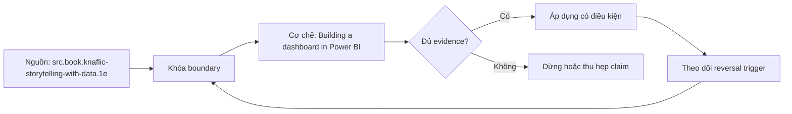

# Building a dashboard in Power BI

**Tóm tắt bản chất:** Trực quan hoá dựng sẵn và điều kiện cần tuỳ biến. Slicer, bookmark, drill-through, tooltip tuỳ biến. Định dạng có điều kiện. Ba đòn bẩy hiệu năng theo thứ tự hiệu quả: giảm dữ liệu ở tầng nguồn, tránh tính toán nặng trong công cụ, đo bằng Performance Analyzer trước khi tối ưu. Xuất bản và chia sẻ; quyền truy cập theo hàng ở mức nhận biết. Điểm quyết định là giữ đúng population, grain, thời gian và oracle trước khi tin output.

## Nỗi Đau & Động Lực

L053 bắt đầu từ một lỗi rất thực dụng: analyst có thể tạo được file, query hoặc dashboard đúng cú pháp nhưng không trả lời đúng câu hỏi. Với **Building a dashboard in Power BI**, hậu quả xuất hiện ở người ra quyết định; họ hành động trên một con số không còn truy được về population, grain hoặc assumption ban đầu.

Roadmap đặt chuẩn đầu ra như sau: Dựng một dashboard hoàn chỉnh theo bản phác thảo ở lesson 52 và đưa thời gian tải xuống dưới ngưỡng đo được. Đây là năng lực quan sát được, không phải yêu cầu nhớ thuật ngữ. Nếu bằng chứng không cho reviewer tái hiện cùng kết luận, bài vẫn chưa đạt dù output nhìn hợp lý.

## Cơ Chế Tác Động

Trực quan hoá dựng sẵn và điều kiện cần tuỳ biến. Slicer, bookmark, drill-through, tooltip tuỳ biến. Định dạng có điều kiện. Ba đòn bẩy hiệu năng theo thứ tự hiệu quả: giảm dữ liệu ở tầng nguồn, tránh tính toán nặng trong công cụ, đo bằng Performance Analyzer trước khi tối ưu. Xuất bản và chia sẻ; quyền truy cập theo hàng ở mức nhận biết.

Cơ chế của `building-a-dashboard-in-power-bi` được kiểm qua năm lớp: input và population; identity và grain; transformation; time boundary; consumer-visible output. Mỗi lớp cần một invariant ngắn, một failure có chủ ý và một phép đối soát độc lập. Command chạy thành công chỉ chứng minh execution; nó không chứng minh semantics.

Lỗi cần loại trừ trong bài này là: Kéo toàn bộ bảng chi tiết vào mô hình thay vì gộp ở nguồn · tối ưu trước khi đo nên tối ưu nhầm chỗ · thêm thành phần không có trong bản phác thảo đã bảo vệ. Tách các lỗi ấy thành fixture riêng giúp chẩn đoán nguyên nhân thay vì sửa nhiều biến cùng lúc.

## Bản Đồ Quyết Định

| Dấu hiệu | Quyết định | Bằng chứng bắt buộc |
|---|---|---|
| Population và grain rõ | Tiếp tục xử lý | Row count, uniqueness, control total |
| Assumption đổi nghĩa kết quả | Dừng và xác minh | Owner cùng impact-if-wrong |
| Dữ liệu thiếu nhưng đo được coverage | Phân tích có điều kiện | Missing report và limitation |
| Hai đường tính không khớp | Truy ngược boundary | Snapshot và reconciliation |
| Deadline không đủ cho phép kiểm | Co phạm vi | Non-goal và câu trả lời tạm thời |

Quy tắc của L053: chọn phương án đơn giản nhất vẫn giữ được điều kiện hoàn thành “Dashboard khớp bản phác thảo đã bảo vệ, và thời gian tải đo bằng Performance Analyzer dưới 3 giây trên `DS2`.”. Không dùng độ phức tạp để che một câu hỏi chưa rõ.

## Case Study Thực Chiến: Building a dashboard in Power BI

Bài thực hành dùng nhiệm vụ thật của roadmap: Dựng dashboard bán hàng trên `DS2` theo bản phác thảo ở lesson 52. Đo thời gian tải bằng Performance Analyzer và tối ưu xuống dưới 3 giây.

Trước khi thao tác ở `Building a dashboard in Power BI`, learner ghi expected result, grain, identity, cutoff và phép kiểm. Sau thao tác, họ giữ raw output cùng một oracle khác đường triển khai. Nếu hai đường không khớp, discrepancy trở thành kết quả cần điều tra; không được sửa expected cho giống output vừa thấy.

Biến thể khó hơn đổi một constraint: dữ liệu có bản ghi trùng, đến muộn, thiếu khóa hoặc có nhiều dòng con cho một thực thể. L053 chỉ được xem là transfer khi learner tự nhận ra phép tính nào không còn hợp lệ và thiết kế lại boundary mà không cần chép case mẫu.

## Góc Khuất & Ngộ Nhận

**Hiểu lầm:** Output của `Building a dashboard in Power BI` chạy được nghĩa là kết luận đúng. **Thực tế:** syntax không kiểm population, grain, cutoff hay định nghĩa nghiệp vụ. **Vì sao nghe hợp lý:** công cụ trả kết quả cụ thể và không hiển thị assumption đã bị bỏ qua.

**Hiểu lầm:** Thêm nhiều bước kiểm luôn làm phân tích đáng tin hơn. **Thực tế:** hai phép kiểm dùng chung dữ liệu và cùng logic có thể sai giống nhau. **Vì sao nghe hợp lý:** số lượng test tạo cảm giác độc lập dù oracle không độc lập.

**Hiểu lầm:** Có thể sửa edge case sau khi hoàn thành happy path. **Thực tế:** Kéo toàn bộ bảng chi tiết vào mô hình thay vì gộp ở nguồn · tối ưu trước khi đo nên tối ưu nhầm chỗ · thêm thành phần không có trong bản phác thảo đã bảo vệ. **Vì sao nghe hợp lý:** dữ liệu mẫu nhỏ thường không chạm fan-out, missing, skew, late arrival hoặc changed constraint.

## Nếu Bạn Dạy Lại Điều Này...

Mở đầu L053 bằng một output trông hợp lý nhưng sai đúng một invariant. Người học viết dự đoán trước khi xem cơ chế. Exercise seed đổi duy nhất một constraint và yêu cầu họ nói rõ quyết định giữ nguyên hay đảo, cùng evidence đủ mạnh để thuyết phục reviewer.

## Ma trận kiểm chứng

### Probe 1: population

**Mệnh đề của probe 1 — `population`.** Trực quan hoá dựng sẵn và điều kiện cần tuỳ biến. Slicer, bookmark, drill-through, tooltip tuỳ biến. Định dạng có điều kiện. Ba đòn bẩy hiệu năng theo thứ tự hiệu quả: giảm dữ liệu ở tầng nguồn, tránh tính toán nặng trong công cụ, đo bằng Performance Analyzer trước khi tối ưu. Xuất bản và chia sẻ; quyền truy cập theo hàng ở mức nhận biết.

**Thiết kế.** Probe 1 của L053 tạo fixture nhỏ cho `population` với một control và một bản ghi chỉ khác tại boundary đang xét. Expected result được khóa trước execution; snapshot, version, identity và state ban đầu đi cùng artifact.

**Oracle L053.1.** Đối soát `population` bằng đường tính khác implementation chính của `building-a-dashboard-in-power-bi`. Giữ command, raw observation, before/after counts và limitation. Probe chỉ đạt khi reviewer đi từ fixture tới cùng kết luận mà không hỏi tác giả đã chọn mặc định nào.

### Probe 2: grain

**Mệnh đề của probe 2 — `grain`.** Dựng một dashboard hoàn chỉnh theo bản phác thảo ở lesson 52 và đưa thời gian tải xuống dưới ngưỡng đo được.

**Thiết kế.** Probe 2 của L053 tạo fixture nhỏ cho `grain` với một control và một bản ghi chỉ khác tại boundary đang xét. Expected result được khóa trước execution; snapshot, version, identity và state ban đầu đi cùng artifact.

**Oracle L053.2.** Đối soát `grain` bằng đường tính khác implementation chính của `building-a-dashboard-in-power-bi`. Giữ command, raw observation, before/after counts và limitation. Probe chỉ đạt khi reviewer đi từ fixture tới cùng kết luận mà không hỏi tác giả đã chọn mặc định nào.

### Probe 3: identity

**Mệnh đề của probe 3 — `identity`.** Kéo toàn bộ bảng chi tiết vào mô hình thay vì gộp ở nguồn · tối ưu trước khi đo nên tối ưu nhầm chỗ · thêm thành phần không có trong bản phác thảo đã bảo vệ.

**Thiết kế.** Probe 3 của L053 tạo fixture nhỏ cho `identity` với một control và một bản ghi chỉ khác tại boundary đang xét. Expected result được khóa trước execution; snapshot, version, identity và state ban đầu đi cùng artifact.

**Oracle L053.3.** Đối soát `identity` bằng đường tính khác implementation chính của `building-a-dashboard-in-power-bi`. Giữ command, raw observation, before/after counts và limitation. Probe chỉ đạt khi reviewer đi từ fixture tới cùng kết luận mà không hỏi tác giả đã chọn mặc định nào.

### Probe 4: time cutoff

**Mệnh đề của probe 4 — `time cutoff`.** Dashboard khớp bản phác thảo đã bảo vệ, và thời gian tải đo bằng Performance Analyzer dưới 3 giây trên `DS2`.

**Thiết kế.** Probe 4 của L053 tạo fixture nhỏ cho `time cutoff` với một control và một bản ghi chỉ khác tại boundary đang xét. Expected result được khóa trước execution; snapshot, version, identity và state ban đầu đi cùng artifact.

**Oracle L053.4.** Đối soát `time cutoff` bằng đường tính khác implementation chính của `building-a-dashboard-in-power-bi`. Giữ command, raw observation, before/after counts và limitation. Probe chỉ đạt khi reviewer đi từ fixture tới cùng kết luận mà không hỏi tác giả đã chọn mặc định nào.

### Probe 5: missing versus zero

**Mệnh đề của probe 5 — `missing versus zero`.** Trực quan hoá dựng sẵn và điều kiện cần tuỳ biến. Slicer, bookmark, drill-through, tooltip tuỳ biến. Định dạng có điều kiện. Ba đòn bẩy hiệu năng theo thứ tự hiệu quả: giảm dữ liệu ở tầng nguồn, tránh tính toán nặng trong công cụ, đo bằng Performance Analyzer trước khi tối ưu. Xuất bản và chia sẻ; quyền truy cập theo hàng ở mức nhận biết.

**Thiết kế.** Probe 5 của L053 tạo fixture nhỏ cho `missing versus zero` với một control và một bản ghi chỉ khác tại boundary đang xét. Expected result được khóa trước execution; snapshot, version, identity và state ban đầu đi cùng artifact.

**Oracle L053.5.** Đối soát `missing versus zero` bằng đường tính khác implementation chính của `building-a-dashboard-in-power-bi`. Giữ command, raw observation, before/after counts và limitation. Probe chỉ đạt khi reviewer đi từ fixture tới cùng kết luận mà không hỏi tác giả đã chọn mặc định nào.

### Probe 6: duplicate

**Mệnh đề của probe 6 — `duplicate`.** Dựng một dashboard hoàn chỉnh theo bản phác thảo ở lesson 52 và đưa thời gian tải xuống dưới ngưỡng đo được.

**Thiết kế.** Probe 6 của L053 tạo fixture nhỏ cho `duplicate` với một control và một bản ghi chỉ khác tại boundary đang xét. Expected result được khóa trước execution; snapshot, version, identity và state ban đầu đi cùng artifact.

**Oracle L053.6.** Đối soát `duplicate` bằng đường tính khác implementation chính của `building-a-dashboard-in-power-bi`. Giữ command, raw observation, before/after counts và limitation. Probe chỉ đạt khi reviewer đi từ fixture tới cùng kết luận mà không hỏi tác giả đã chọn mặc định nào.

### Probe 7: join fan-out

**Mệnh đề của probe 7 — `join fan-out`.** Kéo toàn bộ bảng chi tiết vào mô hình thay vì gộp ở nguồn · tối ưu trước khi đo nên tối ưu nhầm chỗ · thêm thành phần không có trong bản phác thảo đã bảo vệ.

**Thiết kế.** Probe 7 của L053 tạo fixture nhỏ cho `join fan-out` với một control và một bản ghi chỉ khác tại boundary đang xét. Expected result được khóa trước execution; snapshot, version, identity và state ban đầu đi cùng artifact.

**Oracle L053.7.** Đối soát `join fan-out` bằng đường tính khác implementation chính của `building-a-dashboard-in-power-bi`. Giữ command, raw observation, before/after counts và limitation. Probe chỉ đạt khi reviewer đi từ fixture tới cùng kết luận mà không hỏi tác giả đã chọn mặc định nào.

### Probe 8: changed definition

**Mệnh đề của probe 8 — `changed definition`.** Dashboard khớp bản phác thảo đã bảo vệ, và thời gian tải đo bằng Performance Analyzer dưới 3 giây trên `DS2`.

**Thiết kế.** Probe 8 của L053 tạo fixture nhỏ cho `changed definition` với một control và một bản ghi chỉ khác tại boundary đang xét. Expected result được khóa trước execution; snapshot, version, identity và state ban đầu đi cùng artifact.

**Oracle L053.8.** Đối soát `changed definition` bằng đường tính khác implementation chính của `building-a-dashboard-in-power-bi`. Giữ command, raw observation, before/after counts và limitation. Probe chỉ đạt khi reviewer đi từ fixture tới cùng kết luận mà không hỏi tác giả đã chọn mặc định nào.

### Probe 9: independent oracle

**Mệnh đề của probe 9 — `independent oracle`.** Trực quan hoá dựng sẵn và điều kiện cần tuỳ biến. Slicer, bookmark, drill-through, tooltip tuỳ biến. Định dạng có điều kiện. Ba đòn bẩy hiệu năng theo thứ tự hiệu quả: giảm dữ liệu ở tầng nguồn, tránh tính toán nặng trong công cụ, đo bằng Performance Analyzer trước khi tối ưu. Xuất bản và chia sẻ; quyền truy cập theo hàng ở mức nhận biết.

**Thiết kế.** Probe 9 của L053 tạo fixture nhỏ cho `independent oracle` với một control và một bản ghi chỉ khác tại boundary đang xét. Expected result được khóa trước execution; snapshot, version, identity và state ban đầu đi cùng artifact.

**Oracle L053.9.** Đối soát `independent oracle` bằng đường tính khác implementation chính của `building-a-dashboard-in-power-bi`. Giữ command, raw observation, before/after counts và limitation. Probe chỉ đạt khi reviewer đi từ fixture tới cùng kết luận mà không hỏi tác giả đã chọn mặc định nào.

### Probe 10: replay

**Mệnh đề của probe 10 — `replay`.** Dựng một dashboard hoàn chỉnh theo bản phác thảo ở lesson 52 và đưa thời gian tải xuống dưới ngưỡng đo được.

**Thiết kế.** Probe 10 của L053 tạo fixture nhỏ cho `replay` với một control và một bản ghi chỉ khác tại boundary đang xét. Expected result được khóa trước execution; snapshot, version, identity và state ban đầu đi cùng artifact.

**Oracle L053.10.** Đối soát `replay` bằng đường tính khác implementation chính của `building-a-dashboard-in-power-bi`. Giữ command, raw observation, before/after counts và limitation. Probe chỉ đạt khi reviewer đi từ fixture tới cùng kết luận mà không hỏi tác giả đã chọn mặc định nào.

### Probe 11: fresh snapshot

**Mệnh đề của probe 11 — `fresh snapshot`.** Kéo toàn bộ bảng chi tiết vào mô hình thay vì gộp ở nguồn · tối ưu trước khi đo nên tối ưu nhầm chỗ · thêm thành phần không có trong bản phác thảo đã bảo vệ.

**Thiết kế.** Probe 11 của L053 tạo fixture nhỏ cho `fresh snapshot` với một control và một bản ghi chỉ khác tại boundary đang xét. Expected result được khóa trước execution; snapshot, version, identity và state ban đầu đi cùng artifact.

**Oracle L053.11.** Đối soát `fresh snapshot` bằng đường tính khác implementation chính của `building-a-dashboard-in-power-bi`. Giữ command, raw observation, before/after counts và limitation. Probe chỉ đạt khi reviewer đi từ fixture tới cùng kết luận mà không hỏi tác giả đã chọn mặc định nào.

### Probe 12: novel scenario

**Mệnh đề của probe 12 — `novel scenario`.** Dashboard khớp bản phác thảo đã bảo vệ, và thời gian tải đo bằng Performance Analyzer dưới 3 giây trên `DS2`.

**Thiết kế.** Probe 12 của L053 tạo fixture nhỏ cho `novel scenario` với một control và một bản ghi chỉ khác tại boundary đang xét. Expected result được khóa trước execution; snapshot, version, identity và state ban đầu đi cùng artifact.

**Oracle L053.12.** Đối soát `novel scenario` bằng đường tính khác implementation chính của `building-a-dashboard-in-power-bi`. Giữ command, raw observation, before/after counts và limitation. Probe chỉ đạt khi reviewer đi từ fixture tới cùng kết luận mà không hỏi tác giả đã chọn mặc định nào.

## Tự Kiểm Tra Nhanh

1. Năng lực nào phải chứng minh ở L053?

<details><summary>Đáp án</summary>

Dựng một dashboard hoàn chỉnh theo bản phác thảo ở lesson 52 và đưa thời gian tải xuống dưới ngưỡng đo được.

</details>

2. Failure nào phải chủ động cài vào fixture?

<details><summary>Đáp án</summary>

Kéo toàn bộ bảng chi tiết vào mô hình thay vì gộp ở nguồn · tối ưu trước khi đo nên tối ưu nhầm chỗ · thêm thành phần không có trong bản phác thảo đã bảo vệ.

</details>

3. Khi nào bài được xem là hoàn thành?

<details><summary>Đáp án</summary>

Dashboard khớp bản phác thảo đã bảo vệ, và thời gian tải đo bằng Performance Analyzer dưới 3 giây trên `DS2`.

</details>

## Giới hạn và điều chưa cho phép kết luận

- Case và probe là protocol giảng dạy; chưa phải quan sát production.
- Con số minh họa không phải benchmark ngành.
- Concept key `ck.da.building-a-dashboard-in-power-bi` đã được owner phê duyệt `canonical`; note thuộc canonical registry coverage. Trạng thái này không tự chứng minh learner mastery.
- Note tồn tại không phải bằng chứng learner đã thành thạo.

## Reference
1. [[SRC-STORYTELLING-WITH-DATA]] — `src.book.knaflic-storytelling-with-data.1e`
2. [[SRC-DEFINITIVE-GUIDE-DAX-3E]] — `src.book.ferrari-russo-definitive-guide-dax.3e`

## Source coverage

| Source slice | Locator | Kiến thức phải giữ | Vị trí | Trạng thái | Ngoài phạm vi |
|---|---|---|---|---|---|
| [[SRC-STORYTELLING-WITH-DATA]] — `src.book.knaflic-storytelling-with-data.1e` | Source record và phạm vi đọc đã đăng ký | Cơ chế liên quan tới Building a dashboard in Power BI | các mục cơ chế, case và probe | Đã phủ | ngoài objective L053 |
| [[SRC-DEFINITIVE-GUIDE-DAX-3E]] — `src.book.ferrari-russo-definitive-guide-dax.3e` | Source record và phạm vi đọc đã đăng ký | Cơ chế liên quan tới Building a dashboard in Power BI | các mục cơ chế, case và probe | Đã phủ | ngoài objective L053 |

## Key takeaways
- Dựng một dashboard hoàn chỉnh theo bản phác thảo ở lesson 52 và đưa thời gian tải xuống dưới ngưỡng đo được.
- Dashboard khớp bản phác thảo đã bảo vệ, và thời gian tải đo bằng Performance Analyzer dưới 3 giây trên `DS2`.
- Kết luận chỉ có nghĩa trong population, grain, time và version đã công bố.
- Note tiếp theo được nối bằng `prerequisite_of`; mastery cần learner artifact riêng.

<!-- ATOMIC-EXECUTION-CAPSULE:START -->

## Execution capsule — kiểm chứng `wiki.da.building-a-dashboard-in-power-bi`

> [!important] Phân loại mệnh đề
> Với `wiki.da.building-a-dashboard-in-power-bi`, sơ đồ, ví dụ và artifact về **Building a dashboard in Power BI** là **synthesis để kiểm chứng**; chúng không phải trích dẫn hay case nguyên văn của nguồn.

### Sơ đồ cơ chế và điểm kiểm soát



Đọc sơ đồ `wiki.da.building-a-dashboard-in-power-bi` từ trái sang phải: source chỉ cung cấp claim ban đầu cho **Building a dashboard in Power BI**; quyết định chỉ được đi tiếp sau khi boundary, evidence và điều kiện đảo quyết định đã hiện hữu.

### Artifact thực thi tối thiểu

```yaml
concept_id: "wiki.da.building-a-dashboard-in-power-bi"
concept: "Building a dashboard in Power BI"
primary_question: "Làm sao áp dụng Building a dashboard in Power BI và chứng minh kết quả không xanh giả?"
decision_contract:
  input_boundary: "Ghi population, thời điểm, owner và điều chưa biết"
  hard_constraints:
    - "Không vượt quyền hoặc privacy boundary"
    - "Không dùng cùng một assumption làm cả implementation và oracle"
  accept_when: "Có observation phân biệt được các lựa chọn"
  reversal_trigger: "Một hard constraint sai hoặc evidence mới đổi recommendation"
evidence_to_keep:
  - "input snapshot"
  - "chosen and rejected options"
  - "independent review result"
```

Artifact của `wiki.da.building-a-dashboard-in-power-bi` buộc người dùng ghi boundary, oracle và reversal trigger cho **Building a dashboard in Power BI**. Các giá trị minh họa phải được thay bằng evidence thật trước khi dùng cho quyết định.

<!-- ATOMIC-EXECUTION-CAPSULE:END -->
