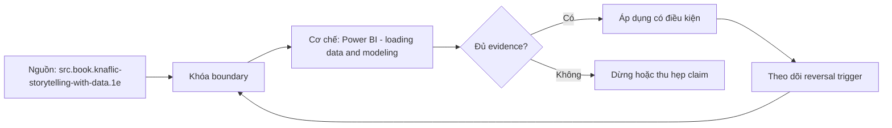

# Power BI - loading data and modeling

**Tóm tắt bản chất:** Giao diện và ba chế độ xem. Nạp từ Excel, CSV, SQL Server, PostgreSQL. Power Query trong Power BI, nối tiếp trực tiếp lesson 14. Mô hình dữ liệu: tạo quan hệ, hướng lọc, bản số. Cơ chế khiến lược đồ sao từ lesson 34 cho kết quả tổng hợp đúng còn bảng phẳng gây sai số. Bảng lịch và thao tác đánh dấu bảng ngày. Điểm quyết định là giữ đúng population, grain, thời gian và oracle trước khi tin output.

## Problem Definition and Operational Relevance

L049 bắt đầu từ một lỗi rất thực dụng: analyst có thể tạo được file, query hoặc dashboard đúng cú pháp nhưng không trả lời đúng câu hỏi. Với **Power BI - loading data and modeling**, hậu quả xuất hiện ở người ra quyết định; họ hành động trên một con số không còn truy được về population, grain hoặc assumption ban đầu.

Roadmap đặt chuẩn đầu ra như sau: Nạp dữ liệu từ cơ sở dữ liệu và dựng mô hình sao trong Power BI, với tổng kiểm chứng khớp với kết quả tính bằng SQL. Đây là năng lực quan sát được, không phải yêu cầu nhớ thuật ngữ. Nếu bằng chứng không cho reviewer tái hiện cùng kết luận, bài vẫn chưa đạt dù output nhìn hợp lý.

## Mechanism

Giao diện và ba chế độ xem. Nạp từ Excel, CSV, SQL Server, PostgreSQL. Power Query trong Power BI, nối tiếp trực tiếp lesson 14. Mô hình dữ liệu: tạo quan hệ, hướng lọc, bản số. Cơ chế khiến lược đồ sao từ lesson 34 cho kết quả tổng hợp đúng còn bảng phẳng gây sai số. Bảng lịch và thao tác đánh dấu bảng ngày.

Cơ chế của `power-bi-loading-data-and-modeling` được kiểm qua năm lớp: input và population; identity và grain; transformation; time boundary; consumer-visible output. Mỗi lớp cần một invariant ngắn, một failure có chủ ý và một phép đối soát độc lập. Command chạy thành công chỉ chứng minh execution; nó không chứng minh semantics.

Lỗi cần loại trừ trong bài này là: Nạp bảng phẳng thay vì lược đồ sao · để hướng lọc hai chiều mặc định gây vòng lặp · quên đánh dấu bảng ngày nên hàm thời gian không chạy đúng. Tách các lỗi ấy thành fixture riêng giúp chẩn đoán nguyên nhân thay vì sửa nhiều biến cùng lúc.

## Decision Framework

| Dấu hiệu | Quyết định | Bằng chứng bắt buộc |
|---|---|---|
| Population và grain rõ | Tiếp tục xử lý | Row count, uniqueness, control total |
| Assumption đổi nghĩa kết quả | Dừng và xác minh | Owner cùng impact-if-wrong |
| Dữ liệu thiếu nhưng đo được coverage | Phân tích có điều kiện | Missing report và limitation |
| Hai đường tính không khớp | Truy ngược boundary | Snapshot và reconciliation |
| Deadline không đủ cho phép kiểm | Co phạm vi | Non-goal và câu trả lời tạm thời |

Quy tắc của L049: chọn phương án đơn giản nhất vẫn giữ được điều kiện hoàn thành Tổng trên mô hình Power BI khớp tuyệt đối với tổng tính bằng SQL, và mô hình không chứa quan hệ vòng.. Không dùng độ phức tạp để che một câu hỏi chưa rõ.

## Worked Case: Power BI - loading data and modeling

Bài thực hành dùng nhiệm vụ thật của roadmap: Nạp `DS1` từ PostgreSQL. Dựng mô hình sao có bảng lịch. Kiểm chứng tổng khớp với SQL.

Trước khi thao tác ở `Power BI - loading data and modeling`, learner ghi expected result, grain, identity, cutoff và phép kiểm. Sau thao tác, họ giữ raw output cùng một oracle khác đường triển khai. Nếu hai đường không khớp, discrepancy trở thành kết quả cần điều tra; không được sửa expected cho giống output vừa thấy.

Biến thể khó hơn đổi một constraint: dữ liệu có bản ghi trùng, đến muộn, thiếu khóa hoặc có nhiều dòng con cho một thực thể. L049 chỉ được xem là transfer khi learner tự nhận ra phép tính nào không còn hợp lệ và thiết kế lại boundary mà không cần chép case mẫu.

## Limits and Common Errors

**Hiểu lầm:** Output của `Power BI - loading data and modeling` chạy được nghĩa là kết luận đúng. **Thực tế:** syntax không kiểm population, grain, cutoff hay định nghĩa nghiệp vụ. **Vì sao nghe hợp lý:** công cụ trả kết quả cụ thể và không hiển thị assumption đã bị bỏ qua.

**Hiểu lầm:** Thêm nhiều bước kiểm luôn làm phân tích đáng tin hơn. **Thực tế:** hai phép kiểm dùng chung dữ liệu và cùng logic có thể sai giống nhau. **Vì sao nghe hợp lý:** số lượng test tạo cảm giác độc lập dù oracle không độc lập.

**Hiểu lầm:** Có thể sửa edge case sau khi hoàn thành happy path. **Thực tế:** Nạp bảng phẳng thay vì lược đồ sao · để hướng lọc hai chiều mặc định gây vòng lặp · quên đánh dấu bảng ngày nên hàm thời gian không chạy đúng. **Vì sao nghe hợp lý:** dữ liệu mẫu nhỏ thường không chạm fan-out, missing, skew, late arrival hoặc changed constraint.

## Nếu Bạn Dạy Lại Điều Này...

Mở đầu L049 bằng một output trông hợp lý nhưng sai đúng một invariant. Người học viết dự đoán trước khi xem cơ chế. Exercise seed đổi duy nhất một constraint và yêu cầu họ nói rõ quyết định giữ nguyên hay đảo, cùng evidence đủ mạnh để thuyết phục reviewer.

## Ma trận kiểm chứng

### Probe 1: population

**Mệnh đề của probe 1: `population`.** Giao diện và ba chế độ xem. Nạp từ Excel, CSV, SQL Server, PostgreSQL. Power Query trong Power BI, nối tiếp trực tiếp lesson 14. Mô hình dữ liệu: tạo quan hệ, hướng lọc, bản số. Cơ chế khiến lược đồ sao từ lesson 34 cho kết quả tổng hợp đúng còn bảng phẳng gây sai số. Bảng lịch và thao tác đánh dấu bảng ngày.

**Thiết kế.** Probe 1 của L049 tạo fixture nhỏ cho `population` với một control và một bản ghi chỉ khác tại boundary đang xét. Expected result được khóa trước execution; snapshot, version, identity và state ban đầu đi cùng artifact.

**Oracle L049.1.** Đối soát `population` bằng đường tính khác implementation chính của `power-bi-loading-data-and-modeling`. Giữ command, raw observation, before/after counts và limitation. Probe chỉ đạt khi reviewer đi từ fixture tới cùng kết luận mà không hỏi tác giả đã chọn mặc định nào.

### Probe 2: grain

**Mệnh đề của probe 2: `grain`.** Nạp dữ liệu từ cơ sở dữ liệu và dựng mô hình sao trong Power BI, với tổng kiểm chứng khớp với kết quả tính bằng SQL.

**Thiết kế.** Probe 2 của L049 tạo fixture nhỏ cho `grain` với một control và một bản ghi chỉ khác tại boundary đang xét. Expected result được khóa trước execution; snapshot, version, identity và state ban đầu đi cùng artifact.

**Oracle L049.2.** Đối soát `grain` bằng đường tính khác implementation chính của `power-bi-loading-data-and-modeling`. Giữ command, raw observation, before/after counts và limitation. Probe chỉ đạt khi reviewer đi từ fixture tới cùng kết luận mà không hỏi tác giả đã chọn mặc định nào.

### Probe 3: identity

**Mệnh đề của probe 3: `identity`.** Nạp bảng phẳng thay vì lược đồ sao · để hướng lọc hai chiều mặc định gây vòng lặp · quên đánh dấu bảng ngày nên hàm thời gian không chạy đúng.

**Thiết kế.** Probe 3 của L049 tạo fixture nhỏ cho `identity` với một control và một bản ghi chỉ khác tại boundary đang xét. Expected result được khóa trước execution; snapshot, version, identity và state ban đầu đi cùng artifact.

**Oracle L049.3.** Đối soát `identity` bằng đường tính khác implementation chính của `power-bi-loading-data-and-modeling`. Giữ command, raw observation, before/after counts và limitation. Probe chỉ đạt khi reviewer đi từ fixture tới cùng kết luận mà không hỏi tác giả đã chọn mặc định nào.

### Probe 4: time cutoff

**Mệnh đề của probe 4: `time cutoff`.** Tổng trên mô hình Power BI khớp tuyệt đối với tổng tính bằng SQL, và mô hình không chứa quan hệ vòng.

**Thiết kế.** Probe 4 của L049 tạo fixture nhỏ cho `time cutoff` với một control và một bản ghi chỉ khác tại boundary đang xét. Expected result được khóa trước execution; snapshot, version, identity và state ban đầu đi cùng artifact.

**Oracle L049.4.** Đối soát `time cutoff` bằng đường tính khác implementation chính của `power-bi-loading-data-and-modeling`. Giữ command, raw observation, before/after counts và limitation. Probe chỉ đạt khi reviewer đi từ fixture tới cùng kết luận mà không hỏi tác giả đã chọn mặc định nào.

### Probe 5: missing versus zero

**Mệnh đề của probe 5: `missing versus zero`.** Giao diện và ba chế độ xem. Nạp từ Excel, CSV, SQL Server, PostgreSQL. Power Query trong Power BI, nối tiếp trực tiếp lesson 14. Mô hình dữ liệu: tạo quan hệ, hướng lọc, bản số. Cơ chế khiến lược đồ sao từ lesson 34 cho kết quả tổng hợp đúng còn bảng phẳng gây sai số. Bảng lịch và thao tác đánh dấu bảng ngày.

**Thiết kế.** Probe 5 của L049 tạo fixture nhỏ cho `missing versus zero` với một control và một bản ghi chỉ khác tại boundary đang xét. Expected result được khóa trước execution; snapshot, version, identity và state ban đầu đi cùng artifact.

**Oracle L049.5.** Đối soát `missing versus zero` bằng đường tính khác implementation chính của `power-bi-loading-data-and-modeling`. Giữ command, raw observation, before/after counts và limitation. Probe chỉ đạt khi reviewer đi từ fixture tới cùng kết luận mà không hỏi tác giả đã chọn mặc định nào.

### Probe 6: duplicate

**Mệnh đề của probe 6: `duplicate`.** Nạp dữ liệu từ cơ sở dữ liệu và dựng mô hình sao trong Power BI, với tổng kiểm chứng khớp với kết quả tính bằng SQL.

**Thiết kế.** Probe 6 của L049 tạo fixture nhỏ cho `duplicate` với một control và một bản ghi chỉ khác tại boundary đang xét. Expected result được khóa trước execution; snapshot, version, identity và state ban đầu đi cùng artifact.

**Oracle L049.6.** Đối soát `duplicate` bằng đường tính khác implementation chính của `power-bi-loading-data-and-modeling`. Giữ command, raw observation, before/after counts và limitation. Probe chỉ đạt khi reviewer đi từ fixture tới cùng kết luận mà không hỏi tác giả đã chọn mặc định nào.

### Probe 7: join fan-out

**Mệnh đề của probe 7: `join fan-out`.** Nạp bảng phẳng thay vì lược đồ sao · để hướng lọc hai chiều mặc định gây vòng lặp · quên đánh dấu bảng ngày nên hàm thời gian không chạy đúng.

**Thiết kế.** Probe 7 của L049 tạo fixture nhỏ cho `join fan-out` với một control và một bản ghi chỉ khác tại boundary đang xét. Expected result được khóa trước execution; snapshot, version, identity và state ban đầu đi cùng artifact.

**Oracle L049.7.** Đối soát `join fan-out` bằng đường tính khác implementation chính của `power-bi-loading-data-and-modeling`. Giữ command, raw observation, before/after counts và limitation. Probe chỉ đạt khi reviewer đi từ fixture tới cùng kết luận mà không hỏi tác giả đã chọn mặc định nào.

### Probe 8: changed definition

**Mệnh đề của probe 8: `changed definition`.** Tổng trên mô hình Power BI khớp tuyệt đối với tổng tính bằng SQL, và mô hình không chứa quan hệ vòng.

**Thiết kế.** Probe 8 của L049 tạo fixture nhỏ cho `changed definition` với một control và một bản ghi chỉ khác tại boundary đang xét. Expected result được khóa trước execution; snapshot, version, identity và state ban đầu đi cùng artifact.

**Oracle L049.8.** Đối soát `changed definition` bằng đường tính khác implementation chính của `power-bi-loading-data-and-modeling`. Giữ command, raw observation, before/after counts và limitation. Probe chỉ đạt khi reviewer đi từ fixture tới cùng kết luận mà không hỏi tác giả đã chọn mặc định nào.

### Probe 9: independent oracle

**Mệnh đề của probe 9: `independent oracle`.** Giao diện và ba chế độ xem. Nạp từ Excel, CSV, SQL Server, PostgreSQL. Power Query trong Power BI, nối tiếp trực tiếp lesson 14. Mô hình dữ liệu: tạo quan hệ, hướng lọc, bản số. Cơ chế khiến lược đồ sao từ lesson 34 cho kết quả tổng hợp đúng còn bảng phẳng gây sai số. Bảng lịch và thao tác đánh dấu bảng ngày.

**Thiết kế.** Probe 9 của L049 tạo fixture nhỏ cho `independent oracle` với một control và một bản ghi chỉ khác tại boundary đang xét. Expected result được khóa trước execution; snapshot, version, identity và state ban đầu đi cùng artifact.

**Oracle L049.9.** Đối soát `independent oracle` bằng đường tính khác implementation chính của `power-bi-loading-data-and-modeling`. Giữ command, raw observation, before/after counts và limitation. Probe chỉ đạt khi reviewer đi từ fixture tới cùng kết luận mà không hỏi tác giả đã chọn mặc định nào.

### Probe 10: replay

**Mệnh đề của probe 10: `replay`.** Nạp dữ liệu từ cơ sở dữ liệu và dựng mô hình sao trong Power BI, với tổng kiểm chứng khớp với kết quả tính bằng SQL.

**Thiết kế.** Probe 10 của L049 tạo fixture nhỏ cho `replay` với một control và một bản ghi chỉ khác tại boundary đang xét. Expected result được khóa trước execution; snapshot, version, identity và state ban đầu đi cùng artifact.

**Oracle L049.10.** Đối soát `replay` bằng đường tính khác implementation chính của `power-bi-loading-data-and-modeling`. Giữ command, raw observation, before/after counts và limitation. Probe chỉ đạt khi reviewer đi từ fixture tới cùng kết luận mà không hỏi tác giả đã chọn mặc định nào.

### Probe 11: fresh snapshot

**Mệnh đề của probe 11: `fresh snapshot`.** Nạp bảng phẳng thay vì lược đồ sao · để hướng lọc hai chiều mặc định gây vòng lặp · quên đánh dấu bảng ngày nên hàm thời gian không chạy đúng.

**Thiết kế.** Probe 11 của L049 tạo fixture nhỏ cho `fresh snapshot` với một control và một bản ghi chỉ khác tại boundary đang xét. Expected result được khóa trước execution; snapshot, version, identity và state ban đầu đi cùng artifact.

**Oracle L049.11.** Đối soát `fresh snapshot` bằng đường tính khác implementation chính của `power-bi-loading-data-and-modeling`. Giữ command, raw observation, before/after counts và limitation. Probe chỉ đạt khi reviewer đi từ fixture tới cùng kết luận mà không hỏi tác giả đã chọn mặc định nào.

### Probe 12: novel scenario

**Mệnh đề của probe 12: `novel scenario`.** Tổng trên mô hình Power BI khớp tuyệt đối với tổng tính bằng SQL, và mô hình không chứa quan hệ vòng.

**Thiết kế.** Probe 12 của L049 tạo fixture nhỏ cho `novel scenario` với một control và một bản ghi chỉ khác tại boundary đang xét. Expected result được khóa trước execution; snapshot, version, identity và state ban đầu đi cùng artifact.

**Oracle L049.12.** Đối soát `novel scenario` bằng đường tính khác implementation chính của `power-bi-loading-data-and-modeling`. Giữ command, raw observation, before/after counts và limitation. Probe chỉ đạt khi reviewer đi từ fixture tới cùng kết luận mà không hỏi tác giả đã chọn mặc định nào.

## Tự Kiểm Tra Nhanh

1. Năng lực nào phải chứng minh ở L049?

<details><summary>Đáp án</summary>

Nạp dữ liệu từ cơ sở dữ liệu và dựng mô hình sao trong Power BI, với tổng kiểm chứng khớp với kết quả tính bằng SQL.

</details>

2. Failure nào phải chủ động cài vào fixture?

<details><summary>Đáp án</summary>

Nạp bảng phẳng thay vì lược đồ sao · để hướng lọc hai chiều mặc định gây vòng lặp · quên đánh dấu bảng ngày nên hàm thời gian không chạy đúng.

</details>

3. Khi nào bài được xem là hoàn thành?

<details><summary>Đáp án</summary>

Tổng trên mô hình Power BI khớp tuyệt đối với tổng tính bằng SQL, và mô hình không chứa quan hệ vòng.

</details>

## Giới hạn và điều chưa cho phép kết luận

- Case và probe là protocol giảng dạy; chưa phải quan sát production.
- Con số minh họa không phải benchmark ngành.
- Concept key `ck.da.power-bi-loading-data-and-modeling` đã được owner phê duyệt `canonical`; note thuộc canonical registry coverage. Trạng thái này không tự chứng minh learner mastery.
- Note tồn tại không phải bằng chứng learner đã thành thạo.

## Reference
1. [[SRC-STORYTELLING-WITH-DATA]]: `src.book.knaflic-storytelling-with-data.1e`
2. [[SRC-DEFINITIVE-GUIDE-DAX-3E]]: `src.book.ferrari-russo-definitive-guide-dax.3e`

## Source coverage

| Source slice | Locator | Kiến thức phải giữ | Vị trí | Trạng thái | Ngoài phạm vi |
|---|---|---|---|---|---|
| [[SRC-STORYTELLING-WITH-DATA]]: `src.book.knaflic-storytelling-with-data.1e` | Source record và phạm vi đọc đã đăng ký | Cơ chế liên quan tới Power BI - loading data and modeling | các mục cơ chế, case và probe | Đã phủ | ngoài objective L049 |
| [[SRC-DEFINITIVE-GUIDE-DAX-3E]]: `src.book.ferrari-russo-definitive-guide-dax.3e` | Source record và phạm vi đọc đã đăng ký | Cơ chế liên quan tới Power BI - loading data and modeling | các mục cơ chế, case và probe | Đã phủ | ngoài objective L049 |

## Key takeaways
- Nạp dữ liệu từ cơ sở dữ liệu và dựng mô hình sao trong Power BI, với tổng kiểm chứng khớp với kết quả tính bằng SQL.
- Tổng trên mô hình Power BI khớp tuyệt đối với tổng tính bằng SQL, và mô hình không chứa quan hệ vòng.
- Kết luận chỉ có nghĩa trong population, grain, time và version đã công bố.
- Note tiếp theo được nối bằng `prerequisite_of`; mastery cần learner artifact riêng.

<!-- ATOMIC-EXECUTION-CAPSULE:START -->

## Execution capsule: kiểm chứng `wiki.da.power-bi-loading-data-and-modeling`

> [!important] Phân loại mệnh đề
> Với `wiki.da.power-bi-loading-data-and-modeling`, sơ đồ, ví dụ và artifact về **Power BI - loading data and modeling** là **synthesis để kiểm chứng**; chúng không phải trích dẫn hay case nguyên văn của nguồn.

### Sơ đồ cơ chế và điểm kiểm soát



Đọc sơ đồ `wiki.da.power-bi-loading-data-and-modeling` từ trái sang phải: source chỉ cung cấp claim ban đầu cho **Power BI - loading data and modeling**; quyết định chỉ được đi tiếp sau khi boundary, evidence và điều kiện đảo quyết định đã hiện hữu.

### Artifact thực thi tối thiểu

```yaml
concept_id: "wiki.da.power-bi-loading-data-and-modeling"
concept: "Power BI - loading data and modeling"
primary_question: "Làm sao áp dụng Power BI - loading data and modeling và chứng minh kết quả không xanh giả?"
decision_contract:
  input_boundary: "Ghi population, thời điểm, owner và điều chưa biết"
  hard_constraints:
    - "Không vượt quyền hoặc privacy boundary"
    - "Không dùng cùng một assumption làm cả implementation và oracle"
  accept_when: "Có observation phân biệt được các lựa chọn"
  reversal_trigger: "Một hard constraint sai hoặc evidence mới đổi recommendation"
evidence_to_keep:
  - "input snapshot"
  - "chosen and rejected options"
  - "independent review result"
```

Artifact của `wiki.da.power-bi-loading-data-and-modeling` buộc người dùng ghi boundary, oracle và reversal trigger cho **Power BI - loading data and modeling**. Các giá trị minh họa phải được thay bằng evidence thật trước khi dùng cho quyết định.

<!-- ATOMIC-EXECUTION-CAPSULE:END -->
