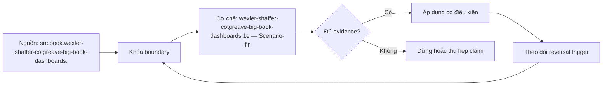

# wexler-shaffer-cotgreave-big-book-dashboards.1e — Scenario-first dashboard design

**Tóm tắt bản chất:** Bắt đầu từ audience, decision và usage cadence; layout chỉ đến sau câu hỏi. Note này biến ý tưởng thành decision protocol có thể kiểm tra, không biến lời tác giả thành chân lý ngoài bối cảnh.

## Nỗi Đau & Động Lực

Vấn đề mà **Scenario-first dashboard design** giải quyết không phải thiếu thuật ngữ. Đó là lúc người làm dữ liệu phải chọn một hành động nhưng input, boundary và cost of error còn lẫn vào nhau. Khi bỏ qua boundary, một rule đúng trong ví dụ của *The Big Book of Dashboards* bị kéo sang workload khác và tạo kết luận tự tin hơn bằng chứng.

Cái giá của lỗi `wexler-shaffer-cotgreave-big-book-dashboards.1e.1` quanh **Scenario-first dashboard design** xuất hiện ở consumer: quyết định sai population, tối ưu nhầm metric, mất khả năng replay hoặc không biết lúc nào cần đảo lựa chọn. Vì vậy note khóa bốn thứ trước: claim, conditions, observable artifact và falsifier. Locator gốc cho phần này là **PDF 141–149**; locator chỉ dẫn tới vùng cần đọc lại, không thay thế việc kiểm source khi claim có tác động cao.

## Cơ Chế Tác Động

Bắt đầu từ audience, decision và usage cadence; layout chỉ đến sau câu hỏi.

Với `wexler-shaffer-cotgreave-big-book-dashboards.1e.1`, cơ chế của **Scenario-first dashboard design** được tách thành sáu bước. (1) Xác định decision và owner. (2) Khóa population, identity, grain và time boundary. (3) Ghi input/precondition cùng unknown có impact-if-wrong. (4) Áp rule hoặc framework ở đúng scope. (5) Tạo observable artifact: bảng, query, model card, dashboard state, run log hoặc decision record. (6) Đối soát bằng oracle không dùng chung assumption với implementation chính.

Phần của tác giả cho `wexler-shaffer-cotgreave-big-book-dashboards.1e.1` là khái niệm và trade-off nằm trong `SRC-WEXLER-SHAFFER-COTGREAVE-BIG-BOOK-DASHBOARDS-1E` tại PDF 141–149. Phần synthesis của pack là việc chuyển nó thành protocol sáu bước và evidence checklist. Hai lớp này cố ý tách nhau: synthesis có thể thay đổi theo destination, còn attribution và locator không được thay.

## Bản Đồ Quyết Định

| Điều kiện | Chọn | Tránh | Bằng chứng |
|---|---|---|---|
| Preconditions rõ và failure recoverable | Áp dụng bounded pilot | Rollout rộng | Fixture, baseline, rollback |
| Unknown đổi semantics | Dừng để xác minh | Tự điền mặc định | Owner, impact-if-wrong |
| Hai option cùng qua hard constraints | Chọn option đơn giản/reversible | Weighted score che hard failure | ADR ngắn, revisit signal |
| Dữ liệu thiếu nhưng coverage đo được | Kết luận có điều kiện | Impute âm thầm | Missing report, sensitivity |
| Consumer harm cao | Tăng independent review | Dùng output như advisory nhẹ | Approval, audit trail |

Default của **Scenario-first dashboard design** là thử ở boundary nhỏ nhất tạo ra observation phân biệt được hai lựa chọn. Nếu experiment không thể làm recommendation đảo trong bất kỳ kết quả nào, nó không giảm uncertainty và không đáng chạy.

## Case Study Thực Chiến: áp dụng Scenario-first dashboard design dưới ràng buộc thay đổi

Một biên tập viên dùng **Scenario-first dashboard design** cho dashboard doanh thu theo vùng. Reviewer dựng lại cùng dữ liệu với scale, denominator và annotation công khai, rồi cho ba người đọc trả lời cùng câu hỏi. Khi hai encoding dẫn tới hai kết luận khác nhau, nhóm giữ bản bảo toàn quan hệ dữ liệu và ghi rõ uncertainty thay vì chọn bản bắt mắt hơn.

Biến thể khó hơn của `wexler-shaffer-cotgreave-big-book-dashboards.1e.1` đổi constraint quanh **Scenario-first dashboard design**: deadline từ một tuần xuống hai giờ, hoặc volume tăng 100 lần. Đội không được giảm ngưỡng correctness để kịp hạn. Họ giảm phạm vi câu trả lời, giữ hard constraints và ghi phần chưa kiểm là unknown. Đây là transfer test: dùng cùng reasoning nhưng output khác vì cost, reversibility và evidence budget đã đổi.

## Góc Khuất & Ngộ Nhận

**Hiểu lầm:** Framework trong *The Big Book of Dashboards* là checklist áp dụng nguyên xi. **Thực tế:** Bắt đầu từ audience, decision và usage cadence; layout chỉ đến sau câu hỏi. **Vì sao nghe hợp lý:** tên framework làm các bước trông độc lập với population, version và organization context.

**Hiểu lầm `wexler-shaffer-cotgreave-big-book-dashboards.1e.1-B`:** Có nhiều metric hoặc test quanh **Scenario-first dashboard design** hơn luôn làm kết luận chắc hơn. **Thực tế:** checks dùng chung data-generating assumption có thể sai đồng thời. **Vì sao nghe hợp lý:** số lượng output tạo cảm giác triangulation dù không có oracle độc lập.

**Hiểu lầm `wexler-shaffer-cotgreave-big-book-dashboards.1e.1-C`:** Một case thành công của **Scenario-first dashboard design** chứng minh cơ chế tổng quát. **Thực tế:** case chỉ chứng minh observation trong fixture, version và scale đã chạy. **Vì sao nghe hợp lý:** narrative hoàn chỉnh che những changed constraints chưa xuất hiện.

Edge case `wexler-shaffer-cotgreave-big-book-dashboards.1e.1-selection` của **Scenario-first dashboard design** là selection: dữ liệu quan sát được có thể chỉ là phần đã qua filter, instrumentation hoặc survivor process. Edge case `wexler-shaffer-cotgreave-big-book-dashboards.1e.1-delay` tại PDF 141–149 là delayed feedback: output hôm nay chưa có outcome để xác nhận. Cả hai yêu cầu giới hạn claim thay vì thêm tính từ “có khả năng”.

## Nếu Bạn Dạy Lại Điều Này...

Khi dạy `wexler-shaffer-cotgreave-big-book-dashboards.1e.1`, mở bằng hai phương án xử lý **Scenario-first dashboard design** đều hợp lý và một constraint bị giấu. Người học phải viết decision trước, sau đó hỏi đúng câu làm lộ constraint. Exercise seed đổi một assumption và yêu cầu chỉ ra artifact, oracle, rollback cùng signal khiến quyết định đảo.

## Ma trận kiểm chứng từng mệnh đề

### Probe 1: definition boundary

**Mệnh đề wexler-shaffer-cotgreave-big-book-dashboards.1e.1.1.** `Scenario-first dashboard design` giữ được claim “Bắt đầu từ audience, decision và usage cadence; layout chỉ đến sau câu hỏi.” khi thay đổi `definition boundary` trong scope đã công bố.

**Thiết kế phép thử `wexler-shaffer-cotgreave-big-book-dashboards.1e.1.1` cho `definition boundary`.** Tạo control và variant chỉ khác ở `definition boundary`; khóa source snapshot, version, seed, identity, state và expected result trước execution. Với technical artifact, giữ command và raw output. Với decision artifact, giữ input table, chosen option, rejected option và reversal trigger.

**Bằng chứng cần giữ cho `wexler-shaffer-cotgreave-big-book-dashboards.1e.1.1` và biến `definition boundary`.** Observation, before/after measure, discrepancy, limitation và reviewer conclusion. Probe không đạt nếu expected được sửa sau khi nhìn output, hoặc oracle dùng lại chính transformation đang được kiểm.

### Probe 2: input and preconditions

**Mệnh đề wexler-shaffer-cotgreave-big-book-dashboards.1e.1.2.** `Scenario-first dashboard design` giữ được claim “Bắt đầu từ audience, decision và usage cadence; layout chỉ đến sau câu hỏi.” khi thay đổi `input and preconditions` trong scope đã công bố.

**Thiết kế phép thử `wexler-shaffer-cotgreave-big-book-dashboards.1e.1.2` cho `input and preconditions`.** Tạo control và variant chỉ khác ở `input and preconditions`; khóa source snapshot, version, seed, identity, state và expected result trước execution. Với technical artifact, giữ command và raw output. Với decision artifact, giữ input table, chosen option, rejected option và reversal trigger.

**Bằng chứng cần giữ cho `wexler-shaffer-cotgreave-big-book-dashboards.1e.1.2` và biến `input and preconditions`.** Observation, before/after measure, discrepancy, limitation và reviewer conclusion. Probe không đạt nếu expected được sửa sau khi nhìn output, hoặc oracle dùng lại chính transformation đang được kiểm.

### Probe 3: decision threshold

**Mệnh đề wexler-shaffer-cotgreave-big-book-dashboards.1e.1.3.** `Scenario-first dashboard design` giữ được claim “Bắt đầu từ audience, decision và usage cadence; layout chỉ đến sau câu hỏi.” khi thay đổi `decision threshold` trong scope đã công bố.

**Thiết kế phép thử `wexler-shaffer-cotgreave-big-book-dashboards.1e.1.3` cho `decision threshold`.** Tạo control và variant chỉ khác ở `decision threshold`; khóa source snapshot, version, seed, identity, state và expected result trước execution. Với technical artifact, giữ command và raw output. Với decision artifact, giữ input table, chosen option, rejected option và reversal trigger.

**Bằng chứng cần giữ cho `wexler-shaffer-cotgreave-big-book-dashboards.1e.1.3` và biến `decision threshold`.** Observation, before/after measure, discrepancy, limitation và reviewer conclusion. Probe không đạt nếu expected được sửa sau khi nhìn output, hoặc oracle dùng lại chính transformation đang được kiểm.

### Probe 4: counterexample

**Mệnh đề wexler-shaffer-cotgreave-big-book-dashboards.1e.1.4.** `Scenario-first dashboard design` giữ được claim “Bắt đầu từ audience, decision và usage cadence; layout chỉ đến sau câu hỏi.” khi thay đổi `counterexample` trong scope đã công bố.

**Thiết kế phép thử `wexler-shaffer-cotgreave-big-book-dashboards.1e.1.4` cho `counterexample`.** Tạo control và variant chỉ khác ở `counterexample`; khóa source snapshot, version, seed, identity, state và expected result trước execution. Với technical artifact, giữ command và raw output. Với decision artifact, giữ input table, chosen option, rejected option và reversal trigger.

**Bằng chứng cần giữ cho `wexler-shaffer-cotgreave-big-book-dashboards.1e.1.4` và biến `counterexample`.** Observation, before/after measure, discrepancy, limitation và reviewer conclusion. Probe không đạt nếu expected được sửa sau khi nhìn output, hoặc oracle dùng lại chính transformation đang được kiểm.

### Probe 5: failure mode

**Mệnh đề wexler-shaffer-cotgreave-big-book-dashboards.1e.1.5.** `Scenario-first dashboard design` giữ được claim “Bắt đầu từ audience, decision và usage cadence; layout chỉ đến sau câu hỏi.” khi thay đổi `failure mode` trong scope đã công bố.

**Thiết kế phép thử `wexler-shaffer-cotgreave-big-book-dashboards.1e.1.5` cho `failure mode`.** Tạo control và variant chỉ khác ở `failure mode`; khóa source snapshot, version, seed, identity, state và expected result trước execution. Với technical artifact, giữ command và raw output. Với decision artifact, giữ input table, chosen option, rejected option và reversal trigger.

**Bằng chứng cần giữ cho `wexler-shaffer-cotgreave-big-book-dashboards.1e.1.5` và biến `failure mode`.** Observation, before/after measure, discrepancy, limitation và reviewer conclusion. Probe không đạt nếu expected được sửa sau khi nhìn output, hoặc oracle dùng lại chính transformation đang được kiểm.

### Probe 6: changed scale

**Mệnh đề wexler-shaffer-cotgreave-big-book-dashboards.1e.1.6.** `Scenario-first dashboard design` giữ được claim “Bắt đầu từ audience, decision và usage cadence; layout chỉ đến sau câu hỏi.” khi thay đổi `changed scale` trong scope đã công bố.

**Thiết kế phép thử `wexler-shaffer-cotgreave-big-book-dashboards.1e.1.6` cho `changed scale`.** Tạo control và variant chỉ khác ở `changed scale`; khóa source snapshot, version, seed, identity, state và expected result trước execution. Với technical artifact, giữ command và raw output. Với decision artifact, giữ input table, chosen option, rejected option và reversal trigger.

**Bằng chứng cần giữ cho `wexler-shaffer-cotgreave-big-book-dashboards.1e.1.6` và biến `changed scale`.** Observation, before/after measure, discrepancy, limitation và reviewer conclusion. Probe không đạt nếu expected được sửa sau khi nhìn output, hoặc oracle dùng lại chính transformation đang được kiểm.

### Probe 7: changed time window

**Mệnh đề wexler-shaffer-cotgreave-big-book-dashboards.1e.1.7.** `Scenario-first dashboard design` giữ được claim “Bắt đầu từ audience, decision và usage cadence; layout chỉ đến sau câu hỏi.” khi thay đổi `changed time window` trong scope đã công bố.

**Thiết kế phép thử `wexler-shaffer-cotgreave-big-book-dashboards.1e.1.7` cho `changed time window`.** Tạo control và variant chỉ khác ở `changed time window`; khóa source snapshot, version, seed, identity, state và expected result trước execution. Với technical artifact, giữ command và raw output. Với decision artifact, giữ input table, chosen option, rejected option và reversal trigger.

**Bằng chứng cần giữ cho `wexler-shaffer-cotgreave-big-book-dashboards.1e.1.7` và biến `changed time window`.** Observation, before/after measure, discrepancy, limitation và reviewer conclusion. Probe không đạt nếu expected được sửa sau khi nhìn output, hoặc oracle dùng lại chính transformation đang được kiểm.

### Probe 8: adversarial case

**Mệnh đề wexler-shaffer-cotgreave-big-book-dashboards.1e.1.8.** `Scenario-first dashboard design` giữ được claim “Bắt đầu từ audience, decision và usage cadence; layout chỉ đến sau câu hỏi.” khi thay đổi `adversarial case` trong scope đã công bố.

**Thiết kế phép thử `wexler-shaffer-cotgreave-big-book-dashboards.1e.1.8` cho `adversarial case`.** Tạo control và variant chỉ khác ở `adversarial case`; khóa source snapshot, version, seed, identity, state và expected result trước execution. Với technical artifact, giữ command và raw output. Với decision artifact, giữ input table, chosen option, rejected option và reversal trigger.

**Bằng chứng cần giữ cho `wexler-shaffer-cotgreave-big-book-dashboards.1e.1.8` và biến `adversarial case`.** Observation, before/after measure, discrepancy, limitation và reviewer conclusion. Probe không đạt nếu expected được sửa sau khi nhìn output, hoặc oracle dùng lại chính transformation đang được kiểm.

### Probe 9: independent oracle

**Mệnh đề wexler-shaffer-cotgreave-big-book-dashboards.1e.1.9.** `Scenario-first dashboard design` giữ được claim “Bắt đầu từ audience, decision và usage cadence; layout chỉ đến sau câu hỏi.” khi thay đổi `independent oracle` trong scope đã công bố.

**Thiết kế phép thử `wexler-shaffer-cotgreave-big-book-dashboards.1e.1.9` cho `independent oracle`.** Tạo control và variant chỉ khác ở `independent oracle`; khóa source snapshot, version, seed, identity, state và expected result trước execution. Với technical artifact, giữ command và raw output. Với decision artifact, giữ input table, chosen option, rejected option và reversal trigger.

**Bằng chứng cần giữ cho `wexler-shaffer-cotgreave-big-book-dashboards.1e.1.9` và biến `independent oracle`.** Observation, before/after measure, discrepancy, limitation và reviewer conclusion. Probe không đạt nếu expected được sửa sau khi nhìn output, hoặc oracle dùng lại chính transformation đang được kiểm.

### Probe 10: transfer scenario

**Mệnh đề wexler-shaffer-cotgreave-big-book-dashboards.1e.1.10.** `Scenario-first dashboard design` giữ được claim “Bắt đầu từ audience, decision và usage cadence; layout chỉ đến sau câu hỏi.” khi thay đổi `transfer scenario` trong scope đã công bố.

**Thiết kế phép thử `wexler-shaffer-cotgreave-big-book-dashboards.1e.1.10` cho `transfer scenario`.** Tạo control và variant chỉ khác ở `transfer scenario`; khóa source snapshot, version, seed, identity, state và expected result trước execution. Với technical artifact, giữ command và raw output. Với decision artifact, giữ input table, chosen option, rejected option và reversal trigger.

**Bằng chứng cần giữ cho `wexler-shaffer-cotgreave-big-book-dashboards.1e.1.10` và biến `transfer scenario`.** Observation, before/after measure, discrepancy, limitation và reviewer conclusion. Probe không đạt nếu expected được sửa sau khi nhìn output, hoặc oracle dùng lại chính transformation đang được kiểm.

## Tự Kiểm Tra Nhanh

1. Claim trung tâm của `Scenario-first dashboard design` là gì?

<details><summary>Đáp án</summary>

Bắt đầu từ audience, decision và usage cadence; layout chỉ đến sau câu hỏi.

</details>

2. Khi nào phải dừng thay vì áp framework?

<details><summary>Đáp án</summary>

Khi unknown làm đổi semantics, blast radius, quyền riêng tư, hard constraint hoặc tiêu chí đạt; ghi owner và impact-if-wrong trước khi tiếp tục.

</details>

3. Bằng chứng nào mạnh hơn một case thành công?

<details><summary>Đáp án</summary>

Control/variant có expected khóa trước, oracle độc lập, changed-constraint test và artifact đủ để reviewer tái hiện.

</details>

## Giới hạn và điều chưa cho phép kết luận

- Locator **PDF 141–149** là vùng đọc đại diện, không phải tuyên bố toàn bộ sách đã được chuyển thành note này.
- Ví dụ là synthesis để kiểm transfer, không phải trải nghiệm production hay case nguyên văn của tác giả.
- Concept key `ck.book.wexler-shaffer-cotgreave-big-book-dashboards.1e.scenario-first-dashboard-design` đã được owner phê duyệt `canonical`; note thuộc canonical registry coverage. Trạng thái này không tự chứng minh learner mastery.
- Nguồn private, copyrighted; không được public hoặc trích dài nếu chưa có authority.

## Reference
1. [[SRC-WEXLER-SHAFFER-COTGREAVE-BIG-BOOK-DASHBOARDS-1E]] — `src.book.wexler-shaffer-cotgreave-big-book-dashboards.1e`, PDF 141–149.

## Source coverage

| Source slice | Locator | Kiến thức phải giữ | Vị trí | Trạng thái | Ngoài phạm vi |
|---|---|---|---|---|---|
| [[SRC-WEXLER-SHAFFER-COTGREAVE-BIG-BOOK-DASHBOARDS-1E]] — `src.book.wexler-shaffer-cotgreave-big-book-dashboards.1e` | PDF 141–149 | Bắt đầu từ audience, decision và usage cadence; layout chỉ đến sau câu hỏi. | mechanism, decision, case, probes | Đã phủ | các chapter và framework khác |

## Key takeaways
- Bắt đầu từ audience, decision và usage cadence; layout chỉ đến sau câu hỏi.
- Tách author claim, synthesis và application; không gộp thành một giọng.
- Changed constraint mạnh hơn recall khi kiểm khả năng áp dụng.
- Note kế tiếp theo `prerequisite_of`; output thực tế cần evidence riêng.

<!-- ATOMIC-EXECUTION-CAPSULE:START -->

## Execution capsule — kiểm chứng `wiki.book.wexler-shaffer-cotgreave-big-book-dashboards.1e.scenario-first-dashboard-design`

> [!important] Phân loại mệnh đề
> Với `wiki.book.wexler-shaffer-cotgreave-big-book-dashboards.1e.scenario-first-dashboard-design`, sơ đồ, ví dụ và artifact về **wexler-shaffer-cotgreave-big-book-dashboards.1e — Scenario-first dashboard design** là **synthesis để kiểm chứng**; chúng không phải trích dẫn hay case nguyên văn của nguồn.

### Sơ đồ cơ chế và điểm kiểm soát



Đọc sơ đồ `wiki.book.wexler-shaffer-cotgreave-big-book-dashboards.1e.scenario-first-dashboard-design` từ trái sang phải: source chỉ cung cấp claim ban đầu cho **wexler-shaffer-cotgreave-big-book-dashboards.1e — Scenario-first dashboard design**; quyết định chỉ được đi tiếp sau khi boundary, evidence và điều kiện đảo quyết định đã hiện hữu.

### Artifact thực thi tối thiểu

```yaml
concept_id: "wiki.book.wexler-shaffer-cotgreave-big-book-dashboards.1e.scenario-first-dashboard-design"
concept: "wexler-shaffer-cotgreave-big-book-dashboards.1e — Scenario-first dashboard design"
primary_question: "Khi nào dùng Scenario-first dashboard design, quyết định nào nó hỗ trợ và bằng chứng nào bác bỏ được kết luận?"
decision_contract:
  input_boundary: "Ghi population, thời điểm, owner và điều chưa biết"
  hard_constraints:
    - "Không vượt quyền hoặc privacy boundary"
    - "Không dùng cùng một assumption làm cả implementation và oracle"
  accept_when: "Có observation phân biệt được các lựa chọn"
  reversal_trigger: "Một hard constraint sai hoặc evidence mới đổi recommendation"
evidence_to_keep:
  - "input snapshot"
  - "chosen and rejected options"
  - "independent review result"
```

Artifact của `wiki.book.wexler-shaffer-cotgreave-big-book-dashboards.1e.scenario-first-dashboard-design` buộc người dùng ghi boundary, oracle và reversal trigger cho **wexler-shaffer-cotgreave-big-book-dashboards.1e — Scenario-first dashboard design**. Các giá trị minh họa phải được thay bằng evidence thật trước khi dùng cho quyết định.

<!-- ATOMIC-EXECUTION-CAPSULE:END -->
