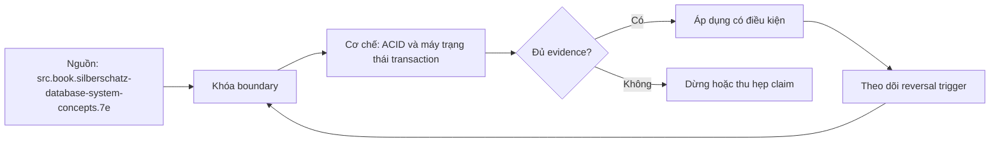

# ACID và máy trạng thái transaction

> [!abstract] Câu hỏi trung tâm
> Với một transaction cụ thể, điều gì phải tất cả hoặc không, invariant nào phải đúng, concurrent schedules nào được chấp nhận, success phải sống qua failure nào, và trạng thái nào cho phép phát biểu các cam kết đó?

## 1. ACID là contract, không phải nhãn sản phẩm

Atomicity, consistency, isolation và durability mô tả bốn khía cạnh khác nhau của transaction. Một database tự nhận ACID chưa nói isolation level, durability mode, external side effects, distributed boundary hoặc invariant application. Mỗi chữ phải được viết thành failure example và evidence.

Một transaction có thể atomic trong một database nhưng operation business vẫn không atomic nếu còn message, API hoặc filesystem ngoài transaction. Một constraint có thể giữ structural consistency nhưng không biết business rule. Durability có thể local-only hoặc phụ thuộc replication acknowledgment.

## 2. Atomicity

Atomicity yêu cầu effects trong phạm vi transaction xuất hiện toàn bộ hoặc không xuất hiện. Chuyển 50 từ A sang B không được để A giảm mà B chưa tăng sau abort/failure. Runtime abort dùng recovery/MVCC mechanisms; crash recovery dùng WAL/visibility theo engine.

Atomicity không có nghĩa mọi statement chạy tức thời hoặc người khác không bao giờ quan sát chờ/lock. Nó cũng không rollback được external email, HTTP call hoặc tiền đã giải ngân ngoài DB. Những side effects cần outbox, idempotency, compensation hoặc protocol rộng hơn.

## 3. Consistency

Consistency trong ACID nói transaction đúng phải đưa database từ state thỏa invariants sang state thỏa invariants. Engine enforce những rule được biểu diễn: type, NOT NULL, unique, check, foreign key, exclusion và trigger/procedure phù hợp. Business invariant không khai báo thì engine không tự biết.

Ví dụ tổng A+B không đổi cần transaction code đúng; constraint cục bộ có thể không diễn tả được. Under concurrency, transaction riêng lẻ đúng vẫn tạo write skew nếu isolation không bảo vệ invariant nhiều rows. Vì vậy consistency là trách nhiệm chia sẻ giữa schema, transaction logic, isolation/locking và input/domain controls.

## 4. Isolation

Isolation yêu cầu concurrent execution có behavior theo isolation contract. Mức lý tưởng serializable cho outcome tương đương một serial order, không nhất thiết chạy tuần tự hay theo wall-clock order. Mức thấp hơn cho phép một số phenomena để đổi coordination/performance.

Trong PostgreSQL, Read Uncommitted map thành Read Committed; Read Committed dùng snapshot theo statement; Repeatable Read dùng snapshot isolation và vẫn có serialization anomalies; Serializable dùng SSI và có thể abort transaction để giữ serializability. Ứng dụng phải retry toàn transaction khi serialization failure.

## 5. Durability

Durability là success đã acknowledge vẫn tồn tại qua failure class đã hứa. PostgreSQL synchronous local commit đợi local WAL durable; asynchronous commit có thể mất recent acknowledged transactions; remote modes thay boundary. Media destruction cần backup/replica, không được suy từ local WAL.

Durability không nói data không bao giờ bị xóa bởi transaction sau, operator error hoặc retention policy. Nó nói committed effect không bị quên vì failure nằm trong model. Phải ghi model: process, OS/power, disk, node hay site.

## 6. Bốn phản ví dụ có dữ liệu

Atomicity: A=100, B=200; trừ 50 ở A rồi crash trước cộng B; state 50/200 không được visible như kết quả transaction. Consistency: limit tổng credit ≤300 nhưng hai approvals mỗi bên thấy headroom rồi cùng commit thành 360; rule đúng từng transaction chưa đủ nếu isolation yếu.

Isolation: T1 đọc tổng 100; T2 thêm row và commit; T1 đọc lại thành 150 trong mode cho phép nonrepeatable/phantom behavior. Durability: DB trả success cho ID `tx-42`, process crash, restart không còn `tx-42` dù contract là synchronous durable; đó là violation nếu storage assumptions giữ.

Phản ví dụ phải chỉ exact invariant, schedule, commit/abort và observed state. Câu dữ liệu sai không đủ chấm.

## 7. Máy trạng thái học thuật

Mô hình textbook gồm Active, Partially Committed, Failed, Aborted, Committed và có thể Terminated. Active khi statements chạy. Sau statement cuối, transaction là Partially Committed: execution logic xong nhưng commit record/durability chưa chắc xong. Failure chuyển Active/Partially Committed sang Failed; rollback hoàn tất chuyển Aborted. Commit protocol thành công chuyển Partially Committed sang Committed.

Aborted transaction có thể restart nếu failure transient và policy cho phép, hoặc terminate. Committed transaction không được abort ngược; muốn đảo business effect phải có compensating transaction mới, với semantics và audit riêng.

## 8. State của client không đồng nhất state của database

Client thường chỉ thấy idle, in transaction, error và command result qua driver. Network timeout sau server commit nhưng trước client nhận ACK tạo trạng thái bất định: server có thể committed còn client nghĩ failed. Không thể giải bằng rollback từ connection đã mất.

Gắn operation ID/business key, query outcome và retry idempotently. Transaction state machine cần hai perspectives: server durable state và client knowledge state. Không nhận response không phải bằng chứng abort.

## 9. PostgreSQL transaction block và failed state

`BEGIN` mở block; statements chạy; `COMMIT` hoặc `ROLLBACK` kết thúc. Khi một statement lỗi trong block, PostgreSQL thường đặt transaction vào aborted/failed transaction state; các statement tiếp theo bị từ chối cho đến `ROLLBACK` hoặc rollback về savepoint thích hợp.

Savepoint tạo điểm rollback nội bộ nhưng không biến external side effect thành transactional. Rollback to savepoint không release mọi effect giống full abort trong mọi hệ; lock behavior phải kiểm version/type. Bài này tập trung model, không thay manual driver.

## 10. Commit boundary và partial commit

Partially committed không có nghĩa một nửa business rows đã được public. Nó là trạng thái giữa final operation và durable commit. Engine có thể đã tạo row versions/WAL nhưng visibility/durability boundary chưa hoàn tất.

Sự phân biệt này giải thích crash đúng lúc đang commit: outcome không thể dự đoán từ client timing. Nếu commit record durable trước crash, transaction có thể sống; nếu chưa, không. Client ACK còn là boundary khác.

## 11. Atomicity và durability dùng chung recovery substrate

WAL giữ đủ evidence để redo committed changes và theo design có thể hỗ trợ undo. PostgreSQL dùng REDO cùng transaction status/MVCC để versions của incomplete transaction không visible. Durability chọn commit flush boundary; atomicity chọn visibility/abort behavior.

Không nên nói atomicity chỉ do undo vì engine design khác. Cũng không nói durability chỉ do WAL: reliable sync/storage, checkpoint/recovery và checksum/backup controls cùng quan trọng.

## 12. Isolation là thuộc tính được cấu hình

SQL isolation không phải on/off. Default PostgreSQL Read Committed không phải mức cao nhất. Hai SELECT trong cùng transaction có thể thấy snapshots khác nhau. Repeatable Read giữ snapshot transaction nhưng cần retry update conflicts và không tự bảo vệ mọi invariant. Serializable cung cấp guarantee mạnh hơn bằng detection/abort.

Hạ isolation không phải chữ duy nhất có thể tắt vô hại. Async commit hạ durability contract; bỏ constraint làm yếu consistency controls. Phát biểu đúng là isolation thường có standardized levels và explicit performance trade-offs, không phải chỉ isolation mới có cấu hình.

## 13. Retry là phần của contract

Serializable/OCC/deadlock có thể abort transaction đúng thiết kế. Ứng dụng phải retry toàn logical transaction từ fresh state, với bounded attempts/backoff/deadline. Retry một statement giữa transaction cũ có thể dùng stale assumptions.

External side effects trước commit khiến retry lặp. Outbox hoặc defer side effect tới sau durable commit; post-commit dispatch vẫn cần idempotency. Log operation ID và attempt ID riêng.

## 14. Consistency không đồng nghĩa CAP consistency

ACID consistency là invariant preservation của transaction. CAP consistency thường nói linearizable/single-copy behavior trong distributed system. Hai chữ cùng tên nhưng không thay thế nhau. Eventual consistency cũng là replication/convergence concept, không có nghĩa application invariants tự đúng.

Bài giảng phải nói rõ ngữ cảnh. Không dùng database consistent mà không nói invariant, snapshot/ordering hoặc replicas.

## 15. Transaction boundary và services

Local database transaction không bao phủ hai services độc lập. 2PC, saga/outbox và compensation có trade-offs khác. Gọi chuỗi local transactions là một ACID transaction là sai nếu không có atomic commitment protocol.

Ngay trong một service, transaction quá dài giữ snapshots/locks, tăng conflict và cản vacuum. Boundary nên bao use case/invariant nhỏ nhất cần atomicity, không bao network call chậm nếu tránh được.

## 16. Evidence cho từng chữ

Atomicity: inject failure giữa steps, kiểm all-or-none và invisible aborted rows. Consistency: executable constraints/invariant assertions trước/sau. Isolation: deterministic concurrent schedule/barrier, result set và accepted aborts. Durability: ACK ledger, crash/restart và survived IDs.

Mỗi test ghi database version, isolation/commit mode, seed, schedule, operation IDs và raw output. Một successful run không chứng minh mọi interleaving; concurrency tests cần lặp và deterministic coordination.

## 17. Vẽ state machine có ích

Sơ đồ nên ghi states, events và guards: `BEGIN`, statement success/error, final statement, commit WAL durable, rollback complete, serialization failure, client disconnect. Tách server state với client belief bằng hai lanes nếu phân tích ambiguity.

Mỗi transition gắn observable: driver status, server log, row visibility, transaction status, ACK. Transition không quan sát trực tiếp phải ghi inference và source. Không vẽ `COMMIT request → committed` như một bước nguyên tử từ góc client.

## 18. Các ngộ nhận cần loại

- ACID do engine bảo đảm hết: consistency còn phụ thuộc invariant/code; external effects ngoài boundary.
- Atomicity nghĩa không có state trung gian: state nội bộ có, nhưng không được lộ trái contract.
- Isolation mặc định là serializable: PostgreSQL mặc định Read Committed.
- Committed có thể rollback: cần compensating transaction mới.
- Timeout nghĩa transaction fail: outcome có thể bất định.
- Durable nghĩa không bao giờ mất: luôn có failure model và storage assumptions.

## 19. Câu hỏi tự kiểm tra

1. Engine và application chia consistency responsibility thế nào?
2. Partially Committed khác Committed ở đâu?
3. Vì sao client timeout không chứng minh abort?
4. Serializable guarantee khác wall-clock order thế nào?
5. PostgreSQL async commit thay chữ nào trong ACID contract?
6. Vì sao committed transaction chỉ có thể đảo bằng compensation?

## 20. Giới hạn và điều chưa cho phép kết luận

- Chưa chạy bốn failure examples hoặc state observation lab.
- Transaction states exposed qua driver khác nhau; cần kiểm adapter cụ thể.
- Distributed transaction, 2PC và saga chỉ được đặt ranh giới.
- Isolation anomalies chi tiết thuộc L140-L142.
- Không chứng nhận durability ngoài failure model được test.

## Reference
1. [[SRC-SILBERSCHATZ-DATABASE-SYSTEM-CONCEPTS-7E]]: ACID definitions, transaction states và schedules.
2. [[SRC-PETROV-DATABASE-INTERNALS-1E]]: WAL/recovery, serializability và isolation trade-off.
3. [[SRC-POSTGRESQL-17-10-MANUAL]]: PostgreSQL MVCC/isolation và WAL durability modes.
4. [[SRC-ROGOV-POSTGRESQL-14-INTERNALS]]: PostgreSQL WAL, recovery và commit behavior.

## Source coverage

| Source slice | Nội dung phải giữ | Vị trí trong note | Trạng thái |
|---|---|---|---|
| [[SRC-SILBERSCHATZ-DATABASE-SYSTEM-CONCEPTS-7E]], PDF 2144-2192 | ACID, states, schedules, compensation | §§1-7, 10, 17 | Đã chuyển thành observable contract |
| [[SRC-PETROV-DATABASE-INTERNALS-1E]], PDF 117-130 | recovery, serializability, isolation | §§4, 11-12 | Đã giữ generic boundary |
| [[SRC-POSTGRESQL-17-10-MANUAL]], PDF 543-550, 918-926 | MVCC levels và durability modes | §§4-5, 9-12 | Đã giữ PostgreSQL-specific behavior |
| [[SRC-ROGOV-POSTGRESQL-14-INTERNALS]], PDF 164-196 | commit/recovery state | §§5, 10-11 | Đã đối chiếu manual 17.10 |
| DE-L139 contract | bốn phản ví dụ và state machine | §§6, 16-17 | Chưa chạy, chuyển after-note |

## Key takeaways
- ACID phải được phát biểu thành boundary, failure example và evidence.
- Consistency là trách nhiệm chung của schema, code và isolation, không chỉ engine.
- Partially committed giải thích cửa sổ giữa statement cuối và durable commit.
- Client knowledge state có thể khác server transaction state khi timeout/disconnect.
- Isolation và durability đều có cấu hình trade-off; không được hạ mà không sửa contract.

<!-- ATOMIC-EXECUTION-CAPSULE:START -->

## Execution capsule: kiểm chứng `wiki.database.acid-transaction-state-machine`

> [!important] Phân loại mệnh đề
> Với `wiki.database.acid-transaction-state-machine`, sơ đồ, ví dụ và artifact về **ACID và máy trạng thái transaction** là **synthesis để kiểm chứng**; chúng không phải trích dẫn hay case nguyên văn của nguồn.

### Sơ đồ cơ chế và điểm kiểm soát



Đọc sơ đồ `wiki.database.acid-transaction-state-machine` từ trái sang phải: source chỉ cung cấp claim ban đầu cho **ACID và máy trạng thái transaction**; quyết định chỉ được đi tiếp sau khi boundary, evidence và điều kiện đảo quyết định đã hiện hữu.

### Artifact thực thi tối thiểu

```sql
-- Verification harness for: ACID và máy trạng thái transaction
WITH evidence AS (
    SELECT 'wiki.database.acid-transaction-state-machine' AS concept_id,
           'boundary_declared' AS check_name, 1 AS passed
    UNION ALL
    SELECT 'wiki.database.acid-transaction-state-machine', 'independent_oracle', 1
    UNION ALL
    SELECT 'wiki.database.acid-transaction-state-machine', 'reversal_trigger_recorded', 1
)
SELECT concept_id,
       MIN(passed) AS all_hard_checks_pass,
       COUNT(*) AS evidence_items
FROM evidence
GROUP BY concept_id
HAVING MIN(passed) = 1;
```

Artifact của `wiki.database.acid-transaction-state-machine` buộc người dùng ghi boundary, oracle và reversal trigger cho **ACID và máy trạng thái transaction**. Các giá trị minh họa phải được thay bằng evidence thật trước khi dùng cho quyết định.

### Tự kiểm tra trước khi tái sử dụng

1. Bạn có thể trả lời `Bốn thuộc tính ACID được kiểm bằng phản ví dụ nào, trách nhiệm nằm ở engine hay ứng dụng, và transaction chuyển trạng thái qua commit/abort ra sao?` bằng một câu mà không kéo thêm concept thứ hai không?
2. Source locator nào đỡ cho claim, và phần nào chỉ là synthesis trong note?
3. Observation nào khiến bạn dừng, thu hẹp hoặc đảo quyết định?
4. Artifact nào cho phép một reviewer độc lập tái hiện kết quả?

<!-- ATOMIC-EXECUTION-CAPSULE:END -->
