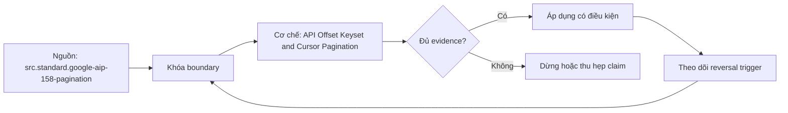

# API Offset Keyset and Cursor Pagination

> [!abstract] Câu hỏi trung tâm
> Pagination nào giữ completeness khi collection thay đổi và checkpoint/retry phải mang trạng thái gì?

## 1. Offset pagination

Request page/offset and limit is simple and supports jumping, but insertion/deletion before current offset shifts positions: rows duplicate or skip. Stable snapshot/session can mitigate if service guarantees it. Large offsets may be costly. Client must not infer stability from sorted response alone. Test with controlled insert/delete at beginning and middle between requests.

## 2. Keyset pagination

Predicate `(sort_key,id) > last_tuple` with matching total order avoids position shift before cursor and is efficient with index. It needs immutable or monotonic sort key, unique tie-breaker and consistent comparison/null/collation. Updates moving row across boundary can duplicate/omit. Reverse traversal and arbitrary jump need extra design. Checkpoint is typed tuple plus filter/order/version.

## 3. Opaque cursor/token

Server token may encode position, snapshot or stored state; client treats it opaque. Google AIP requires other request parameters match token-issuing call and token does not authorize resources. Token can expire; response empty token signals end. Client cannot assume token snapshot consistency unless API states it. Save token after durable page handling; on expiry follow documented restart/resume plus dedup/reconciliation.

## 4. Response and error semantics

HTTP success status can carry business error, partial results, warning or per-item failures; schema-level validation needed. Classify retryable transport/5xx/429 versus auth/validation/permanent errors. Honor server hints within deadline/budget. Lost response after page fetch may replay page; deterministic record identity absorbs. Refresh auth must not mutate pagination parameters.

## 5. Mutable collection test

Create API simulator with stable IDs/order and operations between pages. Run offset, keyset and cursor clients under same schedule; compare extracted key multiset with snapshot or event-boundary oracle defined in advance. Inject duplicate sort values, deletes, updates, token expiry, 200-with-error and lost response. Record whether contract targets moving-current view or snapshot-at-start; without boundary complete is undefined.

## 6. Checkpoint and recovery

Persist endpoint/filter/order/page size contract, cursor/tuple/token, last durable page hash, extracted key summary and run ID. Never advance checkpoint before page durably landed. Restart uses token if valid; otherwise source-specific bootstrap from safe tuple/time plus overlap and dedup. Periodic full/key-range reconciliation detects invisible movement. Rate limits and maximum page size are part of capacity plan.

## 7. Ma trận kiểm chứng từng mệnh đề

Mỗi claim phải gắn source/entity boundary, exact fixture, checkpoint/input state, counterexample và independent reconciliation oracle. Connector chạy thành công hoặc API trả 2xx chưa chứng minh completeness.

### 7.1. Pagination probe 1: ordering, mutation schedule, page state, retry class và exact-key oracle phải hiện đủ

**Mệnh đề cần kiểm.** Pagination probe 1: ordering, mutation schedule, page state, retry class và exact-key oracle phải hiện đủ.

**Thiết kế phép thử cho `wiki.ingestion.api-offset-keyset-cursor-pagination`.** Khóa source/API version, entity, grain/key, time boundary, schema, pagination/cursor configuration và failure schedule. Tạo positive, boundary và negative fixtures; thay đổi đúng một assumption. Lưu request/query, response/raw extract hash, checkpoint trước/sau, landing objects, target state và source-at-boundary oracle.

**Điều kiện chấp nhận cho `wiki.ingestion.api-offset-keyset-cursor-pagination`.** Count, key set, typed field hash và delete state khớp contract; duplicates được giải thích và dedup có identity rõ. Observation, inference và unknown được báo riêng. Lab chưa chạy chỉ là protocol.

### 7.2. Pagination probe 2: ordering, mutation schedule, page state, retry class và exact-key oracle phải hiện đủ

**Mệnh đề cần kiểm.** Pagination probe 2: ordering, mutation schedule, page state, retry class và exact-key oracle phải hiện đủ.

**Thiết kế phép thử cho `wiki.ingestion.api-offset-keyset-cursor-pagination`.** Khóa source/API version, entity, grain/key, time boundary, schema, pagination/cursor configuration và failure schedule. Tạo positive, boundary và negative fixtures; thay đổi đúng một assumption. Lưu request/query, response/raw extract hash, checkpoint trước/sau, landing objects, target state và source-at-boundary oracle.

**Điều kiện chấp nhận cho `wiki.ingestion.api-offset-keyset-cursor-pagination`.** Count, key set, typed field hash và delete state khớp contract; duplicates được giải thích và dedup có identity rõ. Observation, inference và unknown được báo riêng. Lab chưa chạy chỉ là protocol.

### 7.3. Pagination probe 3: ordering, mutation schedule, page state, retry class và exact-key oracle phải hiện đủ

**Mệnh đề cần kiểm.** Pagination probe 3: ordering, mutation schedule, page state, retry class và exact-key oracle phải hiện đủ.

**Thiết kế phép thử cho `wiki.ingestion.api-offset-keyset-cursor-pagination`.** Khóa source/API version, entity, grain/key, time boundary, schema, pagination/cursor configuration và failure schedule. Tạo positive, boundary và negative fixtures; thay đổi đúng một assumption. Lưu request/query, response/raw extract hash, checkpoint trước/sau, landing objects, target state và source-at-boundary oracle.

**Điều kiện chấp nhận cho `wiki.ingestion.api-offset-keyset-cursor-pagination`.** Count, key set, typed field hash và delete state khớp contract; duplicates được giải thích và dedup có identity rõ. Observation, inference và unknown được báo riêng. Lab chưa chạy chỉ là protocol.

### 7.4. Pagination probe 4: ordering, mutation schedule, page state, retry class và exact-key oracle phải hiện đủ

**Mệnh đề cần kiểm.** Pagination probe 4: ordering, mutation schedule, page state, retry class và exact-key oracle phải hiện đủ.

**Thiết kế phép thử cho `wiki.ingestion.api-offset-keyset-cursor-pagination`.** Khóa source/API version, entity, grain/key, time boundary, schema, pagination/cursor configuration và failure schedule. Tạo positive, boundary và negative fixtures; thay đổi đúng một assumption. Lưu request/query, response/raw extract hash, checkpoint trước/sau, landing objects, target state và source-at-boundary oracle.

**Điều kiện chấp nhận cho `wiki.ingestion.api-offset-keyset-cursor-pagination`.** Count, key set, typed field hash và delete state khớp contract; duplicates được giải thích và dedup có identity rõ. Observation, inference và unknown được báo riêng. Lab chưa chạy chỉ là protocol.

### 7.5. Pagination probe 5: ordering, mutation schedule, page state, retry class và exact-key oracle phải hiện đủ

**Mệnh đề cần kiểm.** Pagination probe 5: ordering, mutation schedule, page state, retry class và exact-key oracle phải hiện đủ.

**Thiết kế phép thử cho `wiki.ingestion.api-offset-keyset-cursor-pagination`.** Khóa source/API version, entity, grain/key, time boundary, schema, pagination/cursor configuration và failure schedule. Tạo positive, boundary và negative fixtures; thay đổi đúng một assumption. Lưu request/query, response/raw extract hash, checkpoint trước/sau, landing objects, target state và source-at-boundary oracle.

**Điều kiện chấp nhận cho `wiki.ingestion.api-offset-keyset-cursor-pagination`.** Count, key set, typed field hash và delete state khớp contract; duplicates được giải thích và dedup có identity rõ. Observation, inference và unknown được báo riêng. Lab chưa chạy chỉ là protocol.

### 7.6. Pagination probe 6: ordering, mutation schedule, page state, retry class và exact-key oracle phải hiện đủ

**Mệnh đề cần kiểm.** Pagination probe 6: ordering, mutation schedule, page state, retry class và exact-key oracle phải hiện đủ.

**Thiết kế phép thử cho `wiki.ingestion.api-offset-keyset-cursor-pagination`.** Khóa source/API version, entity, grain/key, time boundary, schema, pagination/cursor configuration và failure schedule. Tạo positive, boundary và negative fixtures; thay đổi đúng một assumption. Lưu request/query, response/raw extract hash, checkpoint trước/sau, landing objects, target state và source-at-boundary oracle.

**Điều kiện chấp nhận cho `wiki.ingestion.api-offset-keyset-cursor-pagination`.** Count, key set, typed field hash và delete state khớp contract; duplicates được giải thích và dedup có identity rõ. Observation, inference và unknown được báo riêng. Lab chưa chạy chỉ là protocol.

### 7.7. Pagination probe 7: ordering, mutation schedule, page state, retry class và exact-key oracle phải hiện đủ

**Mệnh đề cần kiểm.** Pagination probe 7: ordering, mutation schedule, page state, retry class và exact-key oracle phải hiện đủ.

**Thiết kế phép thử cho `wiki.ingestion.api-offset-keyset-cursor-pagination`.** Khóa source/API version, entity, grain/key, time boundary, schema, pagination/cursor configuration và failure schedule. Tạo positive, boundary và negative fixtures; thay đổi đúng một assumption. Lưu request/query, response/raw extract hash, checkpoint trước/sau, landing objects, target state và source-at-boundary oracle.

**Điều kiện chấp nhận cho `wiki.ingestion.api-offset-keyset-cursor-pagination`.** Count, key set, typed field hash và delete state khớp contract; duplicates được giải thích và dedup có identity rõ. Observation, inference và unknown được báo riêng. Lab chưa chạy chỉ là protocol.

### 7.8. Pagination probe 8: ordering, mutation schedule, page state, retry class và exact-key oracle phải hiện đủ

**Mệnh đề cần kiểm.** Pagination probe 8: ordering, mutation schedule, page state, retry class và exact-key oracle phải hiện đủ.

**Thiết kế phép thử cho `wiki.ingestion.api-offset-keyset-cursor-pagination`.** Khóa source/API version, entity, grain/key, time boundary, schema, pagination/cursor configuration và failure schedule. Tạo positive, boundary và negative fixtures; thay đổi đúng một assumption. Lưu request/query, response/raw extract hash, checkpoint trước/sau, landing objects, target state và source-at-boundary oracle.

**Điều kiện chấp nhận cho `wiki.ingestion.api-offset-keyset-cursor-pagination`.** Count, key set, typed field hash và delete state khớp contract; duplicates được giải thích và dedup có identity rõ. Observation, inference và unknown được báo riêng. Lab chưa chạy chỉ là protocol.

### 7.9. Pagination probe 9: ordering, mutation schedule, page state, retry class và exact-key oracle phải hiện đủ

**Mệnh đề cần kiểm.** Pagination probe 9: ordering, mutation schedule, page state, retry class và exact-key oracle phải hiện đủ.

**Thiết kế phép thử cho `wiki.ingestion.api-offset-keyset-cursor-pagination`.** Khóa source/API version, entity, grain/key, time boundary, schema, pagination/cursor configuration và failure schedule. Tạo positive, boundary và negative fixtures; thay đổi đúng một assumption. Lưu request/query, response/raw extract hash, checkpoint trước/sau, landing objects, target state và source-at-boundary oracle.

**Điều kiện chấp nhận cho `wiki.ingestion.api-offset-keyset-cursor-pagination`.** Count, key set, typed field hash và delete state khớp contract; duplicates được giải thích và dedup có identity rõ. Observation, inference và unknown được báo riêng. Lab chưa chạy chỉ là protocol.

### 7.10. Pagination probe 10: ordering, mutation schedule, page state, retry class và exact-key oracle phải hiện đủ

**Mệnh đề cần kiểm.** Pagination probe 10: ordering, mutation schedule, page state, retry class và exact-key oracle phải hiện đủ.

**Thiết kế phép thử cho `wiki.ingestion.api-offset-keyset-cursor-pagination`.** Khóa source/API version, entity, grain/key, time boundary, schema, pagination/cursor configuration và failure schedule. Tạo positive, boundary và negative fixtures; thay đổi đúng một assumption. Lưu request/query, response/raw extract hash, checkpoint trước/sau, landing objects, target state và source-at-boundary oracle.

**Điều kiện chấp nhận cho `wiki.ingestion.api-offset-keyset-cursor-pagination`.** Count, key set, typed field hash và delete state khớp contract; duplicates được giải thích và dedup có identity rõ. Observation, inference và unknown được báo riêng. Lab chưa chạy chỉ là protocol.

### 7.11. Pagination probe 11: ordering, mutation schedule, page state, retry class và exact-key oracle phải hiện đủ

**Mệnh đề cần kiểm.** Pagination probe 11: ordering, mutation schedule, page state, retry class và exact-key oracle phải hiện đủ.

**Thiết kế phép thử cho `wiki.ingestion.api-offset-keyset-cursor-pagination`.** Khóa source/API version, entity, grain/key, time boundary, schema, pagination/cursor configuration và failure schedule. Tạo positive, boundary và negative fixtures; thay đổi đúng một assumption. Lưu request/query, response/raw extract hash, checkpoint trước/sau, landing objects, target state và source-at-boundary oracle.

**Điều kiện chấp nhận cho `wiki.ingestion.api-offset-keyset-cursor-pagination`.** Count, key set, typed field hash và delete state khớp contract; duplicates được giải thích và dedup có identity rõ. Observation, inference và unknown được báo riêng. Lab chưa chạy chỉ là protocol.

### 7.12. Pagination probe 12: ordering, mutation schedule, page state, retry class và exact-key oracle phải hiện đủ

**Mệnh đề cần kiểm.** Pagination probe 12: ordering, mutation schedule, page state, retry class và exact-key oracle phải hiện đủ.

**Thiết kế phép thử cho `wiki.ingestion.api-offset-keyset-cursor-pagination`.** Khóa source/API version, entity, grain/key, time boundary, schema, pagination/cursor configuration và failure schedule. Tạo positive, boundary và negative fixtures; thay đổi đúng một assumption. Lưu request/query, response/raw extract hash, checkpoint trước/sau, landing objects, target state và source-at-boundary oracle.

**Điều kiện chấp nhận cho `wiki.ingestion.api-offset-keyset-cursor-pagination`.** Count, key set, typed field hash và delete state khớp contract; duplicates được giải thích và dedup có identity rõ. Observation, inference và unknown được báo riêng. Lab chưa chạy chỉ là protocol.

### 7.13. Pagination probe 13: ordering, mutation schedule, page state, retry class và exact-key oracle phải hiện đủ

**Mệnh đề cần kiểm.** Pagination probe 13: ordering, mutation schedule, page state, retry class và exact-key oracle phải hiện đủ.

**Thiết kế phép thử cho `wiki.ingestion.api-offset-keyset-cursor-pagination`.** Khóa source/API version, entity, grain/key, time boundary, schema, pagination/cursor configuration và failure schedule. Tạo positive, boundary và negative fixtures; thay đổi đúng một assumption. Lưu request/query, response/raw extract hash, checkpoint trước/sau, landing objects, target state và source-at-boundary oracle.

**Điều kiện chấp nhận cho `wiki.ingestion.api-offset-keyset-cursor-pagination`.** Count, key set, typed field hash và delete state khớp contract; duplicates được giải thích và dedup có identity rõ. Observation, inference và unknown được báo riêng. Lab chưa chạy chỉ là protocol.

### 7.14. Pagination probe 14: ordering, mutation schedule, page state, retry class và exact-key oracle phải hiện đủ

**Mệnh đề cần kiểm.** Pagination probe 14: ordering, mutation schedule, page state, retry class và exact-key oracle phải hiện đủ.

**Thiết kế phép thử cho `wiki.ingestion.api-offset-keyset-cursor-pagination`.** Khóa source/API version, entity, grain/key, time boundary, schema, pagination/cursor configuration và failure schedule. Tạo positive, boundary và negative fixtures; thay đổi đúng một assumption. Lưu request/query, response/raw extract hash, checkpoint trước/sau, landing objects, target state và source-at-boundary oracle.

**Điều kiện chấp nhận cho `wiki.ingestion.api-offset-keyset-cursor-pagination`.** Count, key set, typed field hash và delete state khớp contract; duplicates được giải thích và dedup có identity rõ. Observation, inference và unknown được báo riêng. Lab chưa chạy chỉ là protocol.

### 7.15. Pagination probe 15: ordering, mutation schedule, page state, retry class và exact-key oracle phải hiện đủ

**Mệnh đề cần kiểm.** Pagination probe 15: ordering, mutation schedule, page state, retry class và exact-key oracle phải hiện đủ.

**Thiết kế phép thử cho `wiki.ingestion.api-offset-keyset-cursor-pagination`.** Khóa source/API version, entity, grain/key, time boundary, schema, pagination/cursor configuration và failure schedule. Tạo positive, boundary và negative fixtures; thay đổi đúng một assumption. Lưu request/query, response/raw extract hash, checkpoint trước/sau, landing objects, target state và source-at-boundary oracle.

**Điều kiện chấp nhận cho `wiki.ingestion.api-offset-keyset-cursor-pagination`.** Count, key set, typed field hash và delete state khớp contract; duplicates được giải thích và dedup có identity rõ. Observation, inference và unknown được báo riêng. Lab chưa chạy chỉ là protocol.

## 8. Quy trình phản biện

1. Chốt entity, grain, identity và immutable boundary.
2. Tách source fact, documentation claim và observed behavior.
3. Viết delete, retry, checkpoint và replay semantics trước code.
4. Dùng key/typed-hash reconciliation, không chỉ row count.
5. Pin version, retention, timezone, ordering và rate limits.
6. Ghi assumption bị falsify và extraction pattern thay thế.

## 9. Câu hỏi tự kiểm tra

1. Source thay đổi row/entity theo những operation nào?
2. Boundary nào định nghĩa complete?
3. Delete có xuất hiện trong interface không?
4. Cursor/order có total và immutable không?
5. Crash ở checkpoint boundary gây replay hay gap?
6. Bằng chứng nào chưa được chạy?

## 10. Giới hạn và điều chưa cho phép kết luận

- Chưa chạy mutation/pagination/watermark lab trên source thật.
- Product behavior phải pin version, retention và configuration.
- Decision matrices và failure protocols là synthesis của giáo trình.
- Note giữ trạng thái `review` tới khi chủ dự án duyệt.

## Reference
1. [[SRC-GOOGLE-AIP-158-PAGINATION]]
2. [[SRC-GEEWAX-API-DESIGN-PATTERNS-1E]]
3. [[SRC-RFC9110-HTTP-SEMANTICS]]

## Source coverage

| Source slice | Nội dung sử dụng | Trạng thái |
|---|---|---|
| [[SRC-GOOGLE-AIP-158-PAGINATION]] | Source/change/API contract hoặc engineering context | Đã đọc locator; không suy ngoài phạm vi |
| [[SRC-GEEWAX-API-DESIGN-PATTERNS-1E]] | Source/change/API contract hoặc engineering context | Đã đọc locator; không suy ngoài phạm vi |
| [[SRC-RFC9110-HTTP-SEMANTICS]] | Source/change/API contract hoặc engineering context | Đã đọc locator; không suy ngoài phạm vi |

## Key takeaways
- Extraction pattern chỉ đúng khi source assumptions đúng.
- Completeness cần immutable boundary và reconciliation oracle.
- Retry/checkpoint ưu tiên replay có kiểm soát hơn silent gap.
- Connector không chuyển giao ownership về tính đúng.

<!-- ATOMIC-EXECUTION-CAPSULE:START -->

## Execution capsule: kiểm chứng `wiki.ingestion.api-offset-keyset-cursor-pagination`

> [!important] Phân loại mệnh đề
> Với `wiki.ingestion.api-offset-keyset-cursor-pagination`, sơ đồ, ví dụ và artifact về **API Offset Keyset and Cursor Pagination** là **synthesis để kiểm chứng**; chúng không phải trích dẫn hay case nguyên văn của nguồn.

### Sơ đồ cơ chế và điểm kiểm soát



Đọc sơ đồ `wiki.ingestion.api-offset-keyset-cursor-pagination` từ trái sang phải: source chỉ cung cấp claim ban đầu cho **API Offset Keyset and Cursor Pagination**; quyết định chỉ được đi tiếp sau khi boundary, evidence và điều kiện đảo quyết định đã hiện hữu.

### Ví dụ làm việc có thể bác bỏ

**Input.** Một đội cần trả lời: Pagination nào giữ completeness khi collection thay đổi và checkpoint/retry phải mang trạng thái gì? cho một phạm vi nhỏ, có owner và deadline rõ.

**Decision.** Đội áp dụng **API Offset Keyset and Cursor Pagination** trên control và variant chỉ khác một assumption; expected result và hard constraints được khóa trước khi chạy.

**Outcome.** Với `wiki.ingestion.api-offset-keyset-cursor-pagination`, nếu observation vi phạm hard constraint hoặc oracle độc lập không xác nhận **API Offset Keyset and Cursor Pagination**, đội thu hẹp claim hay đảo quyết định. Nếu đạt, kết luận vẫn kèm scope, version và review date; một lần thành công không được nâng thành quy luật phổ quát.

### Artifact thực thi tối thiểu

```sql
-- Verification harness for: API Offset Keyset and Cursor Pagination
WITH evidence AS (
    SELECT 'wiki.ingestion.api-offset-keyset-cursor-pagination' AS concept_id,
           'boundary_declared' AS check_name, 1 AS passed
    UNION ALL
    SELECT 'wiki.ingestion.api-offset-keyset-cursor-pagination', 'independent_oracle', 1
    UNION ALL
    SELECT 'wiki.ingestion.api-offset-keyset-cursor-pagination', 'reversal_trigger_recorded', 1
)
SELECT concept_id,
       MIN(passed) AS all_hard_checks_pass,
       COUNT(*) AS evidence_items
FROM evidence
GROUP BY concept_id
HAVING MIN(passed) = 1;
```

Artifact của `wiki.ingestion.api-offset-keyset-cursor-pagination` buộc người dùng ghi boundary, oracle và reversal trigger cho **API Offset Keyset and Cursor Pagination**. Các giá trị minh họa phải được thay bằng evidence thật trước khi dùng cho quyết định.

### Tự kiểm tra trước khi tái sử dụng

1. Bạn có thể trả lời `Pagination nào giữ completeness khi collection thay đổi và checkpoint/retry phải mang trạng thái gì?` bằng một câu mà không kéo thêm concept thứ hai không?
2. Source locator nào đỡ cho claim, và phần nào chỉ là synthesis trong note?
3. Observation nào khiến bạn dừng, thu hẹp hoặc đảo quyết định?
4. Artifact nào cho phép một reviewer độc lập tái hiện kết quả?

<!-- ATOMIC-EXECUTION-CAPSULE:END -->
