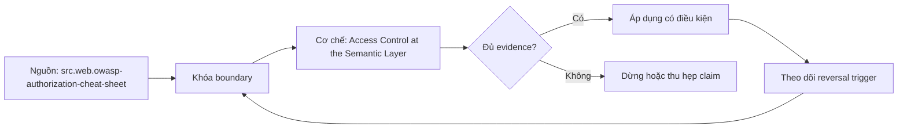

# Access Control at the Semantic Layer

> [!abstract] Câu hỏi trung tâm
> Làm sao cưỡng chế metric-, row- và column-level access trên mọi serve path, đồng thời kiểm rò rỉ trực tiếp, cache và suy luận aggregate?

## 1. Threat model và trust boundaries

Authentication xác minh identity; authorization quyết định principal được làm gì trên resource/context nào. Liệt kê human/service principals, BI/SQL/API paths, semantic service, cache, warehouse credentials và direct-access bypass. Least privilege và deny by default áp ở từng boundary. “Một chỗ cưỡng chế” chỉ đúng nếu mọi đường buộc đi qua chỗ đó; tài khoản warehouse trực tiếp, export/cache table hoặc admin credential có thể tạo đường vòng.

## 2. Ba mức kiểm soát

Metric-level policy quyết định metric/version/action được query; column-level policy che hoặc cấm sensitive dimensions/attributes; row-level policy giới hạn population theo tenant, region, ownership hoặc attributes. ABAC/ReBAC phù hợp khi context vượt role đơn giản. Policy decision cần principal, claims, resource, requested dimensions/filters và environment, rồi trả allow/deny cùng obligations. Claims phải được ký/xác thực, normalized và không lấy từ client parameters không tin cậy.

## 3. Lọc dòng không đồng nghĩa từ chối request

PostgreSQL RLS dùng policy `USING`: rows không thỏa thường không xuất hiện; khi bật RLS mà không có applicable policy thì default deny làm không rows visible. Đây là expected scoped view, không phải explicit error. Với semantic API, unauthorized metric/column hoặc request tuyên bố global scope nhưng principal chỉ có partial scope nên reject rõ. Request scoped hợp lệ có thể trả filtered rows, nhưng response phải thể hiện effective scope để không bị diễn giải thành toàn cục.

## 4. Policy composition và bypass

Permissive policies có thể OR, restrictive policies AND; owner/superuser/BYPASSRLS có ngoại lệ theo PostgreSQL. Service token gắn warehouse credential nghĩa là effective privileges của credential là control nền. Test cả owner-like/bypass roles, view definer/invoker behavior, exports và cache schemas. Không chạy negative tests chỉ bằng admin credential. Mọi request path phải map tới intended principal, không dùng shared high-privilege token làm mất row identity.

## 5. Suy luận qua aggregate

Ẩn detail rows nhưng trả group count/sum có thể tiết lộ singleton hoặc difference giữa hai queries. Minimum group size chặn trực tiếp singleton nhưng không đủ trước differencing, overlapping groups, repeated queries và auxiliary knowledge. Cần complementary suppression/generalization, query-set/rate controls, audit và đôi khi differential privacy cho threat model mạnh. Ngưỡng nhóm là một control có assumptions, không phải chứng minh “không rò rỉ”.

## 6. Cache và policy version

Cache key mang principal/effective scope, policy version, semantic version và source snapshot; hoặc cache physical data chỉ ở scope đã authorization-safe. dbt docs hiện hành ghi cached table không nhận security context tại query time, nên cần thiết kế isolation riêng. Revoke quyền phải invalidate hoặc làm key version cũ unreachable. Cache test kiểm returned content qua two principals và direct table grants, không chỉ hai logical keys khác nhau.

## 7. Sáu negative tests có expected behavior

Test unauthorized metric và sensitive column phải explicit deny; cross-tenant row request không được trả foreign rows; global-claim request từ partial principal phải reject hoặc báo scoped semantics theo contract; singleton/differencing probe phải bị suppress/limit; cache cross-principal phải không leak; alternate serve path/direct export phải không bypass. Mỗi test ghi policy version, principal/claims, request, expected decision, returned scope và audit event. Sáu passes không thay penetration test; chúng là acceptance floor.

## 8. Ma trận kiểm chứng từng mệnh đề

Mọi mệnh đề dưới đây cần fixture, invariant, independent oracle và output lưu được. Compile thành công hoặc con số nhìn hợp lý không đủ làm bằng chứng.

### 8.1. authentication khác authorization

**Mệnh đề cần kiểm.** authentication khác authorization.

**Cách kiểm.** Dựng policy matrix cho principals × resources × actions và six negative tests qua BI/SQL/API/cache/export paths. Ghi explicit deny hoặc scoped-filter expectation, effective scope, audit event và inference controls. Với mệnh đề này, ghi data shape gây lỗi, expected result và failure signal. Không dùng generated query làm oracle cho chính nó.

**Bằng chứng đạt cho `wiki.semantic-layer.access-control`.** Lưu contract/graph/config version, seed snapshot, command/SQL, raw output, row/multiplicity ledger và semantic diff. Nếu chưa chạy tool/lab, trạng thái chỉ là test protocol.

### 8.2. trust boundary phải gồm cache và exports

**Mệnh đề cần kiểm.** trust boundary phải gồm cache và exports.

**Cách kiểm.** Dựng policy matrix cho principals × resources × actions và six negative tests qua BI/SQL/API/cache/export paths. Ghi explicit deny hoặc scoped-filter expectation, effective scope, audit event và inference controls. Với mệnh đề này, ghi data shape gây lỗi, expected result và failure signal. Không dùng generated query làm oracle cho chính nó.

**Bằng chứng đạt cho `wiki.semantic-layer.access-control`.** Lưu contract/graph/config version, seed snapshot, command/SQL, raw output, row/multiplicity ledger và semantic diff. Nếu chưa chạy tool/lab, trạng thái chỉ là test protocol.

### 8.3. deny by default áp trên mọi request path

**Mệnh đề cần kiểm.** deny by default áp trên mọi request path.

**Cách kiểm.** Dựng policy matrix cho principals × resources × actions và six negative tests qua BI/SQL/API/cache/export paths. Ghi explicit deny hoặc scoped-filter expectation, effective scope, audit event và inference controls. Với mệnh đề này, ghi data shape gây lỗi, expected result và failure signal. Không dùng generated query làm oracle cho chính nó.

**Bằng chứng đạt cho `wiki.semantic-layer.access-control`.** Lưu contract/graph/config version, seed snapshot, command/SQL, raw output, row/multiplicity ledger và semantic diff. Nếu chưa chạy tool/lab, trạng thái chỉ là test protocol.

### 8.4. metric row column policies kiểm khác nhau

**Mệnh đề cần kiểm.** metric row column policies kiểm khác nhau.

**Cách kiểm.** Dựng policy matrix cho principals × resources × actions và six negative tests qua BI/SQL/API/cache/export paths. Ghi explicit deny hoặc scoped-filter expectation, effective scope, audit event và inference controls. Với mệnh đề này, ghi data shape gây lỗi, expected result và failure signal. Không dùng generated query làm oracle cho chính nó.

**Bằng chứng đạt cho `wiki.semantic-layer.access-control`.** Lưu contract/graph/config version, seed snapshot, command/SQL, raw output, row/multiplicity ledger và semantic diff. Nếu chưa chạy tool/lab, trạng thái chỉ là test protocol.

### 8.5. claims không được tin từ client input

**Mệnh đề cần kiểm.** claims không được tin từ client input.

**Cách kiểm.** Dựng policy matrix cho principals × resources × actions và six negative tests qua BI/SQL/API/cache/export paths. Ghi explicit deny hoặc scoped-filter expectation, effective scope, audit event và inference controls. Với mệnh đề này, ghi data shape gây lỗi, expected result và failure signal. Không dùng generated query làm oracle cho chính nó.

**Bằng chứng đạt cho `wiki.semantic-layer.access-control`.** Lưu contract/graph/config version, seed snapshot, command/SQL, raw output, row/multiplicity ledger và semantic diff. Nếu chưa chạy tool/lab, trạng thái chỉ là test protocol.

### 8.6. RLS SELECT thường lọc thay vì error

**Mệnh đề cần kiểm.** RLS SELECT thường lọc thay vì error.

**Cách kiểm.** Dựng policy matrix cho principals × resources × actions và six negative tests qua BI/SQL/API/cache/export paths. Ghi explicit deny hoặc scoped-filter expectation, effective scope, audit event và inference controls. Với mệnh đề này, ghi data shape gây lỗi, expected result và failure signal. Không dùng generated query làm oracle cho chính nó.

**Bằng chứng đạt cho `wiki.semantic-layer.access-control`.** Lưu contract/graph/config version, seed snapshot, command/SQL, raw output, row/multiplicity ledger và semantic diff. Nếu chưa chạy tool/lab, trạng thái chỉ là test protocol.

### 8.7. global question với partial scope cần explicit semantics

**Mệnh đề cần kiểm.** global question với partial scope cần explicit semantics.

**Cách kiểm.** Dựng policy matrix cho principals × resources × actions và six negative tests qua BI/SQL/API/cache/export paths. Ghi explicit deny hoặc scoped-filter expectation, effective scope, audit event và inference controls. Với mệnh đề này, ghi data shape gây lỗi, expected result và failure signal. Không dùng generated query làm oracle cho chính nó.

**Bằng chứng đạt cho `wiki.semantic-layer.access-control`.** Lưu contract/graph/config version, seed snapshot, command/SQL, raw output, row/multiplicity ledger và semantic diff. Nếu chưa chạy tool/lab, trạng thái chỉ là test protocol.

### 8.8. default deny không đồng nghĩa no bypass roles

**Mệnh đề cần kiểm.** default deny không đồng nghĩa no bypass roles.

**Cách kiểm.** Dựng policy matrix cho principals × resources × actions và six negative tests qua BI/SQL/API/cache/export paths. Ghi explicit deny hoặc scoped-filter expectation, effective scope, audit event và inference controls. Với mệnh đề này, ghi data shape gây lỗi, expected result và failure signal. Không dùng generated query làm oracle cho chính nó.

**Bằng chứng đạt cho `wiki.semantic-layer.access-control`.** Lưu contract/graph/config version, seed snapshot, command/SQL, raw output, row/multiplicity ledger và semantic diff. Nếu chưa chạy tool/lab, trạng thái chỉ là test protocol.

### 8.9. policy OR và AND cần test composition

**Mệnh đề cần kiểm.** policy OR và AND cần test composition.

**Cách kiểm.** Dựng policy matrix cho principals × resources × actions và six negative tests qua BI/SQL/API/cache/export paths. Ghi explicit deny hoặc scoped-filter expectation, effective scope, audit event và inference controls. Với mệnh đề này, ghi data shape gây lỗi, expected result và failure signal. Không dùng generated query làm oracle cho chính nó.

**Bằng chứng đạt cho `wiki.semantic-layer.access-control`.** Lưu contract/graph/config version, seed snapshot, command/SQL, raw output, row/multiplicity ledger và semantic diff. Nếu chưa chạy tool/lab, trạng thái chỉ là test protocol.

### 8.10. admin credential không đại diện end user

**Mệnh đề cần kiểm.** admin credential không đại diện end user.

**Cách kiểm.** Dựng policy matrix cho principals × resources × actions và six negative tests qua BI/SQL/API/cache/export paths. Ghi explicit deny hoặc scoped-filter expectation, effective scope, audit event và inference controls. Với mệnh đề này, ghi data shape gây lỗi, expected result và failure signal. Không dùng generated query làm oracle cho chính nó.

**Bằng chứng đạt cho `wiki.semantic-layer.access-control`.** Lưu contract/graph/config version, seed snapshot, command/SQL, raw output, row/multiplicity ledger và semantic diff. Nếu chưa chạy tool/lab, trạng thái chỉ là test protocol.

### 8.11. minimum group size chỉ là partial mitigation

**Mệnh đề cần kiểm.** minimum group size chỉ là partial mitigation.

**Cách kiểm.** Dựng policy matrix cho principals × resources × actions và six negative tests qua BI/SQL/API/cache/export paths. Ghi explicit deny hoặc scoped-filter expectation, effective scope, audit event và inference controls. Với mệnh đề này, ghi data shape gây lỗi, expected result và failure signal. Không dùng generated query làm oracle cho chính nó.

**Bằng chứng đạt cho `wiki.semantic-layer.access-control`.** Lưu contract/graph/config version, seed snapshot, command/SQL, raw output, row/multiplicity ledger và semantic diff. Nếu chưa chạy tool/lab, trạng thái chỉ là test protocol.

### 8.12. differencing attack cần query-set controls

**Mệnh đề cần kiểm.** differencing attack cần query-set controls.

**Cách kiểm.** Dựng policy matrix cho principals × resources × actions và six negative tests qua BI/SQL/API/cache/export paths. Ghi explicit deny hoặc scoped-filter expectation, effective scope, audit event và inference controls. Với mệnh đề này, ghi data shape gây lỗi, expected result và failure signal. Không dùng generated query làm oracle cho chính nó.

**Bằng chứng đạt cho `wiki.semantic-layer.access-control`.** Lưu contract/graph/config version, seed snapshot, command/SQL, raw output, row/multiplicity ledger và semantic diff. Nếu chưa chạy tool/lab, trạng thái chỉ là test protocol.

### 8.13. cache cần policy/security context version

**Mệnh đề cần kiểm.** cache cần policy/security context version.

**Cách kiểm.** Dựng policy matrix cho principals × resources × actions và six negative tests qua BI/SQL/API/cache/export paths. Ghi explicit deny hoặc scoped-filter expectation, effective scope, audit event và inference controls. Với mệnh đề này, ghi data shape gây lỗi, expected result và failure signal. Không dùng generated query làm oracle cho chính nó.

**Bằng chứng đạt cho `wiki.semantic-layer.access-control`.** Lưu contract/graph/config version, seed snapshot, command/SQL, raw output, row/multiplicity ledger và semantic diff. Nếu chưa chạy tool/lab, trạng thái chỉ là test protocol.

### 8.14. revocation phải invalidate cache reachability

**Mệnh đề cần kiểm.** revocation phải invalidate cache reachability.

**Cách kiểm.** Dựng policy matrix cho principals × resources × actions và six negative tests qua BI/SQL/API/cache/export paths. Ghi explicit deny hoặc scoped-filter expectation, effective scope, audit event và inference controls. Với mệnh đề này, ghi data shape gây lỗi, expected result và failure signal. Không dùng generated query làm oracle cho chính nó.

**Bằng chứng đạt cho `wiki.semantic-layer.access-control`.** Lưu contract/graph/config version, seed snapshot, command/SQL, raw output, row/multiplicity ledger và semantic diff. Nếu chưa chạy tool/lab, trạng thái chỉ là test protocol.

### 8.15. negative tests cần audit evidence

**Mệnh đề cần kiểm.** negative tests cần audit evidence.

**Cách kiểm.** Dựng policy matrix cho principals × resources × actions và six negative tests qua BI/SQL/API/cache/export paths. Ghi explicit deny hoặc scoped-filter expectation, effective scope, audit event và inference controls. Với mệnh đề này, ghi data shape gây lỗi, expected result và failure signal. Không dùng generated query làm oracle cho chính nó.

**Bằng chứng đạt cho `wiki.semantic-layer.access-control`.** Lưu contract/graph/config version, seed snapshot, command/SQL, raw output, row/multiplicity ledger và semantic diff. Nếu chưa chạy tool/lab, trạng thái chỉ là test protocol.

## 9. Quy trình phản biện

1. Viết population, grain, identities, time và aggregation trước tool syntax.
2. Gắn metric/dimension với qualified entity role và allowed path.
3. Đếm rows, distinct base keys, unmatched và match multiplicity sau từng join edge.
4. Dùng independent oracle từ atomic facts; so intermediate components trước final value.
5. Chạy invalid cases cùng valid siblings để bắt underblocking và overblocking.
6. Khóa exact tool/config/mart versions; compile output và diagnostics là version-specific evidence.
7. Lưu failed runs, limitations và trigger làm certification hết hiệu lực.

## 10. Câu hỏi tự kiểm tra

1. Join path nào được chọn và business role nào biện minh cho nó?
2. Base fact keys có bị nhân hoặc mất sau từng edge không?
3. Dimension có reachable, đúng grain và compatible với aggregation không?
4. Parse/validate/compile/reconciliation xác nhận những lớp khác nhau nào?
5. Generated SQL khác contract ở population, filter, path hay aggregation nào?
6. Bằng chứng nào độc lập với engine output đang được kiểm?

## 11. Giới hạn và điều chưa cho phép kết luận

- Chưa chạy MetricFlow, warehouse queries, execution plans hoặc labs; note mô tả protocol và expected evidence.
- dbt/MetricFlow docs được kiểm ngày 2026-10-01; commands và YAML phụ thuộc engine/version/environment.
- Thuật ngữ fan/chasm có thể khác giữa sản phẩm; invariant của bài là grain, multiplicity, population và semantic path.
- Kimball–Ross và PostgreSQL hỗ trợ modeling/SQL mechanics; compatibility/certification workflow là curriculum synthesis.
- Owner chưa phê duyệt semantic meaning nên note giữ trạng thái `review`.

## Reference
1. [[SRC-OWASP-AUTHORIZATION-CHEAT-SHEET]]
2. [[SRC-POSTGRESQL-17-ROW-SECURITY]]
3. [[SRC-DBT-SEMANTIC-MODELS]]

## Source coverage

| Source slice | Nội dung sử dụng | Trạng thái |
|---|---|---|
| [[SRC-OWASP-AUTHORIZATION-CHEAT-SHEET]] | Modeling, SQL behavior hoặc current product semantics liên quan | Đã đọc phạm vi có locator; không suy ngoài phạm vi |
| [[SRC-POSTGRESQL-17-ROW-SECURITY]] | Modeling, SQL behavior hoặc current product semantics liên quan | Đã đọc phạm vi có locator; không suy ngoài phạm vi |
| [[SRC-DBT-SEMANTIC-MODELS]] | Modeling, SQL behavior hoặc current product semantics liên quan | Đã đọc phạm vi có locator; không suy ngoài phạm vi |

## Key takeaways
- Join correctness phải được chứng minh bằng grain, multiplicity, unmatched ledger và independent oracle.
- Metric–dimension compatibility là rule ba trạng thái có lý do, không phải danh sách field tùy ý.
- Parse/validate/compile không thay reconciliation với business contract.
- Generated SQL phải được đọc theo population, path, aggregation và time/filter semantics.
- Chưa chạy protocol thì note là tài liệu học thuật có truy nguồn, không phải chứng nhận production.

<!-- ATOMIC-EXECUTION-CAPSULE:START -->

## Execution capsule — kiểm chứng `wiki.semantic-layer.access-control`

> [!important] Phân loại mệnh đề
> Với `wiki.semantic-layer.access-control`, sơ đồ, ví dụ và artifact về **Access Control at the Semantic Layer** là **synthesis để kiểm chứng**; chúng không phải trích dẫn hay case nguyên văn của nguồn.

### Sơ đồ cơ chế và điểm kiểm soát



Đọc sơ đồ `wiki.semantic-layer.access-control` từ trái sang phải: source chỉ cung cấp claim ban đầu cho **Access Control at the Semantic Layer**; quyết định chỉ được đi tiếp sau khi boundary, evidence và điều kiện đảo quyết định đã hiện hữu.

### Ví dụ làm việc có thể bác bỏ

**Input.** Một đội cần trả lời: “Làm sao cưỡng chế metric-, row- và column-level access trên mọi serve path, đồng thời kiểm rò rỉ trực tiếp, cache và suy luận aggregate?” cho một phạm vi nhỏ, có owner và deadline rõ.

**Decision.** Đội áp dụng **Access Control at the Semantic Layer** trên control và variant chỉ khác một assumption; expected result và hard constraints được khóa trước khi chạy.

**Outcome.** Với `wiki.semantic-layer.access-control`, nếu observation vi phạm hard constraint hoặc oracle độc lập không xác nhận **Access Control at the Semantic Layer**, đội thu hẹp claim hay đảo quyết định. Nếu đạt, kết luận vẫn kèm scope, version và review date; một lần thành công không được nâng thành quy luật phổ quát.

### Artifact thực thi tối thiểu

```sql
-- Verification harness for: Access Control at the Semantic Layer
WITH evidence AS (
    SELECT 'wiki.semantic-layer.access-control' AS concept_id,
           'boundary_declared' AS check_name, 1 AS passed
    UNION ALL
    SELECT 'wiki.semantic-layer.access-control', 'independent_oracle', 1
    UNION ALL
    SELECT 'wiki.semantic-layer.access-control', 'reversal_trigger_recorded', 1
)
SELECT concept_id,
       MIN(passed) AS all_hard_checks_pass,
       COUNT(*) AS evidence_items
FROM evidence
GROUP BY concept_id
HAVING MIN(passed) = 1;
```

Artifact của `wiki.semantic-layer.access-control` buộc người dùng ghi boundary, oracle và reversal trigger cho **Access Control at the Semantic Layer**. Các giá trị minh họa phải được thay bằng evidence thật trước khi dùng cho quyết định.

### Tự kiểm tra trước khi tái sử dụng

1. Bạn có thể trả lời `Làm sao cưỡng chế metric-, row- và column-level access trên mọi serve path, đồng thời kiểm rò rỉ trực tiếp, cache và suy luận aggregate?` bằng một câu mà không kéo thêm concept thứ hai không?
2. Source locator nào đỡ cho claim, và phần nào chỉ là synthesis trong note?
3. Observation nào khiến bạn dừng, thu hẹp hoặc đảo quyết định?
4. Artifact nào cho phép một reviewer độc lập tái hiện kết quả?

<!-- ATOMIC-EXECUTION-CAPSULE:END -->
