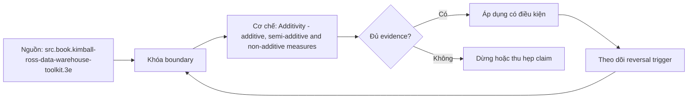

# Additivity - additive, semi-additive and non-additive measures

> [!abstract] Câu hỏi trung tâm
> Một measure được phép aggregate bằng toán tử nào trên dimension nào, và thiết kế numerator/denominator hay distinct-state nào tránh số đúng cú pháp nhưng sai nghĩa?

## 1. Additivity là contract theo chiều

Measure không chỉ có type; cần aggregation contract cho từng dimension. Additive measure như transaction amount có thể SUM qua các dimensions nếu currency/unit cùng semantics. Additivity phụ thuộc grain, unit và filter; revenue nhiều currency không cộng trực tiếp dù mỗi row numeric.

## 2. Semi-additive

Balance và inventory thường cộng qua customer/product/location nhưng không qua time. SUM daily balances trả area-under-curve chứ không phải ending balance. Chọn last non-empty, end-of-period, average theo time-weighting, min/max hoặc exposure integral tùy câu hỏi. Ghi snapshot cadence và missing-period policy.

## 3. Non-additive ratios

Rate, percentage và average không SUM. Average of averages sai khi denominators khác; lưu numerator và denominator additive components, aggregate chúng rồi divide ở cuối. Weighted average cần explicit weight. Division-by-zero/null policy và unit phải quản trị ở semantic layer, không để mỗi dashboard tự chọn.

## 4. Distinct count

Distinct customers không cộng qua partitions/time vì cùng entity xuất hiện nhiều nhóm. Exact aggregate cần union underlying identifiers hoặc recompute ở query grain; sketches như HLL merge được nhưng approximate và có error/version contract. Precomputed distinct counts chỉ cộng khi sets proven disjoint.

## 5. Kiểm bằng phản ví dụ

Tạo dataset nhỏ với denominators lệch, repeated customer và daily balances. So wrong aggregation với ground truth từ atomic rows; định lượng absolute/relative error. Metric catalog ghi grain, expression, allowed dimensions/operators, filters, currency/timezone, null and late-data policy. Test rollup ở nhiều levels và invariant numerator≤denominator khi phù hợp.

## 6. Ma trận kiểm chứng từng mệnh đề

Mỗi mệnh đề phải được chuyển thành invariant, fixture và phép đối chiếu có thể chạy lại. Sơ đồ đẹp hoặc một truy vấn trả về kết quả không lỗi không tự chứng minh mô hình đúng ngữ nghĩa.

### 6.1. revenue chỉ additive khi currency/unit đã đồng nhất

**Mệnh đề cần kiểm.** revenue chỉ additive khi currency/unit đã đồng nhất. **Thiết kế phép kiểm.** Tạo bộ dữ liệu nhỏ có denominator lệch, khách hàng lặp qua nhóm, balance theo ngày, nhiều currency và missing period. Tính ground truth từ atomic rows, sau đó so SUM, average-of-averages, distinct-count cộng dồn và last-non-empty. Bằng chứng đạt ghi rõ operator hợp lệ theo từng dimension, unit/cutoff/null policy và sai số của phép tính sai. **Hồ sơ cần lưu.** Grain/model/metric contract, dữ liệu seed, SQL hoặc notebook, kết quả thô, control totals và giải thích ca biên. Nếu phép kiểm chỉ xác nhận cấu trúc mà không xác nhận semantics, kết luận phải ghi rõ giới hạn đó.

### 6.2. balance semi-additive theo time

**Mệnh đề cần kiểm.** balance semi-additive theo time. **Thiết kế phép kiểm.** Tạo bộ dữ liệu nhỏ có denominator lệch, khách hàng lặp qua nhóm, balance theo ngày, nhiều currency và missing period. Tính ground truth từ atomic rows, sau đó so SUM, average-of-averages, distinct-count cộng dồn và last-non-empty. Bằng chứng đạt ghi rõ operator hợp lệ theo từng dimension, unit/cutoff/null policy và sai số của phép tính sai. **Hồ sơ cần lưu.** Grain/model/metric contract, dữ liệu seed, SQL hoặc notebook, kết quả thô, control totals và giải thích ca biên. Nếu phép kiểm chỉ xác nhận cấu trúc mà không xác nhận semantics, kết luận phải ghi rõ giới hạn đó.

### 6.3. inventory snapshot SUM qua days không ra stock cuối kỳ

**Mệnh đề cần kiểm.** inventory snapshot SUM qua days không ra stock cuối kỳ. **Thiết kế phép kiểm.** Tạo bộ dữ liệu nhỏ có denominator lệch, khách hàng lặp qua nhóm, balance theo ngày, nhiều currency và missing period. Tính ground truth từ atomic rows, sau đó so SUM, average-of-averages, distinct-count cộng dồn và last-non-empty. Bằng chứng đạt ghi rõ operator hợp lệ theo từng dimension, unit/cutoff/null policy và sai số của phép tính sai. **Hồ sơ cần lưu.** Grain/model/metric contract, dữ liệu seed, SQL hoặc notebook, kết quả thô, control totals và giải thích ca biên. Nếu phép kiểm chỉ xác nhận cấu trúc mà không xác nhận semantics, kết luận phải ghi rõ giới hạn đó.

### 6.4. average of averages sai khi group sizes khác

**Mệnh đề cần kiểm.** average of averages sai khi group sizes khác. **Thiết kế phép kiểm.** Tạo bộ dữ liệu nhỏ có denominator lệch, khách hàng lặp qua nhóm, balance theo ngày, nhiều currency và missing period. Tính ground truth từ atomic rows, sau đó so SUM, average-of-averages, distinct-count cộng dồn và last-non-empty. Bằng chứng đạt ghi rõ operator hợp lệ theo từng dimension, unit/cutoff/null policy và sai số của phép tính sai. **Hồ sơ cần lưu.** Grain/model/metric contract, dữ liệu seed, SQL hoặc notebook, kết quả thô, control totals và giải thích ca biên. Nếu phép kiểm chỉ xác nhận cấu trúc mà không xác nhận semantics, kết luận phải ghi rõ giới hạn đó.

### 6.5. ratio phải aggregate numerator và denominator trước division

**Mệnh đề cần kiểm.** ratio phải aggregate numerator và denominator trước division. **Thiết kế phép kiểm.** Tạo bộ dữ liệu nhỏ có denominator lệch, khách hàng lặp qua nhóm, balance theo ngày, nhiều currency và missing period. Tính ground truth từ atomic rows, sau đó so SUM, average-of-averages, distinct-count cộng dồn và last-non-empty. Bằng chứng đạt ghi rõ operator hợp lệ theo từng dimension, unit/cutoff/null policy và sai số của phép tính sai. **Hồ sơ cần lưu.** Grain/model/metric contract, dữ liệu seed, SQL hoặc notebook, kết quả thô, control totals và giải thích ca biên. Nếu phép kiểm chỉ xác nhận cấu trúc mà không xác nhận semantics, kết luận phải ghi rõ giới hạn đó.

### 6.6. weighted average cần explicit weight

**Mệnh đề cần kiểm.** weighted average cần explicit weight. **Thiết kế phép kiểm.** Tạo bộ dữ liệu nhỏ có denominator lệch, khách hàng lặp qua nhóm, balance theo ngày, nhiều currency và missing period. Tính ground truth từ atomic rows, sau đó so SUM, average-of-averages, distinct-count cộng dồn và last-non-empty. Bằng chứng đạt ghi rõ operator hợp lệ theo từng dimension, unit/cutoff/null policy và sai số của phép tính sai. **Hồ sơ cần lưu.** Grain/model/metric contract, dữ liệu seed, SQL hoặc notebook, kết quả thô, control totals và giải thích ca biên. Nếu phép kiểm chỉ xác nhận cấu trúc mà không xác nhận semantics, kết luận phải ghi rõ giới hạn đó.

### 6.7. percent không được SUM

**Mệnh đề cần kiểm.** percent không được SUM. **Thiết kế phép kiểm.** Tạo bộ dữ liệu nhỏ có denominator lệch, khách hàng lặp qua nhóm, balance theo ngày, nhiều currency và missing period. Tính ground truth từ atomic rows, sau đó so SUM, average-of-averages, distinct-count cộng dồn và last-non-empty. Bằng chứng đạt ghi rõ operator hợp lệ theo từng dimension, unit/cutoff/null policy và sai số của phép tính sai. **Hồ sơ cần lưu.** Grain/model/metric contract, dữ liệu seed, SQL hoặc notebook, kết quả thô, control totals và giải thích ca biên. Nếu phép kiểm chỉ xác nhận cấu trúc mà không xác nhận semantics, kết luận phải ghi rõ giới hạn đó.

### 6.8. distinct count không cộng qua overlapping sets

**Mệnh đề cần kiểm.** distinct count không cộng qua overlapping sets. **Thiết kế phép kiểm.** Tạo bộ dữ liệu nhỏ có denominator lệch, khách hàng lặp qua nhóm, balance theo ngày, nhiều currency và missing period. Tính ground truth từ atomic rows, sau đó so SUM, average-of-averages, distinct-count cộng dồn và last-non-empty. Bằng chứng đạt ghi rõ operator hợp lệ theo từng dimension, unit/cutoff/null policy và sai số của phép tính sai. **Hồ sơ cần lưu.** Grain/model/metric contract, dữ liệu seed, SQL hoặc notebook, kết quả thô, control totals và giải thích ca biên. Nếu phép kiểm chỉ xác nhận cấu trúc mà không xác nhận semantics, kết luận phải ghi rõ giới hạn đó.

### 6.9. HLL mergeable nhưng approximate/error-versioned

**Mệnh đề cần kiểm.** HLL mergeable nhưng approximate/error-versioned. **Thiết kế phép kiểm.** Tạo bộ dữ liệu nhỏ có denominator lệch, khách hàng lặp qua nhóm, balance theo ngày, nhiều currency và missing period. Tính ground truth từ atomic rows, sau đó so SUM, average-of-averages, distinct-count cộng dồn và last-non-empty. Bằng chứng đạt ghi rõ operator hợp lệ theo từng dimension, unit/cutoff/null policy và sai số của phép tính sai. **Hồ sơ cần lưu.** Grain/model/metric contract, dữ liệu seed, SQL hoặc notebook, kết quả thô, control totals và giải thích ca biên. Nếu phép kiểm chỉ xác nhận cấu trúc mà không xác nhận semantics, kết luận phải ghi rõ giới hạn đó.

### 6.10. last non-empty cần cutoff và missing semantics

**Mệnh đề cần kiểm.** last non-empty cần cutoff và missing semantics. **Thiết kế phép kiểm.** Tạo bộ dữ liệu nhỏ có denominator lệch, khách hàng lặp qua nhóm, balance theo ngày, nhiều currency và missing period. Tính ground truth từ atomic rows, sau đó so SUM, average-of-averages, distinct-count cộng dồn và last-non-empty. Bằng chứng đạt ghi rõ operator hợp lệ theo từng dimension, unit/cutoff/null policy và sai số của phép tính sai. **Hồ sơ cần lưu.** Grain/model/metric contract, dữ liệu seed, SQL hoặc notebook, kết quả thô, control totals và giải thích ca biên. Nếu phép kiểm chỉ xác nhận cấu trúc mà không xác nhận semantics, kết luận phải ghi rõ giới hạn đó.

### 6.11. flow measure khác stock measure

**Mệnh đề cần kiểm.** flow measure khác stock measure. **Thiết kế phép kiểm.** Tạo bộ dữ liệu nhỏ có denominator lệch, khách hàng lặp qua nhóm, balance theo ngày, nhiều currency và missing period. Tính ground truth từ atomic rows, sau đó so SUM, average-of-averages, distinct-count cộng dồn và last-non-empty. Bằng chứng đạt ghi rõ operator hợp lệ theo từng dimension, unit/cutoff/null policy và sai số của phép tính sai. **Hồ sơ cần lưu.** Grain/model/metric contract, dữ liệu seed, SQL hoặc notebook, kết quả thô, control totals và giải thích ca biên. Nếu phép kiểm chỉ xác nhận cấu trúc mà không xác nhận semantics, kết luận phải ghi rõ giới hạn đó.

### 6.12. unit conversion factor có effective time

**Mệnh đề cần kiểm.** unit conversion factor có effective time. **Thiết kế phép kiểm.** Tạo bộ dữ liệu nhỏ có denominator lệch, khách hàng lặp qua nhóm, balance theo ngày, nhiều currency và missing period. Tính ground truth từ atomic rows, sau đó so SUM, average-of-averages, distinct-count cộng dồn và last-non-empty. Bằng chứng đạt ghi rõ operator hợp lệ theo từng dimension, unit/cutoff/null policy và sai số của phép tính sai. **Hồ sơ cần lưu.** Grain/model/metric contract, dữ liệu seed, SQL hoặc notebook, kết quả thô, control totals và giải thích ca biên. Nếu phép kiểm chỉ xác nhận cấu trúc mà không xác nhận semantics, kết luận phải ghi rõ giới hạn đó.

### 6.13. null khác zero trong metric contract

**Mệnh đề cần kiểm.** null khác zero trong metric contract. **Thiết kế phép kiểm.** Tạo bộ dữ liệu nhỏ có denominator lệch, khách hàng lặp qua nhóm, balance theo ngày, nhiều currency và missing period. Tính ground truth từ atomic rows, sau đó so SUM, average-of-averages, distinct-count cộng dồn và last-non-empty. Bằng chứng đạt ghi rõ operator hợp lệ theo từng dimension, unit/cutoff/null policy và sai số của phép tính sai. **Hồ sơ cần lưu.** Grain/model/metric contract, dữ liệu seed, SQL hoặc notebook, kết quả thô, control totals và giải thích ca biên. Nếu phép kiểm chỉ xác nhận cấu trúc mà không xác nhận semantics, kết luận phải ghi rõ giới hạn đó.

### 6.14. late data có thể restate denominator và historical rate

**Mệnh đề cần kiểm.** late data có thể restate denominator và historical rate. **Thiết kế phép kiểm.** Tạo bộ dữ liệu nhỏ có denominator lệch, khách hàng lặp qua nhóm, balance theo ngày, nhiều currency và missing period. Tính ground truth từ atomic rows, sau đó so SUM, average-of-averages, distinct-count cộng dồn và last-non-empty. Bằng chứng đạt ghi rõ operator hợp lệ theo từng dimension, unit/cutoff/null policy và sai số của phép tính sai. **Hồ sơ cần lưu.** Grain/model/metric contract, dữ liệu seed, SQL hoặc notebook, kết quả thô, control totals và giải thích ca biên. Nếu phép kiểm chỉ xác nhận cấu trúc mà không xác nhận semantics, kết luận phải ghi rõ giới hạn đó.

### 6.15. semantic tests phải chạy ở nhiều rollup levels

**Mệnh đề cần kiểm.** semantic tests phải chạy ở nhiều rollup levels. **Thiết kế phép kiểm.** Tạo bộ dữ liệu nhỏ có denominator lệch, khách hàng lặp qua nhóm, balance theo ngày, nhiều currency và missing period. Tính ground truth từ atomic rows, sau đó so SUM, average-of-averages, distinct-count cộng dồn và last-non-empty. Bằng chứng đạt ghi rõ operator hợp lệ theo từng dimension, unit/cutoff/null policy và sai số của phép tính sai. **Hồ sơ cần lưu.** Grain/model/metric contract, dữ liệu seed, SQL hoặc notebook, kết quả thô, control totals và giải thích ca biên. Nếu phép kiểm chỉ xác nhận cấu trúc mà không xác nhận semantics, kết luận phải ghi rõ giới hạn đó.

## 7. Quy trình phản biện mô hình

1. Viết business question, grain, identity, time semantics và invariant trước khi vẽ bảng.
2. Chỉ ra owner của định nghĩa và artifact nào là canonical.
3. Tách source fact, quyết định thiết kế và curriculum synthesis; không gán suy luận cho sách.
4. Dựng ca biên tối thiểu: duplicate, null, late correction, code reuse, many-to-many hoặc missing period tuỳ bài.
5. Đo row count, distinct business key, unmatched rate và control totals trước–sau mỗi phép biến đổi.
6. Thử replay/backfill và đổi cutoff; thiết kế không tái chạy được chưa đủ bằng chứng để vận hành.
7. Lưu quyết định, phản ví dụ và giới hạn; không xoá failed run vì nó là bằng chứng của failure boundary.

## 8. Câu hỏi tự kiểm tra

1. Row đại diện điều gì, được nhận dạng bằng gì và có hiệu lực khi nào?
2. Ca biên nhỏ nhất nào làm thiết kế cho ra số sai nhưng SQL vẫn hợp lệ?
3. Constraint/test nào bắt lỗi cấu trúc, và phần ngữ nghĩa nào vẫn cần owner xác nhận?
4. Late data, correction, replay và backfill làm model thay đổi ra sao?
5. Phần nào đến trực tiếp từ nguồn; phần nào là tổng hợp của giáo trình?
6. Artifact và phép kiểm nào cho phép người khác bác bỏ kết luận?

## 9. Giới hạn và điều chưa cho phép kết luận

- Chưa chạy profiling, merge/backfill hay reconciliation lab; các phép kiểm trong note là giao thức cần thực thi, không phải kết quả đã đo.
- Sample không có duplicate không chứng minh business uniqueness; schema hợp lệ không chứng minh đúng grain.
- HCMUT System Modeling cung cấp khung abstraction/perspective; phép ánh xạ conceptual–logical–physical trong bài là synthesis có ghi nhãn.
- DDIA và Silberschatz cung cấp ranh giới data model/database design; taxonomy dimensional chi tiết lấy Kimball–Ross làm nguồn chính.
- Không suy performance, dung lượng, threshold hoặc production readiness nếu chưa đo trên workload và engine mục tiêu.

## Reference
1. [[SRC-KIMBALL-ROSS-DW-TOOLKIT-3E]]
2. [[SRC-SILBERSCHATZ-DATABASE-SYSTEM-CONCEPTS-7E]]
3. [[SRC-KLEPPMANN-DDIA-1E]]

## Source coverage

| Source slice | Nội dung sử dụng | Trạng thái |
|---|---|---|
| [[SRC-KIMBALL-ROSS-DW-TOOLKIT-3E]] | Khái niệm, ranh giới và phản ví dụ liên quan đến bài | Đã đọc phạm vi có locator; không suy nội dung ngoài phạm vi |
| [[SRC-SILBERSCHATZ-DATABASE-SYSTEM-CONCEPTS-7E]] | Khái niệm, ranh giới và phản ví dụ liên quan đến bài | Đã đọc phạm vi có locator; không suy nội dung ngoài phạm vi |
| [[SRC-KLEPPMANN-DDIA-1E]] | Khái niệm, ranh giới và phản ví dụ liên quan đến bài | Đã đọc phạm vi có locator; không suy nội dung ngoài phạm vi |

## Key takeaways
- Bắt đầu từ business question, grain, identity, time và invariant; cột là hệ quả, không phải điểm xuất phát.
- Tách ngữ nghĩa, logical constraints và physical implementation để thay đổi có traceability.
- Key duy nhất, SQL chạy được hoặc diagram đẹp không tự chứng minh mô hình đúng.
- Mọi measure cần aggregation contract theo grain, dimension, unit, cutoff và late-data policy.
- Chưa chạy phép kiểm thì note là tài liệu học thuật đã truy nguồn, không phải chứng nhận production.

<!-- ATOMIC-EXECUTION-CAPSULE:START -->

## Execution capsule — kiểm chứng `wiki.data-modeling.measure-additivity`

> [!important] Phân loại mệnh đề
> Với `wiki.data-modeling.measure-additivity`, sơ đồ, ví dụ và artifact về **Additivity - additive, semi-additive and non-additive measures** là **synthesis để kiểm chứng**; chúng không phải trích dẫn hay case nguyên văn của nguồn.

### Sơ đồ cơ chế và điểm kiểm soát



Đọc sơ đồ `wiki.data-modeling.measure-additivity` từ trái sang phải: source chỉ cung cấp claim ban đầu cho **Additivity - additive, semi-additive and non-additive measures**; quyết định chỉ được đi tiếp sau khi boundary, evidence và điều kiện đảo quyết định đã hiện hữu.

### Artifact thực thi tối thiểu

```sql
-- Verification harness for: Additivity - additive, semi-additive and non-additive measures
WITH evidence AS (
    SELECT 'wiki.data-modeling.measure-additivity' AS concept_id,
           'boundary_declared' AS check_name, 1 AS passed
    UNION ALL
    SELECT 'wiki.data-modeling.measure-additivity', 'independent_oracle', 1
    UNION ALL
    SELECT 'wiki.data-modeling.measure-additivity', 'reversal_trigger_recorded', 1
)
SELECT concept_id,
       MIN(passed) AS all_hard_checks_pass,
       COUNT(*) AS evidence_items
FROM evidence
GROUP BY concept_id
HAVING MIN(passed) = 1;
```

Artifact của `wiki.data-modeling.measure-additivity` buộc người dùng ghi boundary, oracle và reversal trigger cho **Additivity - additive, semi-additive and non-additive measures**. Các giá trị minh họa phải được thay bằng evidence thật trước khi dùng cho quyết định.

### Tự kiểm tra trước khi tái sử dụng

1. Bạn có thể trả lời `Một measure được phép aggregate bằng toán tử nào trên dimension nào, và thiết kế numerator/denominator hay distinct-state nào tránh số đúng cú pháp nhưng sai nghĩa?` bằng một câu mà không kéo thêm concept thứ hai không?
2. Source locator nào đỡ cho claim, và phần nào chỉ là synthesis trong note?
3. Observation nào khiến bạn dừng, thu hẹp hoặc đảo quyết định?
4. Artifact nào cho phép một reviewer độc lập tái hiện kết quả?

<!-- ATOMIC-EXECUTION-CAPSULE:END -->
