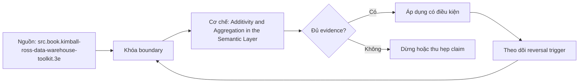

# Additivity and Aggregation in the Semantic Layer

> [!abstract] Câu hỏi trung tâm
> Tầng ngữ nghĩa phải mã hóa additivity như thế nào để từ chối hoặc rewrite truy vấn sai mà không chặn nhầm các truy vấn hợp lệ?

## 1. Aggregation contract theo dimension

Additivity không phải thuộc tính boolean của cột. Sales amount có thể sum qua product/store/time nếu currency và grain đồng nhất; inventory balance sum qua product/store nhưng thường lấy last/average qua time; margin rate không sum qua bất kỳ chiều nào. Contract cần operator mặc định, dimensions cho phép, operator override theo dimension, unit/currency và behavior khi dimension không có trong query.

## 2. Additive, semi-additive, non-additive

Additive measure roll up bằng associative operator trên disjoint partitions. Semi-additive measure có operator khác theo một chiều: balance có thể SUM across accounts nhưng LAST_NON_EMPTY across date. Non-additive ratio cần aggregate components; distinct count cần union/recompute/sketch; percentile cần distribution/sketch. Khai `SUM` mặc định cho mọi numeric field là lỗi modeling, không phải lỗi người dùng.

## 3. Từ chối, rewrite hay tính lại

Semantic engine có ba phản ứng hợp lệ: reject query với diagnostic; rewrite xuống atomic grain rồi aggregate đúng; hoặc dùng state mergeable như numerator/denominator hay HLL sketch. Im lặng sum pre-aggregated distinct counts là không hợp lệ. Diagnostic cần nêu metric, requested dimensions, violated rule và alternative. Reject quá tay cũng là defect: query additive theo permitted dimensions phải chạy.

## 4. Aggregate awareness

Pre-aggregate chỉ dùng nếu materialized grain chứa mọi requested dimensions/filters và stored state có thể re-aggregate đúng. Fully additive sums có thể roll up; average cần sum+count; ratio cần numerator+denominator; distinct needs mergeable sketch hoặc atomic IDs; last-value cần period boundary/state. Router phải semantic-diff aggregate table với atomic query trên fixture trước khi coi nó tương đương.

## 5. Distinct count và chi phí

COUNT(DISTINCT entity) không cộng qua regions hoặc months nếu entity xuất hiện nhiều nhóm. Exact result cần scan/deduplicate at requested grain; approximate sketch giảm cost nhưng thêm error bound, seed/algorithm/version và merge compatibility. Đo wall time, bytes scanned, shuffle/memory và error ở ba grains. Không gọi approximate result là exact, và không dùng một benchmark warmed cache để kết luận chung.

## 6. Negative tests và false positives

Bộ test gồm năm invalid queries: sum balance over time, sum rate, sum distinct counts, use incompatible aggregate, combine different units. Năm valid controls thay một điều kiện để chứng minh rule không chặn quá tay. Mỗi rejection cần stable error code. Nếu engine không thể reject, wrapper/lint/contract test phải bắt trước consumption; dashboard số sai không được coi là trách nhiệm analyst.

## 7. Quan hệ với SQL engine

PostgreSQL mô tả mechanics của `sum`, `avg`, `count` và behavior trên empty set; SQL engine không biết business additivity. Semantic layer bổ sung constraint trên nghĩa và query shape. NULL result của aggregate trên tập rỗng, trừ count, phải được xử lý theo metric policy; `COALESCE(...,0)` chỉ đúng khi zero là observation hợp lệ chứ không phải missing/unknown.

## 8. Ma trận kiểm chứng từng mệnh đề

Các mệnh đề dưới đây phải được kiểm bằng fixture, invariant và output có thể chạy lại. Việc công cụ compile được YAML hoặc sinh SQL không tự chứng minh metric đúng nghĩa.

### 8.1. additivity phải khai theo dimension

**Mệnh đề cần kiểm.** additivity phải khai theo dimension.

**Cách kiểm.** Khai mười measures/metrics; chạy năm invalid và năm valid controls. Lưu rejection codes hoặc rewritten SQL, semantic diff với atomic oracle và cost/error của exact so với approximate distinct. Với mệnh đề này, ghi rõ dữ liệu phản ví dụ, expected result và failure signal. Tách validation cấu trúc khỏi xác nhận meaning của owner.

**Bằng chứng đạt cho `wiki.semantic-layer.additivity-enforcement`.** Lưu contract/graph, snapshot, query hoặc compiled SQL, output thô, semantic diff và assumptions. Chỉ đánh dấu đạt khi cùng artifact cho kết quả lặp lại ở cùng version/cutoff; nếu chưa chạy, đây là test protocol chứ chưa phải kết quả production.

### 8.2. currency mismatch chặn sum dù cùng numeric type

**Mệnh đề cần kiểm.** currency mismatch chặn sum dù cùng numeric type.

**Cách kiểm.** Khai mười measures/metrics; chạy năm invalid và năm valid controls. Lưu rejection codes hoặc rewritten SQL, semantic diff với atomic oracle và cost/error của exact so với approximate distinct. Với mệnh đề này, ghi rõ dữ liệu phản ví dụ, expected result và failure signal. Tách validation cấu trúc khỏi xác nhận meaning của owner.

**Bằng chứng đạt cho `wiki.semantic-layer.additivity-enforcement`.** Lưu contract/graph, snapshot, query hoặc compiled SQL, output thô, semantic diff và assumptions. Chỉ đánh dấu đạt khi cùng artifact cho kết quả lặp lại ở cùng version/cutoff; nếu chưa chạy, đây là test protocol chứ chưa phải kết quả production.

### 8.3. balance cần time-specific aggregation

**Mệnh đề cần kiểm.** balance cần time-specific aggregation.

**Cách kiểm.** Khai mười measures/metrics; chạy năm invalid và năm valid controls. Lưu rejection codes hoặc rewritten SQL, semantic diff với atomic oracle và cost/error của exact so với approximate distinct. Với mệnh đề này, ghi rõ dữ liệu phản ví dụ, expected result và failure signal. Tách validation cấu trúc khỏi xác nhận meaning của owner.

**Bằng chứng đạt cho `wiki.semantic-layer.additivity-enforcement`.** Lưu contract/graph, snapshot, query hoặc compiled SQL, output thô, semantic diff và assumptions. Chỉ đánh dấu đạt khi cùng artifact cho kết quả lặp lại ở cùng version/cutoff; nếu chưa chạy, đây là test protocol chứ chưa phải kết quả production.

### 8.4. ratio phải aggregate components

**Mệnh đề cần kiểm.** ratio phải aggregate components.

**Cách kiểm.** Khai mười measures/metrics; chạy năm invalid và năm valid controls. Lưu rejection codes hoặc rewritten SQL, semantic diff với atomic oracle và cost/error của exact so với approximate distinct. Với mệnh đề này, ghi rõ dữ liệu phản ví dụ, expected result và failure signal. Tách validation cấu trúc khỏi xác nhận meaning của owner.

**Bằng chứng đạt cho `wiki.semantic-layer.additivity-enforcement`.** Lưu contract/graph, snapshot, query hoặc compiled SQL, output thô, semantic diff và assumptions. Chỉ đánh dấu đạt khi cùng artifact cho kết quả lặp lại ở cùng version/cutoff; nếu chưa chạy, đây là test protocol chứ chưa phải kết quả production.

### 8.5. distinct count không cộng qua overlapping groups

**Mệnh đề cần kiểm.** distinct count không cộng qua overlapping groups.

**Cách kiểm.** Khai mười measures/metrics; chạy năm invalid và năm valid controls. Lưu rejection codes hoặc rewritten SQL, semantic diff với atomic oracle và cost/error của exact so với approximate distinct. Với mệnh đề này, ghi rõ dữ liệu phản ví dụ, expected result và failure signal. Tách validation cấu trúc khỏi xác nhận meaning của owner.

**Bằng chứng đạt cho `wiki.semantic-layer.additivity-enforcement`.** Lưu contract/graph, snapshot, query hoặc compiled SQL, output thô, semantic diff và assumptions. Chỉ đánh dấu đạt khi cùng artifact cho kết quả lặp lại ở cùng version/cutoff; nếu chưa chạy, đây là test protocol chứ chưa phải kết quả production.

### 8.6. percentile cần raw distribution hoặc mergeable state

**Mệnh đề cần kiểm.** percentile cần raw distribution hoặc mergeable state.

**Cách kiểm.** Khai mười measures/metrics; chạy năm invalid và năm valid controls. Lưu rejection codes hoặc rewritten SQL, semantic diff với atomic oracle và cost/error của exact so với approximate distinct. Với mệnh đề này, ghi rõ dữ liệu phản ví dụ, expected result và failure signal. Tách validation cấu trúc khỏi xác nhận meaning của owner.

**Bằng chứng đạt cho `wiki.semantic-layer.additivity-enforcement`.** Lưu contract/graph, snapshot, query hoặc compiled SQL, output thô, semantic diff và assumptions. Chỉ đánh dấu đạt khi cùng artifact cho kết quả lặp lại ở cùng version/cutoff; nếu chưa chạy, đây là test protocol chứ chưa phải kết quả production.

### 8.7. engine có thể reject rewrite hoặc recompute

**Mệnh đề cần kiểm.** engine có thể reject rewrite hoặc recompute.

**Cách kiểm.** Khai mười measures/metrics; chạy năm invalid và năm valid controls. Lưu rejection codes hoặc rewritten SQL, semantic diff với atomic oracle và cost/error của exact so với approximate distinct. Với mệnh đề này, ghi rõ dữ liệu phản ví dụ, expected result và failure signal. Tách validation cấu trúc khỏi xác nhận meaning của owner.

**Bằng chứng đạt cho `wiki.semantic-layer.additivity-enforcement`.** Lưu contract/graph, snapshot, query hoặc compiled SQL, output thô, semantic diff và assumptions. Chỉ đánh dấu đạt khi cùng artifact cho kết quả lặp lại ở cùng version/cutoff; nếu chưa chạy, đây là test protocol chứ chưa phải kết quả production.

### 8.8. diagnostic phải nêu violated rule

**Mệnh đề cần kiểm.** diagnostic phải nêu violated rule.

**Cách kiểm.** Khai mười measures/metrics; chạy năm invalid và năm valid controls. Lưu rejection codes hoặc rewritten SQL, semantic diff với atomic oracle và cost/error của exact so với approximate distinct. Với mệnh đề này, ghi rõ dữ liệu phản ví dụ, expected result và failure signal. Tách validation cấu trúc khỏi xác nhận meaning của owner.

**Bằng chứng đạt cho `wiki.semantic-layer.additivity-enforcement`.** Lưu contract/graph, snapshot, query hoặc compiled SQL, output thô, semantic diff và assumptions. Chỉ đánh dấu đạt khi cùng artifact cho kết quả lặp lại ở cùng version/cutoff; nếu chưa chạy, đây là test protocol chứ chưa phải kết quả production.

### 8.9. valid control query không được bị block

**Mệnh đề cần kiểm.** valid control query không được bị block.

**Cách kiểm.** Khai mười measures/metrics; chạy năm invalid và năm valid controls. Lưu rejection codes hoặc rewritten SQL, semantic diff với atomic oracle và cost/error của exact so với approximate distinct. Với mệnh đề này, ghi rõ dữ liệu phản ví dụ, expected result và failure signal. Tách validation cấu trúc khỏi xác nhận meaning của owner.

**Bằng chứng đạt cho `wiki.semantic-layer.additivity-enforcement`.** Lưu contract/graph, snapshot, query hoặc compiled SQL, output thô, semantic diff và assumptions. Chỉ đánh dấu đạt khi cùng artifact cho kết quả lặp lại ở cùng version/cutoff; nếu chưa chạy, đây là test protocol chứ chưa phải kết quả production.

### 8.10. preaggregate phải chứa requested dimensions

**Mệnh đề cần kiểm.** preaggregate phải chứa requested dimensions.

**Cách kiểm.** Khai mười measures/metrics; chạy năm invalid và năm valid controls. Lưu rejection codes hoặc rewritten SQL, semantic diff với atomic oracle và cost/error của exact so với approximate distinct. Với mệnh đề này, ghi rõ dữ liệu phản ví dụ, expected result và failure signal. Tách validation cấu trúc khỏi xác nhận meaning của owner.

**Bằng chứng đạt cho `wiki.semantic-layer.additivity-enforcement`.** Lưu contract/graph, snapshot, query hoặc compiled SQL, output thô, semantic diff và assumptions. Chỉ đánh dấu đạt khi cùng artifact cho kết quả lặp lại ở cùng version/cutoff; nếu chưa chạy, đây là test protocol chứ chưa phải kết quả production.

### 8.11. average preaggregate cần sum và count

**Mệnh đề cần kiểm.** average preaggregate cần sum và count.

**Cách kiểm.** Khai mười measures/metrics; chạy năm invalid và năm valid controls. Lưu rejection codes hoặc rewritten SQL, semantic diff với atomic oracle và cost/error của exact so với approximate distinct. Với mệnh đề này, ghi rõ dữ liệu phản ví dụ, expected result và failure signal. Tách validation cấu trúc khỏi xác nhận meaning của owner.

**Bằng chứng đạt cho `wiki.semantic-layer.additivity-enforcement`.** Lưu contract/graph, snapshot, query hoặc compiled SQL, output thô, semantic diff và assumptions. Chỉ đánh dấu đạt khi cùng artifact cho kết quả lặp lại ở cùng version/cutoff; nếu chưa chạy, đây là test protocol chứ chưa phải kết quả production.

### 8.12. sketch cần error/version contract

**Mệnh đề cần kiểm.** sketch cần error/version contract.

**Cách kiểm.** Khai mười measures/metrics; chạy năm invalid và năm valid controls. Lưu rejection codes hoặc rewritten SQL, semantic diff với atomic oracle và cost/error của exact so với approximate distinct. Với mệnh đề này, ghi rõ dữ liệu phản ví dụ, expected result và failure signal. Tách validation cấu trúc khỏi xác nhận meaning của owner.

**Bằng chứng đạt cho `wiki.semantic-layer.additivity-enforcement`.** Lưu contract/graph, snapshot, query hoặc compiled SQL, output thô, semantic diff và assumptions. Chỉ đánh dấu đạt khi cùng artifact cho kết quả lặp lại ở cùng version/cutoff; nếu chưa chạy, đây là test protocol chứ chưa phải kết quả production.

### 8.13. empty-set null khác business zero

**Mệnh đề cần kiểm.** empty-set null khác business zero.

**Cách kiểm.** Khai mười measures/metrics; chạy năm invalid và năm valid controls. Lưu rejection codes hoặc rewritten SQL, semantic diff với atomic oracle và cost/error của exact so với approximate distinct. Với mệnh đề này, ghi rõ dữ liệu phản ví dụ, expected result và failure signal. Tách validation cấu trúc khỏi xác nhận meaning của owner.

**Bằng chứng đạt cho `wiki.semantic-layer.additivity-enforcement`.** Lưu contract/graph, snapshot, query hoặc compiled SQL, output thô, semantic diff và assumptions. Chỉ đánh dấu đạt khi cùng artifact cho kết quả lặp lại ở cùng version/cutoff; nếu chưa chạy, đây là test protocol chứ chưa phải kết quả production.

### 8.14. approximate không được gắn nhãn exact

**Mệnh đề cần kiểm.** approximate không được gắn nhãn exact.

**Cách kiểm.** Khai mười measures/metrics; chạy năm invalid và năm valid controls. Lưu rejection codes hoặc rewritten SQL, semantic diff với atomic oracle và cost/error của exact so với approximate distinct. Với mệnh đề này, ghi rõ dữ liệu phản ví dụ, expected result và failure signal. Tách validation cấu trúc khỏi xác nhận meaning của owner.

**Bằng chứng đạt cho `wiki.semantic-layer.additivity-enforcement`.** Lưu contract/graph, snapshot, query hoặc compiled SQL, output thô, semantic diff và assumptions. Chỉ đánh dấu đạt khi cùng artifact cho kết quả lặp lại ở cùng version/cutoff; nếu chưa chạy, đây là test protocol chứ chưa phải kết quả production.

### 8.15. aggregate router cần semantic equivalence test

**Mệnh đề cần kiểm.** aggregate router cần semantic equivalence test.

**Cách kiểm.** Khai mười measures/metrics; chạy năm invalid và năm valid controls. Lưu rejection codes hoặc rewritten SQL, semantic diff với atomic oracle và cost/error của exact so với approximate distinct. Với mệnh đề này, ghi rõ dữ liệu phản ví dụ, expected result và failure signal. Tách validation cấu trúc khỏi xác nhận meaning của owner.

**Bằng chứng đạt cho `wiki.semantic-layer.additivity-enforcement`.** Lưu contract/graph, snapshot, query hoặc compiled SQL, output thô, semantic diff và assumptions. Chỉ đánh dấu đạt khi cùng artifact cho kết quả lặp lại ở cùng version/cutoff; nếu chưa chạy, đây là test protocol chứ chưa phải kết quả production.

## 9. Quy trình phản biện

1. Viết business question, population, grain, identity, time và unit trước syntax.
2. Chỉ ra artifact canonical, owner, version và change process.
3. Tách source fact, product-version detail và curriculum synthesis.
4. Dựng normal case cùng phản ví dụ: denominator lệch, fanout, sparse period, timezone boundary hoặc non-additive rollup.
5. So eligible rows và intermediate components trước final value; hai lỗi có thể triệt tiêu ở số cuối.
6. Chạy negative tests song song với valid controls để phát hiện cả false negative và false positive.
7. Lưu failed run, limitations và conditions khiến kết luận phải đổi.

## 10. Câu hỏi tự kiểm tra

1. Metric đang trả lời câu hỏi nào, trên population và grain nào?
2. Entity/dimension nào reachable qua path nào, cardinality gì?
3. Aggregation nào hợp lệ theo từng dimension và time grain?
4. Ca biên nào cho kết quả hợp lệ cú pháp nhưng sai nghĩa?
5. Chi tiết nào là khái niệm ổn định, chi tiết nào phụ thuộc phiên bản sản phẩm?
6. Bằng chứng nào cho phép người khác bác bỏ implementation?

## 11. Giới hạn và điều chưa cho phép kết luận

- Chưa chạy lab hai người, semantic graph planner, ratio rollup, aggregation rejection hoặc calendar fixture; note mô tả protocol cần thực thi.
- dbt/MetricFlow là ví dụ sản phẩm được kiểm ngày 2026-10-01; syntax và availability có thể đổi theo version/tier.
- PostgreSQL documentation mô tả SQL mechanics, không tự cung cấp business semantics hay metric governance.
- Kimball-Ross hỗ trợ grain, additivity và calendar modeling; semantic-layer enforcement là phần tổng hợp có đối chiếu tài liệu hiện hành.
- Owner chưa phê duyệt meaning nên note giữ trạng thái `review`.

## Reference
1. [[SRC-KIMBALL-ROSS-DW-TOOLKIT-3E]]
2. [[SRC-DBT-SEMANTIC-MODELS]]
3. [[SRC-POSTGRESQL-17-AGGREGATE-FUNCTIONS]]

## Source coverage

| Source slice | Nội dung sử dụng | Trạng thái |
|---|---|---|
| [[SRC-KIMBALL-ROSS-DW-TOOLKIT-3E]] | Khái niệm, cơ chế, product detail hoặc SQL behavior liên quan | Đã đọc phạm vi có locator; không suy ngoài phạm vi |
| [[SRC-DBT-SEMANTIC-MODELS]] | Khái niệm, cơ chế, product detail hoặc SQL behavior liên quan | Đã đọc phạm vi có locator; không suy ngoài phạm vi |
| [[SRC-POSTGRESQL-17-AGGREGATE-FUNCTIONS]] | Khái niệm, cơ chế, product detail hoặc SQL behavior liên quan | Đã đọc phạm vi có locator; không suy ngoài phạm vi |

## Key takeaways
- Metric contract bắt đầu từ population, grain, time, filters, aggregation và ownership; tên metric không đủ.
- Semantic graph phải mã hóa identity, cardinality và path semantics để phát hiện fanout hoặc ambiguity.
- Ratio, cumulative, distinct và semi-additive metrics cần state/behavior riêng; không roll up như số cộng được.
- Time comparison đúng cần dense calendar, timezone, fiscal policy, partial-period và leap-day rules.
- Chưa chạy protocol thì note là tài liệu học thuật có truy nguồn, không phải chứng nhận production.

<!-- ATOMIC-EXECUTION-CAPSULE:START -->

## Execution capsule: kiểm chứng `wiki.semantic-layer.additivity-enforcement`

> [!important] Phân loại mệnh đề
> Với `wiki.semantic-layer.additivity-enforcement`, sơ đồ, ví dụ và artifact về **Additivity and Aggregation in the Semantic Layer** là **synthesis để kiểm chứng**; chúng không phải trích dẫn hay case nguyên văn của nguồn.

### Sơ đồ cơ chế và điểm kiểm soát



Đọc sơ đồ `wiki.semantic-layer.additivity-enforcement` từ trái sang phải: source chỉ cung cấp claim ban đầu cho **Additivity and Aggregation in the Semantic Layer**; quyết định chỉ được đi tiếp sau khi boundary, evidence và điều kiện đảo quyết định đã hiện hữu.

### Artifact thực thi tối thiểu

```sql
-- Verification harness for: Additivity and Aggregation in the Semantic Layer
WITH evidence AS (
    SELECT 'wiki.semantic-layer.additivity-enforcement' AS concept_id,
           'boundary_declared' AS check_name, 1 AS passed
    UNION ALL
    SELECT 'wiki.semantic-layer.additivity-enforcement', 'independent_oracle', 1
    UNION ALL
    SELECT 'wiki.semantic-layer.additivity-enforcement', 'reversal_trigger_recorded', 1
)
SELECT concept_id,
       MIN(passed) AS all_hard_checks_pass,
       COUNT(*) AS evidence_items
FROM evidence
GROUP BY concept_id
HAVING MIN(passed) = 1;
```

Artifact của `wiki.semantic-layer.additivity-enforcement` buộc người dùng ghi boundary, oracle và reversal trigger cho **Additivity and Aggregation in the Semantic Layer**. Các giá trị minh họa phải được thay bằng evidence thật trước khi dùng cho quyết định.

### Tự kiểm tra trước khi tái sử dụng

1. Bạn có thể trả lời `Tầng ngữ nghĩa phải mã hóa additivity như thế nào để từ chối hoặc rewrite truy vấn sai mà không chặn nhầm các truy vấn hợp lệ?` bằng một câu mà không kéo thêm concept thứ hai không?
2. Source locator nào đỡ cho claim, và phần nào chỉ là synthesis trong note?
3. Observation nào khiến bạn dừng, thu hẹp hoặc đảo quyết định?
4. Artifact nào cho phép một reviewer độc lập tái hiện kết quả?

<!-- ATOMIC-EXECUTION-CAPSULE:END -->
