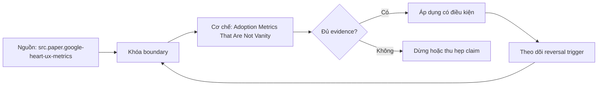

# Adoption Metrics That Are Not Vanity

> [!abstract] Câu hỏi trung tâm
> Bộ đo adoption nào nối product goals với hành vi và decision outcomes, tránh activity counts, denominator sai, trust proxy mơ hồ và incentive gaming?

## 1. Đi từ goal tới signal rồi metric

HEART cung cấp năm góc nhìn Happiness, Engagement, Adoption, Retention và Task Success; Goals–Signals–Metrics buộc nêu mục tiêu trước tín hiệu và phép tính. Với data product, goal có thể là một cohort ra quyết định định kỳ bằng metric certified mà không cần handoff thủ công. Signal gồm use đúng persona/cadence, task hoàn tất đúng và decision record có evidence. Metric chỉ hợp lệ khi có population, event, grain, time window, owner, quality và action threshold; log dễ lấy không phải lý do đủ để chọn.

## 2. Adoption và active use theo nhịp quyết định

Activated user phải hoàn tất activation event có ý nghĩa, chẳng hạn tìm đúng product, chạy use case đầu và giải thích đúng grain; được cấp quyền không phải activation. Active cadence theo natural decision cycle: daily cho operations, monthly cho close, quarterly cho planning. Dùng DAU cho quarterly product sẽ gọi người dùng tốt là inactive; dùng MAU có thể che failed daily workflows. Loại bots, service accounts, scheduled refresh hoặc tách thành automation cohort. Báo cohort eligible, activated, active và dormant để denominator minh bạch.

## 3. Retention và breadth không thay correctness

Retention đo cohort quay lại thực hiện value event sau lần đầu, không phải page view. Breadth cho biết bao nhiêu teams/personas/decisions có use; depth cho biết frequency hoặc workflows per active. Cả hai có thể tăng khi user dùng product sai. Kết hợp task success, semantic correctness, stale/incident exposure và high-stakes review. Amplitude North Star phân biệt outcome và input metrics; bài sử dụng distinction này nhưng không coi một North Star duy nhất đủ cho data product governance.

## 4. Support-free answer rate cần guardrails

Tử số là eligible analytical tasks hoàn tất đúng trong product scope mà không cần human intervention ngoài published enablement; mẫu số là toàn bộ eligible attempts, gồm abandon và escalations. Ticket count riêng không đủ vì user có thể bỏ cuộc hoặc tạo shadow spreadsheet. Audit một sample kết quả và confident-wrong rate; giảm support nhưng tăng sai số là regression. Phân loại intervention thành access, docs, product defect, skill hoặc novel analysis để không phạt đúng escalation của câu hỏi level 3.

## 5. Decision evidence không chứng minh impact

Một decision record trích product/version, metric và cutoff cho thấy adoption vào process, nhưng không chứng minh quyết định tốt hoặc product gây business outcome. Đo coverage: số eligible decisions có traceable evidence / toàn eligible decisions; bổ sung reviewer quality, freshness và alternative sources. Tránh khuyến khích chèn link hình thức bằng sampling. Outcome metric ở business level cần counterfactual/causal design riêng; adoption metrics chỉ chứng minh use pattern và process integration.

## 6. Trust cần đo nhiều tín hiệu

Roadmap gọi tỷ lệ tự kiểm chứng bằng nguồn khác là nghịch đảo của trust; quan hệ này không xác định. Cross-check có thể do low trust, high stakes, policy bắt buộc hoặc practice tốt. Đo trust bằng calibrated survey, explain-back, willingness-to-use, repeat use sau incident, discrepancy reports, freshness/quality awareness và verification reason. Trust cao mù quáng cũng nguy hiểm; target là calibrated reliance: user biết khi nào dùng, kiểm hoặc dừng. Luôn phân tách attitude, behavior và observed correctness.

## 7. Vanity, gaming và audit

Số tables hoặc dashboards là output/activity count; chưa có bằng chứng để khẳng định dashboard count tương quan nghịch với quality. Access grants đo entitlement, không đo use. Các số này hữu ích cho inventory/capacity nhưng không đại diện adoption/value. Với mỗi KPI viết gaming hypothesis: spam dashboards, auto-refresh để tăng actives, đóng tickets không giải quyết, bắt buộc link evidence. Thêm guardrail, segmentation, raw-event quality và metric review cadence. Lab phải tính metric hợp lệ lẫn activity counts trên cùng data rồi nêu quyết định sai mà từng proxy có thể gây ra.

## 8. Ma trận kiểm chứng từng mệnh đề

Mọi kết luận cần raw artifact, version và failure signal. Một dashboard xanh, sync completed, catalog label hoặc bảng cost có số không tự chứng minh correctness, security, value hay readiness.

### 8.1. goal signal metric đi trước event instrumentation

**Mệnh đề cần kiểm.** goal signal metric đi trước event instrumentation.

**Cách kiểm.** Từ versioned access/task/decision/support events, tính goals–signals–metrics theo cohort và natural cadence. Inject bots, scheduled refresh, abandon, confident-wrong và mandatory cross-check; kiểm denominator, segmentation, gaming và guardrails. Với mệnh đề này, ghi environment/product/policy version, input shape, expected observation, failure signal và boundary làm kết luận không còn đúng.

**Bằng chứng đạt cho `wiki.data-product.adoption-metrics`.** Lưu contract/policy, fixture hoặc event extract, command/query, raw output, numerator–denominator hoặc cost reconciliation, reviewer và artifact hash. Nếu chưa chạy lab trên hệ được phép, chỉ ghi protocol; không biến expected result thành evidence.

### 8.2. HEART categories không bắt buộc dùng đủ năm

**Mệnh đề cần kiểm.** HEART categories không bắt buộc dùng đủ năm.

**Cách kiểm.** Từ versioned access/task/decision/support events, tính goals–signals–metrics theo cohort và natural cadence. Inject bots, scheduled refresh, abandon, confident-wrong và mandatory cross-check; kiểm denominator, segmentation, gaming và guardrails. Với mệnh đề này, ghi environment/product/policy version, input shape, expected observation, failure signal và boundary làm kết luận không còn đúng.

**Bằng chứng đạt cho `wiki.data-product.adoption-metrics`.** Lưu contract/policy, fixture hoặc event extract, command/query, raw output, numerator–denominator hoặc cost reconciliation, reviewer và artifact hash. Nếu chưa chạy lab trên hệ được phép, chỉ ghi protocol; không biến expected result thành evidence.

### 8.3. access grant khác activation

**Mệnh đề cần kiểm.** access grant khác activation.

**Cách kiểm.** Từ versioned access/task/decision/support events, tính goals–signals–metrics theo cohort và natural cadence. Inject bots, scheduled refresh, abandon, confident-wrong và mandatory cross-check; kiểm denominator, segmentation, gaming và guardrails. Với mệnh đề này, ghi environment/product/policy version, input shape, expected observation, failure signal và boundary làm kết luận không còn đúng.

**Bằng chứng đạt cho `wiki.data-product.adoption-metrics`.** Lưu contract/policy, fixture hoặc event extract, command/query, raw output, numerator–denominator hoặc cost reconciliation, reviewer và artifact hash. Nếu chưa chạy lab trên hệ được phép, chỉ ghi protocol; không biến expected result thành evidence.

### 8.4. active cadence khớp decision cycle

**Mệnh đề cần kiểm.** active cadence khớp decision cycle.

**Cách kiểm.** Từ versioned access/task/decision/support events, tính goals–signals–metrics theo cohort và natural cadence. Inject bots, scheduled refresh, abandon, confident-wrong và mandatory cross-check; kiểm denominator, segmentation, gaming và guardrails. Với mệnh đề này, ghi environment/product/policy version, input shape, expected observation, failure signal và boundary làm kết luận không còn đúng.

**Bằng chứng đạt cho `wiki.data-product.adoption-metrics`.** Lưu contract/policy, fixture hoặc event extract, command/query, raw output, numerator–denominator hoặc cost reconciliation, reviewer và artifact hash. Nếu chưa chạy lab trên hệ được phép, chỉ ghi protocol; không biến expected result thành evidence.

### 8.5. bots và scheduled refresh tách cohort

**Mệnh đề cần kiểm.** bots và scheduled refresh tách cohort.

**Cách kiểm.** Từ versioned access/task/decision/support events, tính goals–signals–metrics theo cohort và natural cadence. Inject bots, scheduled refresh, abandon, confident-wrong và mandatory cross-check; kiểm denominator, segmentation, gaming và guardrails. Với mệnh đề này, ghi environment/product/policy version, input shape, expected observation, failure signal và boundary làm kết luận không còn đúng.

**Bằng chứng đạt cho `wiki.data-product.adoption-metrics`.** Lưu contract/policy, fixture hoặc event extract, command/query, raw output, numerator–denominator hoặc cost reconciliation, reviewer và artifact hash. Nếu chưa chạy lab trên hệ được phép, chỉ ghi protocol; không biến expected result thành evidence.

### 8.6. retention dùng value event không dùng page view

**Mệnh đề cần kiểm.** retention dùng value event không dùng page view.

**Cách kiểm.** Từ versioned access/task/decision/support events, tính goals–signals–metrics theo cohort và natural cadence. Inject bots, scheduled refresh, abandon, confident-wrong và mandatory cross-check; kiểm denominator, segmentation, gaming và guardrails. Với mệnh đề này, ghi environment/product/policy version, input shape, expected observation, failure signal và boundary làm kết luận không còn đúng.

**Bằng chứng đạt cho `wiki.data-product.adoption-metrics`.** Lưu contract/policy, fixture hoặc event extract, command/query, raw output, numerator–denominator hoặc cost reconciliation, reviewer và artifact hash. Nếu chưa chạy lab trên hệ được phép, chỉ ghi protocol; không biến expected result thành evidence.

### 8.7. breadth và depth không chứng minh correctness

**Mệnh đề cần kiểm.** breadth và depth không chứng minh correctness.

**Cách kiểm.** Từ versioned access/task/decision/support events, tính goals–signals–metrics theo cohort và natural cadence. Inject bots, scheduled refresh, abandon, confident-wrong và mandatory cross-check; kiểm denominator, segmentation, gaming và guardrails. Với mệnh đề này, ghi environment/product/policy version, input shape, expected observation, failure signal và boundary làm kết luận không còn đúng.

**Bằng chứng đạt cho `wiki.data-product.adoption-metrics`.** Lưu contract/policy, fixture hoặc event extract, command/query, raw output, numerator–denominator hoặc cost reconciliation, reviewer và artifact hash. Nếu chưa chạy lab trên hệ được phép, chỉ ghi protocol; không biến expected result thành evidence.

### 8.8. support-free denominator gồm abandon và escalation

**Mệnh đề cần kiểm.** support-free denominator gồm abandon và escalation.

**Cách kiểm.** Từ versioned access/task/decision/support events, tính goals–signals–metrics theo cohort và natural cadence. Inject bots, scheduled refresh, abandon, confident-wrong và mandatory cross-check; kiểm denominator, segmentation, gaming và guardrails. Với mệnh đề này, ghi environment/product/policy version, input shape, expected observation, failure signal và boundary làm kết luận không còn đúng.

**Bằng chứng đạt cho `wiki.data-product.adoption-metrics`.** Lưu contract/policy, fixture hoặc event extract, command/query, raw output, numerator–denominator hoặc cost reconciliation, reviewer và artifact hash. Nếu chưa chạy lab trên hệ được phép, chỉ ghi protocol; không biến expected result thành evidence.

### 8.9. sample audit chặn confident-wrong self-service

**Mệnh đề cần kiểm.** sample audit chặn confident-wrong self-service.

**Cách kiểm.** Từ versioned access/task/decision/support events, tính goals–signals–metrics theo cohort và natural cadence. Inject bots, scheduled refresh, abandon, confident-wrong và mandatory cross-check; kiểm denominator, segmentation, gaming và guardrails. Với mệnh đề này, ghi environment/product/policy version, input shape, expected observation, failure signal và boundary làm kết luận không còn đúng.

**Bằng chứng đạt cho `wiki.data-product.adoption-metrics`.** Lưu contract/policy, fixture hoặc event extract, command/query, raw output, numerator–denominator hoặc cost reconciliation, reviewer và artifact hash. Nếu chưa chạy lab trên hệ được phép, chỉ ghi protocol; không biến expected result thành evidence.

### 8.10. level-three escalation không bị tính là failure

**Mệnh đề cần kiểm.** level-three escalation không bị tính là failure.

**Cách kiểm.** Từ versioned access/task/decision/support events, tính goals–signals–metrics theo cohort và natural cadence. Inject bots, scheduled refresh, abandon, confident-wrong và mandatory cross-check; kiểm denominator, segmentation, gaming và guardrails. Với mệnh đề này, ghi environment/product/policy version, input shape, expected observation, failure signal và boundary làm kết luận không còn đúng.

**Bằng chứng đạt cho `wiki.data-product.adoption-metrics`.** Lưu contract/policy, fixture hoặc event extract, command/query, raw output, numerator–denominator hoặc cost reconciliation, reviewer và artifact hash. Nếu chưa chạy lab trên hệ được phép, chỉ ghi protocol; không biến expected result thành evidence.

### 8.11. decision evidence coverage không chứng minh causal impact

**Mệnh đề cần kiểm.** decision evidence coverage không chứng minh causal impact.

**Cách kiểm.** Từ versioned access/task/decision/support events, tính goals–signals–metrics theo cohort và natural cadence. Inject bots, scheduled refresh, abandon, confident-wrong và mandatory cross-check; kiểm denominator, segmentation, gaming và guardrails. Với mệnh đề này, ghi environment/product/policy version, input shape, expected observation, failure signal và boundary làm kết luận không còn đúng.

**Bằng chứng đạt cho `wiki.data-product.adoption-metrics`.** Lưu contract/policy, fixture hoặc event extract, command/query, raw output, numerator–denominator hoặc cost reconciliation, reviewer và artifact hash. Nếu chưa chạy lab trên hệ được phép, chỉ ghi protocol; không biến expected result thành evidence.

### 8.12. cross-check rate không phải trust inverse trực tiếp

**Mệnh đề cần kiểm.** cross-check rate không phải trust inverse trực tiếp.

**Cách kiểm.** Từ versioned access/task/decision/support events, tính goals–signals–metrics theo cohort và natural cadence. Inject bots, scheduled refresh, abandon, confident-wrong và mandatory cross-check; kiểm denominator, segmentation, gaming và guardrails. Với mệnh đề này, ghi environment/product/policy version, input shape, expected observation, failure signal và boundary làm kết luận không còn đúng.

**Bằng chứng đạt cho `wiki.data-product.adoption-metrics`.** Lưu contract/policy, fixture hoặc event extract, command/query, raw output, numerator–denominator hoặc cost reconciliation, reviewer và artifact hash. Nếu chưa chạy lab trên hệ được phép, chỉ ghi protocol; không biến expected result thành evidence.

### 8.13. trust cần calibrated reliance

**Mệnh đề cần kiểm.** trust cần calibrated reliance.

**Cách kiểm.** Từ versioned access/task/decision/support events, tính goals–signals–metrics theo cohort và natural cadence. Inject bots, scheduled refresh, abandon, confident-wrong và mandatory cross-check; kiểm denominator, segmentation, gaming và guardrails. Với mệnh đề này, ghi environment/product/policy version, input shape, expected observation, failure signal và boundary làm kết luận không còn đúng.

**Bằng chứng đạt cho `wiki.data-product.adoption-metrics`.** Lưu contract/policy, fixture hoặc event extract, command/query, raw output, numerator–denominator hoặc cost reconciliation, reviewer và artifact hash. Nếu chưa chạy lab trên hệ được phép, chỉ ghi protocol; không biến expected result thành evidence.

### 8.14. dashboard count là activity không mặc nhiên inverse quality

**Mệnh đề cần kiểm.** dashboard count là activity không mặc nhiên inverse quality.

**Cách kiểm.** Từ versioned access/task/decision/support events, tính goals–signals–metrics theo cohort và natural cadence. Inject bots, scheduled refresh, abandon, confident-wrong và mandatory cross-check; kiểm denominator, segmentation, gaming và guardrails. Với mệnh đề này, ghi environment/product/policy version, input shape, expected observation, failure signal và boundary làm kết luận không còn đúng.

**Bằng chứng đạt cho `wiki.data-product.adoption-metrics`.** Lưu contract/policy, fixture hoặc event extract, command/query, raw output, numerator–denominator hoặc cost reconciliation, reviewer và artifact hash. Nếu chưa chạy lab trên hệ được phép, chỉ ghi protocol; không biến expected result thành evidence.

### 8.15. mỗi KPI cần gaming hypothesis và guardrail

**Mệnh đề cần kiểm.** mỗi KPI cần gaming hypothesis và guardrail.

**Cách kiểm.** Từ versioned access/task/decision/support events, tính goals–signals–metrics theo cohort và natural cadence. Inject bots, scheduled refresh, abandon, confident-wrong và mandatory cross-check; kiểm denominator, segmentation, gaming và guardrails. Với mệnh đề này, ghi environment/product/policy version, input shape, expected observation, failure signal và boundary làm kết luận không còn đúng.

**Bằng chứng đạt cho `wiki.data-product.adoption-metrics`.** Lưu contract/policy, fixture hoặc event extract, command/query, raw output, numerator–denominator hoặc cost reconciliation, reviewer và artifact hash. Nếu chưa chạy lab trên hệ được phép, chỉ ghi protocol; không biến expected result thành evidence.

## 9. Quy trình phản biện

1. Chốt product, consumer, decision, environment và criticality trước khi chọn metric hoặc control.
2. Tách tool capability, configured policy, observed behavior và business outcome.
3. Ghi stable IDs, versions, time window, denominator, allocation hoặc identity rules.
4. Kiểm negative/failure path, overload, retry, stale state, hidden consumer và changed constraint.
5. Phân loại source fact, curriculum synthesis, organizational policy và untested hypothesis.
6. Lưu uncertainty, unallocated/unknown set và stop condition; không ép bảng phải cho kết luận.
7. Chưa có execution evidence thì giữ trạng thái `review`.

## 10. Câu hỏi tự kiểm tra

1. Invariant hoặc decision nào đang được bảo vệ?
2. Chủ thể, resource, event hay cost unit được định danh bằng gì?
3. Denominator, time window và unknown/unallocated set là gì?
4. Failure nào vẫn cho tín hiệu xanh hoặc “completed”?
5. Thay đổi nào làm policy, metric, allocation hoặc state transition phải xem lại?
6. Ai có quyền duyệt, ai vận hành và bằng chứng nào còn chưa chạy?

## 11. Giới hạn và điều chưa cho phép kết luận

- Chưa chạy security/load test, adoption analysis, cost allocation, reverse-ETL fault injection hoặc lifecycle exercise; note mô tả protocol và expected evidence.
- Tài liệu web được kiểm ngày 2026-10-01; feature, pricing, law/guidance và vendor behavior có thể đổi.
- Metrics, cost categories, shadow-system constraints và six-state lifecycle là curriculum synthesis; không gán nguyên văn cho một nguồn.
- Guidance privacy không thay legal review; performance/security examples không thay threat model và production authorization.
- Note giữ trạng thái `review` cho tới khi chủ dự án duyệt semantic meaning.

## Reference
1. [[SRC-GOOGLE-HEART-UX-METRICS]]
2. [[SRC-AMPLITUDE-NORTH-STAR-FRAMEWORK]]
3. [[SRC-GOVUK-USABILITY-BENCHMARKING]]

## Source coverage

| Source slice | Nội dung sử dụng | Trạng thái |
|---|---|---|
| [[SRC-GOOGLE-HEART-UX-METRICS]] | Khái niệm, mechanism hoặc governance boundary liên quan | Đã đọc locator trong source record; không suy ngoài phạm vi |
| [[SRC-AMPLITUDE-NORTH-STAR-FRAMEWORK]] | Khái niệm, mechanism hoặc governance boundary liên quan | Đã đọc locator trong source record; không suy ngoài phạm vi |
| [[SRC-GOVUK-USABILITY-BENCHMARKING]] | Khái niệm, mechanism hoặc governance boundary liên quan | Đã đọc locator trong source record; không suy ngoài phạm vi |

## Key takeaways
- Adoption metric bắt đầu từ goal và value event; activity, entitlement và trust proxy mơ hồ không thay outcome.
- Mọi phép đo hoặc gate cần stable version, owner, denominator/scope và failure evidence.
- Signal dễ lấy không được dùng thay decision outcome, correctness hoặc user safety.
- Unknown consumers, unallocated costs, rejected rows và expired evidence phải hiển thị, không mặc định bằng zero.
- Chưa chạy lab thì artifact là tài liệu học thuật đã kiểm cấu trúc, không phải chứng nhận production.

<!-- ATOMIC-EXECUTION-CAPSULE:START -->

## Execution capsule — kiểm chứng `wiki.data-product.adoption-metrics`

> [!important] Phân loại mệnh đề
> Với `wiki.data-product.adoption-metrics`, sơ đồ, ví dụ và artifact về **Adoption Metrics That Are Not Vanity** là **synthesis để kiểm chứng**; chúng không phải trích dẫn hay case nguyên văn của nguồn.

### Sơ đồ cơ chế và điểm kiểm soát



Đọc sơ đồ `wiki.data-product.adoption-metrics` từ trái sang phải: source chỉ cung cấp claim ban đầu cho **Adoption Metrics That Are Not Vanity**; quyết định chỉ được đi tiếp sau khi boundary, evidence và điều kiện đảo quyết định đã hiện hữu.

### Ví dụ làm việc có thể bác bỏ

**Input.** Một đội cần trả lời: “Bộ đo adoption nào nối product goals với hành vi và decision outcomes, tránh activity counts, denominator sai, trust proxy mơ hồ và incentive gaming?” cho một phạm vi nhỏ, có owner và deadline rõ.

**Decision.** Đội áp dụng **Adoption Metrics That Are Not Vanity** trên control và variant chỉ khác một assumption; expected result và hard constraints được khóa trước khi chạy.

**Outcome.** Với `wiki.data-product.adoption-metrics`, nếu observation vi phạm hard constraint hoặc oracle độc lập không xác nhận **Adoption Metrics That Are Not Vanity**, đội thu hẹp claim hay đảo quyết định. Nếu đạt, kết luận vẫn kèm scope, version và review date; một lần thành công không được nâng thành quy luật phổ quát.

### Artifact thực thi tối thiểu

```sql
-- Verification harness for: Adoption Metrics That Are Not Vanity
WITH evidence AS (
    SELECT 'wiki.data-product.adoption-metrics' AS concept_id,
           'boundary_declared' AS check_name, 1 AS passed
    UNION ALL
    SELECT 'wiki.data-product.adoption-metrics', 'independent_oracle', 1
    UNION ALL
    SELECT 'wiki.data-product.adoption-metrics', 'reversal_trigger_recorded', 1
)
SELECT concept_id,
       MIN(passed) AS all_hard_checks_pass,
       COUNT(*) AS evidence_items
FROM evidence
GROUP BY concept_id
HAVING MIN(passed) = 1;
```

Artifact của `wiki.data-product.adoption-metrics` buộc người dùng ghi boundary, oracle và reversal trigger cho **Adoption Metrics That Are Not Vanity**. Các giá trị minh họa phải được thay bằng evidence thật trước khi dùng cho quyết định.

### Tự kiểm tra trước khi tái sử dụng

1. Bạn có thể trả lời `Bộ đo adoption nào nối product goals với hành vi và decision outcomes, tránh activity counts, denominator sai, trust proxy mơ hồ và incentive gaming?` bằng một câu mà không kéo thêm concept thứ hai không?
2. Source locator nào đỡ cho claim, và phần nào chỉ là synthesis trong note?
3. Observation nào khiến bạn dừng, thu hẹp hoặc đảo quyết định?
4. Artifact nào cho phép một reviewer độc lập tái hiện kết quả?

<!-- ATOMIC-EXECUTION-CAPSULE:END -->
