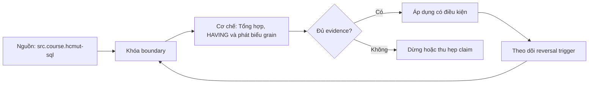

# Tổng hợp, HAVING và phát biểu grain

> [!abstract] Câu hỏi trung tâm
> Một dòng kết quả đại diện cho cái gì, tập dòng nào đã đi vào aggregate, NULL được xử lý thế nào, và bằng chứng nào cho thấy tổng hợp không làm sai đơn vị phân tích?

## 1. Grain là đơn vị của một dòng

Grain trả lời câu hỏi một dòng đại diện cho điều gì. Ở bảng giao dịch, grain có thể là một dòng hàng trong hóa đơn. Sau `GROUP BY customer_id, order_date`, grain trở thành một khách hàng trong một ngày. Nếu bỏ `order_date`, grain lại đổi thành một khách hàng trong toàn bộ phạm vi lọc. Hai câu truy vấn có thể đều chạy, cùng tên cột measure, nhưng trả lời hai câu hỏi khác nhau.

Trước mỗi phép tổng hợp, viết một câu hoàn chỉnh về grain đầu vào, khóa hoặc tập thuộc tính phân biệt một quan sát, đơn vị measure và phạm vi thời gian. Sau tổng hợp, viết grain đầu ra theo đúng danh sách nhóm. Đây là kiểm soát thiết kế của chương trình, không phải cú pháp SQL bắt buộc. Nó buộc người viết nhận ra rằng aggregate là phép biến đổi nghĩa, không chỉ là cách rút số dòng.

Một phát biểu tốt có dạng: Trước tổng hợp: một dòng trên mỗi `order_line_id`; `line_revenue` là tiền của đúng dòng hàng. Sau tổng hợp: một dòng trên mỗi `(customer_id, calendar_month)`; `revenue` cộng được trong từng nhóm đó. Phát biểu dữ liệu theo khách hàng quá mơ hồ vì không cho biết thời gian, sản phẩm, currency hoặc trạng thái đơn.

## 2. Pipeline logic quanh phép tổng hợp

Theo mô hình xử lý logic, `FROM` và join tạo tập dòng đầu vào; `WHERE` loại dòng trước khi nhóm; `GROUP BY` tạo nhóm; aggregate tính trên mỗi nhóm; `HAVING` loại nhóm; projection tạo cột đầu ra; `ORDER BY` sắp xếp kết quả. Optimizer có thể thực thi vật lý khác thứ tự này nhưng phải giữ semantics.

Vì vậy `WHERE order_status = 'paid'` quyết định dòng nào được tính vào doanh thu, còn `HAVING sum(amount) > 1000` quyết định nhóm doanh thu nào xuất hiện. Đưa điều kiện nhóm vào `WHERE` là không hợp lệ hoặc đổi nghĩa; đưa điều kiện row vào `HAVING` có thể làm query khó đọc và khó pushdown. Review phải hỏi predicate đang nói về một dòng hay về kết quả của cả nhóm.

Join xảy ra trước aggregate trong cùng query level. Nếu join làm nhân dòng, `SUM` sẽ cộng phần đã nhân. Aggregate không sửa fanout. Cần chứng minh cardinality join hoặc aggregate từng child collection về grain chung trước khi ghép.

## 3. GROUP BY xác lập grain đầu ra

Mỗi tổ hợp giá trị của các grouping expressions tạo một nhóm. Khi không có `GROUP BY`, toàn bộ tập dòng còn lại được xem như một nhóm, kể cả tập rỗng. Khi group bằng expression như `date_trunc('month', occurred_at)`, grain phải nêu timezone và ranh giới tháng; timestamp UTC và tháng nghiệp vụ ở Asia/Ho_Chi_Minh có thể phân nhóm khác nhau ở biên ngày.

Mọi cột chi tiết được project nhưng không aggregate phải được xác định bởi group key theo quy tắc DBMS. Không nên dựa vào việc dữ liệu mẫu tình cờ có một giá trị. Nếu nhóm theo `customer_id` nhưng chọn `customer_name`, cần constraint hoặc join many-to-one chứng minh tên được xác định; nếu lịch sử tên thay đổi, grain và yêu cầu phải quyết định lấy tên hiện tại hay tên tại thời điểm giao dịch.

`GROUPING SETS`, `ROLLUP` và `CUBE` tạo nhiều grain trong một result. Khi dùng chúng, cần cột `GROUPING()` hoặc nhãn level để phân biệt NULL thật với NULL đại diện subtotal. Một dataset chứa detail, subtotal và grand total nhưng không có level marker rất dễ bị cộng lần nữa.

## 4. COUNT có ba câu hỏi khác nhau

`count(*)` đếm số dòng đầu vào của nhóm. `count(expression)` đếm số dòng mà expression khác NULL. `count(distinct expression)` đếm số giá trị khác NULL khác nhau. Chúng chỉ bằng nhau khi expression vừa không NULL vừa unique trong grain đầu vào.

Ví dụ một nhóm có năm dòng, `coupon_code` lần lượt là `A, A, NULL, B, NULL`: `count(*) = 5`, `count(coupon_code) = 3`, `count(distinct coupon_code) = 2`. Không biến thể nào đúng hơn tuyệt đối; mỗi biến thể trả lời một câu hỏi. Tên metric phải cho biết đang đếm giao dịch, giao dịch có coupon, hay số coupon khác nhau.

Đếm entity sau join phải dùng business key và hiểu fanout. `count(*)` sau join order-lines đếm dòng hàng, không đếm đơn. `count(distinct order_id)` có thể đếm đơn nhưng cũng có thể che lỗi join tạo duplicate; cần kiểm multiplicity riêng, không coi `DISTINCT` là thuốc chữa.

## 5. NULL và aggregate

Phần lớn aggregate chuẩn của PostgreSQL bỏ qua input NULL. `sum(amount)` và `avg(amount)` dùng các giá trị không NULL; `count(amount)` cũng đếm đúng các giá trị ấy. `count(*)` không bỏ dòng vì nó không đánh giá một expression nullable. Vì vậy denominator của `avg(amount)` là số amount đã biết, không phải tổng số dòng.

Ngoại trừ `count`, aggregate trên tập không có dòng thường trả NULL, không phải zero. `sum` của empty set và `sum` của các dòng đều NULL đều trả NULL trong PostgreSQL. `COALESCE(sum(amount), 0)` chỉ đúng nếu nghiệp vụ xác nhận không có quan sát có thể biểu diễn bằng 0. Trong khoa học dữ liệu, missing và zero thường là hai trạng thái khác nhau.

Không thay NULL bằng zero trước `avg` nếu NULL nghĩa là chưa đo. Việc đó thêm các quan sát zero giả và đổi denominator. Nếu NULL nghĩa nghiệp vụ là không phát sinh, phép thay phải được ghi thành rule và kiểm bằng dữ liệu.

## 6. SUM, AVG, MIN và MAX cần đơn vị

`SUM` chỉ có nghĩa khi measure cộng được trên dimension đang nhóm. Doanh thu bằng nhiều currency không thể cộng trực tiếp; inventory snapshot không cộng qua ngày như transaction flow; tỷ lệ phần trăm không cộng qua nhóm. Grain statement phải ghi unit, currency, thời điểm và tính additivity.

`AVG` đặc biệt dễ sai. Trung bình của trung bình chỉ đúng khi các nhóm có trọng số bằng nhau hoặc có weight. Muốn average order value toàn kỳ, nên lấy tổng revenue chia số đơn đủ điều kiện thay vì lấy trung bình các AOV theo ngày. Lưu numerator và denominator giúp tái tổng hợp đúng.

`MIN`/`MAX` có thể dùng để chọn giá trị cực trị nhưng không tự mang theo các cột cùng dòng. `max(event_time)` và một cột status không aggregate không chắc thuộc cùng record. Dùng window ranking hoặc join lại trên key/time với tie rule.

## 7. HAVING lọc nhóm

`HAVING` được đánh giá theo nhóm sau khi row filter và grouping đã xác lập. Nó phù hợp cho khách hàng có ít nhất ba đơn, key có duplicate, ngày có doanh thu lớn hơn ngưỡng. Predicate trong `HAVING` phải có nghĩa tại grain nhóm.

`HAVING count(*) > 1` là kiểm tra duplicate theo group key, nhưng chỉ chứng minh snapshot hiện tại. Nó không thay UNIQUE constraint cho invariant lâu dài. `HAVING sum(amount) <> expected` có thể là reconciliation gate nếu expected được xác định độc lập.

Khi query không có `GROUP BY`, `HAVING` lọc nhóm toàn cục. Đây là cú pháp hợp lệ nhưng thường cần giải thích rõ, vì output có thể là một dòng hoặc không dòng. Không mặc định chuyển mọi predicate sang `HAVING` để tránh lỗi cú pháp.

## 8. Grain trước và sau join-aggregate

Một pipeline nhiều bảng nên có grain ledger. Với mỗi CTE, ghi grain, key, số dòng, measure và relationship dự kiến với CTE tiếp. Ví dụ: `line_base` một row/line; `payment_by_order` một row/order; join line với payment-by-order vẫn một row/line; `monthly_customer` một row/customer-month.

Nếu join trực tiếp lines và payments đều 1:N qua order, mỗi line ghép với mỗi payment. Group về customer-month vẫn cho ra một dòng đúng hình thức nhưng tổng sai. Đây là lý do chỉ nhìn schema đầu ra không đủ; phải kiểm grain trung gian và control totals.

Một aggregate sớm có thể giảm fanout nhưng cũng làm mất detail cần thiết. Chọn stage tổng hợp dựa trên câu hỏi cuối và khả năng kiểm toán. Giữ count, min/max time và distinct key count bên cạnh measure để phát hiện mất dữ liệu.

## 9. Điều kiện lọc và mẫu số

Metric là tử số, mẫu số và population. Tỷ lệ giao hàng đúng hạn cần định nghĩa đơn eligible, trạng thái hủy, timezone, cutoff, late-arriving data và denominator. `WHERE` khác nhau giữa tử và mẫu có thể tạo tỷ lệ sai hoặc lớn hơn 100%.

Conditional aggregation như `sum(case when condition then 1 else 0 end)` giữ nhiều metric trên cùng population. Tuy nhiên phải quyết định ELSE 0 hay ELSE NULL. Với `count(case when condition then 1 end)`, chỉ row TRUE được đếm; FALSE và UNKNOWN đều thành NULL. Test cần có NULL trong các input của condition.

FILTER clause của PostgreSQL làm điều kiện từng aggregate rõ hơn: `count(*) filter (where status='paid')`. Dù dùng cú pháp nào, document population chung và điều kiện riêng.

## 10. Skew và phân phối

Một trung bình đơn lẻ có thể che phân phối lệch. Khi dữ liệu có long tail, báo thêm median/percentiles, histogram hoặc bucket counts. `avg` đúng số học vẫn có thể không đại diện cho trải nghiệm điển hình. Không gọi average là bình thường nếu chưa quan sát phân phối.

Group size skew cũng ảnh hưởng performance và interpretation. Một customer rất lớn có thể chi phối tổng; một partition lớn có thể gây spill. Ghi top groups, percent contribution và count distribution. Đây là phân tích bổ sung, không thay định nghĩa metric.

## 11. Thứ tự trong aggregate

Một số aggregate như `string_agg`, `array_agg`, `json_agg` phụ thuộc thứ tự input. PostgreSQL cho phép `ORDER BY` bên trong lời gọi aggregate. Không dựa vào thứ tự từ subquery nếu outer query còn có join hay xử lý có thể reorder. Thứ tự phải nằm tại nơi semantics yêu cầu.

Với aggregate không nhạy thứ tự như sum, thứ tự input không đổi kết quả toán học, nhưng floating-point có thể khác chút do thứ tự cộng. Nếu reconciliation yêu cầu độ chính xác tiền tệ, dùng kiểu numeric thích hợp và policy rounding rõ.

## 12. Reconciliation độc lập

Mỗi metric quan trọng cần một phép tính đối soát độc lập đủ khác implementation chính để bắt lỗi chung. Có thể tính tổng trực tiếp từ bảng authoritative với query ngắn; so tổng theo dimension với grand total; hoặc so aggregate SQL với xử lý dataframe trên extract cố định.

Đối soát gồm row count, distinct entity count, sum numerator, sum denominator, null count và unmatched keys. Chỉ so final sum có thể bỏ sót việc giá trị bị phân bổ sai giữa nhóm nhưng bù trừ nhau.

Đặt tolerance theo unit và rounding, không dùng tolerance tùy ý. Lưu snapshot/time window, query text, input checksum và output. Kết luận phải tái hiện được.

## 13. Hai mươi truy vấn thực hành

Bộ lab nên phủ aggregate toàn cục, group một khóa, group nhiều khóa, conditional aggregate, empty set, all-NULL group, count variants, HAVING duplicate, join trước aggregate, aggregate trước join, rolling subtotal, currency, time zone và skew. Mỗi query có hai câu grain trước/sau.

Ba query bắt buộc đặt `count(*)`, `count(nullable_column)` và `count(distinct nullable_column)` cạnh nhau trên dữ liệu có duplicate và NULL, rồi giải thích từng con số. Một query cố tình join hai child collections để quan sát inflation; bản sửa phải aggregate đúng grain và đối soát.

## 14. Review checklist

Reviewer kiểm grain statement có đủ entity, time và unit; group key có đúng grain; join relationship có bằng chứng; row filter và group filter đặt đúng; count variant đúng câu hỏi; NULL/empty-set policy rõ; numerator/denominator cùng population; measure có tính additivity; kết quả được đối soát độc lập.

Không chấp nhận query chạy hoặc số trông hợp lý làm evidence. Một query đạt khi người khác có thể dự đoán số dòng, giải thích mọi cột và tái tạo reconciliation.

## 15. Câu hỏi tự kiểm tra

1. `count(*)`, `count(x)` và `count(distinct x)` khác nhau thế nào khi có NULL và duplicate?
2. Vì sao join fanout không được chữa bằng aggregate cuối?
3. `WHERE` và `HAVING` lọc hai đơn vị nào?
4. `sum` trên tập rỗng trả gì trong PostgreSQL 17?
5. Tại sao average of averages thường sai?
6. Grain statement trước và sau `GROUP BY` cần ghi gì?

## 16. Giới hạn và điều chưa cho phép kết luận

- Grain statement là phương pháp kiểm soát của giáo trình; nó không phải phần của SQL standard.
- Semantics nêu cho aggregate và empty set được neo vào PostgreSQL 17; DBMS khác cần kiểm tài liệu.
- Không có dữ liệu thật thì chưa kết luận được skew, spill hoặc performance.
- Reconciliation khớp tổng không tự chứng minh phân bổ theo từng entity đúng.
- Hai mươi bài lab chưa được thực thi trong knowledge note này; bằng chứng chạy thuộc `after-note.md`.

## Reference
1. [[SRC-HCMUT-SQL]]: PDF 69-79, aggregate, GROUP BY và HAVING.
2. [[SRC-POSTGRESQL-17-AGGREGATE-FUNCTIONS]]: semantics của aggregate PostgreSQL 17.
3. [[SRC-POSTGRESQL-17-QUERY-EXPRESSIONS]]: pipeline WHERE/GROUP BY/HAVING.
4. [[SRC-POSTGRESQL-17-NULL-COMPARISON]]: NULL và UNKNOWN.

## Source coverage

| Source slice | Nội dung phải giữ | Vị trí trong note | Trạng thái |
|---|---|---|---|
| [[SRC-HCMUT-SQL]], PDF 69-79 | aggregate, GROUP BY, HAVING, ORDER BY | §§2-7 | Đã trình bày và mở rộng bằng grain |
| [[SRC-POSTGRESQL-17-AGGREGATE-FUNCTIONS]] | count variants, NULL, empty set, ordering | §§4-6, 11 | Đã giữ semantics PostgreSQL 17 |
| [[SRC-POSTGRESQL-17-QUERY-EXPRESSIONS]] | logical placement của WHERE/GROUP/HAVING | §§2-3, 7 | Đã tách logic khỏi physical plan |
| [[SRC-POSTGRESQL-17-NULL-COMPARISON]] | UNKNOWN và nullable predicates | §§5, 9 | Đã kiểm soát NULL trong metric |
| Tổng hợp DE-L120 | grain ledger, additivity, reconciliation | §§1, 8-14 | Đã ghi thành quy trình kiểm được |

## Key takeaways
- `GROUP BY` đổi grain; phải nói rõ grain trước và sau.
- Ba biến thể `COUNT` trả lời ba câu hỏi khác nhau.
- Aggregate bỏ qua NULL theo hàm; empty set không mặc định bằng zero.
- Join fanout xảy ra trước aggregate và có thể làm tổng sai dù output grain trông đúng.
- Metric chỉ kiểm được khi có population, unit, numerator, denominator và reconciliation độc lập.

<!-- ATOMIC-EXECUTION-CAPSULE:START -->

## Execution capsule: kiểm chứng `wiki.database.aggregation-having-grain`

> [!important] Phân loại mệnh đề
> Với `wiki.database.aggregation-having-grain`, sơ đồ, ví dụ và artifact về **Tổng hợp, HAVING và phát biểu grain** là **synthesis để kiểm chứng**; chúng không phải trích dẫn hay case nguyên văn của nguồn.

### Sơ đồ cơ chế và điểm kiểm soát



Đọc sơ đồ `wiki.database.aggregation-having-grain` từ trái sang phải: source chỉ cung cấp claim ban đầu cho **Tổng hợp, HAVING và phát biểu grain**; quyết định chỉ được đi tiếp sau khi boundary, evidence và điều kiện đảo quyết định đã hiện hữu.

### Artifact thực thi tối thiểu

```sql
-- Verification harness for: Tổng hợp, HAVING và phát biểu grain
WITH evidence AS (
    SELECT 'wiki.database.aggregation-having-grain' AS concept_id,
           'boundary_declared' AS check_name, 1 AS passed
    UNION ALL
    SELECT 'wiki.database.aggregation-having-grain', 'independent_oracle', 1
    UNION ALL
    SELECT 'wiki.database.aggregation-having-grain', 'reversal_trigger_recorded', 1
)
SELECT concept_id,
       MIN(passed) AS all_hard_checks_pass,
       COUNT(*) AS evidence_items
FROM evidence
GROUP BY concept_id
HAVING MIN(passed) = 1;
```

Artifact của `wiki.database.aggregation-having-grain` buộc người dùng ghi boundary, oracle và reversal trigger cho **Tổng hợp, HAVING và phát biểu grain**. Các giá trị minh họa phải được thay bằng evidence thật trước khi dùng cho quyết định.

### Tự kiểm tra trước khi tái sử dụng

1. Bạn có thể trả lời `Làm sao chứng minh một phép tổng hợp trả đúng grain, đúng tập row đầu vào và đúng biến thể đếm?` bằng một câu mà không kéo thêm concept thứ hai không?
2. Source locator nào đỡ cho claim, và phần nào chỉ là synthesis trong note?
3. Observation nào khiến bạn dừng, thu hẹp hoặc đảo quyết định?
4. Artifact nào cho phép một reviewer độc lập tái hiện kết quả?

<!-- ATOMIC-EXECUTION-CAPSULE:END -->
