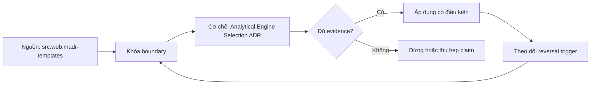

# Analytical Engine Selection ADR

> [!abstract] Câu hỏi trung tâm
> Chọn analytical engine cho ba workload bằng evidence, thresholds và reversal conditions như thế nào?

## 1. Decision trước product

Viết workload contract gồm users, query families, freshness, ingestion, concurrency, latency SLO, correctness, governance, locality và budget. Tên sản phẩm chưa xuất hiện ở bước này. Ba workload phải khác decision drivers, không chỉ khác data volume. Mọi criterion có unit, measurement window và hard constraint. Option vi phạm correctness, security hoặc required latency bị loại khỏi feasible set trước weighted scoring; điểm tổng cao không cứu được hard failure.

## 2. Năm archetypes

Managed cloud warehouse tối ưu service operation và elasticity nhưng có pricing/control boundaries. Lakehouse ghép open table format với engines/catalog/operations; format không phải platform hoàn chỉnh. Real-time analytics ưu tiên continuous ingestion và low-latency aggregations, đổi lại modeling/update/join constraints tùy system. Federated engine query nhiều sources nhưng bị source pushdown, network và weakest dependency giới hạn. Embedded engine chạy in-process, giảm deployment/data-copy nhưng có host resource, multi-process và service-concurrency boundaries.

## 3. Evidence matrix

Bốn nhóm bắt buộc: performance/SLO; data/interface semantics; operations/recovery; cost/TCO. Với mỗi cell ghi metric, source artifact, run ID và uncertainty. Vendor feature list chỉ là capability hypothesis. Benchmark giữ snapshot, query semantics, cache state, concurrency và output oracle. Nếu chỉ dựng được hai archetypes, ba options còn lại được đánh giá bằng explicit missing evidence và không được cho điểm precision giả.

## 4. Thresholds và reversals

Quyết định hữu ích phải có ngưỡng: p95, concurrency, ingest-to-query delay, scanned bytes, operator hours hoặc monthly volume. Reversal condition mô tả observation khiến chọn option khác, thí dụ concurrency vượt X, remote-source bytes vượt Y, hoặc cross-engine sharing trở thành hard requirement. Threshold lấy từ lab hay approved scenario, có owner/date. Không biến một current measurement thành universal breakpoint.

## 5. ADR có thể kiểm

ADR gồm status, context, decision drivers, considered options, decision, consequences và confirmation plan. Bổ sung evidence table, rejected-option rationale, cost boundary, risks, rollout/exit plan và review trigger. Mỗi tính từ như nhanh, linh hoạt, dễ vận hành phải nối số hoặc test. Consequences ghi cả lợi và debt. Decision owner phê duyệt exact version; template không tự tạo authority.

## 6. Dự án ba workloads

Chạy ít nhất hai engines với representative queries; đo scan bytes, latency distributions, concurrency behavior và cost theo L213-L215. Giữ cold/warm/result-cache cells rõ ràng. Điền năm archetypes bằng evidence hoặc bounded research. Mỗi workload có một recommendation, một cost threshold và hai reversal conditions. Peer review tìm hidden hard constraints và claims không có artifact. Done khi mọi decision claim truy tới measurement hoặc labeled assumption.

## 7. Ma trận kiểm chứng từng mệnh đề

Mỗi claim cần fixture, versioned contract, counterexample và oracle ở đúng tầng. Parse/decode success, registry acceptance hoặc feature name không tự chứng minh semantic correctness.

### 7.1. ADR claim 1 phải có metric, artifact, threshold và reversal condition

**Mệnh đề cần kiểm.** ADR claim 1 phải có metric, artifact, threshold và reversal condition.

**Protocol cho `wiki.olap.analytical-engine-selection-adr`.** Khóa source/schema versions, producer-consumer path, configuration và canonical meaning. Chạy positive, boundary và negative fixtures; lưu raw bytes/files, hashes, logs, typed output và exact failing cell. Đổi một assumption rồi ghi reversal condition.

**Bằng chứng đạt cho `wiki.olap.analytical-engine-selection-adr`.** Kết quả structural và semantic được báo riêng, có independent oracle, repetitions khi đo performance, reviewer và limitation. Lab chưa chạy chỉ được ghi protocol, không ghi expected behavior như observation.

### 7.2. ADR claim 2 phải có metric, artifact, threshold và reversal condition

**Mệnh đề cần kiểm.** ADR claim 2 phải có metric, artifact, threshold và reversal condition.

**Protocol cho `wiki.olap.analytical-engine-selection-adr`.** Khóa source/schema versions, producer-consumer path, configuration và canonical meaning. Chạy positive, boundary và negative fixtures; lưu raw bytes/files, hashes, logs, typed output và exact failing cell. Đổi một assumption rồi ghi reversal condition.

**Bằng chứng đạt cho `wiki.olap.analytical-engine-selection-adr`.** Kết quả structural và semantic được báo riêng, có independent oracle, repetitions khi đo performance, reviewer và limitation. Lab chưa chạy chỉ được ghi protocol, không ghi expected behavior như observation.

### 7.3. ADR claim 3 phải có metric, artifact, threshold và reversal condition

**Mệnh đề cần kiểm.** ADR claim 3 phải có metric, artifact, threshold và reversal condition.

**Protocol cho `wiki.olap.analytical-engine-selection-adr`.** Khóa source/schema versions, producer-consumer path, configuration và canonical meaning. Chạy positive, boundary và negative fixtures; lưu raw bytes/files, hashes, logs, typed output và exact failing cell. Đổi một assumption rồi ghi reversal condition.

**Bằng chứng đạt cho `wiki.olap.analytical-engine-selection-adr`.** Kết quả structural và semantic được báo riêng, có independent oracle, repetitions khi đo performance, reviewer và limitation. Lab chưa chạy chỉ được ghi protocol, không ghi expected behavior như observation.

### 7.4. ADR claim 4 phải có metric, artifact, threshold và reversal condition

**Mệnh đề cần kiểm.** ADR claim 4 phải có metric, artifact, threshold và reversal condition.

**Protocol cho `wiki.olap.analytical-engine-selection-adr`.** Khóa source/schema versions, producer-consumer path, configuration và canonical meaning. Chạy positive, boundary và negative fixtures; lưu raw bytes/files, hashes, logs, typed output và exact failing cell. Đổi một assumption rồi ghi reversal condition.

**Bằng chứng đạt cho `wiki.olap.analytical-engine-selection-adr`.** Kết quả structural và semantic được báo riêng, có independent oracle, repetitions khi đo performance, reviewer và limitation. Lab chưa chạy chỉ được ghi protocol, không ghi expected behavior như observation.

### 7.5. ADR claim 5 phải có metric, artifact, threshold và reversal condition

**Mệnh đề cần kiểm.** ADR claim 5 phải có metric, artifact, threshold và reversal condition.

**Protocol cho `wiki.olap.analytical-engine-selection-adr`.** Khóa source/schema versions, producer-consumer path, configuration và canonical meaning. Chạy positive, boundary và negative fixtures; lưu raw bytes/files, hashes, logs, typed output và exact failing cell. Đổi một assumption rồi ghi reversal condition.

**Bằng chứng đạt cho `wiki.olap.analytical-engine-selection-adr`.** Kết quả structural và semantic được báo riêng, có independent oracle, repetitions khi đo performance, reviewer và limitation. Lab chưa chạy chỉ được ghi protocol, không ghi expected behavior như observation.

### 7.6. ADR claim 6 phải có metric, artifact, threshold và reversal condition

**Mệnh đề cần kiểm.** ADR claim 6 phải có metric, artifact, threshold và reversal condition.

**Protocol cho `wiki.olap.analytical-engine-selection-adr`.** Khóa source/schema versions, producer-consumer path, configuration và canonical meaning. Chạy positive, boundary và negative fixtures; lưu raw bytes/files, hashes, logs, typed output và exact failing cell. Đổi một assumption rồi ghi reversal condition.

**Bằng chứng đạt cho `wiki.olap.analytical-engine-selection-adr`.** Kết quả structural và semantic được báo riêng, có independent oracle, repetitions khi đo performance, reviewer và limitation. Lab chưa chạy chỉ được ghi protocol, không ghi expected behavior như observation.

### 7.7. ADR claim 7 phải có metric, artifact, threshold và reversal condition

**Mệnh đề cần kiểm.** ADR claim 7 phải có metric, artifact, threshold và reversal condition.

**Protocol cho `wiki.olap.analytical-engine-selection-adr`.** Khóa source/schema versions, producer-consumer path, configuration và canonical meaning. Chạy positive, boundary và negative fixtures; lưu raw bytes/files, hashes, logs, typed output và exact failing cell. Đổi một assumption rồi ghi reversal condition.

**Bằng chứng đạt cho `wiki.olap.analytical-engine-selection-adr`.** Kết quả structural và semantic được báo riêng, có independent oracle, repetitions khi đo performance, reviewer và limitation. Lab chưa chạy chỉ được ghi protocol, không ghi expected behavior như observation.

### 7.8. ADR claim 8 phải có metric, artifact, threshold và reversal condition

**Mệnh đề cần kiểm.** ADR claim 8 phải có metric, artifact, threshold và reversal condition.

**Protocol cho `wiki.olap.analytical-engine-selection-adr`.** Khóa source/schema versions, producer-consumer path, configuration và canonical meaning. Chạy positive, boundary và negative fixtures; lưu raw bytes/files, hashes, logs, typed output và exact failing cell. Đổi một assumption rồi ghi reversal condition.

**Bằng chứng đạt cho `wiki.olap.analytical-engine-selection-adr`.** Kết quả structural và semantic được báo riêng, có independent oracle, repetitions khi đo performance, reviewer và limitation. Lab chưa chạy chỉ được ghi protocol, không ghi expected behavior như observation.

### 7.9. ADR claim 9 phải có metric, artifact, threshold và reversal condition

**Mệnh đề cần kiểm.** ADR claim 9 phải có metric, artifact, threshold và reversal condition.

**Protocol cho `wiki.olap.analytical-engine-selection-adr`.** Khóa source/schema versions, producer-consumer path, configuration và canonical meaning. Chạy positive, boundary và negative fixtures; lưu raw bytes/files, hashes, logs, typed output và exact failing cell. Đổi một assumption rồi ghi reversal condition.

**Bằng chứng đạt cho `wiki.olap.analytical-engine-selection-adr`.** Kết quả structural và semantic được báo riêng, có independent oracle, repetitions khi đo performance, reviewer và limitation. Lab chưa chạy chỉ được ghi protocol, không ghi expected behavior như observation.

### 7.10. ADR claim 10 phải có metric, artifact, threshold và reversal condition

**Mệnh đề cần kiểm.** ADR claim 10 phải có metric, artifact, threshold và reversal condition.

**Protocol cho `wiki.olap.analytical-engine-selection-adr`.** Khóa source/schema versions, producer-consumer path, configuration và canonical meaning. Chạy positive, boundary và negative fixtures; lưu raw bytes/files, hashes, logs, typed output và exact failing cell. Đổi một assumption rồi ghi reversal condition.

**Bằng chứng đạt cho `wiki.olap.analytical-engine-selection-adr`.** Kết quả structural và semantic được báo riêng, có independent oracle, repetitions khi đo performance, reviewer và limitation. Lab chưa chạy chỉ được ghi protocol, không ghi expected behavior như observation.

### 7.11. ADR claim 11 phải có metric, artifact, threshold và reversal condition

**Mệnh đề cần kiểm.** ADR claim 11 phải có metric, artifact, threshold và reversal condition.

**Protocol cho `wiki.olap.analytical-engine-selection-adr`.** Khóa source/schema versions, producer-consumer path, configuration và canonical meaning. Chạy positive, boundary và negative fixtures; lưu raw bytes/files, hashes, logs, typed output và exact failing cell. Đổi một assumption rồi ghi reversal condition.

**Bằng chứng đạt cho `wiki.olap.analytical-engine-selection-adr`.** Kết quả structural và semantic được báo riêng, có independent oracle, repetitions khi đo performance, reviewer và limitation. Lab chưa chạy chỉ được ghi protocol, không ghi expected behavior như observation.

### 7.12. ADR claim 12 phải có metric, artifact, threshold và reversal condition

**Mệnh đề cần kiểm.** ADR claim 12 phải có metric, artifact, threshold và reversal condition.

**Protocol cho `wiki.olap.analytical-engine-selection-adr`.** Khóa source/schema versions, producer-consumer path, configuration và canonical meaning. Chạy positive, boundary và negative fixtures; lưu raw bytes/files, hashes, logs, typed output và exact failing cell. Đổi một assumption rồi ghi reversal condition.

**Bằng chứng đạt cho `wiki.olap.analytical-engine-selection-adr`.** Kết quả structural và semantic được báo riêng, có independent oracle, repetitions khi đo performance, reviewer và limitation. Lab chưa chạy chỉ được ghi protocol, không ghi expected behavior như observation.

### 7.13. ADR claim 13 phải có metric, artifact, threshold và reversal condition

**Mệnh đề cần kiểm.** ADR claim 13 phải có metric, artifact, threshold và reversal condition.

**Protocol cho `wiki.olap.analytical-engine-selection-adr`.** Khóa source/schema versions, producer-consumer path, configuration và canonical meaning. Chạy positive, boundary và negative fixtures; lưu raw bytes/files, hashes, logs, typed output và exact failing cell. Đổi một assumption rồi ghi reversal condition.

**Bằng chứng đạt cho `wiki.olap.analytical-engine-selection-adr`.** Kết quả structural và semantic được báo riêng, có independent oracle, repetitions khi đo performance, reviewer và limitation. Lab chưa chạy chỉ được ghi protocol, không ghi expected behavior như observation.

### 7.14. ADR claim 14 phải có metric, artifact, threshold và reversal condition

**Mệnh đề cần kiểm.** ADR claim 14 phải có metric, artifact, threshold và reversal condition.

**Protocol cho `wiki.olap.analytical-engine-selection-adr`.** Khóa source/schema versions, producer-consumer path, configuration và canonical meaning. Chạy positive, boundary và negative fixtures; lưu raw bytes/files, hashes, logs, typed output và exact failing cell. Đổi một assumption rồi ghi reversal condition.

**Bằng chứng đạt cho `wiki.olap.analytical-engine-selection-adr`.** Kết quả structural và semantic được báo riêng, có independent oracle, repetitions khi đo performance, reviewer và limitation. Lab chưa chạy chỉ được ghi protocol, không ghi expected behavior như observation.

### 7.15. ADR claim 15 phải có metric, artifact, threshold và reversal condition

**Mệnh đề cần kiểm.** ADR claim 15 phải có metric, artifact, threshold và reversal condition.

**Protocol cho `wiki.olap.analytical-engine-selection-adr`.** Khóa source/schema versions, producer-consumer path, configuration và canonical meaning. Chạy positive, boundary và negative fixtures; lưu raw bytes/files, hashes, logs, typed output và exact failing cell. Đổi một assumption rồi ghi reversal condition.

**Bằng chứng đạt cho `wiki.olap.analytical-engine-selection-adr`.** Kết quả structural và semantic được báo riêng, có independent oracle, repetitions khi đo performance, reviewer và limitation. Lab chưa chạy chỉ được ghi protocol, không ghi expected behavior như observation.

## 8. Quy trình phản biện

1. Tách syntax/wire, structural compatibility, generated API và business semantics.
2. Ghi direction bằng writer-reader versions, không chỉ dùng nhãn backward/forward.
3. Khóa canonical meaning và negative fixtures trước implementation.
4. Giữ source bytes/schema fingerprints để tái hiện.
5. Mọi default, cache, inference hoặc registry policy đều là explicit configuration.
6. Viết rollout, rollback và reversal condition trước merge.

## 9. Câu hỏi tự kiểm tra

1. Identity nằm ở name, position, field number hay stable ID?
2. Parser biết điều gì và application phải biết điều gì?
3. Cell/version nào chưa được test?
4. Decode sạch có thể sai nghĩa ở đâu?
5. Intermediate system có làm mất thông tin không?
6. Evidence nào mới là protocol?

## 10. Giới hạn và điều chưa cho phép kết luận

- Chưa chạy benchmark engine hoặc compatibility matrix bằng libraries/registry thật.
- Specifications được kiểm ngày 2026-10-01; library, generated API và registry behavior cần pin version.
- Curriculum matrices là synthesis; không gán nguyên văn cho một source.
- Note giữ trạng thái `review` tới khi chủ dự án duyệt.

## Reference
1. [[SRC-MADR-TEMPLATES]]
2. [[SRC-SNOWFLAKE-ELASTIC-DATA-WAREHOUSE]]
3. [[SRC-APACHE-ICEBERG-INTRODUCTION]]
4. [[SRC-APACHE-DRUID-ARCHITECTURE]]
5. [[SRC-PRESTO-SQL-ON-EVERYTHING]]
6. [[SRC-DUCKDB-STORAGE-AND-COMPRESSION]]

## Source coverage

| Source slice | Nội dung sử dụng | Trạng thái |
|---|---|---|
| [[SRC-MADR-TEMPLATES]] | Normative rule, architecture boundary hoặc decision evidence | Đã đọc locator; không suy ngoài phạm vi |
| [[SRC-SNOWFLAKE-ELASTIC-DATA-WAREHOUSE]] | Normative rule, architecture boundary hoặc decision evidence | Đã đọc locator; không suy ngoài phạm vi |
| [[SRC-APACHE-ICEBERG-INTRODUCTION]] | Normative rule, architecture boundary hoặc decision evidence | Đã đọc locator; không suy ngoài phạm vi |
| [[SRC-APACHE-DRUID-ARCHITECTURE]] | Normative rule, architecture boundary hoặc decision evidence | Đã đọc locator; không suy ngoài phạm vi |
| [[SRC-PRESTO-SQL-ON-EVERYTHING]] | Normative rule, architecture boundary hoặc decision evidence | Đã đọc locator; không suy ngoài phạm vi |
| [[SRC-DUCKDB-STORAGE-AND-COMPRESSION]] | Normative rule, architecture boundary hoặc decision evidence | Đã đọc locator; không suy ngoài phạm vi |

## Key takeaways
- Structural success và semantic correctness là hai gates riêng.
- Writer-reader direction, version history và exact fixtures phải hiện trong evidence.
- Defaults, aliases, unknown fields và registry modes có scope cụ thể; không dùng như bảo đảm chung.
- Chưa chạy lab thì note là giáo trình/protocol, chưa phải production certification.

<!-- ATOMIC-EXECUTION-CAPSULE:START -->

## Execution capsule: kiểm chứng `wiki.olap.analytical-engine-selection-adr`

> [!important] Phân loại mệnh đề
> Với `wiki.olap.analytical-engine-selection-adr`, sơ đồ, ví dụ và artifact về **Analytical Engine Selection ADR** là **synthesis để kiểm chứng**; chúng không phải trích dẫn hay case nguyên văn của nguồn.

### Sơ đồ cơ chế và điểm kiểm soát



Đọc sơ đồ `wiki.olap.analytical-engine-selection-adr` từ trái sang phải: source chỉ cung cấp claim ban đầu cho **Analytical Engine Selection ADR**; quyết định chỉ được đi tiếp sau khi boundary, evidence và điều kiện đảo quyết định đã hiện hữu.

### Ví dụ làm việc có thể bác bỏ

**Input.** Một đội cần trả lời: Chọn analytical engine cho ba workload bằng evidence, thresholds và reversal conditions như thế nào? cho một phạm vi nhỏ, có owner và deadline rõ.

**Decision.** Đội áp dụng **Analytical Engine Selection ADR** trên control và variant chỉ khác một assumption; expected result và hard constraints được khóa trước khi chạy.

**Outcome.** Với `wiki.olap.analytical-engine-selection-adr`, nếu observation vi phạm hard constraint hoặc oracle độc lập không xác nhận **Analytical Engine Selection ADR**, đội thu hẹp claim hay đảo quyết định. Nếu đạt, kết luận vẫn kèm scope, version và review date; một lần thành công không được nâng thành quy luật phổ quát.

### Artifact thực thi tối thiểu

```sql
-- Verification harness for: Analytical Engine Selection ADR
WITH evidence AS (
    SELECT 'wiki.olap.analytical-engine-selection-adr' AS concept_id,
           'boundary_declared' AS check_name, 1 AS passed
    UNION ALL
    SELECT 'wiki.olap.analytical-engine-selection-adr', 'independent_oracle', 1
    UNION ALL
    SELECT 'wiki.olap.analytical-engine-selection-adr', 'reversal_trigger_recorded', 1
)
SELECT concept_id,
       MIN(passed) AS all_hard_checks_pass,
       COUNT(*) AS evidence_items
FROM evidence
GROUP BY concept_id
HAVING MIN(passed) = 1;
```

Artifact của `wiki.olap.analytical-engine-selection-adr` buộc người dùng ghi boundary, oracle và reversal trigger cho **Analytical Engine Selection ADR**. Các giá trị minh họa phải được thay bằng evidence thật trước khi dùng cho quyết định.

### Tự kiểm tra trước khi tái sử dụng

1. Bạn có thể trả lời `Chọn analytical engine cho ba workload bằng evidence, thresholds và reversal conditions như thế nào?` bằng một câu mà không kéo thêm concept thứ hai không?
2. Source locator nào đỡ cho claim, và phần nào chỉ là synthesis trong note?
3. Observation nào khiến bạn dừng, thu hẹp hoặc đảo quyết định?
4. Artifact nào cho phép một reviewer độc lập tái hiện kết quả?

<!-- ATOMIC-EXECUTION-CAPSULE:END -->
