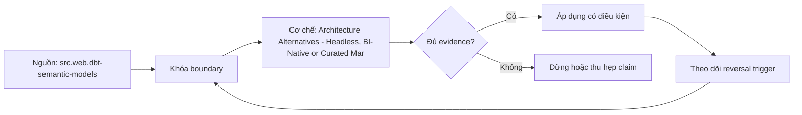

# Architecture Alternatives - Headless, BI-Native or Curated Marts

> [!abstract] Câu hỏi trung tâm
> Trong điều kiện tổ chức nào nên chọn semantic layer độc lập, semantic model trong BI hoặc curated marts, và bằng chứng nào làm quyết định phải đảo?

## 1. Ba kiến trúc, ba nơi đặt nghĩa

Headless semantic layer đặt metric/entity/time semantics trong service hoặc artifact độc lập và cho nhiều clients gọi. BI-native đặt nghĩa trong model của BI platform; LookML là ví dụ project/version-controlled model được SQL generator và Explore dùng. Curated marts đưa phần lớn quyết định vào tables/views có grain và columns đã chuẩn bị. Không phương án nào “không có semantic layer”: curated mart vẫn mã hóa nghĩa trong schema/transform/documentation, chỉ không có query compiler riêng.

## 2. Headless: reuse đổi lấy vận hành

Giá trị chính là một definition phục vụ BI, notebook, SQL/API và application, cùng governance/versioning ở một boundary. Chi phí gồm service availability, credentials, query compiler, cache, integration adapters, observability và migration. Headless hợp lý khi có nhiều consumer types, metric consistency có giá trị cao, team đủ năng lực vận hành và clients hỗ trợ semantic protocol. Nó sai khi integration làm người dùng quay về SQL riêng hoặc operating burden lớn hơn inconsistency cost.

## 3. BI-native: tốc độ trong một hệ sinh thái

Model sống cùng BI tool nên authoring, security, Explore và visualization liền mạch. LookML docs cho thấy model/view files định nghĩa joins và calculations, rồi generator tạo SQL cho Explore. Phương án phù hợp khi phần lớn quyết định đi qua một BI platform và đội đã có governance/version-control cho model. Rủi ro là SQL/API/non-BI consumers không mặc nhiên dùng được cùng nghĩa, migration cần inventory dependencies và parity test; gọi đó là lock-in chỉ có giá trị khi đo migration cost cụ thể.

## 4. Curated marts: đơn giản có chủ đích

Một mart theo use case cho consumer schema ổn định, predictable performance và SQL dễ kiểm. Nó đúng cho đội nhỏ, ít use cases, một warehouse, change rate thấp hoặc consumer không hỗ trợ semantic APIs. Chi phí xuất hiện khi mỗi tổ hợp grain/filter/metric tạo thêm table/view, definitions bị lặp và ad-hoc slice vượt thiết kế. Wide mart không thay contract: grain, population, time, ownership và tests vẫn bắt buộc.

## 5. Sáu chiều chấm có bằng chứng

Chấm consumer diversity, semantic change rate, query flexibility, operational capacity, governance/security và migration/portability. Mỗi điểm cần observation: số clients thực, tỷ lệ queries ngoài BI, on-call capacity, p95/freshness, count duplicated definitions, integration coverage và migration rehearsal. Không dùng “modern”, “easy”, “scalable” nếu thiếu unit và observation. Weight phản ánh decision priority và có owner; total score không được che hard constraints.

## 6. Ba tình huống mart là lựa chọn đúng

Đội hai người với một báo cáo quản trị và năm metrics ổn định; batch product xuất một regulatory snapshot không cho ad-hoc query; use case latency/cost được đáp ứng bằng one purpose-built mart và consumers dùng SQL trực tiếp. Trong cả ba, thêm service compiler làm tăng failure surface hơn giá trị reuse. Reversal triggers gồm xuất hiện consumer thứ hai khác protocol, duplicated metric drift, yêu cầu ad-hoc dimensions hoặc governance/security không thể giữ ở marts.

## 7. Decision record và evolutionary path

ADR ghi context, options, six-dimension evidence, constraints, decision, consequences và reversal triggers. Chọn curated marts hôm nay không cấm headless sau này: stable contracts, IDs, tests và lineage giảm migration cost. Chọn BI-native không miễn export/API plan. Chọn headless không bắt mọi query đi qua compiler nếu exceptional workloads có governed marts. Architecture review định kỳ dùng evidence mới, không bảo vệ quyết định cũ vì sunk cost.

## 8. Ma trận kiểm chứng từng mệnh đề

Mỗi mệnh đề dưới đây cần observation, fixture hoặc artifact có thể lưu. Tên công nghệ, consensus hoặc output nhìn hợp lý không tự là bằng chứng.

### 8.1. architecture option phải chỉ rõ nơi đặt semantics

**Mệnh đề cần kiểm.** architecture option phải chỉ rõ nơi đặt semantics.

**Cách kiểm.** Điền scorecard cho ba contexts bằng observations có unit; chọn option, ghi hard constraints và hai reversal triggers. Stress-test bằng cách đổi consumer count, tool integration hoặc operating capacity. Với riêng mệnh đề này, ghi input/context, expected observation, failure signal và boundary làm kết luận không còn đúng.

**Bằng chứng đạt cho `wiki.semantic-layer.architecture-alternatives`.** Lưu contract/decision version, fixture hoặc interview evidence, command/checklist output, reviewer và artifact hash. Nếu chưa thực hiện lab, trạng thái chỉ là protocol; không ghi thành kết quả đã quan sát.

### 8.2. headless cần multi-consumer value

**Mệnh đề cần kiểm.** headless cần multi-consumer value.

**Cách kiểm.** Điền scorecard cho ba contexts bằng observations có unit; chọn option, ghi hard constraints và hai reversal triggers. Stress-test bằng cách đổi consumer count, tool integration hoặc operating capacity. Với riêng mệnh đề này, ghi input/context, expected observation, failure signal và boundary làm kết luận không còn đúng.

**Bằng chứng đạt cho `wiki.semantic-layer.architecture-alternatives`.** Lưu contract/decision version, fixture hoặc interview evidence, command/checklist output, reviewer và artifact hash. Nếu chưa thực hiện lab, trạng thái chỉ là protocol; không ghi thành kết quả đã quan sát.

### 8.3. headless thêm operational failure surface

**Mệnh đề cần kiểm.** headless thêm operational failure surface.

**Cách kiểm.** Điền scorecard cho ba contexts bằng observations có unit; chọn option, ghi hard constraints và hai reversal triggers. Stress-test bằng cách đổi consumer count, tool integration hoặc operating capacity. Với riêng mệnh đề này, ghi input/context, expected observation, failure signal và boundary làm kết luận không còn đúng.

**Bằng chứng đạt cho `wiki.semantic-layer.architecture-alternatives`.** Lưu contract/decision version, fixture hoặc interview evidence, command/checklist output, reviewer và artifact hash. Nếu chưa thực hiện lab, trạng thái chỉ là protocol; không ghi thành kết quả đã quan sát.

### 8.4. BI-native cần integration fit

**Mệnh đề cần kiểm.** BI-native cần integration fit.

**Cách kiểm.** Điền scorecard cho ba contexts bằng observations có unit; chọn option, ghi hard constraints và hai reversal triggers. Stress-test bằng cách đổi consumer count, tool integration hoặc operating capacity. Với riêng mệnh đề này, ghi input/context, expected observation, failure signal và boundary làm kết luận không còn đúng.

**Bằng chứng đạt cho `wiki.semantic-layer.architecture-alternatives`.** Lưu contract/decision version, fixture hoặc interview evidence, command/checklist output, reviewer và artifact hash. Nếu chưa thực hiện lab, trạng thái chỉ là protocol; không ghi thành kết quả đã quan sát.

### 8.5. LookML model files version-control được

**Mệnh đề cần kiểm.** LookML model files version-control được.

**Cách kiểm.** Điền scorecard cho ba contexts bằng observations có unit; chọn option, ghi hard constraints và hai reversal triggers. Stress-test bằng cách đổi consumer count, tool integration hoặc operating capacity. Với riêng mệnh đề này, ghi input/context, expected observation, failure signal và boundary làm kết luận không còn đúng.

**Bằng chứng đạt cho `wiki.semantic-layer.architecture-alternatives`.** Lưu contract/decision version, fixture hoặc interview evidence, command/checklist output, reviewer và artifact hash. Nếu chưa thực hiện lab, trạng thái chỉ là protocol; không ghi thành kết quả đã quan sát.

### 8.6. lock-in phải đo bằng migration dependency

**Mệnh đề cần kiểm.** lock-in phải đo bằng migration dependency.

**Cách kiểm.** Điền scorecard cho ba contexts bằng observations có unit; chọn option, ghi hard constraints và hai reversal triggers. Stress-test bằng cách đổi consumer count, tool integration hoặc operating capacity. Với riêng mệnh đề này, ghi input/context, expected observation, failure signal và boundary làm kết luận không còn đúng.

**Bằng chứng đạt cho `wiki.semantic-layer.architecture-alternatives`.** Lưu contract/decision version, fixture hoặc interview evidence, command/checklist output, reviewer và artifact hash. Nếu chưa thực hiện lab, trạng thái chỉ là protocol; không ghi thành kết quả đã quan sát.

### 8.7. curated mart vẫn cần semantic contract

**Mệnh đề cần kiểm.** curated mart vẫn cần semantic contract.

**Cách kiểm.** Điền scorecard cho ba contexts bằng observations có unit; chọn option, ghi hard constraints và hai reversal triggers. Stress-test bằng cách đổi consumer count, tool integration hoặc operating capacity. Với riêng mệnh đề này, ghi input/context, expected observation, failure signal và boundary làm kết luận không còn đúng.

**Bằng chứng đạt cho `wiki.semantic-layer.architecture-alternatives`.** Lưu contract/decision version, fixture hoặc interview evidence, command/checklist output, reviewer và artifact hash. Nếu chưa thực hiện lab, trạng thái chỉ là protocol; không ghi thành kết quả đã quan sát.

### 8.8. wide mart có thể phình theo combinations

**Mệnh đề cần kiểm.** wide mart có thể phình theo combinations.

**Cách kiểm.** Điền scorecard cho ba contexts bằng observations có unit; chọn option, ghi hard constraints và hai reversal triggers. Stress-test bằng cách đổi consumer count, tool integration hoặc operating capacity. Với riêng mệnh đề này, ghi input/context, expected observation, failure signal và boundary làm kết luận không còn đúng.

**Bằng chứng đạt cho `wiki.semantic-layer.architecture-alternatives`.** Lưu contract/decision version, fixture hoặc interview evidence, command/checklist output, reviewer và artifact hash. Nếu chưa thực hiện lab, trạng thái chỉ là protocol; không ghi thành kết quả đã quan sát.

### 8.9. six dimensions cần observable units

**Mệnh đề cần kiểm.** six dimensions cần observable units.

**Cách kiểm.** Điền scorecard cho ba contexts bằng observations có unit; chọn option, ghi hard constraints và hai reversal triggers. Stress-test bằng cách đổi consumer count, tool integration hoặc operating capacity. Với riêng mệnh đề này, ghi input/context, expected observation, failure signal và boundary làm kết luận không còn đúng.

**Bằng chứng đạt cho `wiki.semantic-layer.architecture-alternatives`.** Lưu contract/decision version, fixture hoặc interview evidence, command/checklist output, reviewer và artifact hash. Nếu chưa thực hiện lab, trạng thái chỉ là protocol; không ghi thành kết quả đã quan sát.

### 8.10. weights phải gắn decision priority

**Mệnh đề cần kiểm.** weights phải gắn decision priority.

**Cách kiểm.** Điền scorecard cho ba contexts bằng observations có unit; chọn option, ghi hard constraints và hai reversal triggers. Stress-test bằng cách đổi consumer count, tool integration hoặc operating capacity. Với riêng mệnh đề này, ghi input/context, expected observation, failure signal và boundary làm kết luận không còn đúng.

**Bằng chứng đạt cho `wiki.semantic-layer.architecture-alternatives`.** Lưu contract/decision version, fixture hoặc interview evidence, command/checklist output, reviewer và artifact hash. Nếu chưa thực hiện lab, trạng thái chỉ là protocol; không ghi thành kết quả đã quan sát.

### 8.11. hard constraint không bị average score che

**Mệnh đề cần kiểm.** hard constraint không bị average score che.

**Cách kiểm.** Điền scorecard cho ba contexts bằng observations có unit; chọn option, ghi hard constraints và hai reversal triggers. Stress-test bằng cách đổi consumer count, tool integration hoặc operating capacity. Với riêng mệnh đề này, ghi input/context, expected observation, failure signal và boundary làm kết luận không còn đúng.

**Bằng chứng đạt cho `wiki.semantic-layer.architecture-alternatives`.** Lưu contract/decision version, fixture hoặc interview evidence, command/checklist output, reviewer và artifact hash. Nếu chưa thực hiện lab, trạng thái chỉ là protocol; không ghi thành kết quả đã quan sát.

### 8.12. small team có thể đúng khi chọn mart

**Mệnh đề cần kiểm.** small team có thể đúng khi chọn mart.

**Cách kiểm.** Điền scorecard cho ba contexts bằng observations có unit; chọn option, ghi hard constraints và hai reversal triggers. Stress-test bằng cách đổi consumer count, tool integration hoặc operating capacity. Với riêng mệnh đề này, ghi input/context, expected observation, failure signal và boundary làm kết luận không còn đúng.

**Bằng chứng đạt cho `wiki.semantic-layer.architecture-alternatives`.** Lưu contract/decision version, fixture hoặc interview evidence, command/checklist output, reviewer và artifact hash. Nếu chưa thực hiện lab, trạng thái chỉ là protocol; không ghi thành kết quả đã quan sát.

### 8.13. reversal trigger phải viết trước

**Mệnh đề cần kiểm.** reversal trigger phải viết trước.

**Cách kiểm.** Điền scorecard cho ba contexts bằng observations có unit; chọn option, ghi hard constraints và hai reversal triggers. Stress-test bằng cách đổi consumer count, tool integration hoặc operating capacity. Với riêng mệnh đề này, ghi input/context, expected observation, failure signal và boundary làm kết luận không còn đúng.

**Bằng chứng đạt cho `wiki.semantic-layer.architecture-alternatives`.** Lưu contract/decision version, fixture hoặc interview evidence, command/checklist output, reviewer và artifact hash. Nếu chưa thực hiện lab, trạng thái chỉ là protocol; không ghi thành kết quả đã quan sát.

### 8.14. ADR phải lưu rejected alternatives

**Mệnh đề cần kiểm.** ADR phải lưu rejected alternatives.

**Cách kiểm.** Điền scorecard cho ba contexts bằng observations có unit; chọn option, ghi hard constraints và hai reversal triggers. Stress-test bằng cách đổi consumer count, tool integration hoặc operating capacity. Với riêng mệnh đề này, ghi input/context, expected observation, failure signal và boundary làm kết luận không còn đúng.

**Bằng chứng đạt cho `wiki.semantic-layer.architecture-alternatives`.** Lưu contract/decision version, fixture hoặc interview evidence, command/checklist output, reviewer và artifact hash. Nếu chưa thực hiện lab, trạng thái chỉ là protocol; không ghi thành kết quả đã quan sát.

### 8.15. evolutionary path cần stable IDs and tests

**Mệnh đề cần kiểm.** evolutionary path cần stable IDs and tests.

**Cách kiểm.** Điền scorecard cho ba contexts bằng observations có unit; chọn option, ghi hard constraints và hai reversal triggers. Stress-test bằng cách đổi consumer count, tool integration hoặc operating capacity. Với riêng mệnh đề này, ghi input/context, expected observation, failure signal và boundary làm kết luận không còn đúng.

**Bằng chứng đạt cho `wiki.semantic-layer.architecture-alternatives`.** Lưu contract/decision version, fixture hoặc interview evidence, command/checklist output, reviewer và artifact hash. Nếu chưa thực hiện lab, trạng thái chỉ là protocol; không ghi thành kết quả đã quan sát.

## 9. Quy trình phản biện

1. Viết decision, consumer, contract và constraints trước khi chọn tool hoặc implementation.
2. Tách source fact, curriculum synthesis và organizational choice.
3. Dùng counterexample và changed constraint để kiểm quyết định có đảo đúng lúc.
4. Gắn mọi approval/certification với exact version, evidence và scope.
5. Kiểm cả valid path lẫn negative/failure path; không chỉ demo happy path.
6. Ghi limitation của telemetry, test environment và source authority.
7. Chưa có execution evidence thì giữ trạng thái `review`.

## 10. Câu hỏi tự kiểm tra

1. Decision hoặc invariant nào đang được bảo vệ?
2. Evidence nào độc lập với implementation đang được đánh giá?
3. Điều kiện nào làm lựa chọn hiện tại phải đảo?
4. Ai có quyền quyết nghĩa, ai triển khai và ai giữ quy trình?
5. Thay đổi nào ảnh hưởng consumer dù interface vẫn chạy?
6. Failure mode nào còn chưa có automated detector?

## 11. Giới hạn và điều chưa cho phép kết luận

- Chưa chạy các lab, migration, workload benchmark hoặc fault-injection; note mô tả protocol và expected evidence.
- Tài liệu sản phẩm web được kiểm ngày 2026-10-02; feature, syntax, license và integration có thể đổi.
- Các scorecard, lifecycle gates, failure matrix và decision contract là curriculum synthesis từ nguồn đã nêu; không gán nguyên văn cho một tác giả.
- Ví dụ tổ chức không thay discovery thực tế, threat model, cost model hoặc owner approval.
- Note giữ trạng thái `review` cho tới khi chủ dự án duyệt semantic meaning.

## Reference
1. [[SRC-DBT-SEMANTIC-MODELS]]
2. [[SRC-GOOGLE-LOOKER-LOOKML]]
3. [[SRC-REIS-HOUSLEY-FUNDAMENTALS-DATA-ENGINEERING]]

## Source coverage

| Source slice | Nội dung sử dụng | Trạng thái |
|---|---|---|
| [[SRC-DBT-SEMANTIC-MODELS]] | Khái niệm, cơ chế hoặc decision boundary liên quan | Đã đọc locator được ghi trong source record; không suy ngoài phạm vi |
| [[SRC-GOOGLE-LOOKER-LOOKML]] | Khái niệm, cơ chế hoặc decision boundary liên quan | Đã đọc locator được ghi trong source record; không suy ngoài phạm vi |
| [[SRC-REIS-HOUSLEY-FUNDAMENTALS-DATA-ENGINEERING]] | Khái niệm, cơ chế hoặc decision boundary liên quan | Đã đọc locator được ghi trong source record; không suy ngoài phạm vi |

## Key takeaways
- Chọn kiến trúc và data product từ decision/constraints, không từ độ mới của công nghệ.
- Metric governance cần versioned evidence, lifecycle gates và owner có quyền rõ.
- Failure matrix chỉ hữu dụng khi mỗi dòng có detector hoặc control kiểm được.
- Capstone là hồ sơ bằng chứng tích hợp, không phải bộ YAML hay dashboard trình diễn.
- Discovery phải cho phép kết luận không xây analytics product.

<!-- ATOMIC-EXECUTION-CAPSULE:START -->

## Execution capsule — kiểm chứng `wiki.semantic-layer.architecture-alternatives`

> [!important] Phân loại mệnh đề
> Với `wiki.semantic-layer.architecture-alternatives`, sơ đồ, ví dụ và artifact về **Architecture Alternatives - Headless, BI-Native or Curated Marts** là **synthesis để kiểm chứng**; chúng không phải trích dẫn hay case nguyên văn của nguồn.

### Sơ đồ cơ chế và điểm kiểm soát



Đọc sơ đồ `wiki.semantic-layer.architecture-alternatives` từ trái sang phải: source chỉ cung cấp claim ban đầu cho **Architecture Alternatives - Headless, BI-Native or Curated Marts**; quyết định chỉ được đi tiếp sau khi boundary, evidence và điều kiện đảo quyết định đã hiện hữu.

### Artifact thực thi tối thiểu

```sql
-- Verification harness for: Architecture Alternatives - Headless, BI-Native or Curated Marts
WITH evidence AS (
    SELECT 'wiki.semantic-layer.architecture-alternatives' AS concept_id,
           'boundary_declared' AS check_name, 1 AS passed
    UNION ALL
    SELECT 'wiki.semantic-layer.architecture-alternatives', 'independent_oracle', 1
    UNION ALL
    SELECT 'wiki.semantic-layer.architecture-alternatives', 'reversal_trigger_recorded', 1
)
SELECT concept_id,
       MIN(passed) AS all_hard_checks_pass,
       COUNT(*) AS evidence_items
FROM evidence
GROUP BY concept_id
HAVING MIN(passed) = 1;
```

Artifact của `wiki.semantic-layer.architecture-alternatives` buộc người dùng ghi boundary, oracle và reversal trigger cho **Architecture Alternatives - Headless, BI-Native or Curated Marts**. Các giá trị minh họa phải được thay bằng evidence thật trước khi dùng cho quyết định.

### Tự kiểm tra trước khi tái sử dụng

1. Bạn có thể trả lời `Trong điều kiện tổ chức nào nên chọn semantic layer độc lập, semantic model trong BI hoặc curated marts, và bằng chứng nào làm quyết định phải đảo?` bằng một câu mà không kéo thêm concept thứ hai không?
2. Source locator nào đỡ cho claim, và phần nào chỉ là synthesis trong note?
3. Observation nào khiến bạn dừng, thu hẹp hoặc đảo quyết định?
4. Artifact nào cho phép một reviewer độc lập tái hiện kết quả?

<!-- ATOMIC-EXECUTION-CAPSULE:END -->
