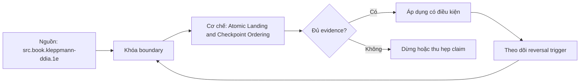

# Atomic Landing and Checkpoint Ordering

> [!abstract] Câu hỏi trung tâm
> Tại sao thứ tự land–validate–publish–checkpoint quyết định replay thay vì silent loss?

## 1. Four-step invariant

Acquire source interval/page/chunk; write immutable staging/raw object; validate integrity/schema/reconciliation and atomically publish accepted batch; only then advance source checkpoint. Durable publication includes manifest/catalog pointer or target transaction according to design. Checkpoint points to highest fully published/recoverable boundary, never highest fetched. State transition and idempotency key are persisted.

## 2. Failure windows

Crash before land: refetch. After land before validate: resume validation or discard staging. After validate before publish: retry publish same batch. After publish before checkpoint: replay source but dedup recognizes already published batch. Checkpoint before publish is fatal gap: source resumes past missing data with no error. Table lists every boundary, observable artifacts and recovery action.

## 3. Atomic publication

Single database transaction can couple target rows and checkpoint if same system. Object storage uses immutable objects plus atomic manifest/catalog pointer; multi-object existence alone is not atomic. Cross-system landing and checkpoint cannot use local transaction; choose outbox/state machine/reconciliation so ambiguity leads to replay, not skip. Exactly-once claim is scoped and proven.

## 4. Idempotency ledger

Batch identity derives from source, entity, interval/cursor and schema/config version; content hash detects collision. Ledger states prepared, landed, validated, published, checkpointed with compare-and-set/unique constraints. Retry same identity resumes. Same identity different hash quarantines. Garbage collection only after publication/checkpoint and retention evidence.

## 5. Reconciliation

After publish compare expected source-at-boundary counts/key hashes/aggregates with accepted batch and target. Checkpoint advance condition includes required validation; tolerances need owner and named cause. Metrics: pending age, gap between published and checkpointed, replay count, collision, quarantine and residual. A green job status without boundary reconciliation is insufficient.

## 6. Kill-point lab

Implement correct and intentionally inverted flows. Kill between every adjacent step, restart and compare canonical key/hash with fixed source boundary. Correct flow may replay but never gaps; dedup bounds duplicates. In inverted flow advance checkpoint then kill before publish; quantify missing keys/rows and show subsequent runs skip them. Preserve state ledger and exact kill point as evidence.

## 7. Ma trận kiểm chứng từng mệnh đề

Mỗi claim phải gắn source/entity boundary, exact fixture, checkpoint/input state, counterexample và independent reconciliation oracle. Connector chạy thành công hoặc API trả 2xx chưa chứng minh completeness.

### 7.1. Atomic-landing probe 1: source boundary, durable state, kill point, restart path và no-gap oracle phải đủ

**Mệnh đề cần kiểm.** Atomic-landing probe 1: source boundary, durable state, kill point, restart path và no-gap oracle phải đủ.

**Thiết kế phép thử cho `wiki.ingestion.atomic-landing-checkpoint-ordering`.** Khóa source/API version, entity, grain/key, time boundary, schema, pagination/cursor configuration và failure schedule. Tạo positive, boundary và negative fixtures; thay đổi đúng một assumption. Lưu request/query, response/raw extract hash, checkpoint trước/sau, landing objects, target state và source-at-boundary oracle.

**Điều kiện chấp nhận cho `wiki.ingestion.atomic-landing-checkpoint-ordering`.** Count, key set, typed field hash và delete state khớp contract; duplicates được giải thích và dedup có identity rõ. Observation, inference và unknown được báo riêng. Lab chưa chạy chỉ là protocol.

### 7.2. Atomic-landing probe 2: source boundary, durable state, kill point, restart path và no-gap oracle phải đủ

**Mệnh đề cần kiểm.** Atomic-landing probe 2: source boundary, durable state, kill point, restart path và no-gap oracle phải đủ.

**Thiết kế phép thử cho `wiki.ingestion.atomic-landing-checkpoint-ordering`.** Khóa source/API version, entity, grain/key, time boundary, schema, pagination/cursor configuration và failure schedule. Tạo positive, boundary và negative fixtures; thay đổi đúng một assumption. Lưu request/query, response/raw extract hash, checkpoint trước/sau, landing objects, target state và source-at-boundary oracle.

**Điều kiện chấp nhận cho `wiki.ingestion.atomic-landing-checkpoint-ordering`.** Count, key set, typed field hash và delete state khớp contract; duplicates được giải thích và dedup có identity rõ. Observation, inference và unknown được báo riêng. Lab chưa chạy chỉ là protocol.

### 7.3. Atomic-landing probe 3: source boundary, durable state, kill point, restart path và no-gap oracle phải đủ

**Mệnh đề cần kiểm.** Atomic-landing probe 3: source boundary, durable state, kill point, restart path và no-gap oracle phải đủ.

**Thiết kế phép thử cho `wiki.ingestion.atomic-landing-checkpoint-ordering`.** Khóa source/API version, entity, grain/key, time boundary, schema, pagination/cursor configuration và failure schedule. Tạo positive, boundary và negative fixtures; thay đổi đúng một assumption. Lưu request/query, response/raw extract hash, checkpoint trước/sau, landing objects, target state và source-at-boundary oracle.

**Điều kiện chấp nhận cho `wiki.ingestion.atomic-landing-checkpoint-ordering`.** Count, key set, typed field hash và delete state khớp contract; duplicates được giải thích và dedup có identity rõ. Observation, inference và unknown được báo riêng. Lab chưa chạy chỉ là protocol.

### 7.4. Atomic-landing probe 4: source boundary, durable state, kill point, restart path và no-gap oracle phải đủ

**Mệnh đề cần kiểm.** Atomic-landing probe 4: source boundary, durable state, kill point, restart path và no-gap oracle phải đủ.

**Thiết kế phép thử cho `wiki.ingestion.atomic-landing-checkpoint-ordering`.** Khóa source/API version, entity, grain/key, time boundary, schema, pagination/cursor configuration và failure schedule. Tạo positive, boundary và negative fixtures; thay đổi đúng một assumption. Lưu request/query, response/raw extract hash, checkpoint trước/sau, landing objects, target state và source-at-boundary oracle.

**Điều kiện chấp nhận cho `wiki.ingestion.atomic-landing-checkpoint-ordering`.** Count, key set, typed field hash và delete state khớp contract; duplicates được giải thích và dedup có identity rõ. Observation, inference và unknown được báo riêng. Lab chưa chạy chỉ là protocol.

### 7.5. Atomic-landing probe 5: source boundary, durable state, kill point, restart path và no-gap oracle phải đủ

**Mệnh đề cần kiểm.** Atomic-landing probe 5: source boundary, durable state, kill point, restart path và no-gap oracle phải đủ.

**Thiết kế phép thử cho `wiki.ingestion.atomic-landing-checkpoint-ordering`.** Khóa source/API version, entity, grain/key, time boundary, schema, pagination/cursor configuration và failure schedule. Tạo positive, boundary và negative fixtures; thay đổi đúng một assumption. Lưu request/query, response/raw extract hash, checkpoint trước/sau, landing objects, target state và source-at-boundary oracle.

**Điều kiện chấp nhận cho `wiki.ingestion.atomic-landing-checkpoint-ordering`.** Count, key set, typed field hash và delete state khớp contract; duplicates được giải thích và dedup có identity rõ. Observation, inference và unknown được báo riêng. Lab chưa chạy chỉ là protocol.

### 7.6. Atomic-landing probe 6: source boundary, durable state, kill point, restart path và no-gap oracle phải đủ

**Mệnh đề cần kiểm.** Atomic-landing probe 6: source boundary, durable state, kill point, restart path và no-gap oracle phải đủ.

**Thiết kế phép thử cho `wiki.ingestion.atomic-landing-checkpoint-ordering`.** Khóa source/API version, entity, grain/key, time boundary, schema, pagination/cursor configuration và failure schedule. Tạo positive, boundary và negative fixtures; thay đổi đúng một assumption. Lưu request/query, response/raw extract hash, checkpoint trước/sau, landing objects, target state và source-at-boundary oracle.

**Điều kiện chấp nhận cho `wiki.ingestion.atomic-landing-checkpoint-ordering`.** Count, key set, typed field hash và delete state khớp contract; duplicates được giải thích và dedup có identity rõ. Observation, inference và unknown được báo riêng. Lab chưa chạy chỉ là protocol.

### 7.7. Atomic-landing probe 7: source boundary, durable state, kill point, restart path và no-gap oracle phải đủ

**Mệnh đề cần kiểm.** Atomic-landing probe 7: source boundary, durable state, kill point, restart path và no-gap oracle phải đủ.

**Thiết kế phép thử cho `wiki.ingestion.atomic-landing-checkpoint-ordering`.** Khóa source/API version, entity, grain/key, time boundary, schema, pagination/cursor configuration và failure schedule. Tạo positive, boundary và negative fixtures; thay đổi đúng một assumption. Lưu request/query, response/raw extract hash, checkpoint trước/sau, landing objects, target state và source-at-boundary oracle.

**Điều kiện chấp nhận cho `wiki.ingestion.atomic-landing-checkpoint-ordering`.** Count, key set, typed field hash và delete state khớp contract; duplicates được giải thích và dedup có identity rõ. Observation, inference và unknown được báo riêng. Lab chưa chạy chỉ là protocol.

### 7.8. Atomic-landing probe 8: source boundary, durable state, kill point, restart path và no-gap oracle phải đủ

**Mệnh đề cần kiểm.** Atomic-landing probe 8: source boundary, durable state, kill point, restart path và no-gap oracle phải đủ.

**Thiết kế phép thử cho `wiki.ingestion.atomic-landing-checkpoint-ordering`.** Khóa source/API version, entity, grain/key, time boundary, schema, pagination/cursor configuration và failure schedule. Tạo positive, boundary và negative fixtures; thay đổi đúng một assumption. Lưu request/query, response/raw extract hash, checkpoint trước/sau, landing objects, target state và source-at-boundary oracle.

**Điều kiện chấp nhận cho `wiki.ingestion.atomic-landing-checkpoint-ordering`.** Count, key set, typed field hash và delete state khớp contract; duplicates được giải thích và dedup có identity rõ. Observation, inference và unknown được báo riêng. Lab chưa chạy chỉ là protocol.

### 7.9. Atomic-landing probe 9: source boundary, durable state, kill point, restart path và no-gap oracle phải đủ

**Mệnh đề cần kiểm.** Atomic-landing probe 9: source boundary, durable state, kill point, restart path và no-gap oracle phải đủ.

**Thiết kế phép thử cho `wiki.ingestion.atomic-landing-checkpoint-ordering`.** Khóa source/API version, entity, grain/key, time boundary, schema, pagination/cursor configuration và failure schedule. Tạo positive, boundary và negative fixtures; thay đổi đúng một assumption. Lưu request/query, response/raw extract hash, checkpoint trước/sau, landing objects, target state và source-at-boundary oracle.

**Điều kiện chấp nhận cho `wiki.ingestion.atomic-landing-checkpoint-ordering`.** Count, key set, typed field hash và delete state khớp contract; duplicates được giải thích và dedup có identity rõ. Observation, inference và unknown được báo riêng. Lab chưa chạy chỉ là protocol.

### 7.10. Atomic-landing probe 10: source boundary, durable state, kill point, restart path và no-gap oracle phải đủ

**Mệnh đề cần kiểm.** Atomic-landing probe 10: source boundary, durable state, kill point, restart path và no-gap oracle phải đủ.

**Thiết kế phép thử cho `wiki.ingestion.atomic-landing-checkpoint-ordering`.** Khóa source/API version, entity, grain/key, time boundary, schema, pagination/cursor configuration và failure schedule. Tạo positive, boundary và negative fixtures; thay đổi đúng một assumption. Lưu request/query, response/raw extract hash, checkpoint trước/sau, landing objects, target state và source-at-boundary oracle.

**Điều kiện chấp nhận cho `wiki.ingestion.atomic-landing-checkpoint-ordering`.** Count, key set, typed field hash và delete state khớp contract; duplicates được giải thích và dedup có identity rõ. Observation, inference và unknown được báo riêng. Lab chưa chạy chỉ là protocol.

### 7.11. Atomic-landing probe 11: source boundary, durable state, kill point, restart path và no-gap oracle phải đủ

**Mệnh đề cần kiểm.** Atomic-landing probe 11: source boundary, durable state, kill point, restart path và no-gap oracle phải đủ.

**Thiết kế phép thử cho `wiki.ingestion.atomic-landing-checkpoint-ordering`.** Khóa source/API version, entity, grain/key, time boundary, schema, pagination/cursor configuration và failure schedule. Tạo positive, boundary và negative fixtures; thay đổi đúng một assumption. Lưu request/query, response/raw extract hash, checkpoint trước/sau, landing objects, target state và source-at-boundary oracle.

**Điều kiện chấp nhận cho `wiki.ingestion.atomic-landing-checkpoint-ordering`.** Count, key set, typed field hash và delete state khớp contract; duplicates được giải thích và dedup có identity rõ. Observation, inference và unknown được báo riêng. Lab chưa chạy chỉ là protocol.

### 7.12. Atomic-landing probe 12: source boundary, durable state, kill point, restart path và no-gap oracle phải đủ

**Mệnh đề cần kiểm.** Atomic-landing probe 12: source boundary, durable state, kill point, restart path và no-gap oracle phải đủ.

**Thiết kế phép thử cho `wiki.ingestion.atomic-landing-checkpoint-ordering`.** Khóa source/API version, entity, grain/key, time boundary, schema, pagination/cursor configuration và failure schedule. Tạo positive, boundary và negative fixtures; thay đổi đúng một assumption. Lưu request/query, response/raw extract hash, checkpoint trước/sau, landing objects, target state và source-at-boundary oracle.

**Điều kiện chấp nhận cho `wiki.ingestion.atomic-landing-checkpoint-ordering`.** Count, key set, typed field hash và delete state khớp contract; duplicates được giải thích và dedup có identity rõ. Observation, inference và unknown được báo riêng. Lab chưa chạy chỉ là protocol.

### 7.13. Atomic-landing probe 13: source boundary, durable state, kill point, restart path và no-gap oracle phải đủ

**Mệnh đề cần kiểm.** Atomic-landing probe 13: source boundary, durable state, kill point, restart path và no-gap oracle phải đủ.

**Thiết kế phép thử cho `wiki.ingestion.atomic-landing-checkpoint-ordering`.** Khóa source/API version, entity, grain/key, time boundary, schema, pagination/cursor configuration và failure schedule. Tạo positive, boundary và negative fixtures; thay đổi đúng một assumption. Lưu request/query, response/raw extract hash, checkpoint trước/sau, landing objects, target state và source-at-boundary oracle.

**Điều kiện chấp nhận cho `wiki.ingestion.atomic-landing-checkpoint-ordering`.** Count, key set, typed field hash và delete state khớp contract; duplicates được giải thích và dedup có identity rõ. Observation, inference và unknown được báo riêng. Lab chưa chạy chỉ là protocol.

### 7.14. Atomic-landing probe 14: source boundary, durable state, kill point, restart path và no-gap oracle phải đủ

**Mệnh đề cần kiểm.** Atomic-landing probe 14: source boundary, durable state, kill point, restart path và no-gap oracle phải đủ.

**Thiết kế phép thử cho `wiki.ingestion.atomic-landing-checkpoint-ordering`.** Khóa source/API version, entity, grain/key, time boundary, schema, pagination/cursor configuration và failure schedule. Tạo positive, boundary và negative fixtures; thay đổi đúng một assumption. Lưu request/query, response/raw extract hash, checkpoint trước/sau, landing objects, target state và source-at-boundary oracle.

**Điều kiện chấp nhận cho `wiki.ingestion.atomic-landing-checkpoint-ordering`.** Count, key set, typed field hash và delete state khớp contract; duplicates được giải thích và dedup có identity rõ. Observation, inference và unknown được báo riêng. Lab chưa chạy chỉ là protocol.

### 7.15. Atomic-landing probe 15: source boundary, durable state, kill point, restart path và no-gap oracle phải đủ

**Mệnh đề cần kiểm.** Atomic-landing probe 15: source boundary, durable state, kill point, restart path và no-gap oracle phải đủ.

**Thiết kế phép thử cho `wiki.ingestion.atomic-landing-checkpoint-ordering`.** Khóa source/API version, entity, grain/key, time boundary, schema, pagination/cursor configuration và failure schedule. Tạo positive, boundary và negative fixtures; thay đổi đúng một assumption. Lưu request/query, response/raw extract hash, checkpoint trước/sau, landing objects, target state và source-at-boundary oracle.

**Điều kiện chấp nhận cho `wiki.ingestion.atomic-landing-checkpoint-ordering`.** Count, key set, typed field hash và delete state khớp contract; duplicates được giải thích và dedup có identity rõ. Observation, inference và unknown được báo riêng. Lab chưa chạy chỉ là protocol.

## 8. Quy trình phản biện

1. Chốt entity, grain, identity và immutable boundary.
2. Tách source fact, documentation claim và observed behavior.
3. Viết delete, retry, checkpoint và replay semantics trước code.
4. Dùng key/typed-hash reconciliation, không chỉ row count.
5. Pin version, retention, timezone, ordering và rate limits.
6. Ghi assumption bị falsify và extraction pattern thay thế.

## 9. Câu hỏi tự kiểm tra

1. Source thay đổi row/entity theo những operation nào?
2. Boundary nào định nghĩa complete?
3. Delete có xuất hiện trong interface không?
4. Cursor/order có total và immutable không?
5. Crash ở checkpoint boundary gây replay hay gap?
6. Bằng chứng nào chưa được chạy?

## 10. Giới hạn và điều chưa cho phép kết luận

- Chưa chạy mutation/pagination/watermark lab trên source thật.
- Product behavior phải pin version, retention và configuration.
- Decision matrices và failure protocols là synthesis của giáo trình.
- Note giữ trạng thái `review` tới khi chủ dự án duyệt.

## Reference
1. [[SRC-KLEPPMANN-DDIA-1E]]
2. [[SRC-REIS-HOUSLEY-FUNDAMENTALS-DATA-ENGINEERING]]
3. [[SRC-AWS-S3-MULTIPART-UPLOAD]]
4. [[SRC-AWS-S3-OBJECT-CHECKSUMS]]

## Source coverage

| Source slice | Nội dung sử dụng | Trạng thái |
|---|---|---|
| [[SRC-KLEPPMANN-DDIA-1E]] | Source/change/API contract hoặc engineering context | Đã đọc locator; không suy ngoài phạm vi |
| [[SRC-REIS-HOUSLEY-FUNDAMENTALS-DATA-ENGINEERING]] | Source/change/API contract hoặc engineering context | Đã đọc locator; không suy ngoài phạm vi |
| [[SRC-AWS-S3-MULTIPART-UPLOAD]] | Source/change/API contract hoặc engineering context | Đã đọc locator; không suy ngoài phạm vi |
| [[SRC-AWS-S3-OBJECT-CHECKSUMS]] | Source/change/API contract hoặc engineering context | Đã đọc locator; không suy ngoài phạm vi |

## Key takeaways
- Extraction pattern chỉ đúng khi source assumptions đúng.
- Completeness cần immutable boundary và reconciliation oracle.
- Retry/checkpoint ưu tiên replay có kiểm soát hơn silent gap.
- Connector không chuyển giao ownership về tính đúng.

<!-- ATOMIC-EXECUTION-CAPSULE:START -->

## Execution capsule — kiểm chứng `wiki.ingestion.atomic-landing-checkpoint-ordering`

> [!important] Phân loại mệnh đề
> Với `wiki.ingestion.atomic-landing-checkpoint-ordering`, sơ đồ, ví dụ và artifact về **Atomic Landing and Checkpoint Ordering** là **synthesis để kiểm chứng**; chúng không phải trích dẫn hay case nguyên văn của nguồn.

### Sơ đồ cơ chế và điểm kiểm soát



Đọc sơ đồ `wiki.ingestion.atomic-landing-checkpoint-ordering` từ trái sang phải: source chỉ cung cấp claim ban đầu cho **Atomic Landing and Checkpoint Ordering**; quyết định chỉ được đi tiếp sau khi boundary, evidence và điều kiện đảo quyết định đã hiện hữu.

### Ví dụ làm việc có thể bác bỏ

**Input.** Một đội cần trả lời: “Tại sao thứ tự land–validate–publish–checkpoint quyết định replay thay vì silent loss?” cho một phạm vi nhỏ, có owner và deadline rõ.

**Decision.** Đội áp dụng **Atomic Landing and Checkpoint Ordering** trên control và variant chỉ khác một assumption; expected result và hard constraints được khóa trước khi chạy.

**Outcome.** Với `wiki.ingestion.atomic-landing-checkpoint-ordering`, nếu observation vi phạm hard constraint hoặc oracle độc lập không xác nhận **Atomic Landing and Checkpoint Ordering**, đội thu hẹp claim hay đảo quyết định. Nếu đạt, kết luận vẫn kèm scope, version và review date; một lần thành công không được nâng thành quy luật phổ quát.

### Artifact thực thi tối thiểu

```sql
-- Verification harness for: Atomic Landing and Checkpoint Ordering
WITH evidence AS (
    SELECT 'wiki.ingestion.atomic-landing-checkpoint-ordering' AS concept_id,
           'boundary_declared' AS check_name, 1 AS passed
    UNION ALL
    SELECT 'wiki.ingestion.atomic-landing-checkpoint-ordering', 'independent_oracle', 1
    UNION ALL
    SELECT 'wiki.ingestion.atomic-landing-checkpoint-ordering', 'reversal_trigger_recorded', 1
)
SELECT concept_id,
       MIN(passed) AS all_hard_checks_pass,
       COUNT(*) AS evidence_items
FROM evidence
GROUP BY concept_id
HAVING MIN(passed) = 1;
```

Artifact của `wiki.ingestion.atomic-landing-checkpoint-ordering` buộc người dùng ghi boundary, oracle và reversal trigger cho **Atomic Landing and Checkpoint Ordering**. Các giá trị minh họa phải được thay bằng evidence thật trước khi dùng cho quyết định.

### Tự kiểm tra trước khi tái sử dụng

1. Bạn có thể trả lời `Tại sao thứ tự land–validate–publish–checkpoint quyết định replay thay vì silent loss?` bằng một câu mà không kéo thêm concept thứ hai không?
2. Source locator nào đỡ cho claim, và phần nào chỉ là synthesis trong note?
3. Observation nào khiến bạn dừng, thu hẹp hoặc đảo quyết định?
4. Artifact nào cho phép một reviewer độc lập tái hiện kết quả?

<!-- ATOMIC-EXECUTION-CAPSULE:END -->
