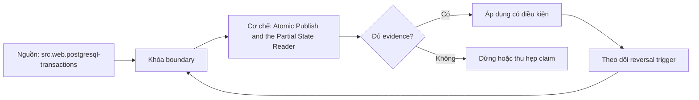

# Atomic Publish and the Partial State Reader

> [!abstract] Câu hỏi trung tâm
> Thiết kế publication thế nào để reader thấy old hoặc new complete state nhưng không thấy trạng thái dở dang?

## 1. Visibility invariant

Tại logical publication point, mỗi reader được phép thấy complete version V hoặc V+1 theo isolation contract; không thấy mixture vi phạm referential/business invariants. Atomicity scope phải ghi: one table, partition set, manifest snapshot hay multi-table product. Commit success và consumer cache refresh là hai boundaries khác.

## 2. Các failure windows

Build partial, validate failure, publish conflict, commit unknown, crash after publish before status/checkpoint và cleanup too early. Mỗi window có durable artifacts, recovery owner và idempotent transition. Publish-first then validate is unsafe; cleanup-old immediately can break long reader. Unknown commit outcome được resolve bằng transaction/snapshot ID, không retry blind.

## 3. Patterns

Database transaction covers supported objects; shadow table plus atomic rename/swap where engine guarantees; immutable files plus manifest/catalog pointer; versioned view alias for dataset. Multi-system needs state machine/outbox and reconciliation, not pretend distributed atomicity. Readers must use supported snapshot/pointer, not list staging paths.

## 4. Reader tests

Start long reader before publish, short readers during/after, cached BI/session and two-table join. Inject pause between file writes and pointer commit. Assert observed version IDs and invariants; no reader sees unlisted files or mixed keys. Test stale cache explicitly: atomic catalog commit does not invalidate every application cache instantly.

## 5. Validation gate

Before publish verify schema/contract, counts/key/hash, constraints, freshness and required cross-table equations. Gate output is bound to exact candidate version hash. Approval and publish use compare-and-set against expected parent to prevent lost update. Failed candidate stays isolated/quarantined with retention policy.

## 6. Rollback và cleanup

Rollback republishes previous valid pointer/version, not reconstructs from partial logs. Keep old version until reader lease/time-travel retention and incident window pass. Cleanup records reachability and legal/privacy rules. Measure publish latency, conflict rate, unknown outcomes, rollback time and partial-state detections.

## 7. Ma trận kiểm chứng từng mệnh đề

Mỗi claim phải gắn source/entity boundary, exact fixture, checkpoint/input state, counterexample và independent reconciliation oracle. Connector chạy thành công hoặc API trả 2xx chưa chứng minh completeness.

### 7.1. Atomic-publish probe 1: version identity, commit scope, concurrent reader, injected kill point và invariant oracle phải đủ

**Mệnh đề cần kiểm.** Atomic-publish probe 1: version identity, commit scope, concurrent reader, injected kill point và invariant oracle phải đủ.

**Thiết kế phép thử cho `wiki.transformation.atomic-publish-partial-state-reader`.** Khóa source/API version, entity, grain/key, time boundary, schema, pagination/cursor configuration và failure schedule. Tạo positive, boundary và negative fixtures; thay đổi đúng một assumption. Lưu request/query, response/raw extract hash, checkpoint trước/sau, landing objects, target state và source-at-boundary oracle.

**Điều kiện chấp nhận cho `wiki.transformation.atomic-publish-partial-state-reader`.** Count, key set, typed field hash và delete state khớp contract; duplicates được giải thích và dedup có identity rõ. Observation, inference và unknown được báo riêng. Lab chưa chạy chỉ là protocol.

### 7.2. Atomic-publish probe 2: version identity, commit scope, concurrent reader, injected kill point và invariant oracle phải đủ

**Mệnh đề cần kiểm.** Atomic-publish probe 2: version identity, commit scope, concurrent reader, injected kill point và invariant oracle phải đủ.

**Thiết kế phép thử cho `wiki.transformation.atomic-publish-partial-state-reader`.** Khóa source/API version, entity, grain/key, time boundary, schema, pagination/cursor configuration và failure schedule. Tạo positive, boundary và negative fixtures; thay đổi đúng một assumption. Lưu request/query, response/raw extract hash, checkpoint trước/sau, landing objects, target state và source-at-boundary oracle.

**Điều kiện chấp nhận cho `wiki.transformation.atomic-publish-partial-state-reader`.** Count, key set, typed field hash và delete state khớp contract; duplicates được giải thích và dedup có identity rõ. Observation, inference và unknown được báo riêng. Lab chưa chạy chỉ là protocol.

### 7.3. Atomic-publish probe 3: version identity, commit scope, concurrent reader, injected kill point và invariant oracle phải đủ

**Mệnh đề cần kiểm.** Atomic-publish probe 3: version identity, commit scope, concurrent reader, injected kill point và invariant oracle phải đủ.

**Thiết kế phép thử cho `wiki.transformation.atomic-publish-partial-state-reader`.** Khóa source/API version, entity, grain/key, time boundary, schema, pagination/cursor configuration và failure schedule. Tạo positive, boundary và negative fixtures; thay đổi đúng một assumption. Lưu request/query, response/raw extract hash, checkpoint trước/sau, landing objects, target state và source-at-boundary oracle.

**Điều kiện chấp nhận cho `wiki.transformation.atomic-publish-partial-state-reader`.** Count, key set, typed field hash và delete state khớp contract; duplicates được giải thích và dedup có identity rõ. Observation, inference và unknown được báo riêng. Lab chưa chạy chỉ là protocol.

### 7.4. Atomic-publish probe 4: version identity, commit scope, concurrent reader, injected kill point và invariant oracle phải đủ

**Mệnh đề cần kiểm.** Atomic-publish probe 4: version identity, commit scope, concurrent reader, injected kill point và invariant oracle phải đủ.

**Thiết kế phép thử cho `wiki.transformation.atomic-publish-partial-state-reader`.** Khóa source/API version, entity, grain/key, time boundary, schema, pagination/cursor configuration và failure schedule. Tạo positive, boundary và negative fixtures; thay đổi đúng một assumption. Lưu request/query, response/raw extract hash, checkpoint trước/sau, landing objects, target state và source-at-boundary oracle.

**Điều kiện chấp nhận cho `wiki.transformation.atomic-publish-partial-state-reader`.** Count, key set, typed field hash và delete state khớp contract; duplicates được giải thích và dedup có identity rõ. Observation, inference và unknown được báo riêng. Lab chưa chạy chỉ là protocol.

### 7.5. Atomic-publish probe 5: version identity, commit scope, concurrent reader, injected kill point và invariant oracle phải đủ

**Mệnh đề cần kiểm.** Atomic-publish probe 5: version identity, commit scope, concurrent reader, injected kill point và invariant oracle phải đủ.

**Thiết kế phép thử cho `wiki.transformation.atomic-publish-partial-state-reader`.** Khóa source/API version, entity, grain/key, time boundary, schema, pagination/cursor configuration và failure schedule. Tạo positive, boundary và negative fixtures; thay đổi đúng một assumption. Lưu request/query, response/raw extract hash, checkpoint trước/sau, landing objects, target state và source-at-boundary oracle.

**Điều kiện chấp nhận cho `wiki.transformation.atomic-publish-partial-state-reader`.** Count, key set, typed field hash và delete state khớp contract; duplicates được giải thích và dedup có identity rõ. Observation, inference và unknown được báo riêng. Lab chưa chạy chỉ là protocol.

### 7.6. Atomic-publish probe 6: version identity, commit scope, concurrent reader, injected kill point và invariant oracle phải đủ

**Mệnh đề cần kiểm.** Atomic-publish probe 6: version identity, commit scope, concurrent reader, injected kill point và invariant oracle phải đủ.

**Thiết kế phép thử cho `wiki.transformation.atomic-publish-partial-state-reader`.** Khóa source/API version, entity, grain/key, time boundary, schema, pagination/cursor configuration và failure schedule. Tạo positive, boundary và negative fixtures; thay đổi đúng một assumption. Lưu request/query, response/raw extract hash, checkpoint trước/sau, landing objects, target state và source-at-boundary oracle.

**Điều kiện chấp nhận cho `wiki.transformation.atomic-publish-partial-state-reader`.** Count, key set, typed field hash và delete state khớp contract; duplicates được giải thích và dedup có identity rõ. Observation, inference và unknown được báo riêng. Lab chưa chạy chỉ là protocol.

### 7.7. Atomic-publish probe 7: version identity, commit scope, concurrent reader, injected kill point và invariant oracle phải đủ

**Mệnh đề cần kiểm.** Atomic-publish probe 7: version identity, commit scope, concurrent reader, injected kill point và invariant oracle phải đủ.

**Thiết kế phép thử cho `wiki.transformation.atomic-publish-partial-state-reader`.** Khóa source/API version, entity, grain/key, time boundary, schema, pagination/cursor configuration và failure schedule. Tạo positive, boundary và negative fixtures; thay đổi đúng một assumption. Lưu request/query, response/raw extract hash, checkpoint trước/sau, landing objects, target state và source-at-boundary oracle.

**Điều kiện chấp nhận cho `wiki.transformation.atomic-publish-partial-state-reader`.** Count, key set, typed field hash và delete state khớp contract; duplicates được giải thích và dedup có identity rõ. Observation, inference và unknown được báo riêng. Lab chưa chạy chỉ là protocol.

### 7.8. Atomic-publish probe 8: version identity, commit scope, concurrent reader, injected kill point và invariant oracle phải đủ

**Mệnh đề cần kiểm.** Atomic-publish probe 8: version identity, commit scope, concurrent reader, injected kill point và invariant oracle phải đủ.

**Thiết kế phép thử cho `wiki.transformation.atomic-publish-partial-state-reader`.** Khóa source/API version, entity, grain/key, time boundary, schema, pagination/cursor configuration và failure schedule. Tạo positive, boundary và negative fixtures; thay đổi đúng một assumption. Lưu request/query, response/raw extract hash, checkpoint trước/sau, landing objects, target state và source-at-boundary oracle.

**Điều kiện chấp nhận cho `wiki.transformation.atomic-publish-partial-state-reader`.** Count, key set, typed field hash và delete state khớp contract; duplicates được giải thích và dedup có identity rõ. Observation, inference và unknown được báo riêng. Lab chưa chạy chỉ là protocol.

### 7.9. Atomic-publish probe 9: version identity, commit scope, concurrent reader, injected kill point và invariant oracle phải đủ

**Mệnh đề cần kiểm.** Atomic-publish probe 9: version identity, commit scope, concurrent reader, injected kill point và invariant oracle phải đủ.

**Thiết kế phép thử cho `wiki.transformation.atomic-publish-partial-state-reader`.** Khóa source/API version, entity, grain/key, time boundary, schema, pagination/cursor configuration và failure schedule. Tạo positive, boundary và negative fixtures; thay đổi đúng một assumption. Lưu request/query, response/raw extract hash, checkpoint trước/sau, landing objects, target state và source-at-boundary oracle.

**Điều kiện chấp nhận cho `wiki.transformation.atomic-publish-partial-state-reader`.** Count, key set, typed field hash và delete state khớp contract; duplicates được giải thích và dedup có identity rõ. Observation, inference và unknown được báo riêng. Lab chưa chạy chỉ là protocol.

### 7.10. Atomic-publish probe 10: version identity, commit scope, concurrent reader, injected kill point và invariant oracle phải đủ

**Mệnh đề cần kiểm.** Atomic-publish probe 10: version identity, commit scope, concurrent reader, injected kill point và invariant oracle phải đủ.

**Thiết kế phép thử cho `wiki.transformation.atomic-publish-partial-state-reader`.** Khóa source/API version, entity, grain/key, time boundary, schema, pagination/cursor configuration và failure schedule. Tạo positive, boundary và negative fixtures; thay đổi đúng một assumption. Lưu request/query, response/raw extract hash, checkpoint trước/sau, landing objects, target state và source-at-boundary oracle.

**Điều kiện chấp nhận cho `wiki.transformation.atomic-publish-partial-state-reader`.** Count, key set, typed field hash và delete state khớp contract; duplicates được giải thích và dedup có identity rõ. Observation, inference và unknown được báo riêng. Lab chưa chạy chỉ là protocol.

### 7.11. Atomic-publish probe 11: version identity, commit scope, concurrent reader, injected kill point và invariant oracle phải đủ

**Mệnh đề cần kiểm.** Atomic-publish probe 11: version identity, commit scope, concurrent reader, injected kill point và invariant oracle phải đủ.

**Thiết kế phép thử cho `wiki.transformation.atomic-publish-partial-state-reader`.** Khóa source/API version, entity, grain/key, time boundary, schema, pagination/cursor configuration và failure schedule. Tạo positive, boundary và negative fixtures; thay đổi đúng một assumption. Lưu request/query, response/raw extract hash, checkpoint trước/sau, landing objects, target state và source-at-boundary oracle.

**Điều kiện chấp nhận cho `wiki.transformation.atomic-publish-partial-state-reader`.** Count, key set, typed field hash và delete state khớp contract; duplicates được giải thích và dedup có identity rõ. Observation, inference và unknown được báo riêng. Lab chưa chạy chỉ là protocol.

### 7.12. Atomic-publish probe 12: version identity, commit scope, concurrent reader, injected kill point và invariant oracle phải đủ

**Mệnh đề cần kiểm.** Atomic-publish probe 12: version identity, commit scope, concurrent reader, injected kill point và invariant oracle phải đủ.

**Thiết kế phép thử cho `wiki.transformation.atomic-publish-partial-state-reader`.** Khóa source/API version, entity, grain/key, time boundary, schema, pagination/cursor configuration và failure schedule. Tạo positive, boundary và negative fixtures; thay đổi đúng một assumption. Lưu request/query, response/raw extract hash, checkpoint trước/sau, landing objects, target state và source-at-boundary oracle.

**Điều kiện chấp nhận cho `wiki.transformation.atomic-publish-partial-state-reader`.** Count, key set, typed field hash và delete state khớp contract; duplicates được giải thích và dedup có identity rõ. Observation, inference và unknown được báo riêng. Lab chưa chạy chỉ là protocol.

### 7.13. Atomic-publish probe 13: version identity, commit scope, concurrent reader, injected kill point và invariant oracle phải đủ

**Mệnh đề cần kiểm.** Atomic-publish probe 13: version identity, commit scope, concurrent reader, injected kill point và invariant oracle phải đủ.

**Thiết kế phép thử cho `wiki.transformation.atomic-publish-partial-state-reader`.** Khóa source/API version, entity, grain/key, time boundary, schema, pagination/cursor configuration và failure schedule. Tạo positive, boundary và negative fixtures; thay đổi đúng một assumption. Lưu request/query, response/raw extract hash, checkpoint trước/sau, landing objects, target state và source-at-boundary oracle.

**Điều kiện chấp nhận cho `wiki.transformation.atomic-publish-partial-state-reader`.** Count, key set, typed field hash và delete state khớp contract; duplicates được giải thích và dedup có identity rõ. Observation, inference và unknown được báo riêng. Lab chưa chạy chỉ là protocol.

### 7.14. Atomic-publish probe 14: version identity, commit scope, concurrent reader, injected kill point và invariant oracle phải đủ

**Mệnh đề cần kiểm.** Atomic-publish probe 14: version identity, commit scope, concurrent reader, injected kill point và invariant oracle phải đủ.

**Thiết kế phép thử cho `wiki.transformation.atomic-publish-partial-state-reader`.** Khóa source/API version, entity, grain/key, time boundary, schema, pagination/cursor configuration và failure schedule. Tạo positive, boundary và negative fixtures; thay đổi đúng một assumption. Lưu request/query, response/raw extract hash, checkpoint trước/sau, landing objects, target state và source-at-boundary oracle.

**Điều kiện chấp nhận cho `wiki.transformation.atomic-publish-partial-state-reader`.** Count, key set, typed field hash và delete state khớp contract; duplicates được giải thích và dedup có identity rõ. Observation, inference và unknown được báo riêng. Lab chưa chạy chỉ là protocol.

### 7.15. Atomic-publish probe 15: version identity, commit scope, concurrent reader, injected kill point và invariant oracle phải đủ

**Mệnh đề cần kiểm.** Atomic-publish probe 15: version identity, commit scope, concurrent reader, injected kill point và invariant oracle phải đủ.

**Thiết kế phép thử cho `wiki.transformation.atomic-publish-partial-state-reader`.** Khóa source/API version, entity, grain/key, time boundary, schema, pagination/cursor configuration và failure schedule. Tạo positive, boundary và negative fixtures; thay đổi đúng một assumption. Lưu request/query, response/raw extract hash, checkpoint trước/sau, landing objects, target state và source-at-boundary oracle.

**Điều kiện chấp nhận cho `wiki.transformation.atomic-publish-partial-state-reader`.** Count, key set, typed field hash và delete state khớp contract; duplicates được giải thích và dedup có identity rõ. Observation, inference và unknown được báo riêng. Lab chưa chạy chỉ là protocol.

## 8. Quy trình phản biện

1. Chốt entity, grain, identity và immutable boundary.
2. Tách source fact, documentation claim và observed behavior.
3. Viết delete, retry, checkpoint và replay semantics trước code.
4. Dùng key/typed-hash reconciliation, không chỉ row count.
5. Pin version, retention, timezone, ordering và rate limits.
6. Ghi assumption bị falsify và extraction pattern thay thế.

## 9. Câu hỏi tự kiểm tra

1. Source thay đổi row/entity theo những operation nào?
2. Boundary nào định nghĩa complete?
3. Delete có xuất hiện trong interface không?
4. Cursor/order có total và immutable không?
5. Crash ở checkpoint boundary gây replay hay gap?
6. Bằng chứng nào chưa được chạy?

## 10. Giới hạn và điều chưa cho phép kết luận

- Chưa chạy mutation/pagination/watermark lab trên source thật.
- Product behavior phải pin version, retention và configuration.
- Decision matrices và failure protocols là synthesis của giáo trình.
- Note giữ trạng thái `review` tới khi chủ dự án duyệt.

## Reference
1. [[SRC-POSTGRESQL-TRANSACTIONS]]
2. [[SRC-APACHE-ICEBERG-RELIABILITY]]
3. [[SRC-KLEPPMANN-DDIA-1E]]

## Source coverage

| Source slice | Nội dung sử dụng | Trạng thái |
|---|---|---|
| [[SRC-POSTGRESQL-TRANSACTIONS]] | Source/change/API contract hoặc engineering context | Đã đọc locator; không suy ngoài phạm vi |
| [[SRC-APACHE-ICEBERG-RELIABILITY]] | Source/change/API contract hoặc engineering context | Đã đọc locator; không suy ngoài phạm vi |
| [[SRC-KLEPPMANN-DDIA-1E]] | Source/change/API contract hoặc engineering context | Đã đọc locator; không suy ngoài phạm vi |

## Key takeaways
- Extraction pattern chỉ đúng khi source assumptions đúng.
- Completeness cần immutable boundary và reconciliation oracle.
- Retry/checkpoint ưu tiên replay có kiểm soát hơn silent gap.
- Connector không chuyển giao ownership về tính đúng.

<!-- ATOMIC-EXECUTION-CAPSULE:START -->

## Execution capsule: kiểm chứng `wiki.transformation.atomic-publish-partial-state-reader`

> [!important] Phân loại mệnh đề
> Với `wiki.transformation.atomic-publish-partial-state-reader`, sơ đồ, ví dụ và artifact về **Atomic Publish and the Partial State Reader** là **synthesis để kiểm chứng**; chúng không phải trích dẫn hay case nguyên văn của nguồn.

### Sơ đồ cơ chế và điểm kiểm soát



Đọc sơ đồ `wiki.transformation.atomic-publish-partial-state-reader` từ trái sang phải: source chỉ cung cấp claim ban đầu cho **Atomic Publish and the Partial State Reader**; quyết định chỉ được đi tiếp sau khi boundary, evidence và điều kiện đảo quyết định đã hiện hữu.

### Ví dụ làm việc có thể bác bỏ

**Input.** Một đội cần trả lời: Thiết kế publication thế nào để reader thấy old hoặc new complete state nhưng không thấy trạng thái dở dang? cho một phạm vi nhỏ, có owner và deadline rõ.

**Decision.** Đội áp dụng **Atomic Publish and the Partial State Reader** trên control và variant chỉ khác một assumption; expected result và hard constraints được khóa trước khi chạy.

**Outcome.** Với `wiki.transformation.atomic-publish-partial-state-reader`, nếu observation vi phạm hard constraint hoặc oracle độc lập không xác nhận **Atomic Publish and the Partial State Reader**, đội thu hẹp claim hay đảo quyết định. Nếu đạt, kết luận vẫn kèm scope, version và review date; một lần thành công không được nâng thành quy luật phổ quát.

### Artifact thực thi tối thiểu

```sql
-- Verification harness for: Atomic Publish and the Partial State Reader
WITH evidence AS (
    SELECT 'wiki.transformation.atomic-publish-partial-state-reader' AS concept_id,
           'boundary_declared' AS check_name, 1 AS passed
    UNION ALL
    SELECT 'wiki.transformation.atomic-publish-partial-state-reader', 'independent_oracle', 1
    UNION ALL
    SELECT 'wiki.transformation.atomic-publish-partial-state-reader', 'reversal_trigger_recorded', 1
)
SELECT concept_id,
       MIN(passed) AS all_hard_checks_pass,
       COUNT(*) AS evidence_items
FROM evidence
GROUP BY concept_id
HAVING MIN(passed) = 1;
```

Artifact của `wiki.transformation.atomic-publish-partial-state-reader` buộc người dùng ghi boundary, oracle và reversal trigger cho **Atomic Publish and the Partial State Reader**. Các giá trị minh họa phải được thay bằng evidence thật trước khi dùng cho quyết định.

### Tự kiểm tra trước khi tái sử dụng

1. Bạn có thể trả lời `Thiết kế publication thế nào để reader thấy old hoặc new complete state nhưng không thấy trạng thái dở dang?` bằng một câu mà không kéo thêm concept thứ hai không?
2. Source locator nào đỡ cho claim, và phần nào chỉ là synthesis trong note?
3. Observation nào khiến bạn dừng, thu hẹp hoặc đảo quyết định?
4. Artifact nào cho phép một reviewer độc lập tái hiện kết quả?

<!-- ATOMIC-EXECUTION-CAPSULE:END -->
