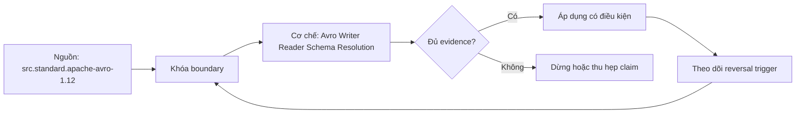

# Avro Writer Reader Schema Resolution

> [!abstract] Câu hỏi trung tâm
> Avro phân giải writer schema với reader schema ra sao, và tại sao decode sạch vẫn có thể sai nghĩa?

## 1. Writer và reader schema

Binary datum dựa writer schema; reader supplies expected schema. Object Container File embeds schema metadata and blocks with sync markers; single-object/message deployments may use registry/fingerprint. Resolution is directional. Backward statement phải viết rõ new reader reads old writer; forward là old reader reads new writer. Test cả hướng, không suy symmetry.

## 2. Record field matching

Record names/types phải match theo rules; fields matched by name, order irrelevant. Writer-only field bị reader bỏ. Reader-only field cần reader default hoặc resolution errors. Default dùng lúc reading missing field, không làm writer field optional và value equal default vẫn encoded. Union branch order/default rules cần test đúng library. Primitive promotions chỉ theo allowed list; narrowing không tự an toàn.

## 3. Rename và alias

Rename without mapping khiến old writer field trở thành unknown và new reader field missing; nếu new field có default, decode có thể sạch nhưng silently substitutes default. Reader aliases có thể rewrite writer name, nhưng spec nói implementation may optionally use aliases nên phải verify library. Alias direction, fullname/namespace và generated model mapping cần golden records. Không gọi alias là cơ chế duy nhất nếu application migration/dual fields tồn tại.

## 4. Logical types và semantics

Decimal, timestamp, date là logical annotations trên primitive representations. Matching underlying primitive có thể decode dù scale, unit, timezone meaning hoặc business definition đổi. Schema resolution không phát hiện cents→dollars, event_time→processing_time, milliseconds→microseconds nếu representation vẫn accepted. Semantic contract có units, allowed range, timezone, invariant và migration. Decode oracle cộng business invariant oracle.

## 5. Container splitting

Avro object container blocks carry count/size, optional codec and sync marker, cho phép tìm block boundary. Splittability không đồng nghĩa every arbitrary byte start works; reader scans sync and codec/block integrity. Corruption, truncated block, huge records và codec support cần negative tests. Row-oriented append/ingest usefulness là workload observation, không universal superiority over column files.

## 6. Bốn thay đổi

Test add field with valid default, remove field, rename with/without alias, promote/change type. Serialize real bytes with v1/v2 writer schemas and read with both readers. Record success/error plus canonical typed values. Add semantic-only change that decodes but violates invariant. Pin library/version and schema fingerprints. Done when predictions match all cells and clean semantic failure is detected outside decoder.

## 7. Ma trận kiểm chứng từng mệnh đề

Mỗi claim cần fixture, versioned contract, counterexample và oracle ở đúng tầng. Parse/decode success, registry acceptance hoặc feature name không tự chứng minh semantic correctness.

### 7.1. Avro resolution case 1 phải ghi writer schema, reader schema, bytes, expected rule và semantic oracle

**Mệnh đề cần kiểm.** Avro resolution case 1 phải ghi writer schema, reader schema, bytes, expected rule và semantic oracle.

**Protocol cho `wiki.serialization.avro-writer-reader-schema-resolution`.** Khóa source/schema versions, producer-consumer path, configuration và canonical meaning. Chạy positive, boundary và negative fixtures; lưu raw bytes/files, hashes, logs, typed output và exact failing cell. Đổi một assumption rồi ghi reversal condition.

**Bằng chứng đạt cho `wiki.serialization.avro-writer-reader-schema-resolution`.** Kết quả structural và semantic được báo riêng, có independent oracle, repetitions khi đo performance, reviewer và limitation. Lab chưa chạy chỉ được ghi protocol, không ghi expected behavior như observation.

### 7.2. Avro resolution case 2 phải ghi writer schema, reader schema, bytes, expected rule và semantic oracle

**Mệnh đề cần kiểm.** Avro resolution case 2 phải ghi writer schema, reader schema, bytes, expected rule và semantic oracle.

**Protocol cho `wiki.serialization.avro-writer-reader-schema-resolution`.** Khóa source/schema versions, producer-consumer path, configuration và canonical meaning. Chạy positive, boundary và negative fixtures; lưu raw bytes/files, hashes, logs, typed output và exact failing cell. Đổi một assumption rồi ghi reversal condition.

**Bằng chứng đạt cho `wiki.serialization.avro-writer-reader-schema-resolution`.** Kết quả structural và semantic được báo riêng, có independent oracle, repetitions khi đo performance, reviewer và limitation. Lab chưa chạy chỉ được ghi protocol, không ghi expected behavior như observation.

### 7.3. Avro resolution case 3 phải ghi writer schema, reader schema, bytes, expected rule và semantic oracle

**Mệnh đề cần kiểm.** Avro resolution case 3 phải ghi writer schema, reader schema, bytes, expected rule và semantic oracle.

**Protocol cho `wiki.serialization.avro-writer-reader-schema-resolution`.** Khóa source/schema versions, producer-consumer path, configuration và canonical meaning. Chạy positive, boundary và negative fixtures; lưu raw bytes/files, hashes, logs, typed output và exact failing cell. Đổi một assumption rồi ghi reversal condition.

**Bằng chứng đạt cho `wiki.serialization.avro-writer-reader-schema-resolution`.** Kết quả structural và semantic được báo riêng, có independent oracle, repetitions khi đo performance, reviewer và limitation. Lab chưa chạy chỉ được ghi protocol, không ghi expected behavior như observation.

### 7.4. Avro resolution case 4 phải ghi writer schema, reader schema, bytes, expected rule và semantic oracle

**Mệnh đề cần kiểm.** Avro resolution case 4 phải ghi writer schema, reader schema, bytes, expected rule và semantic oracle.

**Protocol cho `wiki.serialization.avro-writer-reader-schema-resolution`.** Khóa source/schema versions, producer-consumer path, configuration và canonical meaning. Chạy positive, boundary và negative fixtures; lưu raw bytes/files, hashes, logs, typed output và exact failing cell. Đổi một assumption rồi ghi reversal condition.

**Bằng chứng đạt cho `wiki.serialization.avro-writer-reader-schema-resolution`.** Kết quả structural và semantic được báo riêng, có independent oracle, repetitions khi đo performance, reviewer và limitation. Lab chưa chạy chỉ được ghi protocol, không ghi expected behavior như observation.

### 7.5. Avro resolution case 5 phải ghi writer schema, reader schema, bytes, expected rule và semantic oracle

**Mệnh đề cần kiểm.** Avro resolution case 5 phải ghi writer schema, reader schema, bytes, expected rule và semantic oracle.

**Protocol cho `wiki.serialization.avro-writer-reader-schema-resolution`.** Khóa source/schema versions, producer-consumer path, configuration và canonical meaning. Chạy positive, boundary và negative fixtures; lưu raw bytes/files, hashes, logs, typed output và exact failing cell. Đổi một assumption rồi ghi reversal condition.

**Bằng chứng đạt cho `wiki.serialization.avro-writer-reader-schema-resolution`.** Kết quả structural và semantic được báo riêng, có independent oracle, repetitions khi đo performance, reviewer và limitation. Lab chưa chạy chỉ được ghi protocol, không ghi expected behavior như observation.

### 7.6. Avro resolution case 6 phải ghi writer schema, reader schema, bytes, expected rule và semantic oracle

**Mệnh đề cần kiểm.** Avro resolution case 6 phải ghi writer schema, reader schema, bytes, expected rule và semantic oracle.

**Protocol cho `wiki.serialization.avro-writer-reader-schema-resolution`.** Khóa source/schema versions, producer-consumer path, configuration và canonical meaning. Chạy positive, boundary và negative fixtures; lưu raw bytes/files, hashes, logs, typed output và exact failing cell. Đổi một assumption rồi ghi reversal condition.

**Bằng chứng đạt cho `wiki.serialization.avro-writer-reader-schema-resolution`.** Kết quả structural và semantic được báo riêng, có independent oracle, repetitions khi đo performance, reviewer và limitation. Lab chưa chạy chỉ được ghi protocol, không ghi expected behavior như observation.

### 7.7. Avro resolution case 7 phải ghi writer schema, reader schema, bytes, expected rule và semantic oracle

**Mệnh đề cần kiểm.** Avro resolution case 7 phải ghi writer schema, reader schema, bytes, expected rule và semantic oracle.

**Protocol cho `wiki.serialization.avro-writer-reader-schema-resolution`.** Khóa source/schema versions, producer-consumer path, configuration và canonical meaning. Chạy positive, boundary và negative fixtures; lưu raw bytes/files, hashes, logs, typed output và exact failing cell. Đổi một assumption rồi ghi reversal condition.

**Bằng chứng đạt cho `wiki.serialization.avro-writer-reader-schema-resolution`.** Kết quả structural và semantic được báo riêng, có independent oracle, repetitions khi đo performance, reviewer và limitation. Lab chưa chạy chỉ được ghi protocol, không ghi expected behavior như observation.

### 7.8. Avro resolution case 8 phải ghi writer schema, reader schema, bytes, expected rule và semantic oracle

**Mệnh đề cần kiểm.** Avro resolution case 8 phải ghi writer schema, reader schema, bytes, expected rule và semantic oracle.

**Protocol cho `wiki.serialization.avro-writer-reader-schema-resolution`.** Khóa source/schema versions, producer-consumer path, configuration và canonical meaning. Chạy positive, boundary và negative fixtures; lưu raw bytes/files, hashes, logs, typed output và exact failing cell. Đổi một assumption rồi ghi reversal condition.

**Bằng chứng đạt cho `wiki.serialization.avro-writer-reader-schema-resolution`.** Kết quả structural và semantic được báo riêng, có independent oracle, repetitions khi đo performance, reviewer và limitation. Lab chưa chạy chỉ được ghi protocol, không ghi expected behavior như observation.

### 7.9. Avro resolution case 9 phải ghi writer schema, reader schema, bytes, expected rule và semantic oracle

**Mệnh đề cần kiểm.** Avro resolution case 9 phải ghi writer schema, reader schema, bytes, expected rule và semantic oracle.

**Protocol cho `wiki.serialization.avro-writer-reader-schema-resolution`.** Khóa source/schema versions, producer-consumer path, configuration và canonical meaning. Chạy positive, boundary và negative fixtures; lưu raw bytes/files, hashes, logs, typed output và exact failing cell. Đổi một assumption rồi ghi reversal condition.

**Bằng chứng đạt cho `wiki.serialization.avro-writer-reader-schema-resolution`.** Kết quả structural và semantic được báo riêng, có independent oracle, repetitions khi đo performance, reviewer và limitation. Lab chưa chạy chỉ được ghi protocol, không ghi expected behavior như observation.

### 7.10. Avro resolution case 10 phải ghi writer schema, reader schema, bytes, expected rule và semantic oracle

**Mệnh đề cần kiểm.** Avro resolution case 10 phải ghi writer schema, reader schema, bytes, expected rule và semantic oracle.

**Protocol cho `wiki.serialization.avro-writer-reader-schema-resolution`.** Khóa source/schema versions, producer-consumer path, configuration và canonical meaning. Chạy positive, boundary và negative fixtures; lưu raw bytes/files, hashes, logs, typed output và exact failing cell. Đổi một assumption rồi ghi reversal condition.

**Bằng chứng đạt cho `wiki.serialization.avro-writer-reader-schema-resolution`.** Kết quả structural và semantic được báo riêng, có independent oracle, repetitions khi đo performance, reviewer và limitation. Lab chưa chạy chỉ được ghi protocol, không ghi expected behavior như observation.

### 7.11. Avro resolution case 11 phải ghi writer schema, reader schema, bytes, expected rule và semantic oracle

**Mệnh đề cần kiểm.** Avro resolution case 11 phải ghi writer schema, reader schema, bytes, expected rule và semantic oracle.

**Protocol cho `wiki.serialization.avro-writer-reader-schema-resolution`.** Khóa source/schema versions, producer-consumer path, configuration và canonical meaning. Chạy positive, boundary và negative fixtures; lưu raw bytes/files, hashes, logs, typed output và exact failing cell. Đổi một assumption rồi ghi reversal condition.

**Bằng chứng đạt cho `wiki.serialization.avro-writer-reader-schema-resolution`.** Kết quả structural và semantic được báo riêng, có independent oracle, repetitions khi đo performance, reviewer và limitation. Lab chưa chạy chỉ được ghi protocol, không ghi expected behavior như observation.

### 7.12. Avro resolution case 12 phải ghi writer schema, reader schema, bytes, expected rule và semantic oracle

**Mệnh đề cần kiểm.** Avro resolution case 12 phải ghi writer schema, reader schema, bytes, expected rule và semantic oracle.

**Protocol cho `wiki.serialization.avro-writer-reader-schema-resolution`.** Khóa source/schema versions, producer-consumer path, configuration và canonical meaning. Chạy positive, boundary và negative fixtures; lưu raw bytes/files, hashes, logs, typed output và exact failing cell. Đổi một assumption rồi ghi reversal condition.

**Bằng chứng đạt cho `wiki.serialization.avro-writer-reader-schema-resolution`.** Kết quả structural và semantic được báo riêng, có independent oracle, repetitions khi đo performance, reviewer và limitation. Lab chưa chạy chỉ được ghi protocol, không ghi expected behavior như observation.

### 7.13. Avro resolution case 13 phải ghi writer schema, reader schema, bytes, expected rule và semantic oracle

**Mệnh đề cần kiểm.** Avro resolution case 13 phải ghi writer schema, reader schema, bytes, expected rule và semantic oracle.

**Protocol cho `wiki.serialization.avro-writer-reader-schema-resolution`.** Khóa source/schema versions, producer-consumer path, configuration và canonical meaning. Chạy positive, boundary và negative fixtures; lưu raw bytes/files, hashes, logs, typed output và exact failing cell. Đổi một assumption rồi ghi reversal condition.

**Bằng chứng đạt cho `wiki.serialization.avro-writer-reader-schema-resolution`.** Kết quả structural và semantic được báo riêng, có independent oracle, repetitions khi đo performance, reviewer và limitation. Lab chưa chạy chỉ được ghi protocol, không ghi expected behavior như observation.

### 7.14. Avro resolution case 14 phải ghi writer schema, reader schema, bytes, expected rule và semantic oracle

**Mệnh đề cần kiểm.** Avro resolution case 14 phải ghi writer schema, reader schema, bytes, expected rule và semantic oracle.

**Protocol cho `wiki.serialization.avro-writer-reader-schema-resolution`.** Khóa source/schema versions, producer-consumer path, configuration và canonical meaning. Chạy positive, boundary và negative fixtures; lưu raw bytes/files, hashes, logs, typed output và exact failing cell. Đổi một assumption rồi ghi reversal condition.

**Bằng chứng đạt cho `wiki.serialization.avro-writer-reader-schema-resolution`.** Kết quả structural và semantic được báo riêng, có independent oracle, repetitions khi đo performance, reviewer và limitation. Lab chưa chạy chỉ được ghi protocol, không ghi expected behavior như observation.

### 7.15. Avro resolution case 15 phải ghi writer schema, reader schema, bytes, expected rule và semantic oracle

**Mệnh đề cần kiểm.** Avro resolution case 15 phải ghi writer schema, reader schema, bytes, expected rule và semantic oracle.

**Protocol cho `wiki.serialization.avro-writer-reader-schema-resolution`.** Khóa source/schema versions, producer-consumer path, configuration và canonical meaning. Chạy positive, boundary và negative fixtures; lưu raw bytes/files, hashes, logs, typed output và exact failing cell. Đổi một assumption rồi ghi reversal condition.

**Bằng chứng đạt cho `wiki.serialization.avro-writer-reader-schema-resolution`.** Kết quả structural và semantic được báo riêng, có independent oracle, repetitions khi đo performance, reviewer và limitation. Lab chưa chạy chỉ được ghi protocol, không ghi expected behavior như observation.

## 8. Quy trình phản biện

1. Tách syntax/wire, structural compatibility, generated API và business semantics.
2. Ghi direction bằng writer-reader versions, không chỉ dùng nhãn backward/forward.
3. Khóa canonical meaning và negative fixtures trước implementation.
4. Giữ source bytes/schema fingerprints để tái hiện.
5. Mọi default, cache, inference hoặc registry policy đều là explicit configuration.
6. Viết rollout, rollback và reversal condition trước merge.

## 9. Câu hỏi tự kiểm tra

1. Identity nằm ở name, position, field number hay stable ID?
2. Parser biết điều gì và application phải biết điều gì?
3. Cell/version nào chưa được test?
4. Decode sạch có thể sai nghĩa ở đâu?
5. Intermediate system có làm mất thông tin không?
6. Evidence nào mới là protocol?

## 10. Giới hạn và điều chưa cho phép kết luận

- Chưa chạy benchmark engine hoặc compatibility matrix bằng libraries/registry thật.
- Specifications được kiểm ngày 2026-10-01; library, generated API và registry behavior cần pin version.
- Curriculum matrices là synthesis; không gán nguyên văn cho một source.
- Note giữ trạng thái `review` tới khi chủ dự án duyệt.

## Reference
1. [[SRC-APACHE-AVRO-1-12-SPEC]]

## Source coverage

| Source slice | Nội dung sử dụng | Trạng thái |
|---|---|---|
| [[SRC-APACHE-AVRO-1-12-SPEC]] | Normative rule, architecture boundary hoặc decision evidence | Đã đọc locator; không suy ngoài phạm vi |

## Key takeaways
- Structural success và semantic correctness là hai gates riêng.
- Writer-reader direction, version history và exact fixtures phải hiện trong evidence.
- Defaults, aliases, unknown fields và registry modes có scope cụ thể; không dùng như bảo đảm chung.
- Chưa chạy lab thì note là giáo trình/protocol, chưa phải production certification.

<!-- ATOMIC-EXECUTION-CAPSULE:START -->

## Execution capsule: kiểm chứng `wiki.serialization.avro-writer-reader-schema-resolution`

> [!important] Phân loại mệnh đề
> Với `wiki.serialization.avro-writer-reader-schema-resolution`, sơ đồ, ví dụ và artifact về **Avro Writer Reader Schema Resolution** là **synthesis để kiểm chứng**; chúng không phải trích dẫn hay case nguyên văn của nguồn.

### Sơ đồ cơ chế và điểm kiểm soát



Đọc sơ đồ `wiki.serialization.avro-writer-reader-schema-resolution` từ trái sang phải: source chỉ cung cấp claim ban đầu cho **Avro Writer Reader Schema Resolution**; quyết định chỉ được đi tiếp sau khi boundary, evidence và điều kiện đảo quyết định đã hiện hữu.

### Artifact thực thi tối thiểu

```sql
-- Verification harness for: Avro Writer Reader Schema Resolution
WITH evidence AS (
    SELECT 'wiki.serialization.avro-writer-reader-schema-resolution' AS concept_id,
           'boundary_declared' AS check_name, 1 AS passed
    UNION ALL
    SELECT 'wiki.serialization.avro-writer-reader-schema-resolution', 'independent_oracle', 1
    UNION ALL
    SELECT 'wiki.serialization.avro-writer-reader-schema-resolution', 'reversal_trigger_recorded', 1
)
SELECT concept_id,
       MIN(passed) AS all_hard_checks_pass,
       COUNT(*) AS evidence_items
FROM evidence
GROUP BY concept_id
HAVING MIN(passed) = 1;
```

Artifact của `wiki.serialization.avro-writer-reader-schema-resolution` buộc người dùng ghi boundary, oracle và reversal trigger cho **Avro Writer Reader Schema Resolution**. Các giá trị minh họa phải được thay bằng evidence thật trước khi dùng cho quyết định.

### Tự kiểm tra trước khi tái sử dụng

1. Bạn có thể trả lời `Avro phân giải writer schema với reader schema ra sao, và tại sao decode sạch vẫn có thể sai nghĩa?` bằng một câu mà không kéo thêm concept thứ hai không?
2. Source locator nào đỡ cho claim, và phần nào chỉ là synthesis trong note?
3. Observation nào khiến bạn dừng, thu hẹp hoặc đảo quyết định?
4. Artifact nào cho phép một reviewer độc lập tái hiện kết quả?

<!-- ATOMIC-EXECUTION-CAPSULE:END -->
