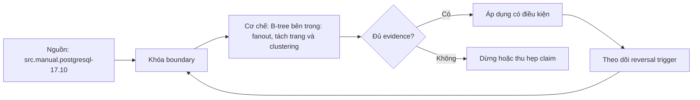

# B-tree bên trong: fanout, tách trang và clustering

> [!abstract] Câu hỏi trung tâm
> Tại sao cây thấp, insert làm thay đổi pages thế nào, delete/update tạo dead space ra sao, và physical clustering cải thiện range I/O nhưng suy giảm theo thời gian thế nào?

## 1. Cây cân bằng theo page

PostgreSQL B-tree gồm metapage, internal pages và leaf pages. Tất cả leaves cùng level; internal entries phân hướng tới child; leaf entries giữ keys + heap TIDs/payload. Sibling links hỗ trợ range traversal và concurrent algorithms.

Search đi root → internal → leaf rồi binary search/page traversal. Cost chiều cao nhỏ vì mỗi page chứa nhiều entries. Nhưng “một triệu keys luôn cao 3–4” không universal: key width, INCLUDE, fillfactor, dedup, page size và version ảnh hưởng.

Đo bằng `bt_metap` level/root và `bt_page_stats`, không suy chỉ từ row count.

## 2. Fanout

Fanout là số child references mỗi internal page, xấp xỉ usable page bytes chia entry size/overhead. Keys hẹp/compression tăng fanout; composite/wide keys giảm. Leaf density khác internal density.

Chiều cao logarithmic theo fanout nhưng root/internal cache thường nóng. Ba levels không nhất thiết ba physical disk reads vì buffers/OS cache.

Estimate fanout là model; pageinspect measurement mới là evidence. Ghi page size, average item size, levels, leaf/internal pages.

## 3. Metapage và levels

Page zero là metapage chứa root block, level và metadata. Level numbering trong `bt_metap` bắt đầu leaf level 0; nếu root level 2 thì đường root→internal→leaf có ba page levels. Phân biệt “level value”, “tree height” và “pages visited”.

Root có thể đổi block sau splits; metapage dẫn current root. Caching fast root/internal implementation details version-sensitive.

Không gọi metapage normal leaf. `pageinspect` privileged.

## 4. Leaf entries và heap TIDs

Leaf key entries tham chiếu heap tuples. Duplicate keys có thể có nhiều TIDs/posting lists qua deduplication trong cases supported. INCLUDE columns nằm leaf, tăng size và không ở internal truncation theo cùng cách.

Index entry không chứa MVCC visibility đầy đủ như heap; index scan thường kiểm heap/visibility map. Dead tuple versions tạo index cleanup work.

Wide key/payload giảm leaf density, tăng pages/height/cache footprint và write cost.

## 5. Search và range scan

Equality descent định leaf; range scan tìm boundary rồi đi sibling leaves. Ordered output là B-tree strength. Multicolumn order/opclass/collation định comparison.

Concurrent splits/deletes cần high keys/right links để search đúng; implementation dùng B-link-tree ideas. Không cần dạy code latch detail nhưng phải hiểu sibling traversal không chứng minh physical contiguity trên disk.

Index order không đồng nghĩa heap order; regular scan có thể fetch scattered heap pages.

## 6. Insert path

Insert descends leaf, locks/modifies page, places entry nếu đủ room. PostgreSQL có pruning/dedup opportunities trước split tùy case. WAL ghi thay đổi. Fillfactor giữ room để giảm immediate splits khi build.

Concurrent inserts có latch/contention at pages; commit/WAL/checkpoints cũng ảnh hưởng throughput. Không quy mọi slowdown cho B-tree hot page.

Entry placement theo key order. Sequential keys đi rightmost leaf path; random keys phân tán leaves.

## 7. Page split

Khi leaf không đủ chỗ sau cleanup/dedup, page split phân entries, tạo sibling và insert separator vào parent. Parent đầy có thể split lan; root split tạo new root và tăng level.

Split gây WAL, page writes và temporary lower density. PostgreSQL B-tree pages thường không merge tự động đơn giản sau delete; empty pages có deletion/recycling mechanisms, nhưng không mô tả “không bao giờ merge” vượt version/source.

Đo split gián tiếp qua page counts/extension/stats/WAL; không suy fragmentation chỉ từ index size.

## 8. Monotonic inserts

Increasing keys tập trung inserts ở rightmost leaf/page/path, có thể tạo contention trong high concurrency. Đồng thời locality/cache tốt và page utilization predictable; thường ít random page touches hơn random keys. Vì vậy không mặc định monotonic throughput kém.

Random keys phân tán contention nhưng chạm nhiều pages, gây cache misses và splits trong interior space; UUID width/order matters. Modern UUID variants/time-order change trade-off.

Thí nghiệm phải tăng concurrency đủ để hot spot xuất hiện; single-thread result không chứng minh contention.

## 9. Random inserts và “fragmentation”

Fragmentation là thuật ngữ mơ hồ. Tách thành leaf density/free space, physical page order vs logical order, number of pages, bloat/dead entries và heap correlation. Random inserts không tự đồng nghĩa bloat.

Measure `pgstatindex`/pageinspect fields, index size, leaf_pages, avg_leaf_density, fragmentation metric if extension defines it, buffers/throughput. Ghi definition.

Không dùng một percentage từ tool mà không biết denominator/version.

## 10. Delete, MVCC và bloat

DELETE/UPDATE tạo dead heap versions/index entries đến khi vacuum/index cleanup. Page pruning/dedup/bottom-up deletion có thể tránh/schedule splits. Bloat là allocated space không hiệu quả cho live workload, không chỉ file không giảm sau delete.

Xóa 50% không đảm bảo index file giảm; space có thể reusable. Size unchanged nhưng future inserts reuse space không giống bloat gây read amplification. Measure density, live/dead, pages read và reuse.

Long transactions/replication slots có thể giữ old versions, cản cleanup. Root cause trước rebuild.

## 11. Deduplication

PostgreSQL B-tree dedup có thể gộp duplicates thành posting list khi supported, tăng density và trì hoãn splits. Nó không áp mọi type/index, nondeterministic collation/composite/include cases có limitations.

Dedup không sửa duplicate business data; chỉ storage optimization. Unique indexes có semantics khác. Measure on/off only in lab.

Suffix truncation giảm internal separator key size, tăng fanout; leaf vẫn cần key/payload đầy đủ.

## 12. Fillfactor

Index fillfactor khi build để leaves không đầy 100%, dành room cho inserts. Lower fillfactor tăng initial size/read footprint nhưng giảm splits cho random/middle inserts. Sequential right-edge behavior có optimization nuances.

Table fillfactor ảnh hưởng HOT; index fillfactor khác. Không copy một value universal. Benchmark write/read/storage.

Changing parameter không compact existing index nếu không rebuild.

## 13. Rebuild và REINDEX

REINDEX rebuild cấu trúc, loại dead space và có thể đổi size/density. Lock/concurrent variants có operational cost, disk/WAL/replication risk. VACUUM cleanup có thể đủ nếu space reusable; rebuild không phải maintenance định kỳ mặc định.

Before/after đo size, levels, density, query buffers, write throughput. Nếu index phình lại, sửa long transaction/vacuum/update pattern.

Rebuild success không chứng minh application benefit nếu working set unchanged.

## 14. CLUSTER và physical correlation

`CLUSTER table USING index` rewrite heap theo index order tại thời điểm chạy, giúp range scans đọc heap pages tuần tự/correlated. Table chỉ có một physical order; cluster theo một index. Operation có lock/disk/WAL trade-offs và ordering không được tự duy trì bởi later writes.

Planner `correlation` statistic ảnh hưởng index scan cost. Sau CLUSTER cần ANALYZE theo workflow. `CLUSTER` không thay ORDER BY contract và không làm heap thành clustered index tự duy trì.

Alternative gồm partitioning, BRIN, periodic rewrite, naturally correlated insert keys. Chọn theo workload.

## 15. Một triệu rows lab

Tạo deterministic table/index, ghi page size, key width, fillfactor. Sau load/ANALYZE, dùng `bt_metap` lấy level/root, `pg_relation_size`, `pgstatindex`/pageinspect density/pages. Giải thích level convention.

Đo point/range plans và buffers; không suy page reads bằng height. Include warm/cold regime.

Không expose production raw pages. Extension permissions/test database.

## 16. Sequential versus random insert lab

Hai tables cùng schema/fillfactor, same rows, controlled concurrency. One uses monotonic keys; other randomized keys with same type/width if possible. Measure rows/s, latency distribution, WAL, index size, leaf density, pages/splits proxy, buffer I/O và contention waits.

Run single-thread và multi-thread. Expected result là measurement, không “sequential chắc chậm”. Randomizing values must not change key width/storage.

Repeat multiple runs/seed; report variance.

## 17. Delete/rebuild lab

Delete same deterministic 50% pattern; VACUUM; measure file size, density, reusable space/query buffers. Then REINDEX in isolated environment; measure same. Distinguish file shrink, reclaim/reuse, logical bloat và performance.

Use no long transactions for baseline, then optional blocker experiment. Rebuild lock/disk constraints documented.

Conclusion must state which metric improved and trade-off.

## 17.1. Kiểm soát thiết kế thí nghiệm

Hai bảng sequential/random phải giống page size, data types, row payload, indexes, fillfactor, autovacuum policy và transaction batch. Random keys không được dùng UUID text rộng trong khi sequential dùng bigint, vì khi đó key width/fanout/WAL cùng thay đổi. Có thể dùng cùng bigint set, chỉ hoán vị insertion order. Chạy với một worker để đo locality/splits và nhiều workers để đo contention; lưu wait events.

Trước mỗi run, xác định cache regime và reset bằng recreate dataset, không chỉ TRUNCATE nếu muốn cấu trúc ban đầu đồng nhất. Thu WAL bytes, index pages/level/density, latency distribution và throughput. Nếu sequential nhanh hơn ở single-thread nhưng chậm hơn ở high concurrency, kết luận phải nêu điều kiện chuyển vùng; nếu không thấy hotspot, không được khẳng định workload quá nhỏ chắc chắn là lý do mà không kiểm concurrency/profile. Thí nghiệm tốt cho phép kết quả trái kỳ vọng mà vẫn hợp lệ.

## 18. Câu hỏi tự kiểm tra

1. `bt_metap.level=2` tương ứng bao nhiêu levels từ root tới leaf?
2. Fanout phụ thuộc entry/page properties nào?
3. Sequential inserts có lợi và hại gì?
4. Vì sao xóa 50% mà file không nhỏ chưa đủ gọi bloat?
5. Deduplication khác business dedup thế nào?
6. CLUSTER có duy trì heap order tự động không?

## 19. Giới hạn và điều chưa cho phép kết luận

- B-tree internals/extensions là PostgreSQL/version-specific.
- Height/fanout không trực tiếp bằng physical I/O do caching.
- Insert order impact phụ thuộc key type, concurrency, WAL/storage/cache.
- Fragmentation/bloat cần metric definition, không một con số mơ hồ.
- Ba lab chưa chạy; measurements thuộc `after-note.md`.

## Reference
1. [[SRC-POSTGRESQL-17-10-MANUAL]] — pageinspect/B-tree inspection và index behavior.
2. [[SRC-ROGOV-POSTGRESQL-14-INTERNALS]] — B-tree search, splits, metapage, dedup và page structure.
3. [[SRC-MASTERING-POSTGRESQL-17-6E]] — index cost, build/rebuild và clustering context.

## Source coverage

| Source slice | Nội dung phải giữ | Vị trí trong note | Trạng thái |
|---|---|---|---|
| [[SRC-POSTGRESQL-17-10-MANUAL]], PDF 488–498, 2888–2910 | index/pageinspect behavior | §§1–17 | Đã giữ privilege/version caveat |
| [[SRC-ROGOV-POSTGRESQL-14-INTERNALS]], PDF 419–458 | B-tree internals, split, dedup | §§1–13 | Đã đối chiếu 17.10 |
| [[SRC-MASTERING-POSTGRESQL-17-6E]], PDF 87–112 | index cost/build/clustering | §§12–17 | Đã gắn measurement |
| Tổng hợp DE-L134 | sequential/random/delete experiments | §§15–17 | Đã bỏ expected-result bias |

## Key takeaways
- B-tree thấp nhờ fanout, nhưng height/page reads không suy chỉ từ row count.
- Splits giữ cân bằng và có WAL/space/contention cost; root split tăng level.
- Sequential keys tập trung right edge nhưng có locality; random keys phân tán và chạm nhiều pages—phải đo.
- Delete, reusable free space, bloat và physical fragmentation là các khái niệm khác.
- CLUSTER tạo physical correlation tại một thời điểm và không tự duy trì.

<!-- ATOMIC-EXECUTION-CAPSULE:START -->

## Execution capsule — kiểm chứng `wiki.database.btree-fanout-splits-clustering`

> [!important] Phân loại mệnh đề
> Với `wiki.database.btree-fanout-splits-clustering`, sơ đồ, ví dụ và artifact về **B-tree bên trong: fanout, tách trang và clustering** là **synthesis để kiểm chứng**; chúng không phải trích dẫn hay case nguyên văn của nguồn.

### Sơ đồ cơ chế và điểm kiểm soát



Đọc sơ đồ `wiki.database.btree-fanout-splits-clustering` từ trái sang phải: source chỉ cung cấp claim ban đầu cho **B-tree bên trong: fanout, tách trang và clustering**; quyết định chỉ được đi tiếp sau khi boundary, evidence và điều kiện đảo quyết định đã hiện hữu.

### Ví dụ làm việc có thể bác bỏ

**Input.** Một đội cần trả lời: “PostgreSQL B-tree giữ cân bằng, tách trang, deduplicate và liên hệ heap clustering thế nào, và thí nghiệm insert/delete được đo đúng ra sao?” cho một phạm vi nhỏ, có owner và deadline rõ.

**Decision.** Đội áp dụng **B-tree bên trong: fanout, tách trang và clustering** trên control và variant chỉ khác một assumption; expected result và hard constraints được khóa trước khi chạy.

**Outcome.** Với `wiki.database.btree-fanout-splits-clustering`, nếu observation vi phạm hard constraint hoặc oracle độc lập không xác nhận **B-tree bên trong: fanout, tách trang và clustering**, đội thu hẹp claim hay đảo quyết định. Nếu đạt, kết luận vẫn kèm scope, version và review date; một lần thành công không được nâng thành quy luật phổ quát.

### Artifact thực thi tối thiểu

```sql
-- Verification harness for: B-tree bên trong: fanout, tách trang và clustering
WITH evidence AS (
    SELECT 'wiki.database.btree-fanout-splits-clustering' AS concept_id,
           'boundary_declared' AS check_name, 1 AS passed
    UNION ALL
    SELECT 'wiki.database.btree-fanout-splits-clustering', 'independent_oracle', 1
    UNION ALL
    SELECT 'wiki.database.btree-fanout-splits-clustering', 'reversal_trigger_recorded', 1
)
SELECT concept_id,
       MIN(passed) AS all_hard_checks_pass,
       COUNT(*) AS evidence_items
FROM evidence
GROUP BY concept_id
HAVING MIN(passed) = 1;
```

Artifact của `wiki.database.btree-fanout-splits-clustering` buộc người dùng ghi boundary, oracle và reversal trigger cho **B-tree bên trong: fanout, tách trang và clustering**. Các giá trị minh họa phải được thay bằng evidence thật trước khi dùng cho quyết định.

### Tự kiểm tra trước khi tái sử dụng

1. Bạn có thể trả lời `PostgreSQL B-tree giữ cân bằng, tách trang, deduplicate và liên hệ heap clustering thế nào, và thí nghiệm insert/delete được đo đúng ra sao?` bằng một câu mà không kéo thêm concept thứ hai không?
2. Source locator nào đỡ cho claim, và phần nào chỉ là synthesis trong note?
3. Observation nào khiến bạn dừng, thu hẹp hoặc đảo quyết định?
4. Artifact nào cho phép một reviewer độc lập tái hiện kết quả?

<!-- ATOMIC-EXECUTION-CAPSULE:END -->
