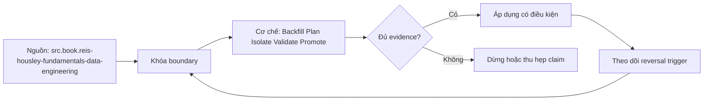

# Backfill Plan Isolate Validate Promote

> [!abstract] Câu hỏi trung tâm
> Một backfill phải được định danh, cô lập, đối soát và promote thế nào để sửa lịch sử mà không phá daily path?

## 1. Backfill là release có phạm vi

Chốt reason, owner, source snapshot hoặc interval, affected entities/partitions, transformation code/config version, expected consumer impact và exit criteria. Một lệnh `--full-refresh` không phải plan. Range phải half-open, timezone rõ và có manifest input. Estimate rows, bytes, source reads, target writes, duration và cost; nêu uncertainty. Nếu source historical semantics khác hiện tại, version contract và mapping thay vì chạy code hôm nay lên dữ liệu cũ rồi gọi đó là sự thật lịch sử.

## 2. Isolate workload và state

Dùng queue, compute pool, schema/table branch, checkpoint và idempotency ledger riêng. Daily path giữ reserved capacity; backfill có admission, concurrency, rate và pause thresholds. Không dùng chung mutable watermark hoặc truncate target hiện hành. Overlap giữa daily và backfill cần ownership per partition hoặc deterministic precedence. Isolation chỉ được chứng minh bằng metrics dưới concurrent load, không bằng tên warehouse hay một tag trong scheduler.

## 3. Build candidate off to side

Backfill ghi immutable candidate partitions hoặc versioned table, không publish từng chunk vào consumer surface. Mỗi chunk có logical identity, input hash, code version, output count/hash và status state machine. Retry same identity phải resume hoặc replace deterministically; same identity different input bị quarantine. Chunk size cân bằng recovery cost và overhead, nhưng boundary phải khớp partition/grain semantics chứ không chỉ tiện cho workers.

## 4. Validate theo nhiều tầng

Đối soát control count, key set, typed row hash và business invariants trên cùng boundary. So candidate với source-of-truth và với current published version để giải thích expected diff. Kiểm schema/contracts, null/duplicate/delete, late corrections và downstream metric deltas. Sampling có risk statement; không dùng sample pass để tuyên bố zero mismatch. Validation output gắn exact candidate fingerprint để approval không bị tái sử dụng sau khi candidate thay đổi.

## 5. Promote rollback cleanup

Promote bằng transaction, atomic swap hoặc catalog pointer theo engine guarantee. Compare-and-set expected parent ngăn lost update. Ghi publication ID, approver, time và downstream invalidation. Rollback repoint previous valid version; không cố tái dựng từ log rời. Giữ old version đủ cho active readers, audit và incident window. Cleanup chỉ sau reachability check, retention và legal policy.

## 6. Game day và communication

Inject worker crash, source throttle, duplicate chunk, validation mismatch, daily-path SLO burn và unknown publish outcome. Stop rules hoạt động trước khi shared system quá tải. Status tách completed compute khỏi validated và promoted. Consumer communication nêu affected period, expected metric movement, publication version và rollback condition. Đạt khi reviewer tái hiện một chunk và reconcile được exact diff.

## 7. Ma trận kiểm chứng từng mệnh đề

Trong `Backfill Plan Isolate Validate Promote`, mỗi claim phải nối được tới input boundary, compiled hoặc executed artifact, trạng thái trước-sau, failure signal và independent oracle. Một command kết thúc với exit code 0 không tự chứng minh dữ liệu đúng, đầy đủ hoặc phù hợp với consumer contract. Protocol nền của bài này: Dựng fixture và project tối thiểu có exact graph/input boundary; chạy command hoặc protocol theo thứ tự, rồi đối soát relation, key set, typed hash và business invariant với full/reference computation.

### 7.1. Backfill probe 1: scope identity, isolation, candidate evidence, promotion và rollback phải nối được

**Mệnh đề cần kiểm.** Backfill probe 1: scope identity, isolation, candidate evidence, promotion và rollback phải nối được.

**Thiết kế phép thử cho `wiki.transformation.backfill-plan-isolate-validate-promote`.** Với `Backfill probe 1: scope identity, isolation, candidate evidence, promotion và rollback phải nối được`, Bắt đầu bằng ca nhỏ nhất có thể làm mệnh đề sai; chỉ thêm dữ liệu sau khi failure signal đã xuất hiện đúng chỗ. Cách này phân biệt một assertion có lực với một bài demo chỉ đi qua happy path. Khóa versions, target và input boundary có liên quan; lưu command, compiled SQL hoặc scheduler context cùng query IDs và timestamps.

**Bằng chứng cần giữ.** Hồ sơ của `Backfill probe 1: scope identity, isolation, candidate evidence, promotion và rollback phải nối được` phải cho thấy: Giữ fixture tối thiểu, raw failure rows và câu lệnh tái hiện; ảnh chụp màn hình một trạng thái xanh không đủ. Nếu sandbox chưa chạy, mục này vẫn là protocol; không đổi expected result thành observation.

### 7.2. Backfill probe 2: scope identity, isolation, candidate evidence, promotion và rollback phải nối được

**Mệnh đề cần kiểm.** Backfill probe 2: scope identity, isolation, candidate evidence, promotion và rollback phải nối được.

**Thiết kế phép thử cho `wiki.transformation.backfill-plan-isolate-validate-promote`.** Với `Backfill probe 2: scope identity, isolation, candidate evidence, promotion và rollback phải nối được`, Giữ nguyên input rồi đổi đúng một tham số cấu hình liên quan. Nếu output đổi theo nhiều hướng cùng lúc, phép thử chưa cô lập được nguyên nhân và phải thu hẹp lại. Khóa versions, target và input boundary có liên quan; lưu command, compiled SQL hoặc scheduler context cùng query IDs và timestamps.

**Bằng chứng cần giữ.** Hồ sơ của `Backfill probe 2: scope identity, isolation, candidate evidence, promotion và rollback phải nối được` phải cho thấy: Báo cả giá trị trước-sau của tham số, compiled artifact và diff đầu ra để reviewer thấy biến nào thực sự đổi. Nếu sandbox chưa chạy, mục này vẫn là protocol; không đổi expected result thành observation.

### 7.3. Backfill probe 3: scope identity, isolation, candidate evidence, promotion và rollback phải nối được

**Mệnh đề cần kiểm.** Backfill probe 3: scope identity, isolation, candidate evidence, promotion và rollback phải nối được.

**Thiết kế phép thử cho `wiki.transformation.backfill-plan-isolate-validate-promote`.** Với `Backfill probe 3: scope identity, isolation, candidate evidence, promotion và rollback phải nối được`, Chạy cặp đối chứng: một input phải được chấp nhận và một input chỉ lệch tại boundary phải bị chặn hoặc được phân loại. Hai ca dùng chung code path để tránh so hai hệ thống khác nhau. Khóa versions, target và input boundary có liên quan; lưu command, compiled SQL hoặc scheduler context cùng query IDs và timestamps.

**Bằng chứng cần giữ.** Hồ sơ của `Backfill probe 3: scope identity, isolation, candidate evidence, promotion và rollback phải nối được` phải cho thấy: Pass khi positive control đi qua, negative control dừng đúng lớp và không có side effect ngoài scope. Nếu sandbox chưa chạy, mục này vẫn là protocol; không đổi expected result thành observation.

### 7.4. Backfill probe 4: scope identity, isolation, candidate evidence, promotion và rollback phải nối được

**Mệnh đề cần kiểm.** Backfill probe 4: scope identity, isolation, candidate evidence, promotion và rollback phải nối được.

**Thiết kế phép thử cho `wiki.transformation.backfill-plan-isolate-validate-promote`.** Với `Backfill probe 4: scope identity, isolation, candidate evidence, promotion và rollback phải nối được`, Đặt kill point ngay trước và ngay sau durable boundary. So trạng thái sau restart để biết hệ thống tạo replay có kiểm soát, silent gap hay một trạng thái nửa vời mà dashboard không báo. Khóa versions, target và input boundary có liên quan; lưu command, compiled SQL hoặc scheduler context cùng query IDs và timestamps.

**Bằng chứng cần giữ.** Hồ sơ của `Backfill probe 4: scope identity, isolation, candidate evidence, promotion và rollback phải nối được` phải cho thấy: Run ledger phải cho biết commit/checkpoint nào bền vững; sau rerun, key set và side-effect ledger cùng hội tụ. Nếu sandbox chưa chạy, mục này vẫn là protocol; không đổi expected result thành observation.

### 7.5. Backfill probe 5: scope identity, isolation, candidate evidence, promotion và rollback phải nối được

**Mệnh đề cần kiểm.** Backfill probe 5: scope identity, isolation, candidate evidence, promotion và rollback phải nối được.

**Thiết kế phép thử cho `wiki.transformation.backfill-plan-isolate-validate-promote`.** Với `Backfill probe 5: scope identity, isolation, candidate evidence, promotion và rollback phải nối được`, Đảo thứ tự input và thay concurrency nhưng giữ logical population. Kết quả khác nhau cho thấy thiết kế đang phụ thuộc physical order hoặc race thay vì contract đã công bố. Khóa versions, target và input boundary có liên quan; lưu command, compiled SQL hoặc scheduler context cùng query IDs và timestamps.

**Bằng chứng cần giữ.** Hồ sơ của `Backfill probe 5: scope identity, isolation, candidate evidence, promotion và rollback phải nối được` phải cho thấy: Hash chuẩn hóa và business totals phải giống nhau giữa các thứ tự; chênh lệch được giữ như finding, không làm tròn mất. Nếu sandbox chưa chạy, mục này vẫn là protocol; không đổi expected result thành observation.

### 7.6. Backfill probe 6: scope identity, isolation, candidate evidence, promotion và rollback phải nối được

**Mệnh đề cần kiểm.** Backfill probe 6: scope identity, isolation, candidate evidence, promotion và rollback phải nối được.

**Thiết kế phép thử cho `wiki.transformation.backfill-plan-isolate-validate-promote`.** Với `Backfill probe 6: scope identity, isolation, candidate evidence, promotion và rollback phải nối được`, Cho cùng logical identity xuất hiện hai lần: trước hết cùng payload, sau đó payload khác. Trường hợp đầu phải hội tụ; trường hợp sau phải lộ collision thay vì âm thầm chọn một bản. Khóa versions, target và input boundary có liên quan; lưu command, compiled SQL hoặc scheduler context cùng query IDs và timestamps.

**Bằng chứng cần giữ.** Hồ sơ của `Backfill probe 6: scope identity, isolation, candidate evidence, promotion và rollback phải nối được` phải cho thấy: Same-content replay được đếm nhưng không nhân state; different-content collision có reason code và đường xử lý riêng. Nếu sandbox chưa chạy, mục này vẫn là protocol; không đổi expected result thành observation.

### 7.7. Backfill probe 7: scope identity, isolation, candidate evidence, promotion và rollback phải nối được

**Mệnh đề cần kiểm.** Backfill probe 7: scope identity, isolation, candidate evidence, promotion và rollback phải nối được.

**Thiết kế phép thử cho `wiki.transformation.backfill-plan-isolate-validate-promote`.** Với `Backfill probe 7: scope identity, isolation, candidate evidence, promotion và rollback phải nối được`, Mở rộng fixture bằng một record tới trễ ngay trong horizon và một record nằm ngoài horizon. Ghi rõ record nào được sửa, record nào bị loại và metric nào khiến operator biết có mất coverage. Khóa versions, target và input boundary có liên quan; lưu command, compiled SQL hoặc scheduler context cùng query IDs và timestamps.

**Bằng chứng cần giữ.** Hồ sơ của `Backfill probe 7: scope identity, isolation, candidate evidence, promotion và rollback phải nối được` phải cho thấy: Evidence ghi accepted-late, rejected-late và oldest outstanding timestamp; thiếu một nhóm được báo là coverage gap. Nếu sandbox chưa chạy, mục này vẫn là protocol; không đổi expected result thành observation.

### 7.8. Backfill probe 8: scope identity, isolation, candidate evidence, promotion và rollback phải nối được

**Mệnh đề cần kiểm.** Backfill probe 8: scope identity, isolation, candidate evidence, promotion và rollback phải nối được.

**Thiết kế phép thử cho `wiki.transformation.backfill-plan-isolate-validate-promote`.** Với `Backfill probe 8: scope identity, isolation, candidate evidence, promotion và rollback phải nối được`, Dùng một schema change tương thích và một thay đổi phá vỡ key, type hoặc meaning. Kết quả phải chỉ ra khác biệt giữa parse được, chạy được và vẫn giữ đúng semantics. Khóa versions, target và input boundary có liên quan; lưu command, compiled SQL hoặc scheduler context cùng query IDs và timestamps.

**Bằng chứng cần giữ.** Hồ sơ của `Backfill probe 8: scope identity, isolation, candidate evidence, promotion và rollback phải nối được` phải cho thấy: Lưu schema trước-sau, classification, compiled SQL và target state; một migration chạy xong nhưng đổi meaning vẫn fail. Nếu sandbox chưa chạy, mục này vẫn là protocol; không đổi expected result thành observation.

### 7.9. Backfill probe 9: scope identity, isolation, candidate evidence, promotion và rollback phải nối được

**Mệnh đề cần kiểm.** Backfill probe 9: scope identity, isolation, candidate evidence, promotion và rollback phải nối được.

**Thiết kế phép thử cho `wiki.transformation.backfill-plan-isolate-validate-promote`.** Với `Backfill probe 9: scope identity, isolation, candidate evidence, promotion và rollback phải nối được`, Tạo bảng rỗng, bảng một row và bảng có duplicate bù cho missing row. Đây là ba ca dễ làm count hoặc aggregate xanh dù invariant thực tế đã hỏng. Khóa versions, target và input boundary có liên quan; lưu command, compiled SQL hoặc scheduler context cùng query IDs và timestamps.

**Bằng chứng cần giữ.** Hồ sơ của `Backfill probe 9: scope identity, isolation, candidate evidence, promotion và rollback phải nối được` phải cho thấy: Oracle so count, key multiset và typed hashes. Ca missing-plus-duplicate phải bị phát hiện dù tổng row count không đổi. Nếu sandbox chưa chạy, mục này vẫn là protocol; không đổi expected result thành observation.

### 7.10. Backfill probe 10: scope identity, isolation, candidate evidence, promotion và rollback phải nối được

**Mệnh đề cần kiểm.** Backfill probe 10: scope identity, isolation, candidate evidence, promotion và rollback phải nối được.

**Thiết kế phép thử cho `wiki.transformation.backfill-plan-isolate-validate-promote`.** Với `Backfill probe 10: scope identity, isolation, candidate evidence, promotion và rollback phải nối được`, Cho reviewer chỉ artifacts, không cho xem lời giải thích của tác giả. Nếu họ không dựng lại được input, decision và diff thì evidence package chưa đủ để bàn giao. Khóa versions, target và input boundary có liên quan; lưu command, compiled SQL hoặc scheduler context cùng query IDs và timestamps.

**Bằng chứng cần giữ.** Hồ sơ của `Backfill probe 10: scope identity, isolation, candidate evidence, promotion và rollback phải nối được` phải cho thấy: Artifact package đạt khi reviewer tái hiện đúng diff và chỉ ra được limitation mà không cần hỏi tác giả về state ẩn. Nếu sandbox chưa chạy, mục này vẫn là protocol; không đổi expected result thành observation.

### 7.11. Backfill probe 11: scope identity, isolation, candidate evidence, promotion và rollback phải nối được

**Mệnh đề cần kiểm.** Backfill probe 11: scope identity, isolation, candidate evidence, promotion và rollback phải nối được.

**Thiết kế phép thử cho `wiki.transformation.backfill-plan-isolate-validate-promote`.** Với `Backfill probe 11: scope identity, isolation, candidate evidence, promotion và rollback phải nối được`, So output với một cách tính độc lập không tái sử dụng macro, filter hoặc intermediate relation đang được kiểm. Hai phép tính dùng chung lỗi chỉ tạo sự đồng thuận giả. Khóa versions, target và input boundary có liên quan; lưu command, compiled SQL hoặc scheduler context cùng query IDs và timestamps.

**Bằng chứng cần giữ.** Hồ sơ của `Backfill probe 11: scope identity, isolation, candidate evidence, promotion và rollback phải nối được` phải cho thấy: Independent result phải khớp ở key/grain đã định; nếu chỉ khớp aggregate cao hơn thì drill-down chưa hoàn tất. Nếu sandbox chưa chạy, mục này vẫn là protocol; không đổi expected result thành observation.

### 7.12. Backfill probe 12: scope identity, isolation, candidate evidence, promotion và rollback phải nối được

**Mệnh đề cần kiểm.** Backfill probe 12: scope identity, isolation, candidate evidence, promotion và rollback phải nối được.

**Thiết kế phép thử cho `wiki.transformation.backfill-plan-isolate-validate-promote`.** Với `Backfill probe 12: scope identity, isolation, candidate evidence, promotion và rollback phải nối được`, Thử trên hai scope: selection hẹp dùng trong CI và population đầy đủ dùng khi phát hành. Ghi phần coverage bị bỏ qua; tốc độ của CI không được biến thành tuyên bố kiểm toàn bộ dữ liệu. Khóa versions, target và input boundary có liên quan; lưu command, compiled SQL hoặc scheduler context cùng query IDs và timestamps.

**Bằng chứng cần giữ.** Hồ sơ của `Backfill probe 12: scope identity, isolation, candidate evidence, promotion và rollback phải nối được` phải cho thấy: Kết quả nêu numerator, denominator và excluded nodes/partitions; không dùng từ `all` khi selection không phủ toàn graph. Nếu sandbox chưa chạy, mục này vẫn là protocol; không đổi expected result thành observation.

### 7.13. Backfill probe 13: scope identity, isolation, candidate evidence, promotion và rollback phải nối được

**Mệnh đề cần kiểm.** Backfill probe 13: scope identity, isolation, candidate evidence, promotion và rollback phải nối được.

**Thiết kế phép thử cho `wiki.transformation.backfill-plan-isolate-validate-promote`.** Với `Backfill probe 13: scope identity, isolation, candidate evidence, promotion và rollback phải nối được`, Đẩy một giá trị tới sát giới hạn precision, timezone, partition hoặc threshold. Boundary phải được viết half-open hay inclusive rõ ràng, không suy từ một ví dụ ở giữa khoảng. Khóa versions, target và input boundary có liên quan; lưu command, compiled SQL hoặc scheduler context cùng query IDs và timestamps.

**Bằng chứng cần giữ.** Hồ sơ của `Backfill probe 13: scope identity, isolation, candidate evidence, promotion và rollback phải nối được` phải cho thấy: Hai phía của boundary đều có expected result và raw observation. Sai đúng một đơn vị phải làm test fail có chẩn đoán. Nếu sandbox chưa chạy, mục này vẫn là protocol; không đổi expected result thành observation.

### 7.14. Backfill probe 14: scope identity, isolation, candidate evidence, promotion và rollback phải nối được

**Mệnh đề cần kiểm.** Backfill probe 14: scope identity, isolation, candidate evidence, promotion và rollback phải nối được.

**Thiết kế phép thử cho `wiki.transformation.backfill-plan-isolate-validate-promote`.** Với `Backfill probe 14: scope identity, isolation, candidate evidence, promotion và rollback phải nối được`, Thay constraint quan trọng nhất bằng giá trị đủ để decision phải đảo. Nếu thiết kế vẫn đưa cùng lựa chọn mà không giải thích, decision rule đang là khẩu hiệu chứ chưa phải rule. Khóa versions, target và input boundary có liên quan; lưu command, compiled SQL hoặc scheduler context cùng query IDs và timestamps.

**Bằng chứng cần giữ.** Hồ sơ của `Backfill probe 14: scope identity, isolation, candidate evidence, promotion và rollback phải nối được` phải cho thấy: ADR hoặc rule chỉ pass khi changed constraint tạo lựa chọn mới đúng như đã dự báo và reversal threshold được lưu. Nếu sandbox chưa chạy, mục này vẫn là protocol; không đổi expected result thành observation.

### 7.15. Backfill probe 15: scope identity, isolation, candidate evidence, promotion và rollback phải nối được

**Mệnh đề cần kiểm.** Backfill probe 15: scope identity, isolation, candidate evidence, promotion và rollback phải nối được.

**Thiết kế phép thử cho `wiki.transformation.backfill-plan-isolate-validate-promote`.** Với `Backfill probe 15: scope identity, isolation, candidate evidence, promotion và rollback phải nối được`, Lặp lại phép thử từ môi trường sạch bằng seed và versions đã lưu. Một kết quả chỉ tái hiện được trên workspace của tác giả không đủ làm release evidence. Khóa versions, target và input boundary có liên quan; lưu command, compiled SQL hoặc scheduler context cùng query IDs và timestamps.

**Bằng chứng cần giữ.** Hồ sơ của `Backfill probe 15: scope identity, isolation, candidate evidence, promotion và rollback phải nối được` phải cho thấy: Lần chạy sạch phải tạo cùng canonical state; khác biệt do timestamp, file order hoặc generated IDs phải được loại hoặc giải thích. Nếu sandbox chưa chạy, mục này vẫn là protocol; không đổi expected result thành observation.

## 8. Quy trình phản biện

Áp dụng sáu bước sau cho `Backfill Plan Isolate Validate Promote`; nếu một bước không phù hợp, ghi lý do thay vì bỏ qua im lặng.

1. Với `wiki.transformation.backfill-plan-isolate-validate-promote`, chốt grain, identity, time boundary và consumer-visible invariant trước câu lệnh.
2. Tách parse/compile state, warehouse execution và publication state.
3. Pin dbt core, adapter, warehouse hoặc orchestrator version cùng configuration có ảnh hưởng.
4. Kiểm correctness bằng key set, typed hash và business invariant trước performance.
5. Chạy negative case, kill point hoặc changed assumption; green path đơn lẻ không đủ.
6. Phân loại source fact, project convention, curriculum synthesis và untested hypothesis.

## 9. Câu hỏi tự kiểm tra

1. `Backfill probe 1: scope identity, isolation, candidate evidence, promotion và rollback phải nối được` sẽ thất bại trước tiên ở boundary nào?
2. Với `Backfill probe 2: scope identity, isolation, candidate evidence, promotion và rollback phải nối được`, artifact nào là nguồn bằng chứng mạnh nhất?
3. Counterexample nhỏ nhất cho `Backfill probe 3: scope identity, isolation, candidate evidence, promotion và rollback phải nối được` gồm những row hoặc state nào?
4. `Backfill probe 4: scope identity, isolation, candidate evidence, promotion và rollback phải nối được` có thể xanh giả trong tình huống nào?
5. Version, adapter, timezone hoặc state nào làm `Backfill probe 5: scope identity, isolation, candidate evidence, promotion và rollback phải nối được` đổi nghĩa?
6. Phần nào của `Backfill probe 6: scope identity, isolation, candidate evidence, promotion và rollback phải nối được` hiện mới là protocol, chưa phải observation?

## 10. Giới hạn và điều chưa cho phép kết luận

- Lab của `Backfill Plan Isolate Validate Promote` chưa chạy trên warehouse, dbt project hoặc orchestrator production; các mục kiểm chứng vẫn là protocol và expected evidence.
- Các claim gắn `wiki.transformation.backfill-plan-isolate-validate-promote` phải kiểm lại theo dbt core, adapter, warehouse và scheduler version được chọn.
- Decision matrix, failure campaign và ngưỡng review là curriculum synthesis, không phải cam kết của vendor.
- Note giữ trạng thái `review` cho tới khi chủ dự án duyệt semantic meaning và learner artifact.

## Reference
1. [[SRC-REIS-HOUSLEY-FUNDAMENTALS-DATA-ENGINEERING]]
2. [[SRC-KLEPPMANN-DDIA-1E]]
3. [[SRC-DBT-INCREMENTAL-MODELS]]

## Source coverage

| Source slice | Nội dung sử dụng | Trạng thái |
|---|---|---|
| [[SRC-REIS-HOUSLEY-FUNDAMENTALS-DATA-ENGINEERING]] | Cơ chế, contract hoặc giới hạn liên quan | Đã đọc locator; claim theo version/configuration |
| [[SRC-KLEPPMANN-DDIA-1E]] | Cơ chế, contract hoặc giới hạn liên quan | Đã đọc locator; claim theo version/configuration |
| [[SRC-DBT-INCREMENTAL-MODELS]] | Cơ chế, contract hoặc giới hạn liên quan | Đã đọc locator; claim theo version/configuration |

## Key takeaways
- Backfill an toàn được build như candidate version cô lập, validated trên exact boundary rồi atomic promote; chạy lại lịch sử trực tiếp vào production target là failure mode.
- Với `Backfill Plan Isolate Validate Promote`, compiled intent và observed state phải được lưu tách biệt; trộn hai lớp sẽ che failure window.
- Oracle của bài phải bám câu hỏi trung tâm: Một backfill phải được định danh, cô lập, đối soát và promote thế nào để sửa lịch sử mà không phá daily path?
- Các source IDs `src.book.reis-housley-fundamentals-data-engineering, src.book.kleppmann-ddia.1e, src.web.dbt-incremental-models` đặt ranh giới cho claim; phần synthesis không được gán nguyên văn cho vendor.
- Trước khi lab chạy, note này là giáo trình đã kiểm cấu trúc và provenance, chưa phải chứng nhận production.

<!-- ATOMIC-EXECUTION-CAPSULE:START -->

## Execution capsule: kiểm chứng `wiki.transformation.backfill-plan-isolate-validate-promote`

> [!important] Phân loại mệnh đề
> Với `wiki.transformation.backfill-plan-isolate-validate-promote`, sơ đồ, ví dụ và artifact về **Backfill Plan Isolate Validate Promote** là **synthesis để kiểm chứng**; chúng không phải trích dẫn hay case nguyên văn của nguồn.

### Sơ đồ cơ chế và điểm kiểm soát



Đọc sơ đồ `wiki.transformation.backfill-plan-isolate-validate-promote` từ trái sang phải: source chỉ cung cấp claim ban đầu cho **Backfill Plan Isolate Validate Promote**; quyết định chỉ được đi tiếp sau khi boundary, evidence và điều kiện đảo quyết định đã hiện hữu.

### Artifact thực thi tối thiểu

```sql
-- Verification harness for: Backfill Plan Isolate Validate Promote
WITH evidence AS (
    SELECT 'wiki.transformation.backfill-plan-isolate-validate-promote' AS concept_id,
           'boundary_declared' AS check_name, 1 AS passed
    UNION ALL
    SELECT 'wiki.transformation.backfill-plan-isolate-validate-promote', 'independent_oracle', 1
    UNION ALL
    SELECT 'wiki.transformation.backfill-plan-isolate-validate-promote', 'reversal_trigger_recorded', 1
)
SELECT concept_id,
       MIN(passed) AS all_hard_checks_pass,
       COUNT(*) AS evidence_items
FROM evidence
GROUP BY concept_id
HAVING MIN(passed) = 1;
```

Artifact của `wiki.transformation.backfill-plan-isolate-validate-promote` buộc người dùng ghi boundary, oracle và reversal trigger cho **Backfill Plan Isolate Validate Promote**. Các giá trị minh họa phải được thay bằng evidence thật trước khi dùng cho quyết định.

### Tự kiểm tra trước khi tái sử dụng

1. Bạn có thể trả lời `Một backfill phải được định danh, cô lập, đối soát và promote thế nào để sửa lịch sử mà không phá daily path?` bằng một câu mà không kéo thêm concept thứ hai không?
2. Source locator nào đỡ cho claim, và phần nào chỉ là synthesis trong note?
3. Observation nào khiến bạn dừng, thu hẹp hoặc đảo quyết định?
4. Artifact nào cho phép một reviewer độc lập tái hiện kết quả?

<!-- ATOMIC-EXECUTION-CAPSULE:END -->
