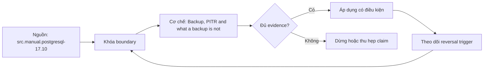

# Backup, PITR and what a backup is not

> [!abstract] Câu hỏi trung tâm
> Backup logical, backup vật lý và continuous archiving đáp ứng RPO/RTO nào, và điều kiện nào khiến một file sao lưu chưa đủ để gọi là khả năng khôi phục?

## 1. Backup là một chuỗi kiểm soát

Backup không phải file đơn lẻ mà là chuỗi capture, truyền, lưu, kiểm toàn vẹn, giữ phiên bản, khôi phục và đối soát. RPO quy định điểm dữ liệu cũ nhất chấp nhận được sau sự cố; RTO quy định thời gian đưa dịch vụ về trạng thái đủ dùng. Cả hai là quyết định nghiệp vụ theo từng dataset/service tier. Tần suất backup không tự bằng RPO nếu WAL/archive, upload hoặc catalog có khoảng trống.

## 2. Logical backup

pg_dump tạo biểu diễn logic có thể nạp lại, thường thuận lợi khi chuyển phiên bản/kiến trúc và khôi phục chọn lọc. Nó không chứa mọi cluster-global object nếu chỉ dump một database; role và tablespace cần pg_dumpall globals hoặc quản lý riêng. Restore cần users, extensions, collation/locale, permissions và statistics. Dump nhất quán theo snapshot nhưng nhiều database dump riêng không có chung snapshot.

## 3. Physical backup

Physical backup giữ data files/WAL ở mức cluster, nhanh hơn cho database lớn và cần tính tương thích version/platform nghiêm ngặt. Copy data directory tùy tiện khi server đang chạy không tạo consistent backup; cần shutdown hoặc snapshot/base-backup protocol đúng. Một table file riêng không đủ vì transaction status và catalog/WAL liên kết toàn cluster.

## 4. PITR

Point-in-time recovery kết hợp base backup với chuỗi WAL liên tục rồi replay đến time, transaction ID, named restore point hoặc LSN mục tiêu. Recovery target phải dừng trước destructive transaction nhưng timestamp từ incident report có thể lệch clock/timezone. Phải giữ WAL từ lúc base backup bắt đầu đến target; một missing segment phá chuỗi. Timeline history quan trọng sau promotion/recovery.

## 5. Những gì nằm ngoài data pages

Kế hoạch phải quản lý cấu hình, secrets/keys, roles, certificates, extensions/binaries, tablespaces, scheduler jobs, DNS/service discovery, monitoring và runbook/owners. Không nên nhét plaintext secret vào cùng backup nếu policy cấm; cần backup metadata/reference và quy trình cấp lại. Encryption key mất làm backup đúng checksum nhưng không đọc được.

## 6. Retention và bất biến

Retention gồm full/base backups, WAL, catalog và keys, theo legal/deletion requirements. 3-2-1 chỉ là heuristic; threat model cần immutable/offline copy, account separation và restore credentials. Replica không thay backup vì delete/ransomware/operator error được replicate. Backup thành công chỉ chứng minh write path, không chứng minh restore path.

## 7. Ma trận kiểm chứng từng mệnh đề

Mỗi mệnh đề dưới đây phải được kiểm bằng một schedule hoặc phép đo có điều kiện đầu vào rõ ràng. Không dùng một ảnh màn hình cuối làm bằng chứng thay cho lệnh, timestamp, cấu hình và raw output.

### 7.1. logical dump restore cần roles/extensions tồn tại hoặc được tái tạo

**Giả thuyết.** logical dump restore cần roles/extensions tồn tại hoặc được tái tạo. **Cách kiểm.** Cố định phiên bản database, cấu hình, dữ liệu seed và thứ tự thao tác; ghi operation ID, transaction/session ID, thời điểm bắt đầu–kết thúc và trạng thái commit/abort. **Đối chứng.** Chạy một biến thể bỏ đúng yếu tố đang xét, không đổi đồng thời nhiều tham số. **Bằng chứng đạt cho `wiki.database.backup-pitr-boundaries`.** Lưu command/script, raw result và counter trước–sau; giải thích cơ chế tạo ra quan sát. Một lần không tái hiện không đủ bác bỏ hiện tượng concurrency; cần barrier xác định và lặp có giới hạn.

### 7.2. pg_dump một database không bao gồm toàn bộ cluster globals

**Giả thuyết.** pg_dump một database không bao gồm toàn bộ cluster globals. **Cách kiểm.** Cố định phiên bản database, cấu hình, dữ liệu seed và thứ tự thao tác; ghi operation ID, transaction/session ID, thời điểm bắt đầu–kết thúc và trạng thái commit/abort. **Đối chứng.** Chạy một biến thể bỏ đúng yếu tố đang xét, không đổi đồng thời nhiều tham số. **Bằng chứng đạt cho `wiki.database.backup-pitr-boundaries`.** Lưu command/script, raw result và counter trước–sau; giải thích cơ chế tạo ra quan sát. Một lần không tái hiện không đủ bác bỏ hiện tượng concurrency; cần barrier xác định và lặp có giới hạn.

### 7.3. parallel dump/restore đổi throughput nhưng vẫn cần đo restore critical path

**Giả thuyết.** parallel dump/restore đổi throughput nhưng vẫn cần đo restore critical path. **Cách kiểm.** Cố định phiên bản database, cấu hình, dữ liệu seed và thứ tự thao tác; ghi operation ID, transaction/session ID, thời điểm bắt đầu–kết thúc và trạng thái commit/abort. **Đối chứng.** Chạy một biến thể bỏ đúng yếu tố đang xét, không đổi đồng thời nhiều tham số. **Bằng chứng đạt cho `wiki.database.backup-pitr-boundaries`.** Lưu command/script, raw result và counter trước–sau; giải thích cơ chế tạo ra quan sát. Một lần không tái hiện không đủ bác bỏ hiện tượng concurrency; cần barrier xác định và lặp có giới hạn.

### 7.4. filesystem copy khi database đang chạy có thể không nhất quán nếu không dùng supported snapshot protocol

**Giả thuyết.** filesystem copy khi database đang chạy có thể không nhất quán nếu không dùng supported snapshot protocol. **Cách kiểm.** Cố định phiên bản database, cấu hình, dữ liệu seed và thứ tự thao tác; ghi operation ID, transaction/session ID, thời điểm bắt đầu–kết thúc và trạng thái commit/abort. **Đối chứng.** Chạy một biến thể bỏ đúng yếu tố đang xét, không đổi đồng thời nhiều tham số. **Bằng chứng đạt cho `wiki.database.backup-pitr-boundaries`.** Lưu command/script, raw result và counter trước–sau; giải thích cơ chế tạo ra quan sát. Một lần không tái hiện không đủ bác bỏ hiện tượng concurrency; cần barrier xác định và lặp có giới hạn.

### 7.5. physical backup gắn chặt hơn với major version và architecture

**Giả thuyết.** physical backup gắn chặt hơn với major version và architecture. **Cách kiểm.** Cố định phiên bản database, cấu hình, dữ liệu seed và thứ tự thao tác; ghi operation ID, transaction/session ID, thời điểm bắt đầu–kết thúc và trạng thái commit/abort. **Đối chứng.** Chạy một biến thể bỏ đúng yếu tố đang xét, không đổi đồng thời nhiều tham số. **Bằng chứng đạt cho `wiki.database.backup-pitr-boundaries`.** Lưu command/script, raw result và counter trước–sau; giải thích cơ chế tạo ra quan sát. Một lần không tái hiện không đủ bác bỏ hiện tượng concurrency; cần barrier xác định và lặp có giới hạn.

### 7.6. PITR cần base backup cộng chuỗi WAL không đứt

**Giả thuyết.** PITR cần base backup cộng chuỗi WAL không đứt. **Cách kiểm.** Cố định phiên bản database, cấu hình, dữ liệu seed và thứ tự thao tác; ghi operation ID, transaction/session ID, thời điểm bắt đầu–kết thúc và trạng thái commit/abort. **Đối chứng.** Chạy một biến thể bỏ đúng yếu tố đang xét, không đổi đồng thời nhiều tham số. **Bằng chứng đạt cho `wiki.database.backup-pitr-boundaries`.** Lưu command/script, raw result và counter trước–sau; giải thích cơ chế tạo ra quan sát. Một lần không tái hiện không đủ bác bỏ hiện tượng concurrency; cần barrier xác định và lặp có giới hạn.

### 7.7. restore target time có rủi ro timezone/clock và transaction boundary

**Giả thuyết.** restore target time có rủi ro timezone/clock và transaction boundary. **Cách kiểm.** Cố định phiên bản database, cấu hình, dữ liệu seed và thứ tự thao tác; ghi operation ID, transaction/session ID, thời điểm bắt đầu–kết thúc và trạng thái commit/abort. **Đối chứng.** Chạy một biến thể bỏ đúng yếu tố đang xét, không đổi đồng thời nhiều tham số. **Bằng chứng đạt cho `wiki.database.backup-pitr-boundaries`.** Lưu command/script, raw result và counter trước–sau; giải thích cơ chế tạo ra quan sát. Một lần không tái hiện không đủ bác bỏ hiện tượng concurrency; cần barrier xác định và lặp có giới hạn.

### 7.8. WAL retention ngắn hơn khoảng full backup làm mất restore window

**Giả thuyết.** WAL retention ngắn hơn khoảng full backup làm mất restore window. **Cách kiểm.** Cố định phiên bản database, cấu hình, dữ liệu seed và thứ tự thao tác; ghi operation ID, transaction/session ID, thời điểm bắt đầu–kết thúc và trạng thái commit/abort. **Đối chứng.** Chạy một biến thể bỏ đúng yếu tố đang xét, không đổi đồng thời nhiều tham số. **Bằng chứng đạt cho `wiki.database.backup-pitr-boundaries`.** Lưu command/script, raw result và counter trước–sau; giải thích cơ chế tạo ra quan sát. Một lần không tái hiện không đủ bác bỏ hiện tượng concurrency; cần barrier xác định và lặp có giới hạn.

### 7.9. replica truyền nhầm DELETE nên không phải backup

**Giả thuyết.** replica truyền nhầm DELETE nên không phải backup. **Cách kiểm.** Cố định phiên bản database, cấu hình, dữ liệu seed và thứ tự thao tác; ghi operation ID, transaction/session ID, thời điểm bắt đầu–kết thúc và trạng thái commit/abort. **Đối chứng.** Chạy một biến thể bỏ đúng yếu tố đang xét, không đổi đồng thời nhiều tham số. **Bằng chứng đạt cho `wiki.database.backup-pitr-boundaries`.** Lưu command/script, raw result và counter trước–sau; giải thích cơ chế tạo ra quan sát. Một lần không tái hiện không đủ bác bỏ hiện tượng concurrency; cần barrier xác định và lặp có giới hạn.

### 7.10. backup encryption cần key recovery tách biệt

**Giả thuyết.** backup encryption cần key recovery tách biệt. **Cách kiểm.** Cố định phiên bản database, cấu hình, dữ liệu seed và thứ tự thao tác; ghi operation ID, transaction/session ID, thời điểm bắt đầu–kết thúc và trạng thái commit/abort. **Đối chứng.** Chạy một biến thể bỏ đúng yếu tố đang xét, không đổi đồng thời nhiều tham số. **Bằng chứng đạt cho `wiki.database.backup-pitr-boundaries`.** Lưu command/script, raw result và counter trước–sau; giải thích cơ chế tạo ra quan sát. Một lần không tái hiện không đủ bác bỏ hiện tượng concurrency; cần barrier xác định và lặp có giới hạn.

### 7.11. checksum đúng không chứng minh logical completeness

**Giả thuyết.** checksum đúng không chứng minh logical completeness. **Cách kiểm.** Cố định phiên bản database, cấu hình, dữ liệu seed và thứ tự thao tác; ghi operation ID, transaction/session ID, thời điểm bắt đầu–kết thúc và trạng thái commit/abort. **Đối chứng.** Chạy một biến thể bỏ đúng yếu tố đang xét, không đổi đồng thời nhiều tham số. **Bằng chứng đạt cho `wiki.database.backup-pitr-boundaries`.** Lưu command/script, raw result và counter trước–sau; giải thích cơ chế tạo ra quan sát. Một lần không tái hiện không đủ bác bỏ hiện tượng concurrency; cần barrier xác định và lặp có giới hạn.

### 7.12. configuration/roles/extensions/tablespaces phải nằm trong inventory

**Giả thuyết.** configuration/roles/extensions/tablespaces phải nằm trong inventory. **Cách kiểm.** Cố định phiên bản database, cấu hình, dữ liệu seed và thứ tự thao tác; ghi operation ID, transaction/session ID, thời điểm bắt đầu–kết thúc và trạng thái commit/abort. **Đối chứng.** Chạy một biến thể bỏ đúng yếu tố đang xét, không đổi đồng thời nhiều tham số. **Bằng chứng đạt cho `wiki.database.backup-pitr-boundaries`.** Lưu command/script, raw result và counter trước–sau; giải thích cơ chế tạo ra quan sát. Một lần không tái hiện không đủ bác bỏ hiện tượng concurrency; cần barrier xác định và lặp có giới hạn.

### 7.13. RPO/RTO phải phân tầng theo nghiệp vụ thay vì một số toàn công ty

**Giả thuyết.** RPO/RTO phải phân tầng theo nghiệp vụ thay vì một số toàn công ty. **Cách kiểm.** Cố định phiên bản database, cấu hình, dữ liệu seed và thứ tự thao tác; ghi operation ID, transaction/session ID, thời điểm bắt đầu–kết thúc và trạng thái commit/abort. **Đối chứng.** Chạy một biến thể bỏ đúng yếu tố đang xét, không đổi đồng thời nhiều tham số. **Bằng chứng đạt cho `wiki.database.backup-pitr-boundaries`.** Lưu command/script, raw result và counter trước–sau; giải thích cơ chế tạo ra quan sát. Một lần không tái hiện không đủ bác bỏ hiện tượng concurrency; cần barrier xác định và lặp có giới hạn.

### 7.14. retention phải tương thích quyền xóa và legal hold

**Giả thuyết.** retention phải tương thích quyền xóa và legal hold. **Cách kiểm.** Cố định phiên bản database, cấu hình, dữ liệu seed và thứ tự thao tác; ghi operation ID, transaction/session ID, thời điểm bắt đầu–kết thúc và trạng thái commit/abort. **Đối chứng.** Chạy một biến thể bỏ đúng yếu tố đang xét, không đổi đồng thời nhiều tham số. **Bằng chứng đạt cho `wiki.database.backup-pitr-boundaries`.** Lưu command/script, raw result và counter trước–sau; giải thích cơ chế tạo ra quan sát. Một lần không tái hiện không đủ bác bỏ hiện tượng concurrency; cần barrier xác định và lặp có giới hạn.

### 7.15. backup chưa restore và reconcile chưa chứng minh recoverability

**Giả thuyết.** backup chưa restore và reconcile chưa chứng minh recoverability. **Cách kiểm.** Cố định phiên bản database, cấu hình, dữ liệu seed và thứ tự thao tác; ghi operation ID, transaction/session ID, thời điểm bắt đầu–kết thúc và trạng thái commit/abort. **Đối chứng.** Chạy một biến thể bỏ đúng yếu tố đang xét, không đổi đồng thời nhiều tham số. **Bằng chứng đạt cho `wiki.database.backup-pitr-boundaries`.** Lưu command/script, raw result và counter trước–sau; giải thích cơ chế tạo ra quan sát. Một lần không tái hiện không đủ bác bỏ hiện tượng concurrency; cần barrier xác định và lặp có giới hạn.

## 8. Khung chẩn đoán

1. Viết hiện tượng quan sát được và mốc thời gian, không nhảy thẳng tới nguyên nhân.
2. Ghi exact DBMS/version, topology, isolation/durability mode và workload.
3. Dựng state hoặc dependency graph nhỏ nhất giải thích hiện tượng.
4. Thu evidence ở cả client, engine và storage/replica nếu có.
5. Nêu giả thuyết có dự đoán phân biệt được; đổi một biến và chạy lại.
6. Phân biệt biện pháp giảm triệu chứng, sửa nguyên nhân và control ngăn tái diễn.
7. Giữ failed run; không xoá evidence chỉ vì kết quả không như dự kiến.

## 9. Câu hỏi tự kiểm tra

1. Contract chính của cơ chế trong bài là gì và failure class nào nằm ngoài contract?
2. Counter hoặc graph nào phân biệt symptom với root cause?
3. Một phát biểu nào chỉ đúng cho PostgreSQL, không được khái quát thành SQL chung?
4. Abort hoặc stale read khi nào là hành vi đúng theo cấu hình?
5. Lab cần barrier, operation ID và đối chứng nào để tái hiện được?
6. Biện pháp vận hành nào nguy hiểm nếu áp dụng trực tiếp lên production?

## 10. Giới hạn và điều chưa cho phép kết luận

- Chưa chạy lab database; mọi số đo phải được học viên tạo trong môi trường cô lập.
- Hành vi theo version/dialect phải kiểm manual đúng hệ; note không thay runbook production.
- Không suy benchmark, ngưỡng alert hay SLO phổ quát từ sách.
- Không coi synchronous, serializable, vacuum hoặc partitioning là bảo đảm tuyệt đối ngoài cấu hình và failure model đã nêu.

## Reference
1. [[SRC-POSTGRESQL-17-10-MANUAL]]
2. [[SRC-MASTERING-POSTGRESQL-17-6E]]
3. [[SRC-ROGOV-POSTGRESQL-14-INTERNALS]]
4. [[SRC-SILBERSCHATZ-DATABASE-SYSTEM-CONCEPTS-7E]]
5. [[SRC-KLEPPMANN-DDIA-1E]]

## Source coverage

| Source slice | Nội dung sử dụng | Trạng thái |
|---|---|---|
| [[SRC-POSTGRESQL-17-10-MANUAL]] | Cơ chế, ranh giới và phản ví dụ liên quan đến bài | Đã đọc phạm vi có locator và diễn giải |
| [[SRC-MASTERING-POSTGRESQL-17-6E]] | Cơ chế, ranh giới và phản ví dụ liên quan đến bài | Đã đọc phạm vi có locator và diễn giải |
| [[SRC-ROGOV-POSTGRESQL-14-INTERNALS]] | Cơ chế, ranh giới và phản ví dụ liên quan đến bài | Đã đọc phạm vi có locator và diễn giải |
| [[SRC-SILBERSCHATZ-DATABASE-SYSTEM-CONCEPTS-7E]] | Cơ chế, ranh giới và phản ví dụ liên quan đến bài | Đã đọc phạm vi có locator và diễn giải |
| [[SRC-KLEPPMANN-DDIA-1E]] | Cơ chế, ranh giới và phản ví dụ liên quan đến bài | Đã đọc phạm vi có locator và diễn giải |

## Key takeaways
- Bắt đầu từ invariant/failure model và bằng chứng, không bắt đầu từ tên tính năng.
- Phân biệt contract chung với hành vi PostgreSQL cụ thể.
- Concurrency và failover test phải có schedule, operation ID và raw output tái lập được.
- Một control làm giảm rủi ro này có thể tăng latency, abort, coordination hoặc chi phí vận hành khác.
- Chưa chạy lab thì trạng thái là tài liệu học thuật đã kiểm cấu trúc, không phải chứng nhận production.

<!-- ATOMIC-EXECUTION-CAPSULE:START -->

## Execution capsule — kiểm chứng `wiki.database.backup-pitr-boundaries`

> [!important] Phân loại mệnh đề
> Với `wiki.database.backup-pitr-boundaries`, sơ đồ, ví dụ và artifact về **Backup, PITR and what a backup is not** là **synthesis để kiểm chứng**; chúng không phải trích dẫn hay case nguyên văn của nguồn.

### Sơ đồ cơ chế và điểm kiểm soát



Đọc sơ đồ `wiki.database.backup-pitr-boundaries` từ trái sang phải: source chỉ cung cấp claim ban đầu cho **Backup, PITR and what a backup is not**; quyết định chỉ được đi tiếp sau khi boundary, evidence và điều kiện đảo quyết định đã hiện hữu.

### Artifact thực thi tối thiểu

```sql
-- Verification harness for: Backup, PITR and what a backup is not
WITH evidence AS (
    SELECT 'wiki.database.backup-pitr-boundaries' AS concept_id,
           'boundary_declared' AS check_name, 1 AS passed
    UNION ALL
    SELECT 'wiki.database.backup-pitr-boundaries', 'independent_oracle', 1
    UNION ALL
    SELECT 'wiki.database.backup-pitr-boundaries', 'reversal_trigger_recorded', 1
)
SELECT concept_id,
       MIN(passed) AS all_hard_checks_pass,
       COUNT(*) AS evidence_items
FROM evidence
GROUP BY concept_id
HAVING MIN(passed) = 1;
```

Artifact của `wiki.database.backup-pitr-boundaries` buộc người dùng ghi boundary, oracle và reversal trigger cho **Backup, PITR and what a backup is not**. Các giá trị minh họa phải được thay bằng evidence thật trước khi dùng cho quyết định.

### Tự kiểm tra trước khi tái sử dụng

1. Bạn có thể trả lời `Backup logical, backup vật lý và continuous archiving đáp ứng RPO/RTO nào, và điều kiện nào khiến một file sao lưu chưa đủ để gọi là khả năng khôi phục?` bằng một câu mà không kéo thêm concept thứ hai không?
2. Source locator nào đỡ cho claim, và phần nào chỉ là synthesis trong note?
3. Observation nào khiến bạn dừng, thu hẹp hoặc đảo quyết định?
4. Artifact nào cho phép một reviewer độc lập tái hiện kết quả?

<!-- ATOMIC-EXECUTION-CAPSULE:END -->
