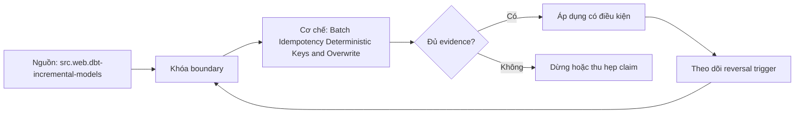

# Batch Idempotency Deterministic Keys and Overwrite

> [!abstract] Câu hỏi trung tâm
> Một batch rerun cần identity, deterministic computation và publication protocol nào để cho cùng accepted state?

## 1. Định nghĩa đúng phạm vi

Idempotency nghĩa là áp cùng logical operation nhiều lần tạo cùng externally observable accepted state trong scope/time window đã nêu. Nó không có nghĩa mọi lần chạy tạo byte-identical files, không phát log hay không tốn compute. Chốt target grain, history policy, side effects và observation boundary trước test.

## 2. Deterministic batch identity

Identity ghép source/entity, immutable interval/snapshot, contract/schema version và transformation code/config version; content hash phát hiện collision. Scheduler run ID không phải logical identity vì retry sinh run mới. Same identity same input resumes/dedups; same identity different hash quarantines. Idempotency retention phải phủ retry/backfill horizon.

## 3. Deterministic rows

Key từ stable business/source identity và grain; tránh random UUID/current time/unordered row_number. Canonical timezone, decimal, null, sort/tie rules và nondeterministic SQL functions. Dedup có total ordering; nếu two records tie hoàn toàn, contract phải quarantine hoặc define deterministic rule, không chọn tùy physical order.

## 4. Overwrite safely

Build complete partition/table version separately, validate, then atomic swap/pointer. `delete where` rồi insert trong separate commits không idempotent dưới crash. Insert overwrite phụ thuộc adapter/partition predicate and transaction semantics. Re-running exact batch replaces same logical scope, không xóa dữ liệu ngoài interval.

## 5. Side effects và checkpoint

Audit, notification, downstream trigger và checkpoint cũng cần operation identity/outbox/dedup. Data table đúng nhưng gửi notification hai lần vẫn chưa idempotent end-to-end. Checkpoint advances after durable publish; crash after publish before checkpoint causes replay absorbed by ledger. External sinks có idempotency key hoặc reconciliation/manual state.

## 6. Property test

Run same batch twice, kill at each step, reorder inputs, vary worker count và replay overlapping batches. Compare canonical key set/typed hashes/current-history views and side-effect ledger. Inject same ID different content. Pass only when state converges, no out-of-scope deletion and every duplicate/collision explainable. Preserve input/version/fingerprint.

## 7. Ma trận kiểm chứng từng mệnh đề

Mỗi claim phải gắn source/entity boundary, exact fixture, checkpoint/input state, counterexample và independent reconciliation oracle. Connector chạy thành công hoặc API trả 2xx chưa chứng minh completeness.

### 7.1. Batch-idempotency probe 1: logical identity, deterministic key/order, kill point, side-effect ledger và convergence oracle phải đủ

**Mệnh đề cần kiểm.** Batch-idempotency probe 1: logical identity, deterministic key/order, kill point, side-effect ledger và convergence oracle phải đủ.

**Thiết kế phép thử cho `wiki.transformation.batch-idempotency-deterministic-keys-overwrite`.** Khóa source/API version, entity, grain/key, time boundary, schema, pagination/cursor configuration và failure schedule. Tạo positive, boundary và negative fixtures; thay đổi đúng một assumption. Lưu request/query, response/raw extract hash, checkpoint trước/sau, landing objects, target state và source-at-boundary oracle.

**Điều kiện chấp nhận cho `wiki.transformation.batch-idempotency-deterministic-keys-overwrite`.** Count, key set, typed field hash và delete state khớp contract; duplicates được giải thích và dedup có identity rõ. Observation, inference và unknown được báo riêng. Lab chưa chạy chỉ là protocol.

### 7.2. Batch-idempotency probe 2: logical identity, deterministic key/order, kill point, side-effect ledger và convergence oracle phải đủ

**Mệnh đề cần kiểm.** Batch-idempotency probe 2: logical identity, deterministic key/order, kill point, side-effect ledger và convergence oracle phải đủ.

**Thiết kế phép thử cho `wiki.transformation.batch-idempotency-deterministic-keys-overwrite`.** Khóa source/API version, entity, grain/key, time boundary, schema, pagination/cursor configuration và failure schedule. Tạo positive, boundary và negative fixtures; thay đổi đúng một assumption. Lưu request/query, response/raw extract hash, checkpoint trước/sau, landing objects, target state và source-at-boundary oracle.

**Điều kiện chấp nhận cho `wiki.transformation.batch-idempotency-deterministic-keys-overwrite`.** Count, key set, typed field hash và delete state khớp contract; duplicates được giải thích và dedup có identity rõ. Observation, inference và unknown được báo riêng. Lab chưa chạy chỉ là protocol.

### 7.3. Batch-idempotency probe 3: logical identity, deterministic key/order, kill point, side-effect ledger và convergence oracle phải đủ

**Mệnh đề cần kiểm.** Batch-idempotency probe 3: logical identity, deterministic key/order, kill point, side-effect ledger và convergence oracle phải đủ.

**Thiết kế phép thử cho `wiki.transformation.batch-idempotency-deterministic-keys-overwrite`.** Khóa source/API version, entity, grain/key, time boundary, schema, pagination/cursor configuration và failure schedule. Tạo positive, boundary và negative fixtures; thay đổi đúng một assumption. Lưu request/query, response/raw extract hash, checkpoint trước/sau, landing objects, target state và source-at-boundary oracle.

**Điều kiện chấp nhận cho `wiki.transformation.batch-idempotency-deterministic-keys-overwrite`.** Count, key set, typed field hash và delete state khớp contract; duplicates được giải thích và dedup có identity rõ. Observation, inference và unknown được báo riêng. Lab chưa chạy chỉ là protocol.

### 7.4. Batch-idempotency probe 4: logical identity, deterministic key/order, kill point, side-effect ledger và convergence oracle phải đủ

**Mệnh đề cần kiểm.** Batch-idempotency probe 4: logical identity, deterministic key/order, kill point, side-effect ledger và convergence oracle phải đủ.

**Thiết kế phép thử cho `wiki.transformation.batch-idempotency-deterministic-keys-overwrite`.** Khóa source/API version, entity, grain/key, time boundary, schema, pagination/cursor configuration và failure schedule. Tạo positive, boundary và negative fixtures; thay đổi đúng một assumption. Lưu request/query, response/raw extract hash, checkpoint trước/sau, landing objects, target state và source-at-boundary oracle.

**Điều kiện chấp nhận cho `wiki.transformation.batch-idempotency-deterministic-keys-overwrite`.** Count, key set, typed field hash và delete state khớp contract; duplicates được giải thích và dedup có identity rõ. Observation, inference và unknown được báo riêng. Lab chưa chạy chỉ là protocol.

### 7.5. Batch-idempotency probe 5: logical identity, deterministic key/order, kill point, side-effect ledger và convergence oracle phải đủ

**Mệnh đề cần kiểm.** Batch-idempotency probe 5: logical identity, deterministic key/order, kill point, side-effect ledger và convergence oracle phải đủ.

**Thiết kế phép thử cho `wiki.transformation.batch-idempotency-deterministic-keys-overwrite`.** Khóa source/API version, entity, grain/key, time boundary, schema, pagination/cursor configuration và failure schedule. Tạo positive, boundary và negative fixtures; thay đổi đúng một assumption. Lưu request/query, response/raw extract hash, checkpoint trước/sau, landing objects, target state và source-at-boundary oracle.

**Điều kiện chấp nhận cho `wiki.transformation.batch-idempotency-deterministic-keys-overwrite`.** Count, key set, typed field hash và delete state khớp contract; duplicates được giải thích và dedup có identity rõ. Observation, inference và unknown được báo riêng. Lab chưa chạy chỉ là protocol.

### 7.6. Batch-idempotency probe 6: logical identity, deterministic key/order, kill point, side-effect ledger và convergence oracle phải đủ

**Mệnh đề cần kiểm.** Batch-idempotency probe 6: logical identity, deterministic key/order, kill point, side-effect ledger và convergence oracle phải đủ.

**Thiết kế phép thử cho `wiki.transformation.batch-idempotency-deterministic-keys-overwrite`.** Khóa source/API version, entity, grain/key, time boundary, schema, pagination/cursor configuration và failure schedule. Tạo positive, boundary và negative fixtures; thay đổi đúng một assumption. Lưu request/query, response/raw extract hash, checkpoint trước/sau, landing objects, target state và source-at-boundary oracle.

**Điều kiện chấp nhận cho `wiki.transformation.batch-idempotency-deterministic-keys-overwrite`.** Count, key set, typed field hash và delete state khớp contract; duplicates được giải thích và dedup có identity rõ. Observation, inference và unknown được báo riêng. Lab chưa chạy chỉ là protocol.

### 7.7. Batch-idempotency probe 7: logical identity, deterministic key/order, kill point, side-effect ledger và convergence oracle phải đủ

**Mệnh đề cần kiểm.** Batch-idempotency probe 7: logical identity, deterministic key/order, kill point, side-effect ledger và convergence oracle phải đủ.

**Thiết kế phép thử cho `wiki.transformation.batch-idempotency-deterministic-keys-overwrite`.** Khóa source/API version, entity, grain/key, time boundary, schema, pagination/cursor configuration và failure schedule. Tạo positive, boundary và negative fixtures; thay đổi đúng một assumption. Lưu request/query, response/raw extract hash, checkpoint trước/sau, landing objects, target state và source-at-boundary oracle.

**Điều kiện chấp nhận cho `wiki.transformation.batch-idempotency-deterministic-keys-overwrite`.** Count, key set, typed field hash và delete state khớp contract; duplicates được giải thích và dedup có identity rõ. Observation, inference và unknown được báo riêng. Lab chưa chạy chỉ là protocol.

### 7.8. Batch-idempotency probe 8: logical identity, deterministic key/order, kill point, side-effect ledger và convergence oracle phải đủ

**Mệnh đề cần kiểm.** Batch-idempotency probe 8: logical identity, deterministic key/order, kill point, side-effect ledger và convergence oracle phải đủ.

**Thiết kế phép thử cho `wiki.transformation.batch-idempotency-deterministic-keys-overwrite`.** Khóa source/API version, entity, grain/key, time boundary, schema, pagination/cursor configuration và failure schedule. Tạo positive, boundary và negative fixtures; thay đổi đúng một assumption. Lưu request/query, response/raw extract hash, checkpoint trước/sau, landing objects, target state và source-at-boundary oracle.

**Điều kiện chấp nhận cho `wiki.transformation.batch-idempotency-deterministic-keys-overwrite`.** Count, key set, typed field hash và delete state khớp contract; duplicates được giải thích và dedup có identity rõ. Observation, inference và unknown được báo riêng. Lab chưa chạy chỉ là protocol.

### 7.9. Batch-idempotency probe 9: logical identity, deterministic key/order, kill point, side-effect ledger và convergence oracle phải đủ

**Mệnh đề cần kiểm.** Batch-idempotency probe 9: logical identity, deterministic key/order, kill point, side-effect ledger và convergence oracle phải đủ.

**Thiết kế phép thử cho `wiki.transformation.batch-idempotency-deterministic-keys-overwrite`.** Khóa source/API version, entity, grain/key, time boundary, schema, pagination/cursor configuration và failure schedule. Tạo positive, boundary và negative fixtures; thay đổi đúng một assumption. Lưu request/query, response/raw extract hash, checkpoint trước/sau, landing objects, target state và source-at-boundary oracle.

**Điều kiện chấp nhận cho `wiki.transformation.batch-idempotency-deterministic-keys-overwrite`.** Count, key set, typed field hash và delete state khớp contract; duplicates được giải thích và dedup có identity rõ. Observation, inference và unknown được báo riêng. Lab chưa chạy chỉ là protocol.

### 7.10. Batch-idempotency probe 10: logical identity, deterministic key/order, kill point, side-effect ledger và convergence oracle phải đủ

**Mệnh đề cần kiểm.** Batch-idempotency probe 10: logical identity, deterministic key/order, kill point, side-effect ledger và convergence oracle phải đủ.

**Thiết kế phép thử cho `wiki.transformation.batch-idempotency-deterministic-keys-overwrite`.** Khóa source/API version, entity, grain/key, time boundary, schema, pagination/cursor configuration và failure schedule. Tạo positive, boundary và negative fixtures; thay đổi đúng một assumption. Lưu request/query, response/raw extract hash, checkpoint trước/sau, landing objects, target state và source-at-boundary oracle.

**Điều kiện chấp nhận cho `wiki.transformation.batch-idempotency-deterministic-keys-overwrite`.** Count, key set, typed field hash và delete state khớp contract; duplicates được giải thích và dedup có identity rõ. Observation, inference và unknown được báo riêng. Lab chưa chạy chỉ là protocol.

### 7.11. Batch-idempotency probe 11: logical identity, deterministic key/order, kill point, side-effect ledger và convergence oracle phải đủ

**Mệnh đề cần kiểm.** Batch-idempotency probe 11: logical identity, deterministic key/order, kill point, side-effect ledger và convergence oracle phải đủ.

**Thiết kế phép thử cho `wiki.transformation.batch-idempotency-deterministic-keys-overwrite`.** Khóa source/API version, entity, grain/key, time boundary, schema, pagination/cursor configuration và failure schedule. Tạo positive, boundary và negative fixtures; thay đổi đúng một assumption. Lưu request/query, response/raw extract hash, checkpoint trước/sau, landing objects, target state và source-at-boundary oracle.

**Điều kiện chấp nhận cho `wiki.transformation.batch-idempotency-deterministic-keys-overwrite`.** Count, key set, typed field hash và delete state khớp contract; duplicates được giải thích và dedup có identity rõ. Observation, inference và unknown được báo riêng. Lab chưa chạy chỉ là protocol.

### 7.12. Batch-idempotency probe 12: logical identity, deterministic key/order, kill point, side-effect ledger và convergence oracle phải đủ

**Mệnh đề cần kiểm.** Batch-idempotency probe 12: logical identity, deterministic key/order, kill point, side-effect ledger và convergence oracle phải đủ.

**Thiết kế phép thử cho `wiki.transformation.batch-idempotency-deterministic-keys-overwrite`.** Khóa source/API version, entity, grain/key, time boundary, schema, pagination/cursor configuration và failure schedule. Tạo positive, boundary và negative fixtures; thay đổi đúng một assumption. Lưu request/query, response/raw extract hash, checkpoint trước/sau, landing objects, target state và source-at-boundary oracle.

**Điều kiện chấp nhận cho `wiki.transformation.batch-idempotency-deterministic-keys-overwrite`.** Count, key set, typed field hash và delete state khớp contract; duplicates được giải thích và dedup có identity rõ. Observation, inference và unknown được báo riêng. Lab chưa chạy chỉ là protocol.

### 7.13. Batch-idempotency probe 13: logical identity, deterministic key/order, kill point, side-effect ledger và convergence oracle phải đủ

**Mệnh đề cần kiểm.** Batch-idempotency probe 13: logical identity, deterministic key/order, kill point, side-effect ledger và convergence oracle phải đủ.

**Thiết kế phép thử cho `wiki.transformation.batch-idempotency-deterministic-keys-overwrite`.** Khóa source/API version, entity, grain/key, time boundary, schema, pagination/cursor configuration và failure schedule. Tạo positive, boundary và negative fixtures; thay đổi đúng một assumption. Lưu request/query, response/raw extract hash, checkpoint trước/sau, landing objects, target state và source-at-boundary oracle.

**Điều kiện chấp nhận cho `wiki.transformation.batch-idempotency-deterministic-keys-overwrite`.** Count, key set, typed field hash và delete state khớp contract; duplicates được giải thích và dedup có identity rõ. Observation, inference và unknown được báo riêng. Lab chưa chạy chỉ là protocol.

### 7.14. Batch-idempotency probe 14: logical identity, deterministic key/order, kill point, side-effect ledger và convergence oracle phải đủ

**Mệnh đề cần kiểm.** Batch-idempotency probe 14: logical identity, deterministic key/order, kill point, side-effect ledger và convergence oracle phải đủ.

**Thiết kế phép thử cho `wiki.transformation.batch-idempotency-deterministic-keys-overwrite`.** Khóa source/API version, entity, grain/key, time boundary, schema, pagination/cursor configuration và failure schedule. Tạo positive, boundary và negative fixtures; thay đổi đúng một assumption. Lưu request/query, response/raw extract hash, checkpoint trước/sau, landing objects, target state và source-at-boundary oracle.

**Điều kiện chấp nhận cho `wiki.transformation.batch-idempotency-deterministic-keys-overwrite`.** Count, key set, typed field hash và delete state khớp contract; duplicates được giải thích và dedup có identity rõ. Observation, inference và unknown được báo riêng. Lab chưa chạy chỉ là protocol.

### 7.15. Batch-idempotency probe 15: logical identity, deterministic key/order, kill point, side-effect ledger và convergence oracle phải đủ

**Mệnh đề cần kiểm.** Batch-idempotency probe 15: logical identity, deterministic key/order, kill point, side-effect ledger và convergence oracle phải đủ.

**Thiết kế phép thử cho `wiki.transformation.batch-idempotency-deterministic-keys-overwrite`.** Khóa source/API version, entity, grain/key, time boundary, schema, pagination/cursor configuration và failure schedule. Tạo positive, boundary và negative fixtures; thay đổi đúng một assumption. Lưu request/query, response/raw extract hash, checkpoint trước/sau, landing objects, target state và source-at-boundary oracle.

**Điều kiện chấp nhận cho `wiki.transformation.batch-idempotency-deterministic-keys-overwrite`.** Count, key set, typed field hash và delete state khớp contract; duplicates được giải thích và dedup có identity rõ. Observation, inference và unknown được báo riêng. Lab chưa chạy chỉ là protocol.

## 8. Quy trình phản biện

1. Chốt entity, grain, identity và immutable boundary.
2. Tách source fact, documentation claim và observed behavior.
3. Viết delete, retry, checkpoint và replay semantics trước code.
4. Dùng key/typed-hash reconciliation, không chỉ row count.
5. Pin version, retention, timezone, ordering và rate limits.
6. Ghi assumption bị falsify và extraction pattern thay thế.

## 9. Câu hỏi tự kiểm tra

1. Source thay đổi row/entity theo những operation nào?
2. Boundary nào định nghĩa complete?
3. Delete có xuất hiện trong interface không?
4. Cursor/order có total và immutable không?
5. Crash ở checkpoint boundary gây replay hay gap?
6. Bằng chứng nào chưa được chạy?

## 10. Giới hạn và điều chưa cho phép kết luận

- Chưa chạy mutation/pagination/watermark lab trên source thật.
- Product behavior phải pin version, retention và configuration.
- Decision matrices và failure protocols là synthesis của giáo trình.
- Note giữ trạng thái `review` tới khi chủ dự án duyệt.

## Reference
1. [[SRC-DBT-INCREMENTAL-MODELS]]
2. [[SRC-STRIPE-IDEMPOTENT-REQUESTS]]
3. [[SRC-REIS-HOUSLEY-FUNDAMENTALS-DATA-ENGINEERING]]
4. [[SRC-KLEPPMANN-DDIA-1E]]

## Source coverage

| Source slice | Nội dung sử dụng | Trạng thái |
|---|---|---|
| [[SRC-DBT-INCREMENTAL-MODELS]] | Source/change/API contract hoặc engineering context | Đã đọc locator; không suy ngoài phạm vi |
| [[SRC-STRIPE-IDEMPOTENT-REQUESTS]] | Source/change/API contract hoặc engineering context | Đã đọc locator; không suy ngoài phạm vi |
| [[SRC-REIS-HOUSLEY-FUNDAMENTALS-DATA-ENGINEERING]] | Source/change/API contract hoặc engineering context | Đã đọc locator; không suy ngoài phạm vi |
| [[SRC-KLEPPMANN-DDIA-1E]] | Source/change/API contract hoặc engineering context | Đã đọc locator; không suy ngoài phạm vi |

## Key takeaways
- Extraction pattern chỉ đúng khi source assumptions đúng.
- Completeness cần immutable boundary và reconciliation oracle.
- Retry/checkpoint ưu tiên replay có kiểm soát hơn silent gap.
- Connector không chuyển giao ownership về tính đúng.

<!-- ATOMIC-EXECUTION-CAPSULE:START -->

## Execution capsule — kiểm chứng `wiki.transformation.batch-idempotency-deterministic-keys-overwrite`

> [!important] Phân loại mệnh đề
> Với `wiki.transformation.batch-idempotency-deterministic-keys-overwrite`, sơ đồ, ví dụ và artifact về **Batch Idempotency Deterministic Keys and Overwrite** là **synthesis để kiểm chứng**; chúng không phải trích dẫn hay case nguyên văn của nguồn.

### Sơ đồ cơ chế và điểm kiểm soát



Đọc sơ đồ `wiki.transformation.batch-idempotency-deterministic-keys-overwrite` từ trái sang phải: source chỉ cung cấp claim ban đầu cho **Batch Idempotency Deterministic Keys and Overwrite**; quyết định chỉ được đi tiếp sau khi boundary, evidence và điều kiện đảo quyết định đã hiện hữu.

### Ví dụ làm việc có thể bác bỏ

**Input.** Một đội cần trả lời: “Một batch rerun cần identity, deterministic computation và publication protocol nào để cho cùng accepted state?” cho một phạm vi nhỏ, có owner và deadline rõ.

**Decision.** Đội áp dụng **Batch Idempotency Deterministic Keys and Overwrite** trên control và variant chỉ khác một assumption; expected result và hard constraints được khóa trước khi chạy.

**Outcome.** Với `wiki.transformation.batch-idempotency-deterministic-keys-overwrite`, nếu observation vi phạm hard constraint hoặc oracle độc lập không xác nhận **Batch Idempotency Deterministic Keys and Overwrite**, đội thu hẹp claim hay đảo quyết định. Nếu đạt, kết luận vẫn kèm scope, version và review date; một lần thành công không được nâng thành quy luật phổ quát.

### Artifact thực thi tối thiểu

```sql
-- Verification harness for: Batch Idempotency Deterministic Keys and Overwrite
WITH evidence AS (
    SELECT 'wiki.transformation.batch-idempotency-deterministic-keys-overwrite' AS concept_id,
           'boundary_declared' AS check_name, 1 AS passed
    UNION ALL
    SELECT 'wiki.transformation.batch-idempotency-deterministic-keys-overwrite', 'independent_oracle', 1
    UNION ALL
    SELECT 'wiki.transformation.batch-idempotency-deterministic-keys-overwrite', 'reversal_trigger_recorded', 1
)
SELECT concept_id,
       MIN(passed) AS all_hard_checks_pass,
       COUNT(*) AS evidence_items
FROM evidence
GROUP BY concept_id
HAVING MIN(passed) = 1;
```

Artifact của `wiki.transformation.batch-idempotency-deterministic-keys-overwrite` buộc người dùng ghi boundary, oracle và reversal trigger cho **Batch Idempotency Deterministic Keys and Overwrite**. Các giá trị minh họa phải được thay bằng evidence thật trước khi dùng cho quyết định.

### Tự kiểm tra trước khi tái sử dụng

1. Bạn có thể trả lời `Một batch rerun cần identity, deterministic computation và publication protocol nào để cho cùng accepted state?` bằng một câu mà không kéo thêm concept thứ hai không?
2. Source locator nào đỡ cho claim, và phần nào chỉ là synthesis trong note?
3. Observation nào khiến bạn dừng, thu hẹp hoặc đảo quyết định?
4. Artifact nào cho phép một reviewer độc lập tái hiện kết quả?

<!-- ATOMIC-EXECUTION-CAPSULE:END -->
