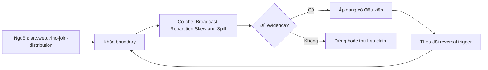

# Broadcast Repartition Skew and Spill

> [!abstract] Câu hỏi trung tâm
> Phân biệt broadcast, repartition, skew và spill từ plan/runtime counters như thế nào, rồi chọn remediation mà không che nhầm nguyên nhân?

## 1. Broadcast join

Build side sau filter được replicate tới workers xử lý probe. Lợi ích là tránh repartition probe side và cho local hash probes. Chi phí gồm network fanout, deserialize/build CPU và một bản hash table trong memory domain của mỗi task/worker tùy engine. Raw table size chưa đủ để quyết định; phải xét build output sau filter/projection, representation overhead, concurrency và per-node limit. Statistics sai có thể chọn broadcast không phù hợp; cap là guardrail, không chứng minh đủ memory. Capture estimated/actual rows-bytes, fanout, peak memory và retries.

## 2. Partitioned join

Cả hai inputs được hash repartition theo compatible join keys; mỗi partition xây/probe cục bộ. Memory build được chia trên cluster, nhưng network có thể gần tổng bytes của hai sides sau local reductions. Hash semantics phải xử lý null/type/collation nhất quán. Partition count ảnh hưởng parallelism, per-partition overhead và spill granularity. Partitioned join không mặc nhiên chậm hơn broadcast: với build lớn, high concurrency hoặc network topology khác, nó có thể là lựa chọn an toàn và nhanh hơn.

## 3. Skew có nhiều nguồn

Data skew do hot/null/default key; partition skew do hash/range mapping; split skew do file sizes; compute skew do expression/UDF; environment skew do noisy worker, GC hoặc retry. Symptom là max task/partition vượt median hoặc tail kéo stage, nhưng diagnosis cần input rows/bytes, output expansion, CPU/blocked, spill và key-frequency evidence. Join fanout có thể làm output skew dù inputs cân. Average che nguyên nhân. Báo p50/p95/max, coefficient hoặc max/median và top keys với privacy-safe fixtures.

## 4. Spill lifecycle

Memory manager revoke/reserve; operator partition/serialize intermediate; write spill; sau đó read/merge/repartition để hoàn thành. Spill giảm peak memory cho operators hỗ trợ nhưng thêm bytes, I/O, CPU compression/encryption và có thể bão hòa shared disks. Phạm vi operator/case được hỗ trợ có giới hạn; một partition khổng lồ vẫn OOM. Spill là cơ chế sống sót có chi phí. Mức chậm có thể rất lớn nhưng không dùng hệ số cố định. Ghi local/remote spill bytes, files, read/write time, disk utilization và peak memory.

## 5. Bốn hiện tượng có thể đồng thời

Broadcast sai kích thước gây memory pressure rồi spill hoặc OOM. Hot key trong repartition tạo một build partition lớn và chỉ task đó spill. Spill disk contention làm nhiều tasks chậm, nhìn giống broad skew. Vì vậy plan strategy chỉ là điểm đầu. Dựng causal timeline: estimated build → chosen distribution → actual partition distribution → memory reservation → spill → stage tails. Tắt spill để chẩn đoán có thể chuyển thành failure và chỉ chạy trong fixture cô lập; không dùng production.

## 6. Ba nhóm remediation

Distribution: broadcast build thực sự nhỏ, partition large sides, colocate khi contract tương thích. Data: filter/project sớm, pre-aggregate, split hot keys, salt có controlled fanout hoặc isolate null/defaults. Resource/operator: tăng memory có giới hạn, chỉnh partitions, spill devices/compression, concurrency hoặc fault-tolerant path. Salting cần de-salt/aggregate đúng; replicate hot-key counterpart có memory cost. Tăng memory che symptom nếu root là key skew và không cải thiện max partition proportion.

## 7. Counterfactual diagnosis

Giữ data/query rồi force hoặc hint broadcast và partitioned chỉ như diagnostic; hints có thể unsupported hoặc đổi semantics kế hoạch ở phiên bản khác. Với skew, so uniform fixture và one-hot fixture cùng row count. Với spill, giữ distribution và giảm memory threshold hoặc tăng build size. Mỗi intervention cần predicted counter: broadcast tăng replicated bytes/memory; repartition tăng exchange; skew tăng task dispersion; spill tăng temp bytes/I/O. Nếu counter không đổi, diagnosis bị bác bỏ.

## 8. Lab bốn ca

Ca A build nhỏ có broadcast fit; ca B build đủ lớn làm cap/actual memory quan trọng; ca C hot key tạo straggler; ca D memory threshold gây spill trên input cân. Lưu plans, statistics, query ID, task partition metrics, exchange, peak memory, spill, result hash và repetitions. Remediate ít nhất ba ca, so trước/sau bằng cùng fixture. Done không chỉ là query thành công: strategy/counter phải khớp causal story và không làm correctness hoặc concurrency budget xấu đi không ghi nhận.

## 9. Ma trận kiểm chứng từng mệnh đề

Mỗi mệnh đề về latency, scaling, cache, concurrency hoặc cost cần counterfactual, correctness oracle và counter ở đúng boundary. Tên kiến trúc, plan label, elapsed time hoặc rate card riêng lẻ chưa đủ để quy nguyên nhân.

### 9.1. broadcast size phải tính sau filter projection và representation overhead

**Mệnh đề cần kiểm.** broadcast size phải tính sau filter projection và representation overhead.

**Cách kiểm.** Chạy broadcast/partitioned, uniform/hot-key và no-spill/spill fixtures; lưu plan, actual rows/bytes, memory, task distribution, spill I/O và result hash. Ghi engine/version, workload shape, controlled variables, expected counter, failure signal và reversal condition.

**Bằng chứng đạt cho `wiki.olap.broadcast-repartition-skew-spill`.** Lưu source/query/config hashes, plans/profiles, raw counters, result oracle, repetitions, units và reviewer. Khi lab chưa chạy, chỉ giữ protocol và expected observations; không viết chúng như kết quả thực nghiệm.

### 9.2. broadcast nhân build state theo worker hoặc task memory domain

**Mệnh đề cần kiểm.** broadcast nhân build state theo worker hoặc task memory domain.

**Cách kiểm.** Chạy broadcast/partitioned, uniform/hot-key và no-spill/spill fixtures; lưu plan, actual rows/bytes, memory, task distribution, spill I/O và result hash. Ghi engine/version, workload shape, controlled variables, expected counter, failure signal và reversal condition.

**Bằng chứng đạt cho `wiki.olap.broadcast-repartition-skew-spill`.** Lưu source/query/config hashes, plans/profiles, raw counters, result oracle, repetitions, units và reviewer. Khi lab chưa chạy, chỉ giữ protocol và expected observations; không viết chúng như kết quả thực nghiệm.

### 9.3. partitioned join repartition cả hai sides theo compatible keys

**Mệnh đề cần kiểm.** partitioned join repartition cả hai sides theo compatible keys.

**Cách kiểm.** Chạy broadcast/partitioned, uniform/hot-key và no-spill/spill fixtures; lưu plan, actual rows/bytes, memory, task distribution, spill I/O và result hash. Ghi engine/version, workload shape, controlled variables, expected counter, failure signal và reversal condition.

**Bằng chứng đạt cho `wiki.olap.broadcast-repartition-skew-spill`.** Lưu source/query/config hashes, plans/profiles, raw counters, result oracle, repetitions, units và reviewer. Khi lab chưa chạy, chỉ giữ protocol và expected observations; không viết chúng như kết quả thực nghiệm.

### 9.4. partitioned không mặc nhiên chậm hơn broadcast

**Mệnh đề cần kiểm.** partitioned không mặc nhiên chậm hơn broadcast.

**Cách kiểm.** Chạy broadcast/partitioned, uniform/hot-key và no-spill/spill fixtures; lưu plan, actual rows/bytes, memory, task distribution, spill I/O và result hash. Ghi engine/version, workload shape, controlled variables, expected counter, failure signal và reversal condition.

**Bằng chứng đạt cho `wiki.olap.broadcast-repartition-skew-spill`.** Lưu source/query/config hashes, plans/profiles, raw counters, result oracle, repetitions, units và reviewer. Khi lab chưa chạy, chỉ giữ protocol và expected observations; không viết chúng như kết quả thực nghiệm.

### 9.5. plan strategy không chứng minh actual network hay memory

**Mệnh đề cần kiểm.** plan strategy không chứng minh actual network hay memory.

**Cách kiểm.** Chạy broadcast/partitioned, uniform/hot-key và no-spill/spill fixtures; lưu plan, actual rows/bytes, memory, task distribution, spill I/O và result hash. Ghi engine/version, workload shape, controlled variables, expected counter, failure signal và reversal condition.

**Bằng chứng đạt cho `wiki.olap.broadcast-repartition-skew-spill`.** Lưu source/query/config hashes, plans/profiles, raw counters, result oracle, repetitions, units và reviewer. Khi lab chưa chạy, chỉ giữ protocol và expected observations; không viết chúng như kết quả thực nghiệm.

### 9.6. skew có thể đến từ data split compute hoặc environment

**Mệnh đề cần kiểm.** skew có thể đến từ data split compute hoặc environment.

**Cách kiểm.** Chạy broadcast/partitioned, uniform/hot-key và no-spill/spill fixtures; lưu plan, actual rows/bytes, memory, task distribution, spill I/O và result hash. Ghi engine/version, workload shape, controlled variables, expected counter, failure signal và reversal condition.

**Bằng chứng đạt cho `wiki.olap.broadcast-repartition-skew-spill`.** Lưu source/query/config hashes, plans/profiles, raw counters, result oracle, repetitions, units và reviewer. Khi lab chưa chạy, chỉ giữ protocol và expected observations; không viết chúng như kết quả thực nghiệm.

### 9.7. max và p95 task metrics quan trọng hơn average

**Mệnh đề cần kiểm.** max và p95 task metrics quan trọng hơn average.

**Cách kiểm.** Chạy broadcast/partitioned, uniform/hot-key và no-spill/spill fixtures; lưu plan, actual rows/bytes, memory, task distribution, spill I/O và result hash. Ghi engine/version, workload shape, controlled variables, expected counter, failure signal và reversal condition.

**Bằng chứng đạt cho `wiki.olap.broadcast-repartition-skew-spill`.** Lưu source/query/config hashes, plans/profiles, raw counters, result oracle, repetitions, units và reviewer. Khi lab chưa chạy, chỉ giữ protocol và expected observations; không viết chúng như kết quả thực nghiệm.

### 9.8. join fanout có thể tạo output skew

**Mệnh đề cần kiểm.** join fanout có thể tạo output skew.

**Cách kiểm.** Chạy broadcast/partitioned, uniform/hot-key và no-spill/spill fixtures; lưu plan, actual rows/bytes, memory, task distribution, spill I/O và result hash. Ghi engine/version, workload shape, controlled variables, expected counter, failure signal và reversal condition.

**Bằng chứng đạt cho `wiki.olap.broadcast-repartition-skew-spill`.** Lưu source/query/config hashes, plans/profiles, raw counters, result oracle, repetitions, units và reviewer. Khi lab chưa chạy, chỉ giữ protocol và expected observations; không viết chúng như kết quả thực nghiệm.

### 9.9. spill giảm peak memory nhưng thêm I/O và CPU

**Mệnh đề cần kiểm.** spill giảm peak memory nhưng thêm I/O và CPU.

**Cách kiểm.** Chạy broadcast/partitioned, uniform/hot-key và no-spill/spill fixtures; lưu plan, actual rows/bytes, memory, task distribution, spill I/O và result hash. Ghi engine/version, workload shape, controlled variables, expected counter, failure signal và reversal condition.

**Bằng chứng đạt cho `wiki.olap.broadcast-repartition-skew-spill`.** Lưu source/query/config hashes, plans/profiles, raw counters, result oracle, repetitions, units và reviewer. Khi lab chưa chạy, chỉ giữ protocol và expected observations; không viết chúng như kết quả thực nghiệm.

### 9.10. spill không bảo đảm mọi large query hoàn tất

**Mệnh đề cần kiểm.** spill không bảo đảm mọi large query hoàn tất.

**Cách kiểm.** Chạy broadcast/partitioned, uniform/hot-key và no-spill/spill fixtures; lưu plan, actual rows/bytes, memory, task distribution, spill I/O và result hash. Ghi engine/version, workload shape, controlled variables, expected counter, failure signal và reversal condition.

**Bằng chứng đạt cho `wiki.olap.broadcast-repartition-skew-spill`.** Lưu source/query/config hashes, plans/profiles, raw counters, result oracle, repetitions, units và reviewer. Khi lab chưa chạy, chỉ giữ protocol và expected observations; không viết chúng như kết quả thực nghiệm.

### 9.11. một hot partition có thể vừa skew vừa spill

**Mệnh đề cần kiểm.** một hot partition có thể vừa skew vừa spill.

**Cách kiểm.** Chạy broadcast/partitioned, uniform/hot-key và no-spill/spill fixtures; lưu plan, actual rows/bytes, memory, task distribution, spill I/O và result hash. Ghi engine/version, workload shape, controlled variables, expected counter, failure signal và reversal condition.

**Bằng chứng đạt cho `wiki.olap.broadcast-repartition-skew-spill`.** Lưu source/query/config hashes, plans/profiles, raw counters, result oracle, repetitions, units và reviewer. Khi lab chưa chạy, chỉ giữ protocol và expected observations; không viết chúng như kết quả thực nghiệm.

### 9.12. tăng memory không sửa key distribution

**Mệnh đề cần kiểm.** tăng memory không sửa key distribution.

**Cách kiểm.** Chạy broadcast/partitioned, uniform/hot-key và no-spill/spill fixtures; lưu plan, actual rows/bytes, memory, task distribution, spill I/O và result hash. Ghi engine/version, workload shape, controlled variables, expected counter, failure signal và reversal condition.

**Bằng chứng đạt cho `wiki.olap.broadcast-repartition-skew-spill`.** Lưu source/query/config hashes, plans/profiles, raw counters, result oracle, repetitions, units và reviewer. Khi lab chưa chạy, chỉ giữ protocol và expected observations; không viết chúng như kết quả thực nghiệm.

### 9.13. salting có correctness và expansion cost

**Mệnh đề cần kiểm.** salting có correctness và expansion cost.

**Cách kiểm.** Chạy broadcast/partitioned, uniform/hot-key và no-spill/spill fixtures; lưu plan, actual rows/bytes, memory, task distribution, spill I/O và result hash. Ghi engine/version, workload shape, controlled variables, expected counter, failure signal và reversal condition.

**Bằng chứng đạt cho `wiki.olap.broadcast-repartition-skew-spill`.** Lưu source/query/config hashes, plans/profiles, raw counters, result oracle, repetitions, units và reviewer. Khi lab chưa chạy, chỉ giữ protocol và expected observations; không viết chúng như kết quả thực nghiệm.

### 9.14. forced strategy chỉ là diagnostic tool

**Mệnh đề cần kiểm.** forced strategy chỉ là diagnostic tool.

**Cách kiểm.** Chạy broadcast/partitioned, uniform/hot-key và no-spill/spill fixtures; lưu plan, actual rows/bytes, memory, task distribution, spill I/O và result hash. Ghi engine/version, workload shape, controlled variables, expected counter, failure signal và reversal condition.

**Bằng chứng đạt cho `wiki.olap.broadcast-repartition-skew-spill`.** Lưu source/query/config hashes, plans/profiles, raw counters, result oracle, repetitions, units và reviewer. Khi lab chưa chạy, chỉ giữ protocol và expected observations; không viết chúng như kết quả thực nghiệm.

### 9.15. mỗi remediation cần result oracle và before-after counters

**Mệnh đề cần kiểm.** mỗi remediation cần result oracle và before-after counters.

**Cách kiểm.** Chạy broadcast/partitioned, uniform/hot-key và no-spill/spill fixtures; lưu plan, actual rows/bytes, memory, task distribution, spill I/O và result hash. Ghi engine/version, workload shape, controlled variables, expected counter, failure signal và reversal condition.

**Bằng chứng đạt cho `wiki.olap.broadcast-repartition-skew-spill`.** Lưu source/query/config hashes, plans/profiles, raw counters, result oracle, repetitions, units và reviewer. Khi lab chưa chạy, chỉ giữ protocol và expected observations; không viết chúng như kết quả thực nghiệm.

## 10. Quy trình phản biện

1. Viết câu hỏi đo lường và decision cần hỗ trợ trước khi chọn metric.
2. Khóa query semantics, snapshot, output oracle và unit của mọi số.
3. Vẽ boundaries: client, queue, planner, source, worker, exchange, cache, spill và billing.
4. Thay một cơ chế; ghi mọi thay đổi algorithm/config do engine tự thực hiện.
5. Dùng distribution và critical path; không để average che tails hoặc skew.
6. Viết counterexample, reversal condition và stop threshold trước khi chạy.
7. Tách estimate, configured intent, runtime observation và invoice fact.
8. Nếu không kiểm soát được cache, resource hoặc rate contract, ghi giới hạn thay vì kết luận nhân quả.

## 11. Câu hỏi tự kiểm tra

1. Mệnh đề đang nằm ở tầng kiến trúc, scheduler, operator, hardware hay billing?
2. Counter nào quan sát trực tiếp cơ chế đó và proxy nào dễ gây nhầm?
3. Correctness/SLO nào phải giữ trước khi gọi một phương án tốt hơn?
4. Cache, concurrency, statistics, data shape hay rate card nào có thể đảo kết luận?
5. Intervention nào bác bỏ diagnosis hiện tại?
6. Kết luận nào mới là protocol, chưa phải observation?

## 12. Giới hạn và điều chưa cho phép kết luận

- Chưa chạy cluster scaling, join/spill, cache, concurrency hoặc billing reconciliation lab; note mô tả protocol và evidence contract.
- Tài liệu sản phẩm được kiểm ngày 2026-10-01; field, feature, pricing và behavior có thể đổi theo version, region và contract.
- Amdahl, Gustafson, workload matrices và cost equations là mô hình; chúng không thay runtime counters hay invoice export.
- Không suy vendor superiority từ paper hoặc một benchmark; workload, correctness, SLO, operation và price contract phải cùng phạm vi.
- Note giữ trạng thái `review` cho tới khi chủ dự án duyệt semantic meaning.

## Reference
1. [[SRC-TRINO-JOIN-DISTRIBUTION]]
2. [[SRC-TRINO-SPILL]]
3. [[SRC-TRINO-DISTRIBUTED-PLANS]]

## Source coverage

| Source slice | Nội dung sử dụng | Trạng thái |
|---|---|---|
| [[SRC-TRINO-JOIN-DISTRIBUTION]] | Khái niệm, mechanism hoặc evidence boundary liên quan | Đã đọc locator trong source record; không suy ngoài phạm vi |
| [[SRC-TRINO-SPILL]] | Khái niệm, mechanism hoặc evidence boundary liên quan | Đã đọc locator trong source record; không suy ngoài phạm vi |
| [[SRC-TRINO-DISTRIBUTED-PLANS]] | Khái niệm, mechanism hoặc evidence boundary liên quan | Đã đọc locator trong source record; không suy ngoài phạm vi |

## Key takeaways
- Broadcast, repartition, skew và spill có thể xuất hiện cùng lúc; diagnosis cần timeline và task-level counters.
- Estimate và configured intent phải được tách khỏi runtime observation và invoice fact.
- Correctness oracle, units, cache state, workload shape và controlled variables đi trước performance/cost claim.
- Average phải đi cùng distributions, tails, critical path và per-class hoặc per-task counters.
- Chưa chạy lab thì artifact là giáo trình đã kiểm cấu trúc, chưa phải benchmark hay production certification.

<!-- ATOMIC-EXECUTION-CAPSULE:START -->

## Execution capsule — kiểm chứng `wiki.olap.broadcast-repartition-skew-spill`

> [!important] Phân loại mệnh đề
> Với `wiki.olap.broadcast-repartition-skew-spill`, sơ đồ, ví dụ và artifact về **Broadcast Repartition Skew and Spill** là **synthesis để kiểm chứng**; chúng không phải trích dẫn hay case nguyên văn của nguồn.

### Sơ đồ cơ chế và điểm kiểm soát



Đọc sơ đồ `wiki.olap.broadcast-repartition-skew-spill` từ trái sang phải: source chỉ cung cấp claim ban đầu cho **Broadcast Repartition Skew and Spill**; quyết định chỉ được đi tiếp sau khi boundary, evidence và điều kiện đảo quyết định đã hiện hữu.

### Ví dụ làm việc có thể bác bỏ

**Input.** Một đội cần trả lời: “Phân biệt broadcast, repartition, skew và spill từ plan/runtime counters như thế nào, rồi chọn remediation mà không che nhầm nguyên nhân?” cho một phạm vi nhỏ, có owner và deadline rõ.

**Decision.** Đội áp dụng **Broadcast Repartition Skew and Spill** trên control và variant chỉ khác một assumption; expected result và hard constraints được khóa trước khi chạy.

**Outcome.** Với `wiki.olap.broadcast-repartition-skew-spill`, nếu observation vi phạm hard constraint hoặc oracle độc lập không xác nhận **Broadcast Repartition Skew and Spill**, đội thu hẹp claim hay đảo quyết định. Nếu đạt, kết luận vẫn kèm scope, version và review date; một lần thành công không được nâng thành quy luật phổ quát.

### Artifact thực thi tối thiểu

```sql
-- Verification harness for: Broadcast Repartition Skew and Spill
WITH evidence AS (
    SELECT 'wiki.olap.broadcast-repartition-skew-spill' AS concept_id,
           'boundary_declared' AS check_name, 1 AS passed
    UNION ALL
    SELECT 'wiki.olap.broadcast-repartition-skew-spill', 'independent_oracle', 1
    UNION ALL
    SELECT 'wiki.olap.broadcast-repartition-skew-spill', 'reversal_trigger_recorded', 1
)
SELECT concept_id,
       MIN(passed) AS all_hard_checks_pass,
       COUNT(*) AS evidence_items
FROM evidence
GROUP BY concept_id
HAVING MIN(passed) = 1;
```

Artifact của `wiki.olap.broadcast-repartition-skew-spill` buộc người dùng ghi boundary, oracle và reversal trigger cho **Broadcast Repartition Skew and Spill**. Các giá trị minh họa phải được thay bằng evidence thật trước khi dùng cho quyết định.

### Tự kiểm tra trước khi tái sử dụng

1. Bạn có thể trả lời `Phân biệt broadcast, repartition, skew và spill từ plan/runtime counters như thế nào, rồi chọn remediation mà không che nhầm nguyên nhân?` bằng một câu mà không kéo thêm concept thứ hai không?
2. Source locator nào đỡ cho claim, và phần nào chỉ là synthesis trong note?
3. Observation nào khiến bạn dừng, thu hẹp hoặc đảo quyết định?
4. Artifact nào cho phép một reviewer độc lập tái hiện kết quả?

<!-- ATOMIC-EXECUTION-CAPSULE:END -->
