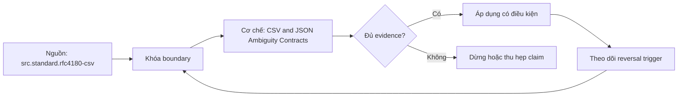

# CSV and JSON Ambiguity Contracts

> [!abstract] Câu hỏi trung tâm
> CSV và JSON quy định gì, bỏ ngỏ gì, và làm sao ngăn silent reinterpretation giữa writer với reader?

## 1. CSV có convention nhưng thiếu schema

RFC 4180 mô tả comma, CRLF, optional header, double-quote và escape; vì vậy nói CSV không quy định gì là sai. Tuy nhiên delimiter dialects, charset khi MIME metadata mất, null token, types, locale, duplicate headers, column semantics và evolution nằm ngoài file contract. Producer phải phát hành sidecar schema/dialect: delimiter, quote, escape, encoding, header, null tokens, column order/types, decimal/date/time formats và invalid-row policy.

## 2. Quoted newline và splitting

Một physical newline có thể nằm trong quoted field nên byte-range reader không được coi mỗi newline là record boundary. Split-safe reader cần state từ valid record boundary, quote-aware scan hoặc format/index hỗ trợ; compression codec cũng ảnh hưởng splittability. Chứng minh bằng file có embedded CRLF, escaped quote và multibyte UTF-8 gần boundary. So full-reader oracle với parallel splits; row count bằng nhau chưa đủ, phải hash typed records.

## 3. JSON syntax không phải application schema

JSON có object, array, string, number, boolean và null; không có timestamp, decimal, identifier hay timezone type. Duplicate object names gây interoperability differences. JSON number grammar không tự làm mất precision: loss xảy ra khi reader map vào binary64 hoặc narrow integer. Long ID nên contract là string nếu arithmetic không có nghĩa; decimal/timestamp cần representation, scale, timezone/offset và validation.

## 4. Null missing empty zero

CSV empty field, quoted empty string và configured null token có thể bị reader nhập làm một. JSON phân biệt absent member, explicit null, empty string và zero nhưng application mapping có thể collapse. Contract định nghĩa semantic states và round-trip oracle. Inference từ sample đầu file dễ chọn wrong type vì late value, leading zeros, locale decimal hoặc sparse null; production ingestion dùng explicit schema và quarantine.

## 5. JSON Lines boundary

Một JSON document có thể pretty-print nhiều lines nên arbitrary concatenation/splitting không an toàn. JSON Lines/NDJSON convention đặt một complete JSON value trên mỗi line và UTF-8, giúp line-oriented splitting khi strings encode newline as escape. File extension không chứng minh compliance. Validate each line, final newline policy, maximum record size và malformed-record behavior; multi-line JSON array không được gọi là JSON Lines.

## 6. Lab ba silent failures

Fixture chứa missing/null/empty, integer quanh binary64 exact range, timestamp có offset/DST, quoted newline, delimiter/quote và duplicate JSON keys. Mỗi writer-reader pair lưu exact config và typed canonical output. Tái hiện failure, xác định assumption conflict rồi thêm contract/schema. Pass khi corrected reader matches canonical hash và negative fixture bị reject/quarantine; parse success một mình không phải success.

## 7. Ma trận kiểm chứng từng mệnh đề

Mỗi claim cần fixture, versioned contract, counterexample và oracle ở đúng tầng. Parse/decode success, registry acceptance hoặc feature name không tự chứng minh semantic correctness.

### 7.1. Writer-reader assumption 1 phải có fixture, explicit contract và typed round-trip oracle

**Mệnh đề cần kiểm.** Writer-reader assumption 1 phải có fixture, explicit contract và typed round-trip oracle.

**Protocol cho `wiki.serialization.csv-json-ambiguity-contracts`.** Khóa source/schema versions, producer-consumer path, configuration và canonical meaning. Chạy positive, boundary và negative fixtures; lưu raw bytes/files, hashes, logs, typed output và exact failing cell. Đổi một assumption rồi ghi reversal condition.

**Bằng chứng đạt cho `wiki.serialization.csv-json-ambiguity-contracts`.** Kết quả structural và semantic được báo riêng, có independent oracle, repetitions khi đo performance, reviewer và limitation. Lab chưa chạy chỉ được ghi protocol, không ghi expected behavior như observation.

### 7.2. Writer-reader assumption 2 phải có fixture, explicit contract và typed round-trip oracle

**Mệnh đề cần kiểm.** Writer-reader assumption 2 phải có fixture, explicit contract và typed round-trip oracle.

**Protocol cho `wiki.serialization.csv-json-ambiguity-contracts`.** Khóa source/schema versions, producer-consumer path, configuration và canonical meaning. Chạy positive, boundary và negative fixtures; lưu raw bytes/files, hashes, logs, typed output và exact failing cell. Đổi một assumption rồi ghi reversal condition.

**Bằng chứng đạt cho `wiki.serialization.csv-json-ambiguity-contracts`.** Kết quả structural và semantic được báo riêng, có independent oracle, repetitions khi đo performance, reviewer và limitation. Lab chưa chạy chỉ được ghi protocol, không ghi expected behavior như observation.

### 7.3. Writer-reader assumption 3 phải có fixture, explicit contract và typed round-trip oracle

**Mệnh đề cần kiểm.** Writer-reader assumption 3 phải có fixture, explicit contract và typed round-trip oracle.

**Protocol cho `wiki.serialization.csv-json-ambiguity-contracts`.** Khóa source/schema versions, producer-consumer path, configuration và canonical meaning. Chạy positive, boundary và negative fixtures; lưu raw bytes/files, hashes, logs, typed output và exact failing cell. Đổi một assumption rồi ghi reversal condition.

**Bằng chứng đạt cho `wiki.serialization.csv-json-ambiguity-contracts`.** Kết quả structural và semantic được báo riêng, có independent oracle, repetitions khi đo performance, reviewer và limitation. Lab chưa chạy chỉ được ghi protocol, không ghi expected behavior như observation.

### 7.4. Writer-reader assumption 4 phải có fixture, explicit contract và typed round-trip oracle

**Mệnh đề cần kiểm.** Writer-reader assumption 4 phải có fixture, explicit contract và typed round-trip oracle.

**Protocol cho `wiki.serialization.csv-json-ambiguity-contracts`.** Khóa source/schema versions, producer-consumer path, configuration và canonical meaning. Chạy positive, boundary và negative fixtures; lưu raw bytes/files, hashes, logs, typed output và exact failing cell. Đổi một assumption rồi ghi reversal condition.

**Bằng chứng đạt cho `wiki.serialization.csv-json-ambiguity-contracts`.** Kết quả structural và semantic được báo riêng, có independent oracle, repetitions khi đo performance, reviewer và limitation. Lab chưa chạy chỉ được ghi protocol, không ghi expected behavior như observation.

### 7.5. Writer-reader assumption 5 phải có fixture, explicit contract và typed round-trip oracle

**Mệnh đề cần kiểm.** Writer-reader assumption 5 phải có fixture, explicit contract và typed round-trip oracle.

**Protocol cho `wiki.serialization.csv-json-ambiguity-contracts`.** Khóa source/schema versions, producer-consumer path, configuration và canonical meaning. Chạy positive, boundary và negative fixtures; lưu raw bytes/files, hashes, logs, typed output và exact failing cell. Đổi một assumption rồi ghi reversal condition.

**Bằng chứng đạt cho `wiki.serialization.csv-json-ambiguity-contracts`.** Kết quả structural và semantic được báo riêng, có independent oracle, repetitions khi đo performance, reviewer và limitation. Lab chưa chạy chỉ được ghi protocol, không ghi expected behavior như observation.

### 7.6. Writer-reader assumption 6 phải có fixture, explicit contract và typed round-trip oracle

**Mệnh đề cần kiểm.** Writer-reader assumption 6 phải có fixture, explicit contract và typed round-trip oracle.

**Protocol cho `wiki.serialization.csv-json-ambiguity-contracts`.** Khóa source/schema versions, producer-consumer path, configuration và canonical meaning. Chạy positive, boundary và negative fixtures; lưu raw bytes/files, hashes, logs, typed output và exact failing cell. Đổi một assumption rồi ghi reversal condition.

**Bằng chứng đạt cho `wiki.serialization.csv-json-ambiguity-contracts`.** Kết quả structural và semantic được báo riêng, có independent oracle, repetitions khi đo performance, reviewer và limitation. Lab chưa chạy chỉ được ghi protocol, không ghi expected behavior như observation.

### 7.7. Writer-reader assumption 7 phải có fixture, explicit contract và typed round-trip oracle

**Mệnh đề cần kiểm.** Writer-reader assumption 7 phải có fixture, explicit contract và typed round-trip oracle.

**Protocol cho `wiki.serialization.csv-json-ambiguity-contracts`.** Khóa source/schema versions, producer-consumer path, configuration và canonical meaning. Chạy positive, boundary và negative fixtures; lưu raw bytes/files, hashes, logs, typed output và exact failing cell. Đổi một assumption rồi ghi reversal condition.

**Bằng chứng đạt cho `wiki.serialization.csv-json-ambiguity-contracts`.** Kết quả structural và semantic được báo riêng, có independent oracle, repetitions khi đo performance, reviewer và limitation. Lab chưa chạy chỉ được ghi protocol, không ghi expected behavior như observation.

### 7.8. Writer-reader assumption 8 phải có fixture, explicit contract và typed round-trip oracle

**Mệnh đề cần kiểm.** Writer-reader assumption 8 phải có fixture, explicit contract và typed round-trip oracle.

**Protocol cho `wiki.serialization.csv-json-ambiguity-contracts`.** Khóa source/schema versions, producer-consumer path, configuration và canonical meaning. Chạy positive, boundary và negative fixtures; lưu raw bytes/files, hashes, logs, typed output và exact failing cell. Đổi một assumption rồi ghi reversal condition.

**Bằng chứng đạt cho `wiki.serialization.csv-json-ambiguity-contracts`.** Kết quả structural và semantic được báo riêng, có independent oracle, repetitions khi đo performance, reviewer và limitation. Lab chưa chạy chỉ được ghi protocol, không ghi expected behavior như observation.

### 7.9. Writer-reader assumption 9 phải có fixture, explicit contract và typed round-trip oracle

**Mệnh đề cần kiểm.** Writer-reader assumption 9 phải có fixture, explicit contract và typed round-trip oracle.

**Protocol cho `wiki.serialization.csv-json-ambiguity-contracts`.** Khóa source/schema versions, producer-consumer path, configuration và canonical meaning. Chạy positive, boundary và negative fixtures; lưu raw bytes/files, hashes, logs, typed output và exact failing cell. Đổi một assumption rồi ghi reversal condition.

**Bằng chứng đạt cho `wiki.serialization.csv-json-ambiguity-contracts`.** Kết quả structural và semantic được báo riêng, có independent oracle, repetitions khi đo performance, reviewer và limitation. Lab chưa chạy chỉ được ghi protocol, không ghi expected behavior như observation.

### 7.10. Writer-reader assumption 10 phải có fixture, explicit contract và typed round-trip oracle

**Mệnh đề cần kiểm.** Writer-reader assumption 10 phải có fixture, explicit contract và typed round-trip oracle.

**Protocol cho `wiki.serialization.csv-json-ambiguity-contracts`.** Khóa source/schema versions, producer-consumer path, configuration và canonical meaning. Chạy positive, boundary và negative fixtures; lưu raw bytes/files, hashes, logs, typed output và exact failing cell. Đổi một assumption rồi ghi reversal condition.

**Bằng chứng đạt cho `wiki.serialization.csv-json-ambiguity-contracts`.** Kết quả structural và semantic được báo riêng, có independent oracle, repetitions khi đo performance, reviewer và limitation. Lab chưa chạy chỉ được ghi protocol, không ghi expected behavior như observation.

### 7.11. Writer-reader assumption 11 phải có fixture, explicit contract và typed round-trip oracle

**Mệnh đề cần kiểm.** Writer-reader assumption 11 phải có fixture, explicit contract và typed round-trip oracle.

**Protocol cho `wiki.serialization.csv-json-ambiguity-contracts`.** Khóa source/schema versions, producer-consumer path, configuration và canonical meaning. Chạy positive, boundary và negative fixtures; lưu raw bytes/files, hashes, logs, typed output và exact failing cell. Đổi một assumption rồi ghi reversal condition.

**Bằng chứng đạt cho `wiki.serialization.csv-json-ambiguity-contracts`.** Kết quả structural và semantic được báo riêng, có independent oracle, repetitions khi đo performance, reviewer và limitation. Lab chưa chạy chỉ được ghi protocol, không ghi expected behavior như observation.

### 7.12. Writer-reader assumption 12 phải có fixture, explicit contract và typed round-trip oracle

**Mệnh đề cần kiểm.** Writer-reader assumption 12 phải có fixture, explicit contract và typed round-trip oracle.

**Protocol cho `wiki.serialization.csv-json-ambiguity-contracts`.** Khóa source/schema versions, producer-consumer path, configuration và canonical meaning. Chạy positive, boundary và negative fixtures; lưu raw bytes/files, hashes, logs, typed output và exact failing cell. Đổi một assumption rồi ghi reversal condition.

**Bằng chứng đạt cho `wiki.serialization.csv-json-ambiguity-contracts`.** Kết quả structural và semantic được báo riêng, có independent oracle, repetitions khi đo performance, reviewer và limitation. Lab chưa chạy chỉ được ghi protocol, không ghi expected behavior như observation.

### 7.13. Writer-reader assumption 13 phải có fixture, explicit contract và typed round-trip oracle

**Mệnh đề cần kiểm.** Writer-reader assumption 13 phải có fixture, explicit contract và typed round-trip oracle.

**Protocol cho `wiki.serialization.csv-json-ambiguity-contracts`.** Khóa source/schema versions, producer-consumer path, configuration và canonical meaning. Chạy positive, boundary và negative fixtures; lưu raw bytes/files, hashes, logs, typed output và exact failing cell. Đổi một assumption rồi ghi reversal condition.

**Bằng chứng đạt cho `wiki.serialization.csv-json-ambiguity-contracts`.** Kết quả structural và semantic được báo riêng, có independent oracle, repetitions khi đo performance, reviewer và limitation. Lab chưa chạy chỉ được ghi protocol, không ghi expected behavior như observation.

### 7.14. Writer-reader assumption 14 phải có fixture, explicit contract và typed round-trip oracle

**Mệnh đề cần kiểm.** Writer-reader assumption 14 phải có fixture, explicit contract và typed round-trip oracle.

**Protocol cho `wiki.serialization.csv-json-ambiguity-contracts`.** Khóa source/schema versions, producer-consumer path, configuration và canonical meaning. Chạy positive, boundary và negative fixtures; lưu raw bytes/files, hashes, logs, typed output và exact failing cell. Đổi một assumption rồi ghi reversal condition.

**Bằng chứng đạt cho `wiki.serialization.csv-json-ambiguity-contracts`.** Kết quả structural và semantic được báo riêng, có independent oracle, repetitions khi đo performance, reviewer và limitation. Lab chưa chạy chỉ được ghi protocol, không ghi expected behavior như observation.

### 7.15. Writer-reader assumption 15 phải có fixture, explicit contract và typed round-trip oracle

**Mệnh đề cần kiểm.** Writer-reader assumption 15 phải có fixture, explicit contract và typed round-trip oracle.

**Protocol cho `wiki.serialization.csv-json-ambiguity-contracts`.** Khóa source/schema versions, producer-consumer path, configuration và canonical meaning. Chạy positive, boundary và negative fixtures; lưu raw bytes/files, hashes, logs, typed output và exact failing cell. Đổi một assumption rồi ghi reversal condition.

**Bằng chứng đạt cho `wiki.serialization.csv-json-ambiguity-contracts`.** Kết quả structural và semantic được báo riêng, có independent oracle, repetitions khi đo performance, reviewer và limitation. Lab chưa chạy chỉ được ghi protocol, không ghi expected behavior như observation.

## 8. Quy trình phản biện

1. Tách syntax/wire, structural compatibility, generated API và business semantics.
2. Ghi direction bằng writer–reader versions, không chỉ dùng nhãn backward/forward.
3. Khóa canonical meaning và negative fixtures trước implementation.
4. Giữ source bytes/schema fingerprints để tái hiện.
5. Mọi default, cache, inference hoặc registry policy đều là explicit configuration.
6. Viết rollout, rollback và reversal condition trước merge.

## 9. Câu hỏi tự kiểm tra

1. Identity nằm ở name, position, field number hay stable ID?
2. Parser biết điều gì và application phải biết điều gì?
3. Cell/version nào chưa được test?
4. Decode sạch có thể sai nghĩa ở đâu?
5. Intermediate system có làm mất thông tin không?
6. Evidence nào mới là protocol?

## 10. Giới hạn và điều chưa cho phép kết luận

- Chưa chạy benchmark engine hoặc compatibility matrix bằng libraries/registry thật.
- Specifications được kiểm ngày 2026-10-01; library, generated API và registry behavior cần pin version.
- Curriculum matrices là synthesis; không gán nguyên văn cho một source.
- Note giữ trạng thái `review` tới khi chủ dự án duyệt.

## Reference
1. [[SRC-RFC-4180-CSV]]
2. [[SRC-RFC-8259-JSON]]

## Source coverage

| Source slice | Nội dung sử dụng | Trạng thái |
|---|---|---|
| [[SRC-RFC-4180-CSV]] | Normative rule, architecture boundary hoặc decision evidence | Đã đọc locator; không suy ngoài phạm vi |
| [[SRC-RFC-8259-JSON]] | Normative rule, architecture boundary hoặc decision evidence | Đã đọc locator; không suy ngoài phạm vi |

## Key takeaways
- Structural success và semantic correctness là hai gates riêng.
- Writer–reader direction, version history và exact fixtures phải hiện trong evidence.
- Defaults, aliases, unknown fields và registry modes có scope cụ thể; không dùng như bảo đảm chung.
- Chưa chạy lab thì note là giáo trình/protocol, chưa phải production certification.

<!-- ATOMIC-EXECUTION-CAPSULE:START -->

## Execution capsule — kiểm chứng `wiki.serialization.csv-json-ambiguity-contracts`

> [!important] Phân loại mệnh đề
> Với `wiki.serialization.csv-json-ambiguity-contracts`, sơ đồ, ví dụ và artifact về **CSV and JSON Ambiguity Contracts** là **synthesis để kiểm chứng**; chúng không phải trích dẫn hay case nguyên văn của nguồn.

### Sơ đồ cơ chế và điểm kiểm soát



Đọc sơ đồ `wiki.serialization.csv-json-ambiguity-contracts` từ trái sang phải: source chỉ cung cấp claim ban đầu cho **CSV and JSON Ambiguity Contracts**; quyết định chỉ được đi tiếp sau khi boundary, evidence và điều kiện đảo quyết định đã hiện hữu.

### Ví dụ làm việc có thể bác bỏ

**Input.** Một đội cần trả lời: “CSV và JSON quy định gì, bỏ ngỏ gì, và làm sao ngăn silent reinterpretation giữa writer với reader?” cho một phạm vi nhỏ, có owner và deadline rõ.

**Decision.** Đội áp dụng **CSV and JSON Ambiguity Contracts** trên control và variant chỉ khác một assumption; expected result và hard constraints được khóa trước khi chạy.

**Outcome.** Với `wiki.serialization.csv-json-ambiguity-contracts`, nếu observation vi phạm hard constraint hoặc oracle độc lập không xác nhận **CSV and JSON Ambiguity Contracts**, đội thu hẹp claim hay đảo quyết định. Nếu đạt, kết luận vẫn kèm scope, version và review date; một lần thành công không được nâng thành quy luật phổ quát.

### Artifact thực thi tối thiểu

```sql
-- Verification harness for: CSV and JSON Ambiguity Contracts
WITH evidence AS (
    SELECT 'wiki.serialization.csv-json-ambiguity-contracts' AS concept_id,
           'boundary_declared' AS check_name, 1 AS passed
    UNION ALL
    SELECT 'wiki.serialization.csv-json-ambiguity-contracts', 'independent_oracle', 1
    UNION ALL
    SELECT 'wiki.serialization.csv-json-ambiguity-contracts', 'reversal_trigger_recorded', 1
)
SELECT concept_id,
       MIN(passed) AS all_hard_checks_pass,
       COUNT(*) AS evidence_items
FROM evidence
GROUP BY concept_id
HAVING MIN(passed) = 1;
```

Artifact của `wiki.serialization.csv-json-ambiguity-contracts` buộc người dùng ghi boundary, oracle và reversal trigger cho **CSV and JSON Ambiguity Contracts**. Các giá trị minh họa phải được thay bằng evidence thật trước khi dùng cho quyết định.

### Tự kiểm tra trước khi tái sử dụng

1. Bạn có thể trả lời `CSV và JSON quy định gì, bỏ ngỏ gì, và làm sao ngăn silent reinterpretation giữa writer với reader?` bằng một câu mà không kéo thêm concept thứ hai không?
2. Source locator nào đỡ cho claim, và phần nào chỉ là synthesis trong note?
3. Observation nào khiến bạn dừng, thu hẹp hoặc đảo quyết định?
4. Artifact nào cho phép một reviewer độc lập tái hiện kết quả?

<!-- ATOMIC-EXECUTION-CAPSULE:END -->
