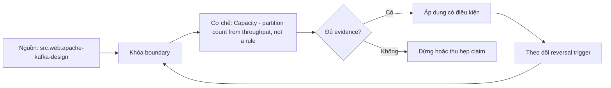

# Capacity - partition count from throughput, not a rule

> [!abstract] Câu hỏi trung tâm
> Partition count được suy từ throughput, consumer parallelism, key skew và recovery constraints ra sao thay vì theo một con số truyền miệng?

## 1. Workload vector

Ghi ingress/egress bytes, records, batch sizes, compression, retention, replication, peak factor và growth horizon. Đừng bắt đầu bằng tên công cụ. Hãy bắt đầu bằng đối tượng được bảo vệ, boundary quan sát được và hậu quả nếu kết luận sai. Trong bài `Capacity - partition count from throughput, not a rule`, câu hỏi thực dụng là: Partition count được suy từ throughput, consumer parallelism, key skew và recovery constraints ra sao thay vì theo một con số truyền miệng? Ta ghi rõ grain, population, time window, owner và hành động sau failure; nếu một trường chưa biết thì đánh dấu unknown thay vì lấp bằng mặc định. Bằng chứng tối thiểu gồm fixture có version, cấu hình hoặc rule đã resolve, raw observation, expected result và limitation. Phần này là curriculum synthesis dựa trên các nguồn đã định danh, không phải lời hứa rằng mọi adapter hay deployment đều có cùng hành vi.

## 2. Per-partition benchmark

Đo producer, broker disk/network và consumer throughput trên hardware/config/version đích; không dùng vendor headline. Điểm khó không nằm ở cú pháp mà ở identity và scope. Hai phép đo cùng tên vẫn có thể nói về hai population hoặc hai thời điểm khác nhau. Trong bài `Capacity - partition count from throughput, not a rule`, câu hỏi thực dụng là: Partition count được suy từ throughput, consumer parallelism, key skew và recovery constraints ra sao thay vì theo một con số truyền miệng? Ta ghi rõ grain, population, time window, owner và hành động sau failure; nếu một trường chưa biết thì đánh dấu unknown thay vì lấp bằng mặc định. Bằng chứng tối thiểu gồm fixture có version, cấu hình hoặc rule đã resolve, raw observation, expected result và limitation. Phần này là curriculum synthesis dựa trên các nguồn đã định danh, không phải lời hứa rằng mọi adapter hay deployment đều có cùng hành vi.

## 3. Parallelism bound

Trong một group, active consumers hữu ích bị giới hạn bởi partitions; nhiều groups nhân read/network load. Một dashboard xanh chỉ là tín hiệu. Muốn biến nó thành bằng chứng phải giữ input, phiên bản, rule, trạng thái trước–sau và cách tính độc lập. Trong bài `Capacity - partition count from throughput, not a rule`, câu hỏi thực dụng là: Partition count được suy từ throughput, consumer parallelism, key skew và recovery constraints ra sao thay vì theo một con số truyền miệng? Ta ghi rõ grain, population, time window, owner và hành động sau failure; nếu một trường chưa biết thì đánh dấu unknown thay vì lấp bằng mặc định. Bằng chứng tối thiểu gồm fixture có version, cấu hình hoặc rule đã resolve, raw observation, expected result và limitation. Phần này là curriculum synthesis dựa trên các nguồn đã định danh, không phải lời hứa rằng mọi adapter hay deployment đều có cùng hành vi.

## 4. Skew and keys

Average throughput che hot keys/tenants; partition count cao hơn không tự chia một hot key. Thiết kế tốt phải chịu được counterexample. Hãy chủ động tạo case sát boundary, case thiếu dữ liệu và case replay thay vì chỉ chạy happy path. Trong bài `Capacity - partition count from throughput, not a rule`, câu hỏi thực dụng là: Partition count được suy từ throughput, consumer parallelism, key skew và recovery constraints ra sao thay vì theo một con số truyền miệng? Ta ghi rõ grain, population, time window, owner và hành động sau failure; nếu một trường chưa biết thì đánh dấu unknown thay vì lấp bằng mặc định. Bằng chứng tối thiểu gồm fixture có version, cấu hình hoặc rule đã resolve, raw observation, expected result và limitation. Phần này là curriculum synthesis dựa trên các nguồn đã định danh, không phải lời hứa rằng mọi adapter hay deployment đều có cùng hành vi.

## 5. Operational cost

Mỗi partition tăng metadata, file handles, replication/recovery work, rebalance và controller load. Chi phí vận hành thuộc contract. Một rule đúng nhưng quá đắt, quá ồn hoặc không có owner sẽ nhanh chóng bị tắt và mất tác dụng. Trong bài `Capacity - partition count from throughput, not a rule`, câu hỏi thực dụng là: Partition count được suy từ throughput, consumer parallelism, key skew và recovery constraints ra sao thay vì theo một con số truyền miệng? Ta ghi rõ grain, population, time window, owner và hành động sau failure; nếu một trường chưa biết thì đánh dấu unknown thay vì lấp bằng mặc định. Bằng chứng tối thiểu gồm fixture có version, cấu hình hoặc rule đã resolve, raw observation, expected result và limitation. Phần này là curriculum synthesis dựa trên các nguồn đã định danh, không phải lời hứa rằng mọi adapter hay deployment đều có cùng hành vi.

## 6. Sizing decision

Chọn count với headroom và reversal triggers; benchmark failover, backlog drain và expansion behavior trước release. Kết luận cần có điều kiện đảo chiều. Khi volume, latency, nguồn thẩm quyền hoặc topology đổi, quyết định cũ phải được xem xét lại bằng cùng một oracle. Trong bài `Capacity - partition count from throughput, not a rule`, câu hỏi thực dụng là: Partition count được suy từ throughput, consumer parallelism, key skew và recovery constraints ra sao thay vì theo một con số truyền miệng? Ta ghi rõ grain, population, time window, owner và hành động sau failure; nếu một trường chưa biết thì đánh dấu unknown thay vì lấp bằng mặc định. Bằng chứng tối thiểu gồm fixture có version, cấu hình hoặc rule đã resolve, raw observation, expected result và limitation. Phần này là curriculum synthesis dựa trên các nguồn đã định danh, không phải lời hứa rằng mọi adapter hay deployment đều có cùng hành vi.

## 7. Ma trận kiểm chứng từng mệnh đề

Với `wiki.streaming.kafka-partition-capacity`, command thành công không tự chứng minh dữ liệu đúng. Protocol riêng của bài là: Dựng version-pinned fixture, inject compatibility/capacity/failure/change case và đối soát emitted/visible state bằng oracle độc lập. Mỗi probe dưới đây phải nối input boundary với failure signal và oracle có thể phản bác kết luận.

### 7.1. Capacity - partition count from throughput, not a rule: kiểm `Workload vector` bằng case 1, cụ thể ghi ingress/egress bytes, records, batch sizes, compression, retention, replication, peak factor và growth horizon

**Mệnh đề cần kiểm.** Capacity - partition count from throughput, not a rule: kiểm `Workload vector` bằng case 1, cụ thể ghi ingress/egress bytes, records, batch sizes, compression, retention, replication, peak factor và growth horizon.

**Thiết kế phép thử cho `wiki.streaming.kafka-partition-capacity`.** Trong ngữ cảnh `wiki.streaming.kafka-partition-capacity`, tạo positive control và negative control chỉ khác đúng một điều kiện. Khóa input snapshot, phiên bản và owner của rule; chạy đúng population được bài `Capacity - partition count from throughput, not a rule` công bố.

**Bằng chứng cần giữ.** Đối với probe 1 của `Capacity - partition count from throughput, not a rule`, giữ fixture, raw failing rows và lệnh tái hiện. Nếu chưa chạy lab, ghi expected evidence và giữ trạng thái review; không biến protocol thành observation.

### 7.2. Capacity - partition count from throughput, not a rule: kiểm `Per-partition benchmark` bằng case 2, cụ thể đo producer, broker disk/network và consumer throughput trên hardware/config/version đích; không dùng vendor headline

**Mệnh đề cần kiểm.** Capacity - partition count from throughput, not a rule: kiểm `Per-partition benchmark` bằng case 2, cụ thể đo producer, broker disk/network và consumer throughput trên hardware/config/version đích; không dùng vendor headline.

**Thiết kế phép thử cho `wiki.streaming.kafka-partition-capacity`.** Trong ngữ cảnh `wiki.streaming.kafka-partition-capacity`, đổi grain nhưng giữ tổng số dòng để lộ phép đo sai cấp. Khóa input snapshot, phiên bản và owner của rule; chạy đúng population được bài `Capacity - partition count from throughput, not a rule` công bố.

**Bằng chứng cần giữ.** Đối với probe 2 của `Capacity - partition count from throughput, not a rule`, báo numerator, denominator và key set ở cả hai grain. Nếu chưa chạy lab, ghi expected evidence và giữ trạng thái review; không biến protocol thành observation.

### 7.3. Capacity - partition count from throughput, not a rule: kiểm `Parallelism bound` bằng case 3, cụ thể trong một group, active consumers hữu ích bị giới hạn bởi partitions; nhiều groups nhân read/network load

**Mệnh đề cần kiểm.** Capacity - partition count from throughput, not a rule: kiểm `Parallelism bound` bằng case 3, cụ thể trong một group, active consumers hữu ích bị giới hạn bởi partitions; nhiều groups nhân read/network load.

**Thiết kế phép thử cho `wiki.streaming.kafka-partition-capacity`.** Trong ngữ cảnh `wiki.streaming.kafka-partition-capacity`, đưa một giá trị tới đúng boundary và một giá trị vượt boundary. Khóa input snapshot, phiên bản và owner của rule; chạy đúng population được bài `Capacity - partition count from throughput, not a rule` công bố.

**Bằng chứng cần giữ.** Đối với probe 3 của `Capacity - partition count from throughput, not a rule`, lưu hai observed values cùng rule đã resolve. Nếu chưa chạy lab, ghi expected evidence và giữ trạng thái review; không biến protocol thành observation.

### 7.4. Capacity - partition count from throughput, not a rule: kiểm `Skew and keys` bằng case 4, cụ thể average throughput che hot keys/tenants; partition count cao hơn không tự chia một hot key

**Mệnh đề cần kiểm.** Capacity - partition count from throughput, not a rule: kiểm `Skew and keys` bằng case 4, cụ thể average throughput che hot keys/tenants; partition count cao hơn không tự chia một hot key.

**Thiết kế phép thử cho `wiki.streaming.kafka-partition-capacity`.** Trong ngữ cảnh `wiki.streaming.kafka-partition-capacity`, kill tiến trình ngay trước rồi ngay sau durable side effect. Khóa input snapshot, phiên bản và owner của rule; chạy đúng population được bài `Capacity - partition count from throughput, not a rule` công bố.

**Bằng chứng cần giữ.** Đối với probe 4 của `Capacity - partition count from throughput, not a rule`, lưu checkpoint, external ledger và trạng thái sau restart. Nếu chưa chạy lab, ghi expected evidence và giữ trạng thái review; không biến protocol thành observation.

### 7.5. Capacity - partition count from throughput, not a rule: kiểm `Operational cost` bằng case 5, cụ thể mỗi partition tăng metadata, file handles, replication/recovery work, rebalance và controller load

**Mệnh đề cần kiểm.** Capacity - partition count from throughput, not a rule: kiểm `Operational cost` bằng case 5, cụ thể mỗi partition tăng metadata, file handles, replication/recovery work, rebalance và controller load.

**Thiết kế phép thử cho `wiki.streaming.kafka-partition-capacity`.** Trong ngữ cảnh `wiki.streaming.kafka-partition-capacity`, đảo thứ tự input và concurrency nhưng giữ logical population. Khóa input snapshot, phiên bản và owner của rule; chạy đúng population được bài `Capacity - partition count from throughput, not a rule` công bố.

**Bằng chứng cần giữ.** Đối với probe 5 của `Capacity - partition count from throughput, not a rule`, so canonical hash và business totals giữa các thứ tự. Nếu chưa chạy lab, ghi expected evidence và giữ trạng thái review; không biến protocol thành observation.

### 7.6. Capacity - partition count from throughput, not a rule: kiểm `Sizing decision` bằng case 6, cụ thể chọn count với headroom và reversal triggers; benchmark failover, backlog drain và expansion behavior trước release

**Mệnh đề cần kiểm.** Capacity - partition count from throughput, not a rule: kiểm `Sizing decision` bằng case 6, cụ thể chọn count với headroom và reversal triggers; benchmark failover, backlog drain và expansion behavior trước release.

**Thiết kế phép thử cho `wiki.streaming.kafka-partition-capacity`.** Trong ngữ cảnh `wiki.streaming.kafka-partition-capacity`, replay cùng identity với payload giống rồi payload xung đột. Khóa input snapshot, phiên bản và owner của rule; chạy đúng population được bài `Capacity - partition count from throughput, not a rule` công bố.

**Bằng chứng cần giữ.** Đối với probe 6 của `Capacity - partition count from throughput, not a rule`, tách duplicate replay khỏi identity collision bằng reason code. Nếu chưa chạy lab, ghi expected evidence và giữ trạng thái review; không biến protocol thành observation.

### 7.7. Capacity - partition count from throughput, not a rule: kiểm `Workload vector` bằng case 7, cụ thể ghi ingress/egress bytes, records, batch sizes, compression, retention, replication, peak factor và growth horizon

**Mệnh đề cần kiểm.** Capacity - partition count from throughput, not a rule: kiểm `Workload vector` bằng case 7, cụ thể ghi ingress/egress bytes, records, batch sizes, compression, retention, replication, peak factor và growth horizon.

**Thiết kế phép thử cho `wiki.streaming.kafka-partition-capacity`.** Trong ngữ cảnh `wiki.streaming.kafka-partition-capacity`, thêm record tới trễ trong horizon và ngoài horizon. Khóa input snapshot, phiên bản và owner của rule; chạy đúng population được bài `Capacity - partition count from throughput, not a rule` công bố.

**Bằng chứng cần giữ.** Đối với probe 7 của `Capacity - partition count from throughput, not a rule`, báo accepted-late, rejected-late và oldest outstanding timestamp. Nếu chưa chạy lab, ghi expected evidence và giữ trạng thái review; không biến protocol thành observation.

### 7.8. Capacity - partition count from throughput, not a rule: kiểm `Per-partition benchmark` bằng case 8, cụ thể đo producer, broker disk/network và consumer throughput trên hardware/config/version đích; không dùng vendor headline

**Mệnh đề cần kiểm.** Capacity - partition count from throughput, not a rule: kiểm `Per-partition benchmark` bằng case 8, cụ thể đo producer, broker disk/network và consumer throughput trên hardware/config/version đích; không dùng vendor headline.

**Thiết kế phép thử cho `wiki.streaming.kafka-partition-capacity`.** Trong ngữ cảnh `wiki.streaming.kafka-partition-capacity`, đổi schema theo một cách tương thích rồi một cách phá vỡ semantics. Khóa input snapshot, phiên bản và owner của rule; chạy đúng population được bài `Capacity - partition count from throughput, not a rule` công bố.

**Bằng chứng cần giữ.** Đối với probe 8 của `Capacity - partition count from throughput, not a rule`, giữ schema diff, classification và consumer-visible result. Nếu chưa chạy lab, ghi expected evidence và giữ trạng thái review; không biến protocol thành observation.

### 7.9. Capacity - partition count from throughput, not a rule: kiểm `Parallelism bound` bằng case 9, cụ thể trong một group, active consumers hữu ích bị giới hạn bởi partitions; nhiều groups nhân read/network load

**Mệnh đề cần kiểm.** Capacity - partition count from throughput, not a rule: kiểm `Parallelism bound` bằng case 9, cụ thể trong một group, active consumers hữu ích bị giới hạn bởi partitions; nhiều groups nhân read/network load.

**Thiết kế phép thử cho `wiki.streaming.kafka-partition-capacity`.** Trong ngữ cảnh `wiki.streaming.kafka-partition-capacity`, tạo missing và duplicate bù nhau để count tổng không đổi. Khóa input snapshot, phiên bản và owner của rule; chạy đúng population được bài `Capacity - partition count from throughput, not a rule` công bố.

**Bằng chứng cần giữ.** Đối với probe 9 của `Capacity - partition count from throughput, not a rule`, so key multiset và typed hashes thay vì chỉ row count. Nếu chưa chạy lab, ghi expected evidence và giữ trạng thái review; không biến protocol thành observation.

### 7.10. Capacity - partition count from throughput, not a rule: kiểm `Skew and keys` bằng case 10, cụ thể average throughput che hot keys/tenants; partition count cao hơn không tự chia một hot key

**Mệnh đề cần kiểm.** Capacity - partition count from throughput, not a rule: kiểm `Skew and keys` bằng case 10, cụ thể average throughput che hot keys/tenants; partition count cao hơn không tự chia một hot key.

**Thiết kế phép thử cho `wiki.streaming.kafka-partition-capacity`.** Trong ngữ cảnh `wiki.streaming.kafka-partition-capacity`, cho reviewer tái hiện chỉ từ evidence package. Khóa input snapshot, phiên bản và owner của rule; chạy đúng population được bài `Capacity - partition count from throughput, not a rule` công bố.

**Bằng chứng cần giữ.** Đối với probe 10 của `Capacity - partition count from throughput, not a rule`, package phải đủ để người khác dựng lại decision và limitation. Nếu chưa chạy lab, ghi expected evidence và giữ trạng thái review; không biến protocol thành observation.

### 7.11. Capacity - partition count from throughput, not a rule: kiểm `Operational cost` bằng case 11, cụ thể mỗi partition tăng metadata, file handles, replication/recovery work, rebalance và controller load

**Mệnh đề cần kiểm.** Capacity - partition count from throughput, not a rule: kiểm `Operational cost` bằng case 11, cụ thể mỗi partition tăng metadata, file handles, replication/recovery work, rebalance và controller load.

**Thiết kế phép thử cho `wiki.streaming.kafka-partition-capacity`.** Trong ngữ cảnh `wiki.streaming.kafka-partition-capacity`, so với oracle độc lập không dùng chung query hoặc parser. Khóa input snapshot, phiên bản và owner của rule; chạy đúng population được bài `Capacity - partition count from throughput, not a rule` công bố.

**Bằng chứng cần giữ.** Đối với probe 11 của `Capacity - partition count from throughput, not a rule`, independent result phải khớp ở grain đã công bố. Nếu chưa chạy lab, ghi expected evidence và giữ trạng thái review; không biến protocol thành observation.

### 7.12. Capacity - partition count from throughput, not a rule: kiểm `Sizing decision` bằng case 12, cụ thể chọn count với headroom và reversal triggers; benchmark failover, backlog drain và expansion behavior trước release

**Mệnh đề cần kiểm.** Capacity - partition count from throughput, not a rule: kiểm `Sizing decision` bằng case 12, cụ thể chọn count với headroom và reversal triggers; benchmark failover, backlog drain và expansion behavior trước release.

**Thiết kế phép thử cho `wiki.streaming.kafka-partition-capacity`.** Trong ngữ cảnh `wiki.streaming.kafka-partition-capacity`, chạy scope hẹp và population đầy đủ rồi công bố phần bị loại. Khóa input snapshot, phiên bản và owner của rule; chạy đúng population được bài `Capacity - partition count from throughput, not a rule` công bố.

**Bằng chứng cần giữ.** Đối với probe 12 của `Capacity - partition count from throughput, not a rule`, coverage phải nêu rõ excluded nodes, partitions hoặc incidents. Nếu chưa chạy lab, ghi expected evidence và giữ trạng thái review; không biến protocol thành observation.

### 7.13. Capacity - partition count from throughput, not a rule: kiểm `Workload vector` bằng case 13, cụ thể ghi ingress/egress bytes, records, batch sizes, compression, retention, replication, peak factor và growth horizon

**Mệnh đề cần kiểm.** Capacity - partition count from throughput, not a rule: kiểm `Workload vector` bằng case 13, cụ thể ghi ingress/egress bytes, records, batch sizes, compression, retention, replication, peak factor và growth horizon.

**Thiết kế phép thử cho `wiki.streaming.kafka-partition-capacity`.** Trong ngữ cảnh `wiki.streaming.kafka-partition-capacity`, thử timezone, precision hoặc partition ở hai phía của ranh giới. Khóa input snapshot, phiên bản và owner của rule; chạy đúng population được bài `Capacity - partition count from throughput, not a rule` công bố.

**Bằng chứng cần giữ.** Đối với probe 13 của `Capacity - partition count from throughput, not a rule`, UTC/local interval và rounding policy phải hiện trong output. Nếu chưa chạy lab, ghi expected evidence và giữ trạng thái review; không biến protocol thành observation.

### 7.14. Capacity - partition count from throughput, not a rule: kiểm `Per-partition benchmark` bằng case 14, cụ thể đo producer, broker disk/network và consumer throughput trên hardware/config/version đích; không dùng vendor headline

**Mệnh đề cần kiểm.** Capacity - partition count from throughput, not a rule: kiểm `Per-partition benchmark` bằng case 14, cụ thể đo producer, broker disk/network và consumer throughput trên hardware/config/version đích; không dùng vendor headline.

**Thiết kế phép thử cho `wiki.streaming.kafka-partition-capacity`.** Trong ngữ cảnh `wiki.streaming.kafka-partition-capacity`, đổi constraint đủ lớn để quyết định phải đảo. Khóa input snapshot, phiên bản và owner của rule; chạy đúng population được bài `Capacity - partition count from throughput, not a rule` công bố.

**Bằng chứng cần giữ.** Đối với probe 14 của `Capacity - partition count from throughput, not a rule`, ADR phải lưu changed constraint và reversal threshold. Nếu chưa chạy lab, ghi expected evidence và giữ trạng thái review; không biến protocol thành observation.

### 7.15. Capacity - partition count from throughput, not a rule: kiểm `Parallelism bound` bằng case 15, cụ thể trong một group, active consumers hữu ích bị giới hạn bởi partitions; nhiều groups nhân read/network load

**Mệnh đề cần kiểm.** Capacity - partition count from throughput, not a rule: kiểm `Parallelism bound` bằng case 15, cụ thể trong một group, active consumers hữu ích bị giới hạn bởi partitions; nhiều groups nhân read/network load.

**Thiết kế phép thử cho `wiki.streaming.kafka-partition-capacity`.** Trong ngữ cảnh `wiki.streaming.kafka-partition-capacity`, chạy lại từ môi trường sạch với versions và seed đã khóa. Khóa input snapshot, phiên bản và owner của rule; chạy đúng population được bài `Capacity - partition count from throughput, not a rule` công bố.

**Bằng chứng cần giữ.** Đối với probe 15 của `Capacity - partition count from throughput, not a rule`, canonical result phải ổn định hoặc mọi nondeterminism phải được giải thích. Nếu chưa chạy lab, ghi expected evidence và giữ trạng thái review; không biến protocol thành observation.

## 8. Quy trình phản biện

1. Viết consumer-visible invariant cho `Capacity - partition count from throughput, not a rule` trước khi chọn query hoặc tool.
2. Khóa grain, identity, population, time window và authoritative source.
3. Phân biệt declared configuration, executed state và published state.
4. Chạy negative control, replay hoặc changed-assumption case phù hợp.
5. Đối soát bằng oracle độc lập; công bố coverage và phần không quan sát được.
6. Gắn owner, hành động, reversal trigger và hạn review cho kết luận.

## 9. Câu hỏi tự kiểm tra

1. `Capacity - partition count from throughput, not a rule: kiểm `Workload vector` bằng case 1, cụ thể ghi ingress/egress bytes, records, batch sizes, compression, retention, replication, peak factor và growth horizon` thất bại đầu tiên ở boundary nào?
2. Artifact nào mạnh nhất để trả lời `Capacity - partition count from throughput, not a rule: kiểm `Parallelism bound` bằng case 3, cụ thể trong một group, active consumers hữu ích bị giới hạn bởi partitions; nhiều groups nhân read/network load`?
3. Counterexample nhỏ nhất cho `Capacity - partition count from throughput, not a rule: kiểm `Sizing decision` bằng case 6, cụ thể chọn count với headroom và reversal triggers; benchmark failover, backlog drain và expansion behavior trước release` gồm những state nào?
4. `Capacity - partition count from throughput, not a rule: kiểm `Parallelism bound` bằng case 9, cụ thể trong một group, active consumers hữu ích bị giới hạn bởi partitions; nhiều groups nhân read/network load` có thể xanh giả ra sao?
5. Constraint nào khiến quyết định ở `Capacity - partition count from throughput, not a rule: kiểm `Per-partition benchmark` bằng case 14, cụ thể đo producer, broker disk/network và consumer throughput trên hardware/config/version đích; không dùng vendor headline` phải đảo?
6. Phần nào của `Capacity - partition count from throughput, not a rule: kiểm `Parallelism bound` bằng case 15, cụ thể trong một group, active consumers hữu ích bị giới hạn bởi partitions; nhiều groups nhân read/network load` mới là protocol, chưa phải observation?

## 10. Giới hạn và điều chưa cho phép kết luận

- Lab của `Capacity - partition count from throughput, not a rule` chưa chạy trên hệ thống production; nội dung là giáo trình và expected evidence.
- Hành vi phụ thuộc phiên bản, connector, scheduler, warehouse và catalog configuration phải được kiểm lại.
- Các ma trận, ladder và threshold do giáo trình tổng hợp không được gán nguyên văn cho vendor.
- Note giữ trạng thái `review` cho tới khi owner duyệt semantics và learner artifact.

## Reference
1. [[SRC-APACHE-KAFKA-DESIGN]]
2. [[SRC-APACHE-KAFKA-BROKER-CONFIG]]
3. [[SRC-APACHE-KAFKA-CONSUMER-CONFIG]]

## Source coverage

| Source slice | Nội dung sử dụng | Trạng thái |
|---|---|---|
| [[SRC-APACHE-KAFKA-DESIGN]] | Contract hoặc cơ chế liên quan trực tiếp tới `Capacity - partition count from throughput, not a rule` | Đã đọc locator; cần pin version khi chạy lab |
| [[SRC-APACHE-KAFKA-BROKER-CONFIG]] | Contract hoặc cơ chế liên quan trực tiếp tới `Capacity - partition count from throughput, not a rule` | Đã đọc locator; cần pin version khi chạy lab |
| [[SRC-APACHE-KAFKA-CONSUMER-CONFIG]] | Contract hoặc cơ chế liên quan trực tiếp tới `Capacity - partition count from throughput, not a rule` | Đã đọc locator; cần pin version khi chạy lab |

## Key takeaways
- Partition count là kết quả capacity model và benchmark, không phải hằng số.
- Với `wiki.streaming.kafka-partition-capacity`, quality của kết luận phụ thuộc identity, coverage và oracle chứ không phụ thuộc màu dashboard.
- Câu hỏi `Partition count được suy từ throughput, consumer parallelism, key skew và recovery constraints ra sao thay vì theo một con số truyền miệng?` chỉ được trả lời trong scope và version đã ghi.
- Các source IDs `src.web.apache-kafka-design, src.web.apache-kafka-broker-config, src.web.apache-kafka-consumer-config` đặt ranh giới cho source fact; phần còn lại là synthesis có nhãn.
- Trước khi lab chạy, đây là note đã kiểm cấu trúc và provenance, chưa phải chứng nhận production.

<!-- ATOMIC-EXECUTION-CAPSULE:START -->

## Execution capsule — kiểm chứng `wiki.streaming.kafka-partition-capacity`

> [!important] Phân loại mệnh đề
> Với `wiki.streaming.kafka-partition-capacity`, sơ đồ, ví dụ và artifact về **Capacity - partition count from throughput, not a rule** là **synthesis để kiểm chứng**; chúng không phải trích dẫn hay case nguyên văn của nguồn.

### Sơ đồ cơ chế và điểm kiểm soát



Đọc sơ đồ `wiki.streaming.kafka-partition-capacity` từ trái sang phải: source chỉ cung cấp claim ban đầu cho **Capacity - partition count from throughput, not a rule**; quyết định chỉ được đi tiếp sau khi boundary, evidence và điều kiện đảo quyết định đã hiện hữu.

### Artifact thực thi tối thiểu

```sql
-- Verification harness for: Capacity - partition count from throughput, not a rule
WITH evidence AS (
    SELECT 'wiki.streaming.kafka-partition-capacity' AS concept_id,
           'boundary_declared' AS check_name, 1 AS passed
    UNION ALL
    SELECT 'wiki.streaming.kafka-partition-capacity', 'independent_oracle', 1
    UNION ALL
    SELECT 'wiki.streaming.kafka-partition-capacity', 'reversal_trigger_recorded', 1
)
SELECT concept_id,
       MIN(passed) AS all_hard_checks_pass,
       COUNT(*) AS evidence_items
FROM evidence
GROUP BY concept_id
HAVING MIN(passed) = 1;
```

Artifact của `wiki.streaming.kafka-partition-capacity` buộc người dùng ghi boundary, oracle và reversal trigger cho **Capacity - partition count from throughput, not a rule**. Các giá trị minh họa phải được thay bằng evidence thật trước khi dùng cho quyết định.

### Tự kiểm tra trước khi tái sử dụng

1. Bạn có thể trả lời `Partition count được suy từ throughput, consumer parallelism, key skew và recovery constraints ra sao thay vì theo một con số truyền miệng?` bằng một câu mà không kéo thêm concept thứ hai không?
2. Source locator nào đỡ cho claim, và phần nào chỉ là synthesis trong note?
3. Observation nào khiến bạn dừng, thu hẹp hoặc đảo quyết định?
4. Artifact nào cho phép một reviewer độc lập tái hiện kết quả?

<!-- ATOMIC-EXECUTION-CAPSULE:END -->
