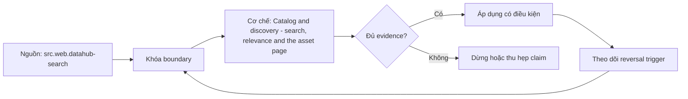

# Catalog and discovery - search, relevance and the asset page

> [!abstract] Câu hỏi trung tâm
> Catalog giúp người dùng tìm đúng asset bằng relevance và asset page có bằng chứng như thế nào?

## 1. Retrieval job

Định nghĩa representative queries theo persona và decision; search success là tìm được asset dùng được chứ không chỉ có kết quả. Đừng bắt đầu bằng tên công cụ. Hãy bắt đầu bằng đối tượng được bảo vệ, boundary quan sát được và hậu quả nếu kết luận sai. Trong bài `Catalog and discovery - search, relevance and the asset page`, câu hỏi thực dụng là: Catalog giúp người dùng tìm đúng asset bằng relevance và asset page có bằng chứng như thế nào? Ta ghi rõ grain, population, time window, owner và hành động sau failure; nếu một trường chưa biết thì đánh dấu unknown thay vì lấp bằng mặc định. Bằng chứng tối thiểu gồm fixture có version, cấu hình hoặc rule đã resolve, raw observation, expected result và limitation. Phần này là curriculum synthesis dựa trên các nguồn đã định danh, không phải lời hứa rằng mọi adapter hay deployment đều có cùng hành vi.

## 2. Indexable signals

Name, description, glossary, owners, platform, schema, tags và usage có authority/freshness khác nhau. Điểm khó không nằm ở cú pháp mà ở identity và scope. Hai phép đo cùng tên vẫn có thể nói về hai population hoặc hai thời điểm khác nhau. Trong bài `Catalog and discovery - search, relevance and the asset page`, câu hỏi thực dụng là: Catalog giúp người dùng tìm đúng asset bằng relevance và asset page có bằng chứng như thế nào? Ta ghi rõ grain, population, time window, owner và hành động sau failure; nếu một trường chưa biết thì đánh dấu unknown thay vì lấp bằng mặc định. Bằng chứng tối thiểu gồm fixture có version, cấu hình hoặc rule đã resolve, raw observation, expected result và limitation. Phần này là curriculum synthesis dựa trên các nguồn đã định danh, không phải lời hứa rằng mọi adapter hay deployment đều có cùng hành vi.

## 3. Ranking

Exact field/name match, semantic text, certification, usage và recency cần trọng số có thể giải thích; popularity dễ củng cố asset cũ. Một dashboard xanh chỉ là tín hiệu. Muốn biến nó thành bằng chứng phải giữ input, phiên bản, rule, trạng thái trước–sau và cách tính độc lập. Trong bài `Catalog and discovery - search, relevance and the asset page`, câu hỏi thực dụng là: Catalog giúp người dùng tìm đúng asset bằng relevance và asset page có bằng chứng như thế nào? Ta ghi rõ grain, population, time window, owner và hành động sau failure; nếu một trường chưa biết thì đánh dấu unknown thay vì lấp bằng mặc định. Bằng chứng tối thiểu gồm fixture có version, cấu hình hoặc rule đã resolve, raw observation, expected result và limitation. Phần này là curriculum synthesis dựa trên các nguồn đã định danh, không phải lời hứa rằng mọi adapter hay deployment đều có cùng hành vi.

## 4. Asset page

Trang tài sản phải gom identity, meaning, owner, schema, freshness, quality, lineage, usage và lifecycle status cùng provenance. Thiết kế tốt phải chịu được counterexample. Hãy chủ động tạo case sát boundary, case thiếu dữ liệu và case replay thay vì chỉ chạy happy path. Trong bài `Catalog and discovery - search, relevance and the asset page`, câu hỏi thực dụng là: Catalog giúp người dùng tìm đúng asset bằng relevance và asset page có bằng chứng như thế nào? Ta ghi rõ grain, population, time window, owner và hành động sau failure; nếu một trường chưa biết thì đánh dấu unknown thay vì lấp bằng mặc định. Bằng chứng tối thiểu gồm fixture có version, cấu hình hoặc rule đã resolve, raw observation, expected result và limitation. Phần này là curriculum synthesis dựa trên các nguồn đã định danh, không phải lời hứa rằng mọi adapter hay deployment đều có cùng hành vi.

## 5. Zero-result and ambiguity

Synonyms, spelling, access filtering và conflicting domain terms cần diagnosis; không trả asset unauthorized qua snippet. Chi phí vận hành thuộc contract. Một rule đúng nhưng quá đắt, quá ồn hoặc không có owner sẽ nhanh chóng bị tắt và mất tác dụng. Trong bài `Catalog and discovery - search, relevance and the asset page`, câu hỏi thực dụng là: Catalog giúp người dùng tìm đúng asset bằng relevance và asset page có bằng chứng như thế nào? Ta ghi rõ grain, population, time window, owner và hành động sau failure; nếu một trường chưa biết thì đánh dấu unknown thay vì lấp bằng mặc định. Bằng chứng tối thiểu gồm fixture có version, cấu hình hoặc rule đã resolve, raw observation, expected result và limitation. Phần này là curriculum synthesis dựa trên các nguồn đã định danh, không phải lời hứa rằng mọi adapter hay deployment đều có cùng hành vi.

## 6. Evaluation

Dùng relevance judgments, success@k, time-to-confidence, zero-result rate và wrong-asset incidents theo query set versioned. Kết luận cần có điều kiện đảo chiều. Khi volume, latency, nguồn thẩm quyền hoặc topology đổi, quyết định cũ phải được xem xét lại bằng cùng một oracle. Trong bài `Catalog and discovery - search, relevance and the asset page`, câu hỏi thực dụng là: Catalog giúp người dùng tìm đúng asset bằng relevance và asset page có bằng chứng như thế nào? Ta ghi rõ grain, population, time window, owner và hành động sau failure; nếu một trường chưa biết thì đánh dấu unknown thay vì lấp bằng mặc định. Bằng chứng tối thiểu gồm fixture có version, cấu hình hoặc rule đã resolve, raw observation, expected result và limitation. Phần này là curriculum synthesis dựa trên các nguồn đã định danh, không phải lời hứa rằng mọi adapter hay deployment đều có cùng hành vi.

## 7. Ma trận kiểm chứng từng mệnh đề

Với `wiki.metadata.catalog-search-asset-page`, command thành công không tự chứng minh dữ liệu đúng. Protocol riêng của bài là: Dựng metadata graph/query fixture có ground-truth manifest, inject ambiguity hoặc stale state và đối chiếu result với expected identities. Mỗi probe dưới đây phải nối input boundary với failure signal và oracle có thể phản bác kết luận.

### 7.1. Catalog and discovery - search, relevance and the asset page: kiểm `Retrieval job` bằng case 1, cụ thể định nghĩa representative queries theo persona và decision; search success là tìm được asset dùng được chứ không chỉ có kết quả

**Mệnh đề cần kiểm.** Catalog and discovery - search, relevance and the asset page: kiểm `Retrieval job` bằng case 1, cụ thể định nghĩa representative queries theo persona và decision; search success là tìm được asset dùng được chứ không chỉ có kết quả.

**Thiết kế phép thử cho `wiki.metadata.catalog-search-asset-page`.** Trong ngữ cảnh `wiki.metadata.catalog-search-asset-page`, tạo positive control và negative control chỉ khác đúng một điều kiện. Khóa input snapshot, phiên bản và owner của rule; chạy đúng population được bài `Catalog and discovery - search, relevance and the asset page` công bố.

**Bằng chứng cần giữ.** Đối với probe 1 của `Catalog and discovery - search, relevance and the asset page`, giữ fixture, raw failing rows và lệnh tái hiện. Nếu chưa chạy lab, ghi expected evidence và giữ trạng thái review; không biến protocol thành observation.

### 7.2. Catalog and discovery - search, relevance and the asset page: kiểm `Indexable signals` bằng case 2, cụ thể name, description, glossary, owners, platform, schema, tags và usage có authority/freshness khác nhau

**Mệnh đề cần kiểm.** Catalog and discovery - search, relevance and the asset page: kiểm `Indexable signals` bằng case 2, cụ thể name, description, glossary, owners, platform, schema, tags và usage có authority/freshness khác nhau.

**Thiết kế phép thử cho `wiki.metadata.catalog-search-asset-page`.** Trong ngữ cảnh `wiki.metadata.catalog-search-asset-page`, đổi grain nhưng giữ tổng số dòng để lộ phép đo sai cấp. Khóa input snapshot, phiên bản và owner của rule; chạy đúng population được bài `Catalog and discovery - search, relevance and the asset page` công bố.

**Bằng chứng cần giữ.** Đối với probe 2 của `Catalog and discovery - search, relevance and the asset page`, báo numerator, denominator và key set ở cả hai grain. Nếu chưa chạy lab, ghi expected evidence và giữ trạng thái review; không biến protocol thành observation.

### 7.3. Catalog and discovery - search, relevance and the asset page: kiểm `Ranking` bằng case 3, cụ thể exact field/name match, semantic text, certification, usage và recency cần trọng số có thể giải thích; popularity dễ củng cố asset cũ

**Mệnh đề cần kiểm.** Catalog and discovery - search, relevance and the asset page: kiểm `Ranking` bằng case 3, cụ thể exact field/name match, semantic text, certification, usage và recency cần trọng số có thể giải thích; popularity dễ củng cố asset cũ.

**Thiết kế phép thử cho `wiki.metadata.catalog-search-asset-page`.** Trong ngữ cảnh `wiki.metadata.catalog-search-asset-page`, đưa một giá trị tới đúng boundary và một giá trị vượt boundary. Khóa input snapshot, phiên bản và owner của rule; chạy đúng population được bài `Catalog and discovery - search, relevance and the asset page` công bố.

**Bằng chứng cần giữ.** Đối với probe 3 của `Catalog and discovery - search, relevance and the asset page`, lưu hai observed values cùng rule đã resolve. Nếu chưa chạy lab, ghi expected evidence và giữ trạng thái review; không biến protocol thành observation.

### 7.4. Catalog and discovery - search, relevance and the asset page: kiểm `Asset page` bằng case 4, cụ thể trang tài sản phải gom identity, meaning, owner, schema, freshness, quality, lineage, usage và lifecycle status cùng provenance

**Mệnh đề cần kiểm.** Catalog and discovery - search, relevance and the asset page: kiểm `Asset page` bằng case 4, cụ thể trang tài sản phải gom identity, meaning, owner, schema, freshness, quality, lineage, usage và lifecycle status cùng provenance.

**Thiết kế phép thử cho `wiki.metadata.catalog-search-asset-page`.** Trong ngữ cảnh `wiki.metadata.catalog-search-asset-page`, kill tiến trình ngay trước rồi ngay sau durable side effect. Khóa input snapshot, phiên bản và owner của rule; chạy đúng population được bài `Catalog and discovery - search, relevance and the asset page` công bố.

**Bằng chứng cần giữ.** Đối với probe 4 của `Catalog and discovery - search, relevance and the asset page`, lưu checkpoint, external ledger và trạng thái sau restart. Nếu chưa chạy lab, ghi expected evidence và giữ trạng thái review; không biến protocol thành observation.

### 7.5. Catalog and discovery - search, relevance and the asset page: kiểm `Zero-result and ambiguity` bằng case 5, cụ thể synonyms, spelling, access filtering và conflicting domain terms cần diagnosis; không trả asset unauthorized qua snippet

**Mệnh đề cần kiểm.** Catalog and discovery - search, relevance and the asset page: kiểm `Zero-result and ambiguity` bằng case 5, cụ thể synonyms, spelling, access filtering và conflicting domain terms cần diagnosis; không trả asset unauthorized qua snippet.

**Thiết kế phép thử cho `wiki.metadata.catalog-search-asset-page`.** Trong ngữ cảnh `wiki.metadata.catalog-search-asset-page`, đảo thứ tự input và concurrency nhưng giữ logical population. Khóa input snapshot, phiên bản và owner của rule; chạy đúng population được bài `Catalog and discovery - search, relevance and the asset page` công bố.

**Bằng chứng cần giữ.** Đối với probe 5 của `Catalog and discovery - search, relevance and the asset page`, so canonical hash và business totals giữa các thứ tự. Nếu chưa chạy lab, ghi expected evidence và giữ trạng thái review; không biến protocol thành observation.

### 7.6. Catalog and discovery - search, relevance and the asset page: kiểm `Evaluation` bằng case 6, cụ thể dùng relevance judgments, success@k, time-to-confidence, zero-result rate và wrong-asset incidents theo query set versioned

**Mệnh đề cần kiểm.** Catalog and discovery - search, relevance and the asset page: kiểm `Evaluation` bằng case 6, cụ thể dùng relevance judgments, success@k, time-to-confidence, zero-result rate và wrong-asset incidents theo query set versioned.

**Thiết kế phép thử cho `wiki.metadata.catalog-search-asset-page`.** Trong ngữ cảnh `wiki.metadata.catalog-search-asset-page`, replay cùng identity với payload giống rồi payload xung đột. Khóa input snapshot, phiên bản và owner của rule; chạy đúng population được bài `Catalog and discovery - search, relevance and the asset page` công bố.

**Bằng chứng cần giữ.** Đối với probe 6 của `Catalog and discovery - search, relevance and the asset page`, tách duplicate replay khỏi identity collision bằng reason code. Nếu chưa chạy lab, ghi expected evidence và giữ trạng thái review; không biến protocol thành observation.

### 7.7. Catalog and discovery - search, relevance and the asset page: kiểm `Retrieval job` bằng case 7, cụ thể định nghĩa representative queries theo persona và decision; search success là tìm được asset dùng được chứ không chỉ có kết quả

**Mệnh đề cần kiểm.** Catalog and discovery - search, relevance and the asset page: kiểm `Retrieval job` bằng case 7, cụ thể định nghĩa representative queries theo persona và decision; search success là tìm được asset dùng được chứ không chỉ có kết quả.

**Thiết kế phép thử cho `wiki.metadata.catalog-search-asset-page`.** Trong ngữ cảnh `wiki.metadata.catalog-search-asset-page`, thêm record tới trễ trong horizon và ngoài horizon. Khóa input snapshot, phiên bản và owner của rule; chạy đúng population được bài `Catalog and discovery - search, relevance and the asset page` công bố.

**Bằng chứng cần giữ.** Đối với probe 7 của `Catalog and discovery - search, relevance and the asset page`, báo accepted-late, rejected-late và oldest outstanding timestamp. Nếu chưa chạy lab, ghi expected evidence và giữ trạng thái review; không biến protocol thành observation.

### 7.8. Catalog and discovery - search, relevance and the asset page: kiểm `Indexable signals` bằng case 8, cụ thể name, description, glossary, owners, platform, schema, tags và usage có authority/freshness khác nhau

**Mệnh đề cần kiểm.** Catalog and discovery - search, relevance and the asset page: kiểm `Indexable signals` bằng case 8, cụ thể name, description, glossary, owners, platform, schema, tags và usage có authority/freshness khác nhau.

**Thiết kế phép thử cho `wiki.metadata.catalog-search-asset-page`.** Trong ngữ cảnh `wiki.metadata.catalog-search-asset-page`, đổi schema theo một cách tương thích rồi một cách phá vỡ semantics. Khóa input snapshot, phiên bản và owner của rule; chạy đúng population được bài `Catalog and discovery - search, relevance and the asset page` công bố.

**Bằng chứng cần giữ.** Đối với probe 8 của `Catalog and discovery - search, relevance and the asset page`, giữ schema diff, classification và consumer-visible result. Nếu chưa chạy lab, ghi expected evidence và giữ trạng thái review; không biến protocol thành observation.

### 7.9. Catalog and discovery - search, relevance and the asset page: kiểm `Ranking` bằng case 9, cụ thể exact field/name match, semantic text, certification, usage và recency cần trọng số có thể giải thích; popularity dễ củng cố asset cũ

**Mệnh đề cần kiểm.** Catalog and discovery - search, relevance and the asset page: kiểm `Ranking` bằng case 9, cụ thể exact field/name match, semantic text, certification, usage và recency cần trọng số có thể giải thích; popularity dễ củng cố asset cũ.

**Thiết kế phép thử cho `wiki.metadata.catalog-search-asset-page`.** Trong ngữ cảnh `wiki.metadata.catalog-search-asset-page`, tạo missing và duplicate bù nhau để count tổng không đổi. Khóa input snapshot, phiên bản và owner của rule; chạy đúng population được bài `Catalog and discovery - search, relevance and the asset page` công bố.

**Bằng chứng cần giữ.** Đối với probe 9 của `Catalog and discovery - search, relevance and the asset page`, so key multiset và typed hashes thay vì chỉ row count. Nếu chưa chạy lab, ghi expected evidence và giữ trạng thái review; không biến protocol thành observation.

### 7.10. Catalog and discovery - search, relevance and the asset page: kiểm `Asset page` bằng case 10, cụ thể trang tài sản phải gom identity, meaning, owner, schema, freshness, quality, lineage, usage và lifecycle status cùng provenance

**Mệnh đề cần kiểm.** Catalog and discovery - search, relevance and the asset page: kiểm `Asset page` bằng case 10, cụ thể trang tài sản phải gom identity, meaning, owner, schema, freshness, quality, lineage, usage và lifecycle status cùng provenance.

**Thiết kế phép thử cho `wiki.metadata.catalog-search-asset-page`.** Trong ngữ cảnh `wiki.metadata.catalog-search-asset-page`, cho reviewer tái hiện chỉ từ evidence package. Khóa input snapshot, phiên bản và owner của rule; chạy đúng population được bài `Catalog and discovery - search, relevance and the asset page` công bố.

**Bằng chứng cần giữ.** Đối với probe 10 của `Catalog and discovery - search, relevance and the asset page`, package phải đủ để người khác dựng lại decision và limitation. Nếu chưa chạy lab, ghi expected evidence và giữ trạng thái review; không biến protocol thành observation.

### 7.11. Catalog and discovery - search, relevance and the asset page: kiểm `Zero-result and ambiguity` bằng case 11, cụ thể synonyms, spelling, access filtering và conflicting domain terms cần diagnosis; không trả asset unauthorized qua snippet

**Mệnh đề cần kiểm.** Catalog and discovery - search, relevance and the asset page: kiểm `Zero-result and ambiguity` bằng case 11, cụ thể synonyms, spelling, access filtering và conflicting domain terms cần diagnosis; không trả asset unauthorized qua snippet.

**Thiết kế phép thử cho `wiki.metadata.catalog-search-asset-page`.** Trong ngữ cảnh `wiki.metadata.catalog-search-asset-page`, so với oracle độc lập không dùng chung query hoặc parser. Khóa input snapshot, phiên bản và owner của rule; chạy đúng population được bài `Catalog and discovery - search, relevance and the asset page` công bố.

**Bằng chứng cần giữ.** Đối với probe 11 của `Catalog and discovery - search, relevance and the asset page`, independent result phải khớp ở grain đã công bố. Nếu chưa chạy lab, ghi expected evidence và giữ trạng thái review; không biến protocol thành observation.

### 7.12. Catalog and discovery - search, relevance and the asset page: kiểm `Evaluation` bằng case 12, cụ thể dùng relevance judgments, success@k, time-to-confidence, zero-result rate và wrong-asset incidents theo query set versioned

**Mệnh đề cần kiểm.** Catalog and discovery - search, relevance and the asset page: kiểm `Evaluation` bằng case 12, cụ thể dùng relevance judgments, success@k, time-to-confidence, zero-result rate và wrong-asset incidents theo query set versioned.

**Thiết kế phép thử cho `wiki.metadata.catalog-search-asset-page`.** Trong ngữ cảnh `wiki.metadata.catalog-search-asset-page`, chạy scope hẹp và population đầy đủ rồi công bố phần bị loại. Khóa input snapshot, phiên bản và owner của rule; chạy đúng population được bài `Catalog and discovery - search, relevance and the asset page` công bố.

**Bằng chứng cần giữ.** Đối với probe 12 của `Catalog and discovery - search, relevance and the asset page`, coverage phải nêu rõ excluded nodes, partitions hoặc incidents. Nếu chưa chạy lab, ghi expected evidence và giữ trạng thái review; không biến protocol thành observation.

### 7.13. Catalog and discovery - search, relevance and the asset page: kiểm `Retrieval job` bằng case 13, cụ thể định nghĩa representative queries theo persona và decision; search success là tìm được asset dùng được chứ không chỉ có kết quả

**Mệnh đề cần kiểm.** Catalog and discovery - search, relevance and the asset page: kiểm `Retrieval job` bằng case 13, cụ thể định nghĩa representative queries theo persona và decision; search success là tìm được asset dùng được chứ không chỉ có kết quả.

**Thiết kế phép thử cho `wiki.metadata.catalog-search-asset-page`.** Trong ngữ cảnh `wiki.metadata.catalog-search-asset-page`, thử timezone, precision hoặc partition ở hai phía của ranh giới. Khóa input snapshot, phiên bản và owner của rule; chạy đúng population được bài `Catalog and discovery - search, relevance and the asset page` công bố.

**Bằng chứng cần giữ.** Đối với probe 13 của `Catalog and discovery - search, relevance and the asset page`, UTC/local interval và rounding policy phải hiện trong output. Nếu chưa chạy lab, ghi expected evidence và giữ trạng thái review; không biến protocol thành observation.

### 7.14. Catalog and discovery - search, relevance and the asset page: kiểm `Indexable signals` bằng case 14, cụ thể name, description, glossary, owners, platform, schema, tags và usage có authority/freshness khác nhau

**Mệnh đề cần kiểm.** Catalog and discovery - search, relevance and the asset page: kiểm `Indexable signals` bằng case 14, cụ thể name, description, glossary, owners, platform, schema, tags và usage có authority/freshness khác nhau.

**Thiết kế phép thử cho `wiki.metadata.catalog-search-asset-page`.** Trong ngữ cảnh `wiki.metadata.catalog-search-asset-page`, đổi constraint đủ lớn để quyết định phải đảo. Khóa input snapshot, phiên bản và owner của rule; chạy đúng population được bài `Catalog and discovery - search, relevance and the asset page` công bố.

**Bằng chứng cần giữ.** Đối với probe 14 của `Catalog and discovery - search, relevance and the asset page`, ADR phải lưu changed constraint và reversal threshold. Nếu chưa chạy lab, ghi expected evidence và giữ trạng thái review; không biến protocol thành observation.

### 7.15. Catalog and discovery - search, relevance and the asset page: kiểm `Ranking` bằng case 15, cụ thể exact field/name match, semantic text, certification, usage và recency cần trọng số có thể giải thích; popularity dễ củng cố asset cũ

**Mệnh đề cần kiểm.** Catalog and discovery - search, relevance and the asset page: kiểm `Ranking` bằng case 15, cụ thể exact field/name match, semantic text, certification, usage và recency cần trọng số có thể giải thích; popularity dễ củng cố asset cũ.

**Thiết kế phép thử cho `wiki.metadata.catalog-search-asset-page`.** Trong ngữ cảnh `wiki.metadata.catalog-search-asset-page`, chạy lại từ môi trường sạch với versions và seed đã khóa. Khóa input snapshot, phiên bản và owner của rule; chạy đúng population được bài `Catalog and discovery - search, relevance and the asset page` công bố.

**Bằng chứng cần giữ.** Đối với probe 15 của `Catalog and discovery - search, relevance and the asset page`, canonical result phải ổn định hoặc mọi nondeterminism phải được giải thích. Nếu chưa chạy lab, ghi expected evidence và giữ trạng thái review; không biến protocol thành observation.

## 8. Quy trình phản biện

1. Viết consumer-visible invariant cho `Catalog and discovery - search, relevance and the asset page` trước khi chọn query hoặc tool.
2. Khóa grain, identity, population, time window và authoritative source.
3. Phân biệt declared configuration, executed state và published state.
4. Chạy negative control, replay hoặc changed-assumption case phù hợp.
5. Đối soát bằng oracle độc lập; công bố coverage và phần không quan sát được.
6. Gắn owner, hành động, reversal trigger và hạn review cho kết luận.

## 9. Câu hỏi tự kiểm tra

1. `Catalog and discovery - search, relevance and the asset page: kiểm `Retrieval job` bằng case 1, cụ thể định nghĩa representative queries theo persona và decision; search success là tìm được asset dùng được chứ không chỉ có kết quả` thất bại đầu tiên ở boundary nào?
2. Artifact nào mạnh nhất để trả lời `Catalog and discovery - search, relevance and the asset page: kiểm `Ranking` bằng case 3, cụ thể exact field/name match, semantic text, certification, usage và recency cần trọng số có thể giải thích; popularity dễ củng cố asset cũ`?
3. Counterexample nhỏ nhất cho `Catalog and discovery - search, relevance and the asset page: kiểm `Evaluation` bằng case 6, cụ thể dùng relevance judgments, success@k, time-to-confidence, zero-result rate và wrong-asset incidents theo query set versioned` gồm những state nào?
4. `Catalog and discovery - search, relevance and the asset page: kiểm `Ranking` bằng case 9, cụ thể exact field/name match, semantic text, certification, usage và recency cần trọng số có thể giải thích; popularity dễ củng cố asset cũ` có thể xanh giả ra sao?
5. Constraint nào khiến quyết định ở `Catalog and discovery - search, relevance and the asset page: kiểm `Indexable signals` bằng case 14, cụ thể name, description, glossary, owners, platform, schema, tags và usage có authority/freshness khác nhau` phải đảo?
6. Phần nào của `Catalog and discovery - search, relevance and the asset page: kiểm `Ranking` bằng case 15, cụ thể exact field/name match, semantic text, certification, usage và recency cần trọng số có thể giải thích; popularity dễ củng cố asset cũ` mới là protocol, chưa phải observation?

## 10. Giới hạn và điều chưa cho phép kết luận

- Lab của `Catalog and discovery - search, relevance and the asset page` chưa chạy trên hệ thống production; nội dung là giáo trình và expected evidence.
- Hành vi phụ thuộc phiên bản, connector, scheduler, warehouse và catalog configuration phải được kiểm lại.
- Các ma trận, ladder và threshold do giáo trình tổng hợp không được gán nguyên văn cho vendor.
- Note giữ trạng thái `review` cho tới khi owner duyệt semantics và learner artifact.

## Reference
1. [[SRC-DATAHUB-SEARCH]]
2. [[SRC-DATAHUB-METADATA-MODEL]]

## Source coverage

| Source slice | Nội dung sử dụng | Trạng thái |
|---|---|---|
| [[SRC-DATAHUB-SEARCH]] | Contract hoặc cơ chế liên quan trực tiếp tới `Catalog and discovery - search, relevance and the asset page` | Đã đọc locator; cần pin version khi chạy lab |
| [[SRC-DATAHUB-METADATA-MODEL]] | Contract hoặc cơ chế liên quan trực tiếp tới `Catalog and discovery - search, relevance and the asset page` | Đã đọc locator; cần pin version khi chạy lab |

## Key takeaways
- Catalog search được đánh giá bằng khả năng tìm asset dùng được, không bằng index size.
- Với `wiki.metadata.catalog-search-asset-page`, quality của kết luận phụ thuộc identity, coverage và oracle chứ không phụ thuộc màu dashboard.
- Câu hỏi `Catalog giúp người dùng tìm đúng asset bằng relevance và asset page có bằng chứng như thế nào?` chỉ được trả lời trong scope và version đã ghi.
- Các source IDs `src.web.datahub-search, src.web.datahub-metadata-model` đặt ranh giới cho source fact; phần còn lại là synthesis có nhãn.
- Trước khi lab chạy, đây là note đã kiểm cấu trúc và provenance, chưa phải chứng nhận production.

<!-- ATOMIC-EXECUTION-CAPSULE:START -->

## Execution capsule — kiểm chứng `wiki.metadata.catalog-search-asset-page`

> [!important] Phân loại mệnh đề
> Với `wiki.metadata.catalog-search-asset-page`, sơ đồ, ví dụ và artifact về **Catalog and discovery - search, relevance and the asset page** là **synthesis để kiểm chứng**; chúng không phải trích dẫn hay case nguyên văn của nguồn.

### Sơ đồ cơ chế và điểm kiểm soát



Đọc sơ đồ `wiki.metadata.catalog-search-asset-page` từ trái sang phải: source chỉ cung cấp claim ban đầu cho **Catalog and discovery - search, relevance and the asset page**; quyết định chỉ được đi tiếp sau khi boundary, evidence và điều kiện đảo quyết định đã hiện hữu.

### Artifact thực thi tối thiểu

```sql
-- Verification harness for: Catalog and discovery - search, relevance and the asset page
WITH evidence AS (
    SELECT 'wiki.metadata.catalog-search-asset-page' AS concept_id,
           'boundary_declared' AS check_name, 1 AS passed
    UNION ALL
    SELECT 'wiki.metadata.catalog-search-asset-page', 'independent_oracle', 1
    UNION ALL
    SELECT 'wiki.metadata.catalog-search-asset-page', 'reversal_trigger_recorded', 1
)
SELECT concept_id,
       MIN(passed) AS all_hard_checks_pass,
       COUNT(*) AS evidence_items
FROM evidence
GROUP BY concept_id
HAVING MIN(passed) = 1;
```

Artifact của `wiki.metadata.catalog-search-asset-page` buộc người dùng ghi boundary, oracle và reversal trigger cho **Catalog and discovery - search, relevance and the asset page**. Các giá trị minh họa phải được thay bằng evidence thật trước khi dùng cho quyết định.

### Tự kiểm tra trước khi tái sử dụng

1. Bạn có thể trả lời `Catalog giúp người dùng tìm đúng asset bằng relevance và asset page có bằng chứng như thế nào?` bằng một câu mà không kéo thêm concept thứ hai không?
2. Source locator nào đỡ cho claim, và phần nào chỉ là synthesis trong note?
3. Observation nào khiến bạn dừng, thu hẹp hoặc đảo quyết định?
4. Artifact nào cho phép một reviewer độc lập tái hiện kết quả?

<!-- ATOMIC-EXECUTION-CAPSULE:END -->
