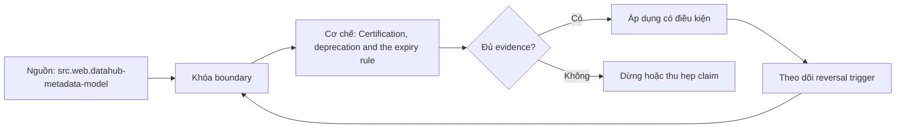

# Certification, deprecation and the expiry rule

> [!abstract] Câu hỏi trung tâm
> Certification và deprecation cần expiry rule nào để catalog không giữ trust badge hoặc cảnh báo vĩnh viễn?

## 1. Certification scope

Badge phải nêu asset/version, intended use, checks, approver và evidence timestamp; không chứng nhận mọi use case. Đừng bắt đầu bằng tên công cụ. Hãy bắt đầu bằng đối tượng được bảo vệ, boundary quan sát được và hậu quả nếu kết luận sai. Trong bài `Certification, deprecation and the expiry rule`, câu hỏi thực dụng là: Certification và deprecation cần expiry rule nào để catalog không giữ trust badge hoặc cảnh báo vĩnh viễn? Ta ghi rõ grain, population, time window, owner và hành động sau failure; nếu một trường chưa biết thì đánh dấu unknown thay vì lấp bằng mặc định. Bằng chứng tối thiểu gồm fixture có version, cấu hình hoặc rule đã resolve, raw observation, expected result và limitation. Phần này là curriculum synthesis dựa trên các nguồn đã định danh, không phải lời hứa rằng mọi adapter hay deployment đều có cùng hành vi.

## 2. Evidence bundle

Contract, owner, freshness, quality history, lineage coverage và consumer review cùng tạo basis có thể audit. Điểm khó không nằm ở cú pháp mà ở identity và scope. Hai phép đo cùng tên vẫn có thể nói về hai population hoặc hai thời điểm khác nhau. Trong bài `Certification, deprecation and the expiry rule`, câu hỏi thực dụng là: Certification và deprecation cần expiry rule nào để catalog không giữ trust badge hoặc cảnh báo vĩnh viễn? Ta ghi rõ grain, population, time window, owner và hành động sau failure; nếu một trường chưa biết thì đánh dấu unknown thay vì lấp bằng mặc định. Bằng chứng tối thiểu gồm fixture có version, cấu hình hoặc rule đã resolve, raw observation, expected result và limitation. Phần này là curriculum synthesis dựa trên các nguồn đã định danh, không phải lời hứa rằng mọi adapter hay deployment đều có cùng hành vi.

## 3. Expiry rule

Certification hết hạn theo thời gian hoặc material change; owner/check failure/schema drift có thể trigger review sớm. Một dashboard xanh chỉ là tín hiệu. Muốn biến nó thành bằng chứng phải giữ input, phiên bản, rule, trạng thái trước–sau và cách tính độc lập. Trong bài `Certification, deprecation and the expiry rule`, câu hỏi thực dụng là: Certification và deprecation cần expiry rule nào để catalog không giữ trust badge hoặc cảnh báo vĩnh viễn? Ta ghi rõ grain, population, time window, owner và hành động sau failure; nếu một trường chưa biết thì đánh dấu unknown thay vì lấp bằng mặc định. Bằng chứng tối thiểu gồm fixture có version, cấu hình hoặc rule đã resolve, raw observation, expected result và limitation. Phần này là curriculum synthesis dựa trên các nguồn đã định danh, không phải lời hứa rằng mọi adapter hay deployment đều có cùng hành vi.

## 4. Deprecation state

Announced, migration, frozen, sunset và removed có dates, replacement, consumers và exception policy. Thiết kế tốt phải chịu được counterexample. Hãy chủ động tạo case sát boundary, case thiếu dữ liệu và case replay thay vì chỉ chạy happy path. Trong bài `Certification, deprecation and the expiry rule`, câu hỏi thực dụng là: Certification và deprecation cần expiry rule nào để catalog không giữ trust badge hoặc cảnh báo vĩnh viễn? Ta ghi rõ grain, population, time window, owner và hành động sau failure; nếu một trường chưa biết thì đánh dấu unknown thay vì lấp bằng mặc định. Bằng chứng tối thiểu gồm fixture có version, cấu hình hoặc rule đã resolve, raw observation, expected result và limitation. Phần này là curriculum synthesis dựa trên các nguồn đã định danh, không phải lời hứa rằng mọi adapter hay deployment đều có cùng hành vi.

## 5. Discovery behavior

Deprecated asset vẫn có thể search để migration nhưng phải bị demote/cảnh báo; removed identity giữ tombstone theo retention. Chi phí vận hành thuộc contract. Một rule đúng nhưng quá đắt, quá ồn hoặc không có owner sẽ nhanh chóng bị tắt và mất tác dụng. Trong bài `Certification, deprecation and the expiry rule`, câu hỏi thực dụng là: Certification và deprecation cần expiry rule nào để catalog không giữ trust badge hoặc cảnh báo vĩnh viễn? Ta ghi rõ grain, population, time window, owner và hành động sau failure; nếu một trường chưa biết thì đánh dấu unknown thay vì lấp bằng mặc định. Bằng chứng tối thiểu gồm fixture có version, cấu hình hoặc rule đã resolve, raw observation, expected result và limitation. Phần này là curriculum synthesis dựa trên các nguồn đã định danh, không phải lời hứa rằng mọi adapter hay deployment đều có cùng hành vi.

## 6. Lifecycle metrics

Đo expired badges, overdue reviews, remaining consumers, deadline exceptions và use-after-sunset incidents. Kết luận cần có điều kiện đảo chiều. Khi volume, latency, nguồn thẩm quyền hoặc topology đổi, quyết định cũ phải được xem xét lại bằng cùng một oracle. Trong bài `Certification, deprecation and the expiry rule`, câu hỏi thực dụng là: Certification và deprecation cần expiry rule nào để catalog không giữ trust badge hoặc cảnh báo vĩnh viễn? Ta ghi rõ grain, population, time window, owner và hành động sau failure; nếu một trường chưa biết thì đánh dấu unknown thay vì lấp bằng mặc định. Bằng chứng tối thiểu gồm fixture có version, cấu hình hoặc rule đã resolve, raw observation, expected result và limitation. Phần này là curriculum synthesis dựa trên các nguồn đã định danh, không phải lời hứa rằng mọi adapter hay deployment đều có cùng hành vi.

## 7. Ma trận kiểm chứng từng mệnh đề

Với `wiki.metadata.certification-deprecation-expiry`, command thành công không tự chứng minh dữ liệu đúng. Protocol riêng của bài là: Dựng metadata graph/query fixture có ground-truth manifest, inject ambiguity hoặc stale state và đối chiếu result với expected identities. Mỗi probe dưới đây phải nối input boundary với failure signal và oracle có thể phản bác kết luận.

### 7.1. Certification, deprecation and the expiry rule: kiểm `Certification scope` bằng case 1, cụ thể badge phải nêu asset/version, intended use, checks, approver và evidence timestamp; không chứng nhận mọi use case

**Mệnh đề cần kiểm.** Certification, deprecation and the expiry rule: kiểm `Certification scope` bằng case 1, cụ thể badge phải nêu asset/version, intended use, checks, approver và evidence timestamp; không chứng nhận mọi use case.

**Thiết kế phép thử cho `wiki.metadata.certification-deprecation-expiry`.** Trong ngữ cảnh `wiki.metadata.certification-deprecation-expiry`, tạo positive control và negative control chỉ khác đúng một điều kiện. Khóa input snapshot, phiên bản và owner của rule; chạy đúng population được bài `Certification, deprecation and the expiry rule` công bố.

**Bằng chứng cần giữ.** Đối với probe 1 của `Certification, deprecation and the expiry rule`, giữ fixture, raw failing rows và lệnh tái hiện. Nếu chưa chạy lab, ghi expected evidence và giữ trạng thái review; không biến protocol thành observation.

### 7.2. Certification, deprecation and the expiry rule: kiểm `Evidence bundle` bằng case 2, cụ thể contract, owner, freshness, quality history, lineage coverage và consumer review cùng tạo basis có thể audit

**Mệnh đề cần kiểm.** Certification, deprecation and the expiry rule: kiểm `Evidence bundle` bằng case 2, cụ thể contract, owner, freshness, quality history, lineage coverage và consumer review cùng tạo basis có thể audit.

**Thiết kế phép thử cho `wiki.metadata.certification-deprecation-expiry`.** Trong ngữ cảnh `wiki.metadata.certification-deprecation-expiry`, đổi grain nhưng giữ tổng số dòng để lộ phép đo sai cấp. Khóa input snapshot, phiên bản và owner của rule; chạy đúng population được bài `Certification, deprecation and the expiry rule` công bố.

**Bằng chứng cần giữ.** Đối với probe 2 của `Certification, deprecation and the expiry rule`, báo numerator, denominator và key set ở cả hai grain. Nếu chưa chạy lab, ghi expected evidence và giữ trạng thái review; không biến protocol thành observation.

### 7.3. Certification, deprecation and the expiry rule: kiểm `Expiry rule` bằng case 3, cụ thể certification hết hạn theo thời gian hoặc material change; owner/check failure/schema drift có thể trigger review sớm

**Mệnh đề cần kiểm.** Certification, deprecation and the expiry rule: kiểm `Expiry rule` bằng case 3, cụ thể certification hết hạn theo thời gian hoặc material change; owner/check failure/schema drift có thể trigger review sớm.

**Thiết kế phép thử cho `wiki.metadata.certification-deprecation-expiry`.** Trong ngữ cảnh `wiki.metadata.certification-deprecation-expiry`, đưa một giá trị tới đúng boundary và một giá trị vượt boundary. Khóa input snapshot, phiên bản và owner của rule; chạy đúng population được bài `Certification, deprecation and the expiry rule` công bố.

**Bằng chứng cần giữ.** Đối với probe 3 của `Certification, deprecation and the expiry rule`, lưu hai observed values cùng rule đã resolve. Nếu chưa chạy lab, ghi expected evidence và giữ trạng thái review; không biến protocol thành observation.

### 7.4. Certification, deprecation and the expiry rule: kiểm `Deprecation state` bằng case 4, cụ thể announced, migration, frozen, sunset và removed có dates, replacement, consumers và exception policy

**Mệnh đề cần kiểm.** Certification, deprecation and the expiry rule: kiểm `Deprecation state` bằng case 4, cụ thể announced, migration, frozen, sunset và removed có dates, replacement, consumers và exception policy.

**Thiết kế phép thử cho `wiki.metadata.certification-deprecation-expiry`.** Trong ngữ cảnh `wiki.metadata.certification-deprecation-expiry`, kill tiến trình ngay trước rồi ngay sau durable side effect. Khóa input snapshot, phiên bản và owner của rule; chạy đúng population được bài `Certification, deprecation and the expiry rule` công bố.

**Bằng chứng cần giữ.** Đối với probe 4 của `Certification, deprecation and the expiry rule`, lưu checkpoint, external ledger và trạng thái sau restart. Nếu chưa chạy lab, ghi expected evidence và giữ trạng thái review; không biến protocol thành observation.

### 7.5. Certification, deprecation and the expiry rule: kiểm `Discovery behavior` bằng case 5, cụ thể deprecated asset vẫn có thể search để migration nhưng phải bị demote/cảnh báo; removed identity giữ tombstone theo retention

**Mệnh đề cần kiểm.** Certification, deprecation and the expiry rule: kiểm `Discovery behavior` bằng case 5, cụ thể deprecated asset vẫn có thể search để migration nhưng phải bị demote/cảnh báo; removed identity giữ tombstone theo retention.

**Thiết kế phép thử cho `wiki.metadata.certification-deprecation-expiry`.** Trong ngữ cảnh `wiki.metadata.certification-deprecation-expiry`, đảo thứ tự input và concurrency nhưng giữ logical population. Khóa input snapshot, phiên bản và owner của rule; chạy đúng population được bài `Certification, deprecation and the expiry rule` công bố.

**Bằng chứng cần giữ.** Đối với probe 5 của `Certification, deprecation and the expiry rule`, so canonical hash và business totals giữa các thứ tự. Nếu chưa chạy lab, ghi expected evidence và giữ trạng thái review; không biến protocol thành observation.

### 7.6. Certification, deprecation and the expiry rule: kiểm `Lifecycle metrics` bằng case 6, cụ thể đo expired badges, overdue reviews, remaining consumers, deadline exceptions và use-after-sunset incidents

**Mệnh đề cần kiểm.** Certification, deprecation and the expiry rule: kiểm `Lifecycle metrics` bằng case 6, cụ thể đo expired badges, overdue reviews, remaining consumers, deadline exceptions và use-after-sunset incidents.

**Thiết kế phép thử cho `wiki.metadata.certification-deprecation-expiry`.** Trong ngữ cảnh `wiki.metadata.certification-deprecation-expiry`, replay cùng identity với payload giống rồi payload xung đột. Khóa input snapshot, phiên bản và owner của rule; chạy đúng population được bài `Certification, deprecation and the expiry rule` công bố.

**Bằng chứng cần giữ.** Đối với probe 6 của `Certification, deprecation and the expiry rule`, tách duplicate replay khỏi identity collision bằng reason code. Nếu chưa chạy lab, ghi expected evidence và giữ trạng thái review; không biến protocol thành observation.

### 7.7. Certification, deprecation and the expiry rule: kiểm `Certification scope` bằng case 7, cụ thể badge phải nêu asset/version, intended use, checks, approver và evidence timestamp; không chứng nhận mọi use case

**Mệnh đề cần kiểm.** Certification, deprecation and the expiry rule: kiểm `Certification scope` bằng case 7, cụ thể badge phải nêu asset/version, intended use, checks, approver và evidence timestamp; không chứng nhận mọi use case.

**Thiết kế phép thử cho `wiki.metadata.certification-deprecation-expiry`.** Trong ngữ cảnh `wiki.metadata.certification-deprecation-expiry`, thêm record tới trễ trong horizon và ngoài horizon. Khóa input snapshot, phiên bản và owner của rule; chạy đúng population được bài `Certification, deprecation and the expiry rule` công bố.

**Bằng chứng cần giữ.** Đối với probe 7 của `Certification, deprecation and the expiry rule`, báo accepted-late, rejected-late và oldest outstanding timestamp. Nếu chưa chạy lab, ghi expected evidence và giữ trạng thái review; không biến protocol thành observation.

### 7.8. Certification, deprecation and the expiry rule: kiểm `Evidence bundle` bằng case 8, cụ thể contract, owner, freshness, quality history, lineage coverage và consumer review cùng tạo basis có thể audit

**Mệnh đề cần kiểm.** Certification, deprecation and the expiry rule: kiểm `Evidence bundle` bằng case 8, cụ thể contract, owner, freshness, quality history, lineage coverage và consumer review cùng tạo basis có thể audit.

**Thiết kế phép thử cho `wiki.metadata.certification-deprecation-expiry`.** Trong ngữ cảnh `wiki.metadata.certification-deprecation-expiry`, đổi schema theo một cách tương thích rồi một cách phá vỡ semantics. Khóa input snapshot, phiên bản và owner của rule; chạy đúng population được bài `Certification, deprecation and the expiry rule` công bố.

**Bằng chứng cần giữ.** Đối với probe 8 của `Certification, deprecation and the expiry rule`, giữ schema diff, classification và consumer-visible result. Nếu chưa chạy lab, ghi expected evidence và giữ trạng thái review; không biến protocol thành observation.

### 7.9. Certification, deprecation and the expiry rule: kiểm `Expiry rule` bằng case 9, cụ thể certification hết hạn theo thời gian hoặc material change; owner/check failure/schema drift có thể trigger review sớm

**Mệnh đề cần kiểm.** Certification, deprecation and the expiry rule: kiểm `Expiry rule` bằng case 9, cụ thể certification hết hạn theo thời gian hoặc material change; owner/check failure/schema drift có thể trigger review sớm.

**Thiết kế phép thử cho `wiki.metadata.certification-deprecation-expiry`.** Trong ngữ cảnh `wiki.metadata.certification-deprecation-expiry`, tạo missing và duplicate bù nhau để count tổng không đổi. Khóa input snapshot, phiên bản và owner của rule; chạy đúng population được bài `Certification, deprecation and the expiry rule` công bố.

**Bằng chứng cần giữ.** Đối với probe 9 của `Certification, deprecation and the expiry rule`, so key multiset và typed hashes thay vì chỉ row count. Nếu chưa chạy lab, ghi expected evidence và giữ trạng thái review; không biến protocol thành observation.

### 7.10. Certification, deprecation and the expiry rule: kiểm `Deprecation state` bằng case 10, cụ thể announced, migration, frozen, sunset và removed có dates, replacement, consumers và exception policy

**Mệnh đề cần kiểm.** Certification, deprecation and the expiry rule: kiểm `Deprecation state` bằng case 10, cụ thể announced, migration, frozen, sunset và removed có dates, replacement, consumers và exception policy.

**Thiết kế phép thử cho `wiki.metadata.certification-deprecation-expiry`.** Trong ngữ cảnh `wiki.metadata.certification-deprecation-expiry`, cho reviewer tái hiện chỉ từ evidence package. Khóa input snapshot, phiên bản và owner của rule; chạy đúng population được bài `Certification, deprecation and the expiry rule` công bố.

**Bằng chứng cần giữ.** Đối với probe 10 của `Certification, deprecation and the expiry rule`, package phải đủ để người khác dựng lại decision và limitation. Nếu chưa chạy lab, ghi expected evidence và giữ trạng thái review; không biến protocol thành observation.

### 7.11. Certification, deprecation and the expiry rule: kiểm `Discovery behavior` bằng case 11, cụ thể deprecated asset vẫn có thể search để migration nhưng phải bị demote/cảnh báo; removed identity giữ tombstone theo retention

**Mệnh đề cần kiểm.** Certification, deprecation and the expiry rule: kiểm `Discovery behavior` bằng case 11, cụ thể deprecated asset vẫn có thể search để migration nhưng phải bị demote/cảnh báo; removed identity giữ tombstone theo retention.

**Thiết kế phép thử cho `wiki.metadata.certification-deprecation-expiry`.** Trong ngữ cảnh `wiki.metadata.certification-deprecation-expiry`, so với oracle độc lập không dùng chung query hoặc parser. Khóa input snapshot, phiên bản và owner của rule; chạy đúng population được bài `Certification, deprecation and the expiry rule` công bố.

**Bằng chứng cần giữ.** Đối với probe 11 của `Certification, deprecation and the expiry rule`, independent result phải khớp ở grain đã công bố. Nếu chưa chạy lab, ghi expected evidence và giữ trạng thái review; không biến protocol thành observation.

### 7.12. Certification, deprecation and the expiry rule: kiểm `Lifecycle metrics` bằng case 12, cụ thể đo expired badges, overdue reviews, remaining consumers, deadline exceptions và use-after-sunset incidents

**Mệnh đề cần kiểm.** Certification, deprecation and the expiry rule: kiểm `Lifecycle metrics` bằng case 12, cụ thể đo expired badges, overdue reviews, remaining consumers, deadline exceptions và use-after-sunset incidents.

**Thiết kế phép thử cho `wiki.metadata.certification-deprecation-expiry`.** Trong ngữ cảnh `wiki.metadata.certification-deprecation-expiry`, chạy scope hẹp và population đầy đủ rồi công bố phần bị loại. Khóa input snapshot, phiên bản và owner của rule; chạy đúng population được bài `Certification, deprecation and the expiry rule` công bố.

**Bằng chứng cần giữ.** Đối với probe 12 của `Certification, deprecation and the expiry rule`, coverage phải nêu rõ excluded nodes, partitions hoặc incidents. Nếu chưa chạy lab, ghi expected evidence và giữ trạng thái review; không biến protocol thành observation.

### 7.13. Certification, deprecation and the expiry rule: kiểm `Certification scope` bằng case 13, cụ thể badge phải nêu asset/version, intended use, checks, approver và evidence timestamp; không chứng nhận mọi use case

**Mệnh đề cần kiểm.** Certification, deprecation and the expiry rule: kiểm `Certification scope` bằng case 13, cụ thể badge phải nêu asset/version, intended use, checks, approver và evidence timestamp; không chứng nhận mọi use case.

**Thiết kế phép thử cho `wiki.metadata.certification-deprecation-expiry`.** Trong ngữ cảnh `wiki.metadata.certification-deprecation-expiry`, thử timezone, precision hoặc partition ở hai phía của ranh giới. Khóa input snapshot, phiên bản và owner của rule; chạy đúng population được bài `Certification, deprecation and the expiry rule` công bố.

**Bằng chứng cần giữ.** Đối với probe 13 của `Certification, deprecation and the expiry rule`, UTC/local interval và rounding policy phải hiện trong output. Nếu chưa chạy lab, ghi expected evidence và giữ trạng thái review; không biến protocol thành observation.

### 7.14. Certification, deprecation and the expiry rule: kiểm `Evidence bundle` bằng case 14, cụ thể contract, owner, freshness, quality history, lineage coverage và consumer review cùng tạo basis có thể audit

**Mệnh đề cần kiểm.** Certification, deprecation and the expiry rule: kiểm `Evidence bundle` bằng case 14, cụ thể contract, owner, freshness, quality history, lineage coverage và consumer review cùng tạo basis có thể audit.

**Thiết kế phép thử cho `wiki.metadata.certification-deprecation-expiry`.** Trong ngữ cảnh `wiki.metadata.certification-deprecation-expiry`, đổi constraint đủ lớn để quyết định phải đảo. Khóa input snapshot, phiên bản và owner của rule; chạy đúng population được bài `Certification, deprecation and the expiry rule` công bố.

**Bằng chứng cần giữ.** Đối với probe 14 của `Certification, deprecation and the expiry rule`, ADR phải lưu changed constraint và reversal threshold. Nếu chưa chạy lab, ghi expected evidence và giữ trạng thái review; không biến protocol thành observation.

### 7.15. Certification, deprecation and the expiry rule: kiểm `Expiry rule` bằng case 15, cụ thể certification hết hạn theo thời gian hoặc material change; owner/check failure/schema drift có thể trigger review sớm

**Mệnh đề cần kiểm.** Certification, deprecation and the expiry rule: kiểm `Expiry rule` bằng case 15, cụ thể certification hết hạn theo thời gian hoặc material change; owner/check failure/schema drift có thể trigger review sớm.

**Thiết kế phép thử cho `wiki.metadata.certification-deprecation-expiry`.** Trong ngữ cảnh `wiki.metadata.certification-deprecation-expiry`, chạy lại từ môi trường sạch với versions và seed đã khóa. Khóa input snapshot, phiên bản và owner của rule; chạy đúng population được bài `Certification, deprecation and the expiry rule` công bố.

**Bằng chứng cần giữ.** Đối với probe 15 của `Certification, deprecation and the expiry rule`, canonical result phải ổn định hoặc mọi nondeterminism phải được giải thích. Nếu chưa chạy lab, ghi expected evidence và giữ trạng thái review; không biến protocol thành observation.

## 8. Quy trình phản biện

1. Viết consumer-visible invariant cho `Certification, deprecation and the expiry rule` trước khi chọn query hoặc tool.
2. Khóa grain, identity, population, time window và authoritative source.
3. Phân biệt declared configuration, executed state và published state.
4. Chạy negative control, replay hoặc changed-assumption case phù hợp.
5. Đối soát bằng oracle độc lập; công bố coverage và phần không quan sát được.
6. Gắn owner, hành động, reversal trigger và hạn review cho kết luận.

## 9. Câu hỏi tự kiểm tra

1. `Certification, deprecation and the expiry rule: kiểm `Certification scope` bằng case 1, cụ thể badge phải nêu asset/version, intended use, checks, approver và evidence timestamp; không chứng nhận mọi use case` thất bại đầu tiên ở boundary nào?
2. Artifact nào mạnh nhất để trả lời `Certification, deprecation and the expiry rule: kiểm `Expiry rule` bằng case 3, cụ thể certification hết hạn theo thời gian hoặc material change; owner/check failure/schema drift có thể trigger review sớm`?
3. Counterexample nhỏ nhất cho `Certification, deprecation and the expiry rule: kiểm `Lifecycle metrics` bằng case 6, cụ thể đo expired badges, overdue reviews, remaining consumers, deadline exceptions và use-after-sunset incidents` gồm những state nào?
4. `Certification, deprecation and the expiry rule: kiểm `Expiry rule` bằng case 9, cụ thể certification hết hạn theo thời gian hoặc material change; owner/check failure/schema drift có thể trigger review sớm` có thể xanh giả ra sao?
5. Constraint nào khiến quyết định ở `Certification, deprecation and the expiry rule: kiểm `Evidence bundle` bằng case 14, cụ thể contract, owner, freshness, quality history, lineage coverage và consumer review cùng tạo basis có thể audit` phải đảo?
6. Phần nào của `Certification, deprecation and the expiry rule: kiểm `Expiry rule` bằng case 15, cụ thể certification hết hạn theo thời gian hoặc material change; owner/check failure/schema drift có thể trigger review sớm` mới là protocol, chưa phải observation?

## 10. Giới hạn và điều chưa cho phép kết luận

- Lab của `Certification, deprecation and the expiry rule` chưa chạy trên hệ thống production; nội dung là giáo trình và expected evidence.
- Hành vi phụ thuộc phiên bản, connector, scheduler, warehouse và catalog configuration phải được kiểm lại.
- Các ma trận, ladder và threshold do giáo trình tổng hợp không được gán nguyên văn cho vendor.
- Note giữ trạng thái `review` cho tới khi owner duyệt semantics và learner artifact.

## Reference
1. [[SRC-DATAHUB-METADATA-MODEL]]
2. [[SRC-DATAHUB-SEARCH]]

## Source coverage

| Source slice | Nội dung sử dụng | Trạng thái |
|---|---|---|
| [[SRC-DATAHUB-METADATA-MODEL]] | Contract hoặc cơ chế liên quan trực tiếp tới `Certification, deprecation and the expiry rule` | Đã đọc locator; cần pin version khi chạy lab |
| [[SRC-DATAHUB-SEARCH]] | Contract hoặc cơ chế liên quan trực tiếp tới `Certification, deprecation and the expiry rule` | Đã đọc locator; cần pin version khi chạy lab |

## Key takeaways
- Trust badge và deprecation chỉ an toàn khi có evidence, expiry và lifecycle owner.
- Với `wiki.metadata.certification-deprecation-expiry`, quality của kết luận phụ thuộc identity, coverage và oracle chứ không phụ thuộc màu dashboard.
- Câu hỏi `Certification và deprecation cần expiry rule nào để catalog không giữ trust badge hoặc cảnh báo vĩnh viễn?` chỉ được trả lời trong scope và version đã ghi.
- Các source IDs `src.web.datahub-metadata-model, src.web.datahub-search` đặt ranh giới cho source fact; phần còn lại là synthesis có nhãn.
- Trước khi lab chạy, đây là note đã kiểm cấu trúc và provenance, chưa phải chứng nhận production.

<!-- ATOMIC-EXECUTION-CAPSULE:START -->

## Execution capsule — kiểm chứng `wiki.metadata.certification-deprecation-expiry`

> [!important] Phân loại mệnh đề
> Với `wiki.metadata.certification-deprecation-expiry`, sơ đồ, ví dụ và artifact về **Certification, deprecation and the expiry rule** là **synthesis để kiểm chứng**; chúng không phải trích dẫn hay case nguyên văn của nguồn.

### Sơ đồ cơ chế và điểm kiểm soát



Đọc sơ đồ `wiki.metadata.certification-deprecation-expiry` từ trái sang phải: source chỉ cung cấp claim ban đầu cho **Certification, deprecation and the expiry rule**; quyết định chỉ được đi tiếp sau khi boundary, evidence và điều kiện đảo quyết định đã hiện hữu.

### Artifact thực thi tối thiểu

```sql
-- Verification harness for: Certification, deprecation and the expiry rule
WITH evidence AS (
    SELECT 'wiki.metadata.certification-deprecation-expiry' AS concept_id,
           'boundary_declared' AS check_name, 1 AS passed
    UNION ALL
    SELECT 'wiki.metadata.certification-deprecation-expiry', 'independent_oracle', 1
    UNION ALL
    SELECT 'wiki.metadata.certification-deprecation-expiry', 'reversal_trigger_recorded', 1
)
SELECT concept_id,
       MIN(passed) AS all_hard_checks_pass,
       COUNT(*) AS evidence_items
FROM evidence
GROUP BY concept_id
HAVING MIN(passed) = 1;
```

Artifact của `wiki.metadata.certification-deprecation-expiry` buộc người dùng ghi boundary, oracle và reversal trigger cho **Certification, deprecation and the expiry rule**. Các giá trị minh họa phải được thay bằng evidence thật trước khi dùng cho quyết định.

### Tự kiểm tra trước khi tái sử dụng

1. Bạn có thể trả lời `Certification và deprecation cần expiry rule nào để catalog không giữ trust badge hoặc cảnh báo vĩnh viễn?` bằng một câu mà không kéo thêm concept thứ hai không?
2. Source locator nào đỡ cho claim, và phần nào chỉ là synthesis trong note?
3. Observation nào khiến bạn dừng, thu hẹp hoặc đảo quyết định?
4. Artifact nào cho phép một reviewer độc lập tái hiện kết quả?

<!-- ATOMIC-EXECUTION-CAPSULE:END -->
