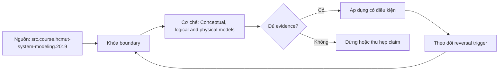

# Conceptual, logical and physical models

> [!abstract] Câu hỏi trung tâm
> Làm thế nào tách conceptual, logical và physical model để mỗi artifact trả lời đúng câu hỏi và thay engine không làm nhiễm business semantics?

## 1. Ba model, ba câu hỏi

Conceptual model hỏi miền có những khái niệm và quan hệ nào; logical model hỏi dữ liệu, identity, cardinality, optionality và constraints biểu diễn ra sao độc lập DBMS; physical model hỏi triển khai trên engine cụ thể bằng types, tables, indexes, partitions, compression và placement nào. Đây là separation of concerns, không phải ba mức trang trí của một diagram.

## 2. Conceptual model

Dùng ngôn ngữ nghiệp vụ, bounded context, entity/event/value và quan hệ bậc cao. Không thêm varchar, index hoặc partition. Artifact phục vụ elicitation và alignment nên có thể bỏ chi tiết implementation nhưng không được mơ hồ về thuật ngữ, ownership hay scope. HCMUT system modeling nhấn mạnh mỗi model là một perspective và audience khác nhau.

## 3. Logical model

Ghi attributes, candidate identifiers, relationship cardinality/participation, normalization, temporal semantics và integrity constraints. Logical design không đồng nghĩa relational duy nhất; nhưng nếu dùng relational logical model, PK/FK/unique/check ở mức nghĩa chưa cần PostgreSQL syntax. Grain và identity phải ổn định trước physical tuning.

## 4. Physical model

Chọn concrete data types, nullability syntax, index access paths, clustering, partitioning, distribution, storage format và engine-specific constraints. Denormalization có thể là physical optimization nếu canonical logical dependencies vẫn rõ. Migration/DDL, capacity và operational controls nằm ở tầng này.

## 5. Traceability và change

Mỗi physical object trace về logical element và conceptual term/requirement. Đổi engine chủ yếu tạo physical transformation; nếu business term hoặc cardinality đổi thì đó là requirement/model change, không phải port đơn thuần. Một sơ đồ duy nhất có thể tạo views khác nhau nhưng phải gắn audience/layer, không trộn notation ngầm.

## 6. Ma trận kiểm chứng từng mệnh đề

Mỗi mệnh đề phải được chuyển thành invariant, fixture và phép đối chiếu có thể chạy lại. Sơ đồ đẹp hoặc một truy vấn trả về kết quả không lỗi không tự chứng minh mô hình đúng ngữ nghĩa.

### 6.1. business term và relationship thuộc conceptual view

**Mệnh đề cần kiểm.** business term và relationship thuộc conceptual view. **Thiết kế phép kiểm.** Lập ba artifact tách biệt: glossary/concept map, logical model và DDL/index plan. Lập ma trận trace từ requirement đến term, entity/constraint và physical object. Sau đó thay DBMS hoặc access pattern: thay đổi chỉ được lan sang physical layer nếu business semantics không đổi. Bằng chứng đạt là diff theo layer và mọi object đều truy ngược được. **Hồ sơ cần lưu.** Grain/model/metric contract, dữ liệu seed, SQL hoặc notebook, kết quả thô, control totals và giải thích ca biên. Nếu phép kiểm chỉ xác nhận cấu trúc mà không xác nhận semantics, kết luận phải ghi rõ giới hạn đó.

### 6.2. candidate key và cardinality thuộc logical view

**Mệnh đề cần kiểm.** candidate key và cardinality thuộc logical view. **Thiết kế phép kiểm.** Lập ba artifact tách biệt: glossary/concept map, logical model và DDL/index plan. Lập ma trận trace từ requirement đến term, entity/constraint và physical object. Sau đó thay DBMS hoặc access pattern: thay đổi chỉ được lan sang physical layer nếu business semantics không đổi. Bằng chứng đạt là diff theo layer và mọi object đều truy ngược được. **Hồ sơ cần lưu.** Grain/model/metric contract, dữ liệu seed, SQL hoặc notebook, kết quả thô, control totals và giải thích ca biên. Nếu phép kiểm chỉ xác nhận cấu trúc mà không xác nhận semantics, kết luận phải ghi rõ giới hạn đó.

### 6.3. varchar length và collation thuộc physical view

**Mệnh đề cần kiểm.** varchar length và collation thuộc physical view. **Thiết kế phép kiểm.** Lập ba artifact tách biệt: glossary/concept map, logical model và DDL/index plan. Lập ma trận trace từ requirement đến term, entity/constraint và physical object. Sau đó thay DBMS hoặc access pattern: thay đổi chỉ được lan sang physical layer nếu business semantics không đổi. Bằng chứng đạt là diff theo layer và mọi object đều truy ngược được. **Hồ sơ cần lưu.** Grain/model/metric contract, dữ liệu seed, SQL hoặc notebook, kết quả thô, control totals và giải thích ca biên. Nếu phép kiểm chỉ xác nhận cấu trúc mà không xác nhận semantics, kết luận phải ghi rõ giới hạn đó.

### 6.4. normalization dependency là logical decision

**Mệnh đề cần kiểm.** normalization dependency là logical decision. **Thiết kế phép kiểm.** Lập ba artifact tách biệt: glossary/concept map, logical model và DDL/index plan. Lập ma trận trace từ requirement đến term, entity/constraint và physical object. Sau đó thay DBMS hoặc access pattern: thay đổi chỉ được lan sang physical layer nếu business semantics không đổi. Bằng chứng đạt là diff theo layer và mọi object đều truy ngược được. **Hồ sơ cần lưu.** Grain/model/metric contract, dữ liệu seed, SQL hoặc notebook, kết quả thô, control totals và giải thích ca biên. Nếu phép kiểm chỉ xác nhận cấu trúc mà không xác nhận semantics, kết luận phải ghi rõ giới hạn đó.

### 6.5. index và partition là physical access decision

**Mệnh đề cần kiểm.** index và partition là physical access decision. **Thiết kế phép kiểm.** Lập ba artifact tách biệt: glossary/concept map, logical model và DDL/index plan. Lập ma trận trace từ requirement đến term, entity/constraint và physical object. Sau đó thay DBMS hoặc access pattern: thay đổi chỉ được lan sang physical layer nếu business semantics không đổi. Bằng chứng đạt là diff theo layer và mọi object đều truy ngược được. **Hồ sơ cần lưu.** Grain/model/metric contract, dữ liệu seed, SQL hoặc notebook, kết quả thô, control totals và giải thích ca biên. Nếu phép kiểm chỉ xác nhận cấu trúc mà không xác nhận semantics, kết luận phải ghi rõ giới hạn đó.

### 6.6. denormalized cache không được làm mất canonical semantics

**Mệnh đề cần kiểm.** denormalized cache không được làm mất canonical semantics. **Thiết kế phép kiểm.** Lập ba artifact tách biệt: glossary/concept map, logical model và DDL/index plan. Lập ma trận trace từ requirement đến term, entity/constraint và physical object. Sau đó thay DBMS hoặc access pattern: thay đổi chỉ được lan sang physical layer nếu business semantics không đổi. Bằng chứng đạt là diff theo layer và mọi object đều truy ngược được. **Hồ sơ cần lưu.** Grain/model/metric contract, dữ liệu seed, SQL hoặc notebook, kết quả thô, control totals và giải thích ca biên. Nếu phép kiểm chỉ xác nhận cấu trúc mà không xác nhận semantics, kết luận phải ghi rõ giới hạn đó.

### 6.7. engine migration không nên đổi business vocabulary

**Mệnh đề cần kiểm.** engine migration không nên đổi business vocabulary. **Thiết kế phép kiểm.** Lập ba artifact tách biệt: glossary/concept map, logical model và DDL/index plan. Lập ma trận trace từ requirement đến term, entity/constraint và physical object. Sau đó thay DBMS hoặc access pattern: thay đổi chỉ được lan sang physical layer nếu business semantics không đổi. Bằng chứng đạt là diff theo layer và mọi object đều truy ngược được. **Hồ sơ cần lưu.** Grain/model/metric contract, dữ liệu seed, SQL hoặc notebook, kết quả thô, control totals và giải thích ca biên. Nếu phép kiểm chỉ xác nhận cấu trúc mà không xác nhận semantics, kết luận phải ghi rõ giới hạn đó.

### 6.8. conceptual diagram không nên chứa DBMS type

**Mệnh đề cần kiểm.** conceptual diagram không nên chứa DBMS type. **Thiết kế phép kiểm.** Lập ba artifact tách biệt: glossary/concept map, logical model và DDL/index plan. Lập ma trận trace từ requirement đến term, entity/constraint và physical object. Sau đó thay DBMS hoặc access pattern: thay đổi chỉ được lan sang physical layer nếu business semantics không đổi. Bằng chứng đạt là diff theo layer và mọi object đều truy ngược được. **Hồ sơ cần lưu.** Grain/model/metric contract, dữ liệu seed, SQL hoặc notebook, kết quả thô, control totals và giải thích ca biên. Nếu phép kiểm chỉ xác nhận cấu trúc mà không xác nhận semantics, kết luận phải ghi rõ giới hạn đó.

### 6.9. physical diagram không thay data dictionary

**Mệnh đề cần kiểm.** physical diagram không thay data dictionary. **Thiết kế phép kiểm.** Lập ba artifact tách biệt: glossary/concept map, logical model và DDL/index plan. Lập ma trận trace từ requirement đến term, entity/constraint và physical object. Sau đó thay DBMS hoặc access pattern: thay đổi chỉ được lan sang physical layer nếu business semantics không đổi. Bằng chứng đạt là diff theo layer và mọi object đều truy ngược được. **Hồ sơ cần lưu.** Grain/model/metric contract, dữ liệu seed, SQL hoặc notebook, kết quả thô, control totals và giải thích ca biên. Nếu phép kiểm chỉ xác nhận cấu trúc mà không xác nhận semantics, kết luận phải ghi rõ giới hạn đó.

### 6.10. logical nullability phải có business meaning

**Mệnh đề cần kiểm.** logical nullability phải có business meaning. **Thiết kế phép kiểm.** Lập ba artifact tách biệt: glossary/concept map, logical model và DDL/index plan. Lập ma trận trace từ requirement đến term, entity/constraint và physical object. Sau đó thay DBMS hoặc access pattern: thay đổi chỉ được lan sang physical layer nếu business semantics không đổi. Bằng chứng đạt là diff theo layer và mọi object đều truy ngược được. **Hồ sơ cần lưu.** Grain/model/metric contract, dữ liệu seed, SQL hoặc notebook, kết quả thô, control totals và giải thích ca biên. Nếu phép kiểm chỉ xác nhận cấu trúc mà không xác nhận semantics, kết luận phải ghi rõ giới hạn đó.

### 6.11. mỗi layer cần owner và version

**Mệnh đề cần kiểm.** mỗi layer cần owner và version. **Thiết kế phép kiểm.** Lập ba artifact tách biệt: glossary/concept map, logical model và DDL/index plan. Lập ma trận trace từ requirement đến term, entity/constraint và physical object. Sau đó thay DBMS hoặc access pattern: thay đổi chỉ được lan sang physical layer nếu business semantics không đổi. Bằng chứng đạt là diff theo layer và mọi object đều truy ngược được. **Hồ sơ cần lưu.** Grain/model/metric contract, dữ liệu seed, SQL hoặc notebook, kết quả thô, control totals và giải thích ca biên. Nếu phép kiểm chỉ xác nhận cấu trúc mà không xác nhận semantics, kết luận phải ghi rõ giới hạn đó.

### 6.12. traceability phải đi từ requirement tới DDL

**Mệnh đề cần kiểm.** traceability phải đi từ requirement tới DDL. **Thiết kế phép kiểm.** Lập ba artifact tách biệt: glossary/concept map, logical model và DDL/index plan. Lập ma trận trace từ requirement đến term, entity/constraint và physical object. Sau đó thay DBMS hoặc access pattern: thay đổi chỉ được lan sang physical layer nếu business semantics không đổi. Bằng chứng đạt là diff theo layer và mọi object đều truy ngược được. **Hồ sơ cần lưu.** Grain/model/metric contract, dữ liệu seed, SQL hoặc notebook, kết quả thô, control totals và giải thích ca biên. Nếu phép kiểm chỉ xác nhận cấu trúc mà không xác nhận semantics, kết luận phải ghi rõ giới hạn đó.

### 6.13. một artifact đa-view phải ghi filter/layer rõ

**Mệnh đề cần kiểm.** một artifact đa-view phải ghi filter/layer rõ. **Thiết kế phép kiểm.** Lập ba artifact tách biệt: glossary/concept map, logical model và DDL/index plan. Lập ma trận trace từ requirement đến term, entity/constraint và physical object. Sau đó thay DBMS hoặc access pattern: thay đổi chỉ được lan sang physical layer nếu business semantics không đổi. Bằng chứng đạt là diff theo layer và mọi object đều truy ngược được. **Hồ sơ cần lưu.** Grain/model/metric contract, dữ liệu seed, SQL hoặc notebook, kết quả thô, control totals và giải thích ca biên. Nếu phép kiểm chỉ xác nhận cấu trúc mà không xác nhận semantics, kết luận phải ghi rõ giới hạn đó.

### 6.14. CIM/PIM/PSM là phép tương tự không đồng nhất hoàn toàn với ba data-model levels

**Mệnh đề cần kiểm.** CIM/PIM/PSM là phép tương tự không đồng nhất hoàn toàn với ba data-model levels. **Thiết kế phép kiểm.** Lập ba artifact tách biệt: glossary/concept map, logical model và DDL/index plan. Lập ma trận trace từ requirement đến term, entity/constraint và physical object. Sau đó thay DBMS hoặc access pattern: thay đổi chỉ được lan sang physical layer nếu business semantics không đổi. Bằng chứng đạt là diff theo layer và mọi object đều truy ngược được. **Hồ sơ cần lưu.** Grain/model/metric contract, dữ liệu seed, SQL hoặc notebook, kết quả thô, control totals và giải thích ca biên. Nếu phép kiểm chỉ xác nhận cấu trúc mà không xác nhận semantics, kết luận phải ghi rõ giới hạn đó.

### 6.15. boundary decision cần ghi cả hai cách hiểu khi thật sự giao thoa

**Mệnh đề cần kiểm.** boundary decision cần ghi cả hai cách hiểu khi thật sự giao thoa. **Thiết kế phép kiểm.** Lập ba artifact tách biệt: glossary/concept map, logical model và DDL/index plan. Lập ma trận trace từ requirement đến term, entity/constraint và physical object. Sau đó thay DBMS hoặc access pattern: thay đổi chỉ được lan sang physical layer nếu business semantics không đổi. Bằng chứng đạt là diff theo layer và mọi object đều truy ngược được. **Hồ sơ cần lưu.** Grain/model/metric contract, dữ liệu seed, SQL hoặc notebook, kết quả thô, control totals và giải thích ca biên. Nếu phép kiểm chỉ xác nhận cấu trúc mà không xác nhận semantics, kết luận phải ghi rõ giới hạn đó.

## 7. Quy trình phản biện mô hình

1. Viết business question, grain, identity, time semantics và invariant trước khi vẽ bảng.
2. Chỉ ra owner của định nghĩa và artifact nào là canonical.
3. Tách source fact, quyết định thiết kế và curriculum synthesis; không gán suy luận cho sách.
4. Dựng ca biên tối thiểu: duplicate, null, late correction, code reuse, many-to-many hoặc missing period tuỳ bài.
5. Đo row count, distinct business key, unmatched rate và control totals trước-sau mỗi phép biến đổi.
6. Thử replay/backfill và đổi cutoff; thiết kế không tái chạy được chưa đủ bằng chứng để vận hành.
7. Lưu quyết định, phản ví dụ và giới hạn; không xoá failed run vì nó là bằng chứng của failure boundary.

## 8. Câu hỏi tự kiểm tra

1. Row đại diện điều gì, được nhận dạng bằng gì và có hiệu lực khi nào?
2. Ca biên nhỏ nhất nào làm thiết kế cho ra số sai nhưng SQL vẫn hợp lệ?
3. Constraint/test nào bắt lỗi cấu trúc, và phần ngữ nghĩa nào vẫn cần owner xác nhận?
4. Late data, correction, replay và backfill làm model thay đổi ra sao?
5. Phần nào đến trực tiếp từ nguồn; phần nào là tổng hợp của giáo trình?
6. Artifact và phép kiểm nào cho phép người khác bác bỏ kết luận?

## 9. Giới hạn và điều chưa cho phép kết luận

- Chưa chạy profiling, merge/backfill hay reconciliation lab; các phép kiểm trong note là giao thức cần thực thi, không phải kết quả đã đo.
- Sample không có duplicate không chứng minh business uniqueness; schema hợp lệ không chứng minh đúng grain.
- HCMUT System Modeling cung cấp khung abstraction/perspective; phép ánh xạ conceptual-logical-physical trong bài là synthesis có ghi nhãn.
- DDIA và Silberschatz cung cấp ranh giới data model/database design; taxonomy dimensional chi tiết lấy Kimball-Ross làm nguồn chính.
- Không suy performance, dung lượng, threshold hoặc production readiness nếu chưa đo trên workload và engine mục tiêu.

## Reference
1. [[SRC-HCMUT-SYSTEM-MODELING-2019]]
2. [[SRC-HCMUT-ENTITY-RELATIONSHIP-MODEL]]
3. [[SRC-SILBERSCHATZ-DATABASE-SYSTEM-CONCEPTS-7E]]

## Source coverage

| Source slice | Nội dung sử dụng | Trạng thái |
|---|---|---|
| [[SRC-HCMUT-SYSTEM-MODELING-2019]] | Khái niệm, ranh giới và phản ví dụ liên quan đến bài | Đã đọc phạm vi có locator; không suy nội dung ngoài phạm vi |
| [[SRC-HCMUT-ENTITY-RELATIONSHIP-MODEL]] | Khái niệm, ranh giới và phản ví dụ liên quan đến bài | Đã đọc phạm vi có locator; không suy nội dung ngoài phạm vi |
| [[SRC-SILBERSCHATZ-DATABASE-SYSTEM-CONCEPTS-7E]] | Khái niệm, ranh giới và phản ví dụ liên quan đến bài | Đã đọc phạm vi có locator; không suy nội dung ngoài phạm vi |

## Key takeaways
- Bắt đầu từ business question, grain, identity, time và invariant; cột là hệ quả, không phải điểm xuất phát.
- Tách ngữ nghĩa, logical constraints và physical implementation để thay đổi có traceability.
- Key duy nhất, SQL chạy được hoặc diagram đẹp không tự chứng minh mô hình đúng.
- Mọi measure cần aggregation contract theo grain, dimension, unit, cutoff và late-data policy.
- Chưa chạy phép kiểm thì note là tài liệu học thuật đã truy nguồn, không phải chứng nhận production.

<!-- ATOMIC-EXECUTION-CAPSULE:START -->

## Execution capsule: kiểm chứng `wiki.data-modeling.model-levels`

> [!important] Phân loại mệnh đề
> Với `wiki.data-modeling.model-levels`, sơ đồ, ví dụ và artifact về **Conceptual, logical and physical models** là **synthesis để kiểm chứng**; chúng không phải trích dẫn hay case nguyên văn của nguồn.

### Sơ đồ cơ chế và điểm kiểm soát



Đọc sơ đồ `wiki.data-modeling.model-levels` từ trái sang phải: source chỉ cung cấp claim ban đầu cho **Conceptual, logical and physical models**; quyết định chỉ được đi tiếp sau khi boundary, evidence và điều kiện đảo quyết định đã hiện hữu.

### Artifact thực thi tối thiểu

```sql
-- Verification harness for: Conceptual, logical and physical models
WITH evidence AS (
    SELECT 'wiki.data-modeling.model-levels' AS concept_id,
           'boundary_declared' AS check_name, 1 AS passed
    UNION ALL
    SELECT 'wiki.data-modeling.model-levels', 'independent_oracle', 1
    UNION ALL
    SELECT 'wiki.data-modeling.model-levels', 'reversal_trigger_recorded', 1
)
SELECT concept_id,
       MIN(passed) AS all_hard_checks_pass,
       COUNT(*) AS evidence_items
FROM evidence
GROUP BY concept_id
HAVING MIN(passed) = 1;
```

Artifact của `wiki.data-modeling.model-levels` buộc người dùng ghi boundary, oracle và reversal trigger cho **Conceptual, logical and physical models**. Các giá trị minh họa phải được thay bằng evidence thật trước khi dùng cho quyết định.

### Tự kiểm tra trước khi tái sử dụng

1. Bạn có thể trả lời `Làm thế nào tách conceptual, logical và physical model để mỗi artifact trả lời đúng câu hỏi và thay engine không làm nhiễm business semantics?` bằng một câu mà không kéo thêm concept thứ hai không?
2. Source locator nào đỡ cho claim, và phần nào chỉ là synthesis trong note?
3. Observation nào khiến bạn dừng, thu hẹp hoặc đảo quyết định?
4. Artifact nào cho phép một reviewer độc lập tái hiện kết quả?

<!-- ATOMIC-EXECUTION-CAPSULE:END -->
