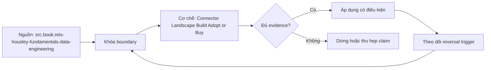

# Connector Landscape Build Adopt or Buy

> [!abstract] Câu hỏi trung tâm
> Quyết định tự xây, dùng open-source hay mua connector dựa trên semantics, vận hành và exit cost nào?

## 1. Bắt đầu từ contract

Lập source profile: auth, entities, key/cursor/delete, snapshot/CDC/pagination/file semantics, schema drift, rate limits, volume, latency, replay và compliance. Connector coverage được chấm từng capability với evidence. Danh sách logo hay “supported source” không chứng minh hard delete, historical backfill hoặc exact field coverage.

## 2. Ba lựa chọn

Build cho control/special semantics nhưng gánh maintenance; adopt open-source tăng visibility/extensibility nhưng vẫn sở hữu deploy/upgrade/on-call; buy chuyển một phần vận hành/SLA cho vendor nhưng thêm pricing, lock-in, telemetry và roadmap dependency. Hybrid/fork cũng là lựa chọn có merge debt. So total obligation, không so license fee duy nhất.

## 3. Scorecard có hard gates

Hard gates: security/compliance, required change semantics, recovery/replay, region/network và data ownership. Weighted criteria: coverage, reliability evidence, operability, extensibility, latency, cost, support, upgrade behavior và exit. Hard gate fail không được điểm đẹp bù. Trọng số và uncertainty do owner ký; sensitivity analysis chỉ ra khi ranking đảo.

## 4. Proof of concept

PoC phải dùng representative source và failure suite: initial load, incremental update/delete, schema drift, rate limit, expired cursor/token, crash/restart, duplicate delivery và backfill. Thu raw logs, checkpoint, lineage, reconciliation, resource/cost. Happy-path row movement không phải PoC. Pin connector/platform versions và config.

## 5. Vòng đời và exit

Đánh giá upgrade cadence, major migration, CVE, support escalation, state format, normalization behavior và ownership khi connector deprecated. Exit plan cần export checkpoint/state, raw retention, canonical schema, cutover dual-run và reconciliation. Vendor SLA không thay source owner relationship hay internal incident response.

## 6. ADR quyết định

ADR ghi context, options, evidence, decision, rejected reasons, assumptions, consequences, cost model và reversal triggers. Cost gồm engineering/on-call, source impact, destination compute, egress, re-sync và incident. Review sau 30/90 ngày bằng observed metrics. Không gọi quyết định “chuẩn” ngoài exact source và constraints.

## 7. Ma trận kiểm chứng từng mệnh đề

Mỗi claim phải gắn source/entity boundary, exact fixture, checkpoint/input state, counterexample và independent reconciliation oracle. Connector chạy thành công hoặc API trả 2xx chưa chứng minh completeness.

### 7.1. Connector-decision probe 1: required semantics, hard gate, PoC evidence, lifecycle cost và reversal trigger phải rõ

**Mệnh đề cần kiểm.** Connector-decision probe 1: required semantics, hard gate, PoC evidence, lifecycle cost và reversal trigger phải rõ.

**Thiết kế phép thử cho `wiki.ingestion.connector-landscape-build-adopt-buy`.** Khóa source/API version, entity, grain/key, time boundary, schema, pagination/cursor configuration và failure schedule. Tạo positive, boundary và negative fixtures; thay đổi đúng một assumption. Lưu request/query, response/raw extract hash, checkpoint trước/sau, landing objects, target state và source-at-boundary oracle.

**Điều kiện chấp nhận cho `wiki.ingestion.connector-landscape-build-adopt-buy`.** Count, key set, typed field hash và delete state khớp contract; duplicates được giải thích và dedup có identity rõ. Observation, inference và unknown được báo riêng. Lab chưa chạy chỉ là protocol.

### 7.2. Connector-decision probe 2: required semantics, hard gate, PoC evidence, lifecycle cost và reversal trigger phải rõ

**Mệnh đề cần kiểm.** Connector-decision probe 2: required semantics, hard gate, PoC evidence, lifecycle cost và reversal trigger phải rõ.

**Thiết kế phép thử cho `wiki.ingestion.connector-landscape-build-adopt-buy`.** Khóa source/API version, entity, grain/key, time boundary, schema, pagination/cursor configuration và failure schedule. Tạo positive, boundary và negative fixtures; thay đổi đúng một assumption. Lưu request/query, response/raw extract hash, checkpoint trước/sau, landing objects, target state và source-at-boundary oracle.

**Điều kiện chấp nhận cho `wiki.ingestion.connector-landscape-build-adopt-buy`.** Count, key set, typed field hash và delete state khớp contract; duplicates được giải thích và dedup có identity rõ. Observation, inference và unknown được báo riêng. Lab chưa chạy chỉ là protocol.

### 7.3. Connector-decision probe 3: required semantics, hard gate, PoC evidence, lifecycle cost và reversal trigger phải rõ

**Mệnh đề cần kiểm.** Connector-decision probe 3: required semantics, hard gate, PoC evidence, lifecycle cost và reversal trigger phải rõ.

**Thiết kế phép thử cho `wiki.ingestion.connector-landscape-build-adopt-buy`.** Khóa source/API version, entity, grain/key, time boundary, schema, pagination/cursor configuration và failure schedule. Tạo positive, boundary và negative fixtures; thay đổi đúng một assumption. Lưu request/query, response/raw extract hash, checkpoint trước/sau, landing objects, target state và source-at-boundary oracle.

**Điều kiện chấp nhận cho `wiki.ingestion.connector-landscape-build-adopt-buy`.** Count, key set, typed field hash và delete state khớp contract; duplicates được giải thích và dedup có identity rõ. Observation, inference và unknown được báo riêng. Lab chưa chạy chỉ là protocol.

### 7.4. Connector-decision probe 4: required semantics, hard gate, PoC evidence, lifecycle cost và reversal trigger phải rõ

**Mệnh đề cần kiểm.** Connector-decision probe 4: required semantics, hard gate, PoC evidence, lifecycle cost và reversal trigger phải rõ.

**Thiết kế phép thử cho `wiki.ingestion.connector-landscape-build-adopt-buy`.** Khóa source/API version, entity, grain/key, time boundary, schema, pagination/cursor configuration và failure schedule. Tạo positive, boundary và negative fixtures; thay đổi đúng một assumption. Lưu request/query, response/raw extract hash, checkpoint trước/sau, landing objects, target state và source-at-boundary oracle.

**Điều kiện chấp nhận cho `wiki.ingestion.connector-landscape-build-adopt-buy`.** Count, key set, typed field hash và delete state khớp contract; duplicates được giải thích và dedup có identity rõ. Observation, inference và unknown được báo riêng. Lab chưa chạy chỉ là protocol.

### 7.5. Connector-decision probe 5: required semantics, hard gate, PoC evidence, lifecycle cost và reversal trigger phải rõ

**Mệnh đề cần kiểm.** Connector-decision probe 5: required semantics, hard gate, PoC evidence, lifecycle cost và reversal trigger phải rõ.

**Thiết kế phép thử cho `wiki.ingestion.connector-landscape-build-adopt-buy`.** Khóa source/API version, entity, grain/key, time boundary, schema, pagination/cursor configuration và failure schedule. Tạo positive, boundary và negative fixtures; thay đổi đúng một assumption. Lưu request/query, response/raw extract hash, checkpoint trước/sau, landing objects, target state và source-at-boundary oracle.

**Điều kiện chấp nhận cho `wiki.ingestion.connector-landscape-build-adopt-buy`.** Count, key set, typed field hash và delete state khớp contract; duplicates được giải thích và dedup có identity rõ. Observation, inference và unknown được báo riêng. Lab chưa chạy chỉ là protocol.

### 7.6. Connector-decision probe 6: required semantics, hard gate, PoC evidence, lifecycle cost và reversal trigger phải rõ

**Mệnh đề cần kiểm.** Connector-decision probe 6: required semantics, hard gate, PoC evidence, lifecycle cost và reversal trigger phải rõ.

**Thiết kế phép thử cho `wiki.ingestion.connector-landscape-build-adopt-buy`.** Khóa source/API version, entity, grain/key, time boundary, schema, pagination/cursor configuration và failure schedule. Tạo positive, boundary và negative fixtures; thay đổi đúng một assumption. Lưu request/query, response/raw extract hash, checkpoint trước/sau, landing objects, target state và source-at-boundary oracle.

**Điều kiện chấp nhận cho `wiki.ingestion.connector-landscape-build-adopt-buy`.** Count, key set, typed field hash và delete state khớp contract; duplicates được giải thích và dedup có identity rõ. Observation, inference và unknown được báo riêng. Lab chưa chạy chỉ là protocol.

### 7.7. Connector-decision probe 7: required semantics, hard gate, PoC evidence, lifecycle cost và reversal trigger phải rõ

**Mệnh đề cần kiểm.** Connector-decision probe 7: required semantics, hard gate, PoC evidence, lifecycle cost và reversal trigger phải rõ.

**Thiết kế phép thử cho `wiki.ingestion.connector-landscape-build-adopt-buy`.** Khóa source/API version, entity, grain/key, time boundary, schema, pagination/cursor configuration và failure schedule. Tạo positive, boundary và negative fixtures; thay đổi đúng một assumption. Lưu request/query, response/raw extract hash, checkpoint trước/sau, landing objects, target state và source-at-boundary oracle.

**Điều kiện chấp nhận cho `wiki.ingestion.connector-landscape-build-adopt-buy`.** Count, key set, typed field hash và delete state khớp contract; duplicates được giải thích và dedup có identity rõ. Observation, inference và unknown được báo riêng. Lab chưa chạy chỉ là protocol.

### 7.8. Connector-decision probe 8: required semantics, hard gate, PoC evidence, lifecycle cost và reversal trigger phải rõ

**Mệnh đề cần kiểm.** Connector-decision probe 8: required semantics, hard gate, PoC evidence, lifecycle cost và reversal trigger phải rõ.

**Thiết kế phép thử cho `wiki.ingestion.connector-landscape-build-adopt-buy`.** Khóa source/API version, entity, grain/key, time boundary, schema, pagination/cursor configuration và failure schedule. Tạo positive, boundary và negative fixtures; thay đổi đúng một assumption. Lưu request/query, response/raw extract hash, checkpoint trước/sau, landing objects, target state và source-at-boundary oracle.

**Điều kiện chấp nhận cho `wiki.ingestion.connector-landscape-build-adopt-buy`.** Count, key set, typed field hash và delete state khớp contract; duplicates được giải thích và dedup có identity rõ. Observation, inference và unknown được báo riêng. Lab chưa chạy chỉ là protocol.

### 7.9. Connector-decision probe 9: required semantics, hard gate, PoC evidence, lifecycle cost và reversal trigger phải rõ

**Mệnh đề cần kiểm.** Connector-decision probe 9: required semantics, hard gate, PoC evidence, lifecycle cost và reversal trigger phải rõ.

**Thiết kế phép thử cho `wiki.ingestion.connector-landscape-build-adopt-buy`.** Khóa source/API version, entity, grain/key, time boundary, schema, pagination/cursor configuration và failure schedule. Tạo positive, boundary và negative fixtures; thay đổi đúng một assumption. Lưu request/query, response/raw extract hash, checkpoint trước/sau, landing objects, target state và source-at-boundary oracle.

**Điều kiện chấp nhận cho `wiki.ingestion.connector-landscape-build-adopt-buy`.** Count, key set, typed field hash và delete state khớp contract; duplicates được giải thích và dedup có identity rõ. Observation, inference và unknown được báo riêng. Lab chưa chạy chỉ là protocol.

### 7.10. Connector-decision probe 10: required semantics, hard gate, PoC evidence, lifecycle cost và reversal trigger phải rõ

**Mệnh đề cần kiểm.** Connector-decision probe 10: required semantics, hard gate, PoC evidence, lifecycle cost và reversal trigger phải rõ.

**Thiết kế phép thử cho `wiki.ingestion.connector-landscape-build-adopt-buy`.** Khóa source/API version, entity, grain/key, time boundary, schema, pagination/cursor configuration và failure schedule. Tạo positive, boundary và negative fixtures; thay đổi đúng một assumption. Lưu request/query, response/raw extract hash, checkpoint trước/sau, landing objects, target state và source-at-boundary oracle.

**Điều kiện chấp nhận cho `wiki.ingestion.connector-landscape-build-adopt-buy`.** Count, key set, typed field hash và delete state khớp contract; duplicates được giải thích và dedup có identity rõ. Observation, inference và unknown được báo riêng. Lab chưa chạy chỉ là protocol.

### 7.11. Connector-decision probe 11: required semantics, hard gate, PoC evidence, lifecycle cost và reversal trigger phải rõ

**Mệnh đề cần kiểm.** Connector-decision probe 11: required semantics, hard gate, PoC evidence, lifecycle cost và reversal trigger phải rõ.

**Thiết kế phép thử cho `wiki.ingestion.connector-landscape-build-adopt-buy`.** Khóa source/API version, entity, grain/key, time boundary, schema, pagination/cursor configuration và failure schedule. Tạo positive, boundary và negative fixtures; thay đổi đúng một assumption. Lưu request/query, response/raw extract hash, checkpoint trước/sau, landing objects, target state và source-at-boundary oracle.

**Điều kiện chấp nhận cho `wiki.ingestion.connector-landscape-build-adopt-buy`.** Count, key set, typed field hash và delete state khớp contract; duplicates được giải thích và dedup có identity rõ. Observation, inference và unknown được báo riêng. Lab chưa chạy chỉ là protocol.

### 7.12. Connector-decision probe 12: required semantics, hard gate, PoC evidence, lifecycle cost và reversal trigger phải rõ

**Mệnh đề cần kiểm.** Connector-decision probe 12: required semantics, hard gate, PoC evidence, lifecycle cost và reversal trigger phải rõ.

**Thiết kế phép thử cho `wiki.ingestion.connector-landscape-build-adopt-buy`.** Khóa source/API version, entity, grain/key, time boundary, schema, pagination/cursor configuration và failure schedule. Tạo positive, boundary và negative fixtures; thay đổi đúng một assumption. Lưu request/query, response/raw extract hash, checkpoint trước/sau, landing objects, target state và source-at-boundary oracle.

**Điều kiện chấp nhận cho `wiki.ingestion.connector-landscape-build-adopt-buy`.** Count, key set, typed field hash và delete state khớp contract; duplicates được giải thích và dedup có identity rõ. Observation, inference và unknown được báo riêng. Lab chưa chạy chỉ là protocol.

### 7.13. Connector-decision probe 13: required semantics, hard gate, PoC evidence, lifecycle cost và reversal trigger phải rõ

**Mệnh đề cần kiểm.** Connector-decision probe 13: required semantics, hard gate, PoC evidence, lifecycle cost và reversal trigger phải rõ.

**Thiết kế phép thử cho `wiki.ingestion.connector-landscape-build-adopt-buy`.** Khóa source/API version, entity, grain/key, time boundary, schema, pagination/cursor configuration và failure schedule. Tạo positive, boundary và negative fixtures; thay đổi đúng một assumption. Lưu request/query, response/raw extract hash, checkpoint trước/sau, landing objects, target state và source-at-boundary oracle.

**Điều kiện chấp nhận cho `wiki.ingestion.connector-landscape-build-adopt-buy`.** Count, key set, typed field hash và delete state khớp contract; duplicates được giải thích và dedup có identity rõ. Observation, inference và unknown được báo riêng. Lab chưa chạy chỉ là protocol.

### 7.14. Connector-decision probe 14: required semantics, hard gate, PoC evidence, lifecycle cost và reversal trigger phải rõ

**Mệnh đề cần kiểm.** Connector-decision probe 14: required semantics, hard gate, PoC evidence, lifecycle cost và reversal trigger phải rõ.

**Thiết kế phép thử cho `wiki.ingestion.connector-landscape-build-adopt-buy`.** Khóa source/API version, entity, grain/key, time boundary, schema, pagination/cursor configuration và failure schedule. Tạo positive, boundary và negative fixtures; thay đổi đúng một assumption. Lưu request/query, response/raw extract hash, checkpoint trước/sau, landing objects, target state và source-at-boundary oracle.

**Điều kiện chấp nhận cho `wiki.ingestion.connector-landscape-build-adopt-buy`.** Count, key set, typed field hash và delete state khớp contract; duplicates được giải thích và dedup có identity rõ. Observation, inference và unknown được báo riêng. Lab chưa chạy chỉ là protocol.

### 7.15. Connector-decision probe 15: required semantics, hard gate, PoC evidence, lifecycle cost và reversal trigger phải rõ

**Mệnh đề cần kiểm.** Connector-decision probe 15: required semantics, hard gate, PoC evidence, lifecycle cost và reversal trigger phải rõ.

**Thiết kế phép thử cho `wiki.ingestion.connector-landscape-build-adopt-buy`.** Khóa source/API version, entity, grain/key, time boundary, schema, pagination/cursor configuration và failure schedule. Tạo positive, boundary và negative fixtures; thay đổi đúng một assumption. Lưu request/query, response/raw extract hash, checkpoint trước/sau, landing objects, target state và source-at-boundary oracle.

**Điều kiện chấp nhận cho `wiki.ingestion.connector-landscape-build-adopt-buy`.** Count, key set, typed field hash và delete state khớp contract; duplicates được giải thích và dedup có identity rõ. Observation, inference và unknown được báo riêng. Lab chưa chạy chỉ là protocol.

## 8. Quy trình phản biện

1. Chốt entity, grain, identity và immutable boundary.
2. Tách source fact, documentation claim và observed behavior.
3. Viết delete, retry, checkpoint và replay semantics trước code.
4. Dùng key/typed-hash reconciliation, không chỉ row count.
5. Pin version, retention, timezone, ordering và rate limits.
6. Ghi assumption bị falsify và extraction pattern thay thế.

## 9. Câu hỏi tự kiểm tra

1. Source thay đổi row/entity theo những operation nào?
2. Boundary nào định nghĩa complete?
3. Delete có xuất hiện trong interface không?
4. Cursor/order có total và immutable không?
5. Crash ở checkpoint boundary gây replay hay gap?
6. Bằng chứng nào chưa được chạy?

## 10. Giới hạn và điều chưa cho phép kết luận

- Chưa chạy mutation/pagination/watermark lab trên source thật.
- Product behavior phải pin version, retention và configuration.
- Decision matrices và failure protocols là synthesis của giáo trình.
- Note giữ trạng thái `review` tới khi chủ dự án duyệt.

## Reference
1. [[SRC-REIS-HOUSLEY-FUNDAMENTALS-DATA-ENGINEERING]]
2. [[SRC-AIRBYTE-SCHEMA-CHANGE-MANAGEMENT]]
3. [[SRC-MADR-TEMPLATES]]

## Source coverage

| Source slice | Nội dung sử dụng | Trạng thái |
|---|---|---|
| [[SRC-REIS-HOUSLEY-FUNDAMENTALS-DATA-ENGINEERING]] | Source/change/API contract hoặc engineering context | Đã đọc locator; không suy ngoài phạm vi |
| [[SRC-AIRBYTE-SCHEMA-CHANGE-MANAGEMENT]] | Source/change/API contract hoặc engineering context | Đã đọc locator; không suy ngoài phạm vi |
| [[SRC-MADR-TEMPLATES]] | Source/change/API contract hoặc engineering context | Đã đọc locator; không suy ngoài phạm vi |

## Key takeaways
- Extraction pattern chỉ đúng khi source assumptions đúng.
- Completeness cần immutable boundary và reconciliation oracle.
- Retry/checkpoint ưu tiên replay có kiểm soát hơn silent gap.
- Connector không chuyển giao ownership về tính đúng.

<!-- ATOMIC-EXECUTION-CAPSULE:START -->

## Execution capsule — kiểm chứng `wiki.ingestion.connector-landscape-build-adopt-buy`

> [!important] Phân loại mệnh đề
> Với `wiki.ingestion.connector-landscape-build-adopt-buy`, sơ đồ, ví dụ và artifact về **Connector Landscape Build Adopt or Buy** là **synthesis để kiểm chứng**; chúng không phải trích dẫn hay case nguyên văn của nguồn.

### Sơ đồ cơ chế và điểm kiểm soát



Đọc sơ đồ `wiki.ingestion.connector-landscape-build-adopt-buy` từ trái sang phải: source chỉ cung cấp claim ban đầu cho **Connector Landscape Build Adopt or Buy**; quyết định chỉ được đi tiếp sau khi boundary, evidence và điều kiện đảo quyết định đã hiện hữu.

### Ví dụ làm việc có thể bác bỏ

**Input.** Một đội cần trả lời: “Quyết định tự xây, dùng open-source hay mua connector dựa trên semantics, vận hành và exit cost nào?” cho một phạm vi nhỏ, có owner và deadline rõ.

**Decision.** Đội áp dụng **Connector Landscape Build Adopt or Buy** trên control và variant chỉ khác một assumption; expected result và hard constraints được khóa trước khi chạy.

**Outcome.** Với `wiki.ingestion.connector-landscape-build-adopt-buy`, nếu observation vi phạm hard constraint hoặc oracle độc lập không xác nhận **Connector Landscape Build Adopt or Buy**, đội thu hẹp claim hay đảo quyết định. Nếu đạt, kết luận vẫn kèm scope, version và review date; một lần thành công không được nâng thành quy luật phổ quát.

### Artifact thực thi tối thiểu

```sql
-- Verification harness for: Connector Landscape Build Adopt or Buy
WITH evidence AS (
    SELECT 'wiki.ingestion.connector-landscape-build-adopt-buy' AS concept_id,
           'boundary_declared' AS check_name, 1 AS passed
    UNION ALL
    SELECT 'wiki.ingestion.connector-landscape-build-adopt-buy', 'independent_oracle', 1
    UNION ALL
    SELECT 'wiki.ingestion.connector-landscape-build-adopt-buy', 'reversal_trigger_recorded', 1
)
SELECT concept_id,
       MIN(passed) AS all_hard_checks_pass,
       COUNT(*) AS evidence_items
FROM evidence
GROUP BY concept_id
HAVING MIN(passed) = 1;
```

Artifact của `wiki.ingestion.connector-landscape-build-adopt-buy` buộc người dùng ghi boundary, oracle và reversal trigger cho **Connector Landscape Build Adopt or Buy**. Các giá trị minh họa phải được thay bằng evidence thật trước khi dùng cho quyết định.

### Tự kiểm tra trước khi tái sử dụng

1. Bạn có thể trả lời `Quyết định tự xây, dùng open-source hay mua connector dựa trên semantics, vận hành và exit cost nào?` bằng một câu mà không kéo thêm concept thứ hai không?
2. Source locator nào đỡ cho claim, và phần nào chỉ là synthesis trong note?
3. Observation nào khiến bạn dừng, thu hẹp hoặc đảo quyết định?
4. Artifact nào cho phép một reviewer độc lập tái hiện kết quả?

<!-- ATOMIC-EXECUTION-CAPSULE:END -->
