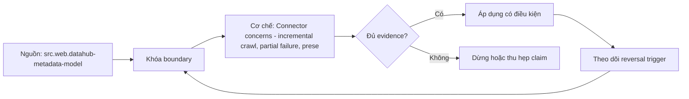

# Connector concerns - incremental crawl, partial failure, preserved annotations

> [!abstract] Câu hỏi trung tâm
> Connector incremental phải xử lý checkpoint, partial failure và preserved annotations thế nào để không mất metadata do người dùng quản trị?

## 1. Checkpoint semantics

Cursor có thể là timestamp, page token, log offset hay object version; checkpoint chỉ advance sau durable accepted scope. Đừng bắt đầu bằng tên công cụ. Hãy bắt đầu bằng đối tượng được bảo vệ, boundary quan sát được và hậu quả nếu kết luận sai. Trong bài `Connector concerns - incremental crawl, partial failure, preserved annotations`, câu hỏi thực dụng là: Connector incremental phải xử lý checkpoint, partial failure và preserved annotations thế nào để không mất metadata do người dùng quản trị? Ta ghi rõ grain, population, time window, owner và hành động sau failure; nếu một trường chưa biết thì đánh dấu unknown thay vì lấp bằng mặc định. Bằng chứng tối thiểu gồm fixture có version, cấu hình hoặc rule đã resolve, raw observation, expected result và limitation. Phần này là curriculum synthesis dựa trên các nguồn đã định danh, không phải lời hứa rằng mọi adapter hay deployment đều có cùng hành vi.

## 2. Overlap and dedup

Incremental window thường cần overlap để chống late updates; canonical event/entity identity hấp thụ replay. Điểm khó không nằm ở cú pháp mà ở identity và scope. Hai phép đo cùng tên vẫn có thể nói về hai population hoặc hai thời điểm khác nhau. Trong bài `Connector concerns - incremental crawl, partial failure, preserved annotations`, câu hỏi thực dụng là: Connector incremental phải xử lý checkpoint, partial failure và preserved annotations thế nào để không mất metadata do người dùng quản trị? Ta ghi rõ grain, population, time window, owner và hành động sau failure; nếu một trường chưa biết thì đánh dấu unknown thay vì lấp bằng mặc định. Bằng chứng tối thiểu gồm fixture có version, cấu hình hoặc rule đã resolve, raw observation, expected result và limitation. Phần này là curriculum synthesis dựa trên các nguồn đã định danh, không phải lời hứa rằng mọi adapter hay deployment đều có cùng hành vi.

## 3. Partial failure

Phân loại permission, parse, rate limit, object-not-found và sink rejection; giữ failed work units để retry có scope. Một dashboard xanh chỉ là tín hiệu. Muốn biến nó thành bằng chứng phải giữ input, phiên bản, rule, trạng thái trước-sau và cách tính độc lập. Trong bài `Connector concerns - incremental crawl, partial failure, preserved annotations`, câu hỏi thực dụng là: Connector incremental phải xử lý checkpoint, partial failure và preserved annotations thế nào để không mất metadata do người dùng quản trị? Ta ghi rõ grain, population, time window, owner và hành động sau failure; nếu một trường chưa biết thì đánh dấu unknown thay vì lấp bằng mặc định. Bằng chứng tối thiểu gồm fixture có version, cấu hình hoặc rule đã resolve, raw observation, expected result và limitation. Phần này là curriculum synthesis dựa trên các nguồn đã định danh, không phải lời hứa rằng mọi adapter hay deployment đều có cùng hành vi.

## 4. Deletion detection

Full inventory diff, tombstone stream hay inactivity timeout có confidence khác nhau; không biến không thấy thành deleted ngay. Thiết kế tốt phải chịu được counterexample. Hãy chủ động tạo case sát boundary, case thiếu dữ liệu và case replay thay vì chỉ chạy happy path. Trong bài `Connector concerns - incremental crawl, partial failure, preserved annotations`, câu hỏi thực dụng là: Connector incremental phải xử lý checkpoint, partial failure và preserved annotations thế nào để không mất metadata do người dùng quản trị? Ta ghi rõ grain, population, time window, owner và hành động sau failure; nếu một trường chưa biết thì đánh dấu unknown thay vì lấp bằng mặc định. Bằng chứng tối thiểu gồm fixture có version, cấu hình hoặc rule đã resolve, raw observation, expected result và limitation. Phần này là curriculum synthesis dựa trên các nguồn đã định danh, không phải lời hứa rằng mọi adapter hay deployment đều có cùng hành vi.

## 5. Preserved annotations

Connector-owned aspects được refresh; human/governance-owned aspects cần merge policy và không bị full snapshot ghi đè. Chi phí vận hành thuộc contract. Một rule đúng nhưng quá đắt, quá ồn hoặc không có owner sẽ nhanh chóng bị tắt và mất tác dụng. Trong bài `Connector concerns - incremental crawl, partial failure, preserved annotations`, câu hỏi thực dụng là: Connector incremental phải xử lý checkpoint, partial failure và preserved annotations thế nào để không mất metadata do người dùng quản trị? Ta ghi rõ grain, population, time window, owner và hành động sau failure; nếu một trường chưa biết thì đánh dấu unknown thay vì lấp bằng mặc định. Bằng chứng tối thiểu gồm fixture có version, cấu hình hoặc rule đã resolve, raw observation, expected result và limitation. Phần này là curriculum synthesis dựa trên các nguồn đã định danh, không phải lời hứa rằng mọi adapter hay deployment đều có cùng hành vi.

## 6. Connector SLO

Đo coverage, lag, error rate, checkpoint age và annotation-loss incidents thay vì chỉ job success. Kết luận cần có điều kiện đảo chiều. Khi volume, latency, nguồn thẩm quyền hoặc topology đổi, quyết định cũ phải được xem xét lại bằng cùng một oracle. Trong bài `Connector concerns - incremental crawl, partial failure, preserved annotations`, câu hỏi thực dụng là: Connector incremental phải xử lý checkpoint, partial failure và preserved annotations thế nào để không mất metadata do người dùng quản trị? Ta ghi rõ grain, population, time window, owner và hành động sau failure; nếu một trường chưa biết thì đánh dấu unknown thay vì lấp bằng mặc định. Bằng chứng tối thiểu gồm fixture có version, cấu hình hoặc rule đã resolve, raw observation, expected result và limitation. Phần này là curriculum synthesis dựa trên các nguồn đã định danh, không phải lời hứa rằng mọi adapter hay deployment đều có cùng hành vi.

## 7. Ma trận kiểm chứng từng mệnh đề

Với `wiki.metadata.connector-incremental-partial-annotations`, command thành công không tự chứng minh dữ liệu đúng. Protocol riêng của bài là: Chạy connector/parser/event fixture có expected entity-edge manifest, tiêm partial failure hoặc ambiguity và đo missing/extra/unknown theo producer. Mỗi probe dưới đây phải nối input boundary với failure signal và oracle có thể phản bác kết luận.

### 7.1. Connector concerns - incremental crawl, partial failure, preserved annotations: kiểm `Checkpoint semantics` bằng case 1, cụ thể cursor có thể là timestamp, page token, log offset hay object version; checkpoint chỉ advance sau durable accepted scope

**Mệnh đề cần kiểm.** Connector concerns - incremental crawl, partial failure, preserved annotations: kiểm `Checkpoint semantics` bằng case 1, cụ thể cursor có thể là timestamp, page token, log offset hay object version; checkpoint chỉ advance sau durable accepted scope.

**Thiết kế phép thử cho `wiki.metadata.connector-incremental-partial-annotations`.** Trong ngữ cảnh `wiki.metadata.connector-incremental-partial-annotations`, tạo positive control và negative control chỉ khác đúng một điều kiện. Khóa input snapshot, phiên bản và owner của rule; chạy đúng population được bài `Connector concerns - incremental crawl, partial failure, preserved annotations` công bố.

**Bằng chứng cần giữ.** Đối với probe 1 của `Connector concerns - incremental crawl, partial failure, preserved annotations`, giữ fixture, raw failing rows và lệnh tái hiện. Nếu chưa chạy lab, ghi expected evidence và giữ trạng thái review; không biến protocol thành observation.

### 7.2. Connector concerns - incremental crawl, partial failure, preserved annotations: kiểm `Overlap and dedup` bằng case 2, cụ thể incremental window thường cần overlap để chống late updates; canonical event/entity identity hấp thụ replay

**Mệnh đề cần kiểm.** Connector concerns - incremental crawl, partial failure, preserved annotations: kiểm `Overlap and dedup` bằng case 2, cụ thể incremental window thường cần overlap để chống late updates; canonical event/entity identity hấp thụ replay.

**Thiết kế phép thử cho `wiki.metadata.connector-incremental-partial-annotations`.** Trong ngữ cảnh `wiki.metadata.connector-incremental-partial-annotations`, đổi grain nhưng giữ tổng số dòng để lộ phép đo sai cấp. Khóa input snapshot, phiên bản và owner của rule; chạy đúng population được bài `Connector concerns - incremental crawl, partial failure, preserved annotations` công bố.

**Bằng chứng cần giữ.** Đối với probe 2 của `Connector concerns - incremental crawl, partial failure, preserved annotations`, báo numerator, denominator và key set ở cả hai grain. Nếu chưa chạy lab, ghi expected evidence và giữ trạng thái review; không biến protocol thành observation.

### 7.3. Connector concerns - incremental crawl, partial failure, preserved annotations: kiểm `Partial failure` bằng case 3, cụ thể phân loại permission, parse, rate limit, object-not-found và sink rejection; giữ failed work units để retry có scope

**Mệnh đề cần kiểm.** Connector concerns - incremental crawl, partial failure, preserved annotations: kiểm `Partial failure` bằng case 3, cụ thể phân loại permission, parse, rate limit, object-not-found và sink rejection; giữ failed work units để retry có scope.

**Thiết kế phép thử cho `wiki.metadata.connector-incremental-partial-annotations`.** Trong ngữ cảnh `wiki.metadata.connector-incremental-partial-annotations`, đưa một giá trị tới đúng boundary và một giá trị vượt boundary. Khóa input snapshot, phiên bản và owner của rule; chạy đúng population được bài `Connector concerns - incremental crawl, partial failure, preserved annotations` công bố.

**Bằng chứng cần giữ.** Đối với probe 3 của `Connector concerns - incremental crawl, partial failure, preserved annotations`, lưu hai observed values cùng rule đã resolve. Nếu chưa chạy lab, ghi expected evidence và giữ trạng thái review; không biến protocol thành observation.

### 7.4. Connector concerns - incremental crawl, partial failure, preserved annotations: kiểm `Deletion detection` bằng case 4, cụ thể full inventory diff, tombstone stream hay inactivity timeout có confidence khác nhau; không biến không thấy thành deleted ngay

**Mệnh đề cần kiểm.** Connector concerns - incremental crawl, partial failure, preserved annotations: kiểm `Deletion detection` bằng case 4, cụ thể full inventory diff, tombstone stream hay inactivity timeout có confidence khác nhau; không biến không thấy thành deleted ngay.

**Thiết kế phép thử cho `wiki.metadata.connector-incremental-partial-annotations`.** Trong ngữ cảnh `wiki.metadata.connector-incremental-partial-annotations`, kill tiến trình ngay trước rồi ngay sau durable side effect. Khóa input snapshot, phiên bản và owner của rule; chạy đúng population được bài `Connector concerns - incremental crawl, partial failure, preserved annotations` công bố.

**Bằng chứng cần giữ.** Đối với probe 4 của `Connector concerns - incremental crawl, partial failure, preserved annotations`, lưu checkpoint, external ledger và trạng thái sau restart. Nếu chưa chạy lab, ghi expected evidence và giữ trạng thái review; không biến protocol thành observation.

### 7.5. Connector concerns - incremental crawl, partial failure, preserved annotations: kiểm `Preserved annotations` bằng case 5, cụ thể connector-owned aspects được refresh; human/governance-owned aspects cần merge policy và không bị full snapshot ghi đè

**Mệnh đề cần kiểm.** Connector concerns - incremental crawl, partial failure, preserved annotations: kiểm `Preserved annotations` bằng case 5, cụ thể connector-owned aspects được refresh; human/governance-owned aspects cần merge policy và không bị full snapshot ghi đè.

**Thiết kế phép thử cho `wiki.metadata.connector-incremental-partial-annotations`.** Trong ngữ cảnh `wiki.metadata.connector-incremental-partial-annotations`, đảo thứ tự input và concurrency nhưng giữ logical population. Khóa input snapshot, phiên bản và owner của rule; chạy đúng population được bài `Connector concerns - incremental crawl, partial failure, preserved annotations` công bố.

**Bằng chứng cần giữ.** Đối với probe 5 của `Connector concerns - incremental crawl, partial failure, preserved annotations`, so canonical hash và business totals giữa các thứ tự. Nếu chưa chạy lab, ghi expected evidence và giữ trạng thái review; không biến protocol thành observation.

### 7.6. Connector concerns - incremental crawl, partial failure, preserved annotations: kiểm `Connector SLO` bằng case 6, cụ thể đo coverage, lag, error rate, checkpoint age và annotation-loss incidents thay vì chỉ job success

**Mệnh đề cần kiểm.** Connector concerns - incremental crawl, partial failure, preserved annotations: kiểm `Connector SLO` bằng case 6, cụ thể đo coverage, lag, error rate, checkpoint age và annotation-loss incidents thay vì chỉ job success.

**Thiết kế phép thử cho `wiki.metadata.connector-incremental-partial-annotations`.** Trong ngữ cảnh `wiki.metadata.connector-incremental-partial-annotations`, replay cùng identity với payload giống rồi payload xung đột. Khóa input snapshot, phiên bản và owner của rule; chạy đúng population được bài `Connector concerns - incremental crawl, partial failure, preserved annotations` công bố.

**Bằng chứng cần giữ.** Đối với probe 6 của `Connector concerns - incremental crawl, partial failure, preserved annotations`, tách duplicate replay khỏi identity collision bằng reason code. Nếu chưa chạy lab, ghi expected evidence và giữ trạng thái review; không biến protocol thành observation.

### 7.7. Connector concerns - incremental crawl, partial failure, preserved annotations: kiểm `Checkpoint semantics` bằng case 7, cụ thể cursor có thể là timestamp, page token, log offset hay object version; checkpoint chỉ advance sau durable accepted scope

**Mệnh đề cần kiểm.** Connector concerns - incremental crawl, partial failure, preserved annotations: kiểm `Checkpoint semantics` bằng case 7, cụ thể cursor có thể là timestamp, page token, log offset hay object version; checkpoint chỉ advance sau durable accepted scope.

**Thiết kế phép thử cho `wiki.metadata.connector-incremental-partial-annotations`.** Trong ngữ cảnh `wiki.metadata.connector-incremental-partial-annotations`, thêm record tới trễ trong horizon và ngoài horizon. Khóa input snapshot, phiên bản và owner của rule; chạy đúng population được bài `Connector concerns - incremental crawl, partial failure, preserved annotations` công bố.

**Bằng chứng cần giữ.** Đối với probe 7 của `Connector concerns - incremental crawl, partial failure, preserved annotations`, báo accepted-late, rejected-late và oldest outstanding timestamp. Nếu chưa chạy lab, ghi expected evidence và giữ trạng thái review; không biến protocol thành observation.

### 7.8. Connector concerns - incremental crawl, partial failure, preserved annotations: kiểm `Overlap and dedup` bằng case 8, cụ thể incremental window thường cần overlap để chống late updates; canonical event/entity identity hấp thụ replay

**Mệnh đề cần kiểm.** Connector concerns - incremental crawl, partial failure, preserved annotations: kiểm `Overlap and dedup` bằng case 8, cụ thể incremental window thường cần overlap để chống late updates; canonical event/entity identity hấp thụ replay.

**Thiết kế phép thử cho `wiki.metadata.connector-incremental-partial-annotations`.** Trong ngữ cảnh `wiki.metadata.connector-incremental-partial-annotations`, đổi schema theo một cách tương thích rồi một cách phá vỡ semantics. Khóa input snapshot, phiên bản và owner của rule; chạy đúng population được bài `Connector concerns - incremental crawl, partial failure, preserved annotations` công bố.

**Bằng chứng cần giữ.** Đối với probe 8 của `Connector concerns - incremental crawl, partial failure, preserved annotations`, giữ schema diff, classification và consumer-visible result. Nếu chưa chạy lab, ghi expected evidence và giữ trạng thái review; không biến protocol thành observation.

### 7.9. Connector concerns - incremental crawl, partial failure, preserved annotations: kiểm `Partial failure` bằng case 9, cụ thể phân loại permission, parse, rate limit, object-not-found và sink rejection; giữ failed work units để retry có scope

**Mệnh đề cần kiểm.** Connector concerns - incremental crawl, partial failure, preserved annotations: kiểm `Partial failure` bằng case 9, cụ thể phân loại permission, parse, rate limit, object-not-found và sink rejection; giữ failed work units để retry có scope.

**Thiết kế phép thử cho `wiki.metadata.connector-incremental-partial-annotations`.** Trong ngữ cảnh `wiki.metadata.connector-incremental-partial-annotations`, tạo missing và duplicate bù nhau để count tổng không đổi. Khóa input snapshot, phiên bản và owner của rule; chạy đúng population được bài `Connector concerns - incremental crawl, partial failure, preserved annotations` công bố.

**Bằng chứng cần giữ.** Đối với probe 9 của `Connector concerns - incremental crawl, partial failure, preserved annotations`, so key multiset và typed hashes thay vì chỉ row count. Nếu chưa chạy lab, ghi expected evidence và giữ trạng thái review; không biến protocol thành observation.

### 7.10. Connector concerns - incremental crawl, partial failure, preserved annotations: kiểm `Deletion detection` bằng case 10, cụ thể full inventory diff, tombstone stream hay inactivity timeout có confidence khác nhau; không biến không thấy thành deleted ngay

**Mệnh đề cần kiểm.** Connector concerns - incremental crawl, partial failure, preserved annotations: kiểm `Deletion detection` bằng case 10, cụ thể full inventory diff, tombstone stream hay inactivity timeout có confidence khác nhau; không biến không thấy thành deleted ngay.

**Thiết kế phép thử cho `wiki.metadata.connector-incremental-partial-annotations`.** Trong ngữ cảnh `wiki.metadata.connector-incremental-partial-annotations`, cho reviewer tái hiện chỉ từ evidence package. Khóa input snapshot, phiên bản và owner của rule; chạy đúng population được bài `Connector concerns - incremental crawl, partial failure, preserved annotations` công bố.

**Bằng chứng cần giữ.** Đối với probe 10 của `Connector concerns - incremental crawl, partial failure, preserved annotations`, package phải đủ để người khác dựng lại decision và limitation. Nếu chưa chạy lab, ghi expected evidence và giữ trạng thái review; không biến protocol thành observation.

### 7.11. Connector concerns - incremental crawl, partial failure, preserved annotations: kiểm `Preserved annotations` bằng case 11, cụ thể connector-owned aspects được refresh; human/governance-owned aspects cần merge policy và không bị full snapshot ghi đè

**Mệnh đề cần kiểm.** Connector concerns - incremental crawl, partial failure, preserved annotations: kiểm `Preserved annotations` bằng case 11, cụ thể connector-owned aspects được refresh; human/governance-owned aspects cần merge policy và không bị full snapshot ghi đè.

**Thiết kế phép thử cho `wiki.metadata.connector-incremental-partial-annotations`.** Trong ngữ cảnh `wiki.metadata.connector-incremental-partial-annotations`, so với oracle độc lập không dùng chung query hoặc parser. Khóa input snapshot, phiên bản và owner của rule; chạy đúng population được bài `Connector concerns - incremental crawl, partial failure, preserved annotations` công bố.

**Bằng chứng cần giữ.** Đối với probe 11 của `Connector concerns - incremental crawl, partial failure, preserved annotations`, independent result phải khớp ở grain đã công bố. Nếu chưa chạy lab, ghi expected evidence và giữ trạng thái review; không biến protocol thành observation.

### 7.12. Connector concerns - incremental crawl, partial failure, preserved annotations: kiểm `Connector SLO` bằng case 12, cụ thể đo coverage, lag, error rate, checkpoint age và annotation-loss incidents thay vì chỉ job success

**Mệnh đề cần kiểm.** Connector concerns - incremental crawl, partial failure, preserved annotations: kiểm `Connector SLO` bằng case 12, cụ thể đo coverage, lag, error rate, checkpoint age và annotation-loss incidents thay vì chỉ job success.

**Thiết kế phép thử cho `wiki.metadata.connector-incremental-partial-annotations`.** Trong ngữ cảnh `wiki.metadata.connector-incremental-partial-annotations`, chạy scope hẹp và population đầy đủ rồi công bố phần bị loại. Khóa input snapshot, phiên bản và owner của rule; chạy đúng population được bài `Connector concerns - incremental crawl, partial failure, preserved annotations` công bố.

**Bằng chứng cần giữ.** Đối với probe 12 của `Connector concerns - incremental crawl, partial failure, preserved annotations`, coverage phải nêu rõ excluded nodes, partitions hoặc incidents. Nếu chưa chạy lab, ghi expected evidence và giữ trạng thái review; không biến protocol thành observation.

### 7.13. Connector concerns - incremental crawl, partial failure, preserved annotations: kiểm `Checkpoint semantics` bằng case 13, cụ thể cursor có thể là timestamp, page token, log offset hay object version; checkpoint chỉ advance sau durable accepted scope

**Mệnh đề cần kiểm.** Connector concerns - incremental crawl, partial failure, preserved annotations: kiểm `Checkpoint semantics` bằng case 13, cụ thể cursor có thể là timestamp, page token, log offset hay object version; checkpoint chỉ advance sau durable accepted scope.

**Thiết kế phép thử cho `wiki.metadata.connector-incremental-partial-annotations`.** Trong ngữ cảnh `wiki.metadata.connector-incremental-partial-annotations`, thử timezone, precision hoặc partition ở hai phía của ranh giới. Khóa input snapshot, phiên bản và owner của rule; chạy đúng population được bài `Connector concerns - incremental crawl, partial failure, preserved annotations` công bố.

**Bằng chứng cần giữ.** Đối với probe 13 của `Connector concerns - incremental crawl, partial failure, preserved annotations`, UTC/local interval và rounding policy phải hiện trong output. Nếu chưa chạy lab, ghi expected evidence và giữ trạng thái review; không biến protocol thành observation.

### 7.14. Connector concerns - incremental crawl, partial failure, preserved annotations: kiểm `Overlap and dedup` bằng case 14, cụ thể incremental window thường cần overlap để chống late updates; canonical event/entity identity hấp thụ replay

**Mệnh đề cần kiểm.** Connector concerns - incremental crawl, partial failure, preserved annotations: kiểm `Overlap and dedup` bằng case 14, cụ thể incremental window thường cần overlap để chống late updates; canonical event/entity identity hấp thụ replay.

**Thiết kế phép thử cho `wiki.metadata.connector-incremental-partial-annotations`.** Trong ngữ cảnh `wiki.metadata.connector-incremental-partial-annotations`, đổi constraint đủ lớn để quyết định phải đảo. Khóa input snapshot, phiên bản và owner của rule; chạy đúng population được bài `Connector concerns - incremental crawl, partial failure, preserved annotations` công bố.

**Bằng chứng cần giữ.** Đối với probe 14 của `Connector concerns - incremental crawl, partial failure, preserved annotations`, ADR phải lưu changed constraint và reversal threshold. Nếu chưa chạy lab, ghi expected evidence và giữ trạng thái review; không biến protocol thành observation.

### 7.15. Connector concerns - incremental crawl, partial failure, preserved annotations: kiểm `Partial failure` bằng case 15, cụ thể phân loại permission, parse, rate limit, object-not-found và sink rejection; giữ failed work units để retry có scope

**Mệnh đề cần kiểm.** Connector concerns - incremental crawl, partial failure, preserved annotations: kiểm `Partial failure` bằng case 15, cụ thể phân loại permission, parse, rate limit, object-not-found và sink rejection; giữ failed work units để retry có scope.

**Thiết kế phép thử cho `wiki.metadata.connector-incremental-partial-annotations`.** Trong ngữ cảnh `wiki.metadata.connector-incremental-partial-annotations`, chạy lại từ môi trường sạch với versions và seed đã khóa. Khóa input snapshot, phiên bản và owner của rule; chạy đúng population được bài `Connector concerns - incremental crawl, partial failure, preserved annotations` công bố.

**Bằng chứng cần giữ.** Đối với probe 15 của `Connector concerns - incremental crawl, partial failure, preserved annotations`, canonical result phải ổn định hoặc mọi nondeterminism phải được giải thích. Nếu chưa chạy lab, ghi expected evidence và giữ trạng thái review; không biến protocol thành observation.

## 8. Quy trình phản biện

1. Viết consumer-visible invariant cho `Connector concerns - incremental crawl, partial failure, preserved annotations` trước khi chọn query hoặc tool.
2. Khóa grain, identity, population, time window và authoritative source.
3. Phân biệt declared configuration, executed state và published state.
4. Chạy negative control, replay hoặc changed-assumption case phù hợp.
5. Đối soát bằng oracle độc lập; công bố coverage và phần không quan sát được.
6. Gắn owner, hành động, reversal trigger và hạn review cho kết luận.

## 9. Câu hỏi tự kiểm tra

1. `Connector concerns - incremental crawl, partial failure, preserved annotations: kiểm `Checkpoint semantics` bằng case 1, cụ thể cursor có thể là timestamp, page token, log offset hay object version; checkpoint chỉ advance sau durable accepted scope` thất bại đầu tiên ở boundary nào?
2. Artifact nào mạnh nhất để trả lời `Connector concerns - incremental crawl, partial failure, preserved annotations: kiểm `Partial failure` bằng case 3, cụ thể phân loại permission, parse, rate limit, object-not-found và sink rejection; giữ failed work units để retry có scope`?
3. Counterexample nhỏ nhất cho `Connector concerns - incremental crawl, partial failure, preserved annotations: kiểm `Connector SLO` bằng case 6, cụ thể đo coverage, lag, error rate, checkpoint age và annotation-loss incidents thay vì chỉ job success` gồm những state nào?
4. `Connector concerns - incremental crawl, partial failure, preserved annotations: kiểm `Partial failure` bằng case 9, cụ thể phân loại permission, parse, rate limit, object-not-found và sink rejection; giữ failed work units để retry có scope` có thể xanh giả ra sao?
5. Constraint nào khiến quyết định ở `Connector concerns - incremental crawl, partial failure, preserved annotations: kiểm `Overlap and dedup` bằng case 14, cụ thể incremental window thường cần overlap để chống late updates; canonical event/entity identity hấp thụ replay` phải đảo?
6. Phần nào của `Connector concerns - incremental crawl, partial failure, preserved annotations: kiểm `Partial failure` bằng case 15, cụ thể phân loại permission, parse, rate limit, object-not-found và sink rejection; giữ failed work units để retry có scope` mới là protocol, chưa phải observation?

## 10. Giới hạn và điều chưa cho phép kết luận

- Lab của `Connector concerns - incremental crawl, partial failure, preserved annotations` chưa chạy trên hệ thống production; nội dung là giáo trình và expected evidence.
- Hành vi phụ thuộc phiên bản, connector, scheduler, warehouse và catalog configuration phải được kiểm lại.
- Các ma trận, ladder và threshold do giáo trình tổng hợp không được gán nguyên văn cho vendor.
- Note giữ trạng thái `review` cho tới khi owner duyệt semantics và learner artifact.

## Reference
1. [[SRC-DATAHUB-METADATA-MODEL]]
2. [[SRC-DATAHUB-LINEAGE]]

## Source coverage

| Source slice | Nội dung sử dụng | Trạng thái |
|---|---|---|
| [[SRC-DATAHUB-METADATA-MODEL]] | Contract hoặc cơ chế liên quan trực tiếp tới `Connector concerns - incremental crawl, partial failure, preserved annotations` | Đã đọc locator; cần pin version khi chạy lab |
| [[SRC-DATAHUB-LINEAGE]] | Contract hoặc cơ chế liên quan trực tiếp tới `Connector concerns - incremental crawl, partial failure, preserved annotations` | Đã đọc locator; cần pin version khi chạy lab |

## Key takeaways
- Incremental connector phải bảo toàn human-owned annotations và giữ partial failure có thể replay.
- Với `wiki.metadata.connector-incremental-partial-annotations`, quality của kết luận phụ thuộc identity, coverage và oracle chứ không phụ thuộc màu dashboard.
- Câu hỏi `Connector incremental phải xử lý checkpoint, partial failure và preserved annotations thế nào để không mất metadata do người dùng quản trị?` chỉ được trả lời trong scope và version đã ghi.
- Các source IDs `src.web.datahub-metadata-model, src.web.datahub-lineage` đặt ranh giới cho source fact; phần còn lại là synthesis có nhãn.
- Trước khi lab chạy, đây là note đã kiểm cấu trúc và provenance, chưa phải chứng nhận production.

<!-- ATOMIC-EXECUTION-CAPSULE:START -->

## Execution capsule: kiểm chứng `wiki.metadata.connector-incremental-partial-annotations`

> [!important] Phân loại mệnh đề
> Với `wiki.metadata.connector-incremental-partial-annotations`, sơ đồ, ví dụ và artifact về **Connector concerns - incremental crawl, partial failure, preserved annotations** là **synthesis để kiểm chứng**; chúng không phải trích dẫn hay case nguyên văn của nguồn.

### Sơ đồ cơ chế và điểm kiểm soát



Đọc sơ đồ `wiki.metadata.connector-incremental-partial-annotations` từ trái sang phải: source chỉ cung cấp claim ban đầu cho **Connector concerns - incremental crawl, partial failure, preserved annotations**; quyết định chỉ được đi tiếp sau khi boundary, evidence và điều kiện đảo quyết định đã hiện hữu.

### Artifact thực thi tối thiểu

```sql
-- Verification harness for: Connector concerns - incremental crawl, partial failure, preserved annotations
WITH evidence AS (
    SELECT 'wiki.metadata.connector-incremental-partial-annotations' AS concept_id,
           'boundary_declared' AS check_name, 1 AS passed
    UNION ALL
    SELECT 'wiki.metadata.connector-incremental-partial-annotations', 'independent_oracle', 1
    UNION ALL
    SELECT 'wiki.metadata.connector-incremental-partial-annotations', 'reversal_trigger_recorded', 1
)
SELECT concept_id,
       MIN(passed) AS all_hard_checks_pass,
       COUNT(*) AS evidence_items
FROM evidence
GROUP BY concept_id
HAVING MIN(passed) = 1;
```

Artifact của `wiki.metadata.connector-incremental-partial-annotations` buộc người dùng ghi boundary, oracle và reversal trigger cho **Connector concerns - incremental crawl, partial failure, preserved annotations**. Các giá trị minh họa phải được thay bằng evidence thật trước khi dùng cho quyết định.

### Tự kiểm tra trước khi tái sử dụng

1. Bạn có thể trả lời `Connector incremental phải xử lý checkpoint, partial failure và preserved annotations thế nào để không mất metadata do người dùng quản trị?` bằng một câu mà không kéo thêm concept thứ hai không?
2. Source locator nào đỡ cho claim, và phần nào chỉ là synthesis trong note?
3. Observation nào khiến bạn dừng, thu hẹp hoặc đảo quyết định?
4. Artifact nào cho phép một reviewer độc lập tái hiện kết quả?

<!-- ATOMIC-EXECUTION-CAPSULE:END -->
