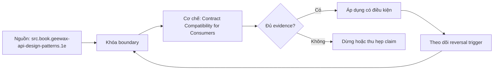

# Contract Compatibility for Consumers

> [!abstract] Câu hỏi trung tâm
> Làm sao phân loại và di trú schema, semantic, quality và freshness contract changes theo hành vi consumer mà không làm consumer lỗi hoặc hiểu sai?

## 1. Năm phần hợp đồng

Schema: fields/types/keys/grain. Semantics: population, units, time and null/enum meaning. Quality: completeness/validity/accuracy thresholds and response. Freshness/availability: cutoff, schedule, SLO and incident behavior. Change process: classification, notice, versions, migration, deprecation and support. Contract có owner/version/effective date; field descriptions rời rạc không tạo contract đầy đủ.

## 2. Compatibility là quan sát của consumer

Producer diff chỉ là input. Thay đổi compatible khi supported consumers tiếp tục chạy và giữ intended meaning within published contract. Strict parser, `SELECT *`, positional CSV, schema snapshot, BI refresh, cost limit hoặc semantic assumption có thể làm additive field không an toàn. Ngược lại remove field không dùng có thể operationally safe sau evidence, dù schema checker gọi breaking. Policy cần declared consumer behavior và tests.

## 3. Ba lớp thay đổi

Compatible: không đổi result/behavior cho supported use. Semantic-result change: interface chạy nhưng numbers/population/freshness/quality meaning đổi; nguy hiểm vì không signal kỹ thuật. Breaking: consumer query/parser/result contract fail hoặc cần migration. Security/policy tightening có thể intentionally break access và cần controlled communication. Classification ghi affected consumers, evidence và uncertainty, không chỉ label.

## 4. dbt checker và giới hạn

dbt current docs phát hiện remove column, type change, constraint removal/modify và contracted unversioned changes; thêm column/constraint không bị tool gọi breaking. Đây là schema gate hữu ích, không phát hiện rename-via-copy semantic drift, changed formula, grain, null, timezone hay SLO. CI kết hợp schema diff, semantic regression, representative consumer contract tests và owner review.

## 5. Expand–migrate–contract

Expand thêm new field/version/interface while old remains; backfill/dual-write or compute both; publish migration mapping. Migrate consumers với telemetry, parity/delta tests and support window. Contract/remove old only after inventory, owner approval, no unresolved use and rollback/archive. Duration theo consumer cadence, migration effort, stakes and observability coverage; kỹ thuật không tự đặt một con số chung.

## 6. Tìm consumers và xử lý unknown

Query logs, lineage, catalog subscriptions, scheduled BI/jobs, service accounts, repositories and owner attestations. Logs miss offline exports, cached files, dormant monthly/quarterly reports and external copies. Inventory marks confirmed, suspected and unknown. No observed query is not proof of no consumer. For unknown risk, extend window, deny new usage, contact owners, run canary or keep compatibility layer.

## 7. Lab ba changes dưới tải

One additive schema candidate tested against strict and tolerant consumers; one semantic-result change with notification/regression; one breaking change using v2 and expand–migrate–contract. Run representative workload continuously, record errors and silent deltas. Success requires zero unsupported break for declared consumers, known old-version users before removal, and evidence that meaning—not just availability—remained correct.

## 8. Ma trận kiểm chứng từng mệnh đề

Mỗi mệnh đề dưới đây cần observation, fixture hoặc artifact có thể lưu. Tên công nghệ, consensus hoặc output nhìn hợp lý không tự là bằng chứng.

### 8.1. contract has schema semantics quality freshness change process

**Mệnh đề cần kiểm.** contract has schema semantics quality freshness change process.

**Cách kiểm.** Run additive, semantic-result and breaking changes against tolerant/strict representative consumers. Record schema diff, semantic delta, usage inventory, migration window, expand–migrate–contract steps and rollback evidence. Với riêng mệnh đề này, ghi input/context, expected observation, failure signal và boundary làm kết luận không còn đúng.

**Bằng chứng đạt cho `wiki.data-product.contract-compatibility`.** Lưu contract/decision version, fixture hoặc interview evidence, command/checklist output, reviewer và artifact hash. Nếu chưa thực hiện lab, trạng thái chỉ là protocol; không ghi thành kết quả đã quan sát.

### 8.2. compatibility is consumer-observed

**Mệnh đề cần kiểm.** compatibility is consumer-observed.

**Cách kiểm.** Run additive, semantic-result and breaking changes against tolerant/strict representative consumers. Record schema diff, semantic delta, usage inventory, migration window, expand–migrate–contract steps and rollback evidence. Với riêng mệnh đề này, ghi input/context, expected observation, failure signal và boundary làm kết luận không còn đúng.

**Bằng chứng đạt cho `wiki.data-product.contract-compatibility`.** Lưu contract/decision version, fixture hoặc interview evidence, command/checklist output, reviewer và artifact hash. Nếu chưa thực hiện lab, trạng thái chỉ là protocol; không ghi thành kết quả đã quan sát.

### 8.3. add column is not universally safe

**Mệnh đề cần kiểm.** add column is not universally safe.

**Cách kiểm.** Run additive, semantic-result and breaking changes against tolerant/strict representative consumers. Record schema diff, semantic delta, usage inventory, migration window, expand–migrate–contract steps and rollback evidence. Với riêng mệnh đề này, ghi input/context, expected observation, failure signal và boundary làm kết luận không còn đúng.

**Bằng chứng đạt cho `wiki.data-product.contract-compatibility`.** Lưu contract/decision version, fixture hoặc interview evidence, command/checklist output, reviewer và artifact hash. Nếu chưa thực hiện lab, trạng thái chỉ là protocol; không ghi thành kết quả đã quan sát.

### 8.4. strict parsers can break on additive fields

**Mệnh đề cần kiểm.** strict parsers can break on additive fields.

**Cách kiểm.** Run additive, semantic-result and breaking changes against tolerant/strict representative consumers. Record schema diff, semantic delta, usage inventory, migration window, expand–migrate–contract steps and rollback evidence. Với riêng mệnh đề này, ghi input/context, expected observation, failure signal và boundary làm kết luận không còn đúng.

**Bằng chứng đạt cho `wiki.data-product.contract-compatibility`.** Lưu contract/decision version, fixture hoặc interview evidence, command/checklist output, reviewer và artifact hash. Nếu chưa thực hiện lab, trạng thái chỉ là protocol; không ghi thành kết quả đã quan sát.

### 8.5. semantic-result change can stay technically green

**Mệnh đề cần kiểm.** semantic-result change can stay technically green.

**Cách kiểm.** Run additive, semantic-result and breaking changes against tolerant/strict representative consumers. Record schema diff, semantic delta, usage inventory, migration window, expand–migrate–contract steps and rollback evidence. Với riêng mệnh đề này, ghi input/context, expected observation, failure signal và boundary làm kết luận không còn đúng.

**Bằng chứng đạt cho `wiki.data-product.contract-compatibility`.** Lưu contract/decision version, fixture hoặc interview evidence, command/checklist output, reviewer và artifact hash. Nếu chưa thực hiện lab, trạng thái chỉ là protocol; không ghi thành kết quả đã quan sát.

### 8.6. security tightening may intentionally break access

**Mệnh đề cần kiểm.** security tightening may intentionally break access.

**Cách kiểm.** Run additive, semantic-result and breaking changes against tolerant/strict representative consumers. Record schema diff, semantic delta, usage inventory, migration window, expand–migrate–contract steps and rollback evidence. Với riêng mệnh đề này, ghi input/context, expected observation, failure signal và boundary làm kết luận không còn đúng.

**Bằng chứng đạt cho `wiki.data-product.contract-compatibility`.** Lưu contract/decision version, fixture hoặc interview evidence, command/checklist output, reviewer và artifact hash. Nếu chưa thực hiện lab, trạng thái chỉ là protocol; không ghi thành kết quả đã quan sát.

### 8.7. dbt schema checker has bounded scope

**Mệnh đề cần kiểm.** dbt schema checker has bounded scope.

**Cách kiểm.** Run additive, semantic-result and breaking changes against tolerant/strict representative consumers. Record schema diff, semantic delta, usage inventory, migration window, expand–migrate–contract steps and rollback evidence. Với riêng mệnh đề này, ghi input/context, expected observation, failure signal và boundary làm kết luận không còn đúng.

**Bằng chứng đạt cho `wiki.data-product.contract-compatibility`.** Lưu contract/decision version, fixture hoặc interview evidence, command/checklist output, reviewer và artifact hash. Nếu chưa thực hiện lab, trạng thái chỉ là protocol; không ghi thành kết quả đã quan sát.

### 8.8. formula and grain need semantic regression

**Mệnh đề cần kiểm.** formula and grain need semantic regression.

**Cách kiểm.** Run additive, semantic-result and breaking changes against tolerant/strict representative consumers. Record schema diff, semantic delta, usage inventory, migration window, expand–migrate–contract steps and rollback evidence. Với riêng mệnh đề này, ghi input/context, expected observation, failure signal và boundary làm kết luận không còn đúng.

**Bằng chứng đạt cho `wiki.data-product.contract-compatibility`.** Lưu contract/decision version, fixture hoặc interview evidence, command/checklist output, reviewer và artifact hash. Nếu chưa thực hiện lab, trạng thái chỉ là protocol; không ghi thành kết quả đã quan sát.

### 8.9. expand phase keeps old interface

**Mệnh đề cần kiểm.** expand phase keeps old interface.

**Cách kiểm.** Run additive, semantic-result and breaking changes against tolerant/strict representative consumers. Record schema diff, semantic delta, usage inventory, migration window, expand–migrate–contract steps and rollback evidence. Với riêng mệnh đề này, ghi input/context, expected observation, failure signal và boundary làm kết luận không còn đúng.

**Bằng chứng đạt cho `wiki.data-product.contract-compatibility`.** Lưu contract/decision version, fixture hoặc interview evidence, command/checklist output, reviewer và artifact hash. Nếu chưa thực hiện lab, trạng thái chỉ là protocol; không ghi thành kết quả đã quan sát.

### 8.10. migrate phase needs telemetry and parity

**Mệnh đề cần kiểm.** migrate phase needs telemetry and parity.

**Cách kiểm.** Run additive, semantic-result and breaking changes against tolerant/strict representative consumers. Record schema diff, semantic delta, usage inventory, migration window, expand–migrate–contract steps and rollback evidence. Với riêng mệnh đề này, ghi input/context, expected observation, failure signal và boundary làm kết luận không còn đúng.

**Bằng chứng đạt cho `wiki.data-product.contract-compatibility`.** Lưu contract/decision version, fixture hoặc interview evidence, command/checklist output, reviewer và artifact hash. Nếu chưa thực hiện lab, trạng thái chỉ là protocol; không ghi thành kết quả đã quan sát.

### 8.11. contract phase needs approval and rollback

**Mệnh đề cần kiểm.** contract phase needs approval and rollback.

**Cách kiểm.** Run additive, semantic-result and breaking changes against tolerant/strict representative consumers. Record schema diff, semantic delta, usage inventory, migration window, expand–migrate–contract steps and rollback evidence. Với riêng mệnh đề này, ghi input/context, expected observation, failure signal và boundary làm kết luận không còn đúng.

**Bằng chứng đạt cho `wiki.data-product.contract-compatibility`.** Lưu contract/decision version, fixture hoặc interview evidence, command/checklist output, reviewer và artifact hash. Nếu chưa thực hiện lab, trạng thái chỉ là protocol; không ghi thành kết quả đã quan sát.

### 8.12. window depends on consumer cadence and stakes

**Mệnh đề cần kiểm.** window depends on consumer cadence and stakes.

**Cách kiểm.** Run additive, semantic-result and breaking changes against tolerant/strict representative consumers. Record schema diff, semantic delta, usage inventory, migration window, expand–migrate–contract steps and rollback evidence. Với riêng mệnh đề này, ghi input/context, expected observation, failure signal và boundary làm kết luận không còn đúng.

**Bằng chứng đạt cho `wiki.data-product.contract-compatibility`.** Lưu contract/decision version, fixture hoặc interview evidence, command/checklist output, reviewer và artifact hash. Nếu chưa thực hiện lab, trạng thái chỉ là protocol; không ghi thành kết quả đã quan sát.

### 8.13. query logs miss offline exports

**Mệnh đề cần kiểm.** query logs miss offline exports.

**Cách kiểm.** Run additive, semantic-result and breaking changes against tolerant/strict representative consumers. Record schema diff, semantic delta, usage inventory, migration window, expand–migrate–contract steps and rollback evidence. Với riêng mệnh đề này, ghi input/context, expected observation, failure signal và boundary làm kết luận không còn đúng.

**Bằng chứng đạt cho `wiki.data-product.contract-compatibility`.** Lưu contract/decision version, fixture hoặc interview evidence, command/checklist output, reviewer và artifact hash. Nếu chưa thực hiện lab, trạng thái chỉ là protocol; không ghi thành kết quả đã quan sát.

### 8.14. unknown consumers remain explicit uncertainty

**Mệnh đề cần kiểm.** unknown consumers remain explicit uncertainty.

**Cách kiểm.** Run additive, semantic-result and breaking changes against tolerant/strict representative consumers. Record schema diff, semantic delta, usage inventory, migration window, expand–migrate–contract steps and rollback evidence. Với riêng mệnh đề này, ghi input/context, expected observation, failure signal và boundary làm kết luận không còn đúng.

**Bằng chứng đạt cho `wiki.data-product.contract-compatibility`.** Lưu contract/decision version, fixture hoặc interview evidence, command/checklist output, reviewer và artifact hash. Nếu chưa thực hiện lab, trạng thái chỉ là protocol; không ghi thành kết quả đã quan sát.

### 8.15. zero errors does not prove zero semantic drift

**Mệnh đề cần kiểm.** zero errors does not prove zero semantic drift.

**Cách kiểm.** Run additive, semantic-result and breaking changes against tolerant/strict representative consumers. Record schema diff, semantic delta, usage inventory, migration window, expand–migrate–contract steps and rollback evidence. Với riêng mệnh đề này, ghi input/context, expected observation, failure signal và boundary làm kết luận không còn đúng.

**Bằng chứng đạt cho `wiki.data-product.contract-compatibility`.** Lưu contract/decision version, fixture hoặc interview evidence, command/checklist output, reviewer và artifact hash. Nếu chưa thực hiện lab, trạng thái chỉ là protocol; không ghi thành kết quả đã quan sát.

## 9. Quy trình phản biện

1. Viết decision, consumer, contract và constraints trước khi chọn tool hoặc implementation.
2. Tách source fact, curriculum synthesis và organizational choice.
3. Dùng counterexample và changed constraint để kiểm quyết định có đảo đúng lúc.
4. Gắn mọi approval/certification với exact version, evidence và scope.
5. Kiểm cả valid path lẫn negative/failure path; không chỉ demo happy path.
6. Ghi limitation của telemetry, test environment và source authority.
7. Chưa có execution evidence thì giữ trạng thái `review`.

## 10. Câu hỏi tự kiểm tra

1. Decision hoặc invariant nào đang được bảo vệ?
2. Evidence nào độc lập với implementation đang được đánh giá?
3. Điều kiện nào làm lựa chọn hiện tại phải đảo?
4. Ai có quyền quyết nghĩa, ai triển khai và ai giữ quy trình?
5. Thay đổi nào ảnh hưởng consumer dù interface vẫn chạy?
6. Failure mode nào còn chưa có automated detector?

## 11. Giới hạn và điều chưa cho phép kết luận

- Chưa chạy các lab, migration, workload benchmark hoặc fault-injection; note mô tả protocol và expected evidence.
- Tài liệu sản phẩm web được kiểm ngày 2026-10-02; feature, syntax, license và integration có thể đổi.
- Các scorecard, lifecycle gates, failure matrix và decision contract là curriculum synthesis từ nguồn đã nêu; không gán nguyên văn cho một tác giả.
- Ví dụ tổ chức không thay discovery thực tế, threat model, cost model hoặc owner approval.
- Note giữ trạng thái `review` cho tới khi chủ dự án duyệt semantic meaning.

## Reference
1. [[SRC-GEEWAX-API-DESIGN-PATTERNS-1E]]
2. [[SRC-SOMMERVILLE-SOFTWARE-ENGINEERING-10E]]
3. [[SRC-DBT-MODEL-VERSIONS]]

## Source coverage

| Source slice | Nội dung sử dụng | Trạng thái |
|---|---|---|
| [[SRC-GEEWAX-API-DESIGN-PATTERNS-1E]] | Khái niệm, cơ chế hoặc decision boundary liên quan | Đã đọc locator được ghi trong source record; không suy ngoài phạm vi |
| [[SRC-SOMMERVILLE-SOFTWARE-ENGINEERING-10E]] | Khái niệm, cơ chế hoặc decision boundary liên quan | Đã đọc locator được ghi trong source record; không suy ngoài phạm vi |
| [[SRC-DBT-MODEL-VERSIONS]] | Khái niệm, cơ chế hoặc decision boundary liên quan | Đã đọc locator được ghi trong source record; không suy ngoài phạm vi |

## Key takeaways
- Chọn kiến trúc và data product từ decision/constraints, không từ độ mới của công nghệ.
- Metric governance cần versioned evidence, lifecycle gates và owner có quyền rõ.
- Failure matrix chỉ hữu dụng khi mỗi dòng có detector hoặc control kiểm được.
- Capstone là hồ sơ bằng chứng tích hợp, không phải bộ YAML hay dashboard trình diễn.
- Discovery phải cho phép kết luận không xây analytics product.

<!-- ATOMIC-EXECUTION-CAPSULE:START -->

## Execution capsule — kiểm chứng `wiki.data-product.contract-compatibility`

> [!important] Phân loại mệnh đề
> Với `wiki.data-product.contract-compatibility`, sơ đồ, ví dụ và artifact về **Contract Compatibility for Consumers** là **synthesis để kiểm chứng**; chúng không phải trích dẫn hay case nguyên văn của nguồn.

### Sơ đồ cơ chế và điểm kiểm soát



Đọc sơ đồ `wiki.data-product.contract-compatibility` từ trái sang phải: source chỉ cung cấp claim ban đầu cho **Contract Compatibility for Consumers**; quyết định chỉ được đi tiếp sau khi boundary, evidence và điều kiện đảo quyết định đã hiện hữu.

### Artifact thực thi tối thiểu

```sql
-- Verification harness for: Contract Compatibility for Consumers
WITH evidence AS (
    SELECT 'wiki.data-product.contract-compatibility' AS concept_id,
           'boundary_declared' AS check_name, 1 AS passed
    UNION ALL
    SELECT 'wiki.data-product.contract-compatibility', 'independent_oracle', 1
    UNION ALL
    SELECT 'wiki.data-product.contract-compatibility', 'reversal_trigger_recorded', 1
)
SELECT concept_id,
       MIN(passed) AS all_hard_checks_pass,
       COUNT(*) AS evidence_items
FROM evidence
GROUP BY concept_id
HAVING MIN(passed) = 1;
```

Artifact của `wiki.data-product.contract-compatibility` buộc người dùng ghi boundary, oracle và reversal trigger cho **Contract Compatibility for Consumers**. Các giá trị minh họa phải được thay bằng evidence thật trước khi dùng cho quyết định.

### Tự kiểm tra trước khi tái sử dụng

1. Bạn có thể trả lời `Làm sao phân loại và di trú schema, semantic, quality và freshness contract changes theo hành vi consumer mà không làm consumer lỗi hoặc hiểu sai?` bằng một câu mà không kéo thêm concept thứ hai không?
2. Source locator nào đỡ cho claim, và phần nào chỉ là synthesis trong note?
3. Observation nào khiến bạn dừng, thu hẹp hoặc đảo quyết định?
4. Artifact nào cho phép một reviewer độc lập tái hiện kết quả?

<!-- ATOMIC-EXECUTION-CAPSULE:END -->
