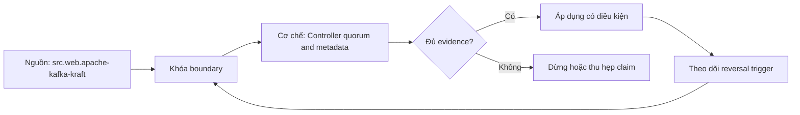

# Controller quorum and metadata

> [!abstract] Câu hỏi trung tâm
> KRaft controller quorum lưu và commit cluster metadata thế nào, và failure của nó khác broker data-plane failure ra sao?

## 1. Metadata plane

Topics, partitions, configs, assignments and broker registrations are cluster metadata separate from user record logs. Đừng bắt đầu bằng tên công cụ. Hãy bắt đầu bằng đối tượng được bảo vệ, boundary quan sát được và hậu quả nếu kết luận sai. Trong bài `Controller quorum and metadata`, câu hỏi thực dụng là: KRaft controller quorum lưu và commit cluster metadata thế nào, và failure của nó khác broker data-plane failure ra sao? Ta ghi rõ grain, population, time window, owner và hành động sau failure; nếu một trường chưa biết thì đánh dấu unknown thay vì lấp bằng mặc định. Bằng chứng tối thiểu gồm fixture có version, cấu hình hoặc rule đã resolve, raw observation, expected result và limitation. Phần này là curriculum synthesis dựa trên các nguồn đã định danh, không phải lời hứa rằng mọi adapter hay deployment đều có cùng hành vi.

## 2. Controller roles

Controllers form quorum with active leader/hot standbys; brokers discover active controller and consume metadata updates. Điểm khó không nằm ở cú pháp mà ở identity và scope. Hai phép đo cùng tên vẫn có thể nói về hai population hoặc hai thời điểm khác nhau. Trong bài `Controller quorum and metadata`, câu hỏi thực dụng là: KRaft controller quorum lưu và commit cluster metadata thế nào, và failure của nó khác broker data-plane failure ra sao? Ta ghi rõ grain, population, time window, owner và hành động sau failure; nếu một trường chưa biết thì đánh dấu unknown thay vì lấp bằng mặc định. Bằng chứng tối thiểu gồm fixture có version, cấu hình hoặc rule đã resolve, raw observation, expected result và limitation. Phần này là curriculum synthesis dựa trên các nguồn đã định danh, không phải lời hứa rằng mọi adapter hay deployment đều có cùng hành vi.

## 3. Metadata log

Changes are records in replicated metadata log with snapshots/replay; cluster ID, node/directory identity protect bootstrap. Một dashboard xanh chỉ là tín hiệu. Muốn biến nó thành bằng chứng phải giữ input, phiên bản, rule, trạng thái trước–sau và cách tính độc lập. Trong bài `Controller quorum and metadata`, câu hỏi thực dụng là: KRaft controller quorum lưu và commit cluster metadata thế nào, và failure của nó khác broker data-plane failure ra sao? Ta ghi rõ grain, population, time window, owner và hành động sau failure; nếu một trường chưa biết thì đánh dấu unknown thay vì lấp bằng mặc định. Bằng chứng tối thiểu gồm fixture có version, cấu hình hoặc rule đã resolve, raw observation, expected result và limitation. Phần này là curriculum synthesis dựa trên các nguồn đã định danh, không phải lời hứa rằng mọi adapter hay deployment đều có cùng hành vi.

## 4. Quorum availability

Majority controllers required for progress; 2N+1 voters tolerate N failures under stated assumptions. Thiết kế tốt phải chịu được counterexample. Hãy chủ động tạo case sát boundary, case thiếu dữ liệu và case replay thay vì chỉ chạy happy path. Trong bài `Controller quorum and metadata`, câu hỏi thực dụng là: KRaft controller quorum lưu và commit cluster metadata thế nào, và failure của nó khác broker data-plane failure ra sao? Ta ghi rõ grain, population, time window, owner và hành động sau failure; nếu một trường chưa biết thì đánh dấu unknown thay vì lấp bằng mặc định. Bằng chứng tối thiểu gồm fixture có version, cấu hình hoặc rule đã resolve, raw observation, expected result và limitation. Phần này là curriculum synthesis dựa trên các nguồn đã định danh, không phải lời hứa rằng mọi adapter hay deployment đều có cùng hành vi.

## 5. Operational modes

Static/dynamic quorum and feature/metadata versions change procedures; current docs/version must be pinned before mutations. Chi phí vận hành thuộc contract. Một rule đúng nhưng quá đắt, quá ồn hoặc không có owner sẽ nhanh chóng bị tắt và mất tác dụng. Trong bài `Controller quorum and metadata`, câu hỏi thực dụng là: KRaft controller quorum lưu và commit cluster metadata thế nào, và failure của nó khác broker data-plane failure ra sao? Ta ghi rõ grain, population, time window, owner và hành động sau failure; nếu một trường chưa biết thì đánh dấu unknown thay vì lấp bằng mặc định. Bằng chứng tối thiểu gồm fixture có version, cấu hình hoặc rule đã resolve, raw observation, expected result và limitation. Phần này là curriculum synthesis dựa trên các nguồn đã định danh, không phải lời hứa rằng mọi adapter hay deployment đều có cùng hành vi.

## 6. Recovery test

Lose leader/minority, inspect quorum status/HW/lag, recover controller and verify metadata state without reformatting committed identity. Kết luận cần có điều kiện đảo chiều. Khi volume, latency, nguồn thẩm quyền hoặc topology đổi, quyết định cũ phải được xem xét lại bằng cùng một oracle. Trong bài `Controller quorum and metadata`, câu hỏi thực dụng là: KRaft controller quorum lưu và commit cluster metadata thế nào, và failure của nó khác broker data-plane failure ra sao? Ta ghi rõ grain, population, time window, owner và hành động sau failure; nếu một trường chưa biết thì đánh dấu unknown thay vì lấp bằng mặc định. Bằng chứng tối thiểu gồm fixture có version, cấu hình hoặc rule đã resolve, raw observation, expected result và limitation. Phần này là curriculum synthesis dựa trên các nguồn đã định danh, không phải lời hứa rằng mọi adapter hay deployment đều có cùng hành vi.

## 7. Ma trận kiểm chứng từng mệnh đề

Với `wiki.streaming.kafka-kraft-controller-quorum`, command thành công không tự chứng minh dữ liệu đúng. Protocol riêng của bài là: Chạy Kafka 4.2-compatible sandbox hoặc protocol fixture, inject precise kill/failover point and compare visible records, offsets or metadata state. Mỗi probe dưới đây phải nối input boundary với failure signal và oracle có thể phản bác kết luận.

### 7.1. Controller quorum and metadata: kiểm `Metadata plane` bằng case 1, cụ thể topics, partitions, configs, assignments and broker registrations are cluster metadata separate from user record logs

**Mệnh đề cần kiểm.** Controller quorum and metadata: kiểm `Metadata plane` bằng case 1, cụ thể topics, partitions, configs, assignments and broker registrations are cluster metadata separate from user record logs.

**Thiết kế phép thử cho `wiki.streaming.kafka-kraft-controller-quorum`.** Trong ngữ cảnh `wiki.streaming.kafka-kraft-controller-quorum`, tạo positive control và negative control chỉ khác đúng một điều kiện. Khóa input snapshot, phiên bản và owner của rule; chạy đúng population được bài `Controller quorum and metadata` công bố.

**Bằng chứng cần giữ.** Đối với probe 1 của `Controller quorum and metadata`, giữ fixture, raw failing rows và lệnh tái hiện. Nếu chưa chạy lab, ghi expected evidence và giữ trạng thái review; không biến protocol thành observation.

### 7.2. Controller quorum and metadata: kiểm `Controller roles` bằng case 2, cụ thể controllers form quorum with active leader/hot standbys; brokers discover active controller and consume metadata updates

**Mệnh đề cần kiểm.** Controller quorum and metadata: kiểm `Controller roles` bằng case 2, cụ thể controllers form quorum with active leader/hot standbys; brokers discover active controller and consume metadata updates.

**Thiết kế phép thử cho `wiki.streaming.kafka-kraft-controller-quorum`.** Trong ngữ cảnh `wiki.streaming.kafka-kraft-controller-quorum`, đổi grain nhưng giữ tổng số dòng để lộ phép đo sai cấp. Khóa input snapshot, phiên bản và owner của rule; chạy đúng population được bài `Controller quorum and metadata` công bố.

**Bằng chứng cần giữ.** Đối với probe 2 của `Controller quorum and metadata`, báo numerator, denominator và key set ở cả hai grain. Nếu chưa chạy lab, ghi expected evidence và giữ trạng thái review; không biến protocol thành observation.

### 7.3. Controller quorum and metadata: kiểm `Metadata log` bằng case 3, cụ thể changes are records in replicated metadata log with snapshots/replay; cluster id, node/directory identity protect bootstrap

**Mệnh đề cần kiểm.** Controller quorum and metadata: kiểm `Metadata log` bằng case 3, cụ thể changes are records in replicated metadata log with snapshots/replay; cluster id, node/directory identity protect bootstrap.

**Thiết kế phép thử cho `wiki.streaming.kafka-kraft-controller-quorum`.** Trong ngữ cảnh `wiki.streaming.kafka-kraft-controller-quorum`, đưa một giá trị tới đúng boundary và một giá trị vượt boundary. Khóa input snapshot, phiên bản và owner của rule; chạy đúng population được bài `Controller quorum and metadata` công bố.

**Bằng chứng cần giữ.** Đối với probe 3 của `Controller quorum and metadata`, lưu hai observed values cùng rule đã resolve. Nếu chưa chạy lab, ghi expected evidence và giữ trạng thái review; không biến protocol thành observation.

### 7.4. Controller quorum and metadata: kiểm `Quorum availability` bằng case 4, cụ thể majority controllers required for progress; 2n+1 voters tolerate n failures under stated assumptions

**Mệnh đề cần kiểm.** Controller quorum and metadata: kiểm `Quorum availability` bằng case 4, cụ thể majority controllers required for progress; 2n+1 voters tolerate n failures under stated assumptions.

**Thiết kế phép thử cho `wiki.streaming.kafka-kraft-controller-quorum`.** Trong ngữ cảnh `wiki.streaming.kafka-kraft-controller-quorum`, kill tiến trình ngay trước rồi ngay sau durable side effect. Khóa input snapshot, phiên bản và owner của rule; chạy đúng population được bài `Controller quorum and metadata` công bố.

**Bằng chứng cần giữ.** Đối với probe 4 của `Controller quorum and metadata`, lưu checkpoint, external ledger và trạng thái sau restart. Nếu chưa chạy lab, ghi expected evidence và giữ trạng thái review; không biến protocol thành observation.

### 7.5. Controller quorum and metadata: kiểm `Operational modes` bằng case 5, cụ thể static/dynamic quorum and feature/metadata versions change procedures; current docs/version must be pinned before mutations

**Mệnh đề cần kiểm.** Controller quorum and metadata: kiểm `Operational modes` bằng case 5, cụ thể static/dynamic quorum and feature/metadata versions change procedures; current docs/version must be pinned before mutations.

**Thiết kế phép thử cho `wiki.streaming.kafka-kraft-controller-quorum`.** Trong ngữ cảnh `wiki.streaming.kafka-kraft-controller-quorum`, đảo thứ tự input và concurrency nhưng giữ logical population. Khóa input snapshot, phiên bản và owner của rule; chạy đúng population được bài `Controller quorum and metadata` công bố.

**Bằng chứng cần giữ.** Đối với probe 5 của `Controller quorum and metadata`, so canonical hash và business totals giữa các thứ tự. Nếu chưa chạy lab, ghi expected evidence và giữ trạng thái review; không biến protocol thành observation.

### 7.6. Controller quorum and metadata: kiểm `Recovery test` bằng case 6, cụ thể lose leader/minority, inspect quorum status/hw/lag, recover controller and verify metadata state without reformatting committed identity

**Mệnh đề cần kiểm.** Controller quorum and metadata: kiểm `Recovery test` bằng case 6, cụ thể lose leader/minority, inspect quorum status/hw/lag, recover controller and verify metadata state without reformatting committed identity.

**Thiết kế phép thử cho `wiki.streaming.kafka-kraft-controller-quorum`.** Trong ngữ cảnh `wiki.streaming.kafka-kraft-controller-quorum`, replay cùng identity với payload giống rồi payload xung đột. Khóa input snapshot, phiên bản và owner của rule; chạy đúng population được bài `Controller quorum and metadata` công bố.

**Bằng chứng cần giữ.** Đối với probe 6 của `Controller quorum and metadata`, tách duplicate replay khỏi identity collision bằng reason code. Nếu chưa chạy lab, ghi expected evidence và giữ trạng thái review; không biến protocol thành observation.

### 7.7. Controller quorum and metadata: kiểm `Metadata plane` bằng case 7, cụ thể topics, partitions, configs, assignments and broker registrations are cluster metadata separate from user record logs

**Mệnh đề cần kiểm.** Controller quorum and metadata: kiểm `Metadata plane` bằng case 7, cụ thể topics, partitions, configs, assignments and broker registrations are cluster metadata separate from user record logs.

**Thiết kế phép thử cho `wiki.streaming.kafka-kraft-controller-quorum`.** Trong ngữ cảnh `wiki.streaming.kafka-kraft-controller-quorum`, thêm record tới trễ trong horizon và ngoài horizon. Khóa input snapshot, phiên bản và owner của rule; chạy đúng population được bài `Controller quorum and metadata` công bố.

**Bằng chứng cần giữ.** Đối với probe 7 của `Controller quorum and metadata`, báo accepted-late, rejected-late và oldest outstanding timestamp. Nếu chưa chạy lab, ghi expected evidence và giữ trạng thái review; không biến protocol thành observation.

### 7.8. Controller quorum and metadata: kiểm `Controller roles` bằng case 8, cụ thể controllers form quorum with active leader/hot standbys; brokers discover active controller and consume metadata updates

**Mệnh đề cần kiểm.** Controller quorum and metadata: kiểm `Controller roles` bằng case 8, cụ thể controllers form quorum with active leader/hot standbys; brokers discover active controller and consume metadata updates.

**Thiết kế phép thử cho `wiki.streaming.kafka-kraft-controller-quorum`.** Trong ngữ cảnh `wiki.streaming.kafka-kraft-controller-quorum`, đổi schema theo một cách tương thích rồi một cách phá vỡ semantics. Khóa input snapshot, phiên bản và owner của rule; chạy đúng population được bài `Controller quorum and metadata` công bố.

**Bằng chứng cần giữ.** Đối với probe 8 của `Controller quorum and metadata`, giữ schema diff, classification và consumer-visible result. Nếu chưa chạy lab, ghi expected evidence và giữ trạng thái review; không biến protocol thành observation.

### 7.9. Controller quorum and metadata: kiểm `Metadata log` bằng case 9, cụ thể changes are records in replicated metadata log with snapshots/replay; cluster id, node/directory identity protect bootstrap

**Mệnh đề cần kiểm.** Controller quorum and metadata: kiểm `Metadata log` bằng case 9, cụ thể changes are records in replicated metadata log with snapshots/replay; cluster id, node/directory identity protect bootstrap.

**Thiết kế phép thử cho `wiki.streaming.kafka-kraft-controller-quorum`.** Trong ngữ cảnh `wiki.streaming.kafka-kraft-controller-quorum`, tạo missing và duplicate bù nhau để count tổng không đổi. Khóa input snapshot, phiên bản và owner của rule; chạy đúng population được bài `Controller quorum and metadata` công bố.

**Bằng chứng cần giữ.** Đối với probe 9 của `Controller quorum and metadata`, so key multiset và typed hashes thay vì chỉ row count. Nếu chưa chạy lab, ghi expected evidence và giữ trạng thái review; không biến protocol thành observation.

### 7.10. Controller quorum and metadata: kiểm `Quorum availability` bằng case 10, cụ thể majority controllers required for progress; 2n+1 voters tolerate n failures under stated assumptions

**Mệnh đề cần kiểm.** Controller quorum and metadata: kiểm `Quorum availability` bằng case 10, cụ thể majority controllers required for progress; 2n+1 voters tolerate n failures under stated assumptions.

**Thiết kế phép thử cho `wiki.streaming.kafka-kraft-controller-quorum`.** Trong ngữ cảnh `wiki.streaming.kafka-kraft-controller-quorum`, cho reviewer tái hiện chỉ từ evidence package. Khóa input snapshot, phiên bản và owner của rule; chạy đúng population được bài `Controller quorum and metadata` công bố.

**Bằng chứng cần giữ.** Đối với probe 10 của `Controller quorum and metadata`, package phải đủ để người khác dựng lại decision và limitation. Nếu chưa chạy lab, ghi expected evidence và giữ trạng thái review; không biến protocol thành observation.

### 7.11. Controller quorum and metadata: kiểm `Operational modes` bằng case 11, cụ thể static/dynamic quorum and feature/metadata versions change procedures; current docs/version must be pinned before mutations

**Mệnh đề cần kiểm.** Controller quorum and metadata: kiểm `Operational modes` bằng case 11, cụ thể static/dynamic quorum and feature/metadata versions change procedures; current docs/version must be pinned before mutations.

**Thiết kế phép thử cho `wiki.streaming.kafka-kraft-controller-quorum`.** Trong ngữ cảnh `wiki.streaming.kafka-kraft-controller-quorum`, so với oracle độc lập không dùng chung query hoặc parser. Khóa input snapshot, phiên bản và owner của rule; chạy đúng population được bài `Controller quorum and metadata` công bố.

**Bằng chứng cần giữ.** Đối với probe 11 của `Controller quorum and metadata`, independent result phải khớp ở grain đã công bố. Nếu chưa chạy lab, ghi expected evidence và giữ trạng thái review; không biến protocol thành observation.

### 7.12. Controller quorum and metadata: kiểm `Recovery test` bằng case 12, cụ thể lose leader/minority, inspect quorum status/hw/lag, recover controller and verify metadata state without reformatting committed identity

**Mệnh đề cần kiểm.** Controller quorum and metadata: kiểm `Recovery test` bằng case 12, cụ thể lose leader/minority, inspect quorum status/hw/lag, recover controller and verify metadata state without reformatting committed identity.

**Thiết kế phép thử cho `wiki.streaming.kafka-kraft-controller-quorum`.** Trong ngữ cảnh `wiki.streaming.kafka-kraft-controller-quorum`, chạy scope hẹp và population đầy đủ rồi công bố phần bị loại. Khóa input snapshot, phiên bản và owner của rule; chạy đúng population được bài `Controller quorum and metadata` công bố.

**Bằng chứng cần giữ.** Đối với probe 12 của `Controller quorum and metadata`, coverage phải nêu rõ excluded nodes, partitions hoặc incidents. Nếu chưa chạy lab, ghi expected evidence và giữ trạng thái review; không biến protocol thành observation.

### 7.13. Controller quorum and metadata: kiểm `Metadata plane` bằng case 13, cụ thể topics, partitions, configs, assignments and broker registrations are cluster metadata separate from user record logs

**Mệnh đề cần kiểm.** Controller quorum and metadata: kiểm `Metadata plane` bằng case 13, cụ thể topics, partitions, configs, assignments and broker registrations are cluster metadata separate from user record logs.

**Thiết kế phép thử cho `wiki.streaming.kafka-kraft-controller-quorum`.** Trong ngữ cảnh `wiki.streaming.kafka-kraft-controller-quorum`, thử timezone, precision hoặc partition ở hai phía của ranh giới. Khóa input snapshot, phiên bản và owner của rule; chạy đúng population được bài `Controller quorum and metadata` công bố.

**Bằng chứng cần giữ.** Đối với probe 13 của `Controller quorum and metadata`, UTC/local interval và rounding policy phải hiện trong output. Nếu chưa chạy lab, ghi expected evidence và giữ trạng thái review; không biến protocol thành observation.

### 7.14. Controller quorum and metadata: kiểm `Controller roles` bằng case 14, cụ thể controllers form quorum with active leader/hot standbys; brokers discover active controller and consume metadata updates

**Mệnh đề cần kiểm.** Controller quorum and metadata: kiểm `Controller roles` bằng case 14, cụ thể controllers form quorum with active leader/hot standbys; brokers discover active controller and consume metadata updates.

**Thiết kế phép thử cho `wiki.streaming.kafka-kraft-controller-quorum`.** Trong ngữ cảnh `wiki.streaming.kafka-kraft-controller-quorum`, đổi constraint đủ lớn để quyết định phải đảo. Khóa input snapshot, phiên bản và owner của rule; chạy đúng population được bài `Controller quorum and metadata` công bố.

**Bằng chứng cần giữ.** Đối với probe 14 của `Controller quorum and metadata`, ADR phải lưu changed constraint và reversal threshold. Nếu chưa chạy lab, ghi expected evidence và giữ trạng thái review; không biến protocol thành observation.

### 7.15. Controller quorum and metadata: kiểm `Metadata log` bằng case 15, cụ thể changes are records in replicated metadata log with snapshots/replay; cluster id, node/directory identity protect bootstrap

**Mệnh đề cần kiểm.** Controller quorum and metadata: kiểm `Metadata log` bằng case 15, cụ thể changes are records in replicated metadata log with snapshots/replay; cluster id, node/directory identity protect bootstrap.

**Thiết kế phép thử cho `wiki.streaming.kafka-kraft-controller-quorum`.** Trong ngữ cảnh `wiki.streaming.kafka-kraft-controller-quorum`, chạy lại từ môi trường sạch với versions và seed đã khóa. Khóa input snapshot, phiên bản và owner của rule; chạy đúng population được bài `Controller quorum and metadata` công bố.

**Bằng chứng cần giữ.** Đối với probe 15 của `Controller quorum and metadata`, canonical result phải ổn định hoặc mọi nondeterminism phải được giải thích. Nếu chưa chạy lab, ghi expected evidence và giữ trạng thái review; không biến protocol thành observation.

## 8. Quy trình phản biện

1. Viết consumer-visible invariant cho `Controller quorum and metadata` trước khi chọn query hoặc tool.
2. Khóa grain, identity, population, time window và authoritative source.
3. Phân biệt declared configuration, executed state và published state.
4. Chạy negative control, replay hoặc changed-assumption case phù hợp.
5. Đối soát bằng oracle độc lập; công bố coverage và phần không quan sát được.
6. Gắn owner, hành động, reversal trigger và hạn review cho kết luận.

## 9. Câu hỏi tự kiểm tra

1. `Controller quorum and metadata: kiểm `Metadata plane` bằng case 1, cụ thể topics, partitions, configs, assignments and broker registrations are cluster metadata separate from user record logs` thất bại đầu tiên ở boundary nào?
2. Artifact nào mạnh nhất để trả lời `Controller quorum and metadata: kiểm `Metadata log` bằng case 3, cụ thể changes are records in replicated metadata log with snapshots/replay; cluster id, node/directory identity protect bootstrap`?
3. Counterexample nhỏ nhất cho `Controller quorum and metadata: kiểm `Recovery test` bằng case 6, cụ thể lose leader/minority, inspect quorum status/hw/lag, recover controller and verify metadata state without reformatting committed identity` gồm những state nào?
4. `Controller quorum and metadata: kiểm `Metadata log` bằng case 9, cụ thể changes are records in replicated metadata log with snapshots/replay; cluster id, node/directory identity protect bootstrap` có thể xanh giả ra sao?
5. Constraint nào khiến quyết định ở `Controller quorum and metadata: kiểm `Controller roles` bằng case 14, cụ thể controllers form quorum with active leader/hot standbys; brokers discover active controller and consume metadata updates` phải đảo?
6. Phần nào của `Controller quorum and metadata: kiểm `Metadata log` bằng case 15, cụ thể changes are records in replicated metadata log with snapshots/replay; cluster id, node/directory identity protect bootstrap` mới là protocol, chưa phải observation?

## 10. Giới hạn và điều chưa cho phép kết luận

- Lab của `Controller quorum and metadata` chưa chạy trên hệ thống production; nội dung là giáo trình và expected evidence.
- Hành vi phụ thuộc phiên bản, connector, scheduler, warehouse và catalog configuration phải được kiểm lại.
- Các ma trận, ladder và threshold do giáo trình tổng hợp không được gán nguyên văn cho vendor.
- Note giữ trạng thái `review` cho tới khi owner duyệt semantics và learner artifact.

## Reference
1. [[SRC-APACHE-KAFKA-KRAFT]]
2. [[SRC-APACHE-KAFKA-DESIGN]]

## Source coverage

| Source slice | Nội dung sử dụng | Trạng thái |
|---|---|---|
| [[SRC-APACHE-KAFKA-KRAFT]] | Contract hoặc cơ chế liên quan trực tiếp tới `Controller quorum and metadata` | Đã đọc locator; cần pin version khi chạy lab |
| [[SRC-APACHE-KAFKA-DESIGN]] | Contract hoặc cơ chế liên quan trực tiếp tới `Controller quorum and metadata` | Đã đọc locator; cần pin version khi chạy lab |

## Key takeaways
- KRaft controller quorum is the metadata control plane, distinct from broker record storage.
- Với `wiki.streaming.kafka-kraft-controller-quorum`, quality của kết luận phụ thuộc identity, coverage và oracle chứ không phụ thuộc màu dashboard.
- Câu hỏi `KRaft controller quorum lưu và commit cluster metadata thế nào, và failure của nó khác broker data-plane failure ra sao?` chỉ được trả lời trong scope và version đã ghi.
- Các source IDs `src.web.apache-kafka-kraft, src.web.apache-kafka-design` đặt ranh giới cho source fact; phần còn lại là synthesis có nhãn.
- Trước khi lab chạy, đây là note đã kiểm cấu trúc và provenance, chưa phải chứng nhận production.

<!-- ATOMIC-EXECUTION-CAPSULE:START -->

## Execution capsule — kiểm chứng `wiki.streaming.kafka-kraft-controller-quorum`

> [!important] Phân loại mệnh đề
> Với `wiki.streaming.kafka-kraft-controller-quorum`, sơ đồ, ví dụ và artifact về **Controller quorum and metadata** là **synthesis để kiểm chứng**; chúng không phải trích dẫn hay case nguyên văn của nguồn.

### Sơ đồ cơ chế và điểm kiểm soát



Đọc sơ đồ `wiki.streaming.kafka-kraft-controller-quorum` từ trái sang phải: source chỉ cung cấp claim ban đầu cho **Controller quorum and metadata**; quyết định chỉ được đi tiếp sau khi boundary, evidence và điều kiện đảo quyết định đã hiện hữu.

### Artifact thực thi tối thiểu

```sql
-- Verification harness for: Controller quorum and metadata
WITH evidence AS (
    SELECT 'wiki.streaming.kafka-kraft-controller-quorum' AS concept_id,
           'boundary_declared' AS check_name, 1 AS passed
    UNION ALL
    SELECT 'wiki.streaming.kafka-kraft-controller-quorum', 'independent_oracle', 1
    UNION ALL
    SELECT 'wiki.streaming.kafka-kraft-controller-quorum', 'reversal_trigger_recorded', 1
)
SELECT concept_id,
       MIN(passed) AS all_hard_checks_pass,
       COUNT(*) AS evidence_items
FROM evidence
GROUP BY concept_id
HAVING MIN(passed) = 1;
```

Artifact của `wiki.streaming.kafka-kraft-controller-quorum` buộc người dùng ghi boundary, oracle và reversal trigger cho **Controller quorum and metadata**. Các giá trị minh họa phải được thay bằng evidence thật trước khi dùng cho quyết định.

### Tự kiểm tra trước khi tái sử dụng

1. Bạn có thể trả lời `KRaft controller quorum lưu và commit cluster metadata thế nào, và failure của nó khác broker data-plane failure ra sao?` bằng một câu mà không kéo thêm concept thứ hai không?
2. Source locator nào đỡ cho claim, và phần nào chỉ là synthesis trong note?
3. Observation nào khiến bạn dừng, thu hẹp hoặc đảo quyết định?
4. Artifact nào cho phép một reviewer độc lập tái hiện kết quả?

<!-- ATOMIC-EXECUTION-CAPSULE:END -->
