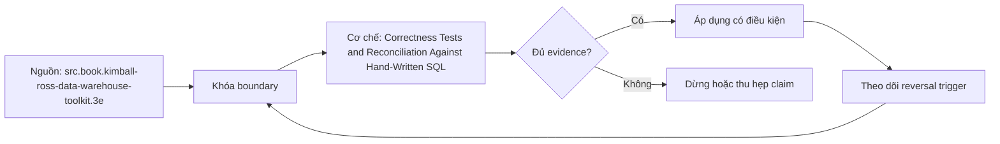

# Correctness Tests and Reconciliation Against Hand-Written SQL

> [!abstract] Câu hỏi trung tâm
> Làm sao tạo oracle độc lập và fixture cố định đủ sức chứng minh năm metrics đúng ở ba grains qua sáu failure modes?

## 1. Oracle phải độc lập về nguồn suy luận

Hand-written SQL chỉ là oracle khi tác giả nhận metric contract và atomic source schema, không nhận generated SQL, semantic macro hay implementation expression. Reviewer khác viết giúp giảm common-mode error nhưng chưa đủ; cần trace từng predicate, join và aggregation về contract. Oracle nhỏ, rõ và ưu tiên hand calculation trên fixture. Nếu cả oracle lẫn engine cùng dựa mart sai grain, agreement không chứng minh business truth; fixture phải bao gồm atomic facts và expected values.

## 2. Ma trận 18 ô và 90 phép so

Ba grains nhân sáu scenario tạo 18 ô dữ liệu. Vì có năm metrics, mỗi ô chứa năm comparisons, tổng 90 metric-cell assertions chứ không chỉ 18 con số. Báo cáo nên tách matrix cell status và metric-level delta để biết lỗi thuộc scenario, grain hay metric. Các grains phải làm lộ failure khác nhau: detail/base, intermediate như customer-month và coarse như fiscal-quarter/region; ba aliases của cùng GROUP BY không tạo coverage.

## 3. Sáu fixture bắt buộc

Null case kiểm SUM/COUNT/ratio denominator và empty group. Duplicate case phân biệt duplicate event bất hợp lệ với hai events hợp lệ cùng amount. Refund/negative case kiểm sign và population. Late-arriving case khóa as-of/cutoff và restatement policy. SCD case yêu cầu event-time join vào đúng effective interval. Fiscal-boundary case kiểm timezone, inclusive/exclusive bounds và calendar mapping. Mỗi fixture chỉ nên tối thiểu nhưng phải có control rows để lỗi quan sát được.

## 4. Bất biến bổ sung oracle

Child totals bằng parent chỉ đúng khi partitions exhaustive và non-overlapping. Ratio range chỉ áp khi domain/denominator contract cho phép. Non-negative chỉ hợp lệ nếu refunds/adjustments bị cấm hoặc tách riêng. Invariant phải ghi preconditions; nếu không, test có thể chặn dữ liệu hợp lệ. Với ratio, so numerator và denominator trước value; distinct count so entity sets; balance so selected snapshots. Bất biến không thay oracle độc lập mà bổ sung tín hiệu khoanh vùng.

## 5. So khớp chính xác và tolerance

Currency lưu decimal/integer minor units và deterministic sums có thể yêu cầu exact match. Floating point, approximate distinct hoặc percentile cần tolerance/error-bound trong metric contract; tự đặt epsilon sau khi fail là thay tiêu chí. So null với zero theo contract, normalize ordering nhưng không normalize away duplicate rows. Mỗi mismatch lưu expected, actual, absolute/relative delta, affected keys và intermediate components.

## 6. Regression trên cùng immutable fixture

Definition before/after phải chạy trên cùng seed snapshot, semantic graph, warehouse/session settings và oracle version. Expected change manifest liệt kê metrics, grains, populations và direction/magnitude dự kiến. Regression engine phân biệt intended delta, collateral delta và unchanged cells. Nếu fixture thay cùng lúc definition, không thể quy nguyên nhân. Fingerprint data, config, generated SQL và outputs cho mỗi run.

## 7. Tự động hóa và quyền phê duyệt

Daily reconciliation có value khi failures tạo artifact đủ triage: first divergent stage, affected cases, owner và links. Five metrics × 18 cells phải chạy tự động; một injected definition change chứng minh harness liệt kê chính xác intended cells. Passing fixture không cấp production certification nếu source freshness, access context hoặc full-scale behavior chưa kiểm. Owner vẫn cần duyệt business meaning và tolerance contract.

## 8. Ma trận kiểm chứng từng mệnh đề

Mọi mệnh đề dưới đây cần fixture, invariant, independent oracle và output lưu được. Compile thành công hoặc con số nhìn hợp lý không đủ làm bằng chứng.

### 8.1. oracle writer chỉ nhận contract và atomic schema

**Mệnh đề cần kiểm.** oracle writer chỉ nhận contract và atomic schema.

**Cách kiểm.** Khóa atomic fixture gồm six edge cases, tạo 18 scenario-grain cells và five metrics per cell. Dùng oracle độc lập, compare intermediate components, rồi chạy same fixture trước/sau một definition change. Với mệnh đề này, ghi data shape gây lỗi, expected result và failure signal. Không dùng generated query làm oracle cho chính nó.

**Bằng chứng đạt cho `wiki.semantic-layer.correctness-reconciliation`.** Lưu contract/graph/config version, seed snapshot, command/SQL, raw output, row/multiplicity ledger và semantic diff. Nếu chưa chạy tool/lab, trạng thái chỉ là test protocol.

### 8.2. oracle không reuse semantic macro

**Mệnh đề cần kiểm.** oracle không reuse semantic macro.

**Cách kiểm.** Khóa atomic fixture gồm six edge cases, tạo 18 scenario-grain cells và five metrics per cell. Dùng oracle độc lập, compare intermediate components, rồi chạy same fixture trước/sau một definition change. Với mệnh đề này, ghi data shape gây lỗi, expected result và failure signal. Không dùng generated query làm oracle cho chính nó.

**Bằng chứng đạt cho `wiki.semantic-layer.correctness-reconciliation`.** Lưu contract/graph/config version, seed snapshot, command/SQL, raw output, row/multiplicity ledger và semantic diff. Nếu chưa chạy tool/lab, trạng thái chỉ là test protocol.

### 8.3. agreement trên cùng mart sai không chứng minh truth

**Mệnh đề cần kiểm.** agreement trên cùng mart sai không chứng minh truth.

**Cách kiểm.** Khóa atomic fixture gồm six edge cases, tạo 18 scenario-grain cells và five metrics per cell. Dùng oracle độc lập, compare intermediate components, rồi chạy same fixture trước/sau một definition change. Với mệnh đề này, ghi data shape gây lỗi, expected result và failure signal. Không dùng generated query làm oracle cho chính nó.

**Bằng chứng đạt cho `wiki.semantic-layer.correctness-reconciliation`.** Lưu contract/graph/config version, seed snapshot, command/SQL, raw output, row/multiplicity ledger và semantic diff. Nếu chưa chạy tool/lab, trạng thái chỉ là test protocol.

### 8.4. 18 cells chứa 90 metric comparisons

**Mệnh đề cần kiểm.** 18 cells chứa 90 metric comparisons.

**Cách kiểm.** Khóa atomic fixture gồm six edge cases, tạo 18 scenario-grain cells và five metrics per cell. Dùng oracle độc lập, compare intermediate components, rồi chạy same fixture trước/sau một definition change. Với mệnh đề này, ghi data shape gây lỗi, expected result và failure signal. Không dùng generated query làm oracle cho chính nó.

**Bằng chứng đạt cho `wiki.semantic-layer.correctness-reconciliation`.** Lưu contract/graph/config version, seed snapshot, command/SQL, raw output, row/multiplicity ledger và semantic diff. Nếu chưa chạy tool/lab, trạng thái chỉ là test protocol.

### 8.5. three grains phải expose khác failure modes

**Mệnh đề cần kiểm.** three grains phải expose khác failure modes.

**Cách kiểm.** Khóa atomic fixture gồm six edge cases, tạo 18 scenario-grain cells và five metrics per cell. Dùng oracle độc lập, compare intermediate components, rồi chạy same fixture trước/sau một definition change. Với mệnh đề này, ghi data shape gây lỗi, expected result và failure signal. Không dùng generated query làm oracle cho chính nó.

**Bằng chứng đạt cho `wiki.semantic-layer.correctness-reconciliation`.** Lưu contract/graph/config version, seed snapshot, command/SQL, raw output, row/multiplicity ledger và semantic diff. Nếu chưa chạy tool/lab, trạng thái chỉ là test protocol.

### 8.6. null khác empty group và zero

**Mệnh đề cần kiểm.** null khác empty group và zero.

**Cách kiểm.** Khóa atomic fixture gồm six edge cases, tạo 18 scenario-grain cells và five metrics per cell. Dùng oracle độc lập, compare intermediate components, rồi chạy same fixture trước/sau một definition change. Với mệnh đề này, ghi data shape gây lỗi, expected result và failure signal. Không dùng generated query làm oracle cho chính nó.

**Bằng chứng đạt cho `wiki.semantic-layer.correctness-reconciliation`.** Lưu contract/graph/config version, seed snapshot, command/SQL, raw output, row/multiplicity ledger và semantic diff. Nếu chưa chạy tool/lab, trạng thái chỉ là test protocol.

### 8.7. duplicate event khác equal-valued valid events

**Mệnh đề cần kiểm.** duplicate event khác equal-valued valid events.

**Cách kiểm.** Khóa atomic fixture gồm six edge cases, tạo 18 scenario-grain cells và five metrics per cell. Dùng oracle độc lập, compare intermediate components, rồi chạy same fixture trước/sau một definition change. Với mệnh đề này, ghi data shape gây lỗi, expected result và failure signal. Không dùng generated query làm oracle cho chính nó.

**Bằng chứng đạt cho `wiki.semantic-layer.correctness-reconciliation`.** Lưu contract/graph/config version, seed snapshot, command/SQL, raw output, row/multiplicity ledger và semantic diff. Nếu chưa chạy tool/lab, trạng thái chỉ là test protocol.

### 8.8. late data cần cutoff/restatement policy

**Mệnh đề cần kiểm.** late data cần cutoff/restatement policy.

**Cách kiểm.** Khóa atomic fixture gồm six edge cases, tạo 18 scenario-grain cells và five metrics per cell. Dùng oracle độc lập, compare intermediate components, rồi chạy same fixture trước/sau một definition change. Với mệnh đề này, ghi data shape gây lỗi, expected result và failure signal. Không dùng generated query làm oracle cho chính nó.

**Bằng chứng đạt cho `wiki.semantic-layer.correctness-reconciliation`.** Lưu contract/graph/config version, seed snapshot, command/SQL, raw output, row/multiplicity ledger và semantic diff. Nếu chưa chạy tool/lab, trạng thái chỉ là test protocol.

### 8.9. SCD join phải dùng event time

**Mệnh đề cần kiểm.** SCD join phải dùng event time.

**Cách kiểm.** Khóa atomic fixture gồm six edge cases, tạo 18 scenario-grain cells và five metrics per cell. Dùng oracle độc lập, compare intermediate components, rồi chạy same fixture trước/sau một definition change. Với mệnh đề này, ghi data shape gây lỗi, expected result và failure signal. Không dùng generated query làm oracle cho chính nó.

**Bằng chứng đạt cho `wiki.semantic-layer.correctness-reconciliation`.** Lưu contract/graph/config version, seed snapshot, command/SQL, raw output, row/multiplicity ledger và semantic diff. Nếu chưa chạy tool/lab, trạng thái chỉ là test protocol.

### 8.10. fiscal boundary cần timezone/calendar

**Mệnh đề cần kiểm.** fiscal boundary cần timezone/calendar.

**Cách kiểm.** Khóa atomic fixture gồm six edge cases, tạo 18 scenario-grain cells và five metrics per cell. Dùng oracle độc lập, compare intermediate components, rồi chạy same fixture trước/sau một definition change. Với mệnh đề này, ghi data shape gây lỗi, expected result và failure signal. Không dùng generated query làm oracle cho chính nó.

**Bằng chứng đạt cho `wiki.semantic-layer.correctness-reconciliation`.** Lưu contract/graph/config version, seed snapshot, command/SQL, raw output, row/multiplicity ledger và semantic diff. Nếu chưa chạy tool/lab, trạng thái chỉ là test protocol.

### 8.11. ratio compare numerator denominator first

**Mệnh đề cần kiểm.** ratio compare numerator denominator first.

**Cách kiểm.** Khóa atomic fixture gồm six edge cases, tạo 18 scenario-grain cells và five metrics per cell. Dùng oracle độc lập, compare intermediate components, rồi chạy same fixture trước/sau một definition change. Với mệnh đề này, ghi data shape gây lỗi, expected result và failure signal. Không dùng generated query làm oracle cho chính nó.

**Bằng chứng đạt cho `wiki.semantic-layer.correctness-reconciliation`.** Lưu contract/graph/config version, seed snapshot, command/SQL, raw output, row/multiplicity ledger và semantic diff. Nếu chưa chạy tool/lab, trạng thái chỉ là test protocol.

### 8.12. invariant cần preconditions

**Mệnh đề cần kiểm.** invariant cần preconditions.

**Cách kiểm.** Khóa atomic fixture gồm six edge cases, tạo 18 scenario-grain cells và five metrics per cell. Dùng oracle độc lập, compare intermediate components, rồi chạy same fixture trước/sau một definition change. Với mệnh đề này, ghi data shape gây lỗi, expected result và failure signal. Không dùng generated query làm oracle cho chính nó.

**Bằng chứng đạt cho `wiki.semantic-layer.correctness-reconciliation`.** Lưu contract/graph/config version, seed snapshot, command/SQL, raw output, row/multiplicity ledger và semantic diff. Nếu chưa chạy tool/lab, trạng thái chỉ là test protocol.

### 8.13. tolerance phải nằm trong contract trước run

**Mệnh đề cần kiểm.** tolerance phải nằm trong contract trước run.

**Cách kiểm.** Khóa atomic fixture gồm six edge cases, tạo 18 scenario-grain cells và five metrics per cell. Dùng oracle độc lập, compare intermediate components, rồi chạy same fixture trước/sau một definition change. Với mệnh đề này, ghi data shape gây lỗi, expected result và failure signal. Không dùng generated query làm oracle cho chính nó.

**Bằng chứng đạt cho `wiki.semantic-layer.correctness-reconciliation`.** Lưu contract/graph/config version, seed snapshot, command/SQL, raw output, row/multiplicity ledger và semantic diff. Nếu chưa chạy tool/lab, trạng thái chỉ là test protocol.

### 8.14. fixture phải immutable giữa versions

**Mệnh đề cần kiểm.** fixture phải immutable giữa versions.

**Cách kiểm.** Khóa atomic fixture gồm six edge cases, tạo 18 scenario-grain cells và five metrics per cell. Dùng oracle độc lập, compare intermediate components, rồi chạy same fixture trước/sau một definition change. Với mệnh đề này, ghi data shape gây lỗi, expected result và failure signal. Không dùng generated query làm oracle cho chính nó.

**Bằng chứng đạt cho `wiki.semantic-layer.correctness-reconciliation`.** Lưu contract/graph/config version, seed snapshot, command/SQL, raw output, row/multiplicity ledger và semantic diff. Nếu chưa chạy tool/lab, trạng thái chỉ là test protocol.

### 8.15. regression phải phân loại intended collateral unchanged

**Mệnh đề cần kiểm.** regression phải phân loại intended collateral unchanged.

**Cách kiểm.** Khóa atomic fixture gồm six edge cases, tạo 18 scenario-grain cells và five metrics per cell. Dùng oracle độc lập, compare intermediate components, rồi chạy same fixture trước/sau một definition change. Với mệnh đề này, ghi data shape gây lỗi, expected result và failure signal. Không dùng generated query làm oracle cho chính nó.

**Bằng chứng đạt cho `wiki.semantic-layer.correctness-reconciliation`.** Lưu contract/graph/config version, seed snapshot, command/SQL, raw output, row/multiplicity ledger và semantic diff. Nếu chưa chạy tool/lab, trạng thái chỉ là test protocol.

## 9. Quy trình phản biện

1. Viết population, grain, identities, time và aggregation trước tool syntax.
2. Gắn metric/dimension với qualified entity role và allowed path.
3. Đếm rows, distinct base keys, unmatched và match multiplicity sau từng join edge.
4. Dùng independent oracle từ atomic facts; so intermediate components trước final value.
5. Chạy invalid cases cùng valid siblings để bắt underblocking và overblocking.
6. Khóa exact tool/config/mart versions; compile output và diagnostics là version-specific evidence.
7. Lưu failed runs, limitations và trigger làm certification hết hiệu lực.

## 10. Câu hỏi tự kiểm tra

1. Join path nào được chọn và business role nào biện minh cho nó?
2. Base fact keys có bị nhân hoặc mất sau từng edge không?
3. Dimension có reachable, đúng grain và compatible với aggregation không?
4. Parse/validate/compile/reconciliation xác nhận những lớp khác nhau nào?
5. Generated SQL khác contract ở population, filter, path hay aggregation nào?
6. Bằng chứng nào độc lập với engine output đang được kiểm?

## 11. Giới hạn và điều chưa cho phép kết luận

- Chưa chạy MetricFlow, warehouse queries, execution plans hoặc labs; note mô tả protocol và expected evidence.
- dbt/MetricFlow docs được kiểm ngày 2026-10-01; commands và YAML phụ thuộc engine/version/environment.
- Thuật ngữ fan/chasm có thể khác giữa sản phẩm; invariant của bài là grain, multiplicity, population và semantic path.
- Kimball-Ross và PostgreSQL hỗ trợ modeling/SQL mechanics; compatibility/certification workflow là curriculum synthesis.
- Owner chưa phê duyệt semantic meaning nên note giữ trạng thái `review`.

## Reference
1. [[SRC-KIMBALL-ROSS-DW-TOOLKIT-3E]]
2. [[SRC-DBT-SEMANTIC-MODELS]]
3. [[SRC-POSTGRESQL-17-AGGREGATE-FUNCTIONS]]

## Source coverage

| Source slice | Nội dung sử dụng | Trạng thái |
|---|---|---|
| [[SRC-KIMBALL-ROSS-DW-TOOLKIT-3E]] | Modeling, SQL behavior hoặc current product semantics liên quan | Đã đọc phạm vi có locator; không suy ngoài phạm vi |
| [[SRC-DBT-SEMANTIC-MODELS]] | Modeling, SQL behavior hoặc current product semantics liên quan | Đã đọc phạm vi có locator; không suy ngoài phạm vi |
| [[SRC-POSTGRESQL-17-AGGREGATE-FUNCTIONS]] | Modeling, SQL behavior hoặc current product semantics liên quan | Đã đọc phạm vi có locator; không suy ngoài phạm vi |

## Key takeaways
- Join correctness phải được chứng minh bằng grain, multiplicity, unmatched ledger và independent oracle.
- Metric-dimension compatibility là rule ba trạng thái có lý do, không phải danh sách field tùy ý.
- Parse/validate/compile không thay reconciliation với business contract.
- Generated SQL phải được đọc theo population, path, aggregation và time/filter semantics.
- Chưa chạy protocol thì note là tài liệu học thuật có truy nguồn, không phải chứng nhận production.

<!-- ATOMIC-EXECUTION-CAPSULE:START -->

## Execution capsule: kiểm chứng `wiki.semantic-layer.correctness-reconciliation`

> [!important] Phân loại mệnh đề
> Với `wiki.semantic-layer.correctness-reconciliation`, sơ đồ, ví dụ và artifact về **Correctness Tests and Reconciliation Against Hand-Written SQL** là **synthesis để kiểm chứng**; chúng không phải trích dẫn hay case nguyên văn của nguồn.

### Sơ đồ cơ chế và điểm kiểm soát



Đọc sơ đồ `wiki.semantic-layer.correctness-reconciliation` từ trái sang phải: source chỉ cung cấp claim ban đầu cho **Correctness Tests and Reconciliation Against Hand-Written SQL**; quyết định chỉ được đi tiếp sau khi boundary, evidence và điều kiện đảo quyết định đã hiện hữu.

### Ví dụ làm việc có thể bác bỏ

**Input.** Một đội cần trả lời: Làm sao tạo oracle độc lập và fixture cố định đủ sức chứng minh năm metrics đúng ở ba grains qua sáu failure modes? cho một phạm vi nhỏ, có owner và deadline rõ.

**Decision.** Đội áp dụng **Correctness Tests and Reconciliation Against Hand-Written SQL** trên control và variant chỉ khác một assumption; expected result và hard constraints được khóa trước khi chạy.

**Outcome.** Với `wiki.semantic-layer.correctness-reconciliation`, nếu observation vi phạm hard constraint hoặc oracle độc lập không xác nhận **Correctness Tests and Reconciliation Against Hand-Written SQL**, đội thu hẹp claim hay đảo quyết định. Nếu đạt, kết luận vẫn kèm scope, version và review date; một lần thành công không được nâng thành quy luật phổ quát.

### Artifact thực thi tối thiểu

```sql
-- Verification harness for: Correctness Tests and Reconciliation Against Hand-Written SQL
WITH evidence AS (
    SELECT 'wiki.semantic-layer.correctness-reconciliation' AS concept_id,
           'boundary_declared' AS check_name, 1 AS passed
    UNION ALL
    SELECT 'wiki.semantic-layer.correctness-reconciliation', 'independent_oracle', 1
    UNION ALL
    SELECT 'wiki.semantic-layer.correctness-reconciliation', 'reversal_trigger_recorded', 1
)
SELECT concept_id,
       MIN(passed) AS all_hard_checks_pass,
       COUNT(*) AS evidence_items
FROM evidence
GROUP BY concept_id
HAVING MIN(passed) = 1;
```

Artifact của `wiki.semantic-layer.correctness-reconciliation` buộc người dùng ghi boundary, oracle và reversal trigger cho **Correctness Tests and Reconciliation Against Hand-Written SQL**. Các giá trị minh họa phải được thay bằng evidence thật trước khi dùng cho quyết định.

### Tự kiểm tra trước khi tái sử dụng

1. Bạn có thể trả lời `Làm sao tạo oracle độc lập và fixture cố định đủ sức chứng minh năm metrics đúng ở ba grains qua sáu failure modes?` bằng một câu mà không kéo thêm concept thứ hai không?
2. Source locator nào đỡ cho claim, và phần nào chỉ là synthesis trong note?
3. Observation nào khiến bạn dừng, thu hẹp hoặc đảo quyết định?
4. Artifact nào cho phép một reviewer độc lập tái hiện kết quả?

<!-- ATOMIC-EXECUTION-CAPSULE:END -->
